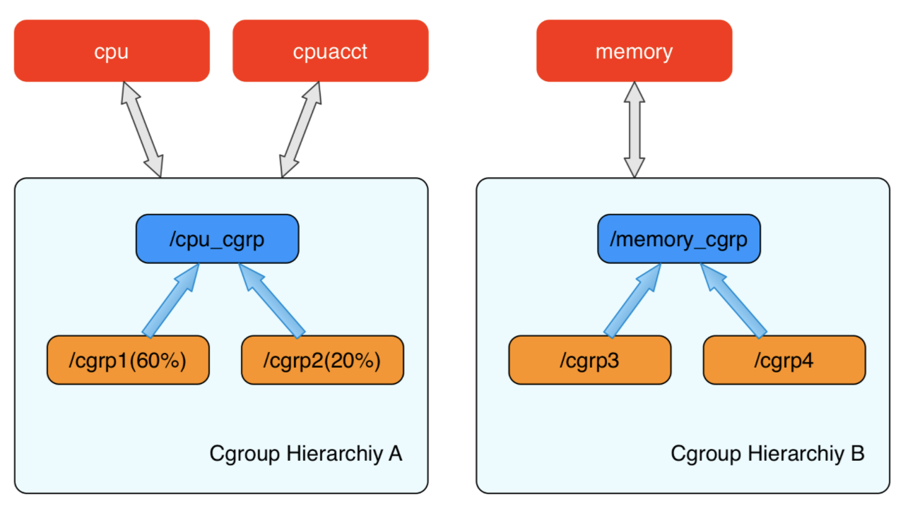

# Namespace

当一台物理主机（宿主机）运行容器的时候，为了避免容器所需系统资源之间相互干扰。所以Docker利用操作系统的隔离技术-NameSpace，来实现在同一个操作系统中，不同容器之间的资源独立隔离运行。

## 隔离系统资源列表

Linux NameSpace是Linux系统提供的一种资源隔离机制，可实现系统资源的列表如下：

|Mount|用于隔离文件系统的挂载点|
|:----|:----|
|UTS|用于隔离HostName和DomainName|
|IPC|用于隔离进程间通信|
|PID|用于隔离进程ID|
|NetWork|用于隔离网络|
|User|用于隔离用户和用户组 UID/GID|

## 查看系统资源隔离

### 查找进程

```shell
ps aux | grep ssh
```
### 查看NameSpace(NS)

```shell
ll /proc/727 /ns/
```

# Linux CGroup

Linux Control Group， 是Linux内核的一个功能，用来限制、控制与分离一个进程组群的资源（如CPU、内存、磁盘输入输出等）。这个项目最早是由Google的工程师在2006年发起（主要是Paul Menage和Rohit Seth），最早的名称为进程容器（process containers）。在2007年时，因为在Linux内核中，容器（container）这个名词太过广泛，为避免混乱，被重命名为cgroup，并且被合并到2.6.24版的内核中去。然后，其它开始了他的发展。 

Linux CGroupCgroup 可​​​为​​​系​​​统​​​中​​​所​​​运​​​行​​​任​​​务​​​（进​​​程​​​）的​​​用​​​户​​​定​​​义​​​组​​​群​​​分​​​配​​​资​​​源​​​ — 比​​​如​​​ CPU 时​​​间​​​、​​​系​​​统​​​内​​​存​​​、​​​网​​​络​​​带​​​宽​​​或​​​者​​​这​​​些​​​资​​​源​​​的​​​组​​​合​​​。​​​可​​​以​​​监​​​控​​​​​​配​​​置​​​的​​​ cgroup，拒​​​绝​​​ cgroup 访​​​问​​​某​​​些​​​资​​​源​​​，甚​​​至​​​在​​​运​​​行​​​的​​​系​​​统​​​中​​​动​​​态​​​配​​​置​​​​cgroup。

主要功能:

限制资源使用，比如内存使用上限以及文件系统的缓存限制。

优先级控制，CPU利用和磁盘IO吞吐。

一些审计或一些统计，主要目的是为了计费。

挂起进程，恢复执行进程。

## cgroups子系统

1、cpu 子系统

主要限制进程的 cpu 使用率。

2、cpuacct 子系统

可以统计 cgroups 中的进程的 cpu 使用报告。

3、cpuset 子系统

可以为 cgroups 中的进程分配单独的 cpu 节点或者内存节点。

4、memory 子系统

可以限制进程的 memory 使用量。

5、blkio 子系统

可以限制进程的块设备 io。

6、devices 子系统

可以控制进程能够访问某些设备。

7、net_cls 子系统

可以标记 cgroups 中进程的网络数据包，然后可以使用 tc 模块（traffic control）对数据包进行控制。

8、net_prio 

用来设计网络流量的优先级

9、freezer 子系统

可以挂起或者恢复 cgroups 中的进程。

10、ns 子系统

可以使不同 cgroups 下面的进程使用不同的 namespace

11、hugetlb 

主要针对于HugeTLB系统进行限制，这是一个大页文件系统。

## cgroups层级结构(Hierarchy)

内核使用 cgroup 结构体来表示一个 control group 对某一个或者某几个 cgroups 子系统的资源限制。cgroup 结构体可以组织成一颗树的形式，每一棵cgroup 结构体组成的树称之为一个 cgroups 层级结构。

cgroups层级结构可以 attach 一个或者几个 cgroups 子系统，当前层级结构可以对其 attach 的 cgroups 子系统进行资源的限制。每一个 cgroups 子系统只能被 attach 到一个 cpu 层级结构中。



创建了 cgroups 层级结构中的节点（cgroup 结构体）之后，可以把进程加入到某一个节点的控制任务列表中，一个节点的控制列表中的所有进程都会受到当前节点的资源限制。同时某一个进程也可以被加入到不同的 cgroups 层级结构的节点中，因为不同的 cgroups 层级结构可以负责不同的系统资源。所以说进程和 cgroup 结构体是一个多对多的关系。

## 查看系统资源限制

```shell
cat /proc/cgroups
```
## CPU限制实战

### 查看cgroup挂载点

```shell
mount -t cgroup
```
### 创建隔离组

```shell
cd /sys/fs/cgroup/cpu  # 进入cgroup挂载点
mkdir cpu_demo # 创建目录后会自动生成文件
ls cpu_demo/ 

```
### 测试cpu

死循环程序测试cpu

```xml
int main(void) 
{
  int i=0;
  for(;;) i++;
  return 0;
}
```
启动程序后cpu使用100%
默认-1不限制，现在改成30000，可以理解使用率限制在30%

```shell
echo 30000 > /sys/fs/cgroup/cpu/cpu_demo/cpu.cfs_quota_us
```
找到进程号增加到cpu tasks里面，再看top  cpu使用率很快就下来
```shell
echo <pid> >> /sys/fs/cgroup/cpu/cpu_demo/tasks
```

其他资源限制同cpu限制

## 内存限制实战

```shell
$ service sshd status
$ cd /sys/fs/cgroup/memory/system.slice/sshd.service
# 查看内存限制(byte)
$ cat memory.limit_in_bytes

# 设置限制内存
$ echo 64k > memory.limit_in_bytes
$ cat memory.limit_in_bytes
65536
```

# Reference

[Linux CGroup总结](https://www.cnblogs.com/menkeyi/p/10941843.html)

[https://github.com/opencontainers/runtime-spec/blob/main/config-linux.md#control-groups](https://github.com/opencontainers/runtime-spec/blob/main/config-linux.md#control-groups)

[https://man7.org/linux/man-pages/man7/cgroups.7.html](https://man7.org/linux/man-pages/man7/cgroups.7.html)

