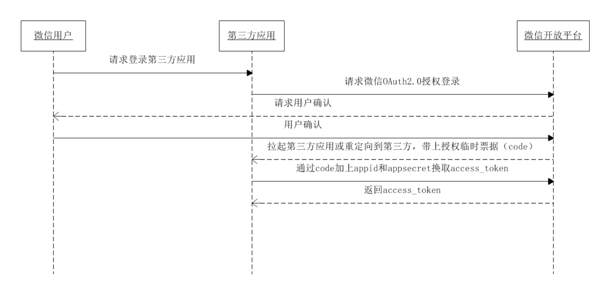
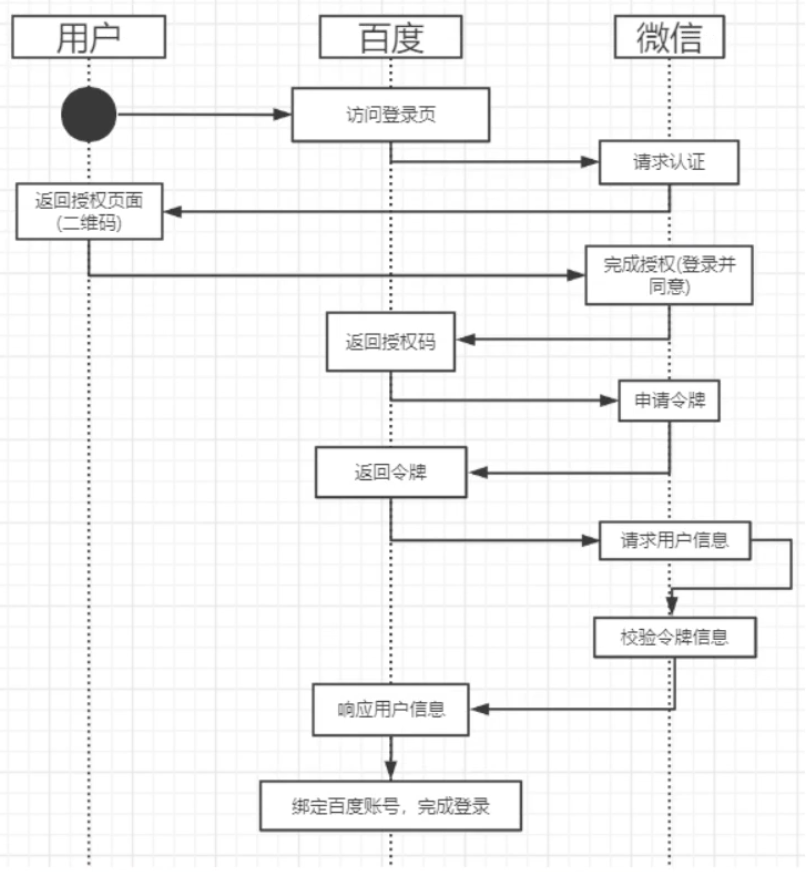

# 四种方式

## 授权码

**授权码（authorization code）方式，指的是第三方应用先申请一个授权码，然后再用该码获取令牌。**授权码只能使用一次

获取UserToken时序图

举例百度获取微信认证

步骤：

1、A 网站提供一个链接，用户点击后就会跳转到 B 网站，授权用户数据给 A 网站使用。

2、用户跳转后，B 网站会要求用户登录，然后询问是否同意给予 A 网站授权。用户表示同意，这时 B 网站就会跳回redirect_uri参数指定的网址。跳转时，会传回一个授权码。

3、A 网站拿到授权码以后，就可以在后端，向 B 网站请求令牌。

4、B 网站收到请求以后，就会颁发令牌。具体做法是向redirect_uri指定的网址，发送一段 JSON 数据。 

## 隐藏式

1、A 网站提供一个链接，要求用户跳转到 B 网站，授权用户数据给 A 网站使用。

2、用户跳转到 B 网站，登录后同意给予 A 网站授权。这时，B 网站就会跳回redirect_uri参数指定的跳转网址，并且把令牌作为 URL 参数，传给 A 网站 

这种方式把令牌直接传给前端，是很不安全的。因此，只能用于一些安全要求不高的场景，并且令牌的有效期必须非常短，通常就是会话期间（session）有效，浏览器关掉，令牌就失效了

## 密码式

**高度信任某个应用，RFC 6749 也允许用户把用户名和密码，直接告诉该应用。该应用就使用你的密码，申请令牌，这种方式称为"密码式"（password）**

## 凭证式

**凭证式（client credentials），适用于没有前端的命令行应用，即在命令行下请求令牌。**

这种方式给出的令牌，是针对第三方应用的，而不是针对用户的，即有可能多个用户共享同一个令牌。

# Reference

[微信开放平台](https://developers.weixin.qq.com/doc/oplatform/Website_App/WeChat_Login/Wechat_Login.html)

[OAuth2.0的四种方式](https://www.ruanyifeng.com/blog/2019/04/oauth-grant-types.html)

[GitHub OAuth 第三方登录示例教程](https://www.ruanyifeng.com/blog/2019/04/github-oauth.html)

