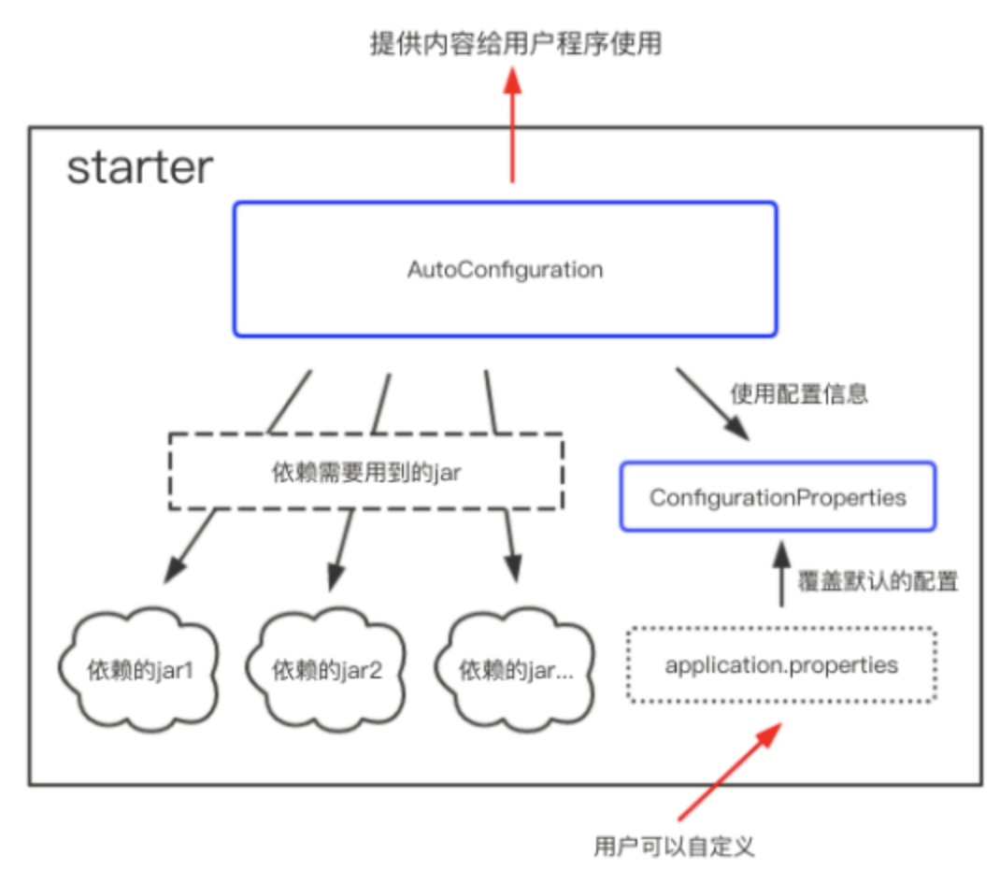
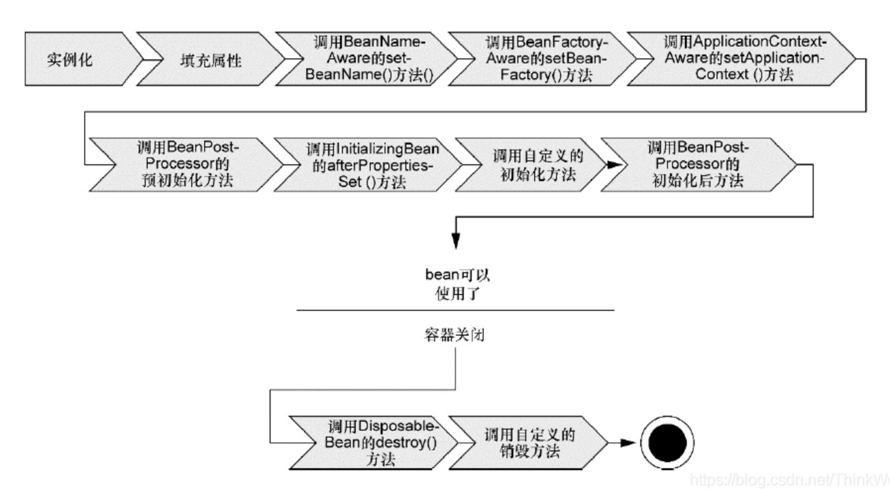
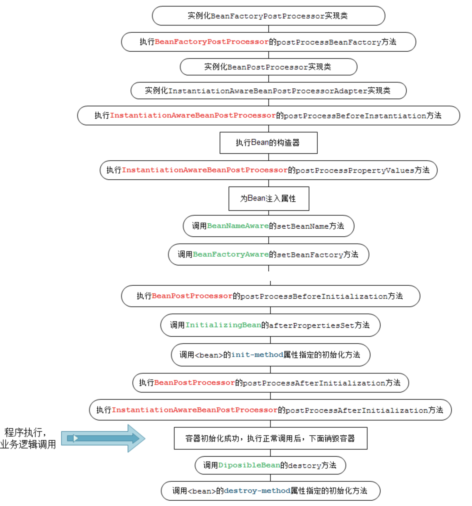
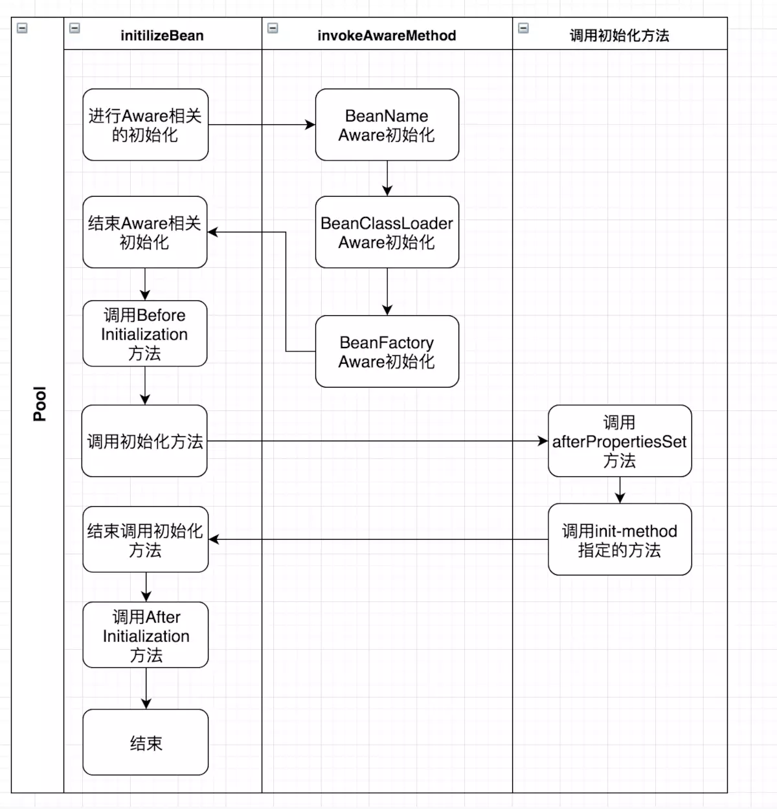

# 基础

### 什么是 Spring Boot Starters

解决引用依赖配置繁琐的问题。

Spring Boot坚信“约定大于配置”理念。

使用ConfigurationProperties和AutoConfiguration配置。starter的ConfigurationProperties还使得所有的配置属性被聚集到一个文件中（一般在resources目录下的application.properties）




### Spring Boot 支持哪些内嵌 Servlet 容器

* tomcat
* jetty
* undertow


### 如何在spring容器中使用Jetty而不是Tomcat

在pom.xml中排除tomcat引入jetty即可

```xml
<dependency>  
    <groupId>org.springframework.boot</groupId>  
    <artifactId>spring-boot-starter-web</artifactId>  
    <!-- 使用Jetty，需要在spring-boot-starter-web排除spring-boot-starter-tomcat，因为SpringBoot默认使用tomcat --> 
    <exclusions>  
        <exclusion>  
            <groupId>org.springframework.boot</groupId>  
            <artifactId>spring-boot-starter-tomcat</artifactId>  
        </exclusion>  
    </exclusions>  
</dependency>  

<!-- Jetty适合长连接应用，就是聊天类的长连接 -->  
<dependency>  
    <groupId>org.springframework.boot</groupId>  
    <artifactId>spring-boot-starter-jetty</artifactId>  
</dependency> 
```
### 介绍一下@SpringBootApplication注解

见注解专题

### SpringBoot的自动装配是如何实现的

见自动装配专题

### 开发RESTful web常用的注解有哪些

* @GetMapping
* @PostMapping
* @RequestMapping
* @ResponseBody

### springboot常用的两种配置文件

* properties
* yaml

### 常见的Bean映射工具

* BeanUtils
* BeanCopier
* Dozer
* Orika

Ref：[https://www.cnblogs.com/songhaibin/p/13382799.html](https://www.cnblogs.com/songhaibin/p/13382799.html)

### springboot如何监控系统运行状况

Spring boot Actuator提供了一组基于HTTP和JMX内置的EndPoints用于在系统运行时监控系统的运行情况。详情可以参见[Spring boot官网](https://docs.spring.io/spring-boot/docs/2.1.7.RELEASE/reference/html/production-ready-endpoints.html)在此列举一些常用的内置EndPoints

### springboot如何做请求参数校验

Bean Validation

```xml
<dependency>
		<groupId>org.springframework.boot</groupId>
		<artifactId>spring-boot-starter-validation</artifactId>
</dependency>
```
springboot的验证框架提供了一系列的注解用于验证参数，完整的注解可以去`javax.validation.constraints`这个包下看。这里整理一下： 
|注解|说明|
|:----|:----|
|@AssertFalse|被注释的元素必须为 false|
|@AssertTrue|被注释的元素必须为 true|
|@DecimalMax(value)|被注释的元素必须是一个数字，其值必须小于等于指定的最大值|

Ref: [如何使用springboot优雅地校验请求参数](https://blog.csdn.net/u013934408/article/details/108872775)

### 如何使用springboot实现全局异常处理

SpringBoot中有一个`ControllerAdvice`的注解，使用该注解表示开启了全局异常的捕获，我们只需在自定义一个方法使用`ExceptionHandler`注解然后定义捕获异常的类型即可对这些捕获的异常进行统一的处理。 

Ref: [SpringBoot全局异常准备](https://www.cnblogs.com/xuwujing/p/10933082.html)

 
### springboot中如何实现定时任务

* 自带的定时任务处理器 @Scheduled 注解
* 第三方框架 Quartz 
Ref: [Spring Boot 中实现定时任务的两种方式](https://www.cnblogs.com/lenve/p/10728897.html)

### ClassXmlAplicationContext和FileSystemXmlApplicationContext的区别
Ref：https://www.cnblogs.com/sxdcgaq8080/p/5650404.html

### classpath与filepath
Ref：
https://blog.csdn.net/shangmingtao/article/details/78311189?utm_medium=distribute.pc_relevant.none-task-blog-BlogCommendFromMachineLearnPai2-1.control&depth_1-utm_source=distribute.pc_relevant.none-task-blog-BlogCommendFromMachineLearnPai2-1.control

# Spring容器

### ApplicationContext通常的实现是什么

* FileSystemXmlApplicationContext
* ClassPathXmlApplicationContext
* WebXmlApplicationContext

### BeanFactory 和 ApplicationContext有什么区别

1、依赖关系

ApplicationContext接口作为BeanFactory的派生，除了提供BeanFactory所具有的功能外，还提供了更完整的框架功能：

* 继承MessageSource，因此支持国际化。
* 统一的资源文件访问方式。
* 提供在监听器中注册bean的事件。
* 同时加载多个配置文件。
* 载入多个（有继承关系）上下文 ，使得每一个上下文都专注于一个特定的层次，比如应用的web层。

2、加载方式

BeanFactory采用延迟加载的方式，只有在使用到某个Bean时(调用getBean())，才对该Bean进行加载实例化。这样，我们就不能发现一些存在的Spring的配置问题。如果Bean的某一个属性没有注入，BeanFacotry加载后，直至第一次使用调用getBean方法才会抛出异常。

ApplicationContext，它是在容器启动时，一次性创建了所有的Bean。这样，在容器启动时，我们就可以发现Spring中存在的配置错误，这样有利于检查所依赖属性是否注入。

3、创建方式

BeanFactory通常以编程的方式被创建，ApplicationContext还能以声明的方式创建，如使用ContextLoader。

4、注册方式

BeanFactory和ApplicationContext都支持BeanPostProcessor、BeanFactoryPostProcessor的使用，但两者之间的区别是：BeanFactory需要手动注册，而ApplicationContext则是自动注册。

### Spring自动注册与自动装配

**1）context: annotation-config/>**

这个标签会自动向Spring容器注册以下四个BeanPostProcessor， 让系统识别对应的注解从而支持相关的自动装配：


|BeanPostProcessor|对应的注解|
|:----|:----|
|AutowiredAnnotationBeanPostProcessor |@Autowired|
|CommonAnnotationBeanPostProcessor |@Resource<br>@PostConstruct<br>@PreDestroy|
|PersistenceAnnotationBeanPostProcessor　|@PersistenceUnit<br>@PersistenceContext|
|RequiredAnnotationBeanPostProcessor|@Required|

传统的注册方式：

```plain
1 <bean class="org.springframework.beans.factory.annotation. AutowiredAnnotationBeanPostProcessor"/>
2 <bean class="org.springframework.context.annotation.CommonAnnotationBeanPostProcessor"/>
3 <bean class="org.springframework.orm.jpa.support.PersistenceAnnotationBeanPostProcessor"/>
4 <bean class="org.springframework.beans.factory.annotation.RequiredAnnotationBeanPostProcessor"/>
```
 这个标签只支持自动装配，不支持自动注册（因为不能识别@Component, @Controller, @Service, @Repository；要想识别这四个注解，需要配置<context: component-scan base-package="xxx.xxx"/>标签， 见2。）。
**2）<context: component-scan base-package="xxx.xxx"/>**

这个标签包含了<context: annotation-config/>的功能；既支持自动装配，又支持自动注册。

支持@Component, @Controller, @Service, @Repository, @RestController, @ControllerAdvice, @Configuration注解。

作用：扫描base-package并在application context中注册扫描到的使用了以上注解的beans。

注意：Spring容器默认关闭注解装配。可以使用1或2开启注解装配。

**3）mvc: annotation-driven**

这个标签会自动注册以下bean：

* DefaulAnnotationHandlerMapping
* AnnotationMethodHandlerAdapter

这是Spring MVC为@Controller, @RequestMapping分发请求所必需的。

Ref: [Spring自动注册及自动装配](https://www.cnblogs.com/huangzejun/p/8183730.html)

### 自动装配的局限性

**重写**：你仍需用 和 配置来定义依赖，意味着总要重写自动装配。

**基本数据类型**：你不能自动装配简单的属性，如基本数据类型，String字符串，和类。

**模糊特性**：自动装配不如显式装配精确，如果有可能，建议使用显式装配。

# 

# Spring Beans

### Spring支持的几种bean的作用域

Spring框架支持以下五种bean的作用域：

* singleton 
bean在每个Spring ioc 容器中只有一个实例。

* prototype
一个bean的定义可以有多个实例。

* request
每次http请求都会创建一个bean，该作用域仅在基于web的Spring ApplicationContext情形下有效。

* session
在一个HTTP Session中，一个bean定义对应一个实例。该作用域仅在基于web的Spring ApplicationContext情形下有效。

* global-session
在一个全局的HTTP Session中，一个bean定义对应一个实例。该作用域仅在基于web的Spring ApplicationContext情形下有效。

### Spring框架中的单例bean是线程安全的吗

不是，实际上大部分时候 spring bean 无状态的（比如 dao 类）。

### Bean的生命周期

* 创建对象
* BeanDefinition
* 填充属性
* 回调aware方法
* 初始化（InitializingBean接口）
* aop
单例池（Map）

       

**Spring**中的 **bean**生命周期**?**

生命周期图



周期流程图



  

Bean的声明周期流程

* Bean 容器找到配置文件中 Spring Bean 的定义。
* Bean 容器利用 Java Reflection API 创建一个Bean的实例。
* 如果涉及到一些属性值 利用 set() 方法设置一些属性值。
* 如果 Bean 实现了 BeanNameAware 接口，调用 setBeanName() 方法，传入Bean的名字。 如果 Bean 实现了 BeanClassLoaderAware 接口，调用 setBeanClassLoader() 方法，传入ClassLoader 对象的实例。
* 与上面的类似，如果实现了其他 *.Aware 接口，就调用相应的方法。 如果有和加载这个 Bean 的 Spring 容器相关的 BeanPostProcessor 对象，执 行 postProcessBeforeInitialization() 方法
* 如果Bean实现了 InitializingBean 接口，执行 afterPropertiesSet() 方法。
* 如果 Bean 在配置文件中的定义包含 init-method 属性，执行指定的方法。       
* 如果有和加载这个 Bean的 Spring 容器相关的 BeanPostProcessor 对象，执
 行 postProcessAfterInitialization() 方法

* 当要销毁 Bean 的时候，如果 Bean 实现了 DisposableBean 接口，执行 destroy() 方法。 当要销毁 Bean 的时候，如果 Bean 在配置文件中的定义包含 destroy-method 属性，执行指 定的方法。   
Ref: [Spring Bean的声明周期（Demo）](https://www.cnblogs.com/zrtqsk/p/3735273.html)    

     

### spring的策略设计模式

spring在初始化bean的过程中，需要大量调用BeanPostProcessor后置处理器，所有的后置处理器都有各自的实现方法

### spring循环依赖

三级缓存，1、2、半成品的工厂（代理，用于定制bean）Map；3、三级缓存用于直接拿去成品的bean，不用重复之前复杂的过程

### 单例池（singleObjects）

单例对象只会实例化一次所以需要一个单例池来缓存

### 单例构造函数依赖和原型构造函数依赖

Ref: [https://mp.weixin.qq.com/s/PmLWtSBr8PlmbZ0rOJ1ncw](https://mp.weixin.qq.com/s/PmLWtSBr8PlmbZ0rOJ1ncw)

### FactoryBean和ObjectFactory

FactoryBean和ObjectFactory都是用来取得Bean，但使用的方法和地方不同，FactoryBean被配置好后，Spring调用getObject()方法来取得Bean，ObjectFactory配置好后，在Bean里面可以取得ObjectFactory实例，需要我们手动来调用getObject()来取得Bean。

Ref: [BeanFactory和Factory Bean的区别](https://mp.weixin.qq.com/s/BAS2T0XjWD0WN4EdBrg0fg)

### 
### Spring如何实现单例

单例注册表+锁

[https://www.cnblogs.com/twoheads/p/9723543.html](https://www.cnblogs.com/twoheads/p/9723543.html)

### InitializingBean接口

参考：[https://blog.csdn.net/weixin_30808575/article/details/96162918](https://blog.csdn.net/weixin_30808575/article/details/96162918)

其方法afterPropertiesSet是在init-method方法之前执行。

而BeanPostProcessor接口的postProcessBeforeInitialization方法在afterPropertiesSet方法之前执行

>BeanPostProcessor，针对所有Spring上下文中所有的bean，可以在配置文档applicationContext.xml中配置一个BeanPostProcessor，然后对所有的bean进行一个初始化之前和之后的代理。
>BeanPostProcessor接口中有两个方法： postProcessBeforeInitialization和postProcessAfterInitialization。 postProcessBeforeInitialization方法在bean初始化之前执行， postProcessAfterInitialization方法在bean初始化之后执行。
### @PostConstruct

通过 debug 和调用栈找到类InitDestroyAnnotationBeanPostProcessor, 其中的核心方法，即 @PostConstruct 方法调用的入口： 

从命名上，我们就可以得到某些信息——这是一个BeanPostProcessor。想到了什么？在[也谈Spring容器的生命周期](http://sexycoding.iteye.com/blog/1046775)中，提到过BeanPostProcessor的postProcessBeforeInitialization是在Bean生命周期中afterPropertiesSet和init-method之前被调用的。另外通过跟踪，`@PostConstruct`方法的调用方式也是通过发射机制。 

1. spring bean的初始化执行顺序：构造方法 --> `@PostConstruct`注解的方法 --> `afterPropertiesSet`方法 --> `init-method`指定的方法。具体可以参考例子
2. `afterPropertiesSet`通过接口实现方式调用（效率上高一点），`@PostConstruct`和`init-method`都是通过反射机制调用
 **构造方法 -> @Autowired -> @PostConstruct**

## 
[https://www.cnblogs.com/pipicai96/p/11718761.html](https://www.cnblogs.com/pipicai96/p/11718761.html)




### BeanPostProcessor和BeanFactoryPostProcessor

参考书P155

BeanFacotoryProcessor的处理要区分两种情况：

* 通过硬编码方式的处理
* 通过配置文件方式的处理
不但要实现注册功能，还要实现对后处理器的激活操作，所以需要载入配置中的定义，并进行激活

对于BeanPostProcessor并不需要马上调用，且硬编码的方式实现的功能是将后处理器提取并调用，这里不需要调用，当然不需要考虑硬编码的方式了，这里的功能只需要将配置文件的BeanPostProcessor提取出来并注册进入beanFacotry就可以了。

### ApplicationListener

参考：[https://blog.csdn.net/wo541075754/article/details/71720984](https://blog.csdn.net/wo541075754/article/details/71720984)

在一些业务场景中，当容器初始化完成之后，需要处理一些操作，比如一些数据的加载、初始化缓存、特定任务的注册等等。这个时候我们就可以使用Spring提供的ApplicationListener来进行操作。


### 代理

【Spring IOC---AOP代理对象生成的时机_gongsenlin341的博客-CSDN博客_spring 代理对象什么时候生成】[https://blog.csdn.net/gongsenlin341/article/details/111240114](https://blog.csdn.net/gongsenlin341/article/details/111240114)

【在spring中获取代理对象代理的目标对象工具类 - 养眼大魔王 - 博客园】[https://www.cnblogs.com/damowang/p/4172733.html](https://www.cnblogs.com/damowang/p/4172733.html)

# 事务

### Spring支持两种类型的事务管理

编程式事务管理：这意味你通过编程的方式管理事务，给你带来极大的灵活性，但是难维护。

声明式事务管理：这意味着你可以将业务代码和事务管理分离，你只需用注解和XML配置来管理事务。

### spring事务不生效原因

[https://zhuanlan.zhihu.com/p/101396825](https://zhuanlan.zhihu.com/p/101396825)

[https://mp.weixin.qq.com/s/SW7vEoEZcvwzBERWDV7HUQ](https://mp.weixin.qq.com/s/SW7vEoEZcvwzBERWDV7HUQ)

* 调用自身方法
* 方法不是public
* 发生错误异常(默认回滚的是RuntimeException，如果是其他异常想要回滚，需要在@Transactional注解上加rollbackFor属性)
* 数据库不支持事务毕竟spring事务用的是数据库的事
### 如何保证事务获取同一个Connection

ThreadLocal中

```java
DataSourceUtils.getConnection(obtainDataSource());
```


### spring的事务和数据库的事务隔离是一个概念吗

概念一样，数据库有四种隔离级别。spring在此基础上抽象出一种隔离级别为default，表示以数据库默认配置为主。

but如果spring配置的隔离级别与数据库不一致，以spring配置的为主。因为JDBC有一个接口：

```java
void setTransactionIsolation(int level) throws SQLException;
```
该接口用来设置事务的隔离级别。那么在DataSourceUtils中，有一段代码是这样的
```java
// Apply specific isolation level, if any.
Integer previousIsolationLevel = null;
if (definition != null && definition.getIsolationLevel() != TransactionDefinition.ISOLATION_DEFAULT) {
  int currentIsolation = con.getTransactionIsolation();
  if (currentIsolation != definition.getIsolationLevel()) {
    previousIsolationLevel = currentIsolation;
    con.setTransactionIsolation(definition.getIsolationLevel());
  }
}
```

### Spring的事务传播行为

① PROPAGATION_REQUIRED：如果当前没有事务，就创建一个新事务，如果当前存在事务，就加入该事务，该设置是最常用的设置。

② PROPAGATION_SUPPORTS：支持当前事务，如果当前存在事务，就加入该事务，如果当前不存在事务，就以非事务执行。

③ PROPAGATION_MANDATORY：支持当前事务，如果当前存在事务，就加入该事务，如果当前不存在事务，就抛出异常。

④ PROPAGATION_REQUIRES_NEW：创建新事务，无论当前存不存在事务，都创建新事务。

⑤ PROPAGATION_NOT_SUPPORTED：以非事务方式执行操作，如果当前存在事务，就把当前事务挂起。

⑥ PROPAGATION_NEVER：以非事务方式执行，如果当前存在事务，则抛出异常。

⑦ PROPAGATION_NESTED：如果当前存在事务，则在嵌套事务内执行。如果当前没有事务，则按REQUIRED属性执行。

### 事务传播机制

举例：一个方法开启了事务，调用另一开启事务的方法，当传播行为不一样时，事务怎么执行？有几个事务

### 事务多线程如何生效

参考：[https://blog.csdn.net/u010963948/article/details/80367020](https://blog.csdn.net/u010963948/article/details/80367020)

总结：事务里开多线程，事务不生效（只能手动设置线程setUncaughtExceptionHandler方法异常时手动回滚）线程中开事务生效。

### 数据库连接和java多线程的关系

参考：[https://blog.csdn.net/luanlouis/article/details/90760372](https://blog.csdn.net/luanlouis/article/details/90760372)

Java中，当然一个线程可以在整个生命周期独占一个java.sql.Connection，使用该对象完成各种数据库操作，因为一个线程内的所有操作都是同步的和线性的。然而，在实际的项目中，并不会这样做，原因有两个： 

* Java中的线程数量可能远超数据库连接数量，会出现僧多粥少的情况
* Java线程在工作过程中，真正访问JDBC数据库连接所占用的时间比例很短

结合上述的两个症结，为了提高JDBC数据库连接的使用效率，目前普遍的解决方案是：**当线程需要做数据库操作时，才会真正请求获取JDBC数据库连接,线程使用完了之后，立即释放，被释放的JDBC数据库连接等待下次分配使用**

基于这个结论，会衍生两个问题需要解决：

1、Java多线程访问同一个java.sql.Connection会有什么问题？如何解决？
1）事务错乱——锁解决

2）提交其它事务未提交的事务——*确保每个线程在使用Connection对象时，最终要明确对Connection做*`commit` 或者`rollback`。 

2、JDBC数据库连接 如何管理和分配？
连接池 

