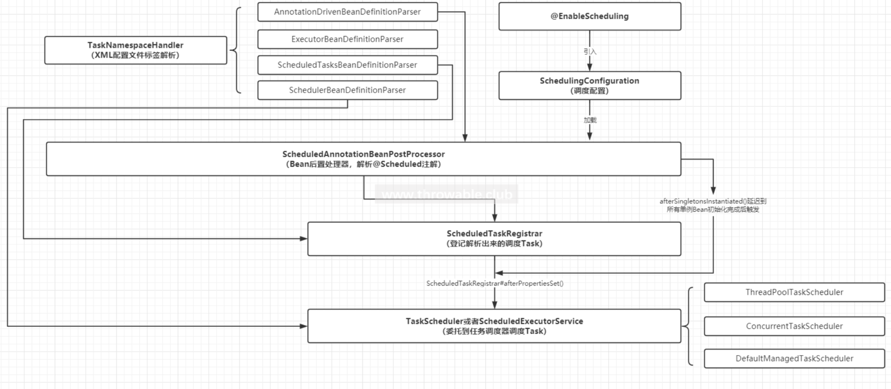

# 概述

有时候需要一些定时任务完成一些功能

@Scheduled注解用于定时计划完成一些任务。

# Scheduled定时任务器

## Scheduled简介

```java
org.springframework.scheduling.annotation.Scheduled
```
spring.context依赖下的包org.springframework.scheduling，该包有4个子包：
1、annotation

定义了调度、异步任务相关的注解和解析类，常用的注解如@Async、@EnableAsync、@EnableScheduling和@Scheduled。

2、concurrent

定义了调度任务执行器和相对应的FactoryBean 

3、config

定义了配置解析、任务具体实现类、调度任务`XML`配置文件解析相关的解析类。4、4、support

定义了反射支持类、Cron表达式解析器等工具类。

 

## Scheduled使用

1、依赖

如果想单独使用Scheduling，只需要引入spring-context这个依赖。 

springboot引入spring-boot-starter-web已经集成了spring-context，可以直接使用Scheduling模块。

2、在需要定期执行的方法上标注 @Schduled

```java
@Component
public class ScheduledDemo {
    @Scheduled(cron = "0/5 * * ? * *")
    public void run() {
        System.out.println("this is scheduled ");
    }
}
```
3、开启Schedule
开启Scheduling模块支持只需要在某一个配置类中添加@EnableScheduling注解即可，一般为了明确模块的引入，建议在启动类中使用此注解。

```shell
# 在启动类上标注
@EnableScheduling
@SpringBootApplication
public class BootdemoApplication {
   public static void main(String[] args) {
      SpringApplication.run(BootdemoApplication.class, args);
   }
}
```

注意：默认是单线程执行，即同一时刻只有一个定时任务。如果一个定时任务是一直在运行，则其它定时任务将被阻塞一直无法运行。

## 触发规则

1、TriggerTask：动态定时任务。通过Trigger#nextExecutionTime 给定的触发上下文确定下一个执行时间。

2、CronTask：动态定时任务，TriggerTask子类。通过cron表达式确定的时间触发下一个任务执行。

3、IntervalTask：一定时间延迟之后，周期性执行的任务。

## 多线程使用

```java
import org.springframework.context.annotation.Bean;
import org.springframework.context.annotation.Configuration;
import org.springframework.scheduling.TaskScheduler;
import org.springframework.scheduling.concurrent.ThreadPoolTaskScheduler;
import java.util.concurrent.ThreadPoolExecutor;
@Configuration
public class TaskSchedule {
    @Bean
    public TaskScheduler scheduledExecutorService() { // taskScheduler()
        ThreadPoolTaskScheduler scheduler = new ThreadPoolTaskScheduler(); 
        scheduler.setPoolSize(5); // 注意：默认只有一个线程
        scheduler.setThreadNamePrefix("scheduled-thread-");
        scheduler.setWaitForTasksToCompleteOnShutdown(true);
        scheduler.setRejectedExecutionHandler(new ThreadPoolExecutor.CallerRunsPolicy());
        return scheduler;
    }
}
```
### 注意事项

1、其它注入不同名的TaskScheduler的bean

2、自动注入扫描路径

3、注入优先级

4、注解方法为public

# Quartz定时任务框架

## Quartz的使用思路

1、job：任务

2、Trigger：触发器

3、Scheduler：任务调度

## Quartz使用

1、依赖

```xml
<!-- https://mvnrepository.com/artifact/org.quartz-scheduler/quartz -->
<dependency>
    <groupId>org.quartz-scheduler</groupId>
    <artifactId>quartz</artifactId>
    <version>2.2.0</version>
</dependency>
```
2、创建执行任务
```java
import org.quartz.*;
public class QuartzDemo implements Job {
    @Override
    public void execute(JobExecutionContext jobExecutionContext) throws JobExecutionException {
        System.out.println("QuartzDemo execute");
    }
}
```
3、配置触发器并启动任务
```java
import org.quartz.*;
import org.quartz.impl.StdSchedulerFactory;
public class QuartzMain {
    public static void main(String[] args) throws Exception {
        // 1、创建Job对象
        JobDetail jobDetail = JobBuilder.newJob(QuartzDemo.class).build();
        // 2、创建Trigger对象
        Trigger trigger = TriggerBuilder.newTrigger()
//                .withSchedule(SimpleScheduleBuilder.repeatSecondlyForever())
                .withSchedule(CronScheduleBuilder.cronSchedule("0/5 * * ? * *"))
                .build();
        // 3、创建Scheduler对象
        Scheduler scheduler = StdSchedulerFactory.getDefaultScheduler();
        scheduler.scheduleJob(jobDetail, trigger);
        scheduler.start();
    }
}
```

## Springboot整合Quartz使用

1、依赖

```xml
<dependency>
   <groupId>org.quartz-scheduler</groupId>
   <artifactId>quartz</artifactId>
   <version>2.2.0</version>
</dependency>
<dependency>
   <groupId>org.springframework</groupId>
   <artifactId>spring-context-support</artifactId>
   <version>4.3.17.RELEASE</version>
</dependency>
<dependency>
   <groupId>org.springframework</groupId>
   <artifactId>spring-tx</artifactId>
   <version>4.3.17.RELEASE</version>
</dependency>
```
2、创建执行任务QuartzDemo
同上

3、配置触发器Bean

```java
package com.huangbo.bootdemo.scheduled;
import org.springframework.context.annotation.Bean;
import org.springframework.context.annotation.Configuration;
import org.springframework.scheduling.quartz.CronTriggerFactoryBean;
import org.springframework.scheduling.quartz.JobDetailFactoryBean;
import org.springframework.scheduling.quartz.SchedulerFactoryBean;
import org.springframework.scheduling.quartz.SimpleTriggerFactoryBean;
@Configuration //注意别写成了Component
public class QuartzConfig {
    @Bean
    public JobDetailFactoryBean jobDetailFactoryBean() {
        JobDetailFactoryBean factoryBean = new JobDetailFactoryBean();
        factoryBean.setJobClass(QuartzDemo.class);
        return factoryBean;
    }
    @Bean
    public SimpleTriggerFactoryBean simpleTriggerFactoryBean(JobDetailFactoryBean jobDetailFactoryBean) {
        SimpleTriggerFactoryBean factoryBean = new SimpleTriggerFactoryBean();
        factoryBean.setJobDetail(jobDetailFactoryBean.getObject());
        factoryBean.setRepeatInterval(3000); // ms
        factoryBean.setRepeatCount(10);
        return factoryBean;
    }
    @Bean
    public CronTriggerFactoryBean cronTriggerFactoryBean(JobDetailFactoryBean jobDetailFactoryBean) {
        CronTriggerFactoryBean factoryBean = new CronTriggerFactoryBean();
        factoryBean.setJobDetail(jobDetailFactoryBean.getObject());
        factoryBean.setCronExpression("0/5 * * ? * *");
        return factoryBean;
    }
    @Bean
    public SchedulerFactoryBean schedulerFactoryBean(CronTriggerFactoryBean cronTriggerFactoryBean) {
        SchedulerFactoryBean factoryBean = new SchedulerFactoryBean();
        factoryBean.setTriggers(cronTriggerFactoryBean.getObject());
        return factoryBean;
    }
}
```
4、启动
```java
@EnableScheduling
@SpringBootApplication
public class BootdemoApplication {
   public static void main(String[] args) {
      SpringApplication.run(BootdemoApplication.class, args);
   }
}
```


# Scheduled原理

## Scheduling模块工作流程



Scheduling模块的核心逻辑在ScheduledAnnotationBeanPostProcessor和ScheduledTaskRegistrar两个类中

## 入口

EnableScheduling注解

```java
@Target(ElementType.TYPE)
@Retention(RetentionPolicy.RUNTIME)
@Import(SchedulingConfiguration.class)
@Documented
public @interface EnableScheduling {
}
```
然后看导入的类 SchedulingConfiguration
这里有个技巧：Spring内部加载的Bean一般会定义名称为internalXXX，Bean的role会定义为ROLE_INFRASTRUCTURE = 2 

```java
// org.springframework.scheduling.annotation.SchedulingConfiguration
@Configuration
@Role(BeanDefinition.ROLE_INFRASTRUCTURE)
public class SchedulingConfiguration {
   @Bean(name = TaskManagementConfigUtils.SCHEDULED_ANNOTATION_PROCESSOR_BEAN_NAME)
   @Role(BeanDefinition.ROLE_INFRASTRUCTURE)
   public ScheduledAnnotationBeanPostProcessor scheduledAnnotationProcessor() {
      return new ScheduledAnnotationBeanPostProcessor();
   }
}
```
看 ScheduledAnnotationBeanPostProcessor 构造方法，初始化了 register
```java
public ScheduledAnnotationBeanPostProcessor() {
   this.registrar = new ScheduledTaskRegistrar();
}
```
## ScheduledAnnotationBeanPostProcessor

### 实现的接口

#### ScheduledTaskHolder

返回Set<ScheduledTask>，表示持有的所有任务实例。

MergedBeanDefinitionPostProcessor接口：Bean定义合并时回调，预留空实现，暂时不做任何处理。

#### BeanPostProcessor

也就是MergedBeanDefinitionPostProcessor的父接口，Bean实例初始化前后分别回调，其中，后回调的postProcessAfterInitialization()方法就是用于**解析@Scheduled和装载ScheduledTask**，需要重点关注此方法的逻辑。

#### DestructionAwareBeanPostProcessor

具体的Bean实例销毁的时候回调，用于Bean实例销毁的时候移除和取消对应的任务实例。

Ordered接口：用于Bean加载时候的排序，主要是改变ScheduledAnnotationBeanPostProcessor在BeanPostProcessor执行链中的顺序。

#### EmbeddedValueResolverAware

回调StringValueResolver实例，用于解析带占位符的环境变量属性值。

#### BeanNameAware

回调BeanName。

#### BeanFactoryAware

回调BeanFactory实例，具体是DefaultListableBeanFactory，也就是熟知的IOC容器。

#### ApplicationContextAware

回调ApplicationContext实例，也就是熟知的Spring上下文，它是IOC容器的门面，同时是事件广播器、资源加载器的实现等等。

#### SmartInitializingSingleton

所有单例实例化完毕之后回调，作用是在持有的applicationContext为NULL的时候开始调度所有加载完成的任务，这个钩子接口十分有用，常用做一些资源初始化工作。

#### ApplicationListener

监听Spring应用的事件，具体是ApplicationListener<ContextRefreshedEvent>，监听上下文刷新的事件，如果事件中携带的ApplicationContext实例和ApplicationContextAware回调的ApplicationContext实例一致，那么在此监听回调方法中开始调度所有加载完成的任务，也就是在ScheduledAnnotationBeanPostProcessor这个类中，SmartInitializingSingleton接口的实现和ApplicationListener接口的实现逻辑是互斥的。

#### DisposableBean

当前Bean实例销毁时候回调，也就是ScheduledAnnotationBeanPostProcessor自身被销毁的时候回调，用于取消和清理所有的ScheduledTask。

### @Scheduled注解解析

在postProcessAfterInitialization方法中

```java
// org.springframework.scheduling.annotation.ScheduledAnnotationBeanPostProcessor#postProcessAfterInitialization
@Override
public Object postProcessAfterInitialization(Object bean, String beanName) {
   // 忽略AopInfrastructureBean、TaskScheduler和ScheduledExecutorService三种类型的Bean
   if (bean instanceof AopInfrastructureBean || bean instanceof TaskScheduler ||
         bean instanceof ScheduledExecutorService) {
      // Ignore AOP infrastructure such as scoped proxies.
      return bean;
   }
   // 获取Bean的用户态类型，例如Bean有可能被CGLIB增强，这个时候要取其父类
   Class<?> targetClass = AopProxyUtils.ultimateTargetClass(bean);
   // nonAnnotatedClasses存放不包含@Scheduled注解的类型，缓存起来避免重复判断它是否携带@Scheduled注解的方法
   if (!this.nonAnnotatedClasses.contains(targetClass) &&
         AnnotationUtils.isCandidateClass(targetClass, Arrays.asList(Scheduled.class, Schedules.class))) {
      // JDK8之后支持重复注解，因此获取具体类型中Method -> @Scheduled的集合，也就是有可能一个方法使用多个@Scheduled注解，最终会封装为多个Task
      Map<Method, Set<Scheduled>> annotatedMethods = MethodIntrospector.selectMethods(targetClass,
            (MethodIntrospector.MetadataLookup<Set<Scheduled>>) method -> {
               Set<Scheduled> scheduledMethods = AnnotatedElementUtils.getMergedRepeatableAnnotations(
                     method, Scheduled.class, Schedules.class);
               return (!scheduledMethods.isEmpty() ? scheduledMethods : null);
            });
      // 解析到类型中不包含@Scheduled注解的方法添加到nonAnnotatedClasses缓存中
      if (annotatedMethods.isEmpty()) {
         this.nonAnnotatedClasses.add(targetClass);
         if (logger.isTraceEnabled()) {
            logger.trace("No @Scheduled annotations found on bean class: " + targetClass);
         }
      }
      // Method -> @Scheduled的集合遍历processScheduled()方法进行登记
      else {
         // Non-empty set of methods
         annotatedMethods.forEach((method, scheduledMethods) ->
               scheduledMethods.forEach(scheduled -> processScheduled(scheduled, method, bean)));
         if (logger.isTraceEnabled()) {
            logger.trace(annotatedMethods.size() + " @Scheduled methods processed on bean '" + beanName +
                  "': " + annotatedMethods);
         }
      }
   }
   return bean;
}
```
processScheduled方法就是具体的注解解析和Task封装的方法。
该方法主要做了4件事：

1、解析@Scheduled中的initialDelay、initialDelayString属性，适用于FixedDelayTask或者FixedRateTask的延迟执行

2、优先解析@Scheduled中的cron属性，封装为CronTask，通过ScheduledTaskRegistrar进行缓存

3、解析@Scheduled中的fixedDelay、fixedDelayString属性，封装为FixedDelayTask，通过ScheduledTaskRegistrar进行缓存

4、解析@Scheduled中的fixedRate、fixedRateString属性，封装为FixedRateTask，通过ScheduledTaskRegistrar进行缓存

```java
// org.springframework.scheduling.annotation.ScheduledAnnotationBeanPostProcessor#processScheduled
protected void processScheduled(Scheduled scheduled, Method method, Object bean) {
   try {
      // 通过方法宿主Bean和目标方法封装Runnable适配器ScheduledMethodRunnable实例
      Runnable runnable = createRunnable(bean, method);
      boolean processedSchedule = false;
      String errorMessage =
            "Exactly one of the 'cron', 'fixedDelay(String)', or 'fixedRate(String)' attributes is required";
      // 缓存已经装载的任务
      Set<ScheduledTask> tasks = new LinkedHashSet<>(4);
      // Determine initial delay
      // 解析初始化延迟执行时间，initialDelayString支持占位符配置，如果initialDelayString配置了，会覆盖initialDelay的值
      long initialDelay = scheduled.initialDelay();
      String initialDelayString = scheduled.initialDelayString();
      if (StringUtils.hasText(initialDelayString)) {
         Assert.isTrue(initialDelay < 0, "Specify 'initialDelay' or 'initialDelayString', not both");
         if (this.embeddedValueResolver != null) {
            initialDelayString = this.embeddedValueResolver.resolveStringValue(initialDelayString);
         }
         if (StringUtils.hasLength(initialDelayString)) {
            try {
               initialDelay = parseDelayAsLong(initialDelayString);
            }
            catch (RuntimeException ex) {
               throw new IllegalArgumentException(
                     "Invalid initialDelayString value \"" + initialDelayString + "\" - cannot parse into long");
            }
         }
      }
      // Check cron expression
      // 解析时区zone的值，支持支持占位符配置，判断cron是否存在，存在则装载为CronTask
      String cron = scheduled.cron();
      if (StringUtils.hasText(cron)) {
         String zone = scheduled.zone();
         if (this.embeddedValueResolver != null) {
            cron = this.embeddedValueResolver.resolveStringValue(cron);
            zone = this.embeddedValueResolver.resolveStringValue(zone);
         }
         if (StringUtils.hasLength(cron)) {
            Assert.isTrue(initialDelay == -1, "'initialDelay' not supported for cron triggers");
            processedSchedule = true;
            if (!Scheduled.CRON_DISABLED.equals(cron)) {
               TimeZone timeZone;
               if (StringUtils.hasText(zone)) {
                  timeZone = StringUtils.parseTimeZoneString(zone);
               }
               else {
                  timeZone = TimeZone.getDefault();
               }
               // 此方法虽然表面上是调度CronTask，实际上由于ScheduledTaskRegistrar不持有TaskScheduler，只是把任务添加到它的缓存中
               // 返回的任务实例添加到宿主Bean的缓存中，然后最后会放入宿主Bean -> List<ScheduledTask>映射中
               tasks.add(this.registrar.scheduleCronTask(new CronTask(runnable, new CronTrigger(cron, timeZone))));
            }
         }
      }
      // At this point we don't need to differentiate between initial delay set or not anymore
      // 修正小于0的初始化延迟执行时间值为0
      if (initialDelay < 0) {
         initialDelay = 0;
      }
      // Check fixed delay
      // 解析fixedDelay和fixedDelayString，如果同时配置，fixedDelayString最终解析出来的整数值会覆盖fixedDelay，封装为FixedDelayTask
      long fixedDelay = scheduled.fixedDelay();
      if (fixedDelay >= 0) {
         Assert.isTrue(!processedSchedule, errorMessage);
         processedSchedule = true;
         tasks.add(this.registrar.scheduleFixedDelayTask(new FixedDelayTask(runnable, fixedDelay, initialDelay)));
      }
      String fixedDelayString = scheduled.fixedDelayString();
      if (StringUtils.hasText(fixedDelayString)) {
         if (this.embeddedValueResolver != null) {
            fixedDelayString = this.embeddedValueResolver.resolveStringValue(fixedDelayString);
         }
         if (StringUtils.hasLength(fixedDelayString)) {
            Assert.isTrue(!processedSchedule, errorMessage);
            processedSchedule = true;
            try {
               fixedDelay = parseDelayAsLong(fixedDelayString);
            }
            catch (RuntimeException ex) {
               throw new IllegalArgumentException(
                     "Invalid fixedDelayString value \"" + fixedDelayString + "\" - cannot parse into long");
            }
            // 此方法虽然表面上是调度FixedDelayTask，实际上由于ScheduledTaskRegistrar不持有TaskScheduler，只是把任务添加到它的缓存中
            // 返回的任务实例添加到宿主Bean的缓存中，然后最后会放入宿主Bean -> List<ScheduledTask>映射中
            tasks.add(this.registrar.scheduleFixedDelayTask(new FixedDelayTask(runnable, fixedDelay, initialDelay)));
         }
      }
      // Check fixed rate
      // 解析fixedRate和fixedRateString，如果同时配置，fixedRateString最终解析出来的整数值会覆盖fixedRate，封装为FixedRateTask
      long fixedRate = scheduled.fixedRate();
      if (fixedRate >= 0) {
         Assert.isTrue(!processedSchedule, errorMessage);
         processedSchedule = true;
         tasks.add(this.registrar.scheduleFixedRateTask(new FixedRateTask(runnable, fixedRate, initialDelay)));
      }
      String fixedRateString = scheduled.fixedRateString();
      if (StringUtils.hasText(fixedRateString)) {
         if (this.embeddedValueResolver != null) {
            fixedRateString = this.embeddedValueResolver.resolveStringValue(fixedRateString);
         }
         if (StringUtils.hasLength(fixedRateString)) {
            Assert.isTrue(!processedSchedule, errorMessage);
            processedSchedule = true;
            try {
               fixedRate = parseDelayAsLong(fixedRateString);
            }
            catch (RuntimeException ex) {
               throw new IllegalArgumentException(
                     "Invalid fixedRateString value \"" + fixedRateString + "\" - cannot parse into long");
            }
            // 此方法虽然表面上是调度FixedRateTask，实际上由于ScheduledTaskRegistrar不持有TaskScheduler，只是把任务添加到它的缓存中
            // 返回的任务实例添加到宿主Bean的缓存中，然后最后会放入宿主Bean -> List<ScheduledTask>映射中
            tasks.add(this.registrar.scheduleFixedRateTask(new FixedRateTask(runnable, fixedRate, initialDelay)));
         }
      }
      // Check whether we had any attribute set
      Assert.isTrue(processedSchedule, errorMessage);
      // Finally register the scheduled tasks
      synchronized (this.scheduledTasks) {
         // 注册所有任务实例，这个映射Key为宿主Bean实例，Value为List<ScheduledTask>，后面用于调度所有注册完成的任务
         Set<ScheduledTask> regTasks = this.scheduledTasks.computeIfAbsent(bean, key -> new LinkedHashSet<>(4));
         regTasks.addAll(tasks);
      }
   }
   catch (IllegalArgumentException ex) {
      throw new IllegalStateException(
            "Encountered invalid @Scheduled method '" + method.getName() + "': " + ex.getMessage());
   }
}
```
@Scheduled修饰的某个方法如果同时配置了cron、fixedDelay|fixedDelayString和fixedRate|fixedRateString属性，意味着此方法同时封装为三种任务CronTask、FixedDelayTask和FixedRateTask。解析xxString值的使用，用到了EmbeddedValueResolver解析字符串的值，支持占位符，这样可以直接获取环境配置中的占位符属性（基于SPEL的特性，甚至可以支持嵌套占位符）。解析成功的所有任务实例存放在ScheduledAnnotationBeanPostProcessor的一个映射scheduledTasks中
### finishRegistration

解析和缓存工作完成之后，接着分析最终激活所有调度任务的逻辑，见互斥方法afterSingletonsInstantiated()和onApplicationEvent()，两者中一定只有一个方法能够调用finishRegistration()

```java
// org.springframework.scheduling.annotation.ScheduledAnnotationBeanPostProcessor
@Override  //所有单例实例化完毕之后回调
public void afterSingletonsInstantiated() { 
   this.nonAnnotatedClasses.clear();
   if (this.applicationContext == null) {
      finishRegistration();
   }
}
@Override  // 上下文刷新完成之后回调
public void onApplicationEvent(ContextRefreshedEvent event) {
   if (event.getApplicationContext() == this.applicationContext) {
      finishRegistration();
   }
}

private void finishRegistration() {
   // 如果持有的scheduler对象不为null则设置ScheduledTaskRegistrar中的任务调度器
   if (this.scheduler != null) {
      this.registrar.setScheduler(this.scheduler);
   }
   // 这个判断一般会成立，得到的BeanFactory就是DefaultListableBeanFactory
   if (this.beanFactory instanceof ListableBeanFactory) {
      // 获取所有的调度配置器SchedulingConfigurer实例，并且都回调configureTasks()方法，这个很重要，它是用户动态装载调取任务的扩展钩子接口
      Map<String, SchedulingConfigurer> beans =
            ((ListableBeanFactory) this.beanFactory).getBeansOfType(SchedulingConfigurer.class);
      List<SchedulingConfigurer> configurers = new ArrayList<>(beans.values());
      // SchedulingConfigurer实例列表排序
      AnnotationAwareOrderComparator.sort(configurers);
      for (SchedulingConfigurer configurer : configurers) {
         configurer.configureTasks(this.registrar);
      }
   }
   // 下面这一大段逻辑都是为了从BeanFactory取出任务调度器实例，主要判断TaskScheduler或者ScheduledExecutorService类型的Bean，包括尝试通过类型或者名字获取
   // 获取成功后设置到ScheduledTaskRegistrar中
   if (this.registrar.hasTasks() && this.registrar.getScheduler() == null) {
      Assert.state(this.beanFactory != null, "BeanFactory must be set to find scheduler by type");
      try {
         // Search for TaskScheduler bean...
         this.registrar.setTaskScheduler(resolveSchedulerBean(this.beanFactory, TaskScheduler.class, false));
      }
      catch (NoUniqueBeanDefinitionException ex) {
         if (logger.isTraceEnabled()) {
            logger.trace("Could not find unique TaskScheduler bean - attempting to resolve by name: " +
                  ex.getMessage());
         }
         try {
            this.registrar.setTaskScheduler(resolveSchedulerBean(this.beanFactory, TaskScheduler.class, true));
         }
         catch (NoSuchBeanDefinitionException ex2) {
            if (logger.isInfoEnabled()) {
               logger.info("More than one TaskScheduler bean exists within the context, and " +
                     "none is named 'taskScheduler'. Mark one of them as primary or name it 'taskScheduler' " +
                     "(possibly as an alias); or implement the SchedulingConfigurer interface and call " +
                     "ScheduledTaskRegistrar#setScheduler explicitly within the configureTasks() callback: " +
                     ex.getBeanNamesFound());
            }
         }
      }
      catch (NoSuchBeanDefinitionException ex) {
         if (logger.isTraceEnabled()) {
            logger.trace("Could not find default TaskScheduler bean - attempting to find ScheduledExecutorService: " +
                  ex.getMessage());
         }
         // Search for ScheduledExecutorService bean next...
         try {
            this.registrar.setScheduler(resolveSchedulerBean(this.beanFactory, ScheduledExecutorService.class, false));
         }
         catch (NoUniqueBeanDefinitionException ex2) {
            if (logger.isTraceEnabled()) {
               logger.trace("Could not find unique ScheduledExecutorService bean - attempting to resolve by name: " +
                     ex2.getMessage());
            }
            try {
               this.registrar.setScheduler(resolveSchedulerBean(this.beanFactory, ScheduledExecutorService.class, true));
            }
            catch (NoSuchBeanDefinitionException ex3) {
               if (logger.isInfoEnabled()) {
                  logger.info("More than one ScheduledExecutorService bean exists within the context, and " +
                        "none is named 'taskScheduler'. Mark one of them as primary or name it 'taskScheduler' " +
                        "(possibly as an alias); or implement the SchedulingConfigurer interface and call " +
                        "ScheduledTaskRegistrar#setScheduler explicitly within the configureTasks() callback: " +
                        ex2.getBeanNamesFound());
               }
            }
         }
         catch (NoSuchBeanDefinitionException ex2) {
            if (logger.isTraceEnabled()) {
               logger.trace("Could not find default ScheduledExecutorService bean - falling back to default: " +
                     ex2.getMessage());
            }
            // Giving up -> falling back to default scheduler within the registrar...
            logger.info("No TaskScheduler/ScheduledExecutorService bean found for scheduled processing");
         }
      }
   }
   // 调用ScheduledTaskRegistrar的afterPropertiesSet()方法，装载所有的调度任务
   this.registrar.afterPropertiesSet();
}
```
注意：
1、SchedulingConfigurer是调度模块提供给使用的进行扩展的钩子接口，用于在激活所有调度任务之前回调ScheduledTaskRegistrar实例，只要拿到ScheduledTaskRegistrar实例，我们就可以使用它注册和装载新的Task。

### ScheduledTaskRegistrar

```java
// org.springframework.scheduling.config.ScheduledTaskRegistrar
@Override
public void afterPropertiesSet() {
   scheduleTasks();
}
@SuppressWarnings("deprecation")
protected void scheduleTasks() {
   // 注意：如果找不到任务调度器实例，那么会用单个线程调度所有任务
   if (this.taskScheduler == null) {
      this.localExecutor = Executors.newSingleThreadScheduledExecutor();
      this.taskScheduler = new ConcurrentTaskScheduler(this.localExecutor);
   }
   // 调度所有装载完毕的自定义触发器的任务实例
   if (this.triggerTasks != null) {
      for (TriggerTask task : this.triggerTasks) {
         addScheduledTask(scheduleTriggerTask(task));
      }
   }
   // 调度所有装载完毕的CronTask
   if (this.cronTasks != null) {
      for (CronTask task : this.cronTasks) {
         addScheduledTask(scheduleCronTask(task));
      }
   }
   // 调度所有装载完毕的FixedRateTask
   if (this.fixedRateTasks != null) {
      for (IntervalTask task : this.fixedRateTasks) {
         addScheduledTask(scheduleFixedRateTask(task));
      }
   }
   // 调度所有装载完毕的FixedDelayTask
   if (this.fixedDelayTasks != null) {
      for (IntervalTask task : this.fixedDelayTasks) {
         addScheduledTask(scheduleFixedDelayTask(task));
      }
   }
}
```
注意：
1、如果没有配置TaskScheduler或者ScheduledExecutorService类型的Bean，那么调度模块只会创建一个线程（默认执行器 ScheduledExecutorService）去调度所有装载完毕的任务，如果任务比较多，执行密度比较大，很有可能会造成大量任务饥饿，表现为存在部分任务不会触发调度的场景（这个是调度模块生产中经常遇到的故障，需要重点排查是否没有设置TaskScheduler或者ScheduledExecutorService，或者设置了单默认线程数据为1）。

### schedule

这里使用schedule作为例子分析，其它类似方法大同小异，默认 ConcurrentTaskScheduler 类

```java
// org.springframework.scheduling.concurrent.ConcurrentTaskScheduler
@Override
@Nullable
public ScheduledFuture<?> schedule(Runnable task, Trigger trigger) {
   try {
      if (this.enterpriseConcurrentScheduler) {
         return new EnterpriseConcurrentTriggerScheduler().schedule(decorateTask(task, true), trigger);
      }
      else {
         ErrorHandler errorHandler =
               (this.errorHandler != null ? this.errorHandler : TaskUtils.getDefaultErrorHandler(true));
         // 创建 ReschedulingRunnable 进行调度，并返回一个 ScheduledFuture
         return new ReschedulingRunnable(task, trigger, this.clock, this.scheduledExecutor, errorHandler).schedule();
      }
   }
   catch (RejectedExecutionException ex) {
      throw new TaskRejectedException("Executor [" + this.scheduledExecutor + "] did not accept task: " + task, ex);
   }
}
```
### ReschedulingRunnable

```java
// org.springframework.scheduling.concurrent.ReschedulingRunnable
public ReschedulingRunnable(Runnable delegate, Trigger trigger, Clock clock,
      ScheduledExecutorService executor, ErrorHandler errorHandler) {
   // 设置调度器的任务和错误处理器
   super(delegate, errorHandler);
   this.trigger = trigger;
   this.triggerContext = new SimpleTriggerContext(clock);
   this.executor = executor;
}
@Nullable
public ScheduledFuture<?> schedule() {
   synchronized (this.triggerContextMonitor) {
      // 计算下次调用时间，会用到前面保存过的调用时间进行计算
      this.scheduledExecutionTime = this.trigger.nextExecutionTime(this.triggerContext);
      if (this.scheduledExecutionTime == null) {
         return null;
      }
      long initialDelay = this.scheduledExecutionTime.getTime() - this.triggerContext.getClock().millis();
      //进行调度，调用这个类本身，而不是根据需要调用方法创建出来的调度对象
      this.currentFuture = this.executor.schedule(this, initialDelay, TimeUnit.MILLISECONDS);
      return this;
   }
}
@Override
public void run() {
   // 当前时间
   Date actualExecutionTime = new Date(this.triggerContext.getClock().millis());
   // 父类run方法，会调用需要调用方法创建出来的调度对象
   super.run();
   Date completionTime = new Date(this.triggerContext.getClock().millis());
   synchronized (this.triggerContextMonitor) {
      Assert.state(this.scheduledExecutionTime != null, "No scheduled execution");
      // 更新调用时间
      this.triggerContext.update(this.scheduledExecutionTime, actualExecutionTime, completionTime);
      // 检查方法是否取消
      if (!obtainCurrentFuture().isCancelled()) {
         // 类本身的调度，刷新下次调用时间
         schedule();
      }
   }
}
```

 

# Reference

[Scheduled的多线程实现](https://my.oschina.net/githubhty/blog/4925237)

[Scheduled注解的原理分析](https://sherry-02.github.io/2021/06/16/%E5%AE%9A%E6%97%B6%E4%BB%BB%E5%8A%A1%E5%BC%82%E5%B8%B8%E6%8E%92%E6%9F%A5)

[Scheduled的实现原理](https://www.cnblogs.com/throwable/p/12616945.html)

