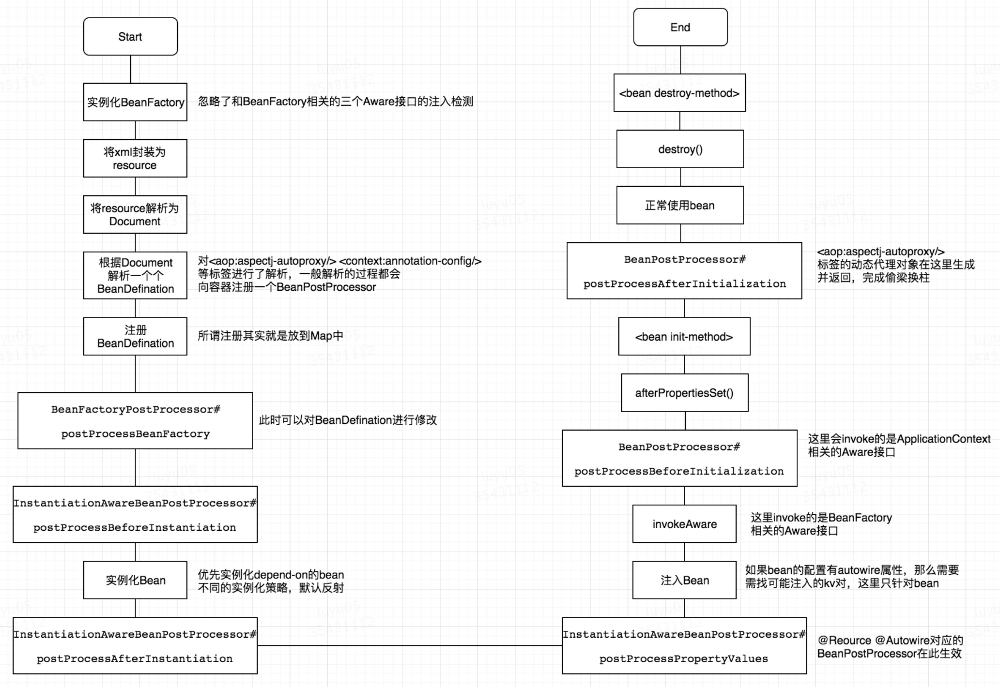
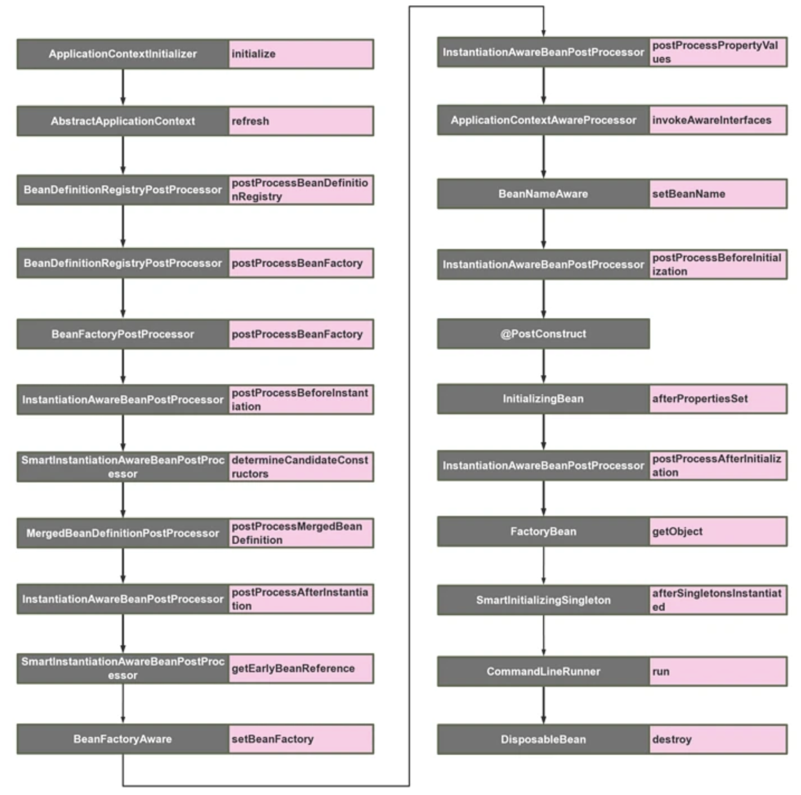

## Spring启动流程

Bean作为Spring Framework的核心，其生命周期可以分为五个主干流程：

1、容器启动阶段（严格来讲这个不属于Bean的生命周期）

2、Bean（单例非懒加载）的实例化阶段

3、Bean的属性注入阶段

4、Bean的初始化阶段

5、Bean的销毁阶段

Spring容器启动流程



### 扩展接口启动调用顺序图



## ApplicationContextInitializer

```java
// org.springframework.context.ApplicationContextInitializer
public interface ApplicationContextInitializer<C extends ConfigurableApplicationContext> {
   /**
    * Initialize the given application context.
    * @param applicationContext the application to configure
    */
   void initialize(C applicationContext);
}
```
### 功能

spring容器在刷新之前初始化 ConfigurableApplicationContext 的回调接口，简单来说，就是在容器刷新之前调用此类的 initialize 方法。 用户可以在整个spring容器还没被初始化之前做一些事情。

使用场景：

在最开始激活一些配置，或者利用这时候class还没被类加载器加载的时机，进行动态字节码注入等操作。

### 代码示例

```java
public class MyApplicationContextInitializer implements ApplicationContextInitializer {
    @Override
    public void initialize(ConfigurableApplicationContext applicationContext) {
        System.out.println("MyApplicationContextInitializer");
    }
}
```
因为这时候spring容器还没被初始化，所以想要自己的扩展的生效，有以下三种方式：
1、在启动类中用加入

```java
springApplication.addInitializers(new TestApplicationContextInitializer())
```
2、配置文件配置
```plain
context.initializer.classes=com.example.demo.TestApplicationContextInitializer
```
3、Spring SPI扩展，在spring.factories中加入
```plain
org.springframework.context.ApplicationContextInitializer=com.example.demo.TestApplicationContextInitializer
```
## BeanDefinitionRegistryPostProcessor

### 功能

该接口在读取项目中的beanDefinition之后执行，提供一个补充的扩展点

使用场景：你可以在这里动态注册自己的beanDefinition，可以加载classpath之外的bean

### 代码示例

```java
public class TestBeanDefinitionRegistryPostProcessor implements BeanDefinitionRegistryPostProcessor {
    @Override
    public void postProcessBeanDefinitionRegistry(BeanDefinitionRegistry registry) throws BeansException {
        System.out.println("[BeanDefinitionRegistryPostProcessor] postProcessBeanDefinitionRegistry");
    }
    @Override
    public void postProcessBeanFactory(ConfigurableListableBeanFactory beanFactory) throws BeansException {
        System.out.println("[BeanDefinitionRegistryPostProcessor] postProcessBeanFactory");
    }
}

```
## BeanFactoryPostProcessor

### 功能

该接口是beanFactory的扩展接口，调用时机在spring在读取beanDefinition信息之后，实例化bean之前。

用户可以通过实现这个扩展接口来自行处理一些东西，比如修改已经注册的beanDefinition的元信息。 

### 代码示例

```json
public class MyBeanFactoryPostProcessor implements BeanFactoryPostProcessor {
    @Override
    public void postProcessBeanFactory(ConfigurableListableBeanFactory beanFactory) throws BeansException {
        System.out.println("MyBeanFactoryPostProcessor");
    }
}
```
## InstantiationAwareBeanPostProcessor

## 功能

该接口继承了BeanPostProcess接口，区别如下 ：

BeanPostProcess接口只在bean的**初始化阶段**进行扩展（注入spring上下文前后），而InstantiationAwareBeanPostProcessor接口在此基础上增加了3个方法，把可扩展的范围增加了**实例化阶段**和**属性注入阶段**。

该类主要的扩展点有以下5个方法，主要在bean生命周期的两大阶段：实例化阶段和初始化阶段，下面一起进行说明，按调用顺序为：

1、postProcessBeforeInstantiation：实例化bean之前，相当于new这个bean之前

2、postProcessAfterInstantiation：实例化bean之后，相当于new这个bean之后

3、postProcessPropertyValues：bean已经实例化完成，在属性注入时阶段触发@Autowired, @Resource等注解原理基于此方法实现

4、postProcessBeforeInitialization：初始化bean之前，相当于把bean注入spring上下文之前

5、postProcessAfterInitialization：初始化bean之后，相当于把bean注入spring上下文之后

使用场景：

无论是写中间件和业务，都能利用这个特性。比如对实现了某一类接口的bean在各个生命期间进行收集，或者对某个类型的bean进行统一的设值等等。

### 代码

```java
public class MyInstantiationAwareBeanPostProcessor implements InstantiationAwareBeanPostProcessor {
    @Override
    public Object postProcessBeforeInitialization(Object bean, String beanName) throws BeansException {
        System.out.println("[MyInstantiationAwareBeanPostProcessor] postProcessBeforeInitialization " + beanName);
        return bean;
    }
    @Override
    public Object postProcessAfterInitialization(Object bean, String beanName) throws BeansException {
        System.out.println("[MyInstantiationAwareBeanPostProcessor] postProcessAfterInitialization " + beanName);
        return bean;
    }
    @Override
    public Object postProcessBeforeInstantiation(Class<?> beanClass, String beanName) throws BeansException {
        System.out.println("[MyInstantiationAwareBeanPostProcessor] postProcessBeforeInstantiation " + beanName);
        return null;
    }
    @Override
    public boolean postProcessAfterInstantiation(Object bean, String beanName) throws BeansException {
        System.out.println("[MyInstantiationAwareBeanPostProcessor] postProcessAfterInstantiation " + beanName);
        return true;
    }
    @Override
    public PropertyValues postProcessPropertyValues(PropertyValues pvs, PropertyDescriptor[] pds, Object bean, String beanName) throws BeansException {
        System.out.println("[MyInstantiationAwareBeanPostProcessor] postProcessPropertyValues " + beanName);
        return pvs;
    }
}
```
## SmartInstantiationAwareBeanPostProcessor

### 功能

该扩展接口有3个触发点方法

1、predictBeanType

该触发点发生在postProcessBeforeInstantiation之前(在图上并没有标明，因为一般不太需要扩展这个点)，这个方法用于预测Bean的类型，返回第一个预测成功的Class类型，如果不能预测返回null；当你调用BeanFactory.getType(name)时当通过bean的名字无法得到bean类型信息时就调用该回调方法来决定类型信息。

2、determineCandidateConstructors

该触发点发生在postProcessBeforeInstantiation之后，用于确定该bean的构造函数之用，返回的是该bean的所有构造函数列表。用户可以扩展这个点，来自定义选择相应的构造器来实例化这个bean。

3、getEarlyBeanReference

该触发点发生在postProcessAfterInstantiation之后，当有循环依赖的场景，当bean实例化好之后，为了防止有循环依赖，会提前暴露回调方法，用于bean实例化的后置处理。这个方法就是在提前暴露的回调方法中触发。

### 代码示例

```java
public class MySmartInstantiationAwareBeanPostProcessor implements SmartInstantiationAwareBeanPostProcessor {
    @Override
    public Class<?> predictBeanType(Class<?> beanClass, String beanName) throws BeansException {
        System.out.println("[MySmartInstantiationAwareBeanPostProcessor] predictBeanType " + beanName);
        return beanClass;
    }
    @Override
    public Constructor<?>[] determineCandidateConstructors(Class<?> beanClass, String beanName) throws BeansException {
        System.out.println("[MySmartInstantiationAwareBeanPostProcessor] determineCandidateConstructors " + beanName);
        return null;
    }
    @Override
    public Object getEarlyBeanReference(Object bean, String beanName) throws BeansException {
        System.out.println("[MySmartInstantiationAwareBeanPostProcessor] getEarlyBeanReference " + beanName);
        return bean;
    }
}
```
## BeanFactoryAware

### 功能

该类只有一个触发点，发生在bean的实例化之后，注入属性之前，也就是Setter之前。这个类的扩展点方法为 setBeanFactory，可以拿到BeanFactory这个属性。

使用场景：

可以在bean实例化之后，但还未初始化之前，拿到 BeanFactory，然后可以对每个bean作特殊化的定制。也或者可以把BeanFactory拿到进行缓存，日后使用。 

### 代码示例

```java
public class BeanFactoryHolder implements BeanFactoryAware {
    private static BeanFactory beanFactory;
    @Override
    public void setBeanFactory(BeanFactory beanFactory) throws BeansException {
        this.beanFactory = beanFactory;
        System.out.println("[BeanFactoryHolder] " + beanFactory.getBean(TestBeanFactoryAware.class).getClass().getSimpleName());
    }
}
```

## ApplicationContextAwareProcessor

### EnvironmentAware

#### 功能

用于获取EnviromentAware的一个扩展类，这个变量非常有用， 可以获得系统内的所有参数。当然个人认为这个Aware没必要去扩展，因为spring内部都可以通过注入的方式来直接获得。 

### EmbeddedValueResolverAware

#### 功能

用于获取StringValueResolver的一个扩展类， StringValueResolver用于获取基于String类型的properties的变量，一般我们都用@Value的方式去获取，如果实现了这个Aware接口，把StringValueResolver缓存起来，通过这个类去获取String类型的变量，效果是一样的。

### ResourceLoaderAware

#### 功能

用于获取ResourceLoader的一个扩展类，ResourceLoader可以用于获取classpath内所有的资源对象，可以扩展此类来拿到ResourceLoader对象。

### ApplicationEventPublisherAware

#### 功能

用于获取ApplicationEventPublisher的一个扩展类，ApplicationEventPublisher可以用来发布事件，结合ApplicationListener来共同使用，下文在介绍ApplicationListener时会详细提到。这个对象也可以通过spring注入的方式来获得。

### MessageSourceAware

#### 功能

用于获取MessageSource的一个扩展类，MessageSource主要用来做国际化。

 

### ApplicationContextAware

### 功能

实现该接口可获取到 ApplicationContext，ApplicationContext应该是很多人非常熟悉的一个类了，就是spring上下文管理器，可以手动的获取任何在spring上下文注册的bean，我们经常扩展这个接口来缓存spring上下文，包装成静态方法。同时ApplicationContext也实现了BeanFactory，MessageSource，ApplicationEventPublisher等接口，也可以用来做相关接口的事情。

 

### 代码示例

```java
@Component
public class Demo implements ApplicationContextAware {
  ApplicationContext applicationContext;
  @Override
  public void setApplicationContext(ApplicationContext applicationContext) throws BeansException {
    this.applicationContext = applicationContext;
  }
}
```
### 原理

由 ApplicationContextAwareProcessor 实现，在bean对象初始化之前判断bean是否是ApplicationContextAware类型

具体方法见：postProcessBeforeInitialization

```java
// org.springframework.context.support.ApplicationContextAwareProcessor
#postProcessBeforeInitialization
@Nullable
public Object postProcessBeforeInitialization(Object bean, String beanName) throws BeansException {
    AccessControlContext acc = null;
    if (System.getSecurityManager() != null && (bean instanceof EnvironmentAware || bean instanceof EmbeddedValueResolverAware || bean instanceof ResourceLoaderAware || bean instanceof ApplicationEventPublisherAware || bean instanceof MessageSourceAware || bean instanceof ApplicationContextAware)) {
        acc = this.applicationContext.getBeanFactory().getAccessControlContext();
    }
    if (acc != null) {
        AccessController.doPrivileged(() -> {
            this.invokeAwareInterfaces(bean);
            return null;
        }, acc);
    } else {
        this.invokeAwareInterfaces(bean);
    }
    return bean;
}
```
该方法会调用 invokeAwareInterfaces 方法注入属性。
```java
private void invokeAwareInterfaces(Object bean) {
    if (bean instanceof Aware) {
        if (bean instanceof EnvironmentAware) {
            ((EnvironmentAware)bean).setEnvironment(this.applicationContext.getEnvironment());
        }
        if (bean instanceof EmbeddedValueResolverAware) {
            ((EmbeddedValueResolverAware)bean).setEmbeddedValueResolver(this.embeddedValueResolver);
        }
        if (bean instanceof ResourceLoaderAware) {
            ((ResourceLoaderAware)bean).setResourceLoader(this.applicationContext);
        }
        if (bean instanceof ApplicationEventPublisherAware) {
            ((ApplicationEventPublisherAware)bean).setApplicationEventPublisher(this.applicationContext);
        }
        if (bean instanceof MessageSourceAware) {
            ((MessageSourceAware)bean).setMessageSource(this.applicationContext);
        }
        if (bean instanceof ApplicationContextAware) {
            ((ApplicationContextAware)bean).setApplicationContext(this.applicationContext);
        }
    }
}
```
## BeanNameAware

### 功能

该类也是Aware扩展的一种，触发点在bean的初始化之前，也就是postProcessBeforeInitialization之前，触发点方法只有一个：setBeanName

使用场景：

用户可以扩展这个点，在初始化bean之前拿到spring容器中注册的的beanName，自行修改这个beanName的值。 

### 代码示例

```java
public class MyBeanNameAware implements BeanNameAware{
    public NormalBeanA() {
        System.out.println("MyBeanNameAware constructor");
    }
    @Override
    public void setBeanName(String name) {
        System.out.println("[MyBeanNameAware] setBeanName: " + name);
    }
}
```
## @PostConstruct

### 功能

作用在bean的初始化阶段，如果对一个方法使用了@PostConstruct，会先调用这个方法。触发点是在postProcessBeforeInitialization之后，InitializingBean.afterPropertiesSet之前。

使用场景：

用户可以对某一方法进行标注，来进行初始化某一个属性

### 代码示例

```java
public class MyPostConstruct {
    public MyPostConstruct() {
        System.out.println("[MyPostConstruct] constructor");
    }
    @PostConstruct
    public void init(){
        System.out.println("[MyPostConstruct] init");
    }
} 
```
## InitializingBean

### 功能

用来初始化bean。InitializingBean接口为bean提供了初始化方法的方式，它只包括afterPropertiesSet方法，凡是继承该接口的类，在初始化bean的时候都会执行该方法。这个扩展点的触发时机在postProcessAfterInitialization之前。

使用场景：

用户实现此接口，来进行系统启动的时候一些业务指标的初始化工作。 

### 代码示例

```java
public class MyInitializingBean implements InitializingBean {
    @Override
    public void afterPropertiesSet() throws Exception {
        System.out.println("[MyInitializingBean] afterPropertiesSet");
    }
}
```
## FactoryBean

### 功能

创建FactoryBean

一般情况下，Spring通过反射机制利用bean的class属性指定支线类去实例化bean，在某些情况下，实例化Bean过程比较复杂，如果按照传统的方式，则需要在bean中提供大量的配置信息。配置方式的灵活性是受限的，这时采用编码的方式可能会得到一个简单的方案。Spring为此提供了一个org.springframework.bean.factory.FactoryBean的工厂类接口，用户可以通过实现该接口定制实例化Bean的逻辑。FactoryBean接口对于Spring框架来说占用重要的地位，Spring自身就提供了70多个FactoryBean的实现。它们隐藏了实例化一些复杂bean的细节，给上层应用带来了便利。从Spring3.0开始，FactoryBean开始支持泛型，即接口声明改为FactoryBean<T>的形式

使用场景：

用户可以扩展这个类，来为要实例化的bean作一个代理，比如为该对象的所有的方法作一个拦截，在调用前后输出一行log，模仿ProxyFactoryBean的功能。 

### 代码示例

```java
public class CarFactoryBean implements FactoryBean<Car> {
  @Override
  public Car getObject() throws Exception {
    return new Car();
  }
  @Override
  public Class<?> getObjectType() {
    return Car.class;
  }
  @Override
  public boolean isSingleton() {
    reutrn false; // true表示单实例
  }
}
```
### 原理

参考spring bean的加载过程，FactoryBean获取到的实际是getObject方法得到的对象，如果要获取真实的FactoryBean对象，需要在bean的id加个"&"前缀，如"&carFactoryBean"。

## SmartInitializingSingleton

### 功能

这个接口中只有一个方法afterSingletonsInstantiated，其作用是是 在spring容器管理的所有单例对象（非懒加载对象）初始化完成之后调用的回调接口。其触发时机为postProcessAfterInitialization之后。

使用场景：

用户可以扩展此接口在对所有单例对象初始化完毕后，做一些后置的业务处理。

### 代码示例

```java
public class MySmartInitializingSingleton implements SmartInitializingSingleton {
    @Override
    public void afterSingletonsInstantiated() {
        System.out.println("[MySmartInitializingSingleton] afterSingletonsInstantiated ");
    }
}
```
## CommandLineRunner

### 功能

接口只有一个方法：run(String... args)，触发时机为整个项目启动完毕后，自动执行。如果有多个CommandLineRunner，可以利用@Order来进行排序。

使用场景：

用户扩展此接口，进行启动项目之后一些业务的预处理。 

### 代码示例

```java
public class MyCommandLineRunner implements CommandLineRunner {
    @Override
    public void run(String... args) throws Exception {
        System.out.println("[MyCommandLineRunner] run ");
    }
}
```
## DisposableBean

### 功能

扩展点也只有一个方法：destroy()，其触发时机为当此对象销毁时，会自动执行这个方法。比如说运行applicationContext.registerShutdownHook时，就会触发这个方法。 

### 代码示例

```java
public class MyDisposableBean implements DisposableBean {
    @Override
    public void destroy() throws Exception {
        System.out.println("[MyDisposableBean] destroy");
    }
}
```
## ApplicationListener

### 功能

ApplicationListener可以监听某个事件的event，触发时机可以穿插在业务方法执行过程中，用户可以自定义某个业务事件。但是spring内部也有一些内置事件，可以穿插在启动调用中。可以利用这个特性，来自己做一些内置事件的监听器来达到和前面一些触发点大致相同的事情。 

spring主要的内置事件：

1、ContextRefreshedEventApplicationContext 

被初始化或刷新时，该事件被发布。这也可以在 ConfigurableApplicationContext接口中使用 refresh() 方法来发生。此处的初始化是指：所有的Bean被成功装载，后处理Bean被检测并激活，所有Singleton Bean 被预实例化，ApplicationContext容器已就绪可用。

2、ContextStartedEvent

使用 ConfigurableApplicationContext （ApplicationContext子接口）接口中的 start() 方法启动 ApplicationContext 时，该事件被发布。你可以调查你的数据库，或者你可以在接受到这个事件后重启任何停止的应用程序。

3、ContextStoppedEvent

使用 ConfigurableApplicationContext 接口中的 stop() 停止 ApplicationContext 时，发布这个事件。你可以在接受到这个事件后做必要的清理的工作

4、ContextClosedEvent

使用 ConfigurableApplicationContext接口中的 close()方法关闭 ApplicationContext 时，该事件被发布。一个已关闭的上下文到达生命周期末端；它不能被刷新或重启

5、RequestHandledEvent

这是一个 web-specific 事件，告诉所有 bean HTTP 请求已经被服务。只能应用于使用DispatcherServlet的Web应用。在使用Spring作为前端的MVC控制器时，当Spring处理用户请求结束后，系统会自动触发该事件

## Reference

[Spring启动扩展点](https://segmentfault.com/a/1190000023033670)

[https://www.jianshu.com/p/397c15cbf34a](https://www.jianshu.com/p/397c15cbf34a)

[https://luyu05.github.io/2019/06/26/SpringFrame-Extension-Point/](https://luyu05.github.io/2019/06/26/SpringFrame-Extension-Point/)

[EventListener注解的使用](https://segmentfault.com/a/1190000039097608)

