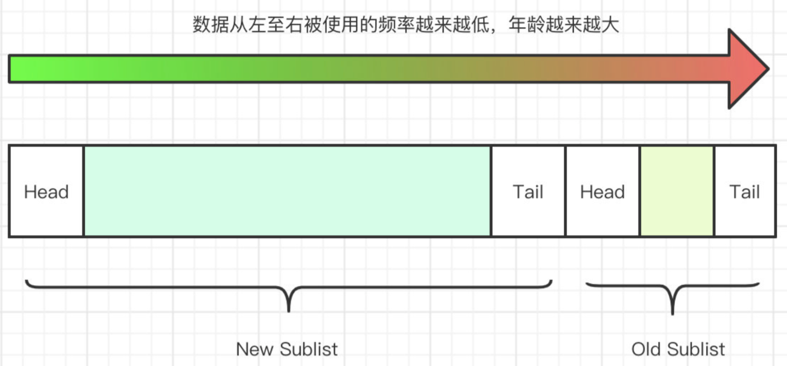
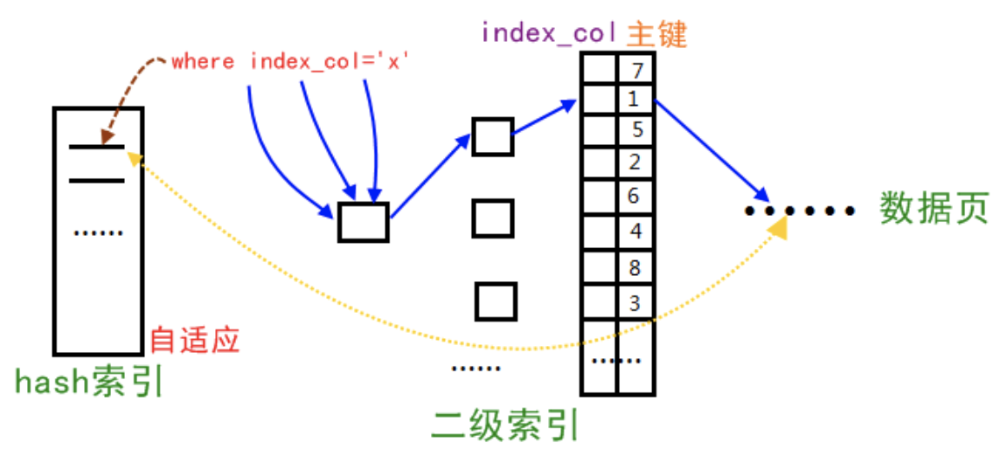

# 体系结构与存储引擎

## 定义数据库与实例

数据库：物理操作系统文件或其他形式文件类型的集合。

实例：MySQL数据库由后台线程以及一个共享内存区组成

MySQL被设计为一个**单进程多线程**架构的数据库，与SQL Server比较类似。而Oracle是**多进程**的架构。

查看MySQL实例启动时，在哪些位置查找配置文件：

```shell
mysql --help | grep my.cnf
```
可以看出，是按/etc/my.cnf -> /etc/mysql/my.cnf -> /url/local/mysql/etc/my.cnf -> ~/.my.cnf 的顺序读取配置文件，以最后读取到的配置文件为准。

# InnoDB存储引擎

## InnoDB体系架构

内存池负责工作：

1、维护所有进程/线程需要访问的多个内部数据结构

2、缓冲磁盘上的数据，方便快速读取，**同时对磁盘文件的数据修改之前在这里缓冲**

3、重做日志（redo log）缓冲

后台线程的作用：

1、负责刷新内存池中的数据，保证缓冲池中的内存缓存的是最近的数据

2、将已修改的数据文件刷新到磁盘文件，同时保证在数据库发生异常的情况下InnoDB能恢复到正常运行状态

### 后台线程

1、Master Thread

（核心线程）负责将缓冲池中的数据异步刷新到磁盘，保证数据一致性，包括脏页的刷新、合并插入缓冲、UNDO页的回收等

2、IO Thread

使用大量异步线程处理写IO请求。write/read/insert buffer/log IO thread

```shell
SHOW VARIABLES LIKE 'innodb_version'\G;
SHOW VARIBALES LIKE 'innodb_%io_threads'\G;
```
可以通过命令**SHOW ENGINE INNODB STATUS**观察InnoDB的IO Thread。
3、Purge Thread

事务被提交后，其所使用的undolog可能不再需要，因此需要PurgeThread来回收已经使用并分配的undo页。

4、Page Cleaner Thread

作用：将之前版本中脏页的刷新操作都放入到单独的线程中来完成。目的：减轻原Master Thread的工作及对于用户查询线程的阻塞，进一步提高性能。

### 内存

#### 1、缓冲池

缓冲池缓存的数据页类型有：索引页、数据页、undo页、插入缓冲（insert buffer）、自适应哈希索引（adaptive hash index）、InnoDB存储的锁信息（lock info）、数据字典信息（data dictionary）等。

缓冲池实例数（默认1，可配置）：

```shell
SHOW VARIABLES LIKE 'innodb_buffer_pool_instances'\G;
```
#### 2、LRU、Free、Flush

LRU加入了midpoint位置，新读取到的页，虽然是最新访问的页，但并不是直接放入到LRU列表的首部，而是放入到LRU列表的midpoint位置。该算法称为midpoint insertion strategy。默认配置该位置在LRU列表长度的5/8处。由参数innodb_old_blocks_pct控制。innodb_old_blocks_time表示页读取到mid位置后需要等待多久才能被加入到LRU列表的热端。

命令（红色）结果Database pages表示LRU列表中页的数量。

page made young表示LRU列表中页移动到前端的次数。

脏页（LRU列表中的页被修改后，称为脏页）通过CHECKPOIN机制将脏页刷新回磁盘，而Flush列表中的页即为脏页。

>脏页既存在于LRU列表中，也存在于Flush列表中。LRU列表用来管理缓冲池中页的可用性，Flush列表用来管理将页刷新回磁盘，二者互不影响。

Modified db pages 表示脏页的数量

元数据表可查看：

```plain
SELECT TABLE_NAME, SPACE, PAGE_NUMBER, PAGE_TYPE 
FROM INNODB_BUFFER_PAGE_LRU
WHERE OLDEST_MODIFICATION > 0;
```
Free为空闲列表
#### 3、重做日志缓冲

redo log buffer

大小有配置参数innodb_log_buffer_size控制。通常8MB满足绝大部分应用，因为下列三种情况会将内容刷新到外部磁盘的重做日志文件中：

1）Master Thread每一秒将重做日志缓冲刷新到重做日志文件

2）每个事物提交是会将重做日志缓冲刷新到重做日志文件

3）当重做日志缓冲池剩余空间小于1/2时，重做日志缓冲刷新到重做日志文件

#### 4、额外的内存池

对内存的管理是通过一种称为内存堆（heap）的方式进行的。内存分配时，需要从额外的内存池中进行申请，例如分配缓冲池，每个缓冲池中的帧缓冲（frame buffer）还有对应的缓冲控制对象（buffer control block）（记录LRU、锁、等待等信息）。所以申请很大的缓冲池时，也应考虑相应增加该值。

#### Buffer Pool的LRU算法

了解完了InnoDB的内存结构之后，我们来仔细看看Buffer Pool的LRU算法是如何实现将最近没有使用过的数据给过期的。

**原生LRU**

首先明确一点，此处的LRU算法和我们传统的LRU算法有一定的区别。为什么呢？因为实际生产环境中会存在全表扫描的情况，如果数据量较大，可能会将Buffer Pool中存下来的热点数据给全部替换出去，而这样就会导致该段时间MySQL性能断崖式下跌。

对于这种情况，MySQL有一个专用名词叫缓冲池污染。所以MySQL对LRU算法做了优化。

**优化后的LRU**

优化之后的链表被分成了两个部分，分别是 New Sublist 和 Old Sublist，其分别占用了 Buffer Pool 的3/4和1/4。




该链表存储的数据来源有两部分，分别是：

1、MySQL的预读线程预先加载的数据

2、用户的操作，例如Query查询

默认情况下，由用户操作影响而进入到Buffer Pool中的数据，会被立即放到链表的最前端，也就是 New Sublist 的 Head 部分。但如果是MySQL启动时预加载的数据，则会放入MidPoint中，如果这部分数据被用户访问过之后，才会放到链表的最前端。

这样一来，虽然这些页数据在链表中了，但是由于没有被访问过，就会被移动到后1/4的 Old Sublist中去，直到被清理掉。

### Checkpoint技术

当前事务数据库系统普遍采用Write Ahead Log策略，即当事务提交时，先写重做日志，再修改页。宕机通过重做日志恢复数据，保证数据持久性。

Checkpoint（检查点）技术的目的解决如下问题：

1、缩短数据库的恢复时间

2、缓冲池不够用时，将脏页刷新到磁盘

3、重做日志不可用时，刷新脏页

宕机时，不需要重做所有的日志，Checkpoint之前的页都已经刷新回磁盘，大大缩短恢复时间。

重做日志不可用是因为其设计为循环使用，并不是让其无限增大。重做日志可以被重用的部分是指这些重做日志已经不再需要，即宕机时，恢复操作不需要这部分的重做日志，因此可以覆盖使用。若此时还需要使用，则必须强制产生Checkpoint，将缓冲池中的页至少刷新到当前重做日志的位置。

Checkpoint将缓冲池中的脏页刷回到磁盘。

两种Checkpoint：

1、Sharp Checkpoint

2、Fuzzy Checkpoint

Sharp Checkpoint发生在数据库关闭时将所有的脏页都刷新回磁盘，默认工作方式，即参数innodb_fast_shutdown=1

如果运行时使用Sharp Checkpoint性能受到很大影响。故使用Fuzzy Checkpoint只刷新一部分脏页，而不是刷新所有的脏页回磁盘。

几种情况的Fuzzy Checkpoint：

1、Master Thread Checkpoint

>每秒或每十秒异步

2、FLUSH_LRU_LIST Checkpoint


>保证LRU列表需要大约100多个空闲也可用，移除LRU列表尾端的页需要Checkpoint
3、Async/Sync Flush Checkpoint

>重做日志不可用，保证重做日志循环使用

4、Dirty Page too much Checkpoint

>脏页数量太多（配置参数：innodb_max_dirty_pages_pct）

## Master Thread工作方式

### 1.0.x版本之前的Master Thread

具有最高的线程优先级别。内部由多个循环组成（根据数据库运行状态进行切换）：

**1、主循环（loop）**

每秒一次的操作包括：

* 日志缓冲刷新到磁盘，即使事务还没有提交（总是）
* 合并插入缓冲（可能）
* 至多刷新100个InnoDB的缓冲池中的脏页到磁盘（可能）
* 如果当前没有用户活动，则切换到background loop（可能）

**即使某个事物还没有提交，InnoDB存储引擎仍然每秒会将重做日志缓冲中的内容刷新到重做日志文件。**所以解释为什么再大的事务提交（commit）时间也是很短的。

InnoDB存储引擎判断当前一秒内发生IO次数是否小于5次，是则认为当前IO压力小，可以执行合并插入缓冲的操作。

判断当前缓冲池中脏页的比例（buf_get_modified_ratio_pct，默认为90，代表90%），如果超过，则刷新100个脏页到磁盘。

每十秒的操作包括：

* 刷新100个脏页到磁盘（可能）
* 合并至多5个插入缓冲（总是）
* 将日志缓冲刷新到磁盘（总是）
* 删除无用的Undo页（总是）
* 刷新100个或者10个脏页到磁盘（总是）

判断过去10秒之内磁盘IO操作是否小于200次，是则认为磁盘IO具备操作能力，因此将100个脏页刷新到磁盘。

接着合并插入缓冲操作（总是）。

之后将日志缓冲刷新到磁盘（总是）（和每秒操作一致）。

接着执行full purge操作，即删除无用的Undo页。判断是否可以删除，可以则立即删除。

然后判断缓冲池脏页比例（buf_get_modified_ratio_pct），超过70%，则刷新100个脏页到磁盘，否则刷新10个。

2、后台循环（backgroup loop）

若当前没有用户活动（数据空闲时）或者数据库关闭（shutdown），就会切换到这个循环。backgroup loop会执行以下操作：

* 删除无用的Undo页（总是）
* 合并20个插入缓冲（总是）
* 跳回到主循环（总是）
* 不断刷新100个页直到符合条件（可能，跳转到flush loop中完成）

3、刷新循环（flush loop）

若flush loop也没有事可以做，会切换到suspend loop，将Master Thread挂起，等待事件的发生。若用户启用（enable）InnoDB存储引擎，却未使用任何表，Master Thread总是处于挂起状态。

4、暂停循环（suspend loop）

### 1.2.x版本之前的Master Thread

1.0.x版本之前对于IO有限制，在缓冲池想磁盘刷新时做了硬编码（hard coding），固态硬盘（SSD）出现，则限制了对磁盘IO的性能，尤其是写入。

分析：无论何时，最大只会刷新100个脏页到磁盘，合并20个插入缓冲。如果是写密集每秒可能产生大于100个脏页，如果产生大于20个插入缓冲，Master Thread可能忙不过来或者说慢。

从1.0.x版本提供参数innodb_io_capacity表示磁盘吞吐量，默认200。对于刷新到磁盘页的数量，会按照该参数的百分比来控制。规则如下：

* 合并插入缓冲时，数量为该参数的5%
* 从缓冲区刷新脏页时，数量为该值

参数innodb_max_dirty_pages_pct默认值90，即脏页占缓冲池90%。该值太大，内存很大时DB压力很大，刷新脏页速度很慢，数据恢复时间更久。

1.0.x版本提供默认值75，和Google测试的80最接近。这样既可以加快刷新脏页的频率，又能保证磁盘IO的负载。（太小增加磁盘的压力）

增加参数innodb_adaptive_flushing（自适应地刷新）。原来刷新规则：脏页在缓冲池所占比例小于innodb_max_dirtypages_pct时，不刷新脏页；大于时刷新100个脏页。引入该参数后，buf_flush_get_desired_flush_rate函数通过判断产生重做日志（redo log）的速度决定最适合的刷新脏页数量。因此脏页比例小于innodb_max_dirtypages_pct时，也会刷新一定量的脏页。

之前每次full purge时，最多回收20个Undo页，1.0.x版本引入参数innodb_purge_batch_size，控制每次full purge回收的Undo页的数量。默认值为20。

1.0.x版本在性能方面取得了极大的提高。

### 1.2.x版本的Master Thread

对于刷新脏页的操作，从Master Thread线程分离到一个单独的Page Cleaner Thread，减轻主线程工作，提高并发。

## InnoDB关键特性

### 1、插入缓冲（Insert Buffer）

性能提升

#### 1）Insert Buffer

对于非聚集索引的插入或更新操作，不是每一次直接插入到索引页中，而是先判断插入的非聚集索引是否在缓冲池中，若在直接插入，否则先放到一个Insert Buffer对象中。然后以一定的频率和情况进行Insert Buffer和辅助索引页子节点的merge（合并）操作。这通常能将多个插入合并到一个操作中（在一个索引页中），大大提高非聚集索引插入的性能

使用需要满足两个条件：

* 索引是辅助索引
* 索引**不是唯一**的

问题：若宕机有大量的Insert Buffer并没有合并到实际的非聚集索引中，恢复需要大量时间（甚至几小时）。修改占用缓冲池大小的比例

#### 2）Change Buffer

1.0.x版本引入了Change Buffer，可将其视为Insert Buffer的升级。可以对DML操作（INSERT/ DELETE/UPDATE）都进行缓冲，分别是Insert Buffer、Delete Buffer、Purge Buffer。

适用条件：**非唯一的辅助索引**。

UPDATE操作可分为两个过程：

* 将记录标记为已删除（Delete Buffer）
* 真正将记录删除（Purge Buffer）

参数innofb_chage_buffering用来开启各种buffer选项。可选inserts/deletes/purges /changes/all/none（默认all）。参数innodb_change_buffer_max_size控制Change Buffer最大使用内存数量。默认25，表示最多使用25%的缓冲池内存空间，最大有效值50。

#### 3）Insert Buffer的内部实现

其数据结构是一颗B+树。MySQL4.1之前的版本中每张表都有一颗Insert Buffer B+树，现在版本全局只有一颗。存放在共享空间中，默认也就是ibdata1中。因此试图通过独立表空间idb文件恢复表中数据时，往往会导致CHECK TABLE失败。因为表的辅助索引中的数据可能还在Insert Buffer中，也就是共享空间中，所以还需要进行REPAIR TABLE操作来重建表上所有的辅助索引。（详情见P51）

#### 4）Merge Insert Buffer

Insert Buffer的记录合并（merge）到真正的辅助索引中

该操作可能发生在以下几种情况下：

* 辅助索引页被读取到缓冲池时
* Insert Buffer Bitmap页追踪到该辅助索引页已无可用空间时
* Master Thread

### 2、两次写（Double Write）

可靠性。

解决诸如部分写失效（partial page write）等问题。

为什么不使用重做日志恢复？因为重做日志记录的是对页的物理操作，如偏移量xx写AA。如果页本身损坏，重做没有意义。即应用重做日志前，需要一个页的副本，当写入失效发生时，先通过页的副本还原该页，再进行重做，这就是doublewrite。

doublewrite由两部分组成：

* doublewrite buffer（2MB）
* 物理磁盘上共享表空间中连续的128个页，即2个区（extent），大小同样为2MB。
在对缓冲池的脏页进行刷新时，并不直接写磁盘，而是会通过memcpy函数将脏页先复制到内存中的doublewrite buffer，之后通过doublewrite buffer再分两次，每次1MB顺序写入共享表空间的物理磁盘上（顺序文件），然后调用fsync函数，同步磁盘（真正的数据文件.ibd），避免缓冲写带来的问题。

```shell
SHOW GLOBAL STATUS LIKE 'innodb_dblwr%'\G;
```
innodb_dblwr_pages_written为写了的页数，innodb_dblwr_writes为实际写入次数，其比例小于64：1则说明系统写入压力不高。
参数skip_innodb_doublewrite可以禁止doublewrite功能，从服务器提高性能可以考虑，主服务器确保开启双写服务。

>诸如ZFS文件系统本身提供了部分写失效的防范机制，可以不启用双写

**理解**

这时利用redo log （页（数据块）的物理操作）来恢复已经损坏的数据块是无效的！数据块的本身已经损坏，再次重做依然是一个坏块！所以此时需要一个数据块的副本来还原该损坏的数据块，再利用重做日志进行其他数据块的重做操作，这就是doublwrite的原因作用！

理解可参考：[http://jockchou.github.io/blog/2015/07/23/innodb-doublewrite-buffer.html](http://jockchou.github.io/blog/2015/07/23/innodb-doublewrite-buffer.html)

### 3、自适应哈希索引（Adaptive Hash Index，AHI）

（Innodb存储引擎会监控对表上二级索引的查找，如果发现某二级索引被频繁访问，二级索引成为热数据，建立哈希索引可以带来速度的提升）




InnoDB存储引擎会监控对表上各索引页的查询。如果观察到建立哈希索引可以带来速度提升，则建立哈希索引，称之为自适应哈希索引。AHI是通过缓冲池的B+树页构造出来，建立速度很快，不需要对整张表构建哈希索引。

要求：对这个页的连续访问模式必须是一样的。

参数innodb_adaptive_hash_index禁用或启动此特性。默认开启。

缺点：

* 会占用innodb buffer pool
* 只能等值查找

### 4、异步IO（Async IO）

除了异步，还有一个优势是IO Merge操作。

1.1.x之前，AIO通过代码模拟实现。1.1.x提供了内核级别AIO的支持（Native AIO，mac系统不支持）。需要libaio库支持。

参数innodb_use_native_aio用来控制是否启用Native AIO，Linux系统下默认ON。

### 5、刷新临接页（Flush Neighbor Page）

当刷新一个脏页时，检测该页所在区（extent）的所有页，如果是脏页，那么一起刷新。通过AIO将多个IO写入操作合并为一个。

两个问题：

1、是否可能将不怎么脏的页进行写入，该页很快又会变成脏页？

2、固态硬盘有较高的IOPS，也需要该特性？

1.2.x版本开始提供innodb_flush_neighbors控制是否启用该特性。建议传统机械硬盘启动，固态硬盘不启用。

## 启动、关闭与恢复

参数innodb_fast_shutdown影响：

* 0表示DB关闭时，需完成所有的full purge和merge insert buffer，并且将所有的脏页刷新回磁盘
>full purge：删除无用的Undo页
>merge insert buffer：Insert Buffer的记录合并到真正的辅助索引中

* 1为默认值，不需要完成full purge和merge insert buffer，但将所有脏页刷新会磁盘
* 2两者皆不，而是将日志都写入日志文件，下次启动，会进行恢复操作（recovery）
>kill关闭DB，也会进行恢复操作

参数innodb_force_recovery，略

# 文件

## 参数文件

## 日志文件

### 1、错误日志

```shell
SHOW VARIABLES LIKE 'log_error' # 定位文件名和路径
system hostname  # 主机名，默认错误日志为 主机名.err
```
### 2、慢查询日志

参数long_query_time设置运行时间阈值，超过（不包括等于）则记录在慢查询日志中，默认值为10（秒）。

参数log_slow_queries为记录开关。

参数log_queries_not_using_indexes，如果运行语句没有使用索引，是否记录到该日志开关。

### 3、查询日志

### 4、二进制日志

记录了对DB执行更改的所有操作，但不包括SELECT和SHOW这类操作

>若操作本身并没有导致DB发生变化，那么可能也会写入二进制日志

```plain
SHOW MASTER STATUS # 得到File名称

SHOW BINLOG EVENTS IN 'mysqld.000008' # 使用File名称查询
```
二进制日志作用：
* 恢复（recovery）
* 复制（replication）
* 审计（audit）：判断是否有进行注入的攻击

## 套接字文件

UNIX系统本地连接MySQL可采用UNIX域套接字方式，需要一个套接字（socket）文件，一般在/tmp目录下，名为mysql.sock。

## pid文件

默认位于数据库目录下，文件名为主机名.pid

## 表结构定义文件

每个表都有一个以frm为后缀的文件，记录表结构定义，视图也有。可直接只用cat查看

## InnoDB存储引擎文件

### 1、表空间文件

### 2、重做日志文件

# 表

## 索引组织表

表根据主键顺序组织存放的，这种存储方式成为索引组织表（index organized table）。

如果没有显式地定义主键，InnoDB则会按如下方式选择或创建主键：

1、首先判断表中是否有**非空的唯一索引**（Unique NOT NULL），如果有，则该列即为主键。

2、如果不符合上述条件，InnoDB自动创建一个6字节大小的指针

>当表中有多个非空唯一索引时，会选择建表时第一个定义的非空唯一索引为主键。（定义索引的顺序，而不是建表时列的顺序。

```plain
select a,b,c,d,_rowid from table
```
_rowid可以显示表的主键，但只能用于查看单个列为主键的情况
## InnoDB逻辑存储结构

所有数据被逻辑地存放在一个空间中，称之为表空间（tablespace）。**表空间又由段（segment）、区（extent）、页（page）组成**。页在一些文档中有时也称为块（block）。

### 表空间

共享表空间iddata1，即所有数据都存放在该表空间中。若启用参数innodb_file_per_table，则每张表内的数据可以单独放到一个表空间内。

注意：每张表的表空间内存放的只是数据、索引和插入缓冲Bitmap页，其他类的数据，如回滚(undo)信息，插入缓冲索引页、系统事务信息，二次写缓冲(Double write buffer)等还是存放在原来的共享表空间内。

所以即使启动该参数，共享表空间还是不断增大。

### 段

表空间是由各个段组成的，常见的段有数据段、索引段、回滚段等。

InnoDB存储引擎表示索引组织的（index organized），因此数据即索引，索引即数据。

数据段：B+树的叶子节点

索引段：B+树的非叶子节点

对段的管理是引擎自身完成的。

### 区

**区是由连续页组成的空间，在任何情况下每个区的大小都为1MB**。为了保证区中页的连续性，InnoDB存储引擎一次从磁盘中申请4-5个区。默认情况下页大小为16KB，即一个区中共有64个连续的页。

1.0.x版本开始引入压缩页，页大小可通过参数KYE_BLOCK_SIZE设置为8KB/4KB/2KB，因此每个区对应页的数量为128、256、512。

1.2.x版本新增参数innodb_page_size，可将默认页大小置为4K/8K，但页中的数据库不是压缩，此时区中页的数量同样为256、128。

### 页

页（page）也称为块，是InnoDB磁盘管理的最小单位。

1.2.x版本新增参数innodb_page_size，可将页的大小设置为4K/8K/16K，设置完成，则所有表中页的大小都为该值，不可以对其再次进行修改。除非通过mysqldump导入和导出操作来产生新的库。

常见的页类型有：

* 数据页（B-tree Node）
* undo页（undo Log Page）
* 系统页（System Page）
* 事务数据页（Transaction system Page）
* 插入缓冲位图页（Insert Buffer Bitmap）
* 插入缓冲空闲列表页（Insert Buffer Free List）
* 未压缩的二进制大对象页（Uncompressed BLOB Page）
* 压缩的二进制大对象页（compressed BLOB Page）

### 行

InnoDB引擎是面向行（row-oriented），也就是数据时按行进行存放的。每个页存放的行记录有硬性指标，最多允许存放16KB/2-200行，即7992行记录。

## InnoDB行记录格式

### Compact行记录格式

### Redundant行记录格式

### 行溢出数据

MySQL数据库的VARCHAR类型可以存放65535字节。通过测试最长长度为为65532，因为有别的开销。（字符集为latin1，UTF-8、GBK不一样）

>注意如果没有讲SQL_MODE设为严格模式，或许可以建立表，但会抛出warning。自动将VARCHAR类型转换成了TEXT类型。
### Compressed和Dynamic行记录格式

### CHAR的行结构存储

## InnoDB数据页结构

InnoDB数据页由以下7个部分组成：

* File Header（文件头）
* Page Header（页头）
* Infimun和Supremum Records
* User Records（用户记录，即行记录）
* Free Space（空闲空间）
* Page Directory（页目录）
* File Trailer（文件结尾信息）
## Named File Formats机制

## 约束

### 数据完整性

### 约束的创建和查找

### 约束和索引的区别

### 对错误数据的约束

### ENUM和SET约束

### 触发器与约束

### 外键约束

## 视图

## 分区表

# 索引与算法

## InnoDB存储引擎索引概述

常见索引：

* B+树索引
* 全文索引
* 哈希索引

常常被忽略的问题：B+树索引并不能找到一个给定键值的具体行，B+树索引能找到的只是被查找数据行所在的页。然后数据库通过把页读入到内存，再在内存中进行查找，最后得到要查找的数据。

## 数据结构与算法

### 二分查找法

### 二叉查找树和平衡二叉树

## B+树

### B+树索引

1、聚集索引

表中数据按照主键顺序存放

2、辅助索引

3、B+树索引的分裂

4、B+树索引的管理

5、Cardinality值

怎么查看索引是否是高选择性（举例，性别不属于高选择性。取值范围广，几乎没有重复，即高选择性）。Cardinality值表示索引中不重复记录数量的预估值。

>注意，这是个预估值，不是准确值。

数据库对于Cardinality的统计都是通过采样（Sample）的方法来完成。

InnoDB存储引擎内部对更新Cardinality信息的策略为：

* 表中1/16的数据已发生过变化
* stat_modified_counter > 2 000 000 000

## B+树索引的使用

### 不同应用中B+树索引的使用

### 联合索引

### 覆盖索引

即从辅助索引中就可以得到查询的记录，而不需要查询聚集索引中的记录。

### 优化器选择不适用索引的情况

多发生在范围查找、JOIN链接操作等情况下

### 索引提示

显式地告诉优化器使用哪个索引。

### Multi-Range Read优化

好处：

* MRR是数据访问变得较为顺序。在查询辅助索引时，首先根据得到的查询结果按照主键进行排序，并按照主键排序的顺序进行书签查找
* 减少缓冲池中页被替换的次数
* 批量处理对键值的查询操作

MRR的工作方式：

* 将查询得到的辅助索引键值存放于一个缓存中，这时缓存的数据时根据辅助索引键值排序的
* 将缓存中的键值根据RowID进行排序
* 根据RowID的排列顺序来访问实际的数据文件

### Index Condition Pushdown（ICP）优化

MySQL5.6开始支持。

将WHERE的部分过滤操作放在了存储引擎层。大大减少上层SQL层对记录的索取（fetch），提高性能。

## 哈希算法

## 全文索引

1.2.x版本开始支持全文索引。

# 锁

## InnoDB引擎里面的锁

### 一致性非锁定读

一致性非锁定读（consistent nonlocking read）是指InnoDB存储引擎通过行多版本控制（mutil versioning）的方式来读取当前执行时间数据库中行的数据。

### 一致性锁定读

两种一致性的锁定读（locking read）操作：

1、SELECT ... FOR UPDATE

2、SELECT ... LOCK IN SHARE MODE

第一种操作对读取的行记录加一个X锁，其他事务不能对已锁定的行加上任何锁。

第二种操作对读取的行记录加S锁，其他事务可以向被锁定的行加S锁，但如果加X锁，会被阻塞。

### 自增长与锁

在InnoDB存储引擎的内存结构中，对每个含有自增长值得表都有一个自增长计数器（auto-increment counter）。

```sql
SELECT MAX(auto_inc_col) FROM t FOR UPDATE;
```
这种实现方式称作AUTO-INC Locking。这种锁其实是采用一种特殊的表锁机制，为了提高插入的性能，**锁不是在一个事务完成后才释放，而是在完成对自增长值插入的SQL语句后立即释放**。
问题：

1、并发插入性能差，事务必须等待前一个插入的完成（虽然不用等待事务的完成）

2、对于INSERT ... SELECT的大数据两的插入会有插入性能问题

MySQL 5.1.22版本开始，InnoDB提供了一种轻量级互斥量的自增长实现机制，大大提高了自增长值插入的性能。并提供参数innodb_autoinc_lock_mode控制自增长模式，默认值为1。

首先介绍插入类型：

1、insert-like

所有的插入语句，如INSERT、REPLACE、INSERT...SELECT、REPLACE...SELECT、LOAD DATA等

2、simple inserts

插入前能确定插入行数的语句，如INSERT...SELECT、REPLACE...SELECT、LOAD DATA

>不包括INSERT...ON DUPLICATE KEY UPDATE这类语句

3、bulk inserts

插入前不能确定插入行数的语句，如INSERT...SERLECT，REPLACE...SELECT，LOAD DATA

4、mixed-mode inserts

插入中有一部分是自增长的，有一部分是确定的。如INSERT INTO t1(c1, c2) VALUES (1, 'a'), (NULL, 'b')；也可以是指INSERT...ON DUPLICATE KEY UPDATE

上述参数innodb_autoinc_lock_mode以及各个设置下对自增的影响，共有三个有效值可以设定，即0、1、2，具体说明如下：

**值为0：**

MySQL5.1.22版本之前自增长的实现方式，即通过表锁的AUTO-INC Locking。

**值为1：**

默认值。

对于“simple inserts”，该值会用互斥量（mutex）去对内存中的计数器进行累加的操作。

对于“bulk inserts”，还是使用传统表锁的AUTO-INC Locking方式。

在这种配置下，如果不考虑回滚操作，对于自增值列的增长还是连续的。并且在这种方式下，statement-based方式的replication还是能很好地工作。需要注意的是，如果已经使用AUTO-INC Locking方式去产生自增长的值，而这时需要再进行“simple inserts”的操作时，还是需要等待AUTO-INC Locking的释放。

**值为2：**

该模式下，对于所有的“INSERT-like”自增长值的产生都是通过互斥量，而不是AUTO-INC Locking的方式。显然这是性能最高的方式。但在并发插入的情况下，自增长的的值可能不是连续的。

最重要的是，**基于Statement-Base Replication会出现问题。因此，使用该模式任何时候都应该使用row-base replication**。这样才能保证最大的并发性能及replication主从数据的一致。

>InnoDB自增长的实现与MyISAM不同，MyISAM存储引擎是表锁设计，自增长不用考虑并发插入问题。因此在master上用InnoDB，在slave上用MyISAM的replication架构下，用户必须考虑这种情况。

InnoDB中，自增长的列必须是索引，同时必须是索引的第一个列，如果不是则会抛出异常，而MyISAM没有这个问题。

### 外键和锁

InnoDB会自动对其加一个索引，这样可以避免表锁——这比Oracle做得好，Oracle不会自动添加索引，用户必须自己手动添加，这也导致了Oracle可能产生死锁。

对于外键值的插入或者更新，首先需要查询父表中的记录，即SELECT父表。但是对于父表的SELECT操作，不是使用一致性非锁定读的方式，因为这样会发生数据不一致的问题，因此这时使用的是SELECT...LOCK IN SHARE MODE方式，即主动对父表加一个S锁。如果这时父表上已经加了X锁，子表上的操作会被阻塞。

## 锁的算法

### 行锁的3种算法

InnoDB存储引擎有3种行锁的算法，分别是：

* Record Lock：单个行记录上的锁
* Gap Lock：间隙锁，锁定一个范围，但不包括记录本身
* Next-Key Lock：Gap Lock+Record Lock，锁定一个范围，并且锁定记录本身

当查询的索引含有唯一属性时，InnoDB会对Next-Key Lock进行优化，将其降级为Record Lock，即仅锁住索引本身，而不是范围。若是辅助索引，其加上的是Next-Key Lock。

用户可以通过以下两种方式来显式地关闭Gap Lock：

* 将事务的隔离级别设置为READ COMMITTED
* 将参数innodb_locks_unsafe_for_binlog设置为1

在上述的配置下，除了外键约束和唯一性检查依然需要的Gap Lock，其余情况仅使用Record Lock进行锁定。但是，上述设置破坏了事务的隔离性，并且对于replication，可能会导致主从数据的不一致。此外，从性能上来看，READ COMMITTED也不会优于默认的事务隔离级别READ REPEATEABLE。

### 解决Phantome Problem

Phantom Problem是指在同一事务下，连续执行两次同样的SQL语句可能导致不同的结果，第二次SQL语句可能会返回之前不存在的行。

在默认的事务隔离级别下，即REPEATABLE READ下，InnoDB采用Next-Key Locking机制来避免Phantom Problem（幻象问题）。其他DB可能需要在SERIALIZABLE的事务隔离级别下才能解决该问题。

## 锁问题

### 脏读

### 不可重复读

### 丢失更新

## 阻塞

## 死锁

## 锁升级

锁升级（Lock Escalation）是指当前锁的粒度降低。比如，DB把一个表的1000个行锁升级为一个页锁，或者将页锁升级为表锁。这种升级保护了系统资源，防止系统用太多的内存来维护锁，在一定程度上提高了效率。但锁升级带来的一个问题是因为锁粒度的降低而导致并发性能的降低。

# 事务

## 事务的实现

### redo

### undo

### purge

delete和update操作可能并不直接删除原有的数据。例如delete，将主键列等于xx的记录delete flag设置为1，记录并没有被删除，即记录还存在于B+树中。其次，对辅助索引没有做处理，甚至没有产生undo log。而真正删除这行记录的操作其实被“延时”了，最终在purge操作中完成。

purge用于最终完成delete和update操作。这样设计是因为InnoDB支持MVCC，所以记录不能在事务提交时立即进行处理。这时其他事务可能正在引用这行，故InnoDB需要保存记录之前的版本。而是否可以删除该跳记录通过purge来进行判断。若该行记录已不被任何其他事务引用，那就可以进行真正的delete操作。

因为undo log可重用没有顺序，所以使用history list记录了顺序，然后从undo page中找undo log。这样是为了避免大量的随机读取操作，从而提高purge的效率。

全局动态参数innodb_purge_batch_size用来设置每次purge操作需要清理的undo page数量。

### group commit

一次fsync可以确保多个事务日志被写入文件。InnoDB事务提交时会进行两个阶段的操作：

1）修改内存中事务对应的细腻，并且将日志写入重做日志缓冲

2）调用fsync将确保日志都从重做日志缓冲写入磁盘

问题：

InnoDB1.2版本之前，开启二进制后，该功能失效，从而导致性能下降。并且在线环境多使用replication环境，因此二进制日志的选项基本都为开启状态，因此该问题显著。

原因：

开启二进制日志后，为了博阿正存储引擎层中的事务和二进制日志的一致性，二者之间使用了两阶段事务，其步骤如下：

1）当事务提交时InnoDB存储引擎进行prepare操作

2）MySQL数据库上层写入二进制日志

3）InnoDB存储引擎层将日志写入重做日志文件

a）修改内存中事务对应的信息，并且将日志写入重做日志缓冲

b）调用fsync将确保日志都从重做日志缓冲写入磁盘

为了保证MySQL数据库上层二进制日志的写入顺序和InnoDB层的事务提交顺序一致，MySQL数据内部使用了prepare_commit_mutex这个锁。但是在启用这个锁之后，步骤3）的步骤a）步不可以在其他事务执行步骤b）时进行，从而导致group commit失效。

解决方案：

Binary Log Group Commit(BLGC)，步骤如下：

* Flush阶段，将每个事务的二进制日志写入内存中
* Sync阶段，将内存中的二进制日志刷新到磁盘，若队列中有多个事务，那么仅一次fsync操作就完成了二进制日志的写入，这就是BLGC
* commit阶段，leader根据顺序调用存储引擎层事务的提交，InnoDB存储引擎本就支持group commit，因此修复了原先由于锁prepare_commit_mutex导致group commit失效的问题

## 事务控制语句

## 隐式提交的SQL语句

以下SQL语句会产生一个隐式的提交操作，即执行完这些语句后会有一个隐式的COMMIT操作：

* DDL语句
* 用来隐式地修改MySQL架构的操作：CREATE USER、DROP USER、GRANT、RENAME USER、REVOKE、SET PASSWORD
* 管理语句：ANALYZE TABLE、CACHE INDEX、CHECK TABLE、LOAD INDEX INTO CACHE、OPTIMIZE TABLE、REPAIR TABLE
## 对于事务操作的统计

每秒事务处理的能力（Transaction Per Second，TPS），计算TPS的方法是(com_commit+com_rollback)/time，但是利用这个方法计算的前提是：所有事务必须都是显式提交，如果存在隐式提价和回滚（默认autocommit=1），不会计算到com_commit和com_rollback变量中。

```sql
SHOW GLOBAL STATUS  LIKE 'com_commit'
```
## 分布式事务

### MySQL数据库分布式事务

InnoDB提供了对XA事务的支持，并通过XA事务支持分布式事务的实现。

>在使用分布式事务时，InnoDB存储引擎的事务隔离级别必须设置为SERIALIZABLE

XA事务允许不同的数据库之间的分布式事务

XA事务由一个或多个资源管理器（Resource Managers）、一个事务管理器（Transaction Manager）以及一个应用程序（Application Program）组成。

* 资源管理器：提供访问事务资源的方法。通常一个数据库就是一个资源管理器
* 事务管理器：协调参与全局事务中的各个事务。需要和参与全局事务的所有资源管理器进行通信
* 应用程序：定义事务的边界，指定全局事务中的操作
分布式事务使用两段式提交（two-phase commit）的方式：

* 所有参与全局事务的节点都开始准备（PREPARE）
* 事务管理器告诉资源管理器执行ROLLBACK还是COMMIT

## 不好的事务习惯

### 在循环中提交

### 使用自动提交

### 使用自动回滚

## 长事务

长事务（Long-Lived Transaction）。

可以分解成多个小事务


