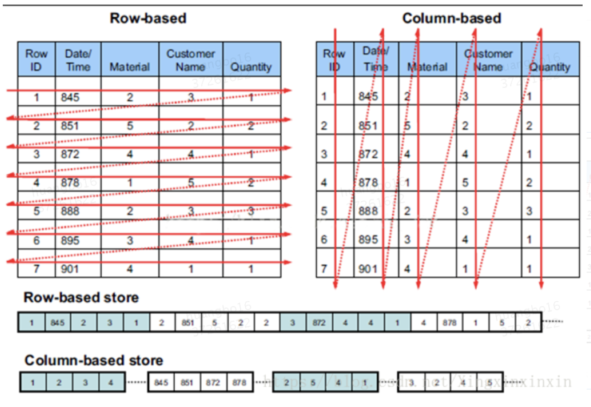
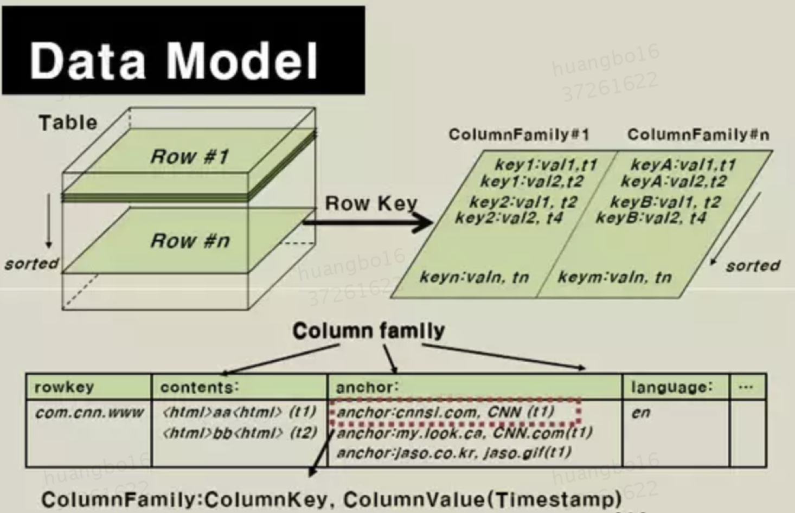
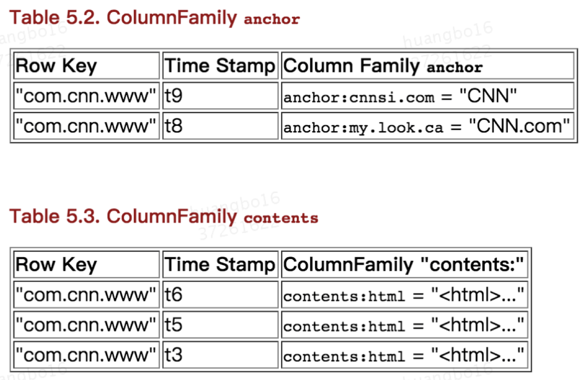
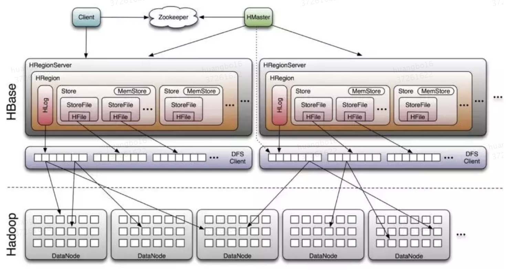

# HBase是什么

HBase是一种构建在HDFS之上的分布式键值存储系统。

HBase 是Google Bigtable 的开源实现。HBase不同于一般的关系数据库，它是一个适合于非结构化数据存储的数据库。

另一个不同的是HBase基于列的而不是基于行的模式。

**适用场景**

* 存储大量数据(PB级数据)。
* 高并发写入，瞬间写入量很大（写多，读少）。
* 业务场景简单(无jion，事务), 按单一维度查询（基于rowkey）。
* 非结构化的数据存储，列可以优雅扩展。

**不适用场景**

* 事务。
* join、group by。
* 除了rowkey之外的复杂查询。
* 高并发，低延迟随机读 。

**MT应用场景**

* MTtrace
* 云搜

# **行存储VS列存储**

**行式存储：**一张表的数据都是放在一起

**列式存储：**以列为单位聚合数据，不同的列分开存储

|    |行式存储|列式存储|
|:----|:----|:----|
|**优点**|一行记录的写入是一次完成,消耗的时间比列存储少。|读取过程，按列读取不会产生冗余数据。适合列很多，但每次只需查询少数列的场景。|
|**缺点**|数据读取时，将一行数据完全读出。存在冗余列|需要将一行记录拆分成单列保存，写入次数更多，时间消耗会更大。|

# **HBase数据模型**

HBase 以列族为区分列式存储数据库。表可以被看成是一个稀疏的行的集合。一个列族是多个column的集合.

**物理视图**

* anchor 、contents 分别为两个列族，区分存储。
* cnnsi.com 、my.look.ca为列族anchor两个列，html为列族contents的列。

**行键**

Row Key 是用来检索记录的主键。Row Key 可定义任意字符串，如订单id,事务id。

在HBase 内部，Row Key 保存为字节数组。HBase表的行是按Row Key字典序存储的。

**列族**

列族一些列的集合，列族必须在表建立的时候声明。column就不需要了，随时可以新建。

在物理上，一个的列族成员在文件系统上都是存储在一起。因为存储优化都是针对列族级别的。

这就意味着，在表设计的时候要考虑一个colimn family的所有成员的是否有相同的访问方式。

**Cells和版本**

对于同一Row Key 的相同列的多次写操作，使用版本来区分。可以把版本理解每次写入的快照。

A *{row, column, version}*元组就是一个HBase中的一个单元。Cell的内容是不可分割的字节数组，即我们存储和具体的值。

可保存的版本数需要设定，读取这个文件的时候，默认是最近的版本。

**操作**

主要操作有

 Get：指定Row Key查找，性能最高。

 Scan ：基于Row Key 前缀查找，或全表扫描。

 Put：向表增加新行 (如果key是新的) 或更新行 (如果key已经存在)。

 Bulk Loading：批量装载，批量装载特性采用 MapReduce 任务，将表数据输出为HBase的内部数据格式，然后可以将产生的存储文件直接装载到运行的集群中。

 Delete：从表中删除一行。

**TTL**

存活时间——列族可以设置TTL秒数，HBase 在超时后将自动删除数据

# **HBase表设计**

**rowkey**

HBase 的检索都是基于 rowkey，类似sql 里的like 操作，我们需要根据查询场景来合理设置rowkey。参考[合理设计hbase rowkey](https://km.sankuai.com/page/59718515)

1：查询最左匹配原则

假设查询包含3个维度：shopId，orderId ，如果将rowkey 定义为: shopId_orderId

则以下维度的查询比较高效

(1) 通过shopId查询

(2) 通过shopId + orderId查询

但通过orderId查询则比较低效，为全表扫描操作

2：避免热点Region

HBase 的行会根据rowkey 拆分到不同的 Region 中。

如果是连续自增性质的rowkey，则相邻rowkey写入到了同一个Region里，产生热点Region。热点Region容易导致读写出现性能瓶颈。

一般的做法是在rowkey 加一个hash前缀。比如hash(shopId)_shopId_orderId

3：避免短键过长

在满足需求的情况下，行键越短越好。

**列簇**

建议列族不要超过3个，按照访问维度划分。

尽量使列族名小，最好一个字符。(如 "d" 表示 data/default)。

**列名**

最好还是用短属性名，节约存储空间。

**版本数**

每个列族可以单独设置，默认是3。按业务需求要合理设置。

**数据类型**

任何可被转为字节数组的东西可以作为值存入，输入可以是字符串，数字，复杂对象，甚至图像，只要他们能转为字节。

**demo**

业务场景：评价审核日志收集。

从新增（编辑）一条评价到 诚信审核反馈并储存审核结果完成，定义为一个**送审事务。**

每个送审事务都有一个**唯一标识**（transId），在整个事务的各环节包括 :**评价信息存储->评价送审->****诚信审核->审核反馈->****审核结果存储**。

针对每个送审事务的各环节，进行日志收集。

查询场景1：根据评价id ，查询所有的审核日志。

查询场景2：根据评价id 和事务id, 查询该事务的审核日志。

表结构定义：

|参数|    |
|:----|:----|
|表名|〜〜〜〜|
|TTL|永久|
|Row Key|hash(BizType_BizID)_BizType_BizID_AuditTransID|
|版本数|3（针对同一个审核事务，诚信会有多次反馈结果，可保留多个版本的反馈结果）|
|列族|b:基础信息族 e:扩展信息族|

**Columns**

|列族|字段名|字段名缩写|**类型**|**含义**|**备注**|
|:----|:----|:----|:----|:----|:----|
|基础信息族（b）|TransType|ty|tinyint(4)|事务类型|0：用户发起 1：诚信回扫 2：用户申诉 3：用户举报 4:ugc 发起|
|    |Version|vs|bigint(20)|送审版本|内容生成时间戳|
|    |EventType0|et0|bigint(20)|事件0发生时间|新增完成事件|
|    |EventType1|et1|bigint(20)|事件1发生时间|诚信送审完成事件|
|    |EventType2|et2|bigint(20)|事件2发生时间|诚信审核反馈事件|
|    |....|    |    |    |    |
|    |**AuditResult**|    |**tinyint(4)**|诚信审核结果|**0:无 1:通过 2: 违规** **AuditResultEnum**|
|    |**AuditDetail**|    |string|诚信审核标签明细|{处理建议，多标签...}|
|    |**AuditTime**|    |bigint(20)|诚信审核时间|    |
|    |....|    |    |    |    |

# **HBase系统架构**

**Client**

包含访问HBase的接口，并维护cache来加快对HBase的访问。

对于管理类操作，Client与HMaster进行RPC。

对于数据读写操作，Client与HRegionServer进行RPC。

**Zookeeper**

保证任何时候，集群中只有一个master。

实时监控Region server的上线和下线信息。并实时通知给master。

存储HBase的schema和table元数据。

**Master**

为Region server分配region，负责Region server的负载均衡.

发现失效的Region server并重新分配其上的region。

处理表的建立，删除等操作。

**Region Server**

维护master分配给他的region，处理对这些region的io请求。

负责切分正在运行过程中变的过大的region。

当用户需要对数据进行读写操作时，需要访问HRegionServer。

**Region**

table在行的方向上分隔为多个Region。

随着数据不断插入表，当region的某个列族达到一个阈值时就会拆分新的region。

**Store**

每一个region由一个或多个store组成，hbase会为每个列族建一个store。

HStore存储由两部分组成：MemStore和StoreFiles。 写入数据首先会放在MemStore,当MemStore满了以后会Flush成一个 StoreFile（实际存储在HDHS上的是HFile）。

写操作只要进入内存中就可以立即返回，保证了HBase I/O的高性能。

**HFile**

HFile就是实际的存储文件。HFile由多个Data Block组成，Data Block是HBase的最小存储单元。

HBase 会基于Data Block的做缓存——BlockCache。

客户的读请求会先到memstore中查数据，若查不到就到blockcache中查，再查不到就会从磁盘上读，并把读入的数据同时放入blockcahce。

HBase的blockcache使用的是LRU（最近最少使用）淘汰策略，当BlockCache的大小达到上限后，会触发缓存淘汰机制，将最老的一批数据淘汰掉。

# Reference

[https://km.sankuai.com/page/164927192](https://km.sankuai.com/page/164927192)

