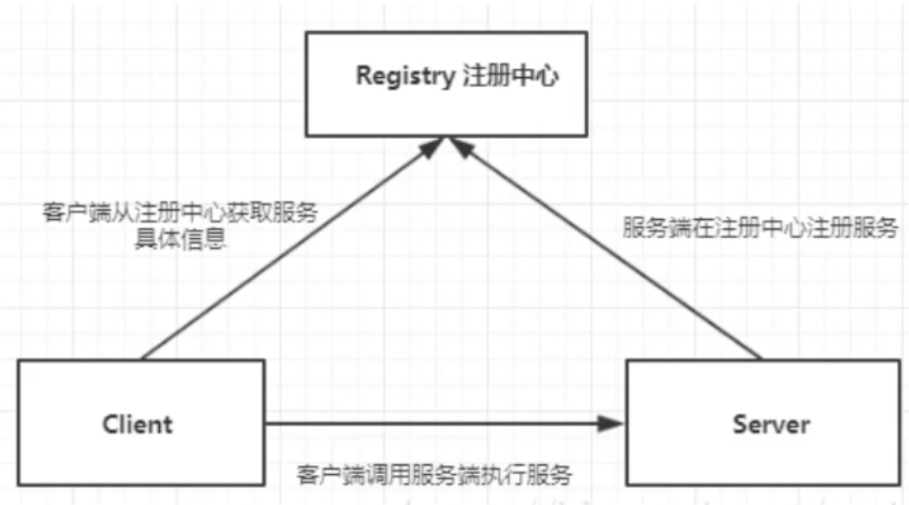
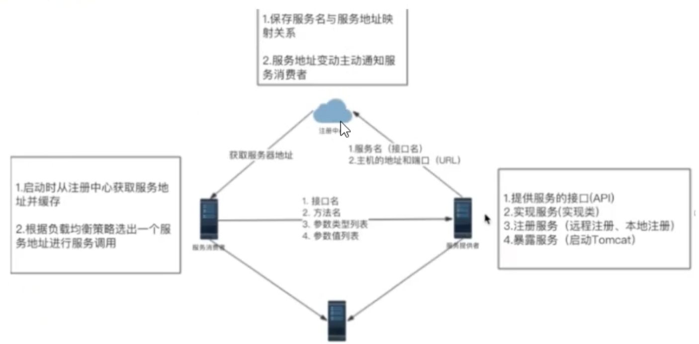

# RMI

## 简介

RMI(remotemethodinvocation) 是java原生支持的远程调用, RMI采用RMP(JavaRemoteMessageing Protocol) 作为通信协议, 可以认为是纯java版本的分布式远程调用解决方案。

**RMI的核心概念**



## RMI使用步骤

1、创建远程接口, 并且继承java.rmi.Remote接口

2、实现远程接口, 并一继承; UnicastRemoteObject

3、创建服务器程序: createRegistry() 方法注册远程对象

4、创建客户端程序(获取注册信息, 调用接口方法} 

1、创建服务接口

```java
public interface UserService extends Remote {
  String sayHello(String name) throws RemoteException;
}
```
2、实现远程接口
略

3、创建服务器程序

```java
// 1、启动RMI注册服务，指定端口号
LocateRegistry.createRegistry(9000);
// 2、创建要被访问的远程对象的实例
UserService userService = new UserServiceImpl();
// 3、把远程对象实例注册到RMI注册服务器上
Naming.bind("rmi://localhost:9000/UserService", userService);
System.out.println("server start ...")
```
4、客户端
```java
UserService userService = (UserService) Naming.lookup("rmi://localhost:9000/UserService");
String s = userService.sayHello("this is client");
System.out.println(s);
```

注意：客户端的包路径需要和服务端一致


# hessian

## 简介

Hessian使用C/S方式，基于HTTP协议传输，使用Hessian二进制序列化。

## 使用

### Service端

1、添加maven依赖

```xml
<dependency>
    <groupId>com.caucho</groupId>
    <artifactId>hessian</artifactId>
    <version>3.1.5</version>
</dependency>
```
2、创建接口UserService
```java
public interface UserService {
  String sayHello(String name);  
}
```
3、实现类
```java
public class UserServiceImpl implements UserService {
  @Override
  public String sayHello(String name) {
    return "hello" + name;
  }
}
```
4、web.xm中配置HessianServlet
```xml
<servlet>
  <servlet-name>HessianServlet</servlet-name>
  <servlet-class>com.caucho.hessian.server.HessianServlet</servlet-class>
  <init-param>
    <param-name>service-class</param-name>
    <param-value>com.huangbo.impl.UserServiceImpl</param-value>
  </init-param>
</servlet>

<servlet-mapping>
  <servlet-name>HessianServlet</servlet-name>
  <url-pattern>/hessianServlet</url-pattern>
</servlet-mapping>
```
5、添加tomcat7插件启动服务
```xml
<build>
  <plugins>
    <plugin>
      <groupId>org.apache.tomcat.maven</groupId>
      <artifactId>tomcat7-maven-plugin</artifactId>
      <version>2.2</version>
      <configuration>
        <port>9000</port>
        <path>/</path>
        <uriEncoding>UTF-8</uriEncoding>
      </configuration>
    </plugin>
  </plugins>
</build>
```
6、在maven插件栏中找到tomcat，run启动
### 客户端

1、添加hessian的maven依赖（同上）

2、创建跟servlet端相同的端口UserService（同上）

3、创建测试类测试

```java
public class ClientTest {
  public static void main(String[] args) throws MalformedURLException {
    String url = :"http://localhost:9000/hessianServlet";
    HessianProxyFactory factory = new HessianProxyFactory();
    UserService api = (UserService) factory.create(UserService.class, url);
    System.out.println(api.sayHello("ripple"));
  }
}
```

# thirft

使用IDL

# gRpc

# Dubbo

# 自己实现RPC

基本实现思路：



* provider服务提供
* consumer服务消费
* registry注册
* protocol协议

## 服务提供者

### 1、定义服务接口

```java
package com.ripple.service;
public interface HelloService {
    String sayHello(String msg);
}
```
### 2、实现类HelloServiceImpl

```java
package com.ripple.service.impl;
import com.ripple.service.HelloService;
public class HelloServiceImpl implements HelloService {
    public String sayHello(String msg) {
        return "service say hello: " + msg;
    }
}
```
### 3、服务注册：注册中心

此处注册中心我们将服务注册在map集合中, 结构: Map<String. Map<URLCass>> 外边map的key存储服务接口的全类名, URL封装了调用服务的ip和port里边value指定指定关体实现类注册中心类提供注册服务平暴露服务和发现服务功能: 

```java
package com.ripple.pojo;
import lombok.Data;
@Data
public class URL {
    private String hostName;
    private Integer port;
    public URL(String hostName, Integer port) {
        this.hostName = hostName;
        this.port = port;
    }
    @Override
    public boolean equals(Object obj) {
        if (obj == null) {
            return false;
        }
        if (!(obj instanceof URL)) {
            return false;
        }
        URL url = (URL) obj;
        if (hostName.equals(((URL) obj).getHostName()) && port.intValue() == url.port.intValue()) {
            return true;
        }
        return false;
    }
    @Override
    public int hashCode() {
        return hostName.hashCode();
    }
}
```
注意重写equals和hashCode方法，为了比较URL时不是比较地址值，而是比较其中的hostName和port值。否则将拿不到注册URL的信息
#### 注册中心NativeRegistry

```java
package com.ripple.registry;
import com.ripple.pojo.URL;
import java.util.HashMap;
import java.util.Map;
public class NativeRegistry {
    // 注册中心 map
    private static Map<String, Map<URL, Class>> registCenter = new HashMap<String, Map<URL, Class>>();
    // 注册服务
    public static void regist(String interfaceName, URL url, Class implClass) {
        Map<URL, Class> map = new HashMap<URL, Class>();
        map.put(url, implClass);
        registCenter.put(interfaceName, map);
    }
    // 获取服务信息
    public static Class get(String interfaceName, URL url) {
        Map<URL, Class> urlClassMap = registCenter.get(interfaceName);
        Class cls = urlClassMap.get(url);
        return cls;
    }
}
```
#### **注册服务**ServerStart

```java
package com.ripple;
import com.ripple.pojo.URL;
import com.ripple.registry.NativeRegistry;
import com.ripple.service.HelloService;
import com.ripple.service.impl.HelloServiceImpl;
import com.ripple.tomcat.HttpServer;
public class ServerStart {
    public static void main(String[] args) {
        // 真正的注册服务
        URL url = new URL("localhost", 8080);
        NativeRegistry.regist(HelloService.class.getName(), url, HelloServiceImpl.class);
        //启动服务
        HttpServer httpServer = new HttpServer();
        httpServer.start(url.getHostName(), url.getPort());
    }
}
```
### 4、暴露服务

服务之间调用的通信协议采用http协议，所以在服务provider中启动tomcat暴露服务

添加内嵌tomcat的依赖

```xml
<dependency>
    <groupId>org.projectlombok</groupId>
    <artifactId>lombok</artifactId>
    <version>1.18.0</version>
</dependency>
<!-- 内嵌tomcat -->
<dependency>
    <groupId>org.apache.tomcat.embed</groupId>
    <artifactId>tomcat-embed-core</artifactId>
    <version>9.0.12</version>
</dependency>
<dependency>
    <groupId>commons-io</groupId>
    <artifactId>commons-io</artifactId>
    <version>2.6</version>
</dependency>
```
#### 创建HttpServer

```java
package com.ripple.tomcat;
import org.apache.catalina.*;
import org.apache.catalina.connector.Connector;
import org.apache.catalina.core.StandardContext;
import org.apache.catalina.core.StandardEngine;
import org.apache.catalina.core.StandardHost;
import org.apache.catalina.startup.Tomcat;
public class HttpServer {
    /** tomcat服务启动
     // 参考tomcat配置
     <Server port="8005" shutdown="SHUTDOWN">
     <Service name="Catalina">
     <Connect port="8080" protocol="HTTP/1.1"
     connectionTimeout="2000" redirectPort="8443"
     URIEncoding="UTF-8"/>
     <Engine name="Catalina" defaultHost="localhost">
     <Host name="localhost" appBase="webapps"
     unpackWARs="true" autoDeploy="true">
     <Context path="" doBase="WORKDIR" reloadable="true"/>
     </Host>
     </Engine>
     <Service>
     </Server>
     */
    // 启动服务
    public void start(String hostName, int port) {
        // 实例一个tomcat
        Tomcat tomcat = new Tomcat();
        // 构建server
        Server server = tomcat.getServer();
        // 获取server
        Service service = server.findService("Tomcat");
        // 构建Connector
        Connector connector = new Connector();
        connector.setPort(port);
        connector.setURIEncoding("UTF-8");
        // 构建Engine
        Engine engine = new StandardEngine();
        engine.setDefaultHost(hostName);
        // 构建Host
        Host host = new StandardHost();
        host.setName(hostName);
        // 构建Context
        String contextPath = "";
        Context context = new StandardContext();
        context.setPath(contextPath);
        // 声明周期监听器
        context.addLifecycleListener(new Tomcat.FixContextListener());
        // 然后按照server.xml，一层层把子节点添加到父节点
        host.addChild(context);
        engine.addChild(host);
        service.setContainer(engine);
        service.addConnector(connector);
        // service在getServer时就被添加到server节点了
        // tomcat是一个servlet，设置路径与映射
        tomcat.addServlet(contextPath, "dispatcher", new DispatcherServlet());
        context.addServletMappingDecoded("/*", "dispatcher");
        try {
            tomcat.start(); // 启动tomcat
            tomcat.getServer().await(); //接受请求
        } catch (LifecycleException e) {
            e.printStackTrace();
        }
    }
}
```
#### DispatcherServlet

```java
package com.ripple.tomcat;
import javax.servlet.ServletException;
import javax.servlet.http.HttpServlet;
import javax.servlet.http.HttpServletRequest;
import javax.servlet.http.HttpServletResponse;
import java.io.IOException;
public class DispatcherServlet extends HttpServlet {
    @Override
    protected void service(HttpServletRequest req, HttpServletResponse resp) throws ServletException, IOException {
        // httpServerHandler真正处理远程调用请求
        new HttpServerHandler().handle(req, resp);
    }
}
```
#### HttpServerHandler

```java
package com.ripple.tomcat;
import com.ripple.pojo.Invocation;
import com.ripple.pojo.URL;
import com.ripple.registry.NativeRegistry;
import org.apache.commons.io.IOUtils;
import javax.servlet.http.HttpServletRequest;
import javax.servlet.http.HttpServletResponse;
import java.io.IOException;
import java.io.InputStream;
import java.io.ObjectInputStream;
import java.lang.reflect.InvocationTargetException;
import java.lang.reflect.Method;
public class HttpServerHandler {
    public void handle(HttpServletRequest req, HttpServletResponse resp) {
        try {
            // 服务请求的处理逻辑
            // 1、通过请求流获取请求服务调用的参数
            InputStream inputStream = req.getInputStream();
            ObjectInputStream objectInputStream = new ObjectInputStream(inputStream);
            Invocation invocation = (Invocation) objectInputStream.readObject();
            // 2、从注册中心获取服务的列表
            Class implClass = NativeRegistry.get(invocation.getInterfaceName(), new URL("localhost", 8080));
            // 3、调用服务 反射
            Method method = implClass.getMethod(invocation.getMethodName(), invocation.getParamTypes());
            String result = (String) method.invoke(implClass.newInstance(), invocation.getParams());
            // 4、结果返回
            // IOUtils在commons-io包中
            IOUtils.write(result, resp.getOutputStream());
        } catch (IOException e) {
            e.printStackTrace();
        } catch (ClassNotFoundException e) {
            e.printStackTrace();
        } catch (NoSuchMethodException e) {
            e.printStackTrace();
        } catch (IllegalAccessException e) {
            e.printStackTrace();
        } catch (InstantiationException e) {
            e.printStackTrace();
        } catch (InvocationTargetException e) {
            e.printStackTrace();
        }
    }
}
```
Invocation
```java
package com.ripple.pojo;
import lombok.Data;
import java.io.Serializable;
@Data
public class Invocation implements Serializable {
    private String interfaceName; //接口名
    private String methodName; // 方法名
    private Object[] params;  // 参数值列表
    private Class[] paramTypes; // 参数类型定列表
    public Invocation(String interfaceName, String methodName, Object[] params, Class[] paramTypes) {
        this.interfaceName = interfaceName;
        this.methodName = methodName;
        this.params = params;
        this.paramTypes = paramTypes;
    }
}
```
## 客户端

### HttpClient

```java
package com.ripple.client;
import com.ripple.pojo.Invocation;
import org.apache.commons.io.IOUtils;
import java.io.IOException;
import java.io.InputStream;
import java.io.ObjectOutputStream;
import java.io.OutputStream;
import java.net.HttpURLConnection;
import java.net.URL;
public class HttpClient {
    public String post(String hostName, int port, Invocation invocation) throws IOException {
        // 1. 进行连接
        URL url = new URL("http", hostName, port, "/client");
        HttpURLConnection urlConnection = (HttpURLConnection) url.openConnection();
        urlConnection.setRequestMethod("POST");
        urlConnection.setDoOutput(true);
        // 2. 发送调用信息
        OutputStream outputStream = urlConnection.getOutputStream();
        ObjectOutputStream objectOutputStream = new ObjectOutputStream(outputStream);
        objectOutputStream.writeObject(invocation);
        objectOutputStream.flush();
        objectOutputStream.close();
        // 3. 将输入流转换成字符串，获取远程调用的结果
        InputStream inputStream = urlConnection.getInputStream();
        return IOUtils.toString(inputStream);
    }
}

```
Invocation和HelloService同服务端
### ClientStart

```java
package com.ripple;
import com.ripple.client.HttpClient;
import com.ripple.pojo.Invocation;
import com.ripple.service.HelloService;
public class ClientStart {
    public static void main(String[] args) throws Exception {
        Invocation invocation = new Invocation(HelloService.class.getName(), "sayHello",
                new Object[]{"this is RPC client"}, new Class[]{String.class});
        HttpClient httpClient = new HttpClient();
        String result = httpClient.post("localhost", 8080, invocation);
        System.out.println(result);
    }
}
```

## 客户端改进版

客户端使用反射，模拟真实调用场景，将http请求代理一下

### HttpClient

```java
package com.ripple.client;
import java.lang.reflect.Proxy;
import java.util.concurrent.ExecutorService;
import java.util.concurrent.Executors;
public class HttpClient {
    //创建线程池
    private static ExecutorService executor = Executors.newFixedThreadPool(Runtime.getRuntime().availableProcessors());
    public Object getBean(final Class<?> serivceClass) {
        return Proxy.newProxyInstance(Thread.currentThread().getContextClassLoader(),
                new Class<?>[]{serivceClass}, (proxy, method, args) -> {
                    HttpHandler httpHandler = new HttpHandler();
                    httpHandler.setClassName(serivceClass.getName());
                    httpHandler.setMethodName(method.getName());
                    httpHandler.setParamTypes(method.getParameterTypes());
                    httpHandler.setParamValues(args);
                    //设置要发给服务器端的信息
                    //providerName 协议头 args[0] 就是客户端调用api sayHello(???), 参数
                    return executor.submit(httpHandler).get();
                });
    }
}
```
### HttpHandler

```java
package com.ripple.client;
import com.ripple.pojo.Invocation;
import lombok.Data;
import org.apache.commons.io.IOUtils;
import java.io.IOException;
import java.io.InputStream;
import java.io.ObjectOutputStream;
import java.io.OutputStream;
import java.net.HttpURLConnection;
import java.net.URL;
import java.util.concurrent.Callable;
@Data
public class HttpHandler implements Callable {
    private String className;
    private String methodName;
    private Object[] paramValues;
    private Class[] paramTypes;
    public String post(String hostName, int port) throws IOException {
        // 1. 进行连接
        URL url = new URL("http", hostName, port, "/client");
        HttpURLConnection urlConnection = (HttpURLConnection) url.openConnection();
        urlConnection.setRequestMethod("POST");
        urlConnection.setDoOutput(true);
        // 2. 发送调用信息
        OutputStream outputStream = urlConnection.getOutputStream();
        ObjectOutputStream objectOutputStream = new ObjectOutputStream(outputStream);
        Invocation invocation = new Invocation(className, methodName, paramValues, paramTypes);
        objectOutputStream.writeObject(invocation);
        objectOutputStream.flush();
        objectOutputStream.close();
        // 3. 将输入流转换成字符串，获取远程调用的结果
        InputStream inputStream = urlConnection.getInputStream();
        return IOUtils.toString(inputStream);
    }
    public synchronized Object call() throws Exception {
        String result = post("localhost", 8080);
        return result;
    }
}
```
### ClientStart

```plain
package com.ripple;
import com.ripple.client.HttpClient;
import com.ripple.service.HelloService;
public class ClientStart {
    public static void main(String[] args) throws Exception {
        HttpClient httpClient = new HttpClient();
        HelloService helloService = (HelloService) httpClient.getBean(HelloService.class);
        String result = helloService.sayHello("this is RPC~~~~~");
        System.out.println(result);
    }
}
```

