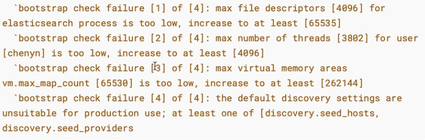

# 安装ES

## 传统方式安装

1、下载并解压ES安装包

```shell
tar -zxvf elasticsearch-6.x.x.tar.gz
```
2、创建一个用户，用于ES启动
因为ES在5.x版本后，强制在Linux中不能使用root用户启动ES进程。

```shell
# 创建用户
useradd es
# 修改上述用户的密码
passwd es
# 修改目录拥有者
chown -R es elasticsearch-6.x.x
```
3、启动ES
```shell
# 切换用户
su es
cd bin
# 后台启动ES
./elasticsearch -d
```
4、测试启动
ES默认不支持跨域访问，在不修改配置的情况下只能在本机上访问测试是否成功

```shell
curl http://localhost:9200
```
或
```shell
ps -aux | grep elasticsearch
# 关闭 
kill <pid>
```

### 开启远程访问

ES默认不支持远程访问，开启步骤如下：

```shell
vi config/elasticsearch.yml
# 修改 network.host 为0.0.0.0，表示任何位置任何ip都可以访问，注意有空格
network.host: 0.0.0.0
```

### 解决错误



这里特别提醒，如果开启远程访问后启动ES，就会出现上面安装提到的Linux的各种限制报错，看报错信息一一解决即可。

1、解决错误-1

修改Linux系统的限制配置，将文件创建数修改为65536个。

1）修改系统中允许应用最多创建多少文件等的限制权限。Linux默认一般限制创建的文件数为65535个。但是ES至少需要65536的文件创建数的权限。

2）修改系统中允许用户启动的进程开启多少个线程。Linux默认root用户可以开启任意数量的线程，其他用户的进程可以开启1024个线程。必须修改限制数为4096+。因为ES至少需要4096个线程池预备。

```shell
vi /etc/security/limits.conf

# 在 limits.conf 文件中追加以下内容，保存完自动生效
es soft nofile 65536
es hard nofile 65536
es soft nproc 4096
es hard nproc 4096
```
2、解决错误-2
```shell
# 进入limits.d目录下修改配置文件
vi /etc/security/limits.d/20-nproc.conf
# 修改为 
<启动ES用户名> soft nproc 4096
```
3、解决错误-3
修改系统控制权限，ES需要开辟一个65536字节以上空间的虚拟缓存。Linux不允许任何用户和应用程序直接开辟这么的虚拟内存。

```shell
vi /etc/sysctl.conf

# 在 sysctl.conf 文件中追加如下内容尾部，当前用户拥有的内存权限大小
vm.max_map_count=655360 # centos7系统
vm.max_map_count=262144 # centos7系统

# 退出文件编辑，并执行以下命令，让系统控制权限配置生效
sysctl -p
```
4、解决错误-4
使用一个节点初始化集群

```json
vi config/elasticsearch.yml

cluster.initial_master_nodes: ["node-1"]
```
## Docker方式安装

docker方式安装没有传统方式安装那么繁琐

1、获取镜像

```shell
docker pull elasticsearch:6.x.x
```
2、运行ES
```shell
docker run -d -p 9200:9200 -p 9300:9300 \
-e "discovery.type=single-node" elasticsearch:6.x.x
# http端口是9200，tcp端口是9300，-e是单节点启动
```
3、访问ES
```shell
http://xx.xx.xx.xx:9200/
```

# Kibana

## 概述

可以是用postman或者apipost通过REST API去操作ES，但是没有任何语法提示。

```shell
GET http://xx.xx.xx.xx:9200/_cat # 会返回各种cat查询
GET http://xx.xx.xx.xx:9200/_cat/health 
```
ES官方推荐是用Kibana。
## 简介

Kibana是一个针对ElasticSearch的开源分析及可视化平台，使用Kibana可以查询、查看并与存储在ES索引中的数据进行交互操作，使用Kibana能执行高级的数据分析，并能以图表、表格和地图的形式查看数据。

## 安装

### 传统方式安装

1、下载Kibana

```json
https://www.elastic.co/downloads/kibana
```
注意下载的版本号要和 ES 版本号完全对应，避免出现问题
2、安装

```shell
tar -zxvf kibana-x.x.x-linux-x86_64.tar.gz
```
3、编辑Kibana配置文件
Kibana默认也不允许远程连接

```json
vi /config/kibana.yml

server.host: "0.0.0.0"   # 开启Kibana远程访问
elasticsearch.hosts: ["http://localhost:9200"]   # ES服务器地址
```
4、启动Kibana
```shell
./bin/kibana
```
5、访问Kibana的web界面
```json
http://xx.xx.xx.xx:5601/    # Kibana默认端口为5601
```
6、侧边栏 Management-> Dev Tools
```json
GET _search
{
  "query": {
    "match": {}
  }
}
# 可以拿到结果则成功了
```

### Docker安装

1、获取镜像

注意版本与ES保持一致

```shell
docker pull kibana:x.x.x
```
2、运行kibana
```shell
docker run -d --name kibana -p 5601:5601 kibana:x.x.x
```
3、进入容器连接到ES，重启kibana容器
```shell
docker exec -it <容器id> bash
ls
cd config/
vi kibana.yml
elasticsearch.hosts: ["http://<ip>:9200"]   # ES服务器地址

docker ps
docker restart <容器id>
docker logs -f <容器id>  # 查看实时日志
```
问题，每次都要在容器启动后进入容器修改配置，然后重启容器，非常麻烦！
#### 数据卷方式启动

1、拷贝配置文件

```shell
# 路径可通过上述进入容器后，pwd查看路径，拷贝到当前目录
docker cp <容器id>:/usr/share/kibana/config/kibana.yml .
```
2、同上修改配置文件
3、启动容器

```shell
docker rm -f <容器id>  # 可以删除之前的容器

# 注意数据卷不允许使用相对路径
docker run -d --name kibana -p 5601:5601 \
-v /home/xx/kibana.yml:/usr/share/kibana/config/kibana.yml kibana:x.x.x
```


# docker-compose一键启动

## docker-compose.yml 配置文件

```yaml
version: "3.8"
volumes:
  data:
  config:
  plugin:
networks: # 声明使用的网络
  es:
services:
  elasticsearch:
    image: elasticsearch:x.x.x
    prots:
      - "9200:9200"
      - "9300:9300"
    networks:
      - "es"
    environment:
      - "discovery.type=single-node"
      - "ES_JAVA_OPTS=-Xms512m -Xmx512m" # 限制内存
    volumes:
      - data:/usr/share/elasticsearch/data
      - config:/usr/share/elasticsearch/config
      - plugin:/usr/share/elasticsearch/plugins
      
  kibana:
    image: kibana:x.x.x
    ports:
      - "5601:5601"
    networks:
      - "es"
    volumes:
      - ./kibana.yml:/usr/share/kibana/config/kibana.yml
      
```

## kibana.yml配置文件

```yaml
server.host: "0"
server.shutdownTimeout: "5s"
elasticsearch.hosts: [ "http://elasticsearch:9200" ]
monitoring.ui.container.elasticsearch.enabled: true
```
注意这里elasticsearch的ip是直接使用docker-compose.yml中定义的服务名称的，因为它们处在同一个网络中，所以可以这么使用，好处是ip如果变更了无需修改配置文件
## 启动与关闭

```shell
docker-compose -v 
docker-compose up -d  # -d代表后台启动
docker-compose down  # 关闭所有服务
```

# 集群

一个集群就是由一个或多个节点组织在一起。一个集群有一个唯一的名字标识，默认是 elasticsearch，这个名字标识非常重要，一个节点只能通过制定某个集群的名字加入集群。

## 基本概念

节点（node）

索引（Index）

映射（Mapping）

文档（Document）

分片（shards）

复制（replicas）

## 搭建集群

### 规划

1、准备3个ES节点

```plain
- web: 9201 tcp:9301 node-1 elasticsearch.yml
- web: 9202 tcp:9302 node-2 elasticsearch.yml
- web: 9203 tcp:9303 node-3 elasticsearch.yml
```
注意事项：
1、所有节点集群名称必须一致 cluster.name

2、每个节点必须有一个唯一的名字 node.name

3、开启每个节点远程连接 network.host: 0.0.0.0

4、指定使用IP地址（发布地址）进行集群节点通信 network.publish_host

5、修改web端口tcp端口：http.port  transport.tcp.port

6、指定集群中所有节点通信列表 discovery.seed_hosts: node-1 node-2 node-3 相同

7、允许集群初始化 master 节点节点数：cluster.initial_master_nodes: ["node-1", "node-2", "node-3"]

8、集群最少几个节点可用 gateway.recover_after_nodes: 2

9、开启每个节点跨域访问 http.cors.enabled: true  http.cors.allow-origin: "*"

### 配置文件

config/elaticsearch.yml文件，每个节点都需要配置，修改下某些参数

```plain
# 指定集群名称  3个节点必须一致
cluster.name: es-cluster
# 指定节点名称，每个节点名字必须唯一
node.name: node-1
# 开启远程连接
network.host: 0.0.0.0
# 指定使用 发布地址 进行集群间通信
network.publishhost: 192.168.124.3
# 指定web端口
http.port: 9201
# 指定tcp端口
transport.tcp.port: 9301
# 指定所有节点的tcp通信
discovery.seedhosts: ["xx.xx.xx.xx:9301" , 
"xx.xx.xx.xx:9302" , "xx.xx.xx.xx:9303" ] 
# 指定可以初始化集群的节点名称
cluster.initial_master_nodes: ["node-1" , "node-2" , "node-3" ] 
# 集群最少几个节点可用
gateway.recover_after_nodes: 2
# 解决跨域问题
http.cors.enabled: true
http.cors.allow-origin: "*" 
```

docker-compose.yml

（参考该文件配置相应路径及文件内容）

```yaml
version: "3.8"
networks: # 声明使用的网络
  escluster:
services:
  es01:
    image: elasticsearch:x.x.x
    prots:
      - "9201:9201"
      - "9301:9301"
    networks:
      - "escluster"
    environment:
      - "ES_JAVA_OPTS=-Xms512m -Xmx512m" # 限制内存
    volumes:
      - ./node-1/data:/usr/share/elasticsearch/data
      - ./node-1/config/elasticsearch.yml:/usr/share/elasticsearch/config/elasticsearch.yml
      - ./node-1/plugins/ik:/usr/share/elasticsearch/plugins/ik
  es02:
    image: elasticsearch:x.x.x
    prots:
      - "9202:9202"
      - "9302:9302"
    networks:
      - "escluster"
    environment:
      - "ES_JAVA_OPTS=-Xms512m -Xmx512m" # 限制内存
    volumes:
      - ./node-2/data:/usr/share/elasticsearch/data
      - ./node-2/config/elasticsearch.yml:/usr/share/elasticsearch/config/elasticsearch.yml
      - ./node-2/plugins/ik:/usr/share/elasticsearch/plugins/ik
  es03:
    image: elasticsearch:x.x.x
    prots:
      - "9203:9203"
      - "9303:9303"
    networks:
      - "escluster"
    environment:
      - "ES_JAVA_OPTS=-Xms512m -Xmx512m" # 限制内存
    volumes:
      - ./node-3/data:/usr/share/elasticsearch/data
      - ./node-3/config/elasticsearch.yml:/usr/share/elasticsearch/config/elasticsearch.yml
      - ./node-3/plugins/ik:/usr/share/elasticsearch/plugins/ik
   
```
### 验证集群

1、访问localhost:9201/9202/9203，查看"cluster_uuid"字段应该是一致的。

2、查看集群状态

访问任何一个节点的集群信息

```plain
http://<ip>:9200/_cat/health?v   # ?v表示展示标题
```

## Head插件

（非官方）用来直观的查看集群的状态

安装步骤：

1、github上搜索 elasticsearch-head 插件，并下载

```shell
git clone git@github.com:mobz/elasticsearch-head.git
```
2、安装node.js
```shell
wget http://cdn.npm.taobao.org/dist/node/lastest-v8.x/node-v8.1.2-linux-x64.tar.xz
```
3、解压缩node.js
```shell
xz -d node-v8.1.2-linux-x64.tar.xz
tar -xvf node-v8.1.2-linux-arm64.tar
```
4、配置环境变量
略

5、启动Head插件

```shell
cd elasticsearch-head
npm config set registry https://registry.npm.taobao.org
npm install  # 安装依赖
npm run start
```
6、访问Head插件，默认端口9100
```plain
http://<ip>:9100
```
