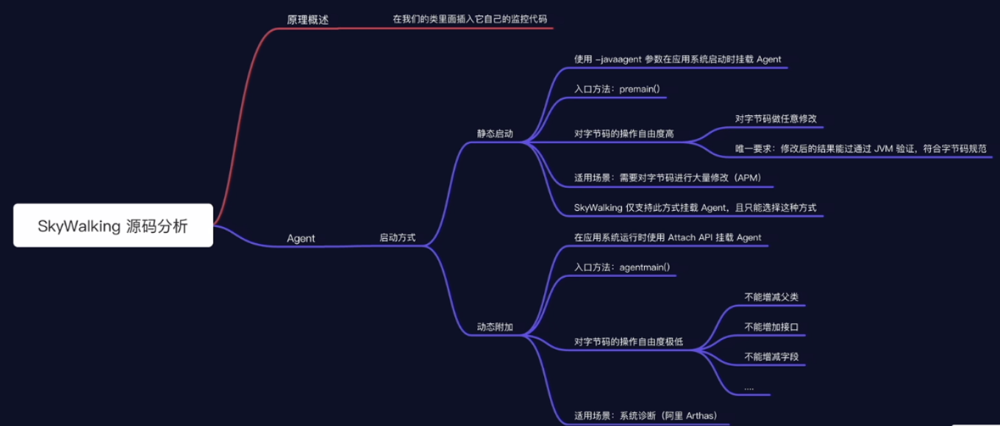
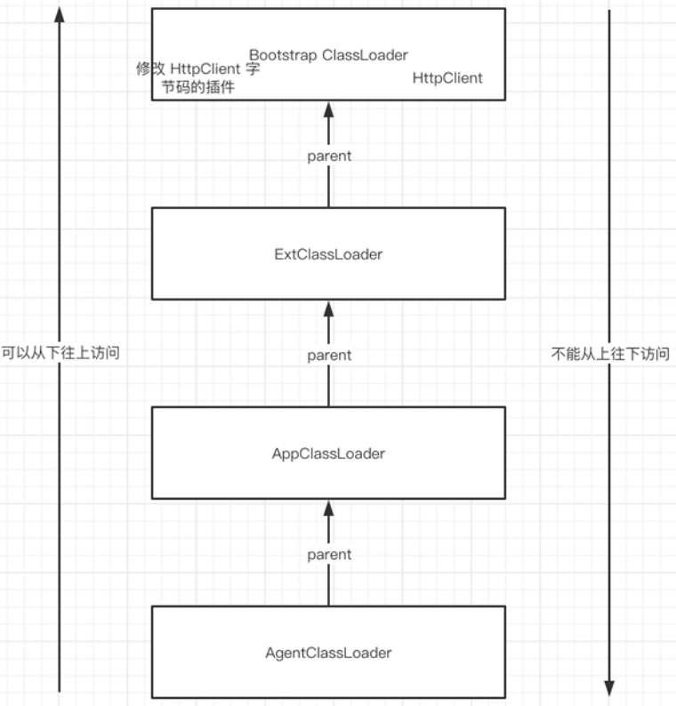
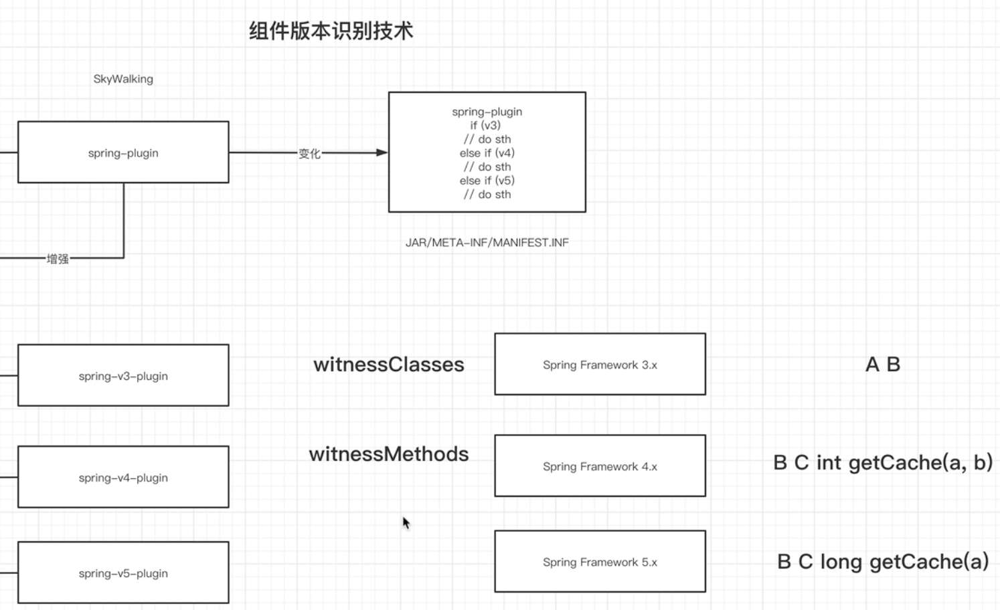
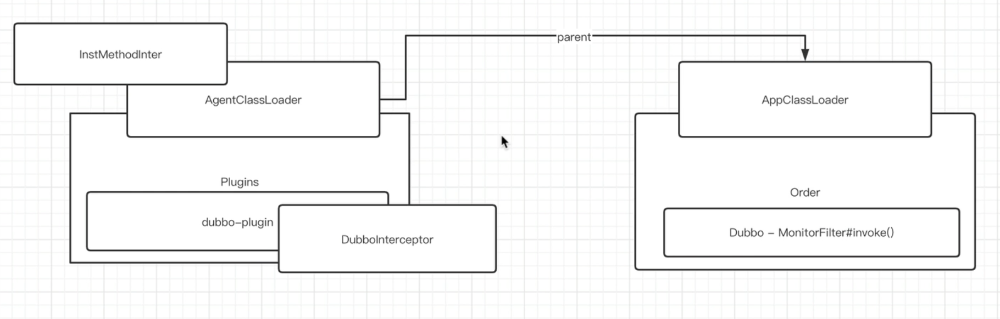

# 概述

# 


# 初始化配置

## 加载配置信息

* /config/agent.config
* 系统环境变量
* Agent参数
* 优先级：自下而上

## 将配置信息映射到Config类

## 根据配置信息重新指定日志解析器

## 检查agent名称和后端地址是否配置

## 标记配置加载完成

# 加载插件

## M: 插件配置读取

>可以借鉴读取配置

按行加载键值对，并剔除指定不需要的插件

* SkyWalkingAgent.java
    * PluginFinder.java
        * PluginBootstrap.java
            * PluginCfg.java

## 插件定义体系

### 插件定义: XxxInstrumentation

* 拦截实例方法/构造器：ClassInstanceMethodsEnhancePluginDefine
* 拦截静态方法：ClassStaticMethodsEnhancePluginDefine
* AbstractClassEnhancePluginDefine 插件顶级父类
* 要拦截的类：enhanceClass()
* 要拦截的方法：getXxxInterceptorPoints()

### 目标类匹配

* ClassMatch
    * 按类名匹配：NameMatch
    * 间接匹配：IndirectMatch
        * PrefixMatch
        * MethodAnnotationMatch

### 拦截器定义

* beforeMethod
* afterMethod
* handleMethodException

### 插件声明

* resouces/skywalking-plugin.def
* 插件名称-插件定义

## 加载流程

### PluginBootstrap实例化所有插件

### PluginFinder分类插件

* 命名插件 - NameMatch
* 间接匹配插件 - IndirectMatch
* JDK 类库插件

# 定制Agent

## 创建ByteBuddy实例

## 指定ByteBuddy要忽略的类

## 将必要的类注入到BootstrapClassLoader中

为什么注入classes到bootstrap加载器中

```java
ClassInjector.UsingUnsafe.Factory factory = ClassInjector.UsingUnsafe.Factory.resolve(instrumentation);
factory.make(null, null).injectRaw(classesTypeMap);
agentBuilder = agentBuilder.with(new AgentBuilder.InjectionStrategy.UsingUnsafe.OfFactory(factory));
```


## 解决JDK模块系统的跨模块类访问

## 根据配置决定是否将修改后的字节码保存到磁盘/内存中

## 细节定制

### 指定 ByteBuddy要拦截的类

### 指定做字节码增强的工具

### 指定做字节码增强的模式

redefine和restransform的区别在于是否保留修改前的内容

* redefine 覆盖
* restransform 保留


### 注册监听器

### 将Agent安装到Instrumentation

## 什么是**Synthetic**

**Synthetic关键字：**

**合成的，Java编译器在编译阶段自动生成的[构造]**

**JLS：所有存在于字节码文件中，但是不存在于源代码文件的[构造]，都应该被synthetic关键字标注**

**[构造] => Constructs => Field/Method/Constructor**

内部类的私有属性、私有构造方法，都能被外部类直接访问不报错，就是因为编译期新生成了方法或者属性，这就是synthetic

getModifiers()的值为4096的话，就代表这个是synthetic

用js简单说明：java编译器帮我们自动做了var that = this操作

讲解环境：JDK11之前的版本

## NBAC(Nested Based Access Control)

编译环境JDK1.8

```xml
<properties>
  <maven.compiler.source>11</maven.compiler.source>
  <maven.compiler.target>11</maven.compiler.target>
</properties>
<build>
  <plugins>
    <plugin>
      <groupId>org.apache.maven.plugins</groupId>
      <artifactId>maven-compiler-plugin</artifactId>
      <version>3.8.1</version>
      <configuration>
        <source>1.8</source>
        <target>1.8</target>
      </configuration>
    </plugin>
  </plugins>
</build>    
```
内部类里面存在同一个方法的不同调用方法呈现不同结果的情况
* 直接调用 - 可以
* 反射调用 - 不可以

```java
public class Outer {
  public void fun() {
  }
  private void outPrivate() {
  }
  class Inner {
    public void innerPublic() {
      outerPrivate(); //可以
    }
    public void reflectOuter(Outer outer) throws Exception {
      Method method = outer.getClass().getDeclaredMethod("outerPrivate"); //报错
      method.invoke(outer);
    }
  }
}
```
NBAC消除了这个问题，将pom插件配置改成JDK11（1.8改成1.11）就没有这个问题
原理：

阅读JDK11的Class.java源码，观察getNestHost等方法

Inner => nestHost = Outer.class

Outer => nestMembers = {Inner.class}

nestMembers => nestMates

```java
public static void main(String[] args) throws Exception {
  // 嵌套宿主一致，都是Outer
  System.out.println("Inner 的嵌套宿主：" + Outer.Inner.class.getNestHost().getName());
  System.out.println("Outer 的嵌套宿主：" + Outer.class.getNestHost().getName());
  // 嵌套成员一致，都是Outer和Outer$Inner
  System.out.println("Outer 的嵌套成员：");
  for (Class<?> nestMember : Outer.class.getNestMembers()) {
    System.out.println(nestMember.getName());
  }
  System.out.println("Inner 的嵌套成员：");
  for (Class<?> nestMember : Outer.Inner.class.getNestMembers()) {
    System.out.println(nestMember.getName());
  }
  System.out.println("Inner 和 Outer 是 NestMate 吗？" + 
  Outer.Inner.class.isNestmateOf(Outer.class)); // true
}
```
# 加载服务

```java
ServiceManager.INSTANCE.boot();
```
## 服务组织

* 服务需要实现 BootService 接口
* 如果服务只有一种实现，直接创建一个类即可
* 如果服务有多种实现
    * 默认实现需要使用 @DefaultImplementor
    * 覆盖实现需要使用 @OverrideImplementor

## 加载流程

* SPI加载所有 BootService 的实现
* 根据服务的实现模式进行服务的筛选
    * 两个注解都没有的服务实现直接加入集合
    * 对于 @DefaultImplementor 直接加入集合
    * 对于 @OverrideImplementor
        * value指向的服务有 @DefaultImplementor 则覆盖掉
        * value指向的服务没有 @OverrideImplementor 则报错

# 插件工作原理

## 组件版本识别技术（Witness机制）

* witnessClasses
* witnessMethods



可观察 AbstractClassEnhancePluginDefine.java的 witnessClasses()或witnessMethods方法的实现

举例：查看spring官方文档，对比新增class

>参考spring 3.2.9: [https://docs.spring.io/spring-framework/docs/3.2.9.RELEASE/javadoc-api/](https://docs.spring.io/spring-framework/docs/3.2.9.RELEASE/javadoc-api/)
>参考spring 4: [https://docs.spring.io/spring-framework/docs/4.3.30.RELEASE/javadoc-api/](https://docs.spring.io/spring-framework/docs/4.3.30.RELEASE/javadoc-api/)
>参考spring 5: [https://docs.spring.io/spring-framework/docs/5.2.16.RELEASE/javadoc-api/](https://docs.spring.io/spring-framework/docs/5.2.16.RELEASE/javadoc-api/)

## 工作流程

### 校验 TypeDescription 插件是否可用

### 字节码增强流程

```java
// AbstractClassEnhancePluginDefine.java
// ClassEnhancePluginDefine.java
// StaticMethodsInter.java
// StaticMethodsInterWithOverrideArgs.java
```
#### 静态方法插桩

* 要修改原方法入参
    * 是 JDK 库核心类
    * 不是 JDK 库核心类
        * 实例化插件中定义的 Interceptor
        * 调用 beforeMethod() 
            * 可以修改原方法入参
        * 调用原方法 
            * 调用时可以传参
            * 对于异常，调用 handleMethodException
        * 调用 afterMethod()
* 不修改原方法入参
    * 是 JDK 库核心类
    * 不是 JDK 库核心类
        * 实例化插件中定义的 Interceptor
        * 调用 beforeMethod()
        * 调用原方法 
            * 调用时不能传参
            * 对于异常，调用 handleMethodException
        * 调用 afterMethod()

#### 构造器和实例方法插桩

* 构造器
    * 是 JDK 库核心类
    * 不是 JDK 库核心类
        * 只能在拦截的构造器原本逻辑执行完成以后再执行 onConstruct()
* 实例方法
    * 参考静态方法

### 将记录状态的上下文 EnhanceContext 设置为 [已增强]

## 插件拦截器加载流程

双亲委派机制

Agentxxx必须使用目标类的类加载器加载，才能操作目标类。



## 运行时插件效果的字节码

借助工具：[https://github.com/zifeihan/friday](https://github.com/zifeihan/friday)

```java
ret = zuper.call();
// method.invoke(); 
```
// 不能这么写，会死循环，因为原方法被重命名，如sayHello()被会改成sayHelloXxxx()，新方法sayHello()则是修改字节码后的的方法，method指代的是修改后的sayHello()方法，这里需要调用sayHelloXxx()方法
# 注册关闭钩子

