# 介绍说明

中文文档：[https://kubernetes.io/docs/home/](https://kubernetes.io/docs/home/)

## 资源管理器对比

## K8S优势

* 轻量级：消耗资源少
* 开源
* 弹性伸缩
* 负载均衡：IPVS
适合人群：软件工程师、测试工程师、运维工程师、软件工程师、运维

## K8S组件说明

K8S架构

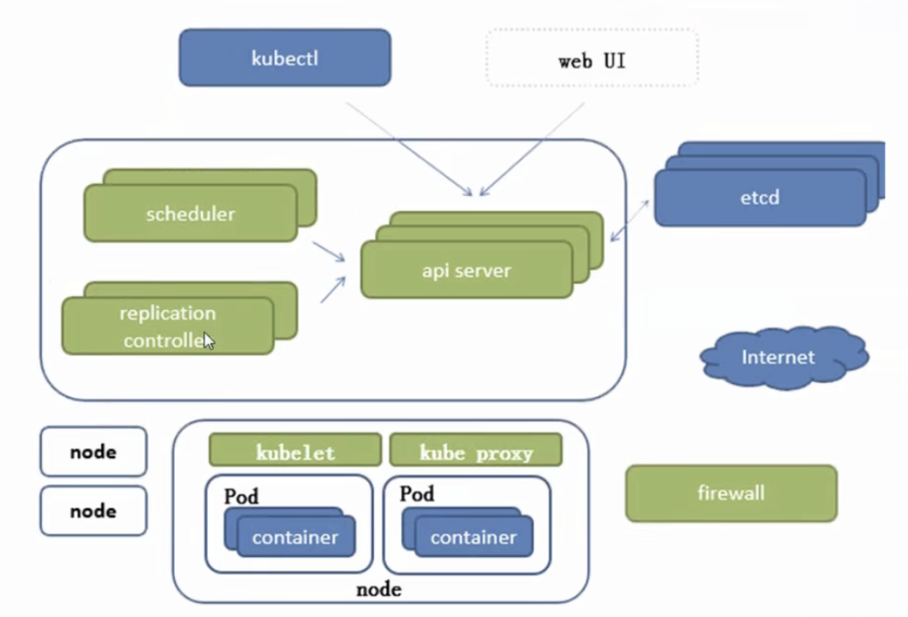

Api-server：所有服务访问统一入口

Controller Manager：维持副本期望数目

Scheuler：负责介绍任务，选择合适的节点进行分配任务

ETCD：键值对数据库，储存K8S集群所有重要信息（持久化）

Kubelet：直接跟容器引擎交互实现容器的声明周期管理

Kube-proxy：负责写入规则至 IPTABLES、IPVS，实现服务映射访问

CoreDNS：为集群中的SVC创建一个域名IP的对应关系解析

Dashboard：给K8S集群提供一个 B/S 结构访问体系

Ingress：官方只能实现四层代理，INGRESS可以实现七层代理

Federation：提供一个可以跨集群中心多K8S统一管理功能

Prometheus：提供K8S集群的监控能力

ELK：提供K8S集群日志统一分析介入平台


额外说明

kubeadm：用来初始化集群的指令。

kubelet：在集群中的每个节点上用来启动 pod 和容器等。

kubectl：用来与集群通信的命令行工具


### Borg组件说明

### K8S结构说明

#### 网络结构

#### 组件结构

# 基础概念

## Pod概念

### 自主式Pod

Pod退出了，此类型的Pod不会被创建

### 控制器管理的Pod

在控制器的生命周期里，始终要维持Pod的副本数目

### Pod控制器类型

#### RS、RC概念

ReplicationController

ReplicaSet

#### deployment概念

#### HPA概念

Horizontal Pod Autoscaling 仅适用于Deployment和ReplicaSet，在V1版本中仅支持根据Pod的CPU利用率扩缩容，在v1alpha版本中，支持根据内存和用户自定义的metric扩缩容

#### StatefullSet概念

StatefulSet是为了解决有状态服务的问题（对应Deployments和ReplicaSets是为无状态服务而设计），其应用场景包括：

1、稳定的持久化存储, 即Pod重新调度后还是能访问到相同的持久化数据, 基于PVC来实现

2、稳定的网络标志, 即Pod重新调度后其PodName和HostName不变, 基于Headless Service

（即没有ClusterIP的Service）来实现

3、有序部署，有序扩展，即Pod是有顺序的，在部署或者扩展的时候要依据定义的顺序依次依次进行（即从0到N-1，在下一个Pod运行之前所有之前的Pod必须都是 Running 和 Ready 状态）， 基于 init containers 来实现

4、有序收缩, 有序删除（即从N-1到0）

#### DaemonSet概念

DaemonSet 确保全部（或者一些）Node上运行一个Pod的副本。当有Node加入集群时，也会为他们新增一个Pod。当有Node从集群移除时, 这些Pod也会被回收。删除DaemonSet将会删除它创建的所有Pod。

使用DaemonSet的一些典型用法: 

1、运行集群存储 daemon，例如在每个Node上运行 glusterd、ceph。

2、在每个 Node 上运行日志收集 daemon，例如 fluentd、1ogstash。

3、在每个 Node 上运行监控 daemon，例如 Prometheus Node Exporter

#### Job、CronJob概念

Job负责批处理任务，即仅执行一次的任务，它保证批处理任务的一个或多个Pod成功结束

Cron Job管理基于时间的Job，即： 

1、在给定时间点只运行一次

2、周期性地在给定时间点运行


### 服务发现

### Pod协同

## 网络通讯模式

Kubernetes的网络模型假定了所有Pod都在一个可以直接连通的扁平的网络空间中，这在

GCE（Google Compute Engine）里面是现成的网络模型，Kubernetes假定这个网络已经存在。

而在私有云里搭建Kubernetes集群，就不能假定这个网络已经存在了。我们需要自己实现这

个网络假设，将不同节点上的Docker容器之间的互相访问先打通，然后运行Kubernetes

同一个 Pod 内的多个容器：localhost（lo）

各 Pod 之间的通讯：Overlay Network

Pod 与 Service之间的通讯：各节点的 Iptables 规则

**Flannel** 是 Core0S 团队针对 Kubernetes 设计的一个网络规划服务，简单来说，它的功能是

**让集群中的不同节点主机创建的Docker容器都具有全集群唯一的虚拟IP地址**。而且它还能在

这些IP地址之间建立一个**覆盖网络（0verlayNetwork）**，通过这个覆盖网络，将数据包原封

不动地传递到目标容器内。

基本思想是二次封装做转发。如下图所示：

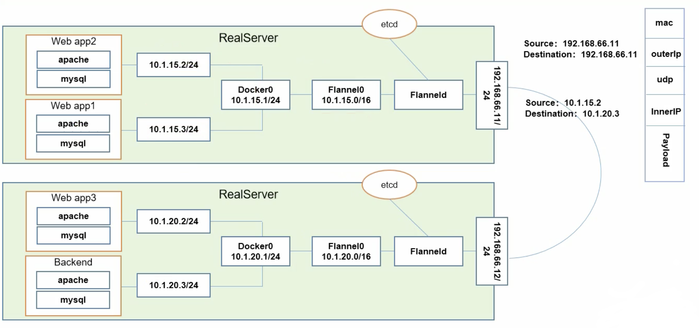

ETCD 之 Flannel 提供说明：

1、存储管理 Flannel 可分配的 IP 地址段资源

2、监控 ETCD 中每个 Pod 的实际地址，并在内存中建立维护 Pod 节点路由表

**同一个Pod内部通讯**

同一个Pod共享同一个网络命名空间, 共享同一个Linux协议栈

**Podl至Pod2**

1、Podl与Pod2不在同一台主机

Pod的地址是与docker0在同一个网段的, 但docker0网段与宿主机网卡是两个完全不同的IP网段, 并且不同Node之间的通信只能通过宿主机的物理网卡进行。将Pod的IP和所在Node的IP关联起来, 通过这个关联让Pod可以互相访问（如经过Flannel）

2、Pod与Pod2在同一台机器

由Docker0网桥直接转发请求至Pod2, 不需要经过Flannel

**Pod至Service的网络**

目前基于性能考虑, 全部为iptables维护和转发（最新使用LVS性能会更高）

**Pod到外网**

Pod向外网发送请求, 查找路由表, 转发数据包到宿主机的网卡, 宿主网卡完成路由选择后, iptables执行Masaquerade, 把源IP更改为宿主网卡的IP, 然后向外网服务器发送请求

**外网访问Pod**

Service

### 网络通讯模式说明

### 组件通讯模式说明


# K8S安装

## 安装方式介绍

### minikube

只是一个K8S集群模拟器，只有一个节点的集群，只为测试用，master和worker都在一起

需要提前安装好docker。

[minikube官方安装指南](https://minikube.sigs.k8s.io/docs/start)

```shell
# 启动集群
minikube start
# 查看节点。kubectl是一个用来跟K8S集群进行交互的命令行工具
kubectl get node
# 停止集群
minikube stop
# 清空集群
minikube delete --all
# 安装集群可视化Web UI控制台
minikube dashboard
```

### 云平台搭建

可视化搭建，只需简单几步就可以创建好一个集群

优点：安装简单，生态齐全，负载均衡器、存储等都分配好。简单操作就行。

1、腾讯云TKE-控制台搜索容器

2、阿里云控制台-产品搜索Kubernetes

### 裸机安装（Bare Metal）

至少需要两台机器（主节点、工作节点各一台），需要自己安装Kubernetes组件，配置会稍微麻烦点。可以租用云厂商服务器，费用低，用完销毁。

缺点：配置麻烦，缺少生态支持，例如负载均衡器、云存储。

#### 主节点需要组件

1、docker（也可以其它容器运行时）

2、kubectl集群命令行交互工具

3、kubeadm集群初始化工具

#### 工作节点需要组件

1、docker（也可以其它容器运行时）

2、kubelet管理Pod和容器，确保健康运行

3、kube-proxy网络代理，负责网络相关工作

#### 开始安装

```shell
# 每个节点分别设置对应主机名
hostnamectl set-hostname master
hostnamectl set-hostname node1
hostnamectl set-hostname node2
```

```shell
# 所有节点都修改hosts
vi /etc/hosts
172.16.32.2 node1
172.16.32.6 node2
172.16.0.4 master
```

```shell
# 所有节点关闭 SELinux
setenforce 0
sed -i --follow-symlinks 's/SELINUX=enforcing/SELINUX=disabled/g' /etc/sysconfig/selinux
```
注意：所有节点确保防火墙关闭
```shell
systemctl stop firewalld
systemctl disable firewalld
```
添加安装源（所有节点）
```plain
# 添加 k8s 安装源
cat <<EOF > kubernetes.repo
[kubernetes]
name=Kubernetes
baseurl=https://mirrors.aliyun.com/kubernetes/yum/repos/kubernetes-el7-x86_64
enabled=1
gpgcheck=1
repo_gpgcheck=1
gpgkey=https://mirrors.aliyun.com/kubernetes/yum/doc/yum-key.gpg https://mirrors.aliyun.com/kubernetes/yum/doc/rpm-package-key.gpg
EOF
mv kubernetes.repo /etc/yum.repos.d/

# 添加 Docker 安装源
yum-config-manager --add-repo http://mirrors.aliyun.com/docker-ce/linux/centos/docker-ce.repo
```
安装所需组件（所有节点）
```shell
yum install -y kubelet kubeadm kubectl docker-ce
```
启动 kubelet、docker，并设置开机启动（所有节点）
```plain
systemctl enable kubelet
systemctl start kubelet
systemctl enable docker
systemctl start docker
```
修改 docker 配置（所有节点）
```plain
# kubernetes 官方推荐 docker 等使用 systemd 作为 cgroupdriver，否则 kubelet 启动不了
cat <<EOF > daemon.json
{
  "exec-opts": ["native.cgroupdriver=systemd"],
  "registry-mirrors": ["https://ud6340vz.mirror.aliyuncs.com"]
}
EOF
mv daemon.json /etc/docker/

# 重启生效
systemctl daemon-reload
systemctl restart docker
```
用 [kubeadm](https://kubernetes.io/docs/reference/setup-tools/kubeadm/) 初始化集群（仅在主节点跑），
```plain
# 初始化集群控制台 Control plane
# 失败了可以用 kubeadm reset 重置
kubeadm init --image-repository=registry.aliyuncs.com/google_containers

# 记得把 kubeadm join xxx 保存起来
# 忘记了重新获取：kubeadm token create --print-join-command

# 复制授权文件，以便 kubectl 可以有权限访问集群
mkdir -p $HOME/.kube
cp -i /etc/kubernetes/admin.conf $HOME/.kube/config
chown $(id -u):$(id -g) $HOME/.kube/config

# 在其他机器上创建 ~/.kube/config 文件也能通过 kubectl 访问到集群
```
有兴趣了解 kubeadm init 具体做了什么的，可以 [查看文档](https://kubernetes.io/docs/reference/setup-tools/kubeadm/kubeadm-init/)
把工作节点加入集群（只在工作节点跑）

```plain
# 执行上一步 kubeadm init 之后 界面会打印下面的指令
kubeadm join 172.16.32.10:6443 --token xxx --discovery-token-ca-cert-hash xxx
```
安装网络插件，否则 node 是 NotReady 状态（主节点跑）
```plain
kubectl apply -f https://raw.githubusercontent.com/coreos/flannel/master/Documentation/kube-flannel.yml
```
查看节点，要在主节点查看（其他节点有安装 kubectl 也可以查看） 
## 系统初始化

## K8S部署安装

Harbor使用Cenot7或内核3.1以上（最新最好4.4，有些bug导致docker意外重启）能避免较多问题（老版本不支持某些命名空间、Overlay的文件系统需要编译内核加载等）

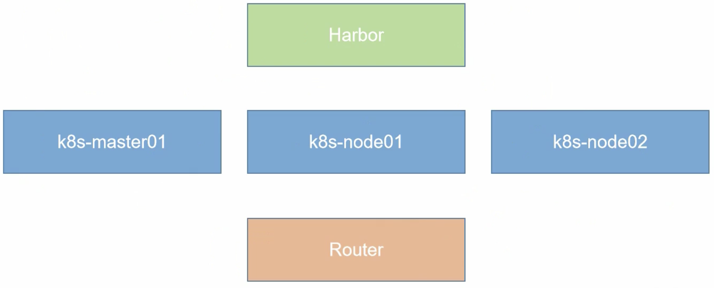

### Node安装

kubeadm安装k8s，kube-system命名空间

### Harbor安装

私有镜像仓库


## 常见问题分析

# 资源清单

## K8S资源概念

### 资源定义

K8S中所有的内容都抽象为资源，资源实例化之后，叫做对象。

### 名称空间级别资源

工作负载型资源（workload）

Pod、ReplicaSet、Deployment、StatefulSet、DaemonSet、Job、CronJob（ReplicationController在v1.11版本被废弃）

服务发现及负载均衡型资源（ServiceDiscovery LoadBalbance）

Service、Ingress、...

配置与存储型资源

Volume（存储卷）、GSI（容器存储接口，可以扩展各种各样的第三方存储卷）

特殊类型的存储卷

ConfigMap（当配置中心来使用的资源类型）、Secret（保存敏感数据）、DownwardAPI（把外部环境中的信息输出给容器）

### 集群级别资源

Namespace、Node、Role、ClusterRole、RoleBinding、ClusterRoleBinding

### 元数据型资源

HPA、PodTemplate、LimitRange

## 资源清单含义

在K8S中，一般使用yaml格式的文件来创建符合我们预期期望的pod，这样的yaml文件我们一般称为资源清单

### yaml语法格式

#### 基本语法

1、缩进时不允许使用Tab键，只允许使用空格

2、缩进的空格数目不重要，只要相同层级的元素左侧对齐即可

3、标识注释，从这个字符一直到行尾，都会被解释器忽略

#### yaml支持的数据结构

对象

键值对的集合，又称为映射（mapping）/哈希（hashes）、字典（dictionary）

数组

一组按次序排列的值，又称为序列（sequence）/列表

纯量（scalars）

单个的、不可再分的值。

#### 对象类型

对象的一组键值对，使用冒号结构表示

```yaml
name: zhangsan
age: 20
```
yaml也允许另外一种写法，将所有键值对写成一个行内对象
```yaml
hash: { name: zhangsan, age: 20}
```
数组也可以采用行内表示法
```yaml
animal: [Dog, Cat]
```
纯量
如字符串、布尔值、整数、浮点数、null、时间、日期

其中null用~表示

允许使用两个感叹号，强制转换数据类型，如

```yaml
e: !!str 123
f: !!str true
```
字符串
默认不需要使用引号表示，如果包含空格或者特殊字符，需要放在引号之中。其中双引号不会对特殊字符转义。单引号之中如果还有需要转义的单引号，必须连续使用两个单引号转义。

多行字符串可以写成多行，从第二行开始，必须有一个单空格缩进。换行符会被转为空格。

多行字符可以使用 | 保留换行符，也可以使用 > 折叠换行

```yaml
this: |
Tom
Tony
that: >
Tom
Tony
```
+表示保留文字块末尾的换行，-表示删除字符串末尾的换行
```yaml
this: |+
Tom
Tony
```

### 常用字段说明

可以通过下面命令查询字段含义

```shell
kubectl explain pod
kubectl explain pod.apiVersion 
```
|参数名|字段类型|说明|
|:----|:----|:----|
|version|String|K8S API的版本，目前基本上是v1，可以用kubectl api-versions命令查询|
|kind|String|yaml文件定义的资源类型和角色，如：Pod|
|metadata|Object|元数据对象，固定值就写metadata|
|metadata.name|String|元数据对象的名字，由自己编写，如命名Pod名字|
|metadata.namespace|String|元数据对象的命名空间，由自己编写|
|Spec|Object|详细定义对象，固定值就写Spec|
|spec.containers[]|list|Spec对象的容器列表定义，列表|
|spec.containers[].name|String|容器的名字|
|spec.containers[].image|String|镜像名称|
|spec.containers[].imagePullPolicy|String|镜像拉取策略，有Always(默认值)、Never(仅适用本地镜像)、IfNotPreset三个值|
|spec.containers[].command[]|List|容器启动命令，不指定则使用镜像打包时使用的启动命令|
|spec.containers[].args[]|List|指定容器启动命令参数|
|spec.containers[].workingDir|String|指定容器的工作目录|
|spec.containers[].volumeMounts[]|List|容器的存储卷配置|
|spec.containers[].volumeMounts[].name|String|被容器挂载的存储卷名称|
|spec.containers[].volumeMounts[].mountPath|String|被容器挂载的存储卷路径|
|spec.containers[].volumeMounts[].readOnly|String|设置存储卷路径的读写模式，true/false，默认true|
|spec.containers[].ports[]|List|指定容器需要用到的端口列表|
|spec.containers[].ports[].name|String|端口名称|
|spec.containers[].ports[].containerPort|String|容器需要监听的端口号|
|spec.containers[].ports[].hostPort|String|指定容器所在主机需要监听的端口号，默认跟containerPort相同，注意设置了该值同一台主机无法启动容器的相同副本（端口号冲突）|
|spec.containers[].ports[].protocol|String|指定端口协议，支持TCP(默认)和UDP|
|spec.containers[].env[]|List|容器运行前需要设置的环境变量列表|
|spec.containers[].env[].name|String|环境变量名称|
|spec.containers[].env[].value|String|环境变量值|
|spec.containers[].resources|Object|资源限制和资源请求的值（资源上限）|
|spec.containers[].resources.limits|Object|容器运行时资源的运行上限|
|spec.containers[].resources.limits.cpu|String|CPU的限制，单位为core数，将用于docker run --cpu-shares参数|
|spec.containers[].resources.limits.memory|String|MEM内存的限制，单位为MiB、GiB|
|spec.containers[].resources.requests|Object|容器启动和调度室的限制设置|
|spec.containers[].resources.requests.cpu|String|CPU请求，单位为core数，容器启动时初始化可用数量|
|spec.containers[].resources.requests.memory|String|内存请求，单位为MiB、GiB，容器启动的初始化可用数量|
|spec.restartPolicy|String|定义Pod的重启策略，可选值为Always(默认值)、OnFailure(只有Pod以非零退出码终止时，kubelet才会重启该容器)、Never(kubelet将退出码报告给Master，不重启)|
|spec.nodeSelector|Object|Node的Label过滤标签，以key:value格式指定|
|spec.imagePullSecrets|Object|pull镜像时使用secret名称，以name:secretkey格式指定|
|spec.hostNetwork|Boolean|是否使用主机网络模式，默认false，true表示使用宿主机网络，不适用docker网桥，同时设置了true无法在同一台宿主机上启动第二个副本|

### 查看pod容器日志

```shell
kubectl get pod
kubectl get pod -w # 自动刷新
kubectl get pod -o wide # 显示更多信息，如ip和node
kubectl log <pod-name>  # 单个容器
kubectl log <pod-name> -c <container-name>  # 多个容器
```
## 通过资源清单编写pod

## pod的生命周期

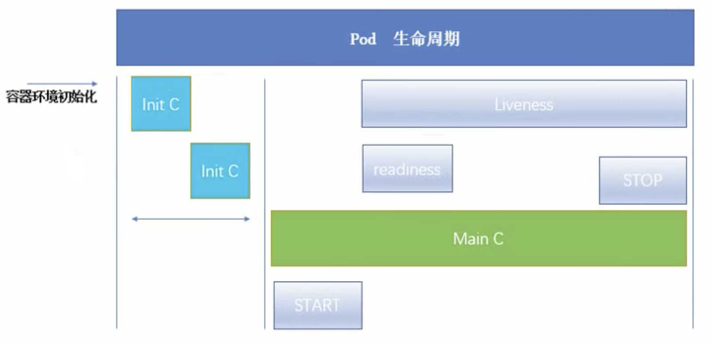

### initC 

init Contianer：init 容器

Pod能够具有多个容器，应用运行在容器里面，但是也有可能有一个或多个先于应用容器启动的Init容器

Init容器与普通的容器非常像，除了以下两点：

1、Init容器总是运行到成功完成为止

2、每个Init容器都必须在下一个Init容器启动之前成功完成

如果Pod的Init容器失败，Kubernetes会不断重启该Pod，知道Init容器成功为止。如果Pod对应的restartPolicy为Never，则不会重启。

**init容器的作用**

因为Init容器具有与应用程序容器分离的单独镜像，所以它们的启动相关代码有如下优势：

1、它们可以包含并运行实用工具，但出于安全考虑，不建议在应用程序容器镜像中包含这些使用工具

2、可以包含使用工具和定制化代码来安装，但不能出现在应用程序镜像中。如：创建镜像没必要From另外一个镜像，只需要在安装过程中使用类似sed、awk、python或dig这样的工具

3、应用程序镜像可以分离出创建和部署的角色，而没有必要联合它们构建一个单独的镜像

4、Init容器使用Linux Namespace，所以相对应用程序容器来说具有不同的文件系统视图。因此，它们能够具有访问Secret的权限，而应用程序容器则不能。

5、它们必须在应用程序容器启动之前运行完成，而应用程序容器式并行运行的，所以Init容器能够提供一种简单的阻塞或延迟应用容器的启动的方法，知道满足了一组先决条件。

**Init模板**

**init-pod.yaml**

```yaml
apiVersion: v1
kind: Pod
metadata:
  name: myapp-pod
  labels:
    app: myapp
  spec:
    containers:
    - name: myapp-container
      image: busybox
      command: ['sh', '-c', 'echo The app is running! && sleep 3600']
    initContainers:
    - name: init-myservice
      image: busybox
      command: ['sh', '-c', 'until nslookup myservice; do echo waiting for myservice; sleep 2; done;']
    - name: init-mydb
      image: busybox
      command: ['sh', '-c', 'until nslookup mydb; do echo waiting for mydb; sleep 2; done;']  
```
运行命令：
```shell
kubectl create -f init-pod.yaml
kubectl describe pod <pod-name>
kubectl log <pod-name> -c <container-name>

kubectl get pod # 查看pod列表
kubectl delete deployment --all # 删除所有的deployment
kubectl delete pod --all # 删除所有的deployment
kubectl get svc  # 查看service列表
kubectl delete svc <svc-name>
```
myservice
```yaml
kind: Service
apiVersion: v1
metadata:
  name: myservice
spec:
  ports:
    - protocol: TCP
      port: 80
      targetPort: 9376
```
mydb.yaml
```
kind: Service
apiVersion: v1
metadata:
  name: mydb
spec:
  ports:
    - protocol: TCP
      port: 80
      targetPort: 9377
```
运行命令：
```shell
kubectl create -f myservice.yaml
kubectl create -f mydb.yaml
```
**特殊说明**
1、在Pod启动过程中，Init容器会按顺序在网络和数据卷初始化(**Pause容器**)之后启动。每个容器必须在下一个容器启动之前成功退出

2、如果由于运行时或失败退出，将导致容器启动失败，他会根据Pod的restartPolicy指定的策略进行重试。然而，如果Pod的restartPolicy设置为Always，Init容器失败时会使用RestartPolicy策略。

3、在所有的Init容器没有成功之前，Pod将不会编程Ready状态。Init容器的端口将不会在Service中进行聚集（不会暴露出去）。正在初始化的Pod处于Pending状态，但应该会将Initializing状态设置为true

4、如果Pod重启，所有init容器必须重新执行

5、对Init容器spec的修改被限制在容器image字段，修改其他字段都不会生效。更改init容器的image字段，等价于重启该Pod

```shell
kubectl edit pod <pod-name> # 修改pod配置
```
6、Init容器具有应用容器的所有字段。除了readinessProbe，因为Init容器无法定义不同于完成（completion）的就绪（readiness）之外的其他状态。这会在验证过程中强制执行。（init容器本身就是做就绪的工作，再来就绪检测就呵呵）
7、在Pod中的每个app和Init容器的名称必须唯一；与任何其它容器共享同一个名称，会在验证时抛出错误

### Pod phase

**挂起（Pending）**

Pod已被Kubernetes系统接受, 但有一个或多个容器镜像尚未创建。等待时间包括调度Pod的时间和通过网络下载镜像的时间, 这可能需要花点时间

**运行中（Running）**

该Pod已经绑定到了一个节点上, Pod中所有的容器都已被创建。至少有一个容器正在运行, 或者正处于启动或重启状态

**成功（Succeeded）**

Pod中的所有容器都被成功终止, 并且不会再重启

**失败（Failed）**

Pod中的所有容器都已终止了, 并且至少有一个容器是因为失败终止。也就是说, 容器以非0状态退出或者被系统终止

**未知（Unknown)**

因为某些原因无法取得Pod的状态，通常是因为与Pod所在主机通信失败

### 容器探针

探针是由kubelet对容器执行的定期诊断。要执行诊断，kubelet调用由容器实现的Handler。有三种类型的处理程序： 

1、ExechAction：在容器内执行指定和令。如果佐令退出时返回码为0则认为诊断成功。

2、TCPSockethction: 对指定端口上的容器的IP地址进行TCP检查。如果踹口打开, 则识断

被认为是成功的。

3、HTTPGethction：对指定的端口和路径上的容器的IP地址执行HTTP Get请求。如果响应的

状态码大于等于200且小于400，则诊断被认为是成功的

每次探测都将获得以下三种结果之一：

1、成功: 容器通过了诊断。

2、夫败: 容器未通过诊断。

3、未知: 诊断失败，因此不会采取任何行动

#### livenessProbe

指示容器是否正在运行。如果存活探测失败，则kubelet会杀死容器，并且容器将|受到其重启策略的影响。如果容器不提供存活探针, 则默认状态为Success

redinessProbe-httpget

```yaml
apiVersion: v1
kind: Pod
metadata: 
  name: readiness-httpget-pod
  namespace: default
spec:
  containers:
  - name: readiness-httpget-container
    iamge: xxxnignx:v1
    imagePullPolicy: IfNotPresent
    readinessProbe:
      httpGet:
        port: 80
        path: /index1.html
        initialDelaySeconds: 1
        periodSeconds: 3
```
进入容器
```shell
# 进入容器
kubectl exec <pod-name>  # pod只有单个容器
# pod有多个容器
kubectl exec <pod-name> -c <container-name> -it -- /bin/sh
cd /usr/share/nignx/html
echo "hello" >> index1.html
exit # 退出
```
#### readinessProbe

指示容器是告准备好服务请求。如果就绪探测失败, 端点控制器将从与Pod匹配的所有Service的踹点中删除该Pod的IP地址。初始延迟之前的就绪状态默认为Failure。如果容器不提供就绪探针, 则默认状态为Success

livenessProbe-exec

```yaml
apiVersion: v1
kind: Pod
metadata:
  name: liveness-exec-pod
  namespace: default
spec: 
  containers:
  - name: liveness-exec-container
    image: xxx
    imagePullPolicy: IfNotPresent
    command: ["/bin/sh", "-c", "touch /tmp/live ; sleep 60; rm -rf /tmp/live; sleep 3600"]
    livenessProbe:
      exec:
        command: ["test", "-e", "/tmp/live"]
      initialDelaySeconds: 1
      periodSeconds: 3   
```
创建并观察
```shell
kubectl get pod -w
# 可以发现pod重启
```
livenessProbe-httpget
```yaml
apiVersion: v1
kind: Pod
metadata:
  name: liveness-httpget-pod
  namespace: default
spec: 
  containers:
  - name: liveness-httpget-container
    image: xxx:v1
    imagePullPolicy: IfNotPresent
    ports:
    - name: http
      containerPort: 80
    livenessProbe:
      httpGet:
        port: http
        path: /index.html
      initialDelaySeconds: 1
      periodSeconds: 3
      timeoutSeconds: 10
```
创建并观察
```shell
kubectl get pod -o wide # 查看pod ip
curl <ip>/index.html
kubectl exec <pod-name> -it -- /bin/sh
rm -rf /usr/share/nginx/html/index.html
exit
curl <ip>/index.html  # 访问报错
# 重启后
kubectl exec <pod-name> -it -- rm -rf /usr/share/nginx/html/index.html
kubectl get pod  # 会发现再次重启了
```
livenessProbe-tcp
```yaml
apiVersion: v1
kind: Pod
metadata: 
  name: probe-tcp
spec:
  containers:
  - name: nginx
    image: xxx
    livenessProbe:
      initalDelaySeconds: 5
      timeoutSecond: 1
      tcpSocket: 
        port: 8080
      periodSeconds: 3
```

### Pod hook

启动退出动作

```yaml
apiVersion: v1
kind: Pod
metadata:
  name: lifecycle-demo
spec:
  containers:
  - name: lifecycle-demo-container
    iamge: nginx
    lifecycle:
      postStart:
        exec:
          command: ["/bin/sh", "-c", "echo Hello from the postStart handler > usr/share/message"]
      preStop:
        exec:
          command: ["/bin/sh", "-c", "echo Hello from the postStop handler > usr/share/message"]

```
### 重启策略

# Pod控制器

## 什么是控制器

Kubernets中内建了很多controller（控制器），相当于一个状态机，用来控制Pod的具体状态和行为

## 控制器类型说明

### ReplicationController和ReplicaSet

ReplicationController(RC) 用来确保容器应用的副本数始终保持在用户定义的副本数，即如果有容器异常退出，会自动创建新的Pod来替代；而如果异常多出来的容器也会自动回收

在新版本的Kubernetes中建议使用ReplicaSet来取代ReplicationController。ReplicaSet跟

ReplicationController没有本质的不同, 只是名字不一样, 并且ReplicaSet支持集合式的selector（通过标签匹配）

RS实战

```shell
kubectl explain rs # 查看更多field及其用法
```
RS demo
```yaml
apiVersion: extensions/v1beta1
kind: ReplicaSet
metadata:
  name: frontend
spec:
  replicas: 3
  selector:
    machLabels:
      tier: frontend
  template:
    metadata:
      labels:
        tier: frontend
    spec:
      containers:
      - name: php-redis
        image: gcr.io/google_samples/gb-fronted:v3
        env:
        - name: GET_HOSTS_FROM
          value: dns
        ports:
        - containerPort: 80 
```
操作
```shell
kubectl get pod --show-labels
kubectl delete rs -all
# 会发现自动又创建了一些pod，并且名称的随机后缀不一样
kubectl label pod <pod-name> tier=<new-label-name>
```
注意：RS根据标签名管理，如果修改了标签名则删除相关rs不会影响修改了label的pod
### Deployment

Deployment为Pod和ReplicaSet提供了一个声明式定义（declarative）方法，用来替代以前的

ReplicationController来方便的管理应用。典型的应用场景包括：

1、定义Deployment来创建Pod和ReplicaSet

2、滚动升级和回滚应用

3、扩容和缩容（RS）

4、暂停和继续Deployment

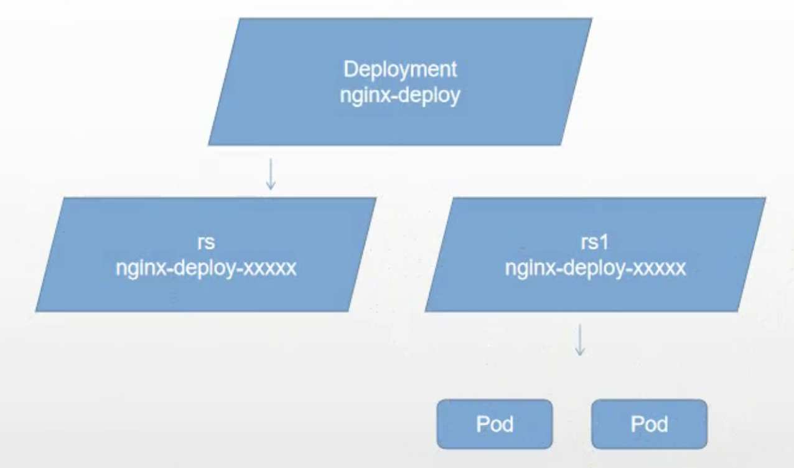

Deployment更新策略

Deployment可以保证在升级时只有一定数量的Pod是down的。默认确保至少有比期望的Pod数量少一个是up状态（最多一个不可用）

Deployment同时也可以确保只创建出超过期望数量的一定数量的Pod。默认确保最多比期望的Pod数量多一个的Pod是up状态（最多1个surge）

未来的K8S版本中，将从1-1变成25%-25%

```shell
kubectl describe deployments
```
**Rollover（多个rollout并行）**
假如创建了一个有5个nginx:1.7.9 replica的Deployment，但是当还只有3个ngnix:1.7.9的replica创建出来的时候就开始更新含有5个nginx:1.9.1 replica的Deployment。这种情况下，Deployment会立即杀掉已创建的3个nginx:1.7.9的Pod，并开始创建nginx:1.9.1的Pod。不会等到所有的5个nginx:1.7.9的Pod都创建完成后才开始改变航道

**回退Deployment**

只要Deployment的rollout被触发就会创建一个revision。也就是说当且仅当Deployment的Pod template（如.spec.template）被更改，例如更新template中的label和容器镜像时，就会创建出一个新的revision。其它的更新如扩容Deployment不会创建revision，因此可以很方便手动或自动扩容。这意味着回退到历史revision时，只有Deployment中的Pod template部分才会回退。

```shell
kubectl set image deployment/nginx-deployment nginx=nginx:1.9.1
kubectl rollout status deployments nginx-deployment
kubectl get pods
kubectl rollout history deployment/nginx-deployment
kubectl rollout undo deployment/nginx-deployment
# 使用revision参数指定某个历史版本，防止死循环
kubectl rollout undo deployment/nginx-deployment --to-revision=2 
kubectl rollout pause deployment/nginx-deployment  # 暂停deployment更新
# 查看deployment是否完成，成功将返回一个0值的Exit Code
kubectl rollout status deployment/nginx-deployment 
echo $?

kubectl set image deployment/nginx-deployment nginx=xxx:v3
```
**清理Policy**
可以通过设置.spec.revisionHistoryLimit项来指定deployment最多保留多少revision历史记录。默认会保留所有的revision，如果将该项设置为0，Deployment就不允许回退。

**Deployment实战部署Nginx**

配置文件

```yaml
apiVersion: extensions/v1beta1
kind: Deployment
metadata:
  name: nginx-deployment
spec:
  replicas: 3
  template:
    metadata:
      labels:
        app: nginx
    spec:
      containers: 
      - name: nginx
        image: nginx:1.7.9
        ports:
        - containerPort: 80
        
```
创建
```shell
kubectl create -f https://kubernetes.io/docs/user-guide/nginx-deployment.yaml --record
## --record参数可以记录命令，方便查看每次revision变化

# 扩容
kubectl scale deployment nginx-deployment --replicas 10

# 支持HPA，可以设置自动扩展
kubectl autoscale deployment nginx-deployment --min=10 --max=15 --cpu-percent=80

kubectl apply -f deployment.yaml --record
kubectl get deployment
kubectl get rs
# 回滚
kubectl rollout undo deployment/nginx-deployment
```
### DaemonSet

Daemonset 确保全部(或者一些) Node上运行一个Pod的副本。当有Node加入集群时, 也会为他们新增一个Pod。当有Node从集群移除时, 这些pod也会被回收。**删除DaemonSet将会删除它创建的所有Pod。**

使用DaemonSet的一些典型用法: 

1、运行集群存储daemon, 例如在每个Node上运行glusterd、ceph

2、在每个Node上运行日志收集daemon, 例如fluentd、logstash

3、在每个Node上运行监控daemon, 例如Prometheus Node Exporter、collectd、Datadog代理、New Relic代理, 或Ganglia gmond

**DaemonSet实战**

```yaml
apiVersion: apps/v1
kind: DaemonSet
metadata:
  name: deamonset-example
  labels:
    app: daemonset
  spec:
    selector:
      matchLabels:
        name: daemonset-example
    template:
      metadata:
        labels:
          name: daemonset-example
      spec:
        containers:
          - name: daemonset-example
            iamge: xxx:v1
```
### Job

Job负责批处理任务，即仅执行一次的任务，保证批处理任务的一个或多个Pod成功结束

特殊说明：

1、spec.template格式同Pod

2、RestartPolicy仅支持Never或OnFailure

3、单个Pod时，默认Pod成功运行后Job即结束

4、.spec.completions标志Job结束需要成功运行的Pod个数，默认为1

5、.spec.parallelism标志并行运行的Pod的个数，默认为1

6、spec.activeDeadlineSeconds标志失败Pod的重试最大时间，超过这个时间不会继续重试

Job实战

```yaml
apiVersion: batch/v1
kind: Job
metadata:
  name: pi
spec:
  template:
    matedata;
      name: pi
    spec:
      containers:
      - name: pi
        image: perl
        command: ["perl", "-Mbignum=bpi", "-wle", "print bpi(2000)"]
      restartPolicy: Never 
```
查看日志，可以显示打印的2000位的PI值
```shell
docker load -i xx.tar
kubectl get job
kubectl log <job-name>
```
### CronJob

CronJob管理基于时间的Job，即：

1、在给定的时间点只运行一次

2、周期性地在给定时间点运行

使用前提条件：当前使用k8s集群，版本>=1.8（对CronJob）。对于先前版本的集群，版本<1.8，启动API Server时，通过传递选项

```plain
--runtime-config=batch/v2alpha1=true
```
可以开启batch/v2alpha1 API
典型用法：

1、给定的时间点调度Job运行

2、创建周期性运行的Job，例如：数据库备份、发送邮件

**CronJob Spec**

1、.spec.schedule：调度，必需字段，指定任务运行周期，格式Cron

2、.spec.jobTemplate：Job模板，必需字段，指定需要运行的任务，格式同Job

3、.spec.startingDeadlineSeconds：启动Job的期限（秒级别），可选字段，如果因为任何原因而错过了被调度的时间，那么错过执行时间的Job将被认为是失败的。没有指定则没有期限。

4、.spec.concurrencyPolicy：并发策略，可选字段。指定如何处理被Cron Job创建的Job的并发执行。只允许指定下面策略中的一种：

1）Allow（默认）：允许并发运行的Job

2）Forbid：禁止并发运行，如果前一个还没有完成，则直接跳过下一个

3）Replace：取消当前正在运行的Job，用一个新的来替换

注意：当前策略只能应用于同一个Cron Job创建的Job。如果存在多个Cron Job，它们创建的Job之间总是允许并发运行。

5、.spec.suspend：挂起，字段可选。true表示后续所有执行都会被挂起。对已经开始执行的Job不起作用。默认值false

6、.spec.successfulJobsHistoryLimit和.spec.failedJobsHistoryLimit：历史限制，可选字段，指定可以保留多少完成和失败的Job，默认分别设置2和1，设置限制的值为0则相关类型的Job完成后将不会被保留。

**CronJob的限制**

创建job操作应该是幂等的。

**CronJob实战**

```yaml
apiVersion: batch/v1beta1
kind: CronJob
metadata:
  name: hello
spec:
  schedule: "*/1 * * * *"
  jobTemplate:
    spec:
      tempalte:
        spec:
          containers:
          - name: hello
            iamge: busybox
            args:
            - /bin/sh
            - -c
            - date; echo Hello from the k8s cluster
         restartPolicy: OnFailure
```
创建
```shell
kubectl apply -f cronjob.yaml
kubectl get cronjob
kubectl get pod
```
### StatefulSet

StatefulSet作为 Controller 为Pod提供唯一的标识，可以保证部署和scale的顺序

StatefulSet是为了解决有状态服务的问题（对应Deployments和ReplicaSets是为无状态服务而设计），其应用场景包括：

1、稳定的持久化存储，即Pod重新调度后还是能访问到相同的持久化数据，基于PVC实现

2、稳定的网络标志，即Pod重新调度后其PodName和HostName不变，基于Headless Service（即没有Cluster IP的Service）来实现

3、有序部署，有序扩展，即Pod是有顺序的，在部署或者扩展的时候要依据定义的顺序依次进行（即从0到N-1，在下一个Pod运行之前所有之前的Pod必须都是Running和Ready状态），基于init containers来实现

4、有序收缩，有序删除（即从N-1到0）

### Horizontal Pod Autoscaling(HPA)

顾名思义，Pod水平自动缩放。应用的资源使用率通常都有高峰和低谷的时候，它可以削峰填谷，提高集群的整体资源利用率，让service中的Pod个数自动调整。

这个并不是一个直接的控制器，而是控制如Deployment

# 服务发现(SVC)

## Service原理

所有服务都注册到SVC，上层Nginx与SVC交互，不与具体的服务ip打交道。

**只有一个调度算法轮询（RR）。**

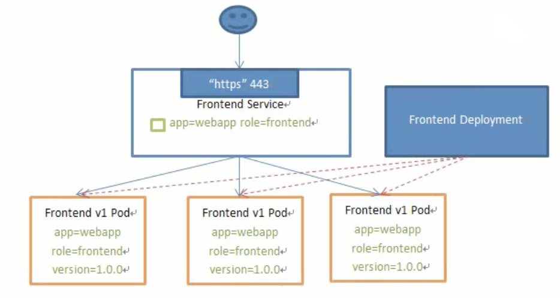


### Service含义

K8S Service定义了这样一个抽象：一个Pod的逻辑分组，一种可以访问它们的策略——通常称为微服务。这一组Pod能够被Serice访问到，通常是通过Label Selector

Service能够提供负载均衡的能力，但是在使用上有以下限制：

1、只提供4层负载均衡能力（只基于ip+port进行转发），而没有7层负载均衡能力（不能通过主机名/域名），但有时可能需要更多的匹配规则来转发消息，4层负载均衡是不支持的。后面介绍通过Ingress来实现7层负载均衡

### Service常见分类

Service在K8S中有以下四种类型：

#### ClusterIP

默认类型，自动分配一个仅Cluster内部可以访问的虚拟IP。

clusterIP主要在每个node节点使用iptables（**实际依赖具体环境底层代理模式**，也可以是ipvs或userspace，下文有介绍），将发向clusterIP对应端口的数据，转发到kube-proxy中。然后kube-proxy自己内部实现有负载均衡的方法，并可以查询到这个service下对应pod的地址和端口，进而把数据转发给对应的pod的地址和端口。

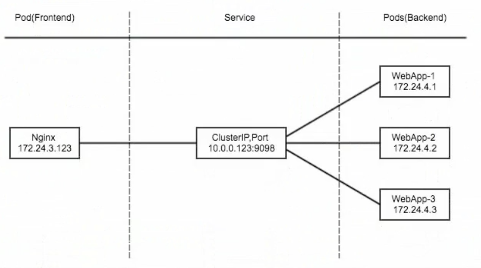

为了实现图上的功能, 主要需要以下几个组件的协同工作: 

1、apiserver：用户通过kubectl命令向apiserver发送创建service的命令，apiserver接收到请求后将数据存储到etcd中

2、Kube-proxy：kubernetes的每个节点中都有一个叫做kube-porxy的进程，这个进程负责感知service、pod的变化（检听etcd变化），并将变化的信息写入本地的iptables规则中

3、iptables使用NAT等技术将virtuallP的流量转至endpoint中

实战

svc-deployment.yaml

```yaml
apiVersion: apps/v1
kind: Deployment
metadata:
  name: myapp-deploy
  namespace: default
spec:
  replicas: 3
  selector:
    matchLabels:
      app: myapp
      release: stabel
  template:
    metadata:
      labels:
        app: myapp
        release: stabel
        env: test
    spec:
      containers:
      - name: myapp
        image: xxx:v2
        imagePullPolicy: IfNotPresent
        ports:
        - name: http
          containerPort: 80
```
创建
```shell
kubectl apply -f svc-deployment.yaml
kubectl get pod  # 每个都有自己的地址，可以直接curl
```

创建Service信息

svc-service.yaml

```yaml
apiVersion: v1
kind: Service
metadata:
  name: myapp
  namespace: default
spec:
  type: ClusterIP
  selector:
    app: myapp
    release: stabel
  ports:
  - name: http
    port: 80
    targetPort: 80
```
创建
```shell
kubectl apply -f svc-service.yaml
kubectl get svc 
# 如果没有对应标签的Pod，curl访问不到，可以通过ipvsadm -Ln 查看ipvs代理转发ip为空
kubectl delete -f svc-service.yaml
# 可以访问到对应的hostname信息
curl <svc-ip>/hostname.html
```

#### NodePort

在ClusterIP基础上为Service在每台机器上绑定一个端口，可以通过<NodeIP>:NodePort来访问服务

nodePort的原理在于在node上开了一个端口，将向该端口的流量导入到kube-proxy，然后由kube-proxy进一步地给到对应的pod

实战

配置信息除了将spec.type改成NodePort外，其它同ClusterIP的配置

注意：其实一组pod可以对应多个svc，因为svc是根据label进行关联的。如这里NodePort的配置文件和ClusterIP的配置文件除了spec.type外完全一致的情况下。

创建并验证

```shell
kubectl get svc # 会发现nodePort的port会多一个随机端口信息
netstat -anpt | grep :<port>  # 可以发现该端口是kube-proxy创建的
iptables -t nat -nvL  # 查询iptables的代理流程，ipvs用 ipvsadm -Ln 
```

#### LoadBalancer

在NodePort的基础上，借助cloud provider创建一个外部负载均衡器，并将请求转发到<NodeIP>: NodePort

localBalancer 和 nodePort 其实是同一种方式。区别在于loadBalancer比nodePort多了一步，就是可以调用cloud provider去创建LB来向节点导流（LB一般是LAAS，但是收费！）

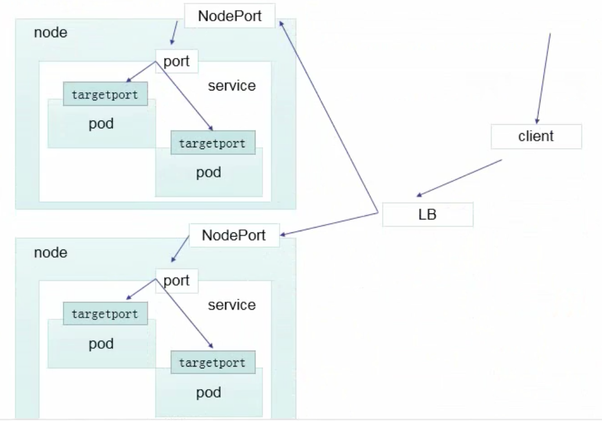


#### ExternalName

把集群外部的服务引入到集群内部来，在集群内部直接使用。没有任何类型代理被创建，只有k8s 1.7或更高版本的kube-dns才支持

这种类型的Service通过返回 CNAME 和它的值, 可以将服务映射到externalName字段的内容。ExternalNameService是Service的特例，没有selector，也没有定义任何的端口和Endpoint。相反对于运行在集群外部的服务, 它通过返回该外部服务的别名这种方式来提供服务。

实战

```yaml
kind: Service
apiVersion: v1
metadata:
  name: my-service1
  namespace: default
spec:
  type: ExternalName
  externalName: my.database.example.com
```
当查询主机 my-service1.default.svc.cluster.local（SVC_NAME.NAMESPECE.svc.cluster.local）时，集群的DNS服务将返回一个值my.database.example.com的CNAME记录。访问这个服务的工作方式和其他相同，唯一不同的是**重定向发生在DNS层**，而且**不会进行代理或转发**。

#### Headless Service

有时不需要或不想要负载均衡，以及单独的Service IP。遇到这种情况，可以通过制定Cluster IP（spec.clusterIP）的值为"None"来创建Headless Service。这类Service并不会分配Cluster IP，kube-proxy不会处理他们，而且平台不会为他们进行负载均衡和路由。

举例

svc-headless.yaml

```yaml
apiVersion: v1
kind: Service
metadata:
  name: myapp-headless
  namespace: default
spec:
  selector:
    app: myapp
  clusterIP: "None"
  ports:
  - port: 80
    targetPort: 80
```
创建验证
```shell
kubectl apply -f svc-headless.yaml
kubectl get svc  # 会发现对应svc的CLUSTER-IP为None
kubectl get pod -n kube-system  # 查看dns的地址信息(下面的dig的ip)

# 主机名默认是 svc名称.当前空间名称.集群域名
dig -t A myapp-headless.default.svc.cluster.local. @<ip>

kubectl get pod  # 查看pod ip和上面dig的一样

# 附录Ldig安装
yum -y install bind-utils
```
### Service代理模式分类

总体结构

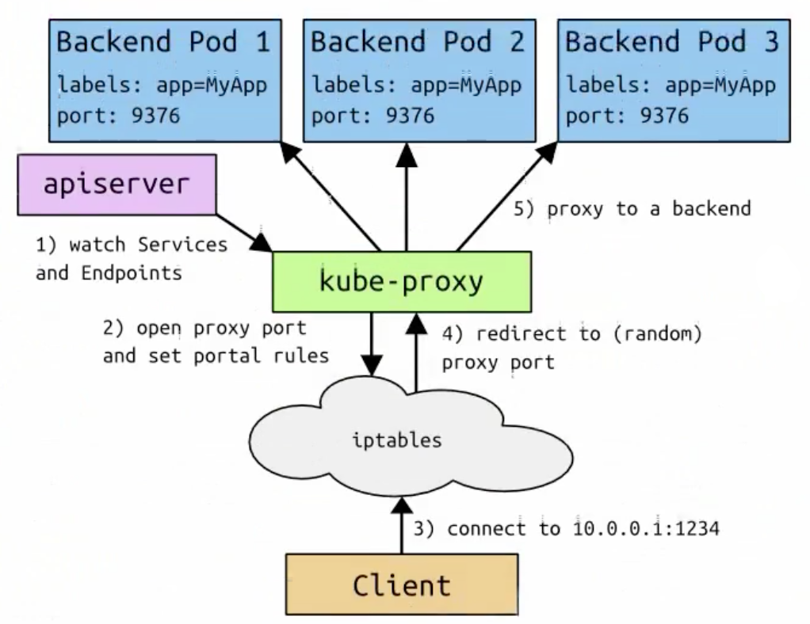

**VIP和Service代理背景**

在K8S集群中，每个Node运行一个kube-proxy进程，kube-proxy负责为Service实现了一种**VIP（虚拟IP）**的形式，而不是ExternalName的形式。

在K8S v1.0版本，代理完全在userspace。

在K8S v1.1版本，新增了iptables代理，但并不是默认的运行模式。

从K8S v1.2起，默认就是iptables代理。

在K8S v1.8.0-beta.0中，添加了ipvs代理。

在K8S v1.14八本开始默认使用ipvs代理

在K8S v1.0版本中，Service是 **4层（TCP/UDP over IP）**概念。

在K8S v1.1版本，新增Ingress API（beta版），用来表示**7层（HTTP）**服务

为什么不适用 round-robin DNS？

DNS一般会缓存。一般服务解析后一般不会清除缓存

#### userspace

userpace代理模式

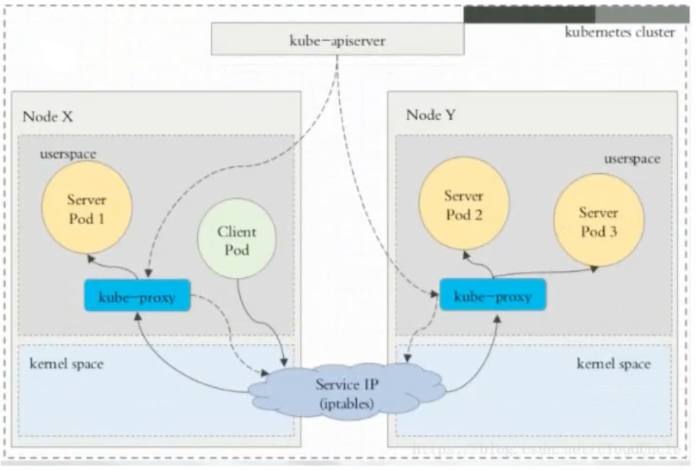

服务的访问和apiserver都会访问kube-proxy，导致压力比较大。

#### iptables

iptables代理模式

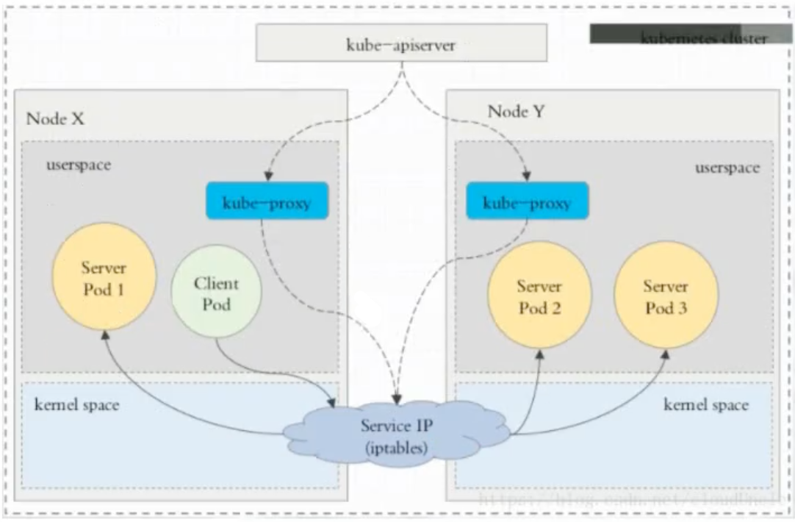

访问速率大大增加，kube-proxy能提高稳定性、减小压力。

缺点：防火墙的性能不高

#### ipvs

kube-proxy会监视K8S Service对象和Endpoints，调用netlink接口以相应地创建ipvs规则并定期与K8S Service对象和Endpoints对象同步ipvs规则，以确保ipvs状态与期望一直。访问服务时，流量将重定向到其中一个后端Pod。

与iptables类似，ipvs于netfilter的hook功能，但使用哈希表作为底层数据结构并在内核空间中工作。这意味着ipvs可以更快地重定向流量，并且在同步代理规则时具有更好的性能。此外，ipvs为负载均衡算法提供了更多的选项。例如：

1、rr：轮询调度

2、lc：最小连接数

3、dh：目标哈希

4、sh：源哈希

5、sed：最短期望延迟

6、nq：不排队调度

注意：ipvs模式假定在运行kube-proxy之前在节点上都已经安装了 IPVS 内核模块。当kube-proxy以ipvs代理模式启动时，kube-proxy将验证节点上是否安装了IPVS模块，如果未安装，则kube-proxy将回退到iptables代理模式。

ipvs代理模式

 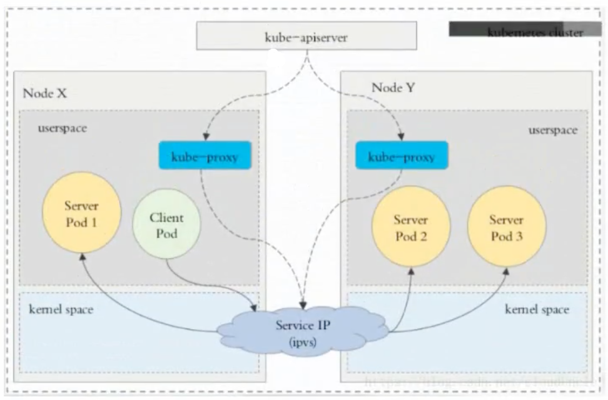

相关命令

```shell
ipvsadm -Ln  # 查看ipvs代理
kubectl get svc  # 查看cluster-ip，结合查看代理
```
## Ingress

github ingress：[https://github.com/kubernetes/ingress-nginx](https://github.com/kubernetes/ingress-nginx)

官方网站：[https://kubernetes.github.io/ingress-nginx/](https://kubernetes.github.io/ingress-nginx/)

中文文档：[https://kubernetes.io/zh/docs/concepts/services-networking/ingress/](https://kubernetes.io/zh/docs/concepts/services-networking/ingress/)

Ingress整体流程

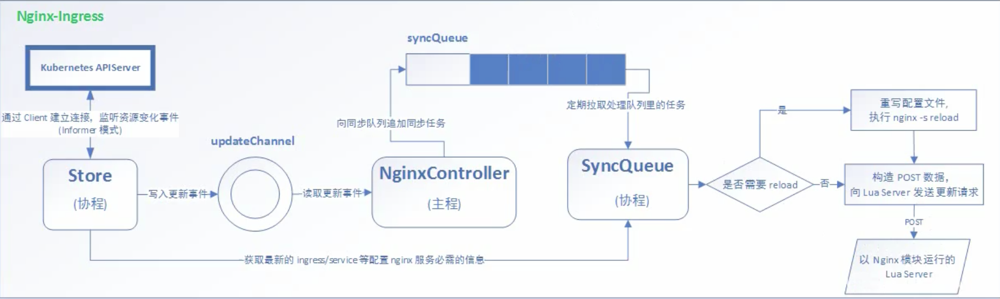

### 部署Ingress-Nginx

```shell
# https://kubernetes.github.io/ingress-nginx/deploy/
wget https://raw.githubusercontent.com/kubernetes/ingress-nginx/controller-v1.1.0/deploy/static/provider/cloud/deploy.yaml
cat deploy.yam | grep image # 查看镜像，可以提前pull
docker pull quay.io/kubernetes-ingress-controller/nginx-ingress-controller:0.25.0
```

保存镜像到本地

```shell
docker save -o ingress.contr.tar quay.io/kubernetes-ingress-controller/nginx-ingress-controller:0.25.0
tar -zcvf ingress.contr.tar.gz ingress.contr.tar
sz ingress.contr.tar.gz # 下载到本机
rz # 上传到远端
scp ingree.contro.tar.gz root@hostname:/root
tar -zxvf ingree.contr.tar.gz
docker load -i ingree.contr.tar  # 导入镜像。注意这里是tar结尾
```

创建

```shell
kubectl apply -f deploy.yaml
kubectl get pod -n ingress-nginx
# 暴露方案，AWS、GCE-GKE或NodePort(裸机)
wget -o servie-nodeport https://raw.githubusercontent.com/kubernetes/ingress-nginx/controller-v1.1.0/deploy/static/provider/baremetal/deploy.yaml
kubectl apply -f service-nodeport.yaml

kubectl get svc -n ingress-nginx # 有NodePort
```
### HTTP代理访问

deployment/Service/Ingress yaml文件

```yaml
apiVersion: extensions/v1beta1
kind: Deployment
metadata:
  name: deployment1
spec:
  replicas: 2
  template:
    metadata:
      labels:
        name: nginx1
    spec:
      containers:
         - name: nginx1
           image: xxx:v1
           imagePullPolicy: IfNotPresent
           ports:
             - containerPort: 80
---
apiVersion: v1
kind: Service
metadata:
  name: svc-1
spec:
  ports:
    - port: 80
      targetPort: 80
      protocol: TCP
  selector:
    name: nginx1
---
apiVersion: extensions/v1beta1
kind: Ingress
metadata:
  name: nginx-test
spec:
  rules:
    - host: xxxx.com
      http:
        paths:
        - path: /
          backend:
            serviceName: svc-1
            servicePort: 80
```
相关命令
```shell
kubectl get svc -n ingress-nginx  # 查看端口
```

### HTTPS代理访问

创建整数，以及cert存储方式

```shell
openssl req -x509 -sha256 -nodes -days 365 -newkey rsa:2048 -keyout tls.key -out tls.crt -subj "/CN=nginxsvc/0=nginxsvc"
kubectl create secret tls tls-secret --key tls.key --cert tls.crt
```
Deployment/Service/Ingress yaml文件
deployment和svc同上，修改label即可

ingress-https.yaml

```yaml
apiVersion: extensions/v1beta1
kind: Ingress
metadata:
  name: https
spec:
  tls:
    - hosts:
      - xxx.com
      secretName: tls-secret
  rules:
    - host: xxxx.com
      http:
        paths:
        - path: /
          backend:
            serviceName: svc-1
            servicePort: 80
```

### 使用cookie实现会话关联

参考官方文档：

[https://kubernetes.github.io/ingress-nginx/examples/affinity/cookie/](https://kubernetes.github.io/ingress-nginx/examples/affinity/cookie/)

### BasicAuth

参考官方用例：[https://kubernetes.github.io/ingress-nginx/examples/auth/basic/](https://kubernetes.github.io/ingress-nginx/examples/auth/basic/)

Nginx进行基础认证，用户密码登录

```shell
yum -y install httpd
htpasswd -c auth <username>  # 依赖httpd
kubectl create generic basic-auth --from-file=auth
```

```yaml
apiVersion: extensions/v1beta1
kind: Ingress
metadata:
  name: ingress-with-auth
  annotations:
    nginx.ingress.kubernetes.io/auth-type: basic
    nginx.ingress.kubernetes.io/auth-secret: basic-auth
    nginx.ingress.kubernetes.io/auth-realm: 'Authentication Required - <username>'
spec:
  rules:
  - host: xxx.com
    http:
      paths:
      - path: /
        backend:
          serviceName: svc-1
          servicePort: 80
```
### Nginx进行重写

|名称|描述|值|
|:----|:----|:----|
|nginx.ingress.kubernetes.io/rewrite-target|必须重定向流量的目标URI|串|
|nginx.ingress.kubernetes.io/ssl-redirect|指示位置部分是否仅可访问SSL（当Ingress包含整数时默认为True）|布尔|
|nginx.ingress.kubernetes.io/force-ssl-redirect|即使Ingress未启用TLS，也前世重定向到HTTPS|布尔|
|nginx.ingress.kubernetes.io/app-root|定义Controller必须重定向的应用程序根，如果他在'/'上下文中|串|
|nginx.ingress.kubernetes/use-regex|指示Ingress上定义的路径是否使用正则表达式|布尔|

示例

```yaml
apiVersion: extensions/v1beta1
kind: Ingress
metadata:
  name: nginx-test
  annotations:
    nginx.ingress.kubernetes.io/rewrite-target: xx.com:<port>
spec:
  rules:
  - host: xxx.com
    http:
      paths:
      - path: /
        backend:
          serviceName: svc-1
          servicePort: 80
```


# Reference

[k8s主要概念大梳理](https://mp.weixin.qq.com/s/6Pu7k-3taQhtZ18JkjbU0A)

[安装k8s集群](https://k8s.easydoc.net/docs/dRiQjyTY/28366845/6GiNOzyZ/nd7yOvdY)


