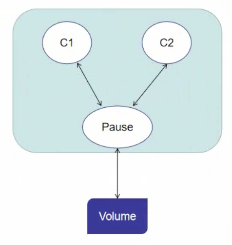
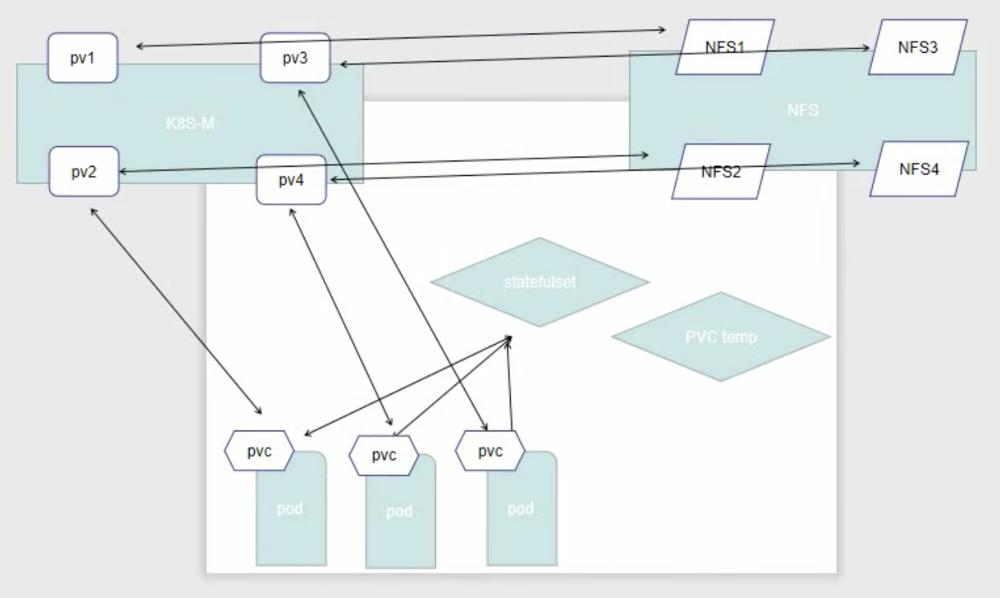
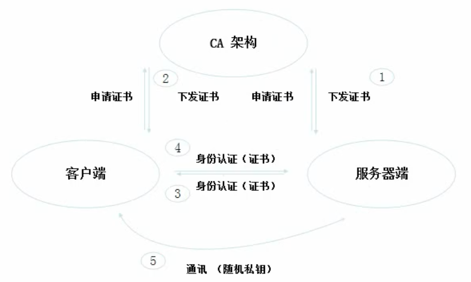
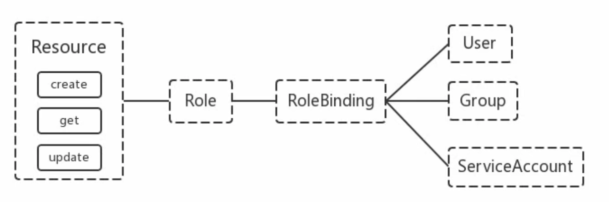
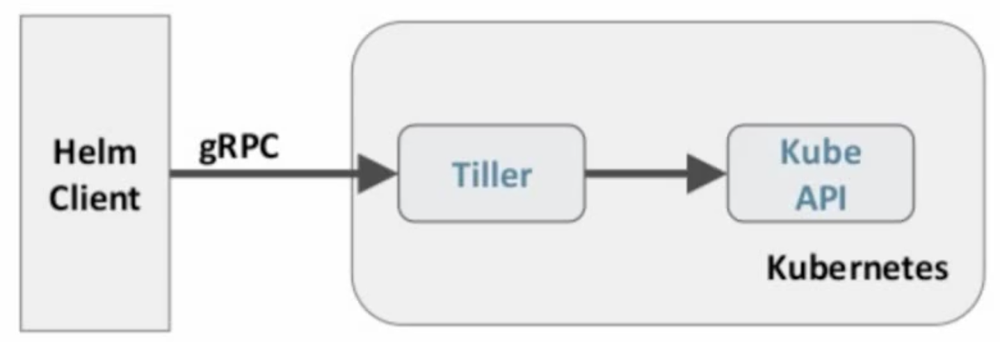

# 存储

服务分类

* 有状态服务：DBMS
* 无状态服务：LVS、APACHE

## configMap

配置文件注册中心

注意：nginx不支持热更新，需要重启

### 创建configMap

#### 使用目录创建

```plain
$ ls docs/user-guide/configmap/kubectl
game.properties
ui.properties

$ cat docs/user-guide/configmap/kubectl/game.properties
ememies=aliens
lives=3
ememies.cheat=true
ememies.cheat.level=noGoodRotten
secret.code.passphrase=UUDDLRLRBABAS
secret.code.allowed=true
secret.code.lives=30

$ cat docs/user-guide/configmap/kubectl/ui.properties
color.good=purple
color.bad=yellow
allow.textmode=true
how.nice.to.look=fairlyNice

$ kubectl create configmap game-config --from-file=docs/user-guide/configmap/kubectl
kubectl get cm
kubectl get cm game-config
kubectl get cm game-config -o yaml
kubectl describe cm game-config
```
--from-file：指定在目录下的所有文件都会被用在ConfigMap里面创建一个键值对，键的名字就是文件名，值就是文件的内容。
#### 使用文件创建

指定为一个文件就可以从单个文件创建ConfigMap

```shell
$ kubectl create configmap game-config-2 --from-file=docs/user-guide/configmap/kubectl/game.properties

$ kubectl get configmaps game-config-2 -o yaml
```
--from-file参数可以使用多次，可以使用两次分别指定上个实例中的两个配置文件，效果跟指定整个目录是一样的
#### 使用字面值创建

利用--from-literal参数传递配置信息，该参数可以使用多次，如下：

```shell
$ kubectl create configmap special-config \
--from-literal=special.how=very --from-literal=special.type=charm
```

### Pod中使用configMap

#### ConfigMap来替代环境变量

```yaml
apiVersion: v1
kind: ConfigMap
metadata:
  name: special-config
  namespace: default
data:
  special.how: very
  special.type: charm
```
  
```yaml
apiVersion: v1
kind: ConfigMap
metadata:
  name: env-config
  namespace: default
data:
  log_level: INFO
```
将配置值注入到Pod的环境变量中
```yaml
apiVersion: v1
kind: Pod
metadata:  
  name: dapi-test-pod
spec:
  containers:
    - name: test-container
      image: xx:v1
      command: ["/bin/sh", "-c", "env"]
      env:
        - name: SPECIAL_LEVEL_KEY
          valueFrom:
          configMapKeyRef:
            name: special-config
            key: special.how
        - name: SPECIAL_TYPE_KEY
          valueFrom:
            configMapKeyRef:
              name: special-config
              key: special.type
      envFrom:
        - configMapRef:
            name: env-config
  restartPolicy: Never
```
#### ConfigMap设置命令行参数

基本同上，导入变量一样，只是在启动命令中使用而已

```yaml
apiVersion: v1
kind: Pod
metadata:  
  name: dapi-test-pod
spec:
  containers:
    - name: test-container
      image: xx:v1
      command: ["/bin/sh", "-c", "echo $(SPECIAL_LEVEL_KEY) $(SPECIAL_TYPE_KEY)" ]
      env:
        - name: SPECIAL_LEVEL_KEY
          valueFrom:
          configMapKeyRef:
            name: special-config
            key: special.how
        - name: SPECIAL_TYPE_KEY
          valueFrom:
            configMapKeyRef:
              name: special-config
              key: special.type
      envFrom:
        - configMapRef:
            name: env-config
  restartPolicy: Never
```
#### 通过数据卷插件使用ConfigMap

在数据卷里面使用ConfigMap，有不同的选项。最基本的就是将文件填入数据卷，在这个文件中，键就是文件名，键值就是文件内容

```yaml
apiVersion: v1
kind: Pod
metadata:  
  name: dapi-test-pod
spec:
  containers:
    - name: test-container
      image: xx:v1
      command: ["/bin/sh", "-c", "cat /etc/config/special.how" ]
      volumeMounts:
      - name: config-volume
        mountPath: /etc/config
  volumes:
    - name: config-volume
      configMap:
        name: special-config
  restartPolicy: Never
```
验证
```shell
kubectl exec <pod-name> -it -- /bin/sh
cd /etc/config
ls # 会看到special.how 和 special.type
```
### configMap热更新

#### 实现演示

```yaml
apiVersion: v1
kind: ConfigMap
metadata:  
  name: log-config
  namespace: default
data: 
  log_level: INFO
---
apiVersion: extensions/v1beta1
kind: Deployment
metadata:  
  name: my-nginx
spec:
  replicas: 1
  tempalte:
    metadata:
      labels:
        run: my-nginx
    spec:
      containers:
      - name: my-nginx
        image: xx:v1
        ports:
        - containerPort: 80
        volumeMounts:
        - name: config-volume
          mountPath: /etc/config
        volumes:
          - name: config-volume
            configMap:
              name: log-config
```

```shell
kubectl exec `kubectl get pods -l run=my-nginx -o=name|cut -d "/" -f2` \
cat /etc/config/log_level
INFO
```
修改ConfigMap
```shell
kubectl edit configmap log-config
```
特别注意：
configMap如果是以ENV的方式挂载至容器，修改configMap并不会实现热更新

#### 更新触发说明

更新ConfigMap目前并不会触发相关Pod的滚动更新，可以通过修改pod annotations的方式强制触发滚动更新

```shell
kubectl patch deployment my-nginx --path '{"spec": {"template": {"metadata": {"annotations": {"version/config": "20210117"}}}}}'
```
这个例子里在.spec.template.metadata.annotations 中添加 version/config，每次通过修改version/config 来触发滚动更新。
更新ConfigMap后

1、使用该ConfigMap挂载的Env不会同步更新

2、使用该ConfigMap挂载的Volume中的数据需要一段时间（实测大概10秒）才能同步更新

## Secret

定义概念

Secret解决了密码、token、密钥等敏感数据的配置问题，而不需要把这些敏感数据暴露到镜像或者Pod Spec中。Secret可以以Volume或者环境变量的方式使用。

Secret有以下3种类型

### Service Account

用来访问Kubernetes API，由Kubernetes自动创建，并且会自动挂载到Pod的 /run/secrets/kubernetes.io/serviceaccount 目录中

### Opaque Secret

base64编码格式的Secret，用来存储密码、密钥等

#### 创建说明

Opaque类型的数据是一个map类型，要求value是base64编码格式

```shell
$ echo -n "admin" | base64
YWRtaW4=
$ echo -n "admin666" | base64
YWRtaW42NjY=
```
secrets.yml
```yaml
apiVersion: v1
kind: Secret
metadata:
  name: mysecret
type: Opaque
data:
  password: YWRtaW42NjY=
  username: YWRtaW4=
```

#### 使用方式

1、将Secret挂载到Volume中

```yaml
apiVersion: v1
kind: Pod
metadata:
  labels:
    name: secret-test
  name: secret-test
spec:
  volumes:
  - name: secrets
    secret:
      secretName: mysecret
  containers:
  - image: xxxx:v1
    name: db
    volumeMounts:
    - name: secrets
      mountPath: "/etc/secrets"
      readOnly: true      
```
操作：
```shell
# 启动后
cd /etc/secrets
cat username # 会自动解密
```
2、将Secret导出到环境变量中
```yaml
apiVersion: extension/v1beta1
kind: Deployment
metadata:
  name: pod-deployment1
spec:
  replicas: 2
  template:
    metadata:
      labels:
        app: pod-deployment1
    spec:
      containers:
      - name: pod-1
        iamge: xx:v1
        ports:
        - containerPort: 80
        env:
        - name: TEST_USER
          valueFrom:
            secretKeyRef:
              name: mysecret
              key: username
        - name: TEST_PASSWORD
          valueFrom:
            secretKeyRef:
              name: mysecret
              key: password
```

### kubernetes.io/dockerconfigjson

用来存储私有docker registry的认证信息

使用Kubectl创建docker registry认证的secret

```shell
$ kubectl create secret docker-registry myregistrykey --docker-server=DOCKER_REGISITRY_SERVER \
--docker-username=DOCKER_USER --docker-password=DOCKER_PASSWORD \
--docker-email=DOCKER_EMAIL 
secret "myregistrykey" created.
```

修改镜像名并推送

```shell
docker tag old:v1 new:v2
docker push new:v2  # error
docker login xxx  # push again
```
拉取私有镜像
```shell
docker logout xxx # 先退出登录，之前认证过
```
创建Pod，通过 imagePullSecrets 来引用刚创建的 myregistrykey
```yaml
apiVersion: v1
kind: Pod
metadata:
  name: foo
spec:
  containers:
    - name: foo
      image: xx:v1
  imagePullSecrets:
    - name: myregistrykey
```

## volume

容器磁盘上的文件的声明周期是短暂的，这就使得在容器中运行重要应用时会出现一些问题。首先，当容器崩溃时，kubelet会重启它，但是容器中的文件将丢失——容器以干净的状态（镜像最初的状态）重新启动（与docker不一样！docker会保留数据）。其次，在Pod中同时运行多个容器时，这些容器之间通常需要共享文件。Kubernetes中的Volume抽象就很好的解决了这些问题。

### 背景

Kubernetes中的卷有明确的寿命一一与封装它的Pod相同。所以, 卷的生命比Pod中的所有容器都长, 当这个容器重启时数据仍然得以保存。当然, 当Pod不再存在时, 卷也封不复存在。也许更重要的是, Kubernetes支持多种类型的卷, Pod可以同时使用任意数量的卷



### 卷的类型

Kubernetes支持以下类型的卷：

* awsElasticBlockStore、azureDisk、azureFile、cephfs、csi、dowwardAPI、emptyDir
* fc、flocker、gcePersistentDisk、gitRepo、glusterfs、hostPath、iscsi、local、nfs
* ersistentVolumeClaim、projected、portworxVolume、quobyte、rbd、scaleIO、secret
* storage、vsphereVolume

### emptyDir

当Pod被分配给节点时，首先创建emptyDir卷，并且只要该Pod在该节点上运行，该卷就会存在。正如卷的名字所述, 它最初是空的。Pod中的容器可以读取和写入enptyDir卷中的相同文件, 尽管该卷可以挂载到每个容器中的相同或不同路径上。当出于任何原因从节点中删除Pod时, enptyoir中的数据特被永久删除

注意: 容器崩溃不会从节点中移除pod，因此emptyDir卷中的数据在容器崩溃时是安全的 

emptyDir的用法：

1、暂存空间，例如用于基于磁盘的合并排序

2、用作长时间计算奔溃恢复时的检查点

3、Web服务器容器提供数据时，保存内容管理器容器提取的文件

```yaml
apiVerison: v1
kind: Pod
metadata:
  name: test_pd
spec: 
  containers:
  - image: xxx
    name:test-container
    volumeMounts:
    - mountPath: /cache
      name: cache-volume
    volumes:
    - name: cache-volume
      emptyDir: {}
```

### hostPath

卷将主机节点的文件系统中的文件或目录挂载到集群中

配置方式简单，需要手动指定pod跑在某个固定节点上。仅供单节点测试使用，不适用与多节点集群。minikube提供了hostPath存储。

hostPath的用途如下：

1、运行需要访问Docker内部的容器；使用 /var/lib/docker 的hostPath

2、在容器中运行cAdvisor；使用 /dev/cgroups 的hostPath

除了所需的path属性之外，用户还可以为 hostPath 卷指定 type

|值|行为|
|:----|:----|
|    |空字符串（默认）用于向后兼容，意味着在挂载hostPath卷之前不会执行任何检查|
|DirectoryOrCreate|如果在给定的路径上没有任何东西存在，那么将根据需要在那里创建一个空目录，权限设置为0755，与kubelet具有相同的组合所有权|
|FileOrCreate|如果在给定的路径上没有任何东西存在，那么会根据需要创建一个空文件，权限设置为0644，与kubelet具有相同的组和所有权|
|File|给定的路径下必须存在文件|
|Socket|给定的路径下必须存在UNIX套接字|
|CharDevice|给定的路径下必须存在字符设备|
|BlockDevice|给定的另下必须存在块设备|

使用这种卷类型时请注意，因为：

1、由于每个节点上的文件都不同，具有相同配置（例如从 podTemplate 创建的）的Pod在不同节点上的行为可能会有所不同

2、当Kubernetes按照计划添加资源感知调度时，将无法考虑hostPath使用的资源

3、当底层主机上创建的文件或目录只能由root写入。您需要在特权容器中以root身份运行进程，或修改主机上的文件以便写入hostPath卷

demo

```yaml
apiVersion: v1
kind: Pod
metadata:
  name: test-pd
spec:
  containers:
  - image: xx
    name: test-container
    volumeMounts:
    - mountPath: /test-pd
      name: test-volume
  volumes:
  - name: test-volume
    hostPath:
      # directory location on host
      path: /data
      # this field is optional
      type: Directory
```

## PV(Persistent Volume)

### 概念解释

**PV（PersistentVolume）**

是由管理员设置的存储，它是集群的一部分。就像节点时集群中的资源一样，PV也是集群中的资源。PV是Volume之类的卷插件，但**具有独立于使用PV的Pod的生命周期**。此API对象包含存储实现的细节，即NFS、iSCSI或特定于云供应商的存储系统

**PVC（PersistentVolumeClaim）**

是用户存储的请求。与Pod相似。Pod消耗节点资源，PVC消耗PV资源。Pod可以请求特定级别的资源（CPU和内存）。声明可以请求特定的大小和访问模式（例如，可以以读写一次货只读多次模式挂载）

### PV&PVC

**静态pv**

集群管理员创建一些PV。它们带有可供集群用户使用的实际存储的细节。它们存在于Kubernetes API中，可用于消费

**动态pv（了解即可）**

当管理员创建的静态pv都不匹配用户的PersistentVolumeClaim时，集群可能会尝试动态地为PVC创建卷。此配置基于StorageClasses：PVC必须请求[存储类]，并且管理员必须创建并配置该类才能进行动态创建。声明该类为""可以有效地禁用其动态配置

要启用基于存储级别的动态存储配置，集群管理员需要启用API server上的DefaultStorageClass[准入控制器]。例如，通过确保DefaultStorageClass位于API server组件的--adminsssion-control标志，使用逗号分隔的有序值列表中，可以完成此操作

**绑定**

master中的控制环路监视新的PVC，寻找匹配的PV（如果可能），并将它们绑定在一起。如果为新的PVC动态调配PV，则该环路将始终将该PV绑定到PVC。否则，用户总会德奥它们所请求的存储，但是容量可能超出要求的数量。一旦PV和PVC绑定后，PersistentVolumeClaim绑定是排他性的，不管它们是如何绑定的。PVC跟PV绑定是一对一的映射。

**持久化卷声明的保护**

PVC保护的目的是确保由pod正在使用的PVC不会从系统中移除，因为如果被移除的话可能会导致数据丢失

注意：当pod状态为Pending并且pod已经分配给节点或pod为Running状态时，pvc处于活动状态

当启用PVC保护alpha功能时，如果用户删除了一个pod正在使用的PVC，则该PVC不会被立即删除。PVC的删除将被推迟，直到PVC不再被任何pod使用。

**持久卷演示代码**

```yaml
apiVersion: v1
kind: PersistentVolume
metadata:
  name: pv0003
spec:
  capacity:
    storage: 5Gi
  volumeMode: Filesystem
  accessModes:
    - ReadWriteOnce
  persistentVolumeReclaimPolicy: Recycle
  storageClassName: slow
  mountOptions:
    - hard
    - nfsvers=4.1
  nfs:
    path: /tmp
    server: 172.17.0.2
```

#### 后端类型

持久化卷类型

PersistentVolume类型以插件形式实现。Kubernetes目前支持以下插件类型：

1、GCEPersistentDisk、AWSElasticBlockStrore、AzureFile AzureDisk FC(Fibre Channel)

2、FlexVolume Flocker NFS iSCSI RBD(Ceph Block Device) CephFS

3、Cinder(OpenStack block storage) Glusterfs VsphereVolume Quobyte Volumes

4、HostPath VMware Photon Portworx Volumes ScaleIO Volumes StorageOS

#### PV访问模式说明

PersistentVolume可以以资源提供者支持的任何方式挂载到主机上。如下表所示，供应商具有不同的功能, 每个PV的访问模式都将被设置为该卷支持的特定模式。例如，NFS可以支持多个读/写客户端，但特定的NFSPV可能以只读方式导出到服务器上。每个PV都有一套自己的用来描述特定功能的访问模式

1、ReadWriteOnce一一该卷可以被单个节点以读/写模式挂载

2、ReadOnlyMany一一该卷可以被多个节点以只读模式挂载

3、ReadWriteMany一一该卷可以被多个节点以读/写模式挂载

在命令行中, 访问模式缩写为: 

1、RWO - ReadWriteOnce

2、ROX - ReadOnlyMany

3、RWX - ReadWriteMany

一个卷一次只能使用一种访问模式挂载，即使它支持很多访问模式。例如, GCEpersistentDisk可以由单个节点作为ReadWriteOnce模式挂载，或由多个节点以ReadOnlyMany模式挂载，但不能同时挂载。

#### 回收策略

1、Retain（保留）——手动回收

2、Recycle（回收）——基本擦除（rm -rf /thevolume/*）

3、Delete（删除）——关联的存储资产（例如AWS EBS、GCE PD、Azure Disk和OpenStack Cinder卷）将被删除

当前，只有NFS和HostPath支持回收策略。AWS EBS、GCE PD、Azure Disk和OpenStack Cinder卷支持删除策略。

#### 状态

卷可以处于以下的某种状态: 

1、Available(可用) 一一一块空闲资源还没有被任何声明绑定

2、Bound(已绑定) 一一卷已经被声明绑定

3、Released(已释放) 一一声明被删除, 但是资源还未被集群重新声明

4、Failed(失败) 一一该卷的自动回收失败

命令行会显示绑定到PV的PVC的名称

### 实例演示

持久化演示说明-NFS

整体结构



1、安装 NFS 服务器

```shell
yum install -y nfs-common nfs-utils rpcbind
mkdir /nfsdata
chmod 666 /nfsdata
cat /etc/exports
/nfs *(rw,no_root_squash,no_all_squash,sync)
/nfs1 *(rw,no_root_squash,no_all_squash,sync)
/nfs2 *(rw,no_root_squash,no_all_squash,sync)
/nfs3 *(rw,no_root_squash,no_all_squash,sync)

systemctl start rpcbind
systemctl start nfs

# 多创建几个pv
mkdir /nfs{1..3}
chmod 777 nfs1/ nfs2/ nfs3/
chown nfsnobody nfs1/ nfs2/ nfs3/
systemctl restart rpcbind
systemctl restart nfs
```
测试：
```shell
showmount -e 192.168.66.100 # 查看共享目录
mount -t nfs 192.168.66.100:/nfs /test/  # 挂载nfs目录到test下
cd /test && vi 1.html
unmount /test/
rm -rf /test/
```
2、部署PV
```yaml
apiVersion: v1
kind: PersistentVolume
metadata:
  name: nfspv1
spec:
  capacity:
    storage: 2Gi
  accessModes:
    - ReadWriteOnce
  persistentVolumeReclaimPolicy: Retain
  storageClassName: nfs
  nfs:
    path: /nfs
    server: 10.168.66.100
```
创建pv
```shell
kubectl create -f pv.yaml
kubectl get pv
```
3、创建服务并使用PVC
```yaml
apiVersion: v1
kind: Service
metadata:
  name: nginx
  labels:
    app: nginx
spec:
  ports:
  - port: 80
    name: web
  clusterIP: None
  selector:
    app: nginx
---
apiVersion: apps/v1
kind: StatefulSet
metadata:
  name: web
spec:
  selector:
    matchLabels:
      app: nginx
  replicas: 3
  template:
    metadata:
      labels:
        app: nginx
    spec:
      containers:
      - name: nginx
        image: xxx
        ports:
        - containerPort: 80
          name: web
        volumeMounts:
        - name: www
          mountPath: /usr/share/nginx/html
  volumeClaimTemplates:
  - metadata:
    name: www
    spec:
      accessModes: [ "ReadWriteOnce" ]
      storageClassName: "nfs"
      resources:
        requests:
          storage: 1Gi         
```
操作：
```shell
kubectl edit pv <pv-name> # 删除claimRef，pv才不会显示claim，仅删除pvc和pod都不行
```


KFStatefulSet

1、匹配Pod name(网络标识) 的模式为: $(statefulset名称) -$(序号) , 比如上面的示例: web-0, web-1, web-2

2、StatefulSet为每个Pod副本创建了一个DNS域名, 这个域名的格式为: $(podname) .(headless server name)，也就意味着服务间是通过Pod域名来通信而非Pod IP，因为当Pod所在Node发生故障时，Pod会被迁移到其它Node上，PodIP会发生变化，但是Pod域名不会有变化

3、StatefulSet使用Headless服务来控制Pod的域名，这个域名的FQDN为：(servicename). 

(namespacej).svc.cluster.local，其中, “cluster.loca”指的是集群的域名

4、根据volumeClaimTemplates，为每个Pod创建一个pvc，pvc的命名规则匹配模式: 

(volumeClaimTemplates.name)-(pod_name)，比如上面的volumeMounts.name=www，pod

name=web-[0-2]，因此创建出来的PVC是www-web-0、www-web-1、www-web-2

5、删除Pod不会删除其pvc，手动删除pvc将自动释放pv

Statefulset的启停顺序：

1、有序部署：部署StatefulSet时，如果有多个Pod副本，它们会被顺序地创建(从0到N-1) 并且，在下一个Pod运行之前所有之前的Pod必须都是Running和Ready状态。

2、有序删除：当Pod被删除时, 它们被终止的顺序是从N-1到0。

3、有序扩展：当对Pod执行扩展操作时，与部署一样，它前面的Pod必须都处于Running和Ready状态。

StatefulSet使用场景：

1、稳定的持久化部署，即Pod重新调度后还是能访问到相同的持久化数据，基于PVC来实现

2、稳定的网络标识符，即Pod重新掉浮后其PodName和HostName不变

3、有序部署，有序扩展，基于init containers来实现

4、有序收缩

### 
# 调度器

## 调度器概念

Scheduler是kubernetes的调度器，主要的任务是把定义的pod分配到集群的节点上。听起来非常简单，但有很多要考虑的问题: 

1、公平：如何保证每个节点都能被分配资源

2、资源高效利用：集群所有资源最大化被使用

3、效率：调度的性能要好，能够尽快地对大批量的pod完成调度工作

4、灵活：允许用户根据自己的需求控制调度的逻辑

Sheduler是作为单独的程序运行的，启动之后会一直监听APIServer，获取podspec.NodeNanme为空的pod，对每个pod都会创建一个binding, 表明该pod应该放到哪个节点上

## 调度过程

调度分为几个部分：首先是过滤摇不满足条件的节点，这个过程称为predicate；然后对通过的节点按照优先级排序，这个是priority；最后从中选择优先级最高的节点。如果中间任何一步骤有错误, 就直接返回错误

Predicate有一系列的算法可以使用: 

1、PodFitsResources：节点上剩余的资源是否大于pod请求的资源

2、PodFitsHost：如果pod指定了NodeName，检查节点名称是否和NodeName匹配

3、PodFitsHostPorts：节点上已经使用的port是否和pod申请的port冲突

4、PodSelectormatches：过滤掉和pod指定的label不匹配的节点

5、Nooiskconflict：已经mount的volume和pod指定的volume不冲突，除非它们都是只读

如果在predicate过程中没有合适的节点，pod会一直在pending状态，不断重试调度，直到有节点满足条件。经过这个步骤，如果有多个节点满足条件，就继续priorities过程：按照优先级大小对节点排序。

优先级由一系列键值对组成，销是该优先级顶的名称，值是它的权重(该项的重要性) 。这些优先级选项包括：

1、LeastRequestedPriority：通过计算CPU和Memory的使用率来决定权重，使用率越低权重越高。换句话说，这个优先级指标倾向于资源使用比例更低的节点

2、BalancedResourceAllocation：节点上CPU和Memory使用率越接近，权重越高。这个应该和上面的一起使用，不应该单独使用

## 调度亲和性

键值运算关系

1、In：label的值在某个列表中

2、NotIn：label的值不在某个列表中

3、Gt：label的值大于某个值

4、Lt：label的值小于某个值

5、Exists：某个label存在

6、DoesNotExist：某个label不存在

如果nodeSelectorTerms下面有多个选项的话，满足任何一个条件就可以了；如果matchExpressions有多个选项的话，则必须同时满足这些条件才能正常调度

亲和性和反亲和性调度策略比较如下：

|调度策略|匹配标签|操作符|拓扑域|调度目标|
|:----|:----|:----|:----|:----|
|nodeAffinity|主机|In, NotIn, Exists, DoesNotExist, Gt, Lt|否|指定主机|
|podAffinity|POD|In, NotIn, Exists, DoesNotExist|是|POD与指定POD同一拓扑域|
|podAffinity|POD|In, NotIn, Exists, DoesNotExist|是|POD与指定POD不在同一拓扑域|


### 节点亲和性

pod.spec.nodeAffinity

1、preferredDuringSchedulingIgnoreDuringExecution：软策略

2、requireDuringSchedulingIgnoreDuringExecution：硬策略

requireDuringSchedulingIgnoreDuringExecution

```yaml
apiVersion: v1
kind: Pod
metadata:
  name: affinity
  labels:
    app: node-affinity-pod
spec:
  containers:
  - name: with-node-affinity
    iamge: xxx:v1
  affinity:
    nodeAffinity:
      requiredDuringSchedulingIgnoreDuringExecution:
        nodeSelectorTerms:
        - matchExpressions:
          - key: kubernetes.io/hostname
            operator: NotIn
            values:
            - k8s-node02
```
辅助信息查询
```shell
kubectl get node --show-labels  # key就是node节点的标签
```

preferredDuringSchedulingIgnoredDuringExecution

```yaml
apiVersion: v1
kind: Pod
metadata:
  name: affinity
  labels:
    app: node-affinity-pod
spec:
  containers:
  - name: with-node-affinity
    iamge: xxx:v1
  affinity:
    nodeAffinity:
      preferredDuringSchedulingIgnoreDuringExecution:
      - weight: 1
        preference:
          matchExpressions:
          - key: source
            operator: In
            values:
            - xxx
```
当然软硬策略是可以一起使用的，略
### Pod亲和性

pod.spec.affinity.podAffinity/podAntiAffinity

1、preferredDuringSchedulingIgnoreDuringExecution：软策略

2、requireDuringSchedulingIgnoreDuringExecution：硬策略

```yaml
apiVersion: v1
kind: Pod
metadata:
  name: pod-3p 
  labels:
    app: pod-3
spec:
  containers:
  - name: pod-3
    iamge: xxx:v1
  affinity:
    podAffinity:
      requiredDuringSchedulingIgnoreDuringExecution:
      - labelSelector:
        matchExpressions:
        - key: app
          operator: In
          values:
          - pod-1
    podAntiAffinity:
      preferredDuringSchedulingIgnoreDuringExecution:
      - weight: 1
        podAffinityTerm:
          labelSelector:
            matchExpressions:
            - key: app
              operator: In
              values:
              - xxx
          topologyKey: kubernetes.io/hostname
```

## 污点和容忍

节点亲和性，是pod的一种属性(偏好或硬性要求)，它使pod被吸引到一类特定的节点，Taint则相反，它使节点能够排斥一类特定的pod

Taint和toleration相互配合，可以用来避免pod被分配到不合适的节点上。每个节点上都可以应用一个或多个taint，这表示对于那些不能容忍这些taint的pod，是不会被该节点接受的。如果将toleration应用于pod上，则表示这些pod可以(但不要求)被调度到具有匹配taint的节点上。

### 污点（Taint）

1、污点的组成

使用kubectl taint命令可以给某个Node节点设置污点，Node被设置上污点之后就和Pod之间存在了一种相斥的关系，可以让Node拒绝Pod的调度执行，甚至将Node已经存在的Pod驱逐出去

每个污点的组成如下：

```json
key=value:effect
```
每个污点有一个key和value作为污点的标签，其中value可以为空，effect描述污点的作用。当前taint effect支持如下三个选项：
1、NoSchedule：表示k8s将不会将Pod调度到具有该污点的Node上

2、PreferNoSchedule：表示k8s将尽量避免将Pod调度到具有该污点的Node上

3、NoExecute：表示k8s将不会将Pod调度到具有该污点的Node上已经存在的Pod驱逐出去

污点的设置、查看和去除

```shell
# 设置污点
kubectl taint nodes node1 key1=value1:NoSchedule

# 节点说明中，查找Taints字段
kubectl describe pod pod-name

# 去除污点
kubectl taint nodes node1 key1:NoSchedule-
```

### 容忍（Tolerations）

设置了污点的Node将根据taint的effect: NoSchedule、PreferNoSchedule、NoExecute

和Pod之间产生互斥的关系，Pod将在一定程度上不会被调度到Node上。但我们可以在Pod上设

置容忍(Toleration) ，意思是设置了容忍的Pod将可以容忍污点的存在，可以被调度到存在污点的Node上

pod.spec.tolerations

```yaml
tolerations:
- key: "key1"
  operator: "Equal"
  value: "value1"
  effect: "NoSchedule"
  tolerationSeconds: 3600
- key: "key1"
  operator: "Equal"
  value: "value1"
  effect: "NoSchedule"
- key: "key2"
  operator: "Exists"
  effect: "NoSchedule"
```
1）其中key, vaule, effect要与Node上设置的taint保持一致
2）operator的值为Exists将会忽略value值

3）tolerationSeconds用于描述当Pod需要被驱逐时可以在Pod上继续保留运行的时间

1、当报振定key值时, 表示容志所有的污点key: 

```yaml
tolerations: 
- operator: "Exists"
```

2、当不指定effect值时, 表示容忍所有的污点作用

```shell
tolerations: 
- key: "key"
  operator: "Exists"
```
3、有多个Master存在时, 防止资源浪费, 可以如下设置
```yaml
kubectl taint nodes Node-Name node-role.kubernetes.io/master=:PreferNoSchedule
```

## 固定节点调度

1、Pod.spec.nodeName将Pod直接调度到指定的Node节点上，会跳过Scheduler的调度策

略, 该匹配规则是强制匹配

```yaml
apiVersion: extension/v1beta1
kind: Deployment
metadata:
  name: myweb
spec:
  replicas: 7
  template:
    metadata:
      labels：
        app: myweb
    spec:
      nodeName: k8s-node01
      containers:
      - name: myweb
        iamge: xx:v1
        ports:
        - containerPort: 80
```

2、Pod.spec.nodeSelector：通过Kubernetes的label-selector机制选择节点，由调度器调度策略匹配label，而后调度Pod到目标节点，该匹配规则属于强制约束

```yaml
apiVersion: extension/v1beta1
kind: Deployment
metadata:
  name: myweb
spec:
  replicas: 2
  template:
    metadata:
      labels:
        app: myweb
    spec:
      nodeSelector:
        type:backEndNode01
      containers:
      - name: myweb
        image: xxx:xx
        ports:
        - containerPort: 80    
```

# 集群安全机制

机制说明

Kubernetes作为一个分布式集群的管理工具，保证集群的安全性是其一个重要的任务。API Server是集群内部各个组件通信的中介，也是外部控制的入口。所以Kubernetes的安全机制基本就是围绕保护API Server来设计的。Kubernetes使用了认证（Authentication）、鉴权（Authorization）、准入控制（Admission Control）三步来保证API Server的安全。

## 认证

### HTTP Token

通过一个Token来识别合法用户。

HTTP Token的认证使用一个很长的特殊编码方式的并且难以被模仿的字符串-Token来表达客户的一种方式。Token是一个很长的很复杂的字符串，每一个Token对应一个用户名存储在API Server能访问的文件中。当客户端发起API调度请求时，需要在HTTP Header里放入Token

### HTTP Base

通过用户名+密码的方式认证

用户名+密码用BASE64算法进行编码后的字符串放在HTTP Request中的Heather Authorization域里发送给服务端，服务端收到后进行编码，获取用户名及密码。

上面两种方式的问题：服务端没有被认证，只认证了客户端

### HTTPS

基于CA根证书签名的客户端身份认证方式

1、HTTPS证书认证



2、需要认证的节点

两种类型：

1、Kubernetes组件对API Server的访问：kubectl、Controller Manager、Scheduler、kubelet、kube-proxy

2、Kubernetes管理的Pod对容器的访问：Pod（dashborad也是以Pod形式运行）

安全性说明

1、Controller Manager、Scheduler与API Server在同一台机器，所以直接使用API Server的非安全端口访问，--insecure-bind-address=127.0.0.1

2、kubectl、kubelet、kube-proxy访问API Server就都需要证书进行HTTPS双向认证

证书颁发

1、手动签发：通过k8s集群的跟CA进行签发HTTPS证书

2、自动签发：kubelet首次访问API Server时，使用token做认证，通过后，Controller Manager会为kubelet生成一个证书，以后的访问都是用证书做认证了

3、kubeconfig

kubeconfig文件包含集群参数（CA证书、API Server地址），客户端参数（上面生成的证书和私钥），集群context信息（集群名称、用户名）。Kubernetes组件通过启动时指定不同的kubeconfig文件可以切换到不同的集群

4、ServiceAccount

Pod中的容器访问API Server。因为Pod的创建、销毁是动态的，所以要为它手动生成证书就不可行了。Kubernetes使用Service Account解决Pod访问API Server的认证问题

5、Secret与SA的关系

Kubernetes设计了一种资源对象叫做Secret，分为两类，一种是用于ServiceAccount的service-accont-token，另一种是用于保存用户自定义保密信息的Opaque。ServiceAccount中用到包含三个部分：Token、ca.crt、namespace

1）token是使用API Server私钥签名的JWT。用于访问API Server时，Server端认证

2）ca.crt，根证书。用于Client端验证API Server发送的证书

3）namespace，标识这个serveice-account-token的作用域名空间

Json web token（JWT），是为了在网络应用环境间船体声明而执行的一种基于JSON的开放标准（RFC 7519）。该token被设计为紧凑且安全的，特别适用于分布式站点的单点登陆（SSO）场景。JWT的声明一般被用来在身份提供者和服务提供者间船体被认证的用户身份信息，以便于从资源服务器获取资源，也可以增加一些额外的其它业务逻辑所必须的声明信息，该token也可直接被用于认证、也可被加密。

```shell
kubectl get secret --all-namespaces
kubectl describe secret default-token-5gm9r --namespace=kube-system
```
默认情况下，每个namespace都会有一个ServiceAccount，如果Pod在创建时没有指定ServiceAccount，就会使用Pod所属的namespace的ServiceAccount
默认挂载目录：/run/secrets/kubernetes.io/serviceaccount/

## 鉴权

上面认证过程，只是确认通信的双方都确认了对方是可信的，可以相互通信。而鉴权是确定请求方有哪些资源的权限。API Server目前支持以下几种授权策略（通过API Server的启动参数"--authorization-mode"设置）

### AlwaysDeny

表示拒绝所有的请求，一般用于测试

### AlwaysAllow

允许接收所有秦秋，如果集群不需要授权流程，则可以采用该策略

### ABAC

（Attribute-Based Access Control）：基于属性的访问控制，表示使用用户配置的授权规则对用户请求进行匹配和控制。并且修改后需要重启API Server。（需要定义很多属性）

### Webbook

通过调用外部REST服务对用户进行授权

### RBAC

（Role-Based Access Control）：基于角色的访问控制，现行默认规则

#### RBAC授权模式

在Kubernetes 1.5中引入，现行版本成为默认标准。相对于其它访问控制方式，拥有以下优势

1）对集群中的资源和非资源均拥有完整的覆盖

2）整个RBAC完全由几个API对象完成，同其它API对象一样，可以用kubectl或API进行操作

3）可以在运行时进行调整，无需重启API Server

1、RBAC的API资源对象说明

RBAC引入了4个新的顶级资源对象：Role、ClusterRole、RoleBinding、ClusterRoleBinding，4种对象类型均可以通过kubectl与API操作



需要注意的是Kubernetes并不会提供用户管理，那么User、Group、ServiceAccount指定的用户又是从哪里来的呢？Kubernetes组件（kubectl、kube-proxy）或是其他自定义的用户在想CA申请证书时，需要提供一个证书请求文件

```json
{
  "CN": "admin",
  "hosts": [],
  "key": {
    "algo": "rsa",
    "size": 2048
  },
  "names": [
  {
    "C": "CN",
    "ST": "HangZhou",
    "L": "XS",
    "O": "system:masters",
    "OU": "System"
  }
  ]
}
```
API Server会把客户端证书的CN字段作为User，把names.O字段作为Group
kubelet使用TLS Bootstaping认证时，API Server可以使用Bootstrap Tokens或者Token authentication file 验证 =token，无论哪一种，Kubernetes都会为token绑定一个默认的User和Group

Pod使用ServiceAccount认证时，service-account-token中的JWT会保存User信息

有了用户信息，再创建一对角色/角色绑定（集群角色/集群角色绑定）资源对象，就可以完成权限绑定了

#### Role and ClusterRole

在RBAC API中，Role表示一组规则权限，权限只会增加（累加权限），不存在一个资源一开始就有很多权限而通过RBAC对其进行减少的操作；Role可以定义一个namespace钟，如果想要跨namespace中，如果想要跨namespace则可以创建ClusterRole

```yaml
kind: Role
apiVersion: rbac.authorization.k8s.io/v1beta
metadata:
  namespace: default
  name: pod-reader
rules:
- apiGroups: [""] # "" indicates the core API group
  resources: ["pods"]
  verbs: ["get", "watch", "list"]
```
ClusterRole具有与Role相同的权限角色控制能力，不同的是ClusterRole是集群级别的，ClusterRole可以用于：
1、集群级别的资源控制（例如node访问权限）

2、非资源型endpoints（例如 /healthz 访问）

3、所有命名空间资源控制（例如pods）

```yaml
kind: ClusterRole
apiVersion: rbac.authorization.k8s.io/v1beta1
metadata:
  # "namespace" omitted since ClusterRole are not namespaced
  name: secret-reader
rules:
- apiGroups: [""]
  resources: ["secrets"]
  verbs: ["get", "watch", "list"]
```

#### RoleBinding and ClusterRoleBindind

RoleBinding可以将角色中定义的权限授予用户或用户组，RoleBinding包含一组权限列表（subjects），权限列表中包含有不同形式的待授予权限资源类型（users, groups, or service accounts）；RoleBinding同样包含对被Bind的Role引用；RoleBinding适用于某个命名空间内授权，而ClusterRoleBinding适用于集群范围内的授权

将default命名空间的pod-reader Role授予jane用户，此后jane用户在default命名空间中将具有pod-reader的权限

```yaml
kind: RoleBinding
apiVersion: rbac.authorization.k8s.io/v1beta1
metadata:
  name: read-pods
  namespace: default
subjects:
- kind: User
  name: jane
  apiGroup: rbac.authorization.k8s.io
roleRef:
  kind: Role
  name: pod-reader
  apiGroup: rbac.authorization.k8s.io
```
RoleBinding同样可以引用ClusterRole来对当前namespaces内用户、用户组或ServiceAccount进行授权，这种操作允许操作集群管理员在整个集群内定义一些通用的ClusterRole，然后在不同的namespace中使用RoleBinding来引用
例如，以下RoleBinding引用了一个ClusterRole，这个ClusterRole具有整个集群内对secrets的访问权限；但是其授权用户dave只能访问development空间中的secrets（因为RoleBinding定义在development命名空间）

```yaml
# this role binding allows "dave" to read secrets in the "development" namespace
kind: RoleBinding
apiVersion: rbac.authorization.k8s.io/v1beta1
metadata:
  name: read-secrets
  namespace: development # This is only grants permissions within the "development" namespace
subjects:
- kind: User
  name: dave
  apiGroup: rbac.authorization.k8s.io
RoleRef:
  kind: ClusterRole
  name: secret-reader
  apiGroup: rbac.authorization.k8s.io
```
使用ClusterRoleBinding可以对整个集群中的所有命名空间资源权限进行授权，以下ClusterRoleBinding示例展示了授权manager组内所有用户在全部命名空间中对secrets进行访问
```yaml
# this cluster role binding allows anyone in the "manager" group to read secrets in any namespace
kind: ClusterRoleBinding
apiVersion: rbac.authorization.k8s.io/v1beta1
metadata:
  name: read-secrets-global
subjects:
- kind: Group
  name: manager
  apiGroup: rbac.authorization.k8s.io
roleRef:
  kind: ClusterRole
  name: secret-reader
  apiGroup: rbac.authorization.k8s.io
```

#### Resources

Kubernetes集群内一些资源一般以其名称字符串来表示，这些字符串一般会在API的URL地址中出现；同时某些资源也会包含子资源，例如logs资源就属于pods的子资源，API中URL样例如下：

```shell
GET /api/v1/namespace/{namespace}/pods/{name}/log
```
如果要在RBAC授权模型中控制这些子资源的访问权限，可以通过 / 分隔符来实现，以下是一个定义pods资源logs访问权限的Role定义样例
```yaml
kind: Role
apiVersion: rbac.authorization.k8s.io/v1beta1
metadata:
  namespace: default
  name: pod-and-pod-logs-reader
rules:
- apiGroups: [""]
  resources: ["pods", "pods/log"]
  verbs: ["get", "list"]
```

#### to Subjects

RoleBinding和ClusterRoleBinding可以将Role绑定到Subjects；Subjects可以是groups、users或者service accounts

Subjects中Users使用字符串表示，它可以是一个普通的名字字符串，如“alice”；也可以是email格式的邮箱地址；甚至是一组字符串形式的数字ID。但是Users的前缀system: 是系统保留的，集群管理员应该确保普通用户不会使用这个前缀格式

Groups书写格式与Users相同，都为一个字符串，并且没有特定的格式要求；同样system: 前缀为系统保留

#### 实验：创建系统用户管理名称空间

```yaml
{
  "CN": "devuser",
  "hosts": [],
  "key": {
    "algo": "rsa",
    "size": 2048
  },
  "names": [
    {
      "C": "CN",
      "ST": "BeiJing",
      "L": "BeiJing",
      "O": "k8s",
      "OU": "System"
    }
  ]
}
```
证书工具
```shell
# 下载证书生成工具
wget https://pkg.cfssl.org/R1.2/cfssl_linux-amd64
mv cfssl_linux-amd64 /usr/local/bin/sfssl

wget https://pkg.cfssl.org/R1.2/cfssljson_linux-amd64
mv cfssljson_linux-amd64 /usr/local/bin/cfssljson

wget https://pkg.cfssl.org/R1.2/cfssl-certinfo_linux-amd64
mv cfssl-certinfo_linux-amd64 /usr/local/bin/cfssl-certinfo

cfssl gencert -ca=ca.crt -ca-key=ca.key -profile=kubernetes /root/devuser-csr.json | \
cfssljson -bare devuser

# 设置集群参数
export KUBE_APISERVER="https://172.20.0.113.6443"
kubectl config set-cluster kubernetes \
--certificate-authority=/etc/kubernetes/ssl/ca.pem \
--embed-certs=true \
--server=${KUBE_APISERVER} \
--kubeconfig=devuser.kubeconfig

# 设置客户端认证参数
kubectl config set-credentials devuser \
--client-certificate=/etc/kubernetes/ssl/devuser.pem \
--client-key=/etc/kubernetes/ssl/devuser-key.pem \
--embed-certs=true \
--kubeconfig=devuser.kubeconfig
# 会生成devuser.kubeconfig文件

# 设置上下文参数
kubectl config set-context kubernetes \
--cluster=kubernetes \
--user=devuser \
--namespace=dev \
--kubeconfig=devuser.kubeconfig

kubectl create namespace dev
# 设置默认上下文
kubectl config use-context kubernetes --kubeconfig=devuser.kubeconfig

cp -f ./devuser.kubeconfig /root/.kube/config

kubectl create rolebinding devuser-admin-binding --clusterrole=admin \
--user=devuser --namespace=dev

kubectl get pod --all-namespace -o wide | grep nginx
kubectl get pod -n default
```

## 准入控制

准入控制是API Server的插件集合，通过添加不同的插件，实现额外的准入控制规则。甚至于API Server的一些主要的功能都需要通过Admission Controllers实现，比如ServiceAccount

官方文档上有一份针对不同版本的准入控制器推荐列表，其中最新的1.14的推荐列表是：

```plain
NamespaceLifecycle,LimitRanger,ServiceAccount,DefaultStorageClass,DefaultTolerationSeconds,MustatingAdmissionWebhook,ValidatingAdmissionWebhook,ResourceQuota
```
列举几个插件的功能：
1、NamespaceLifecycle

防止不存在namespace上创建对象，防止删除系统阈值namespace，删除namespace是，连带删除它的所有资源对象

2、LimitRanger

确保请求的资源不会超过资源所在Namespace的LimitRange的限制

3、ServiceAccount

实现了自动化添加ServiceAccount

4、ResourceQuota

确保请求的资源不会超过资源的ResourceQuota限制

# HELM

在没使用helm之前，想Kubernetes部署应用，要一次部署deployment、svc等，步骤较繁琐。况且随着很多项目微服务话，复杂的应用在容器中部署以及管理显得较为复杂，helm通过打包的方式，支持发布的版本管理和控制，很大程序上简化了Kubernetes应用的部署和管理

Helm本质就是让K8S的应用管理（Deployment、Service等）可配置，能动态生成。通过动态生成K8S资源清单文件（deployment.yaml、service.yaml）。然后调用kubectl自动执行K8S资源部署

Helm是官方提供的类似于Linux的YUM的包管理器，是部署环境的流程封装。Helm有两个重要的概念：chart和release

1、chart是创建一个因公的信息集合，包括各种Kubernetes对象的配置模板、参数定义、依赖关系、文档说明等。chart是应用部署的自包含逻辑单元。可以将chart想象成apt、yum中的软件安装包

2、release是chart的运行实例，代表了一个正在运行的应用。当chart被安装到Kubernetes集群，就生成一个release。chart能够多次安装到同一个集群，每次安装都是一个release

Helm包含两个组件：Helm客户端和Tiller服务器



Helm客户端负责chart和release的创建和管理以及和Tiller的交互。Tiller服务器运行在Kubernetes集群中，它会处理Helm客户端的请求，与Kubernetes API Server交互。

## HELM部署实例

下载helm命令行工具到master节点node1的 /usr/local/bin下

```shell
ntpdate ntp1.aliyun.com
wget https;//storage.googleapis.com/kubernetes-helm/helm-v2.13.1-linux-amd64.tar.gz
tar -zxvf helm-v2.13.1-linux-amd64.tar.gz
cd linux-amd64/
cp helm /usr/local/bin/
```
为了安装服务端tiller，还需要再这台机器上配置好kubectl工具和kubeconfig文件，确保kubectl工具可以在这台机器上访问apiserver且正常使用。这里的node1节点以及配置好了kubectl
因为Kubernetes APIServer开启了RBAC的访问控制，所以需要创建tiller使用的service account: tiller并分配合适的角色给它。详细内容可以查看helm文档中的Role-based Access Control（[https://docs.helm.sh/using_helm/#role-based-access-control](https://docs.helm.sh/using_helm/#role-based-access-control)）。这里简单起见直接分配cluster-admin集群内置的Cluster Role给它。创建rbac-config.yaml文件：

```yaml
apiVersion: v1
kind: ServiceAccount
metadata:
  name: tiller
  namespace: kube-system
---
apiVersion: rbac.authorization.k8s.io/v1beta1
kind: ClusterRoleBinding
metadata:
  name: tiller
roleRef:
  apiGroup: rbac.authorization.k8s.io
  kind: ClusterRole
  name: cluster-admin
subjects:
  - kind: ServiceAccount
    name: tiller
    namespace: kube-system
```
操作
```shell
kubectl create -f rbac-config.yaml

helm init --service-account tiller --skip-refresh

kubectl get pod -n kube-system
kubectl describe pod xxxx 

kubectl get pod -n kube-system -l app=helm
helm version
```

### HELM自定义模板

```shell
# 创建文件夹
mkdir ./hello-world
cd ./hello-world
```

```shell
# 创建自描述文件 Chart.yaml，必须有 name 和 version 定义
cat <<'EOF' > ./Chart.yaml
name: hello-world
version: 1.0.0
EOF
```

```shell
# 创建模板文件，用于生成Kubernetes资源清单(manifests)
mkdir ./templates
cat <<'EOF' > ./templates/deployment.yaml
apiVersion: extensions/v1beta1
kind: Deployment
metadata:
  name: hello-world
spec:
  replicas: 1
  template:
    metadata:
      labels:
        app: hello-world
    spec:
      containers:
        - name: hello-world
          image: xxx:v1
          ports:
            - containerPort: 8080
              protocol: TCP
EOF
cat <<'EOF' > ./templates/service.yaml
apiVersion: v1
kind: Service
metadata:
  name: hello-world
spec:
  type: NodePort
  ports:
  - port: 8080
    targetPort: 8080
    protocol: TCP
  selector:
    app: hello-world
EOF
```

```shell
# 使用命令 helm install RELATIVE_PATH_TO_CHART 创建一次Release
helm install .
# 列出已经部署的 Release
helm ls
# 查询一个特定的Release的状态
helm status RELEASE_NAME
# 移除所有与这个 Release 相关的 Kubernetes 资源
helm delete cautious-shrimp
helm rollback RELEASE_NAME REVISION_NUMBER
helm rollback cautious-shrimp 1
# 使用 helm delete --purge RELEASE_NAME 移除所有与指定Release相关的
# Kubernetes资源和所有这个Release的记录
helm delete --purge cautious-shrimp
helm ls --deleted
```

```shell
# 配置提现在配置文件 values.yaml
cat <<'EOF' > ./values.yaml
image:
  repository: xxx
  tag: '1.0'
EOF

# 这个文件中定义的值，在模板文件中可以通过 .Values对象访问到
cat <<'EOF' > ./templates/deployment.yaml
apiVersion: extension/v1beta1
kind: Deployment
metadata:
  name: hello-world
spec:
  replicas: 1
  template:
    metadata:
      labels:
        app: hello-world
    spec:
      containers:
        - name: hello-world
          image: {{ .Values.image.repository }}:{{ .Value.image.tag }}
          ports:
            - containerPort: 8080
              protocol: TCP
EOF

# 在values.yaml 中的值可以被不熟 release 时用到的参数 --values YAML_FILE_PATH
# 或 --set key1=value1, key2=value2 覆盖掉
helm install --set iamge.tag='latest' .

# 升级版本
helm upgrade -f values.yaml test .
```

Debug

```shell
# 使用模板动态生成k8s资源清单，非常需要能提前预览生成的结果
# 使用--dry-run --debug选项来打印出生成的清单文件内容，而不执行部署
helm install . --dry-run --debug --set image.tag=latest
```

### HELM部署dashboard

kubernetes-dashboard.yaml

```shell
image:
  repository: xxx
  tag: v1.10.1
ingress:
  enabled: true
  hosts:
    - k8s.frognew.com
  annotations:
    nginx.ingress.kubernetes.io/ssl-redirect: "true"
    nginx.ingress.kubernetes.io/backend-protocol: "HTTPS"
  tls:
    - secretName: frognew-com-tls-secret
      hosts:
      - k8s.frognew.com
rbac:
  clusterAdminRole: true
```

```shell
helm repo update
helm repo list
helm fetch stable/kubernetes-dashboard
helm install stable/kubernetes-dashboard \
-n kubernetes-dashboard \
--namespace kube-system \
-f kubernetes-dashboard.yaml
```

```shell
kubectl -n kube-system get secret | grep kubernetes-dashboard-token

kubectl describe secret kubernetes-dashboard-token-xx -n kube-system
# 得到token，即令牌
```

### metrics-server

#### HPA演示

#### 资源限制

pod

命名空间

### Prometheus

### EFK

# 运维

## Kubeadm源码修改

## Kubernetes高可用构建


# Reference

[k8s主要概念大梳理](https://mp.weixin.qq.com/s/6Pu7k-3taQhtZ18JkjbU0A)

