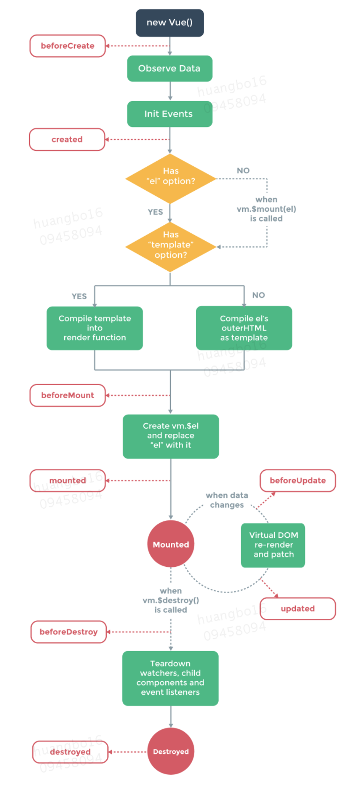

>作为一个校招后端新人，初入美团接手的第一个任务就是改造后端3个后台管理系统，作为一个只懂html/js/css没有接触过前端框架的新人来说，如何在独立的情况下解决新老项目的环境问题、配置问题，需要学习的东西一定不少，也是一个短期内比较大的挑战吧。
>我的经验是：不要无头苍蝇一样从局部的视角去寻求突破，治标不治本。从头学习也没有需要太多时间，比如这个vue找对了方法可能仅需要2-3天，远没有想象的长达几个星期之恐怖。

# **开发环境**

```shell
brew install node # 安装node
node --versoin 或 node -v # 查看版本，确认安装成功
​
brew install npm
npm --version 或 npm -v # 查看版本，确认安装成功
​
npm install -g cnpm --registry=https://registry.npm.taobao.org # 安装国内镜像cnpm，可与npm互补使用 -g --global
cnpm --version 或 cnpm -v
​
npm install -g vue # 全局安装 vue -g --global
vue --version 或 vue -V # 查看版本，确认安装成功
​
​
# 可选
npm install -g webpack # 全局安装webpack -g --global
npm install -g webpack-dev-server # 全局安装webpack-dev-server
npm config set registry http://npm.sankuai.com/registry # 切换仓库
npm config set registry http://r.npm.sankuai.com/ # 切换仓库
npm config set registry https://registry.npmjs.org/
​
# 辅助命令
npm config get prefix // 大多是/usr/local
npm view <packagename> versions --json
npm update <packagename>@xx.xx
```
！！需知
1、npm都可以替换成cnpm，cnpm为国内淘宝镜像，安装包的速度更快，本文为了书写方便只使用npm，当npm安装包的速度过慢，可使用control+c组合键停止安装，转用cnpm。

2、使用npm安装项目所需的包（不是全局的包）时一定要切换至package.json同目录

## **安装第三方包**

```shell
npm install xxx --save
npm install xxx --save-dev
# --save 会把依赖包名称添加到package.json文件的 dependencies 下，表示运行时依赖的包
# --save-dev 会把依赖包名称添加到package.json文件的 devDependencies 下，表示开发时依赖的包
```
### **npm install命令参数简写方式**

```shell
-g
--global，缩写为-g，表示安装包时，视作全局的包。安装之后的包将位于系统预设的目录之下。
​
-S
--save，缩写为-S，表示安装的包将写入package.json里面的dependencies。
​
-D
--save-dev，缩写为-D，表示将安装的包将写入packege.json里面的devDependencies。
​
-O
--save-optional缩写为-O，表示将安装的包将写入packege.json里面的optionalDependencies。
​
-E
--save-exact缩写为-E，表示安装的包的版本是精确指定的。
​
-B
--save-bundle缩写为-B，表示将安装的包将写入packege.json里面的bundleDependencies。
```
# **如何创建vue项目**

需要全局安装脚手架，其命令行工具可以快速搭建大型单页应用。旧版：vue-cli，新版：vue cli3，暂时推荐使用旧版

## **1、Vue CLI旧版本安装与使用(推荐)**

### **1）安装**

```shell
npm install --global vue-cli # 全局安装脚手架vue-cli
```
### **2）创建项目**

```shell
vue init <template-name> <project-name>
# <template-name>：模版名称，官方一共提供了五个模版，分别为webpack、webpack-simple、browserify、browserify-simple、simple；
# <project-name>：项目名称。
​
vue init webpack vue-demo
cd vue-demo
npm install # 安装所需要的包
npm run dev
```
一般使用webpack或webpack-simple两种模板。
(1) 使用webpack模板创建：

```shell
vue init webpack vuedemo01
```
执行上述代码后，等待下载完模版，需要进入一系列的配置：
* ? Project name vuedemo01 项目描述
* ? Project description A Vue.js project 项目描述
* ? Author huangbo16 作者
* ? Vue build standalone 编译
* ? Install vue-router? Yes 是否安装路由
* ? Use ESLint to lint your code? Yes 是否使用ESLint管理代码，ESLint是个代码风格管理工具，用来统一代码风格，不会影响整体的运行，为了多人协作。
* ? Pick an ESLint preset Standard 选择一个ESLint预设，编写vue项目时的代码风格（standard: js的标准风格; ）
* ? Set up unit tests Yes 是否进行单元测试？
* ? Pick a test runner jest 选择测试框架
* ? Setup e2e tests with Nightwatch? Yes 是否进行端对端测试？
* ? Should we run `npm install` for you after the project has been created? (recommended)  npm 使用npm或yarn安装包

(2) 使用webpack-simple模板创建(新手入门推荐）：

```shell
vue init webpack-simple vuedemo02
```
同样地，需要进行一些配置：
* ? Project name vuedemo02 项目名称
* ? Project description A Vue.js project 项目描述
* ? Author huangbo16 作者
* ? License MIT 许可证
* ? Use sass? Yes 是否使用sass

### **3）安装依赖包并运行项目**

创建完项目后，还需要安装vue依赖的必须包（如果运行别人的程序，从此步开始执行操作即可）

```shell
npm install # 安装package.json配置的依赖包， 执行此命令需在package.json同目录
# 执行完后，会生成node_modules目录，并将依赖包下载至此目录
​
npm run dev # 运行程序
```
程序一般会自动跳转浏览器打开web页面，如果没有，根据终端输出信息打开web页面
## **2、Vue CLI3的安装与使用(暂不推荐,简单介绍)**

### **1）安装**

```shell
npm install -g @vue/cli
```
### **2）创建项目**

```shell
vue create vue-demo npm
run serve # 运行
npm run build # 编译
```
# **vue项目结构**

1、node_modules

项目需要的各种依赖包npm install安装包的路径

2、src

* assets
* App.vue
* main.js

main.js可以修改默认启动的页面，如将App.vue修改成自己创建的vue

3、.babelrc

解码器配置文件。Babel是一个广泛使用的转码器，可以将ES6代码转为ES5代码，从而在现有环境执行。

4、index.html

5、package.json

管理项目所需要的模块，依赖包清单及版本

6、webpack.config.js

webpack配置文件，将业务中各种格式的文件打包成浏览器能够解析的文件

# **调试与部署步骤****

## **调试**

1、运行后台接口程序，不涉及后台修改不需要重新运行

2、安装完vue依赖包之后，切换至项目目录(package.json同一目录)运行项目(npm run dev)

!!!注意：这里使用的是npm run dev，如果使用npm run build可能会使修改的页面无法热更新，导致无法调试

热更新过程中无需重复执行上述命令，终端会自动检查文件变化、检查语法问题然后热更新，注意观察终端输出信息

3、直接修改前端代码，会自动热更新

错误做法：使用npm run build结合后台程序反复重启部署（如反复重启tomcat），这可能会导致前端资源文件无法热更新，且效率低下。

## **部署**

### **1、配置webpack.config.js文件中output**

```javascript
var path = require("path")
var webpack = require("webpack")
​
module.exports = {
  entry : {
    index : "./src/main.js"
  },
  output : {
    filename : "index.js",
    path : path.resolve(__dirname, "../../springbootdemo/src/main/resources/static")
  },
  devServer: {
    contentBase: path.join(__dirname, "../../springbootdemo/src/main/resources/static"),
    compress: true,
    port: 9000,
  },
  module : {
    loaders : [
    //
    ]
  },
//
}
```
### **2、切换目录到webpack.config.js文件同目录**

```shell
npm run build
```
这时会将vue等文件写入output配置的js文件中。按这里配置的会在../../springbootdemo/src/main/resources/static生成index.js文件。
使用默认配置会在根目录下生成dist文件夹及build.js文件。

### **3、在index.html文件中引用index.js**

注意：如果使用了webpack.config.js中配置了输出路径，则这里的index.html及index.js不是vue项目中的文件，而是配置的输出路径中的文件。

```xml
<!DOCTYPE html>
<html lang="en">
  <head>
    <meta charset="UTF-8">
    <title>Title</title>
  </head>
  <body>
    <div id="app"></div>
    <script src="./index.js"></script>
  </body>
</html>
```
启动tomcat或其他后台程序访问index.html即可。
需要注意的问题：

npm run dev 运行的index.html是从devServer配置的contentBase目录下的，如果没有配置该目录，则运行本地目录下的。并且最终执行的index.html中引用的js文件路径与名称要与output中配置的一一对应，否则，页面将显示为空白。npm run dev并不会产生js文件。

# **vue文件结构**

注意<template></template>需要使用<div></div>包裹

```javascript
<template>
  <div>
  </div>
</template>
<script>
import xxx from '../xxx.vue';
export default {
  data() {
  return {
  }
},
components: {
'v-xxx': xxx,
},
​
//props: ['shopinfo'],
​
computed: {
},
​
methods: {
},
};
</script>
<style lang='less' scoped>
@import '../css/shop.less';
</style>
```
## **vue绑定属性**

代码：

```javascript
<template>
<div id="app">
<h2>{{msg}}</h2>
<br>
<div v-bind:title="title">鼠标瞄上去看一下</div>
  <!-- 绑定属性 -->
  
  <br>
  
  <br>
  
  <br>
  {{html_code}}
  ​
  <!-- 绑定html -->
  <div v-html="html_code"></div>
  ​
  <!-- 绑定数据的另一种方法 -->
  <div v-text="msg">
  </div>
  ​
  <!-- v-bind:class :class的使用 -->
  <div v-bind:class="{'red':flag}">
  我是一个div
  </div>
  ​
  <br>
  <div :class="{'red':flag,'blue':!flag}">
  我是一个div222222
  </div>
  ​
  <br>
  <br>
  <!-- 循环数据 第一个数据高量 -->
  <ul>
    <li v-for="(item,key) in list" :key=key>
    {{key}}---{{item}}
    </li>
  </ul>
  <br>
  <ul>
    <li v-for="(item,key) in list" :class="{'red':key==0,'blue':key==1}" :key=key>
    {{key}}---{{item}}
    </li>
  </ul>
  <br>
  <br>
​
  <!-- v-bind:style :style的使用 -->
  <div class="box" v-bind:style="{'width':boxWdith+'px'}">
  我是另一个div
  </div>
</div>
</template>
​
<script>
export default {
  name: 'app',
  data () {
    return {
      msg: '这是一条信息',
      title:'我是一个title',
      url:'http://imgs.chnhuangbo.cn/blog/nanlidexue/psb1.jpg',
      ​
      html_code:'<h1>这是hhhhhhhh</h1>',
      list:['1111','2222','3333'],
      flag:false,
      boxWdith:500
    }
  }
}
</script>
​
<style>
.imginfo{
  width:20%;
  /* height:10%; */
}
#img01{
  width:15%;
}
.red{
  color: red;
}
.blue{
  color:blue;
}
.box{
  height: 100px;
  width: 100px;
  background: red;
}
</style>
```
注意：如果报Can't resolve 'sass-loader'的错误，这是因为没有安装sass，将<style lang="scss">***<style>改成<style>***</style>格式即可。
## **vue绑定事件**

```javascript
<template>
  <div id="app">
    <h2>{{msg}}</h2>
    <input type="text" v-model='msg' />
    <button v-on:click="getMsg()">获取表单里面的数据get</button>
    <button @click="setMsg()">设置表单的数据set</button>
    ​
    <br>
    请输入用户信息<input type="text" ref="userinfo" />
    <br>
    <div ref="box">我是一个box</div>
    ​
    <br>
    <button v-on:click="getInputValue()">获取第二个表单里面的数据</button>
  </div>
</template>
<script>
  /*
  双向数据绑定 MVVM vue就是一个MVVM的框架。
  M model
  V view
  MVVM： model改变会影响视图view，view视图改变反过来影响model
  双向数据绑定必须在表单里面使用。
  */
  export default {
  data () { /*业务逻辑里面定义的数据*/
    return {
      msg: 'mssssgggg'
    }
  },
  methods:{ /*放方法的地方*/
    getMsg(){
      // alert('vue方法执行了');
      //方法里面获取data里面的数据
      alert(this.msg);
    },
    setMsg(){
      this.msg="我是改变后的数据";   ​
    },
    getInputValue(){
      //获取ref定义的dom节点
      console.log(this.$refs.userinfo);
      this.$refs.box.style.background='red';
      alert(this.$refs.userinfo.value);
    }
  }
}
</script>
<style>
</style>
```
## **v-bind vs v-model**

v-bind是数据绑定，没有双向绑定效果，但不一定在表单元素上使用，任何有效元素上都可以使用；

v-model主要是用在表单元素中，实现了*双向绑定。*基本上只会用在input, textarea, select这些表单元素上。

v-model其实是v-bind和v-on的语法糖。当v-bind和v-model同时用在一个元素上时，它们各自的作用没变，但v-model优先级更高，而且需区分这个元素是单个的还是一组出现的。

## **计算属性与侦听器**

* computed中的计算属性（类似方法）会随着其中的data数据变化而返回不同的值，每个计算属性都包含一个getter和一个setter。一个可使用默认的getter方法来读取一个计算属性
* watch用来监视数据的变化，然后调用定义的方法

```javascript
export default {
  data () {
    return {
      num: 1,
    }
  }
  watch: {
  '$route': 'reload'
  },
  computed: {
    doubleNum: function(){
    return this.num*2;
    }
  },
  methods: {
    reload() {
    }
  }
}
```
# **vue组件**

## **1、组件的调用**

Parent.vue

```javascript
<template>
  <div>
    <h2>父组件</h2>
    <v-child></v-child>
  </div>
</template>
<script>
//引入子组件
import Child from './Child.vue';
export default {
  data(){
    return{
      msg:'我是一个新闻组件'
    }
  },
  components:{
    'v-child':Child
  }
};
</script>
<style>
</style>
```
Child.vue
```javascript
<template>
  <div>
    <h2>Child组件</h2>
  </div>
</template>
<script>
  export default {
    data(){
      return{
        msg:'这是一个Child组件'
      }
    }
  };
</script>
<style lang="scss">
</style>
```
## **2、父组件给子组件传值**

a、父组件调用子组件时，绑定动态属性

```javascript
<v-child :info="info" :parentmsg='msg' :fun1="fun1" :home="this"></v-child>
```
b、子组件通过props接收父组件传来的数据和方法
c、子组件直接使用父组件传来的数据和方法

代码：

Parent.vue

```javascript
<template>
<!-- 所有的内容要被根节点包含起来 -->
<div id="home">
<v-child :info="info" :parentmsg='msg' :fun1="fun1" :parent="this"></v-child>
<br>
Parent
</div>
</template>
<script>
import Child from './Child.vue';
export default{
data(){
return {
msg:'parent msg',
info:'parent info'
}
},
components:{
'v-child':Child
},
methods:{
fun1(param1){
alert('Parent'+param1);
}
}
}
</script>
<style lang="scss" scoped>
</style>
```
Child.vue
```javascript
<template>
<div>
<h2>Child组件-----{{info}}----{{parentmsg}}</h2>
<button @click="fun1('123')">执行父组件的方法</button>
<br>
<button @click="getParent()">获取父组件的数据和方法</button>
</div>
</template>
<script>
export default{
  props:['info','parentmsg','fun1','parent'],
  data(){
    return{
      msg:'子组件的msg'
    }
  },
methods:{
  getParent(){
    // alert(this.info);
    // alert(this.parent.info);
      this.parent.fun1(345);
    }
  },
}
</script>
```
## **3、父组件主动获取子组件的数据和方法**

a、调用子组件定义ref

```javascript
<v-child ref="child"></v-child>
```
b、在父组件中通过refs使用，具体如下：
```javascript
this.$refs.child.fun1();
this.$refs.child.msg;
```
## **4、子组件主动获取父组件的数据和方法**

无需父组件给子组件传入数据与方法

```javascript
this.$parent.msg;
this.$parent.fun1()
//！！注意这里的$parent是固定写法，不是Parent.vue中的文件名
```

## **5、非父子组件传值(广播)**

（需结合路由演示）

a、新建js文件，引入vue并实例化vue，然后暴露这个实例

```javascript
import Vue from 'vue';
var VueEvent = new Vue()
export default VueEvent;
```
b、在需要广播的地方引入上述定义的实例
```javascript
import VueEvent from '../model/VueEvent.js';
```
c、在发送数据的地方通过$emit发送广播
```javascript
VueEvent.$emit("名称", "数据");
```
d、在接收数据的地方通过$on接收广播
```javascript
VueEvent.$on("名称", function(data){
})
```
# **vue生命周期函数**

vue生命周期图



示例代码

```javascript
<template>
<div>
</div>
</template>
<script>
/*
生命周期函数/生命周期钩子：
组件挂载、以及组件更新、组件销毁、的时候触发的一系列的方法 即生命周期函数
*/
export default{
  data(){
    return{
      msg:'msg'
    }
  },
  methods:{
  setMsg(){
    this.msg="我是改变后的数据"
  }
  },
  ​
  beforeCreate(){
    console.log('实例刚刚被创建1');
  },
  created(){
    console.log('实例已经创建完成2');
  },
  beforeMount(){
    console.log('模板编译之前3');
  },
  mounted(){ /*请求数据，操作dom , 放在这个里面 mounted*/
    console.log('模板编译完成4');
  },
  beforeUpdate(){
    console.log('数据更新之前');
  },
  updated(){
    console.log('数据更新完毕');
  },
  beforeDestroy(){ /*页面销毁的时候要保存一些数据，就可以监听这个销毁的生命周期函数*/
    console.log('实例销毁之前');
  },
  destroyed(){
    console.log('实例销毁完成');
  }
}
</script>
```
！！注意：在mounted函数中直接赋值给data return中的变量无效，因为此时mounted无法获取data中的值。例外：在mounted中发起请求数据可以给data中的变量赋值。
# **本地存储**

## **1、创建model/storage.js**

```javascript
//封装操作localstorage本地存储的方法 模块化的文件
// nodejs 基础
var storage={
set(key,value){
localStorage.setItem(key, JSON.stringify(value));
},
get(key){
return JSON.parse(localStorage.getItem(key));
},remove(key){
localStorage.removeItem(key);
}
}
export default storage;
```
## **2、vue中引用storage**

```javascript
<template>
  <div>
    <input type="text" v-model='msg' />
    <button @click="add">添加</button>
    <button @click="remove">清空数据</button>
    <br>
    <ul>
    <li v-for="item in list" :key=item>{{item}}</li>
    </ul>
  </div>
</template>
​
<script>
import storage from '../model/storage.js';
// console.log(storage);
export default {
  data () {
    return {
      msg: "",
      list: ["123", "456"]
    }
  },
  mounted() {
    let list1 = this.getList("list");
    if(list1 != null){
      this.list = list1;
    }
    console.log("mounted");
    console.log("list");
  },
  methods:{
    add() {
      this.list.push(this.msg);
      this.msg = "";
      this.saveList();
    },
    saveList(){
      storage.set("list", this.list);
    },
    getList(key){
      console.log("getList");
      console.log(storage.get(key));
      return storage.get(key);
    },
    remove() {
      this.list = [];
      this.saveList();
    }
  }
}
</script>
```
在输入框中输入数据，然后点击添加按钮，会实时刷新数据，重新刷新页面（cmd+r）会发现添加的数据依然在列表中。
# **路由及跳转**

## **1、创建组件Child.vue**

## **2、安装vue-router**

```shell
npm install vue-router --save
```
## **3、在main.js中引入路由和组件**

```javascript
import VueRouter from 'vue-router'
import Child from './Child.vue';
Vue.use(VueRouter);
```
## **4、在main.js中配置路由**

```javascript
const routes = [
{ path: '/child', component: Child },
{ path: '*', redirect: '/child' } /*默认跳转路由*/
]
```
**5、实例化VueRouter**
```javascript
const router = new VueRouter({
routes // （简写形式）相当于 routes: routes
})
```
!!!!注意：这里routes: routes中第一个routes是固定写法，第二个routes为第3步定义的变量，只有在第二个变量名称为routes的时候才能够使用简写形式。vue的开发过程中还有很多类似的简写形式，需要引起注意。
## **6、挂载路由**

```javascript
new Vue({
  el: '#app',
  router,// （简写形式）相当于 router: router
  render: h => h(App)
})
```
!!!注意：这里的router简写形式同理！
**7、在App.vue中定义路由**

```javascript
<router-link to="/child">Child组件</router-link>
<router-link to="/xxx">xxx</router-link>
​
<router-view></router-view>
```
# **动态路由**

## **1、配置动态路由**

```javascript
const routes = [
{ path: '/child', component: Child },
{ path: '/manage/:mid', component: Manage },
{ path: '*', redirect: '/child' } /*默认跳转路由*/
]
```
## **2、在跳转后的vue页面中获取值**

```javascript
this.$route.params;
this.$route.params.mid;
```
# **vue-resource请求数据**

使用方法：

## **1、安装**

```shell
npm install vue-resource --save
```
## **2、在main.js导入并use**

```javascript
import VueResource from 'vue-resource'
Vue.use(VueResource);
```
## **3、在组件里直接使用(全局)**

```javascript
this.$http.get(api).then(function(res){
})
//es6的Lambda写法
this.$http.get (api, {}, {emulateJSON: true}).then(res => {
  console.log(res.body);
}
//,(res) => { // 处理失败的结果}
);
this.$http.post(url,{
  shopId,
  "method": "split"
  },{emulateJSON: false}).then(res => {
  cb();
});
```
# **请求跨域问题**

## **1、前端配置**

尝试了官网以及第三方网站很多方法，都以失败告终，原因不详。这里采用设置全局拦截http请求的方法。在main.js中添加如下代码即可：

```javascript
// const base_url = ""; //发布环境
const base_url="http://localhost:8080"; //开发环境，前后端分离调试
​
//设置全局拦截器
Vue.http.interceptors.push(function(request, next) {
  request.credentials = true;
  ​
  // Re-build url
  request.url=base_url+request.getUrl();
  console.log("Request URl:"+request.getUrl());
  ​
  // continue to next interceptorg
  next((response) => {
    if(response.status == 401) {
    window.location = "/";
    }
    else if(!response.ok){
    this.$notify.error({
    title: "错误",
    message: "后台打了个盹儿，请稍后再试！",
    duration: 2000,
    offset: 0
    });
  }
  else if(response.body.type=='ERROR'){
    this.$notify.error({
      title: "错误",
      message: response.body.message,
      duration: 2000,
      offset: 0
      });
    }
    return response;
  });
});
```
## **2、后端配置**

不同版本spring/springboot的默认配置可能支持跨域，如果Console中报错：

```shell
Access to XMLHttpRequest at 'http://localhost:8080/userInfo' from origin 
'http://localhost:9000' has been blocked by CORS policy: 
The value of the 'Access-Control-Allow-Origin' header 
in the response must not be the wildcard '*' when the request's 
credentials mode is 'include'. The credentials mode of requests 
initiated by the XMLHttpRequest is controlled by the withCredentials attribute. 
```
此时Network的Response Headers中Access-Control-xxx只有 Access-Control-Allow-Origin: *  ，则需要后端配置。
参考链接为：

[SpringBoot 1.X、2.X 解决跨域问题](https://www.jianshu.com/p/cbc5470838da)  

[Spring boot 和Vue开发中CORS跨域问题](https://segmentfault.com/a/1190000016258859)

```java
import org.springframework.context.annotation.Bean;
import org.springframework.context.annotation.Configuration;
import org.springframework.web.cors.CorsConfiguration;
import org.springframework.web.cors.UrlBasedCorsConfigurationSource;
import org.springframework.web.filter.CorsFilter;
​
@Configuration
public class CustomCORSConfiguration {
  private CorsConfiguration buildConfig() {
    CorsConfiguration corsConfiguration = new CorsConfiguration();
    // corsConfiguration.addAllowedOrigin("http://localhost:9000");
    corsConfiguration.addAllowedOrigin("*");
    corsConfiguration.addAllowedHeader("*");
    corsConfiguration.addAllowedMethod("*");
    corsConfiguration.setAllowCredentials(true);
    return corsConfiguration;
  }
  @Bean
  public CorsFilter corsFilter() {
    UrlBasedCorsConfigurationSource source = new UrlBasedCorsConfigurationSource();
    source.registerCorsConfiguration("/**", buildConfig());
    return new CorsFilter(source);
  }
}
```
此时，Console不会报错，并且Network的Response Headers中Access-Control-xxx有**Access-Control-Allow-Credentials:**true和**Access-Control-Allow-Origin:**[http://localhost:9000](http://localhost:9000)。
# **axios请求数据**

## **1、安装**

```shell
npm install axios --save
```
## **2、局部引用局部使用**

```javascript
<script>
  import Axios from 'axios';
  export default{
    data(){
      return {
        list:[]
        }
    },
    methods:{
      getData(){
        var api='https://chnhuangbo.cn/xxx';
        Axios.get(api).then((response)=>{  ​
        }).catch((error)=>{
          console.log(error);
        })
      }
    },
    mounted(){ /*生命周期函数*/
      this.getData();
    }
  }
</script>
```
# **vuex介绍**

简介：

Vuex解决了组件之间共享数据的问题和组件使用数据的持久化问题，能够集中式管理状态存储。

使用步骤：

## **1、安装vuex**

```javascript
npm install vuex --save
```
## **2、创建一个vuex/xxxstore.js**

```javascript
import Vue from 'vue'
import Vuex from 'vuex'
Vue.use(Vuex);
​
var state ={
  userInfo: null, //{}
  num: 0,
  keyword: null,
}
​
// 存放方法，用于改变state里的变量
var mutations={
  incNum(){
    ++state.num;
  },
  updateUserInfo(state, userInfo1){
    state.userInfo = userInfo1;
  }
}
​
//类似计算属性， 改变state中数据时会触发getters中的方法
var getters = {
  doubleNum: function () {
    return state.num*2;
  }
}
​
// 类似于mutation，不同在于：
// Action提交的是mutation，而不是直接变更状态
// 用法：
// funname(context){
// context.commit("funnameinThis");
// }
​
// 经测试，也可以直接变更状态
var actions = {
  incMutationsNum(context) {
    //执行mutations中的方法
    context.commit('incNum');
  },
  getListById({state}, id){
    state.keyword;
  }
}
//实例化Vuex.strore 注意暴露
const xxxstore = new Vuex.Store({
  state,
  mutations,
  getters,
  actions
})
​
export default xxxstore;
```
## **3、组件(.vue文件)使用vuex**

```javascript
import xxxstore from '../vuex/store.js';
```
## **4、组件(.vue)注册vuex**

```javascript
export default{
  data(){
    return {
    }
  },
  store: xxxstore,//注意这里没有使用简写方式，只有同名这里才能写成“store，”
  methods:{
    //获取store中state数据
    this.$store.state.num;
    //调用mutations中的方法
    this.$store.commit('incNum');
    //调用Actions中的方法
    this.$store.dispatch('incMutationsNum');
    }
  }
}
```
## **5、组件(.vue)使用map直接引用store中的数据与方法**

```javascript
import { mapState, mapGetters, mapMutations, mapActions } from 'vuex';
export default {
  store: shopstore,
  components:{
  },
​
  data (){
    return {
    }
  },
  couputed: {
    ...mapGetters(['doubleNum']),
    ...mapState(['shopinfo', 'keyword', 'num']),
  },
  methods:{
    ...mapMutations(['updateUserInfo']),
    ...mapActions(['incMutationsNum']),
    fun1() {
    //直接使用数据和方法
      this.incMutationsNum();
    }
  }
}
```
# **vuex多模块**

## 1、创建模块

users.js、shops.js、dishs.js，

下面是users.js的代码，其它大致相同

```javascript
export default{
  namespaced: true,
  state: {
    userList: [], //{}
    num: 1,
    keyword: null,
  },
  mutations: {
    updateUserList(state, userList1){
      state.userList = userList1;
    }
  },
  getters: {
    userCount: function () {
      return state.userList.length;
    }
  },
  actions: {
    incMutationsNum(context) {
      //执行mutations中的方法
        context.commit('incNum');
      },
    getUserList({state}, ob){//ob为vue中的this对象
      console.log("getUserList");
      let api = '/userList';
      ob.$http.get(api, {}, {emulateJSON: true}).then(res => {
          console.log("getUserList");
          console.log(res.body);
          state.userList = res.body;
        }
      );
    }
  }
}
```
## **2、创建store（文件名任意，这里为store.js），引用上述模板**

```javascript
import Vue from 'vue'
import Vuex from 'vuex'
import users from './modules/users.js'
import shops from './modules/shops.js'
import dishs from './modules/dishs.js'
​
Vue.use(Vuex);
​
var modules = {
  users,
  shops,
  dishs
}
var state ={
}
​
// 存放方法，用于改变state里的变量
var mutations={
}
​
//类似计算属性， 改变state中数据时会触发getters中的方法
var getters = {
}
​
// 类似于mutation，不同在于：
// Action提交的是mutation，而不是直接变更状态
// 用法：
// funname(context){
// context.commit("funnameinThis");
// }
​
// 经测试，也可以直接变更状态
var actions = {
​
}
//实例化Vuex.strore 注意暴露
const store = new Vuex.Store({
  modules,
  state,
  mutations,
  getters,
  actions
})
​
export default store;
```
## **3、在vue页面引用store**

```javascript
<template>
<div>
  <h1>这是首页</h1>
  <button @click="getUsers">获取用户列表</button>
  <br>
  <button @click="getShops">获取店铺列表</button>
  <br>
  <button @click="getDishs">获取菜品列表</button>
  <br>
  <div style="width:30%; float:left" >
    <div v-for="item in userList" :key="item.id">
      <span>姓名:{{item.name}}</span><br>
      <span>id:{{item.id}}</span><br>
      <span>年龄:{{item.age}}</span><br>
    </div>
  </div>
  <div style="width:30%; float:left" >
    <div v-for="item in shopList" :key="item.id">
      <span>店名:{{item.name}}</span><br>
      <span>id:{{item.id}}</span><br>
    </div>
  </div>
  <div style="width:30%; float:left" >
    <div v-for="item in dishs.dishList" :key="item.id">
      <span>菜名:{{item.name}}</span><br>
      <span>id:{{item.id}}</span><br>
    </div>
  </div>
</div>
</template>
<script>
import store from '../vuex/store.js'
import { mapState, mapGetters, mapMutations, mapActions } from 'vuex';
​
export default {
data(){
  return {
    user: null,
  }
},
store: store,
computed:{
    // ...mapGetters('users', ['doubleNum']),
    ...mapState('users', ['userList', 'keyword', 'num']),
    ...mapState('shops', ['shopList']),
    ...mapState(['dishs']), //注意，这里也可以直接使用模板，然后通过dishs.dishList直接使用其state中的值。
  },
methods:{
  ...mapMutations('users', ['updateUserList']),
  ...mapActions('users', ['getUserList']),
  ...mapActions('shops', ['getShopList']),
  ...mapActions('dishs', ['getDishList']),
  ​
  getUsers() {
    this.getUserList(this);
  },
​
  getShops() {
    this.getShopList(this);
  },
​
  getDishs() {
    this.getDishList(this);
    }
  }
}
</script>
```
如果在main.js中引用store，则全局使用，无需在每个vue页面中引用。
```javascript
import store from "./vuex/store.js"
​
new Vue({
  el: '#app',
  render: h => h(App),
  router,
  store:store
})
```
# **UI框架Element UI**

[官网快速上手链接](https://element.eleme.cn/#/zh-CN/component/quickstart)

Elemenet UI简介：

这是饿了么公司开发的基于vue框架的UI组件，具体细节使用可参考官网

## **1、安装**

```shell
npm i element-ui --save
```
## **2、在项目中main.js导入**

```javascript
import ElementUI from 'element-ui';
import 'element-ui/lib/theme-chalk/index.css';
Vue.use(ElementUI);
```
## **3、在webpack.config.js中配置file_loader**

```javascript
{
  test: /\.(eot|svg|ttf|woff|woff2)(\?\S*)?$/,
  loader: 'file-loader'
}
```
## **4、按照官网使用所需组件**

# **时间处理插件momentJS**

这里主要介绍使用momentJS实现中文的时间计算，比如计算时间差显示“刚刚”、“几小时前”、“几天前”或“几年前”等等。其它功能暂不介绍。

使用步骤：

## **1、安装**

```shell
npm install moment --save
```
## **2、在main.js引入moment，**

**并设置语言为中文**

```javascript
import moment from 'moment'
moment.locale('zh-cn'); 
```
**3、定义一个全局过滤函数**
```javascript
//定义一个全局过滤器实现日期格式化
Vue.filter('datefmt',function (input,fmtstring = 'YYYY-MM-DD HH:mm:ss') {
// 使用momentjs这个日期格式化类库实现日期的格式化功能
input = moment(input).format("X")
return moment(input, "X").fromNow();
  // return moment(input).format(fmtstring);
});
​
//与router同层次
const router = new VueRouter({xxxx});
```
## **4、在vue页面中使用**

```javascript
<ul class="list-inline">
  <li>创建：{{ item.addTime | datefmt() }} </li>
  <li>修改：{{ item.modifyTime | datefmt() }}</li>
</ul>
```
