## 可扩展架构的基本思想和模式

架构可扩展模式内容包括分层架构、SOA 架构、微服务和微内核等。

软件系统的这种天生和内在的可扩展的特性，既是魅力所在，又是难点所在。魅力体现在我们可以通过修改和扩展，不断地让软件系统具备更多的功能和特性，满足新的需求或者顺应技术发展的趋势。而难点体现在如何以最小的代价去扩展系统，因为很多情况下牵一发动全身，扩展时可能出现到处都要改，到处都要推倒重来的情况。这样做的风险不言而喻：改动的地方越多，投入也越大，出错的可能性也越大。因此，如何避免扩展时改动范围太大，是软件架构可扩展性设计的主要思考点。

### 可扩展的基本思想

可扩展性架构的设计方法很多，但万变不离其宗，所有的可扩展性架构设计，背后的基本思想都可以总结为一个字：**拆**！

拆，就是将原本大一统的系统拆分成多个规模小的部分，扩展时只修改其中一部分即可，无须整个系统到处都改，通过这种方式来减少改动范围，降低改动风险。

按照不同的思路来拆分软件系统，就会得到不同的架构。常见的拆分思路有如下三种。

1）面向流程拆分：将整个业务流程拆分为几个阶段，每个阶段作为一部分。

2）面向服务拆分：将系统提供的服务拆分，每个服务作为一部分。

3）面向功能拆分：将系统提供的功能拆分，每个功能作为一部分。

理解这三种思路的关键就在于如何理解“流程”“服务”“功能”三者的联系和区别。从范围上来看，从大到小依次为：流程 > 服务 > 功能，单纯从概念解释可能难以理解，但实际上看几个案例就很清楚了。

以 TCP/IP 协议栈为例，来说明“流程”“服务”“功能”的区别和联系。TCP/IP 协议栈和模型图如下图所示。

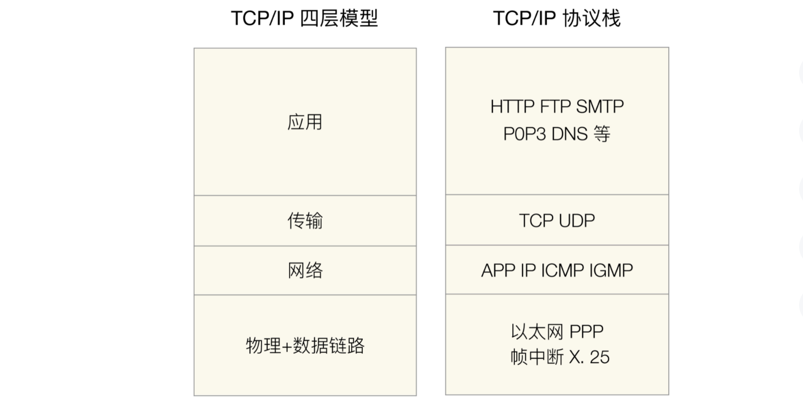

1）流程

对应 TCP/IP 四层模型，因为 TCP/IP 网络通信流程是：应用层 → 传输层 → 网络层 → 物理 + 数据链路层，不管最上层的应用层是什么，这个流程都不会变。

2）服务

对应应用层的 HTTP、FTP、SMTP 等服务，HTTP 提供 Web 服务，FTP 提供文件服务，SMTP 提供邮件服务，以此类推。

3）功能

每个服务都会提供相应的功能。例如，HTTP 服务提供 GET、POST 功能，FTP 提供上传下载功能，SMTP 提供邮件发送和收取功能。

再以一个简单的学生信息管理系统为例（几乎每个技术人员读书时都做过这样一个系统），拆分方式是：

1、面向流程拆分

展示层 → 业务层 → 数据层 → 存储层，各层含义是：

1）展示层：负责用户页面设计，不同业务有不同的页面。例如，登录页面、注册页面、信息管理页面、安全设置页面等。

2）业务层：负责具体业务逻辑的处理。例如，登录、注册、信息管理、修改密码等业务。

3）数据层：负责完成数据访问。例如，增删改查数据库中的数据、记录事件到日志文件等。

4）存储层：负责数据的存储。例如，关系型数据库 MySQL、缓存系统 Memcache 等。

最终的架构如下：

2、面向服务拆分

将系统拆分为注册、登录、信息管理、安全设置等服务，最终架构示意图如下：

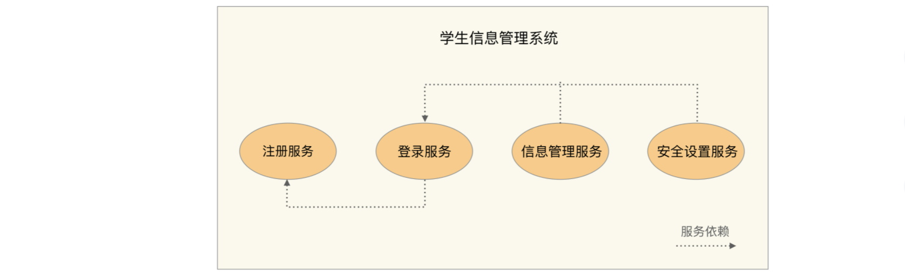

3、面向功能拆分

每个服务都可以拆分为更多细粒度的功能，例如：

1）注册服务：提供多种方式进行注册，包括手机号注册、身份证注册、学生邮箱注册三个功能。

2）登录服务：包括手机号登录、身份证登录、邮箱登录三个功能。

3）信息管理服务：包括基本信息管理、课程信息管理、成绩信息管理等功能。

4）安全设置服务：包括修改密码、安全手机、找回密码等功能。

最终架构图如下：

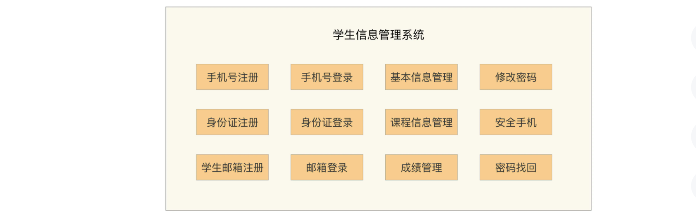

通过学生信息管理系统的案例可以发现，不同的拆分方式，架构图差异很大。但好像无论哪种方式，最终都是可以实现的。既然如此，何必费尽心机去选择呢，随便挑选一个不就可以了？当然不能随便挑，否则架构设计就没有意义。原因在于：**不同的拆分方式，本质上决定了系统的扩展方式**。

### 可扩展方式

在一个理想的环境，团队都是高手，每个程序员都很厉害，对业务都很熟悉，新来的同事很快就知晓所有的细节……那确实不拆分也没有问题。但现实却是：团队有菜鸟程序员，到底是改 A 处实现功能还是改 B 处实现功能，完全取决于他觉得哪里容易改；有的程序员比较粗心；有的程序员某天精神状态不太好；新来的同事不知道历史上某行代码为何那么“恶心”，而轻易地将其改漂亮了一些……所有的这些问题都可能出现，这时候就会发现，合理的拆分，能够强制保证即使程序员出错，出错的范围也不会太广，影响也不会太大。

下面是不同拆分方式应对扩展时的优势。

#### 面向流程拆分

扩展时大部分情况只需要修改某一层，少部分情况可能修改关联的两层，不会出现所有层都同时要修改。例如学生信息管理系统，如果将存储层从 MySQL 扩展为同时支持 MySQL 和 Oracle，那么只需要扩展存储层和数据层即可，展示层和业务层无须变动。

#### 面向服务拆分

对某个服务扩展，或者要增加新的服务时，只需要扩展相关服务即可，无须修改所有的服务。同样以学生管理系统为例，如果需要在注册服务中增加一种“学号注册”功能，则只需要修改“注册服务”和“登录服务”即可，“信息管理服务”和“安全设置”服务无须修改。

#### 面向功能拆分

对某个功能扩展，或者要增加新的功能时，只需要扩展相关功能即可，无须修改所有的服务。同样以学生管理系统为例，如果增加“学号注册”功能，则只需要在系统中增加一个新的功能模块，同时修改“登录功能”模块即可，其他功能都不受影响。

不同的拆分方式，将得到不同的系统架构，典型的**可扩展系统架构**有：

1）面向流程拆分：**分层架构**。

2）面向服务拆分：**SOA**、**微服务**。

3）面向功能拆分：**微内核架构**。

当然，这几个系统架构并**不是非此即彼**的，而是可以在系统架构设计中进行组合使用的。以学生管理系统为例，最终可以这样设计架构：

1）整体系统采用面向服务拆分中的“微服务”架构，拆分为“注册服务”“登录服务”“信息管理服务”“安全服务”，每个服务是一个独立运行的子系统。

2）其中的“注册服务”子系统本身又是采用面向流程拆分的分层架构。

3）“登录服务”子系统采用的是面向功能拆分的“微内核”架构。

## 传统的可扩展架构模式：分层架构和SOA

相比于高性能、高可用架构模式在最近几十年的迅猛发展来说，可扩展架构模式的发展可以说是步履蹒跚，最近几年火热的微服务模式算是可扩展模式发展历史中为数不多的亮点，但这也导致了现在谈可扩展的时候必谈微服务，甚至微服务架构都成了架构设计的银弹，高性能也用微服务、高可用也用微服务，很多时候这样的架构设计看起来高大上，实际上是大炮打蚊子，违背了架构设计的“合适原则”和“简单原则”。

### 分层架构

分层架构是很常见的架构模式，它也叫 N 层架构，通常情况下，N 至少是 2 层。例如，C/S 架构、B/S 架构。常见的是 3 层架构（例如，MVC、MVP 架构）、4 层架构，5 层架构的比较少见，一般是比较复杂的系统才会达到或者超过 5 层，比如操作系统内核架构。

按照分层架构进行设计时，根据不同的划分维度和对象，可以得到多种不同的分层架构。

#### C/S 架构、B/S 架构

划分的对象是整个业务系统，划分的维度是用户交互，即将和用户交互的部分独立为一层，支撑用户交互的后台作为另外一层。

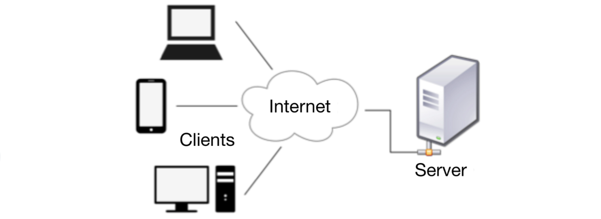

#### MVC 架构、MVP 架构

划分的对象是单个业务子系统，划分的维度是职责，将不同的职责划分到独立层，但各层的依赖关系比较灵活。例如，MVC 架构中各层之间是两两交互的：

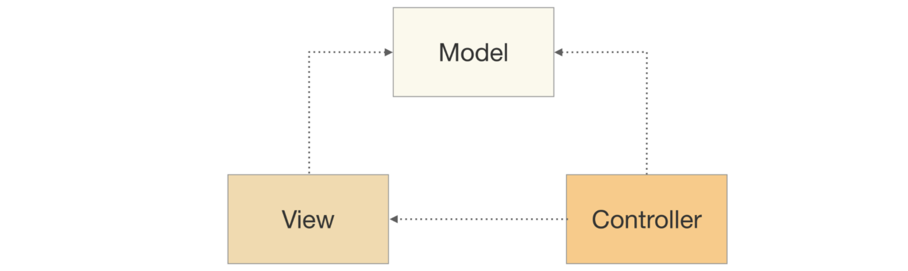

#### 逻辑分层架构

划分的对象可以是单个业务子系统，也可以是整个业务系统，划分的维度也是职责。虽然都是基于职责划分，但逻辑分层架构和 MVC 架构、MVP 架构的不同点在于，逻辑分层架构中的层是自顶向下依赖的。典型的有操作系统内核架构、TCP/IP 架构。例如，下面是 Android 操作系统架构图。

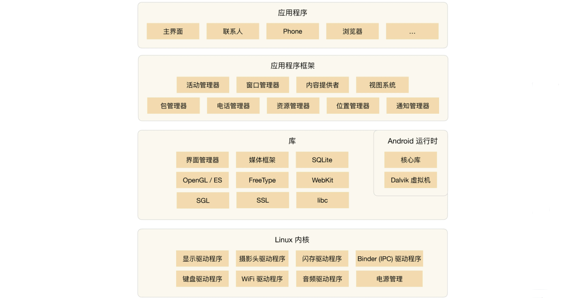

典型的 J2EE 系统架构也是逻辑分层架构，架构图如下：

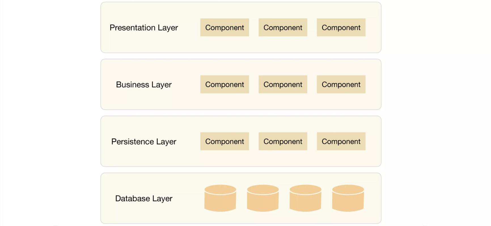

针对整个业务系统进行逻辑分层的架构图如下：

无论采取何种分层维度，分层架构设计最核心的一点就是**需要保证各层之间的差异足够清晰，边界足够明显，让人看到架构图后就能看懂整个架构**，这也是分层不能分太多层的原因。否则如果两个层的差异不明显，就会出现程序员小明认为某个功能应该放在 A 层，而程序员老王却认为同样的功能应该放在 B 层，这样会导致分层混乱。如果这样的架构进入实际开发落地，则 A 层和 B 层就会乱成一锅粥，也就失去了分层的意义。

分层架构之所以能够较好地支撑系统扩展，本质在于**隔离关注点**（separation of concerns），即每个层中的组件只会处理本层的逻辑。比如说，展示层只需要处理展示逻辑，业务层中只需要处理业务逻辑，这样我们在扩展某层时，其他层是不受影响的，通过这种方式可以支撑系统在某层上快速扩展。例如，Linux 内核如果要增加一个新的文件系统，则只需要修改文件存储层即可，其他内核层无须变动。

当然，并不是简单地分层就一定能够实现隔离关注点从而支撑快速扩展，分层时要保证层与层之间的依赖是稳定的，才能真正支撑快速扩展。例如，Linux 内核为了支撑不同的文件系统格式，抽象了 VFS 文件系统接口，架构图如下：

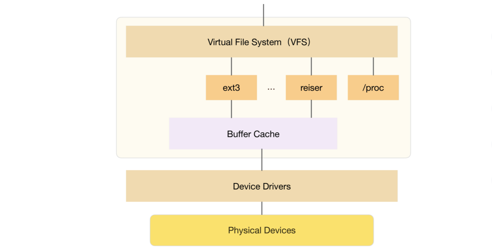

如果没有 VFS，只是简单地将 ext2、ext3、reiser 等文件系统划为“文件系统层”，那么这个分层是达不到支撑可扩展的目的的。因为增加一个新的文件系统后，所有基于文件系统的功能都要适配新的文件系统接口；而有了 VFS 后，只需要 VFS 适配新的文件系统接口，其他基于文件系统的功能是依赖 VFS 的，不会受到影响。

**对于操作系统这类复杂的系统，接口本身也可以成为独立的一层**。例如，把 VFS 独立为一层是完全可以的。而对于一个简单的业务系统，接口可能就是 Java 语言上的几个 interface 定义，这种情况下如果独立为一层，看起来可能就比较重了。例如，经典的 J2EE 分层架构中，Presentation Layer 和 Business Layer 之间如果硬要拆分一个独立的接口层，则显得有点多余了。

分层结构的另外一个特点就是层层传递，也就是说一旦分层确定，整个业务流程是按照层进行依次传递的，不能在层之间进行跳跃。最简单的 C/S 结构，用户必须先使用 C 层，然后 C 层再传递到 S 层，用户是不能直接访问 S 层的。传统的 J2EE 4 层架构，收到请求后，必须按照下面的方式传递请求：

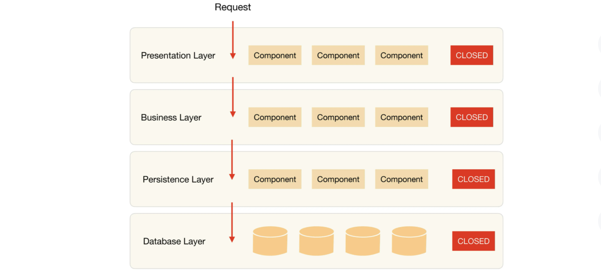

分层结构的这种约束，好处在于强制将分层依赖限定为两两依赖，降低了整体系统复杂度。例如，Business Layer 被 Presentation Layer 依赖，自己只依赖 Persistence Layer。但分层结构的代价就是冗余，也就是说，不管这个业务有多么简单，每层都必须要参与处理，甚至可能每层都写了一个简单的包装函数。以用户管理系统最简单的一个功能“查看头像”为例。查看头像功能的实现很简单，只是显示一张图片而已，但按照分层分册架构来实现，每层都要写一个简单的函数。

不建议自由选择是否绕过分层的约束，分层架构的优势就体现在通过分层强制约束两两依赖，一旦自由选择绕过分层，时间一长，架构就会变得混乱。除此以外，虽然分层架构的实现在某些场景下看起来有些啰嗦和冗余，但复杂度却很低。

分层架构另外一个典型的缺点就是性能，因为每一次业务请求都需要穿越所有的架构分层，有一些事情是多余的，多少都会有一些性能的浪费。当然，这里所谓的性能缺点只是理论上的分析，实际上分层带来的性能损失，如果放到 20 世纪 80 年代，可能很明显；但到了现在，硬件和网络的性能有了质的飞越，其实分层模式理论上的这点性能损失，在实际应用中，绝大部分场景下都可以忽略不计。

### SOA

SOA 的全称是 Service Oriented Architecture，中文翻译为“面向服务的架构”，诞生于上世纪 90 年代，1996 年 Gartner 的两位分析师 Roy W. Schulte 和 Yefim V. Natis 发表了第一个 SOA 的报告。

2005 年，Gartner 预言：到了 2008 年，SOA 将成为 80% 的开发项目的基础（[https://www.safaribooksonline.com/library/view/soa-in-practice/9780596529550/ch01s04.html](https://www.safaribooksonline.com/library/view/soa-in-practice/9780596529550/ch01s04.html)）。历史证明这个预言并不十分靠谱，SOA 虽然在很多企业成功推广，但没有达到占有绝对优势的地步。SOA 更多是在传统企业（例如，制造业、金融业等）落地和推广，在互联网行业并没有大规模地实践和推广。互联网行业推行 SOA 最早的应该是亚马逊，得益于杰弗·贝索斯的远见卓识，亚马逊内部的系统都以服务的方式构造，间接地促使了后来的亚马逊云计算技术的出现。

SOA 出现 的背景是企业内部的 IT 系统重复建设且效率低下，主要体现在：

1）企业各部门有独立的 IT 系统，比如人力资源系统、财务系统、销售系统，这些系统可能都涉及人员管理，各 IT 系统都需要重复开发人员管理的功能。例如，某个员工离职后，需要分别到上述三个系统中删除员工的权限。

2）各个独立的 IT 系统可能采购于不同的供应商，实现技术不同，企业自己也不太可能基于这些系统进行重构。

3）随着业务的发展，复杂度越来越高，更多的流程和业务需要多个 IT 系统合作完成。由于各个独立的 IT 系统没有标准的实现方式（例如，人力资源系统用 Java 开发，对外提供 RPC；而财务系统用 C# 开发，对外提供 SOAP 协议），每次开发新的流程和业务，都需要协调大量的 IT 系统，同时定制开发，效率很低。

为了应对传统 IT 系统存在的问题，SOA 提出了 3 个关键概念。

1）服务

所有业务功能都是一项服务，服务就意味着要对外提供开放的能力，当其他系统需要使用这项功能时，无须定制化开发。

服务可大可小，可简单也可复杂。例如，人力资源管理可以是一项服务，包括人员基本信息管理、请假管理、组织结构管理等功能；而人员基本信息管理也可以作为一项独立的服务，组织结构管理也可以作为一项独立的服务。到底是划分为粗粒度的服务，还是划分为细粒度的服务，需要根据企业的实际情况进行判断。

2）ESB

ESB 的全称是 Enterprise Service Bus，中文翻译为“企业服务总线”。从名字就可以看出，ESB 参考了计算机总线的概念。计算机中的总线将各个不同的设备连接在一起，ESB 将企业中各个不同的服务连接在一起。因为各个独立的服务是异构的，如果没有统一的标准，则各个异构系统对外提供的接口是各式各样的。SOA 使用 ESB 来屏蔽异构系统对外提供各种不同的接口方式，以此来达到服务间高效的互联互通。

3）松耦合

松耦合的目的是减少各个服务间的依赖和互相影响。因为采用 SOA 架构后，各个服务是相互独立运行的，甚至都不清楚某个服务到底有多少对其他服务的依赖。如果做不到松耦合，某个服务一升级，依赖它的其他服务全部故障，这样肯定是无法满足业务需求的。

但实际上真正做到松耦合并没有那么容易，要做到完全后向兼容，是一项复杂的任务。

典型的 SOA 架构样例如下：

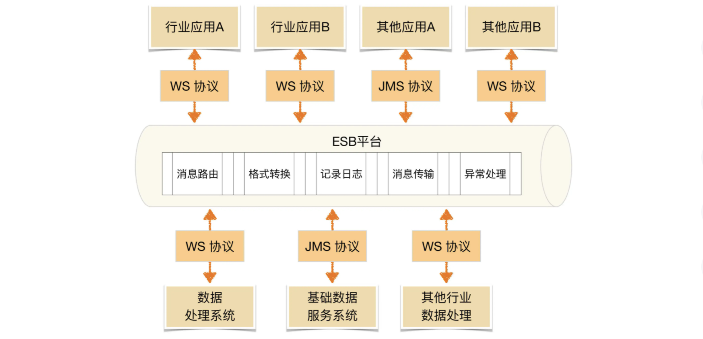

SOA 架构是比较高层级的架构设计理念，一般情况下可以说某个企业采用了 SOA 的架构来构建 IT 系统，但不会说某个独立的系统采用了 SOA 架构。例如，某企业采用 SOA 架构，将系统分为“人力资源管理服务”“考勤服务”“财务服务”，但人力资源管理服务本身通常不会再按照 SOA 的架构拆分更多服务，也不会再使用独立的一套 ESB，因为这些系统本身可能就是采购的，ESB 本身也是采购的，如果人力资源系统本身重构为多个子服务，再部署独立的 ESB 系统，成本很高，也没有什么收益。

SOA 解决了传统 IT 系统重复建设和扩展效率低的问题，但其本身也引入了更多的复杂性。SOA 最广为人诟病的就是 ESB，ESB 需要实现与各种系统间的协议转换、数据转换、透明的动态路由等功能。例如，下图中 ESB 将 JSON 转换为 Java（摘自《Microservices vs. Service-Oriented Architecture》）。

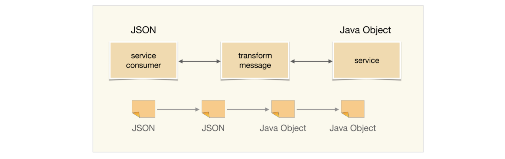

下图中 ESB 将 REST 协议转换为 RMI 和 AMQP 两个不同的协议：

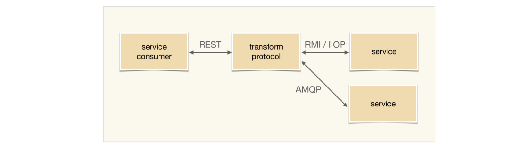

ESB 虽然功能强大，但现实中的协议有很多种，如 JMS、WS、HTTP、RPC 等，数据格式也有很多种，如 XML、JSON、二进制、HTML 等。ESB 要完成这么多协议和数据格式的互相转换，工作量和复杂度都很大，而且这种转换是需要耗费大量计算性能的，当 ESB 承载的消息太多时，ESB 本身会成为整个系统的性能瓶颈。

当然，SOA 的 ESB 设计也是无奈之举。回想一下 SOA 的提出背景就可以发现，企业在应用 SOA 时，各种异构的 IT 系统都已经存在很多年了，完全重写或者按照统一标准进行改造的成本是非常大的，只能通过 ESB 方式去适配已经存在的各种异构系统。

## 深入理解微服务架构

### 微服务背景

微服务是近几年非常火热的架构设计理念，大部分人认为是 Martin Fowler 提出了微服务概念，但事实上微服务概念的历史要早得多，也不是 Martin Fowler 创造出来的，Martin 只是将微服务进行了系统的阐述（原文链接：[https://martinfowler.com/articles/microservices.html](https://martinfowler.com/articles/microservices.html)）。不过不能否认 Martin 在推动微服务起到的作用，微服务能火，Martin 功不可没。

微服务的定义相信早已耳熟能详，参考维基百科，简单梳理一下微服务的历史（[https://en.wikipedia.org/wiki/Microservices#History](https://en.wikipedia.org/wiki/Microservices#History)）：

1）2005 年：Dr. Peter Rodgers 在 Web Services Edge 大会上提出了“Micro-Web-Services”的概念。

2）2011 年：一个软件架构工作组使用了“microservice”一词来描述一种架构模式。

3）2012 年：同样是这个架构工作组，正式确定用“microservice”来代表这种架构。

4）2012 年：ThoughtWorks 的 James Lewis 针对微服务概念在 QCon San Francisco 2012 发表了演讲。

5）2014 年：James Lewis 和 Martin Fowler 合写了关于微服务的一篇学术性的文章，详细阐述了微服务。

由于微服务的理念中也包含了“服务”的概念，而 SOA 中也有“服务”的概念，自然而然地会提出疑问：微服务与 SOA 有什么关系？有什么区别？为何有了 SOA 还要提微服务？

### 微服务与 SOA 的关系

关于 SOA 和微服务的关系和区别，大概分为下面几个典型的观点。

1、微服务是 SOA 的实现方式

如下图所示，这种观点认为 SOA 是一种架构理念，而微服务是 SOA 理念的一种具体实现方法。例如，“微服务就是使用 HTTP RESTful 协议来实现 ESB 的 SOA”“使用 SOA 来构建单个系统就是微服务”和“微服务就是更细粒度的 SOA”。

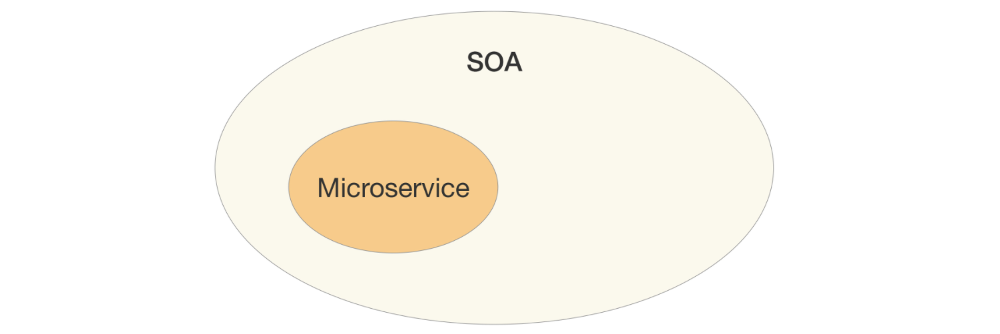

2、微服务是去掉 ESB 后的 SOA

如下图所示，这种观点认为传统 SOA 架构最广为人诟病的就是庞大、复杂、低效的 ESB，因此将 ESB 去掉，改为轻量级的 HTTP 实现，就是微服务。

3、微服务是一种和 SOA 相似但本质上不同的架构理念

如下图所示，这种观点认为微服务和 SOA 只是有点类似，但本质上是不同的架构设计理念。相似点在于下图中交叉的地方，就是两者都关注“服务”，都是通过服务的拆分来解决可扩展性问题。本质上不同的地方在于几个核心理念的差异：是否有 ESB、服务的粒度、架构设计的目标等。

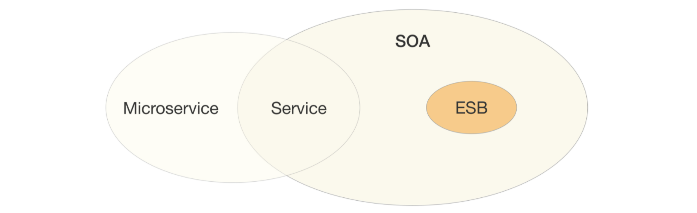

以上观点看似都有一定的道理，但都有点差别，到底哪个才是准确的呢？单纯从概念上是难以分辨的，对比一下 SOA 和微服务的一些具体做法，再来看看到底哪一种观点更加符合实际情况。

1、服务粒度

整体上来说，SOA 的服务粒度要粗一些，而微服务的服务粒度要细一些。例如，对一个大型企业来说，“员工管理系统”就是一个 SOA 架构中的服务；而如果采用微服务架构，则“员工管理系统”会被拆分为更多的服务，比如“员工信息管理”“员工考勤管理”“员工假期管理”和“员工福利管理”等更多服务。

2、服务通信

SOA 采用了 ESB 作为服务间通信的关键组件，负责服务定义、服务路由、消息转换、消息传递，总体上是重量级的实现。微服务推荐使用统一的协议和格式，例如，RESTful 协议、RPC 协议，无须 ESB 这样的重量级实现。Martin Fowler 将微服务架构的服务通讯理念称为“Smart endpoints and dumb pipes”，简单翻译为“聪明的终端，愚蠢的管道”。之所以用“愚蠢”二字，其实就是与 ESB 对比的，因为 ESB 太强大了，既知道每个服务的协议类型（例如，是 RMI 还是 HTTP），又知道每个服务的数据类型（例如，是 XML 还是 JSON），还知道每个数据的格式（例如，是 2017-01-01 还是 01/01/2017），而微服务的“dumb pipes”仅仅做消息传递，对消息格式和内容一无所知。

3、服务交付

SOA 对服务的交付并没有特殊要求，因为 SOA 更多考虑的是兼容已有的系统；微服务的架构理念要求“快速交付”，相应地要求采取自动化测试、持续集成、自动化部署等敏捷开发相关的最佳实践。如果没有这些基础能力支撑，微服务规模一旦变大（例如，超过 20 个微服务），整体就难以达到快速交付的要求，这也是很多企业在实行微服务时踩过的一个明显的坑，就是系统拆分为微服务后，部署的成本呈指数上升。

4、应用场景

SOA 更加适合于庞大、复杂、异构的企业级系统，这也是 SOA 诞生的背景。这类系统的典型特征就是很多系统已经发展多年，采用不同的企业级技术，有的是内部开发的，有的是外部购买的，无法完全推倒重来或者进行大规模的优化和重构。因为成本和影响太大，只能采用兼容的方式进行处理，而承担兼容任务的就是 ESB。

微服务更加适合于快速、轻量级、基于 Web 的互联网系统，这类系统业务变化快，需要快速尝试、快速交付；同时基本都是基于 Web，虽然开发技术可能差异很大（例如，Java、C++、.NET 等），但对外接口基本都是提供 HTTP RESTful 风格的接口，无须考虑在接口层进行类似 SOA 的 ESB 那样的处理。

综合上述分析，将 SOA 和微服务对比如下：

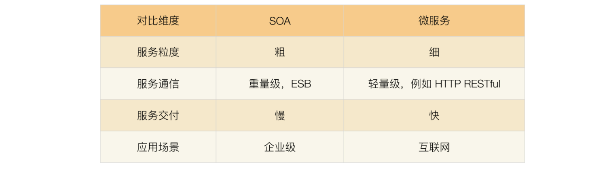

因此可以看到，SOA 和微服务本质上是两种不同的架构设计理念，只是在“服务”这个点上有交集而已，因此两者的关系应该是上面第三种观点。其实，Martin Fowler 在他的微服务文章中，已经做了很好的提炼：（[https://martinfowler.com/articles/microservices.html](https://martinfowler.com/articles/microservices.html)）

>In short, the microservice architectural style is an approach to developing a single application as a suite of small services, each running in its own process and communicating with lightweight mechanisms, often an HTTP resource API. These services are built around business capabilities and independently deployable by fully automated deployment machinery.

上述英文的三个关键词分别是：small、lightweight、automated，基本上浓缩了微服务的精华，也是微服务与 SOA 的本质区别所在。

通过前面的详细分析和比较，似乎微服务本质上就是一种比 SOA 要优秀很多的架构模式，那是否意味着我们都应该把架构重构为微服务呢？

其实不然，SOA 和微服务是两种不同理念的架构模式，并不存在孰优孰劣，只是应用场景不同而已。介绍 SOA 时候提到其产生历史背景是因为企业的 IT 服务系统庞大而又复杂，改造成本很高，但业务上又要求其互通，因此才会提出 SOA 这种解决方案。如果将微服务的架构模式生搬硬套到企业级 IT 服务系统中，这些 IT 服务系统的改造成本可能远远超出实施 SOA 的成本。

### 微服务的陷阱

单纯从上面的对比来看，似乎微服务大大优于 SOA，这也导致了很多团队在实践时不加思考地采用微服务——既不考虑团队的规模，也不考虑业务的发展，也没有考虑基础技术的支撑，只是觉得微服务很牛就赶紧来实施，以为实施了微服务后就什么问题都解决了，而一旦真正实施后才发现掉到微服务的坑里面去了。

看一下微服务具体有哪些坑：

1、服务划分过细，服务间关系复杂

服务划分过细，单个服务的复杂度确实下降了，但整个系统的复杂度却上升了，因为微服务将系统内的复杂度转移为系统间的复杂度了。

从理论的角度来计算，n 个服务的复杂度是 n×(n-1)/2，整体系统的复杂度是随着微服务数量的增加呈指数级增加的。下图形象了说明了整体复杂度：

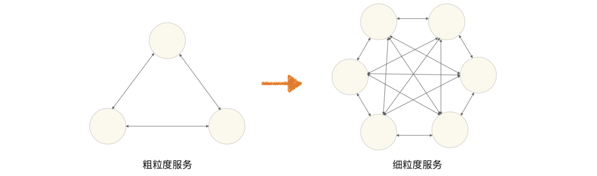

粗粒度划分服务时，系统被划分为 3 个服务，虽然单个服务较大，但服务间的关系很简单；细粒度划分服务时，虽然单个服务小了一些，但服务间的关系却复杂了很多。

2、服务数量太多，团队效率急剧下降

微服务的“微”字，本身就是一个陷阱，很多团队看到“微”字后，就想到必须将服务拆分得很细，有的团队人员规模是 5 ~ 6 个人，然而却拆分出 30 多个微服务，平均每个人要维护 5 个以上的微服务。

这样做给工作效率带来了明显的影响，一个简单的需求开发就需要涉及多个微服务，光是微服务之间的接口就有 6 ~ 7 个，无论是设计、开发、测试、部署，都需要工程师不停地在不同的服务间切换。

1）开发工程师要设计多个接口，打开多个工程，调试时要部署多个程序，提测时打多个包。

2）测试工程师要部署多个环境，准备多个微服务的数据，测试多个接口。

3）运维工程师每次上线都要操作多个微服务，并且微服务之间可能还有依赖关系。

3、调用链太长，性能下降

由于微服务之间都是通过 HTTP 或者 RPC 调用的，每次调用必须经过网络。一般线上的业务接口之间的调用，平均响应时间大约为 50 毫秒，如果用户的一起请求需要经过 6 次微服务调用，则性能消耗就是 300 毫秒，这在很多高性能业务场景下是难以满足需求的。为了支撑业务请求，可能需要大幅增加硬件，这就导致了硬件成本的大幅上升。

4、调用链太长，问题定位困难

系统拆分为微服务后，一次用户请求需要多个微服务协同处理，任意微服务的故障都将导致整个业务失败。然而由于微服务数量较多，且故障存在扩散现象，快速定位到底是哪个微服务故障是一件复杂的事情。下面是一个典型样例。

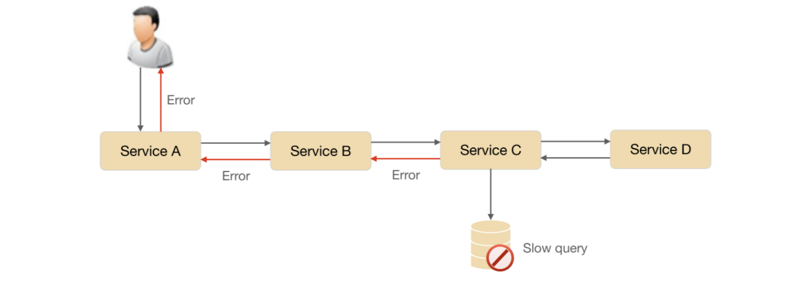

5、没有自动化支撑，无法快速交付

如果没有相应的自动化系统进行支撑，都是靠人工去操作，那么微服务不但达不到快速交付的目的，甚至还不如一个大而全的系统效率高。例如：

1）没有自动化测试支撑，每次测试时需要测试大量接口。

2）没有自动化部署支撑，每次部署 6 ~ 7 个服务，几十台机器，运维人员敲 shell 命令逐台部署，手都要敲麻。

3）没有自动化监控，每次故障定位都需要人工查几十台机器几百个微服务的各种状态和各种日志文件。

6、没有服务治理，微服务数量多了后管理混乱

信奉微服务理念的设计人员总是强调微服务的 lightweight 特性，并举出 ESB 的反例来证明微服务的优越之处。但具体实践后就会发现，随着微服务种类和数量越来越多，如果没有服务治理系统进行支撑，微服务提倡的 lightweight 就会变成问题。主要问题有：

1）服务路由：假设某个微服务有 60 个节点，部署在 20 台机器上，那么其他依赖的微服务如何知道这个部署情况呢？

2）服务故障隔离：假设上述例子中的 60 个节点有 5 个节点发生故障了，依赖的微服务如何处理这种情况呢？

3）服务注册和发现：同样是上述的例子，现在我们决定从 60 个节点扩容到 80 个节点，或者将 60 个节点缩减为 40 个节点，新增或者减少的节点如何让依赖的服务知道呢？

如果以上场景都依赖人工去管理，整个系统将陷入一片混乱，最终的解决方案必须依赖自动化的服务管理系统，这时就会发现，微服务所推崇的“lightweight”，最终也发展成和 ESB 几乎一样的复杂程度。

## 微服务架构最佳实践：方法篇

上面谈了实施微服务需要避免踩的陷阱，简单提炼为：

1）微服务拆分过细，过分强调“small”。

2）微服务基础设施不健全，忽略了“automated”。

3）微服务并不轻量级，规模大了后，“lightweight”不再适应。

针对这些问题，下面看看微服务最佳实践应该如何去做。主要分为方法篇和基础设施篇

### 服务粒度

针对微服务拆分过细导致的问题，建议基于团队规模进行拆分，类似贝索斯在定义团队规模时提出的“两个披萨”理论（每个团队的人数不能多到两张披萨都不够吃的地步），分享一个认为微服务拆分粒度的“三个火枪手”原则，即一个微服务三个人负责开发。在实施微服务架构时，根据团队规模来划分微服务数量，如果业务规继续发展，团队规模扩大，再将已有的微服务进行拆分。例如，团队最初有 6 个人，那么可以划分为 2 个微服务，随着业务的发展，业务功能越来越多，逻辑越来越复杂，团队扩展到 12 个人，那么可以将已有的 2 个微服务进行拆分，变成 4 个微服务。

为什么是 3 个人，不是 4 个，也不是 2 个呢？

首先，从系统规模来讲，3 个人负责开发一个系统，系统的复杂度刚好达到每个人都能全面理解整个系统，又能够进行分工的粒度；如果是 2 个人开发一个系统，系统的复杂度不够，开发人员可能觉得无法体现自己的技术实力；如果是 4 个甚至更多人开发一个系统，系统复杂度又会无法让开发人员对系统的细节都了解很深。

其次，从团队管理来说，3 个人可以形成一个稳定的备份，即使 1 个人休假或者调配到其他系统，剩余 2 个人还可以支撑；如果是 2 个人，抽调 1 个后剩余的 1 个人压力很大；如果是 1 个人，这就是单点了，团队没有备份，某些情况下是很危险的，假如这个人休假了，系统出问题了怎么办？

最后，从技术提升的角度来讲，3 个人的技术小组既能够形成有效的讨论，又能够快速达成一致意见；如果是 2 个人，可能会出现互相坚持自己的意见，或者 2 个人经验都不足导致设计缺陷；如果是 1 个人，由于没有人跟他进行技术讨论，很可能陷入思维盲区导致重大问题；如果是 4 个人或者更多，可能有的参与的人员并没有认真参与，只是完成任务而已。

“三个火枪手”的原则主要应用于微服务设计和开发阶段，如果微服务经过一段时间发展后已经比较稳定，处于维护期了，无须太多的开发，那么平均 1 个人维护 1 个微服务甚至几个微服务都可以。当然考虑到人员备份问题，每个微服务最好都安排 2 个人维护，每个人都可以维护多个微服务。

### 拆分方法

基于“三个火枪手”的理论，可以计算出拆分后合适的服务数量，但具体怎么拆也是有技巧的，并不是快刀斩乱麻随便拆分成指定数量的微服务就可以了，也不是只能按照业务来进行拆分，而是可以根据目的的不同灵活地选取不同的拆分方式。接下来一一介绍常见的拆分方式。

#### 基于业务逻辑拆分

这是最常见的一种拆分方式，将系统中的业务模块按照职责范围识别出来，每个单独的业务模块拆分为一个独立的服务。

基于业务逻辑拆分虽然看起来很直观，但在实践过程中最常见的一个问题就是团队成员对于“职责范围”的理解差异很大，经常会出现争论，难以达成一致意见。例如：假设做一个电商系统，第一种方式是将服务划分为“商品”“交易”“用户”3 个服务，第二种方式是划分为“商品”“订单”“支付”“发货”“买家”“卖家”6 个服务，哪种方式更合理，是不是划分越细越正确？

导致这种困惑的主要根因在于从业务的角度来拆分的话，规模粗和规模细都没有问题，因为拆分基础都是业务逻辑，要判断拆分粒度，不能从业务逻辑角度，而要根据前面介绍的“三个火枪手”的原则，计算一下大概的服务数量范围，然后再确定合适的“职责范围”，否则就可能出现划分过粗或者过细的情况，而且大部分情况下会出现过细的情况。

例如：如果团队规模是 10 个人支撑业务，按照“三个火枪手”规则计算，大约需要划分为 4 个服务，那么“登录、注册、用户信息管理”都可以划到“用户服务”职责范围内；如果团队规模是 100 人支撑业务，服务数量可以达到 40 个，那么“用户登录“就是一个服务了；如果团队规模达到 1000 人支撑业务，那“用户连接管理”可能就是一个独立的服务了。

#### 基于可扩展拆分

将系统中的业务模块按照稳定性排序，将已经成熟和改动不大的服务拆分为**稳定服务**，将经常变化和迭代的服务拆分为**变动服务**。稳定的服务粒度可以粗一些，即使逻辑上没有强关联的服务，也可以放在同一个子系统中，例如将“日志服务”和“升级服务”放在同一个子系统中；不稳定的服务粒度可以细一些，但也不要太细，始终记住要控制服务的总数量。

这样拆分主要是为了提升项目快速迭代的效率，避免在开发的时候，不小心影响了已有的成熟功能导致线上问题。

#### 基于可靠性拆分

将系统中的业务模块按照优先级排序，将可靠性要求高的核心服务和可靠性要求低的非核心服务拆分开来，然后重点保证核心服务的高可用。具体拆分的时候，核心服务可以是一个也可以是多个，只要最终的服务数量满足“三个火枪手”的原则就可以。

这样拆分带来下面几个好处：

1）避免非核心服务故障影响核心服务

例如，日志上报一般都属于非核心服务，但是在某些场景下可能有大量的日志上报，如果系统没有拆分，那么日志上报可能导致核心服务故障；拆分后即使日志上报有问题，也不会影响核心服务。

2）核心服务高可用方案可以更简单

核心服务的功能逻辑更加简单，存储的数据可能更少，用到的组件也会更少，设计高可用方案大部分情况下要比不拆分简单很多。

3）能够降低高可用成本

将核心服务拆分出来后，核心服务占用的机器、带宽等资源比不拆分要少很多。因此，只针对核心服务做高可用方案，机器、带宽等成本比不拆分要节省较多。

#### 基于性能拆分

基于性能拆分和基于可靠性拆分类似，将性能要求高或者性能压力大的模块拆分出来，避免性能压力大的服务影响其他服务。常见的拆分方式和具体的性能瓶颈有关，可以拆分 Web 服务、数据库、缓存等。例如电商的抢购，性能压力最大的是入口的排队功能，可以将排队功能独立为一个服务。

以上几种拆分方式不是多选一，而是可以根据实际情况自由排列组合，例如可以基于可靠性拆分出服务 A，基于性能拆分出服务 B，基于可扩展拆分出 C/D/F 三个服务，加上原有的服务 X，最后总共拆分出 6 个服务（A/B/C/D/F/X）。

### 基础设施

大部分人主要关注的是微服务的“small”和“lightweight”特性，但实际上真正决定微服务成败的，恰恰是那个被大部分人都忽略的“automated”。为何这样说呢？因为服务粒度即使划分不合理，实际落地后如果团队遇到麻烦，自然会想到拆服务或者合服务；如果“automated”相关的基础设施不健全，那微服务就是焦油坑，让研发、测试、运维陷入各种微服务陷阱中。

微服务基础设施如下图所示：

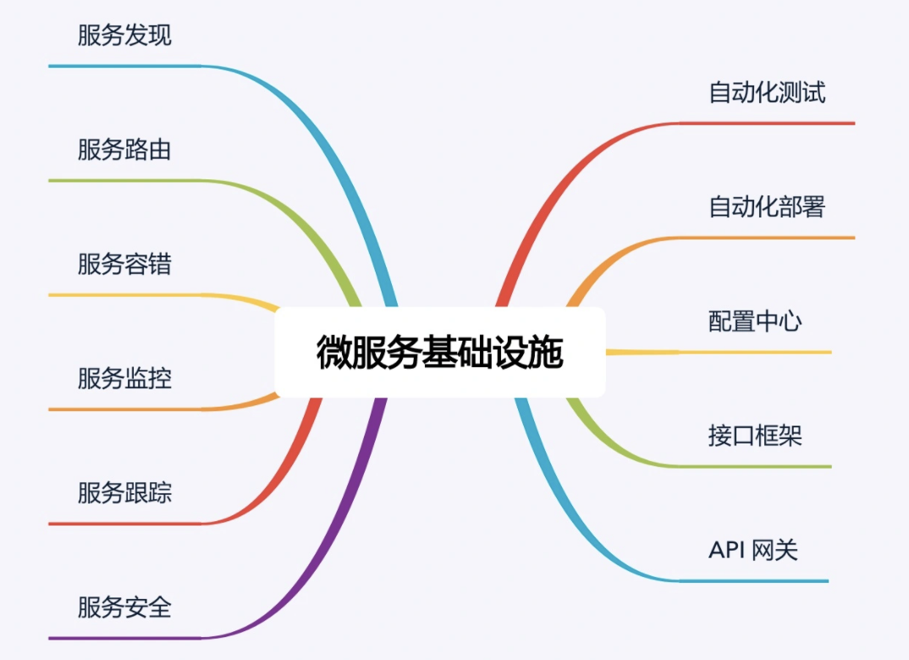

看到上面这张图，相信很多人都会倒吸一口凉气，说好的微服务的“轻量级”呢？都这么多基础设施还好意思说自己是“轻量级”，感觉比 ESB 还要复杂啊？

确实如此，微服务并不是很多人认为的那样又简单又轻量级。要做好微服务，这些基础设施都是必不可少的，否则微服务就会变成一个焦油坑，让业务和团队在里面不断挣扎且无法自拔。因此也可以说，微服务并没有减少复杂度，而只是将复杂度从 ESB 转移到了基础设施。可以看到，“服务发现”“服务路由”等其实都是 ESB 的功能，只是在微服务中剥离出来成了独立的基础系统。

虽然建设完善的微服务基础设施是一项庞大的工程，但也不用太过灰心，认为自己团队小或者公司规模不大就不能实施微服务了。第一个原因是已经有开源的微服务基础设施全家桶了，例如大名鼎鼎的 Spring Cloud 项目，涵盖了服务发现、服务路由、网关、配置中心等功能；第二个原因是如果微服务的数量并不是很多的话，并不是每个基础设施都是必须的。通常情况下，建议按照下面优先级来搭建基础设施：

1）服务发现、服务路由、服务容错：这是最基本的微服务基础设施。

2）接口框架、API 网关：主要是为了提升开发效率，接口框架是提升内部服务的开发效率，API 网关是为了提升与外部服务对接的效率。

3）自动化部署、自动化测试、配置中心：主要是为了提升测试和运维效率。

4）服务监控、服务跟踪、服务安全：主要是为了进一步提升运维效率。

以上 3 和 4 两类基础设施，其重要性会随着微服务节点数量增加而越来越重要，但在微服务节点数量较少的时候，可以通过人工的方式支撑，虽然效率不高，但也基本能够顶住。

## 微服务架构最佳实践：基础设施篇

每项微服务基础设施都是一个平台、一个系统、一个解决方案，如果要自己实现，其过程和做业务系统类似，都需要经过需求分析、架构设计、开发、测试、部署上线等步骤，这里介绍一下每个基础设施的主要作用，更多详细设计可以参考 Spring Cloud 的相关资料（[https://projects.spring.io/spring-cloud/](https://projects.spring.io/spring-cloud/)）。

### 自动化测试

微服务将原本大一统的系统拆分为多个独立运行的“微”服务，微服务之间的接口数量大大增加，并且微服务提倡快速交付，版本周期短，版本更新频繁。如果每次更新都靠人工回归整个系统，则工作量大，效率低下，达不到“快速交付”的目的，因此必须通过自动化测试系统来完成绝大部分测试回归的工作。

自动化测试涵盖的范围包括代码级的单元测试、单个系统级的集成测试、系统间的接口测试，理想情况是每类测试都自动化。如果因为团队规模和人力的原因无法全面覆盖，至少要做到接口测试自动化。

### 自动化部署

相比大一统的系统，微服务需要部署的节点增加了几倍甚至十几倍，微服务部署的频率也会大幅提升（例如，业务系统 70% 的工作日都有部署操作），综合计算下来，微服务部署的次数是大一统系统部署次数的几十倍。这么大量的部署操作，如果继续采用人工手工处理，需要投入大量的人力，且容易出错，因此需要自动化部署的系统来完成部署操作。

自动化部署系统包括版本管理、资源管理（例如，机器管理、虚拟机管理）、部署操作、回退操作等功能。

### 配置中心

微服务的节点数量非常多，通过人工登录每台机器手工修改，效率低，容易出错。特别是在部署或者排障时，需要快速增删改查配置，人工操作的方式显然是不行的。除此以外，有的运行期配置需要动态修改并且所有节点即时生效，人工操作是无法做到的。综合上面的分析，微服务需要一个统一的配置中心来管理所有微服务节点的配置。

配置中心包括配置版本管理（例如，同样的微服务，有 10 个节点是给移动用户服务的，有 20 个节点给联通用户服务的，配置项都一样，配置值不一样）、增删改查配置、节点管理、配置同步、配置推送等功能。

### 接口框架

微服务提倡轻量级的通信方式，一般采用 HTTP/REST 或者 RPC 方式统一接口协议。但在实践过程中，光统一接口协议还不够，还需要统一接口传递的数据格式。例如，需要指定接口协议为 HTTP/REST，但这还不够，还需要指定 HTTP/REST 的数据格式采用 JSON，并且 JSON 的数据都遵循相应规范。

如果只是简单指定了 HTTP/REST 协议，而不指定 JSON 和 JSON 的数据规范，那么就会出现这样混乱的情况：有的微服务采用 XML，有的采用 JSON，有的采用键值对；即使同样都是 JSON，JSON 数据格式也不一样。这样每个微服务都要适配几套甚至几十套接口协议，相当于把曾经由 ESB 做的事情转交给微服务自己做了，这样做的效率显然是无法接受的，因此需要统一接口框架。

接口框架不是一个可运行的系统，一般以库或者包的形式提供给所有微服务调用。例如，针对上面的 JSON 样例，可以由某个基础技术团队提供多种不同语言的解析包（Java 包、Python 包、C 库等）。

### API 网关

系统拆分为微服务后，内部的微服务之间是互联互通的，相互之间的访问都是点对点的。如果外部系统想调用系统的某个功能，也采取点对点的方式，则外部系统会非常“头大”。因为在外部系统看来，它不需要也没办法理解这么多微服务的职责分工和边界，它只会关注它需要的能力，而不会关注这个能力应该由哪个微服务提供。

除此以外，外部系统访问系统还涉及安全和权限相关的限制，如果外部系统直接访问某个微服务，则意味着每个微服务都要自己实现安全和权限的功能，这样做不但工作量大，而且都是重复工作。

综合上面的分析，微服务需要一个统一的 API 网关，负责外部系统的访问操作。API 网关是外部系统访问的接口，所有的外部系统接⼊系统都需要通过 API 网关，主要包括接入鉴权（是否允许接入）、权限控制（可以访问哪些功能）、传输加密、请求路由、流量控制等功能。

### 服务发现

微服务种类和数量很多，如果这些信息全部通过手工配置的方式写入各个微服务节点，首先配置工作量很大，配置文件可能要配几百上千行，几十个节点加起来后配置项就是几万几十万行了，人工维护这么大数量的配置项是一项灾难；其次是微服务节点经常变化，可能是由于扩容导致节点增加，也可能是故障处理时隔离掉一部分节点，还可能是采用灰度升级，先将一部分节点升级到新版本，然后让新老版本同时运行。不管哪种情况，都希望节点的变化能够及时同步到所有其他依赖的微服务。如果采用手工配置，是不可能做到实时更改生效的。因此，需要一套服务发现的系统来支撑微服务的自动注册和发现。

服务发现主要有两种实现方式：自理式和代理式。

#### 自理式

自理式结构如下：

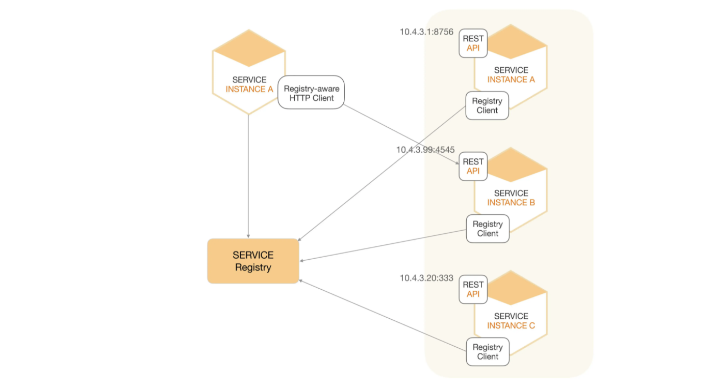

自理式结构就是指每个微服务自己完成服务发现。例如，图中 SERVICE INSTANCE A 访问 SERVICE REGISTRY 获取服务注册信息，然后直接访问 SERVICE INSTANCE B。

自理式服务发现实现比较简单，因为这部分的功能一般通过统一的程序库或者程序包提供给各个微服务调用，而不会每个微服务都自己来重复实现一遍；并且由于每个微服务都承担了服务发现的功能，访问压力分散到了各个微服务节点，性能和可用性上不存在明显的压力和风险。

#### 代理式

代理式结构如下：

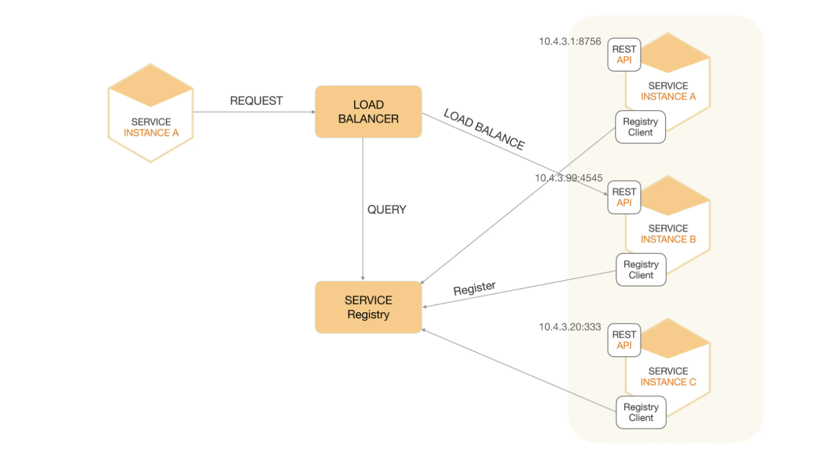

代理式结构就是指微服务之间有一个负载均衡系统（图中的 LOAD BALANCER 节点），由负载均衡系统来完成微服务之间的服务发现。

代理式的方式看起来更加清晰，微服务本身的实现也简单了很多，但实际上这个方案风险较大。第一个风险是可用性风险，一旦 LOAD BALANCER 系统故障，就会影响所有微服务之间的调用；第二个风险是性能风险，所有的微服务之间的调用流量都要经过 LOAD BALANCER 系统，性能压力会随着微服务数量和流量增加而不断增加，最后成为性能瓶颈。因此 LOAD BALANCER 系统需要设计成集群的模式，但 LOAD BALANCER 集群的实现本身又增加了复杂性。

不管是自理式还是代理式，服务发现的核心功能就是服务注册表，注册表记录了所有的服务节点的配置和状态，每个微服务启动后都需要将自己的信息注册到服务注册表，然后由微服务或者 LOAD BALANCER 系统到服务注册表查询可用服务。

### 服务路由

有了服务发现后，微服务之间能够方便地获取相关配置信息，但具体进行某次调用请求时，还需要从所有符合条件的可用微服务节点中挑选出一个具体的节点发起请求，这就是服务路由需要完成的功能。

服务路由和服务发现紧密相关，服务路由一般不会设计成一个独立运行的系统，通常情况下是和服务发现放在一起实现的。对于自理式服务发现，服务路由是微服务内部实现的；对于代理式服务发现，服务路由是由 LOAD BALANCER 系统实现的。无论放在哪里实现，服务路由核心的功能就是路由算法。常见的路由算法有：随机路由、轮询路由、最小压力路由、最小连接数路由等。

### 服务容错

系统拆分为微服务后，单个微服务故障的概率变小，故障影响范围也减少，但是微服务的节点数量大大增加。从整体上来看，系统中某个微服务出故障的概率会大大增加。前面在分析微服务陷阱时提到微服务具有故障扩散的特点，如果不及时处理故障，故障扩散开来就会导致看起来系统中很多服务节点都故障了，因此需要微服务能够自动应对这种出错场景，及时进行处理。否则，如果节点一故障就需要人工处理，投入人力大，处理速度慢；而一旦处理速度慢，则故障就很快扩散，所以我们需要服务容错的能力。

常见的服务容错包括请求重试、流控和服务隔离。通常情况下，服务容错会集成在服务发现和服务路由系统中。

### 服务监控

系统拆分为微服务后，节点数量大大增加，导致需要监控的机器、网络、进程、接口调用数等监控对象的数量大大增加；同时，一旦发生故障，需要快速根据各类信息来定位故障。这两个目标如果靠人力去完成是不现实的。举个简单例子：收到用户投诉说业务有问题，如果此时采取人工的方式去搜集、分析信息，可能把几十个节点的日志打开一遍就需要十几分钟了，因此需要服务监控系统来完成微服务节点的监控。

服务监控的主要作用有：

1）实时搜集信息并进行分析，避免故障后再来分析，减少了处理时间。

2）服务监控可以在实时分析的基础上进行预警，在问题萌芽的阶段发觉并预警，降低了问题影响的范围和时间。

通常情况下，服务监控需要搜集并分析大量的数据，因此建议做成独立的系统，而不要集成到服务发现、API 网关等系统中。

### 服务跟踪

服务监控可以做到微服务节点级的监控和信息收集，但如果需要跟踪某一个请求在微服务中的完整路径，服务监控是难以实现的。因为如果每个服务的完整请求链信息都实时发送给服务监控系统，数据量会大到无法处理。

服务监控和服务跟踪的区别可以简单概括为宏观和微观的区别。例如，A 服务通过 HTTP 协议请求 B 服务 10 次，B 通过 HTTP 返回 JSON 对象，服务监控会记录请求次数、响应时间平均值、响应时间最高值、错误码分布这些信息；而服务跟踪会记录其中某次请求的发起时间、响应时间、响应错误码、请求参数、返回的 JSON 对象等信息。

目前无论是分布式跟踪还是微服务的服务跟踪，绝大部分请求跟踪的实现技术都基于 Google 的 Dapper 论文《Dapper, a Large-Scale Distributed Systems Tracing Infrastructure》。

### 服务安全

系统拆分为微服务后，数据分散在各个微服务节点上。从系统连接的角度来说，任意微服务都可以访问所有其他微服务节点；但从业务的角度来说，部分敏感数据或者操作，只能部分微服务可以访问，而不是所有的微服务都可以访问，因此需要设计服务安全机制来保证业务和数据的安全性。

服务安全主要分为三部分：接入安全、数据安全、传输安全。通常情况下，服务安全可以集成到配置中心系统中进行实现，即配置中心配置微服务的接入安全策略和数据安全策略，微服务节点从配置中心获取这些配置信息，然后在处理具体的微服务调用请求时根据安全策略进行处理。由于这些策略是通用的，一般会把策略封装成通用的库提供给各个微服务调用。基本架构如下：

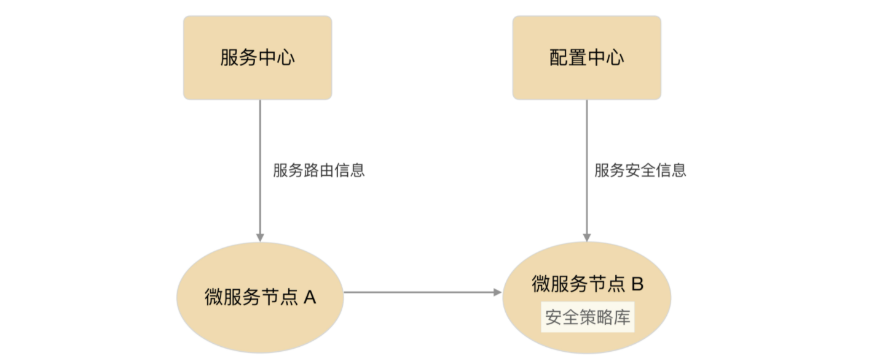

## 微内核架构详解

微内核架构（Microkernel Architecture），也被称为插件化架构（Plug-in Architecture），是一种面向功能进行拆分的可扩展性架构，通常用于实现基于产品（原文为 product-based，指存在多个版本、需要下载安装才能使用，与 web-based 相对应）的应用。例如 Eclipse 这类 IDE 软件、UNIX 这类操作系统、淘宝 App 这类客户端软件等，也有一些企业将自己的业务系统设计成微内核的架构，例如保险公司的保险核算逻辑系统，不同的保险品种可以将逻辑封装成插件。

### 基本架构

微内核架构包含两类组件：核心系统（core system）和插件模块（plug-in modules）。核心系统负责和具体业务功能无关的通用功能，例如模块加载、模块间通信等；插件模块负责实现具体的业务逻辑，例如专栏前面经常提到的“学生信息管理”系统中的“手机号注册”功能。

微内核的基本架构示意图如下：

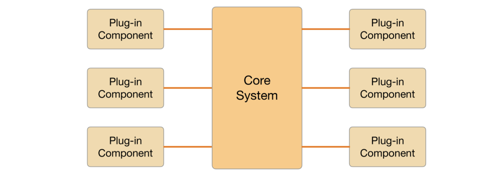

上面这张图中核心系统 Core System 功能比较稳定，不会因为业务功能扩展而不断修改，插件模块可以根据业务功能的需要不断地扩展。微内核的架构本质就是将变化部分封装在插件里面，从而达到快速灵活扩展的目的，而又不影响整体系统的稳定。

### 设计关键点

微内核的核心系统设计的关键技术有：插件管理、插件连接和插件通信。

#### 插件管理

核心系统需要知道当前有哪些插件可用，如何加载这些插件，什么时候加载插件。常见的实现方法是插件注册表机制。

核心系统提供插件注册表（可以是配置文件，也可以是代码，还可以是数据库），插件注册表含有每个插件模块的信息，包括它的名字、位置、加载时机（启动就加载，还是按需加载）等。

#### 插件连接

插件连接指插件如何连接到核心系统。通常来说，核心系统必须制定插件和核心系统的连接规范，然后插件按照规范实现，核心系统按照规范加载即可。

常见的连接机制有 OSGi（Eclipse 使用）、消息模式、依赖注入（Spring 使用），甚至使用分布式的协议都是可以的，比如 RPC 或者 HTTP Web 的方式。

#### 插件通信

插件通信指插件间的通信。虽然设计的时候插件间是完全解耦的，但实际业务运行过程中，必然会出现某个业务流程需要多个插件协作，这就要求两个插件间进行通信。由于插件之间没有直接联系，通信必须通过核心系统，因此核心系统需要提供插件通信机制。这种情况和计算机类似，计算机的 CPU、硬盘、内存、网卡是独立设计的配件，但计算机运行过程中，CPU 和内存、内存和硬盘肯定是有通信的，计算机通过主板上的总线提供了这些组件之间的通信功能。微内核的核心系统也必须提供类似的通信机制，各个插件之间才能进行正常的通信。

### OSGi 架构简析

OSGi 的全称是 Open Services Gateway initiative，本身其实是指 OSGi Alliance。这个联盟是 Sun Microsystems、IBM、爱立信等公司于 1999 年 3 月成立的开放的标准化组织，最初名为 Connected Alliance。它是一个非盈利的国际组织，旨在建立一个开放的服务规范，为通过网络向设备提供服务建立开放的标准，这个标准就是 OSGi specification。现在我们谈到 OSGi，如果没有特别说明，一般都是指 OSGi 的规范。

OSGi 联盟的初始目标是构建一个在广域网和局域网或设备上展开业务的基础平台，所以 OSGi 的最早设计也是针对嵌入式应用的，诸如机顶盒、服务网关、手机、汽车等都是其应用的主要环境。然而，无心插柳柳成荫，由于 OSGi 具备动态化、热插拔、高可复用性、高效性、扩展方便等优点，它被应用到了 PC 上的应用开发。尤其是 Eclipse 这个流行软件采用 OSGi 标准后，OSGi 更是成为了首选的插件化标准。现在谈论 OSGi，已经和嵌入式应用关联不大了，更多是将 OSGi 当作一个微内核的架构模式。

Eclipse 从 3.0 版本开始，抛弃了原来自己实现的插件化框架，改用了 OSGi 框架。需要注意的是，OSGi 是一个插件化的标准，而不是一个可运行的框架，Eclipse 采用的 OSGi 框架称为 Equinox，类似的实现还有 Apache 的 Felix、Spring 的 Spring DM。OSGi 框架的逻辑架构图如下：

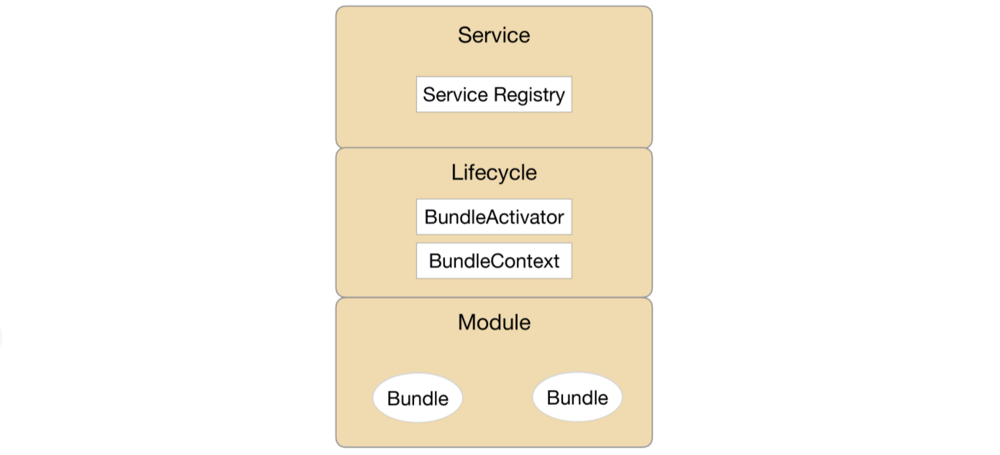

#### 模板层（Module 层）

模块层实现插件管理功能。OSGi 中，插件被称为 Bundle，每个 Bundle 是一个 Java 的 JAR 文件，每个 Bundle 里面都包含一个元数据文件 MANIFEST.MF，这个文件包含了 Bundle 的基本信息。例如，Bundle 的名称、描述、开发商、classpath，以及需要导入的包和输出的包等，OSGi 核心系统会将这些信息加载到系统中用于后续使用。

#### 生命周期层（Lifecycle 层）

生命周期层实现插件连接功能，提供了执行时模块管理、模块对底层 OSGi 框架的访问。生命周期层精确地定义了 Bundle 生命周期的操作（安装、更新、启动、停止、卸载），Bundle 必须按照规范实现各个操作。

#### 服务层（Service 层）

服务层实现插件通信的功能。OSGi 提供了一个服务注册的功能，用于各个插件将自己能提供的服务注册到 OSGi 核心的服务注册中心，如果某个服务想用其他服务，则直接在服务注册中心搜索可用服务中心就可以了。

### 规则引擎架构简析

规则引擎从结构上来看也属于微内核架构的一种具体实现，其中执行引擎可以看作是微内核，执行引擎解析配置好的业务流，执行其中的条件和规则，通过这种方式来支持业务的灵活多变。

规则引擎在计费、保险、促销等业务领域应用较多。例如电商促销 满 100 送 50，3 件立减 50。促销规则完整列下来可能有几十上百种，再加上排列组合，促销方案可能有几百上千种，这样的业务如果完全靠代码来实现，开发效率远远跟不上业务的变化速度，而规则引擎却能够很灵活的应对这种需求，主要原因在于：

1）可扩展

通过引入规则引擎，业务逻辑实现与业务系统分离，可以在不改动业务系统的情况下扩展新的业务功能。

2）易理解

规则通过自然语言描述，业务人员易于理解和操作，而不像代码那样只有程序员才能理解和开发。

3）高效率

规则引擎系统一般提供可视化的规则定制、审批、查询及管理，方便业务人员快速配置新的业务。

规则引擎的基本架构如下：

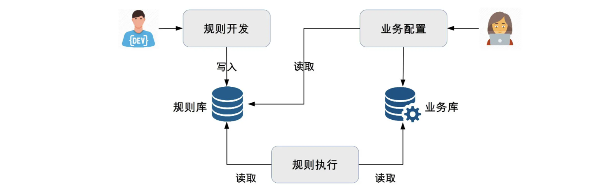

简单介绍一下：

1）开发人员将业务功能分解提炼为多个规则，将规则保存在规则库中。

2）业务人员根据业务需要，通过将规则排列组合，配置成业务流程，保存在业务库中。

3）规则引擎执行业务流程实现业务功能。

对照微内核架构的设计关键点，规则引擎是具体是如何实现的。

1）插件管理

规则引擎中的规则就是微内核架构的插件，引擎就是微内核架构的内核。规则可以被引擎加载和执行。规则引擎架构中，规则一般保存在规则库中，通常使用数据库来存储。

2）插件连接

类似于程序员开发的时候需要采用 Java、C++ 等语言，规则引擎也规定了规则开发的语言，业务人员需要基于规则语言来编写规则文件，然后由规则引擎加载执行规则文件来完成业务功能，因此，规则引擎的插件连接实现机制其实就是规则语言。

3）插件通信

规则引擎的规则之间进行通信的方式就是数据流和事件流，由于单个规则并不需要依赖其他规则，因此规则之间没有主动的通信，规则只需要输出数据或者事件，由引擎将数据或者事件传递到下一个规则。

目前最常用的规则引擎是开源的 JBoss Drools，采用 Java 语言编写，基于 Rete 算法（参考[https://en.wikipedia.org/wiki/Rete_algorithm](https://en.wikipedia.org/wiki/Rete_algorithm)）。Drools 具有下面这些优点：

1）非常活跃的社区支持，以及广泛的应用。

2）快速的执行速度。

3）与 Java Rule Engine API（JSR-94）兼容。

4）提供了基于 Web 的 BRMS——Guvnor，Guvnor 提供了规则管理的知识库，通过它可以实现规则的版本控制，以及规则的在线修改与编译，使得开发人员和系统管理人员可以在线管理业务规则。

虽然 Drools 号称简单易用，但实际上其规则语言还是和编程语言比较类似，在实际应用的时候普通业务人员面对这样的规则语言，学习成本和理解成本还是比较高的，例如下面这个样例（[https://blog.csdn.net/ouyangshixiong/article/details/46315273](https://blog.csdn.net/ouyangshixiong/article/details/46315273)）：

因此，通常情况下需要基于 Drools 进行封装，将规则配置做成可视化的操作，例如下面电商反欺诈的一个示例（[https://cloud.tencent.com/developer/article/1031839](https://cloud.tencent.com/developer/article/1031839)）

