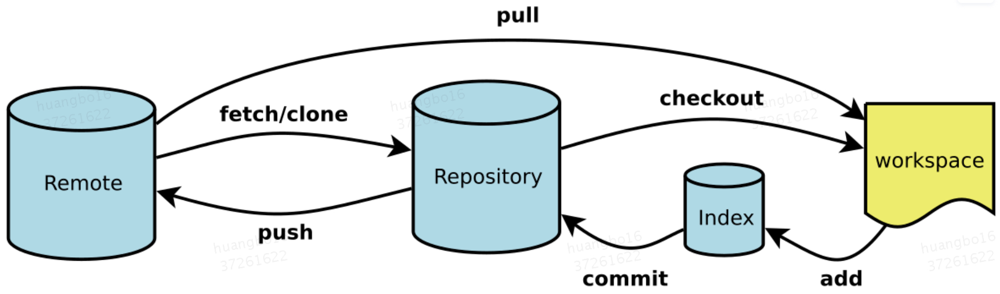
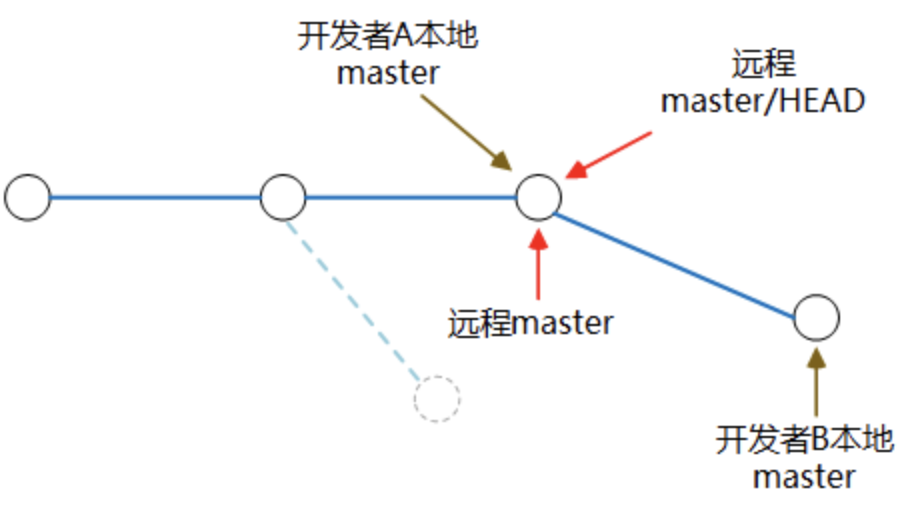
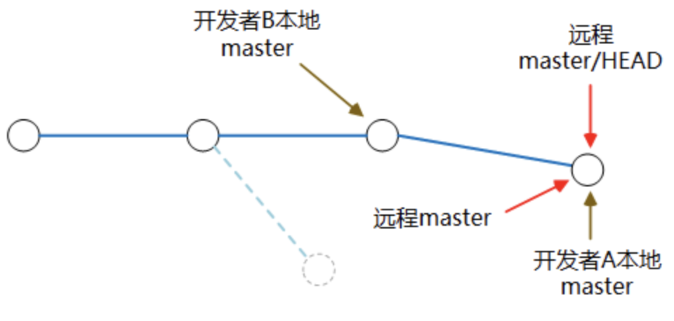

# **1、git结构**



* Workspace：工作区
* Index / Stage：暂存区
* Repository：仓库区（或本地仓库）
* Remote：远程仓库

# **2、git使用**

## **2.1 创建git本地库**

新建一个目录,将该目录转化为git本地仓库：

```shell
mkdir learngit #新建目录
cd learngit"
git init #将目录初始化为git仓库
# 查看git仓库状态
git status
```

## **2.2 向仓库提交文件**

新建一个readme.txt文件，分两步添加该文件到Git仓库：

```shell
#新建一个文本文件
touch readme.txt 
#将新建的文件加入到缓冲区
git add readme.txt 
#将缓冲区的修改全部提交到本地仓库，-m后是对本次修改的注解
git commit -m "wrote a readme file" 
```

## **2.3 版本回退**

查看历史提交的修改：

```shell
git log
```
commit后的一串字符是每次commit的id，用于检索每次提交的版本
版本回退有revert和reset两种方案：

	使用revert命令进行版本回退,只能回退最近一次修改版本,否则可能需要进行冲突处理，其原理是用一个相反的提交来回滚指定版本所做的修改：

```shell
git revert [commitid]
```
reset是一种重置，即错误提交了，此时要删除这个提交记录。也可以实现回滚：
```shell
git reset --hard [commitid]
```

**revert和reset的比较：**

1、若以上修改已经push到线上代码库, reset 删除指定commit以后,git push可能导致一大堆冲突.但是revert 并不会.

2、如果在日后现有分支和历史分支需要合并的时候,reset 恢复部分的代码依然会出现在历史分支里.但是revert 方向提交的commit 并不会出现在历史分支里. 

3、reset 是在正常的commit历史中,删除了指定的commit,这时 HEAD 是向后移动了,而 revert 是在正常的commit历史中再commit一次,只不过是反向提交,他的 HEAD 是一直向前的.

## **2.4 文件修改**

```shell
git diff HEAD -- [filename] #查看当前工作区和版本库里面最新版本的区别
git diff [filename] #查看工作区和暂存区的区别
git rm [filename] #删除文件
#将文件重置回上一次add或commit的状态，即取消在工作区的修改或删除
git checkout -- [filename] 
```

## **2.5 分支操作**

创建新分支：

```shell
git branch [branchname] #创建新分支
git checkout [branchname] #切到新分支
git checkout -b [branchname] #创建新分支并切到新分支
git branch #查看当前分支
```
以上带*的表示当前所处的分支
合并分支：

```shell
git merge --no-ff -m "merge with no-ff" [branchname] #禁用fastforward模式，保留分支记录
git merge [branchname] #将分支合并到当前分支上
git branch -d [branchname] #删除分支
```
分支冲突处理：
当要合并的分支中有内容和master分支冲突时，需要进入该冲突的文件进行修改后重新提交

解决冲突后可以使用带参数的git log查看合并过程：

```shell
git log --graph --pretty=oneline --abbrev-commit
```

## **2.6 储藏工作现场**

储存工作现场：

```shell
git stash
```
查看储存的工作现场：
```shell
git stash list
```
恢复工作现场：
```shell
git stash apply [stashid] #恢复工作现场，stashid即上面stash list显示的stash@{0}
git stash drop [stashid] #删除工作现场
git stash pop #恢复并删除工作现场
```

## **2.7 远程仓库操作**

```shell
git remote #查看远程库信息
git remote -v #远程库详细信息
git push origin [branchname] #向远程库推送分支
#从远程库clone项目
git clone ssh://git@git.dianpingoa.com/shoppic/shoppic-service.git 
#设置本地分支与远程仓库分支的链接
git branch --set-upstream [localbranchname] origin/[remotebranchname] 
git pull # 更新代码到最新版本
git checkout -b [branchname] origin/[branchname] #从远程库抓取分支
```
远程操作步骤：
1、首先，可以试图用git push origin [branchname]推送自己的修改；

2、如果推送失败，则因为远程分支比你的本地更新，需要先用git pull试图合并；

3、如果合并有冲突，则解决冲突，并在本地提交；

4、没有冲突或者解决掉冲突后，再用git push origin [branchname]推送就能成功！

	如果git pull提示“no tracking information”，则说明本地分支和远程分支的链接关系没有创建，用命令git branch --set-upstream branch-name origin/branch-name。

# **3、git常见命令**

## **3.1 merge**

git merge taget_branch

## **3.2 reset**

**一、首先解析以下这三个相关的状态和概念**

1、HEAD：可以描述为当前分支最后一个提交。即本地的信息中的当前版本。

2、Index：在工作副本修改之后执行过git add操作的版本文件，可以commit了的。

3、Working Copy：工作副本是你正在修改，但是没有执行任何git操作的文件。

总的来说：

代码修改，还没做任何操作的时候就是 Working Copy，

git add * 操作之后就是Index，

git commit 之后就是HEAD。如果代码修改了之后进行git add 操作，然后git commit，那么所有三者(HEAD,INDEX(STAGING),WORKING COPY)都是相同的状态，内容相同。

**二、reset**

1、soft（更改HEAD）（恢复git commit的操作）

软重置。本来origin的HEAD和本地的HEAD一样，如果你指定--soft参数，Git只是单纯的把本地HEAD更改到你指定的版本那么，整个过程中，就HEAD的定义发生了变化，其他像Working Copy 和Index都没有变化。该参数用于git commit后，又要恢复还没commit的场景，重新审查代码，然后再推上去。

2、mixed(default）（恢复git add的操作，包含恢复git commit的操作）

--mixed是reset的默认参数，也就是当你不指定任何参数时的参数。它将重置HEAD到另外一个commit,并且重置index以便和HEAD相匹配。

 3、hard（更改三者）

--hard参数将会将会重置(HEAD,INDEX(STAGING),WORKING COPY)，强制一致。该参数用于在把工作副本改成一塌糊涂的时候，包括工作副本，一股脑恢复。有些就单纯修改文件，其中有些git add了，有些git commit了，通通不管，可以一个命令恢复。

总结：

**1、soft： 重置git commit**

**2、mixed： 重置git commit 和 git add**

**3、hard： 重置git commit 和 git add 和工作副本的修改。**

 

## 3.3 rebase

### 命令介绍

**git pull --rebase**

git pull的默认行为是git fetch + git merge

git pull --rebase则是git fetch + git rebase.

**git fetch**

从远程获取最新版本到本地，不会自动合并分支

**git rebase**

git rebase，顾名思义，就是重新定义（re）起点（base）的作用，即重新定义分支的版本库状态。本地更新分支节点过程如下图所示。



**git pull --rebase**

git pull --rebase执行过程中会将本地当前分支里的每个提交(commit)取消掉，然后把将本地当前分支更新为最新的"origin"分支，该过程本地分支节点更新图如下所示：



### 解决冲突方法

**执行完git pull --rebase之后如果有合并冲突，使用以下三种方式处理这些冲突：**

git rebase --abort 会放弃合并，回到rebase操作之前的状态，之前的提交的不会丢弃；

git rebase --skip 则会将引起冲突的commits丢弃掉（慎用！！）；

git rebase --continue 合并冲突，结合"git add 文件"命令一起用与修复冲突，提示开发者，一步一步地有没有解决冲突。（fix conflicts and then run "git rebase --continue"）

 

对上述冲突的处理

1、使用 $git rebase --abort

执行之后，本地内容会回到提交之间的状态，也就是回到以前提交但没有pull是的状态，简单来说就是撤销rebase。

 

2、使用 $git rebase --skip

git rebase --skip 引起冲突的commits会被丢弃，对于本文应用的例子来说开发者A对c.sh文件的commit无效，开发者A自己修改的部分全部无效，因此，在使用skip时请慎重。

执行：$ vim c.sh

查看本地c.sh文件提交内容，展示如下图所示，执行语句之后开发者A的修改无效。

 

 

3、使用 $git rebase --continue

执行完$git pull --rebase 之后，本地如果产生冲突，手动解决冲突之后，用"git add ."（注意这里可以不用commit，因为已经commit了，现在只需要调整commit的顺序而已，个人理解）命令去更新这些内容的索引(index)，然后只要执行:

$ git rebase --continue 就可以线性的连接本地分支与远程分支，无误之后就回退出，回到主分支上。

注意：一般情况下，修改后检查没问题，使用rebase continue来合并冲突。

# 4、提交规范

## Commit message 的格式

每次提交，Commit message 都包括三个部分：**Header，Body 和 Footer**。

```dockerfile
<type>(<scope>): <subject>
// 空一行
<body>
// 空一行
<footer>
```
其中Header是必须的，Body和Footer可以省略
### Header

Header部分只有一行，包括三个字段：type（必需）、scope（可选）和subject（必需）。

1）type 

type用于说明 commit 的类别，只允许使用下面7个标识。 

* feat：新功能（feature）
* fix：修补bug
* docs：文档（documentation）
* style： 格式（不影响代码运行的变动）
* refactor：重构（即不是新增功能，也不是修改bug的代码变动）
* test：增加测试
* chore：构建过程或辅助工具的变动
如果type为feat和fix，则该 commit 将肯定出现在 Change log 之中。其他情况（docs、chore、style、refactor、test）由你决定，要不要放入 Change log，建议是不要。

（2）scope

scope用于说明 commit 影响的范围，比如数据层、控制层、视图层等等，视项目不同而不同。

（3）subject

subject是 commit 目的的简短描述，不超过50个字符。

* 以动词开头，使用第一人称现在时，比如change，而不是changed或changes
* 第一个字母小写
* 结尾不加句号（.）


注意：

* 一般提交代码标题和commit都要用header中的type
* feat后用英式:，且要有空格，空格后要用小写，否则报错
Tips：

go的import要求顺序导入，可安装go fmt或者goimports，然后保存自动格式化

>cmd+,选择Tools/File Watches

# Reference

[常用 Git 命令清单](http://www.ruanyifeng.com/blog/2015/12/git-cheat-sheet.html)

[Git教程](https://www.liaoxuefeng.com/wiki/896043488029600)

[关于git的reset指令说明-soft、mixed、hard](https://www.cnblogs.com/hodge01/p/10277757.html)

[git的突出解决--git rebase之abort、continue、skip](https://www.cnblogs.com/chenjunjie12321/p/6876220.html)

[git rebase简介](https://blog.csdn.net/hudashi/article/details/7664631/)

[彻底搞懂 Git-Rebase](http://jartto.wang/2018/12/11/git-rebase/)

[约定式提交规范](https://www.conventionalcommits.org/zh-hans/v1.0.0-beta.4/#%e7%ba%a6%e5%ae%9a%e5%bc%8f%e6%8f%90%e4%ba%a4%e8%a7%84%e8%8c%83)

[commitlint+husky规范commit日志](https://blog.csdn.net/wei371522/article/details/84070803)

[Commit message 和 Change log 编写指南](https://www.ruanyifeng.com/blog/2016/01/commit_message_change_log.html)
