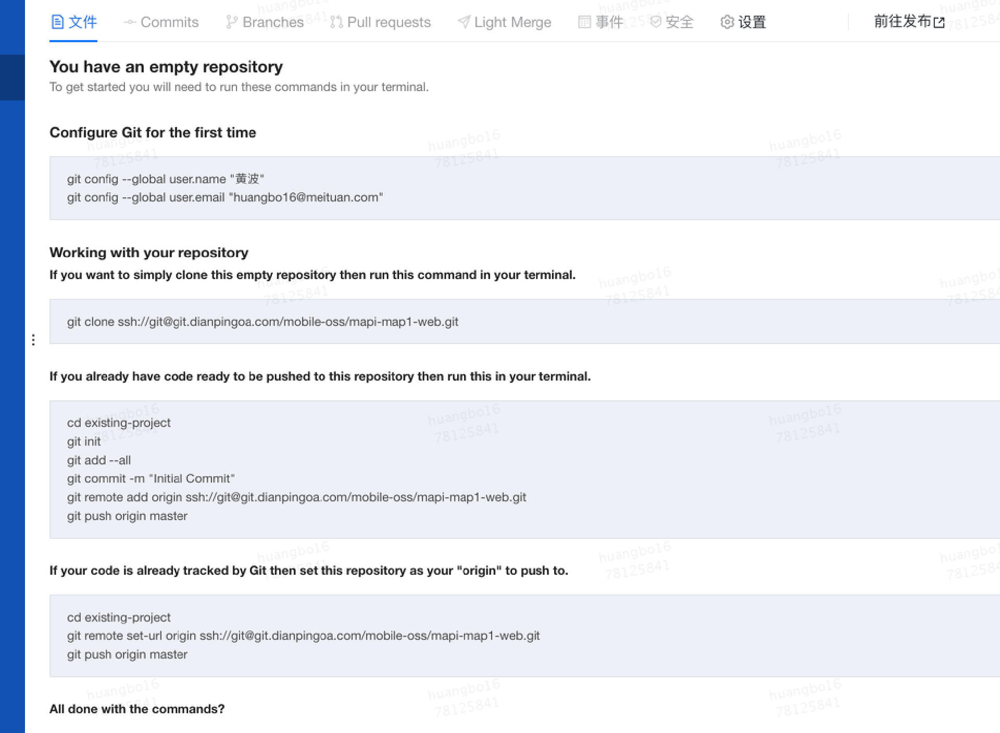
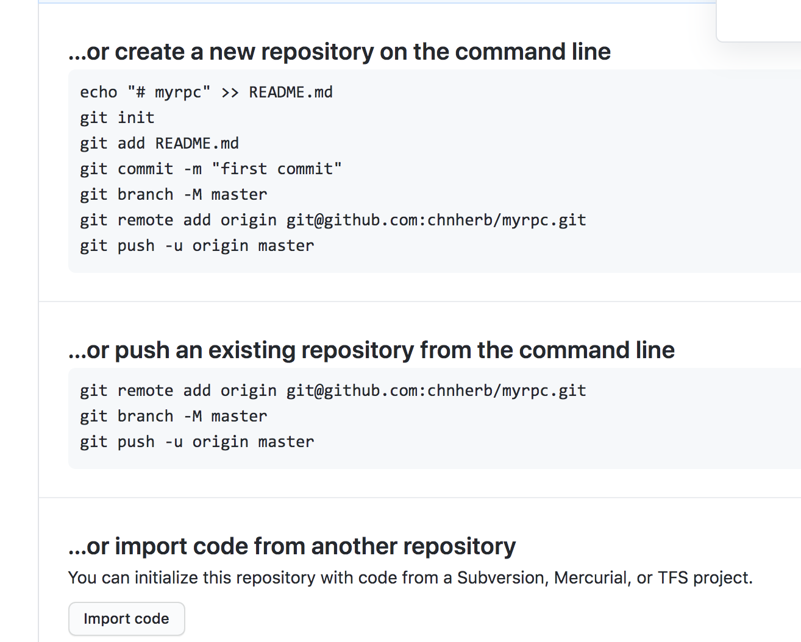
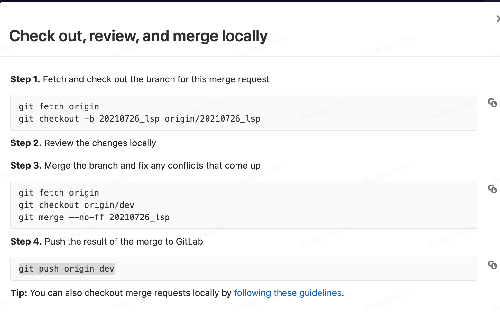

# 基本操作

用git提交代码到远程库 

  a.将目录切换到mobile-oss-web。cd mobile-oss-web (mac上使用命令行) 

  b.将修改全部提交到暂存区域。git add .  //add . 表示添加全部修改。（mac上使用git命令） 

  c.将修改提交到当前分支。git commit －m“test” //-m后的“”里面是备注。 （mac上使用git命令） 

  d.将代码提交到远程库。git push origin master  （mac上使用git命令） 

>-am只是将添加到git管理的文件提交变更，与add . 和commit有区别。

## 查看分支

```shell
git branch
# 查看所有分支，包括远程
git branch -a
```
## 删除分支

```shell
# 删除本地分支
git branch -D 分支名
# 删除远程分支
git push origin --delete 分支名  # 不带remotes/origin/
```

## **拉最新代码**

```shell
git checkout master
git pull origin master
git checkout Txxxx
git merge master
第一次提交代码
​
git checkout -b huangbo
git push origin huangbo
git branch --all
git status -s
git add .
git commit -m "test"
git push origin huangbo
本地新建分支并提交
git branch huangbo_dev
git checkout huangbo_dev
git merge master
git add .
git commit -m 'Txxx - first'
# git commtit -am T2661
git push origin huangbo_dev
​
git commit -am "update"
查看分支信息
# 列出所有本地分支
git branch
# 列出所有远程分支
git branch -r
# 列出所有本地分支和远程分支
git branch -a
```
## 拉远程分支

```shell
git fetch
# git branch -r
# git branch -a
git checkout -b 本地分支名 remotes/origin/远程分支
```

# **beta环境合并步骤**

1、新建Task获取编号

	a、主题：mapi-index-service下线

	b、详情：mapi-index-service下线 [http://aladdin.sankuai.com/#/task/appkey/2299](http://aladdin.sankuai.com/#/task/appkey/2299)

	c、分支：master

	d、负责人：zhangsan

2、新建本地分支

3、提交代码到远程编号分支

4、线下发布->CI->Ligh Merge->new LightMerge

	a、Base: Master;  Merge(Source Branches): 【编号】

	b、CI branch：lightmerge

	c、Submit...

	d、Check...

	e、Refresh and push

	f、构建 -> 部署

# **线上环境/rc**

1、Pullrequests

2、等待merge

3、打包

	a、New Package

	b、Tag: T2661-20190528   Branch:master  上线说明：=============上线周知=============

【修改内容】更换必吃菜接口依赖,支持2019必吃菜自动切榜

【影响范围】菜品spu功能

【操作】发布poi-sku-service

【负责人】xxxxx

【结对检查】xxxxx

【QA】自测

# **master回滚**

回滚前先将git仓库所有权改成自己，关闭拒绝强制提交

```shell
# 切到master
git reset --hard HEAD^         回退到上个版本
git reset --hard HEAD~3       回退到前3次提交之前，以此类推，回退到n次提交之前
git reset --hard commit_id     退到/进到 指定commit的sha码
​
git push origin master --force
# 暂存代码
git stash
​
# 中间可以切分支创建分支
git checkout master
git checkout pull origin master
git checkout -b t1
​
git stash pop
# 强制还原成master
git reset --hard origin/master
​
# 强制覆盖远程分支，当本地分支版本比远程分支版本低时
git push origin T3456 --force
​
# 回滚代码到master
git fetch --all
git reset --hard origin/master
git pull
git push --force origin TXXX
```
# git全局配置

## 修改git提交代码名称： 

```plain
# 全局设置
git config --global user.email zhangsan@xxx.com
git config --global users.name bo
# 清除全局配置
git config --global --unset user.name
git config --global --unset user.email
```
## 多账号配置

>参考：[https://www.jianshu.com/p/89cb26e5c3e8](https://www.jianshu.com/p/89cb26e5c3e8)
>[https://www.cnblogs.com/TRHX/p/11699999.html?ivk_sa=1024320u](https://www.cnblogs.com/TRHX/p/11699999.html?ivk_sa=1024320u)

配置~/.ssh/config

```objectivec
Host 10.*
    GSSAPIAuthentication yes
    GSSAPIDelegateCredentials no

Host abcd_1234
    HostName 1.2.3.4
    User zhangsan
    Port 11789
    StrictHostKeyChecking no
    IdentityFile ~/.ssh/.cloud_workspace_keys/zhangsan/abc_1639_rsa

Host github
HostName https://github.com
User chnherb
IdentityFile ~/.ssh/github_id_rsa
```
设置name和email
```shell
git config --global user.name "chnherb"
git config --global user.email "chnhuangbo@qq.com"
```
clone
```objectivec
git clone git@xxxxxx.com:chping/test.git
# 改成，===不需要修改
git clone github@xxxxxx.com:chping/test.git
```
### 报错ip节点不在known_hosts中

错误：

```dockerfile
Warning: the ECDSA host key for 'github.com' differs from the key for the IP address '20.205.243.166'
Offending key for IP in /Users/admin/.ssh/known_hosts:12
Matching host key in /Users/admin/.ssh/known_hosts:20
Are you sure you want to continue connecting (yes/no)? yes
```
解决：
```shell
ssh-keygen -R 20.205.243.166
```

## 没有权限

```shell
# 查看信息
git config --global --list 
```


# **建仓库**




git remote set-url origin ssh://git@github.com:chnherb/chnherb.github.io.git




```shell
echo "# myrpc" >> README.md
git init
git add README.md
git commit -m "first commit"
git branch -M master
git remote add origin git@github.com:chnherb/myrpc.git
git push -u origin master

# 或已存在仓库
git remote add origin git@github.com:chnherb/myrpc.git
git branch -M master
git push -u origin master
```
## 切换/绑定仓库

git remote set-url origin ssh://git@github.com:chnherb/chnherb.github.io.git

# gerrit

## push代码到master

```shell
gerrit合并代码到master:
git branch -D master 先删除本地master
git fetch origin master:master 拉远程master 到本地
git pull origin --rebase master
git merge-base 自己的分支名 master
应该会得到一个changeId 比如bf89b70b99591e9c0d4d2a70beeda6b80049789e
git reset --soft 这个changeId bf89b70b99591e9c0d4d2a70beeda6b80049789e
git add .
git commit -m 'commitlog'
git push origin HEAD:refs/for/master 如果该步出错，按照提示敲命令，如下两条，然后再git stutas看看是否提交完，提交完则直接push
1、 gitdir=$(git rev-parse --git-dir); scp -p -P 29418 zhangsan@git.xxx.org:hooks/commit-msg ${gitdir}/hooks/
2、 git commit --amend --no-edit
```

## 报错分析

分支提交到远程分支然后

```sql
git push origin HEAD:refs/for/master 
```
报错原因：
change id已经被使用

[https://merrier.wang/20170820/what-is-change-id-in-git-commit.html](https://merrier.wang/20170820/what-is-change-id-in-git-commit.html)

附没有change id：

[https://www.cnblogs.com/yzhihao/p/8392704.html](https://www.cnblogs.com/yzhihao/p/8392704.html)


## 合并dev冲突解决办法




# tag

>github tag流水线配置参考：[https://github.com/chnherb/util-cli/blob/master/.github/workflows/release.yml](https://github.com/chnherb/util-cli/blob/master/.github/workflows/release.yml)

## 查看

```shell
# 查看本地所有tag
git tag # git tag -l 也可以
# 查看远程所有tag
git ls-remote --tags origin
# 查看commit tag信息
git log
```
## 创建

```shell
# 创建本地tag
git tag <tagName>   # git tag v1.0.1
```
## 推送

```shell
# 推送某个tag到远程仓库 
git push origin <tagName>
# 推送所有tag到远程仓库
git push origin --tags
```
## 删除

```shell
# 删除本地tag
git tag -d <tagName>
# 删除远程tag
git push origin :refs/tags/<tagName>
```

