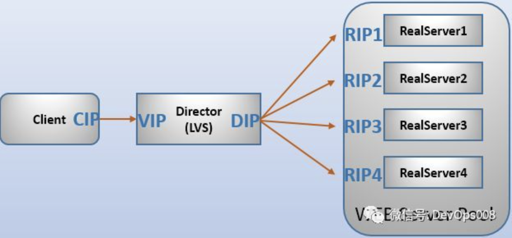
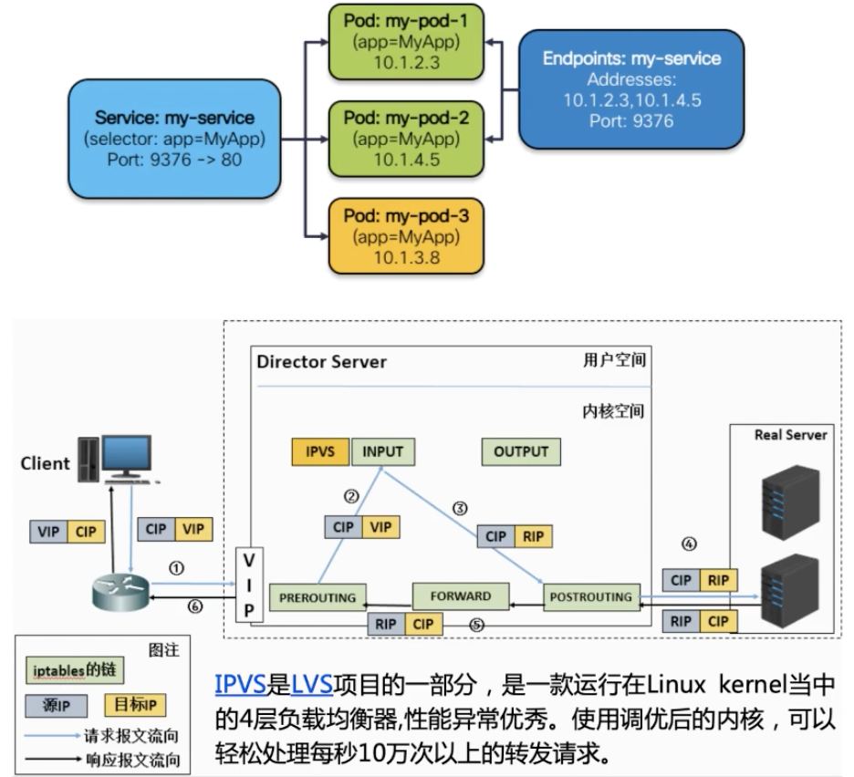

# 名词概念

## LVS

LVS（Linux Virtual Server）即Linux虚拟服务器，是一个虚拟的服务器集群系统，由[章文嵩](https://baike.baidu.com/item/%E7%AB%A0%E6%96%87%E5%B5%A9)博士在1998年5月成立，在linux2.6+后将lvs自动加入了kernel模块。

LVS的用户空间的命令行管理工具为ipvsadm，ipvs是工作在内核中netfilter的INPUT的钩子函数上，对进入的报文在没有进入用户空间前，对这些报文进行操作。

## IPVS

IPVS是LVS（Linux Virtual Server）项目重要组成部分，目前包含于官方Linux Kernel，IPVS依赖于netfilter框架，位于内核源码的net/netfilter/ipvs目录下。

[IPVS](http://www.linuxvirtualserver.org/software/ipvs.html)是[LVS](http://www.linuxvirtualserver.org/)项目的一部分，是一款运行在Linux kernel当中的4层负载均衡器，性能异常优秀。 

## RS

realserver，常简称为RS

## NAT

网络地址转换(Network Address Translate)

## SNAT

原地址转换

## DNAT

目标地址转换

## 几种IP



### VIP

virtual IP，LVS服务器上接收外网数据包的网卡IP地址。

### DIP

director IP，LVS服务器上转发数据包到realserver的网卡IP地址。

### RIP

realserver(常简称为RS)上接收Director转发数据包的IP，即提供服务的服务器IP。

CIP:客户端的IP。


# IPVS的三种转发模式

## DR模式(Direct Routing)

DR模式下，客户端的请求包到达负载均衡器的虚拟服务IP端口后，负载均衡器不会改写请求包的IP和端口，但是会改写请求包的MAC地址为后端RS的MAC地址，然后将数据包转发；真实服务器处理请求后，响应包直接回给客户端，不再经过负载均衡器。所以DR模式的转发效率是最高的，特别适合下行流量较大的业务场景，比如请求视频等大文件。

## NAT模式(Network Address Translation)

NAT模式下，请求包和响应包都需要经过LB处理。当客户端的请求到达虚拟服务后，LB会对请求包做目的地址转换（DNAT），将请求包的目的IP改写为RS的IP。当收到RS的响应后，LB会对响应包做源地址转换（SNAT），将响应包的源IP改写为LB的IP。

## TUN模式

采用NAT技术时，由于请求和响应报文都必须经过调度器地址重写，当客户请求越来越多时，调度器的处理能力将成为瓶颈。为了解决这个问题，调度器把请求报文通过IP隧道转发至真实服务器，而真实服务器将响应直接返回给客户，所以调度器只处理请求报文。由于一般网络服务响应报文比请求报文大许多，采用VS/TUN技术后，调度器得到极大的解放，集群系统的最大吞吐量可以提高10倍。

## FULLNAT模式

FULLNAT模式下，LB会对请求包和响应包都做SNAT+DNAT。

# 转发模式对比

三种转发模式性能从高到低：DR > NAT >FULLNAT。

 虽然FULLNAT模式的性能比不上DR和NAT，但是FULLNAT模式没有组网要求，允许LB和RS部署在不同的子网中，这给运维带来了便利。并且 FULLNAT模式具有更好的可拓展性，可以通过增加更多的LB节点，提升系统整体的负载均衡能力。


# IPVS实现Service

## 背景知识

一定要让Kernel认为VIP是本地地址，这样4层的LVS才能开始工作。

## 网络结构



## 步骤

1、绑定VIP到本地（欺骗内核）

```shell
# ip route add to local 192.168.60.200/32 dev eth0proto kernel
```
2、为该虚IP创建一个IPVS的virtual server
```shell
# ipvsadm -A -t 192.168.60.200:9376 -s rr -p 600
```
3、为该IPVS service创建相应的real server
```shell
# ipvsadm -A -t 192.168.60.200:9376 -r 10.1.2.3:80 -m
# ipvsadm -A -t 192.168.60.200:9376 -r 10.1.4.5:80 -m
# ipvsadm -A -t 192.168.60.200:9376 -r 10.1.3.8:80 -m
```


# Reference

[Linux负载均衡LVS（IPVS）](https://www.cnblogs.com/lipengxiang2009/p/7349271.html)

[应用负载均衡之LVS(一)：基本概念和三种模式](https://www.sohu.com/a/223150286_744906)

[IPVS实现Service](https://www.bilibili.com/video/BV1XJ411s7cd?spm_id_from=333.999.0.0)
