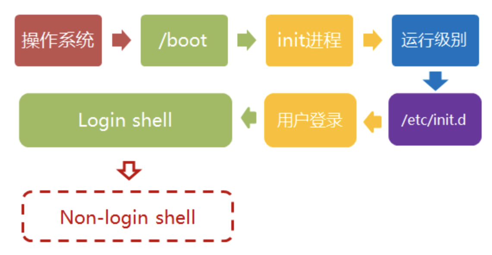

# 概述



# 1、加载内核

操作系统接管硬件以后，首先读入 /boot 目录下的内核文件。

```shell
ll /boot
```

# 2、启动初始化进程

内核文件加载以后，就开始运行第一个程序 /sbin/init，它的作用是初始化系统环境。

进程编号（pid）就是1。其他所有进程都从它衍生，都是它的子进程

# 3、确定运行级别

许多程序需要开机启动。它们在Windows叫做"服务"（service），在Linux就叫做守护进程（daemon）。

Linux预置七种运行级别（0-6）。一般来说，0是关机，1是单用户模式（也就是维护模式），6是重启。运行级别2-5，各个发行版不太一样，对于Debian来说，都是同样的多用户模式（也就是正常模式）。

init进程首先读取文件 /etc/inittab，它是运行级别的设置文件。如果你打开它，可以看到第一行是这样的：

```java
id:2:initdefault:
```
表明系统启动时的运行级别为2。
运行级别为2的程序清单在/etc目录下面

```java
/etc/rc0.d
/etc/rc1.d
/etc/rc2.d
...
```
"rc"，表示run command（运行程序）、d表示directory（目录）
```shell
ls /etc/rc2.d

   README
　　S01motd
　　S13rpcbind
　　S14nfs-common
　　S16binfmt-support
　　S16rsyslog
　　S16sudo
　　S17apache2
　　S18acpid
　　...
```
除了第一个文件README以外，其他文件名都是"**字母S+两位数字+程序名**"的形式。
S表示Start，K表示Kill。

如果想修改程序不建议修改该目录，可以参考：[Debian Admin - Manage init](http://www.debianadmin.com/manage-linux-init-or-startup-scripts.html) 和 [Debian Admin - Remove Services](http://www.debianadmin.com/remove-unwanted-startup-files-or-services-in-debian.html)

# 4、加载开机启动程序

如果有多个运行级别的程序需要启动，为了避免拷贝，设置文件链接指向目录 /etc/init.d ，真正的启动脚本都统一放在这个目录中。init进程会运行这个目录里的启动脚本逐一加载开机启动程序。

```shell
ls -l /etc/rc2.d
# 能看到链接
```
另外一个好处，直接使用 /etc/init.d下的链接文件直接启动或者关闭程序，不必到真实路径下查找。如：
```shell
sudo /etc/init.d/apache2 restart
```
/etc/init.d 这个目录名最后一个字母d，表示目录（directory），用来与程序 /etc/init 区分。
# 5、用户登录

用户的登录方式有三种：

1）命令行登录

init进程调用getty程序（意为get teletype），让用户输入用户名和密码。输入完成后，再调用login程序，核对密码（Debian还会再多运行一个身份核对程序/etc/pam.d/login）。如果密码正确，就从文件 /etc/passwd 读取该用户指定的shell，然后启动这个shell。

2）ssh登录

这时系统调用sshd程序（Debian还会再运行/etc/pam.d/ssh ），取代getty和login，然后启动shell。

3）图形界面登录

init进程调用显示管理器，Gnome图形界面对应的显示管理器为gdm（GNOME Display Manager），然后用户输入用户名和密码。如果密码正确，就读取/etc/gdm3/Xsession，启动用户的会话。

# 6、进入 login shell

shell就是命令行界面，让用户可以直接与操作系统对话。用户登录时打开的shell，就叫做login shell。

1）命令行登录

首先读入 /etc/profile，这是对所有用户都有效的配置；然后依次寻找下面三个文件，这是针对当前用户的配置。

```java
~/.bash_profile
~/.bash_login
~/.profile
```
注意：**这三个文件只要有一个存在，就不再读入后面的文件**。
2）ssh登录：

与命令行登录完全相同。

3）图形界面登录

**只加载 /etc/profile 和 ~/.profile。也就是说，~/.bash_profile 不管有没有，都不会运行。**

# 7、打开 non-login shell

用户进入操作系统以后，常常会再手动开启一个shell。这个shell就叫做 non-login shell，意思是它不同于登录时出现的那个shell，不读取/etc/profile和.profile等配置文件。

**non-login shell 会读入用户自己的bash配置文件 ~/.bashrc。**

如果不进入 non-login shell，.bashrc会通过 ~/.profile文件运行，如下.profile文件内容：

```plain
　　if [ -n "$BASH_VERSION" ]; then
　　　　if [ -f "$HOME/.bashrc" ]; then
　　　　　　. "$HOME/.bashrc"
　　　　fi
　　fi　　
```
上面代码先判断变量 $BASH_VERSION 是否有值，然后判断主目录下是否存在 .bashrc 文件，如果存在就运行该文件。第三行开头的那个点，是source命令的简写形式，表示运行某个文件，写成"source ~/.bashrc"也是可以的。
因此，**只要运行～/.profile文件，～/.bashrc文件就会连带运行**。但是上一节的第一种情况提到过，如果存在～/.bash_profile文件，那么有可能不会运行～/.profile文件。解决这个问题很简单，把下面代码写入.bash_profile就行了。

```plain
　　if [ -f ~/.profile ]; then
　　　　. ~/.profile
　　fi　
```
这样一来，不管是哪种情况，.bashrc都会执行，用户的设置可以放心地都写入这个文件了。
Bash的设置之所以如此繁琐，是由于历史原因造成的。早期的时候，计算机运行速度很慢，载入配置文件需要很长时间，Bash的作者只好把配置文件分成了几个部分，阶段性载入。系统的通用设置放在 /etc/profile，用户个人的、需要被所有子进程继承的设置放在.profile，不需要被继承的设置放在.bashrc。

顺便提一下，除了Linux以外， Mac OS X 使用的shell也是Bash。但是，它只加载 .bash_profile，然后在.bash_profile里面调用.bashrc。而且，不管是ssh登录，还是在图形界面里启动shell窗口，都是如此。 

# Reference

[Linux的启动过程](https://www.ruanyifeng.com/blog/2013/08/linux_boot_process.html)
