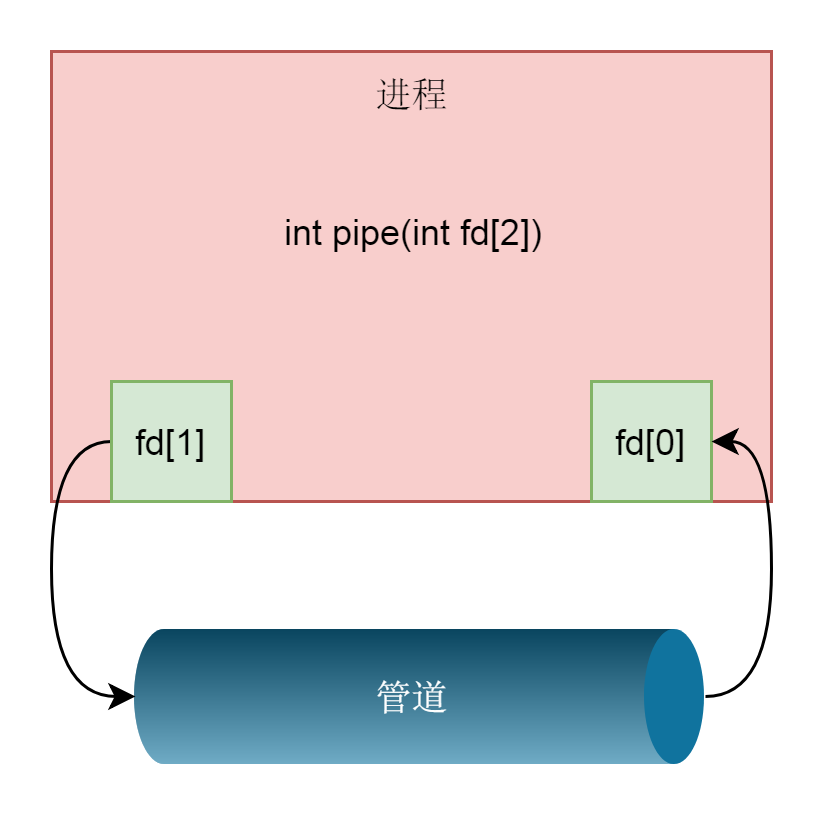
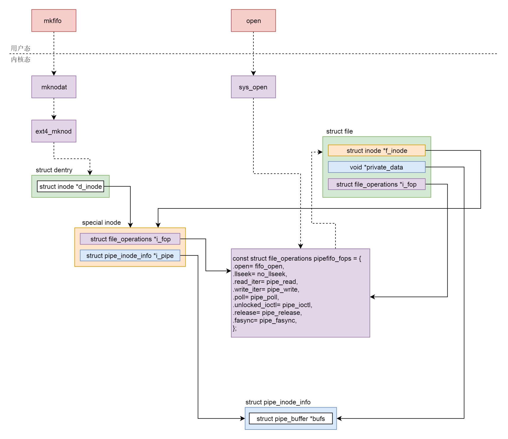
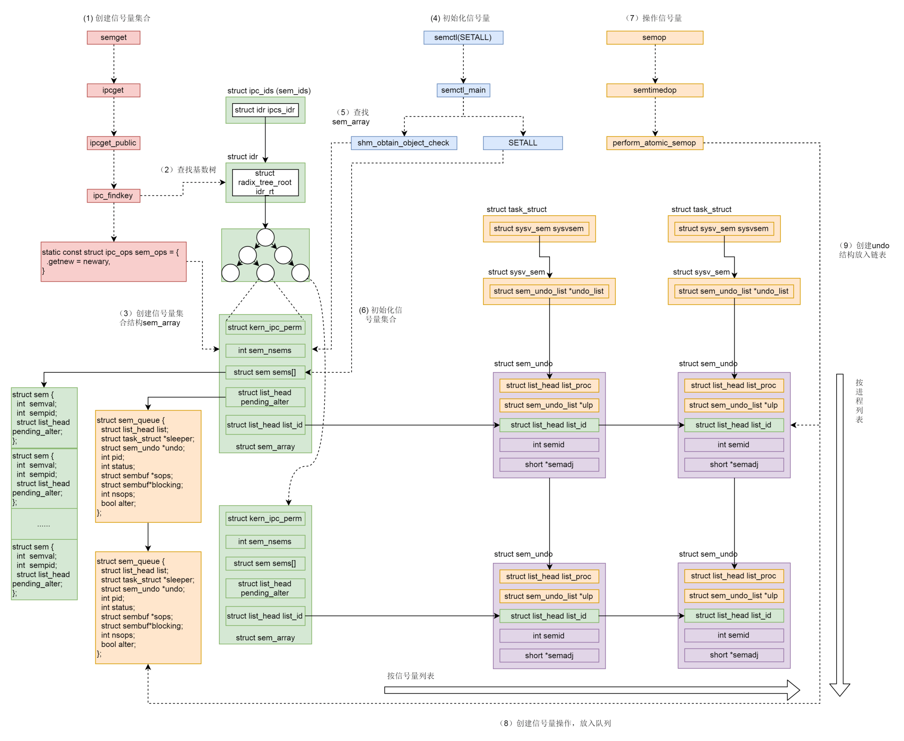
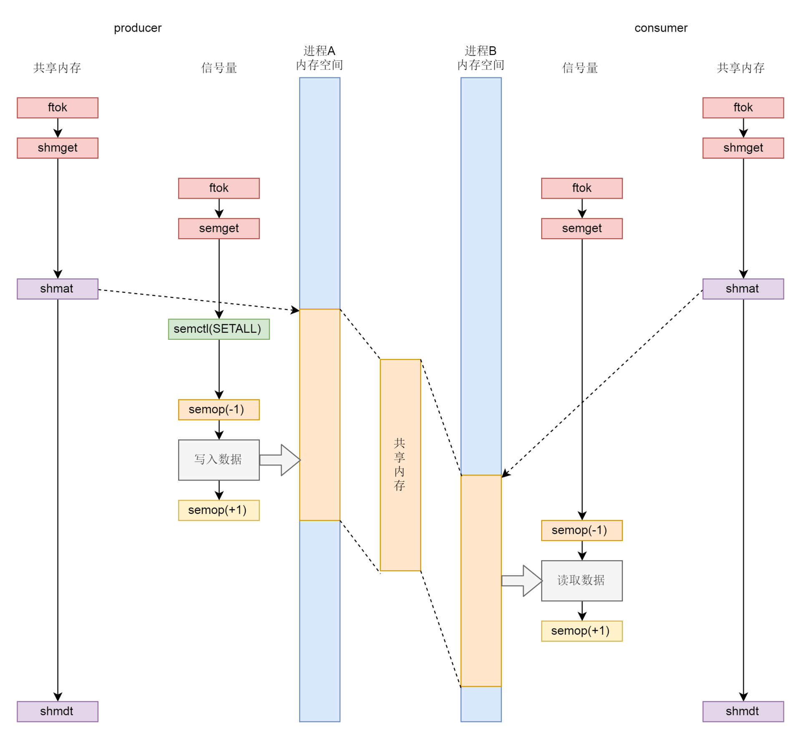
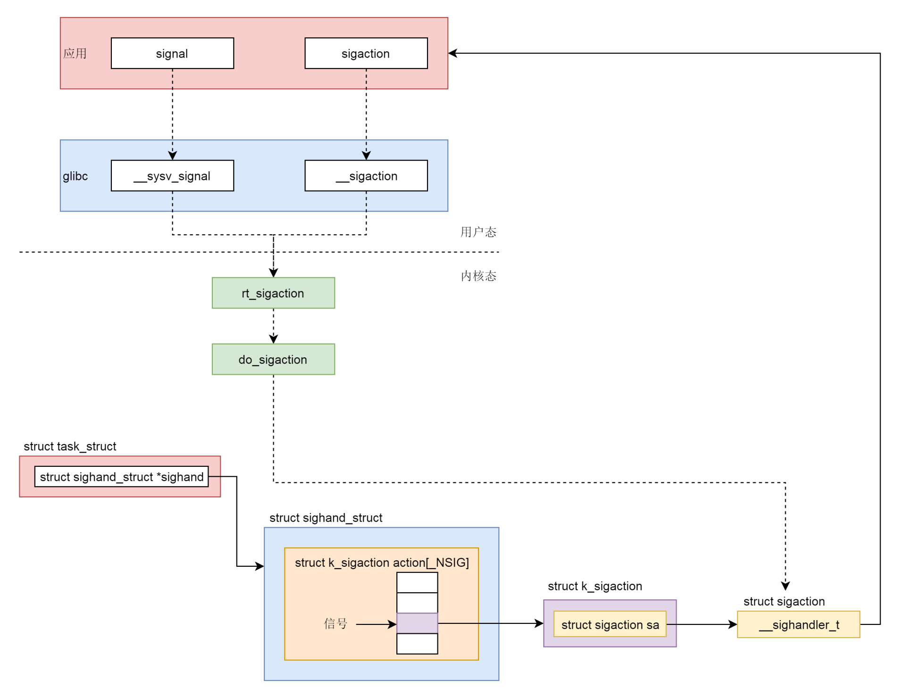

# 简述

IPC（Inter-Process	 Communication，进程间通信）。进程间通信是指两个进程的数据之间产生交互


# 进程间通信方式

有如下几种方式：

* 管道/匿名管道(pipe)
* 命名管道(FIFO)
* 消息队列
* 共享内存
* 信号量
* 信号
* 套接字

# 管道/匿名管道(pipe)

匿名管道（Anonymous Pipes），即将多个命令串起来的竖线，背后的原理到底是什么。

如

```shell
ps -ef |grep xxx |awk '{print $2}'|xargs kill -9
```

创建管道，系统调用

```c++
int pipe(int fd[2])
```
创建管道 pipe，返回了两个文件描述符，表示管道的两端，一个是管道的读取端描述符 fd[0]，另一个是管道的写入端描述符 fd[1]。


所谓的匿名管道，其实就是内核里面的一串缓存。

无论是匿名管道，还是命名管道，在内核都是一个文件。只要是文件就要有一个 inode。这里又用到了特殊 inode、字符设备、块设备，其实都是这种特殊的 inode。

在这种特殊的 inode 里面，file_operations 指向管道特殊的 pipefifo_fops，这个 inode 对应内存里面的缓存。

当用文件的 open 函数打开这个管道设备文件的时候，会调用 pipefifo_fops 里面的方法创建 struct file 结构，inode 指向特殊的 inode，也对应内存里面的缓存，file_operations 也指向管道特殊的 pipefifo_fops。

写入一个 pipe 就是从 struct file 结构找到缓存写入，读取一个 pipe 就是从 struct file 结构找到缓存读出。




# 命名管道(FIFO)

通过 `mkdifo` 命令显示创建

```shell
$ mkfifo hello_pipe
$ ls -l 
prw-r--r-- 1 root root 0 May 21 23:29 hello_pipe
# 文件类型 p，表示 pipe

```
测试
```shell
# 终端1
echo "hello world" > hello_pipe # 阻塞

# 终端2
$ echo < hello_pipe # 终端1 命令退出
hello world 
```

# 消息队列

## 结构体

```c++
struct msg_buffer {
    long mtype;
    char mtext[1024];
};
```

## 创建消息队列

```c++
#include <stdio.h>
#include <stdlib.h>
#include <sys/msg.h>

int main() {
  int messagequeueid;
  key_t key;


  if((key = ftok("/root/messagequeue/messagequeuekey", 1024)) < 0)
  {
      perror("ftok error");
      exit(1);
  }

  printf("Message Queue key: %d.
", key);

  if ((messagequeueid = msgget(key, IPC_CREAT|0777)) == -1)
  {
      perror("msgget error");
      exit(1);
  }

  printf("Message queue id: %d.
", messagequeueid);
}
```
运行上面的程序
```shell
$ ./a.out
Message Queue key: 92536.
Message queue id: 32768.
```
msgget 函数；
ftok（file to key）会根据文件的 inode 生成近乎唯一的 key。

这些都属于 System V IPC 进程间通信机制体系。

System V IPC 体系有一个统一的命令行工具：ipcmk，ipcs 和 ipcrm 用于创建、查看和删除 IPC 对象。

```shell
$ ipcs -q  # 查看创建的消息队列对象
------ Message Queues --------
key        msqid      owner      perms      used-bytes   messages    
0x00016978 32768      root       777        0            0
```
## 发送消息

```c++
#include <stdio.h>
#include <stdlib.h>
#include <sys/msg.h>
#include <getopt.h>
#include <string.h>

struct msg_buffer {
    long mtype;
    char mtext[1024];
};

int main(int argc, char *argv[]) {
  int next_option;
  const char* const short_options = "i:t:m:";
  const struct option long_options[] = {
    { "id", 1, NULL, 'i'},
    { "type", 1, NULL, 't'},
    { "message", 1, NULL, 'm'},
    { NULL, 0, NULL, 0 }
  };
  
  int messagequeueid = -1;
  struct msg_buffer buffer;
  buffer.mtype = -1;
  int len = -1;
  char * message = NULL;
  do {
    next_option = getopt_long (argc, argv, short_options, long_options, NULL);
    switch (next_option)
    {
      case 'i':
        messagequeueid = atoi(optarg);
        break;
      case 't':
        buffer.mtype = atol(optarg);
        break;
      case 'm':
        message = optarg;
        len = strlen(message) + 1;
        if (len > 1024) {
          perror("message too long.");
          exit(1);
        }
        memcpy(buffer.mtext, message, len);
        break;
      default:
        break;
    }
  }while(next_option != -1);

  if(messagequeueid != -1 && buffer.mtype != -1 && len != -1 && message != NULL){
    if(msgsnd(messagequeueid, &buffer, len, IPC_NOWAIT) == -1){
      perror("fail to send message.");
      exit(1);
    }
  } else {
    perror("arguments error");
  }
  return 0;
}
```
发送消息主要调用 msgsnd 函数。第一个参数是 message queue 的 id，第二个参数是消息的结构体，第三个参数是消息的长度，最后一个参数是 flag。这里 IPC_NOWAIT 表示发送的时候不阻塞，直接返回。
getopt_long、do-while 循环以及 switch，是用来解析命令行参数的。命令行参数的格式定义在 long_options 里面。每一项的第一个成员“id”“type”“message”是参数选项的全称，第二个成员都为 1，表示参数选项后面要跟参数，最后一个成员’i’‘t’'m’是参数选项的简称。

编译并运行这个发送程序

```shell
gcc -o send sendmessage.c
./send -i 32768 -t 123 -m "hello world"
```

## 接收消息

```c++

#include <stdio.h>
#include <stdlib.h>
#include <sys/msg.h>
#include <getopt.h>
#include <string.h>

struct msg_buffer {
    long mtype;
    char mtext[1024];
};

int main(int argc, char *argv[]) {
  int next_option;
  const char* const short_options = "i:t:";
  const struct option long_options[] = {
    { "id", 1, NULL, 'i'},
    { "type", 1, NULL, 't'},
    { NULL, 0, NULL, 0 }
  };
  
  int messagequeueid = -1;
  struct msg_buffer buffer;
  long type = -1;
  do {
    next_option = getopt_long (argc, argv, short_options, long_options, NULL);
    switch (next_option)
    {
      case 'i':
        messagequeueid = atoi(optarg);
        break;
      case 't':
        type = atol(optarg);
        break;
      default:
        break;
    }
  }while(next_option != -1);

  if(messagequeueid != -1 && type != -1){
    if(msgrcv(messagequeueid, &buffer, 1024, type, IPC_NOWAIT) == -1){
      perror("fail to recv message.");
      exit(1);
    }
    printf("received message type : %d, text: %s.", buffer.mtype, buffer.mtext);
  } else {
    perror("arguments error");
  }
  return 0;
}
```
收消息主要调用 msgrcv 函数，第一个参数是 message queue 的 id，第二个参数是消息的结构体，第三个参数是可接受的最大长度，第四个参数是消息类型, 最后一个参数是 flag，这里 IPC_NOWAIT 表示接收的时候不阻塞，直接返回。
编译并运行这个发送程序。可以看到，如果有消息，可以正确地读到消息；如果没有，则返回没有消息。

```shell
$ ./recv -i 32768 -t 123
received message type : 123, text: hello world.
$ ./recv -i 32768 -t 123
fail to recv message.: No message of desired type
```

# 共享内存(share memory)

共享内存也是 System V IPC 进程间通信机制体系中的。

## 创建共享内存

创建一个共享内存，调用 shmget。在这个体系中，创建一个 IPC 对象都是 xxxget，第一个参数是 key，和 msgget 里面的 key 一样，都是唯一定位一个共享内存对象，也可以通过关联文件的方式实现唯一性。第二个参数是共享内存的大小。第三个参数如果是 IPC_CREAT，同样表示创建一个新的。

```shell
int shmget(key_t key, size_t size, int flag);
```
创建完毕之后，可以通过 ipcs 命令查看这个共享内存。
```shell
$ ipcs ­­--shmems
------ Shared Memory Segments ------ ­­­­­­­­
key        shmid    owner perms    bytes nattch status
0x00000000 19398656 marc  600    1048576 2      dest
```

## 访问共享内存

一个进程想要访问这一段共享内存，需要将内存加载到虚拟地址空间的某个位置，通过 shmat 函数，就是 attach 的意思。其中 addr 就是要指定 attach 到这个地方。这个地址的设定难度比较大，除非对于内存布局非常熟悉，否则可能会 attach 到一个非法地址。通常的做法是将 addr 设为 NULL，让内核选一个合适的地址。返回值就是真正被 attach 的地方。

```shell
void *shmat(int shm_id, const void *addr, int flag);
```

## 删除共享内存

共享内存使用完毕，可以通过 shmdt 解除绑定，然后通过 shmctl，将 cmd 设置为 IPC_RMID，从而删除这个共享内存对象。

```shell
int shmdt(void *addr); 
int shmctl(int shm_id, int cmd, struct shmid_ds *buf);
```

## 共享内存的创建和映射小结

1、调用 shmget 创建共享内存。

2、先通过 ipc_findkey 在基数树中查找 key 对应的共享内存对象 shmid_kernel 是否已经被创建过，如果已经被创建，就会被查询出来，例如 producer 创建过，在 consumer 中就会查询出来。

3、如果共享内存没有被创建过，则调用 shm_ops 的 newseg 方法，创建一个共享内存对象 shmid_kernel。例如，在 producer 中就会新建。

4、在 shmem 文件系统里面创建一个文件，共享内存对象 shmid_kernel 指向这个文件，这个文件用 struct file 表示，我们姑且称它为 file1。

5、调用 shmat，将共享内存映射到虚拟地址空间。

6、shm_obtain_object_check 先从基数树里面找到 shmid_kernel 对象。

7、创建用于内存映射到文件的 file 和 shm_file_data，这里的 struct file 我们姑且称为 file2。

8、关联内存区域 vm_area_struct 和用于内存映射到文件的 file，也即 file2，调用 file2 的 mmap 函数。

9、file2 的 mmap 函数 shm_mmap，会调用 file1 的 mmap 函数 shmem_mmap，设置 shm_file_data 和 vm_area_struct 的 vm_ops。

10、内存映射完毕之后，其实并没有真的分配物理内存，当访问内存的时候，会触发缺页异常 do_page_fault。

11、vm_area_struct 的 vm_ops 的 shm_fault 会调用 shm_file_data 的 vm_ops 的 shmem_fault。

12、在 page cache 中找一个空闲页，或者创建一个空闲页。

# 信号量(semaphore)

如果两个进程 attach 同一个共享内存，很有可能冲突。

需要一种保护机制，使得同一个共享的资源，同时只能被一个进程访问。在 System V IPC 进程间通信机制体系中，早就想好了应对办法，就是信号量（Semaphore）。因此，**信号量和共享内存往往要配合使用（常用模式）**。

信号量其实是一个计数器，主要用于实现进程间的互斥与同步，而不是用于存储进程间通信数据。

将信号量初始化为一个数值，来代表某种资源的总体数量。对于信号量来讲，会定义两种原子操作，一个是**P 操作**，我们称为**申请资源操作**。这个操作会申请将信号量的数值减去 N，表示这些数量被他申请使用了，其他人不能用了。另一个是**V 操作**，我们称为**归还资源操作**，这个操作会申请将信号量加上 M，表示这些数量已经还给信号量了，其他人可以使用了。

## 创建信号量

创建信号量可以通过 semget 函数（都是 xxxget）。第一个参数 key 也是类似的，第二个参数 num_sems 不是指资源的数量，而是表示可以创建多少个信号量，形成一组信号量，也就是说，如果你有多种资源需要管理，可以创建一个信号量组。

```shell
int semget(key_t key, int num_sems, int sem_flags);
```
接下来初始化信号量的总的资源数量。通过 semctl 函数，第一个参数 semid 是这个信号量组的 id，第二个参数 semnum 才是在这个信号量组中某个信号量的 id，第三个参数是命令，如果是初始化，则用 SETVAL，第四个参数是一个 union。如果初始化，应该用里面的 val 设置资源总量。
```shell
int semctl(int semid, int semnum, int cmd, union semun args);
union semun
{
  int val;
  struct semid_ds *buf;
  unsigned short int *array;
  struct seminfo *__buf;
};
```

## pv操作

无论是 P 操作还是 V 操作，统一用 semop 函数。第一个参数还是信号量组的 id，一次可以操作多个信号量。第三个参数 numops 就是有多少个操作，第二个参数将这些操作放在一个数组中。

数组的每一项是一个 struct sembuf，里面的第一个成员是这个操作的对象是哪个信号量。

第二个成员就是要对这个信号量做多少改变。如果 sem_op < 0，就请求 sem_op 的绝对值的资源。如果相应的资源数可以满足请求，则将该信号量的值减去 sem_op 的绝对值，函数成功返回。

当相应的资源数不能满足请求时，就要看 sem_flg 了。如果把 sem_flg 设置为 IPC_NOWAIT，也就是没有资源也不等待，则 semop 函数出错返回 EAGAIN。如果 sem_flg 没有指定 IPC_NOWAIT，则进程挂起，直到当相应的资源数可以满足请求。若 sem_op > 0，表示进程归还相应的资源数，将 sem_op 的值加到信号量的值上。如果有进程正在休眠等待此信号量，则唤醒它们。

```shell
int semop(int semid, struct sembuf semoparray[], size_t numops);
struct sembuf 
{
  short sem_num; // 信号量组中对应的序号，0～sem_nums-1
  short sem_op;  // 信号量值在一次操作中的改变量
  short sem_flg; // IPC_NOWAIT, SEM_UNDO
}
```
信号量和共享内存都比较复杂，两者还要结合起来用，就更加复杂，它们内核的机制就更加复杂。
## 信号量的机制小结



1、调用 semget 创建信号量集合。

2、ipc_findkey 会在基数树中，根据 key 查找信号量集合 sem_array 对象。如果已经被创建，就会被查询出来。例如 producer 被创建过，在 consumer 中就会查询出来。

3、如果信号量集合没有被创建过，则调用 sem_ops 的 newary 方法，创建一个信号量集合对象 sem_array。例如，在 producer 中就会新建。

4、调用 semctl(SETALL) 初始化信号量。

5、sem_obtain_object_check 先从基数树里面找到 sem_array 对象。

6、根据用户指定的信号量数组，初始化信号量集合，也即初始化 sem_array 对象的 struct sem sems[]成员。

7、调用 semop 操作信号量。

8、创建信号量操作结构 sem_queue，放入队列。

9、创建 undo 结构，放入链表。


## 共享内存和信号量

共享内存和信号量的配合机制

* 无论是共享内存还是信号量，创建与初始化都遵循同样流程，通过 ftok 得到 key，通过 xxxget 创建对象并生成 id；
* 生产者和消费者都通过 shmat 将共享内存映射到各自的内存空间，在不同的进程里面映射的位置不同；
* 为了访问共享内存，需要信号量进行保护，信号量需要通过 semctl 初始化为某个值；
* 接下来生产者和消费者要通过 semop(-1) 来竞争信号量，如果生产者抢到信号量则写入，然后通过 semop(+1) 释放信号量，如果消费者抢到信号量则读出，然后通过 semop(+1) 释放信号量；
* 共享内存使用完毕，可以通过 shmdt 来解除映射。



# 信号(Signal)

上面讲的进程间通信的方式，都是常规状态下的工作模式，对应到咱们平时的工作交接，收发邮件、联合开发等，其实还有一种异常情况下的工作模式。

例如出现线上系统故障，这个时候，什么流程都来不及了，不可能发邮件，也来不及开会，所有的架构师、开发、运维都要被通知紧急出动。所以，7 乘 24 小时不间断执行的系统都需要有告警系统，一旦出事情，就要通知到人，哪怕是半夜，也要电话叫起来，处理故障。

对应到操作系统中，就是信号。信号没有特别复杂的数据结构，就是用一个代号一样的数字。Linux 提供了几十种信号，分别代表不同的意义。信号之间依靠它们的值来区分。这就像咱们看警匪片，对于紧急的行动，都是说，“1 号作战任务”开始执行，警察就开始行动了。情况紧急，不能啰里啰嗦了。

信号可以在任何时候发送给某一进程，进程需要为这个信号配置信号处理函数。当某个信号发生的时候，就默认执行这个函数就可以了。这就相当于咱们运维一个系统应急手册，当遇到什么情况，做什么事情，都事先准备好，出了事情照着做就可以了。

## 所有信号

```shell
$ kill -l # 查看所有信号
 1) SIGHUP       2) SIGINT       3) SIGQUIT      4) SIGILL       5) SIGTRAP
 6) SIGABRT      7) SIGBUS       8) SIGFPE       9) SIGKILL     10) SIGUSR1
11) SIGSEGV     12) SIGUSR2     13) SIGPIPE     14) SIGALRM     15) SIGTERM
16) SIGSTKFLT   17) SIGCHLD     18) SIGCONT     19) SIGSTOP     20) SIGTSTP
21) SIGTTIN     22) SIGTTOU     23) SIGURG      24) SIGXCPU     25) SIGXFSZ
26) SIGVTALRM   27) SIGPROF     28) SIGWINCH    29) SIGIO       30) SIGPWR
31) SIGSYS      34) SIGRTMIN    35) SIGRTMIN+1  36) SIGRTMIN+2  37) SIGRTMIN+3
38) SIGRTMIN+4  39) SIGRTMIN+5  40) SIGRTMIN+6  41) SIGRTMIN+7  42) SIGRTMIN+8
43) SIGRTMIN+9  44) SIGRTMIN+10 45) SIGRTMIN+11 46) SIGRTMIN+12 47) SIGRTMIN+13
48) SIGRTMIN+14 49) SIGRTMIN+15 50) SIGRTMAX-14 51) SIGRTMAX-13 52) SIGRTMAX-12
53) SIGRTMAX-11 54) SIGRTMAX-10 55) SIGRTMAX-9  56) SIGRTMAX-8  57) SIGRTMAX-7
58) SIGRTMAX-6  59) SIGRTMAX-5  60) SIGRTMAX-4  61) SIGRTMAX-3  62) SIGRTMAX-2
63) SIGRTMAX-1  64) SIGRTMAX
```
可以通过 `man 7 signal` 命令查看,
```shell
Signal     Value     Action   Comment
──────────────────────────────────────────────────────────────────────
SIGHUP        1       Term    Hangup detected on controlling terminal
                              or death of controlling process
SIGINT        2       Term    Interrupt from keyboard
SIGQUIT       3       Core    Quit from keyboard
SIGILL        4       Core    Illegal Instruction


SIGABRT       6       Core    Abort signal from abort(3)
SIGFPE        8       Core    Floating point exception
SIGKILL       9       Term    Kill signal
SIGSEGV      11       Core    Invalid memory reference
SIGPIPE      13       Term    Broken pipe: write to pipe with no
                              readers
SIGALRM      14       Term    Timer signal from alarm(2)
SIGTERM      15       Term    Termination signal
SIGUSR1   30,10,16    Term    User-defined signal 1
SIGUSR2   31,12,17    Term    User-defined signal 2
……
```
每个信号都有唯一的 ID，还有遇到信号的默认操作（Action）。
## 信号处理方式

一旦有信号产生，用户进程对信号的处理方式：

1、执行默认操作。即上面列表中的 Action。如 Term 是终止进程的意思。 Core 是 Core Dump，终止进程后，通过Core Dump 将当前进程的运行状态保存在文件里面，方便事后分析。

2、捕捉信号。我们可以为信号定义一个信号处理函数。当信号发生时，我们就执行相应的信号处理函数。

3、忽略信号。但有两个信号是应用进程无法捕捉和忽略的，即 SIGKILL 和 SEGSTOP，它们用于在任何时候中断或结束某一进程。

## 信号处理流程

信号处理最常见的流程。这个过程主要是分成两步，第一步是注册信号处理函数。第二步是发送信号。

### 信号注册

#### signal

如果不想让某个信号执行默认操作，一种方法就是对特定的信号注册相应的信号处理函数，设置号处理方式的是 **signal** 函数。

```c++
typedef void (*sighandler_t)(int);
sighandler_t signal(int signum, sighandler_t handler);
```
其实就是定义一个方法，并且将这个方法和某个信号关联起来。当这个进程遇到这个信号的时候，就执行这个方法。
signal 的 glibc 实现

```c++

#  define signal __sysv_signal
__sighandler_t
__sysv_signal (int sig, __sighandler_t handler)
{
  struct sigaction act, oact;
......
  act.sa_handler = handler;
  __sigemptyset (&act.sa_mask);
  act.sa_flags = SA_ONESHOT | SA_NOMASK | SA_INTERRUPT;
  act.sa_flags &= ~SA_RESTART;
  if (__sigaction (sig, &act, &oact) < 0)
    return SIG_ERR;
  return oact.sa_handler;
}
weak_alias (__sysv_signal, sysv_signal)
```
sa_flags 进行了默认的设置。SA_ONESHOT 意思就是设置的信号处理函数，仅仅起作用一次。用完了一次就设置回默认行为。
另外一个设置 SA_NOMASK。通过 __sigemptyset，将 sa_mask 设置为空。表示在这个信号处理函数执行过程中，如果再有其他信号（哪怕相同的信号），这个信号处理函数会被中断。

例如，如果是相同的信号，很可能操作的是同一个实例，同步、死锁等问题。一般的思路：某个信号的信号处理函数运行的时候，暂时屏蔽这个信号。屏蔽并不意味着信号一定丢失，而是暂存，这样能够做到信号处理函数对于相同的信号，处理完一个再处理下一个，信号处理函数的逻辑要简单很多。

还有一个设置就是设置了 SA_INTERRUPT，清除了 SA_RESTART。信号的到来时间是不可预期的，有可能程序正在调用某个漫长的系统调用的时候（可以在一台 Linux 机器上运行 man 7 signal 命令，在这里找 Interruption of system calls and library functions by signal handlers 的部分，里面说得非常详细），这个时候一个信号来了，会中断这个系统调用，去执行信号处理函数，那执行完后系统调用怎么处理？

有两种处理方法：一种是 SA_INTERRUPT，即系统调用被中断了，不再重试这个系统调用了，而是直接返回一个 -EINTR 常量，告诉调用方系统调用被信号中断了，但是怎么处理你看着办。这样调用方可以根据自己的逻辑，重新调用或直接返回，这会使得代码非常复杂，在所有系统调用的返回值判断里面，都要特殊判断一下这个值。

另外一种处理方法是 SA_RESTART。这个时候系统调用会被自动重新启动，不需要调用方自己写代码。（当然也可能存在问题，例如从终端读入一个字符'a'，处理'a'字符的时候被信号中断了，等信号处理完毕再次读入一个字符时，如果用户不再输入就阻塞，需要用户再次输入同一个字符。）

因此建议使用 sigaction 函数，根据需要定制参数。

#### sigaction

如果在 Linux 下面执行 `man signal` 的话，会发现 Linux 不建议直接用这个方法，而是改用 sigaction。定义如下：

```c++
int sigaction(int signum, const struct sigaction *act,
                     struct sigaction *oldact);
```
其实它还是将信号和一个动作进行关联，只不过这个动作由一个结构 struct sigaction 表示了。
```c++
struct sigaction {
  __sighandler_t sa_handler;
  unsigned long sa_flags;
  __sigrestore_t sa_restorer;
  sigset_t sa_mask;    /* mask last for extensibility */
};
```
和 signal 类似的是，这里面有 __sighandler_t。但是，其他成员变量可以更加细致地控制信号处理的行为。而 signal 函数没有机会设置这些。这里需要注意的是，signal 不是系统调用，而是 glibc 封装的一个函数。这样就像 man signal 里面写的一样，不同的实现方式，设置的参数会不同，会导致行为的不同。
glibc 里面有个文件 syscalls.list。定义了库函数调用哪些系统调用，这里包含 sigaction。

glibc 中，__sigaction 会调用 __libc_sigaction，并最终调用的系统调用是 rt_sigaction。

```c++
int
__sigaction (int sig, const struct sigaction *act, struct sigaction *oact)
{
......
  return __libc_sigaction (sig, act, oact);
}

int
__libc_sigaction (int sig, const struct sigaction *act, struct sigaction *oact)
{
  int result;
  struct kernel_sigaction kact, koact;

  if (act)
    {
      kact.k_sa_handler = act->sa_handler;
      memcpy (&kact.sa_mask, &act->sa_mask, sizeof (sigset_t));
      kact.sa_flags = act->sa_flags | SA_RESTORER;

      kact.sa_restorer = &restore_rt;
    }

  result = INLINE_SYSCALL (rt_sigaction, 4,
                           sig, act ? &kact : NULL,
                           oact ? &koact : NULL, _NSIG / 8);
  if (oact && result >= 0)
    {
      oact->sa_handler = koact.k_sa_handler;
      memcpy (&oact->sa_mask, &koact.sa_mask, sizeof (sigset_t));
      oact->sa_flags = koact.sa_flags;
      oact->sa_restorer = koact.sa_restorer;
    }
  return result;
}
```
我们的库函数虽然调用的是 sigaction，到了系统调用层，调用的可不是系统调用 sigaction，而是系统调用 rt_sigaction。
```c++
SYSCALL_DEFINE4(rt_sigaction, int, sig,
    const struct sigaction __user *, act,
    struct sigaction __user *, oact,
    size_t, sigsetsize)
{
  struct k_sigaction new_sa, old_sa;
  int ret = -EINVAL;
......
  if (act) {
    if (copy_from_user(&new_sa.sa, act, sizeof(new_sa.sa)))
      return -EFAULT;
  }

  ret = do_sigaction(sig, act ? &new_sa : NULL, oact ? &old_sa : NULL);

  if (!ret && oact) {
    if (copy_to_user(oact, &old_sa.sa, sizeof(old_sa.sa)))
      return -EFAULT;
  }
out:
  return ret;
}
```
在 rt_sigaction 里面将用户态的 struct sigaction 结构，拷贝为内核态的 k_sigaction，然后调用 do_sigaction。进程内核的数据结构里 struct task_struct 里面有一个成员 sighand，里面有一个 action。这是一个数组，下标是信号，内容就是信号处理函数，do_sigaction 就是设置 sighand 里的信号处理函数。
```c++
int do_sigaction(int sig, struct k_sigaction *act, struct k_sigaction *oact)
{
  struct task_struct *p = current, *t;
  struct k_sigaction *k;
  sigset_t mask;
......
  k = &p->sighand->action[sig-1];

  spin_lock_irq(&p->sighand->siglock);
  if (oact)
    *oact = *k;

  if (act) {
    sigdelsetmask(&act->sa.sa_mask,
            sigmask(SIGKILL) | sigmask(SIGSTOP));
    *k = *act;
......
  }

  spin_unlock_irq(&p->sighand->siglock);
  return 0;
}
```
至此，信号处理函数的注册已经完成了。
**信号注册小结**

* 在用户程序里面，有两个函数可以调用，一个是 signal，一个是 sigaction，推荐使用 sigaction。
* 用户程序调用的是 Glibc 里面的函数，signal 调用的是 __sysv_signal，里面默认设置了一些参数，使得 signal 的功能受到了限制，sigaction 调用的是 __sigaction，参数用户可以任意设定。
* 无论是 __sysv_signal 还是 __sigaction，调用的都是统一的一个系统调用 rt_sigaction。
* 在内核中，rt_sigaction 调用的是 do_sigaction 设置信号处理函数。在每一个进程的 task_struct 里面，都有一个 sighand 指向 struct sighand_struct，里面是一个数组，下标是信号，里面的内容是信号处理函数。



### 信号发送处理

有时候，我们在终端输入某些组合键的时候，会给进程发送信号，例如，Ctrl+C 产生 SIGINT 信号，Ctrl+Z 产生 SIGTSTP 信号。

硬件异常也会产生信号。比如，执行了除以 0 的指令，CPU 就会产生异常，然后把 SIGFPE 信号发送给进程。再如，进程访问了非法内存，内存管理模块就会产生异常，然后把信号 SIGSEGV 发送给进程。

注意，同样是硬件产生的，中断和信号的区别：中断要注册中断处理函数，但是中断处理函数是在内核驱动里面的，信号也要注册信号处理函数，但是在用户态进程里面。

对于硬件触发的，无论是中断还是信号，肯定是先到内核的，然后内核对于中断和信号处理方式不同。一个是完全在内核里面处理完毕，一个是将信号放在对应的进程 task_struct 里信号相关的数据结构里面，然后等待进程在用户态去处理。当然有些严重的信号，内核会把进程干掉。中断和信号的严重程度不一样，信号影响的往往是某一个进程，处理慢了或最多也不过这个进程被干掉，而中断影响的是整个系统，一旦中断处理中有了 bug，可能整个 Linux 都挂了。

内核在某些情况下，也会给进程发送信号。例如，向读端已关闭的管道写数据时产生 SIGPIPE 信号，当子进程退出时，我们要给父进程发送 SIG_CHLD 信号等。

最直接的发送信号的方法就是，通过命令 kill 来发送信号了。例如，我们都知道的 `kill -9 pid` 可以发送信号给一个进程，杀死它。

另外，我们还可以通过 kill 或者 sigqueue 系统调用，发送信号给某个进程，也可以通过 tkill 或者 tgkill 发送信号给某个线程。虽然方式多种多样，但是最终都是调用了 do_send_sig_info 函数，将信号放在相应的 task_struct 的信号数据结构中。

各个命令调用链路如下：

* kill->kill_something_info->kill_pid_info->group_send_sig_info->do_send_sig_info
* tkill->do_tkill->do_send_specific->do_send_sig_info
* tgkill->do_tkill->do_send_specific->do_send_sig_info
* rt_sigqueueinfo->do_rt_sigqueueinfo->kill_proc_info->kill_pid_info->group_send_sig_info->do_send_sig_info

do_send_sig_info 会调用 send_signal，进而调用 __send_signal。

进程数据结构中 task_struct 里面的 sigpending。上面的代码先要决定应该用哪个 sigpending。取决于信号是给进程的还是线程的。如果是 kill 发送的，也就是发送给整个进程的，就应该发送给 t->signal->shared_pending。这里面是整个进程所有线程共享的信号。如果是 tkill 发送的，也就是发给某个线程的，应该发给 t->pending。这里面是这个线程的 task_struct 独享的。

struct sigpending 里面有两个成员，一个是集合 sigset_t，表示收到了哪些信号，另一个链表，也表示收到了哪些信号。结构如下：

```c++
struct sigpending {
  struct list_head list;
  sigset_t signal;
};
```
两者的区别
（细节较多，暂略）

**信号的发送与处理流程**

1、假设有一个进程 A，main 函数里面调用系统调用进入内核。

2、按照系统调用的原理，会将用户态栈的信息保存在 pt_regs 里面，也即记住原来用户态是运行到了 line A 的地方。

3、在内核中执行系统调用读取数据。

4、当发现没有什么数据可读取的时候，进入睡眠状态，并且调用 schedule 让出 CPU，这是进程调度第一定律。

5、将进程状态设置为 TASK_INTERRUPTIBLE，可中断的睡眠状态，也即如果有信号来的话，是可以唤醒它的。

6、其他的进程或者 shell 发送一个信号，有四个函数可以调用 kill、tkill、tgkill、rt_sigqueueinfo。

7、四个发送信号的函数，在内核中最终都是调用 do_send_sig_info。

8、do_send_sig_info 调用 send_signal 给进程 A 发送一个信号，其实就是找到进程 A 的 task_struct，或者加入信号集合，为不可靠信号，或者加入信号链表，为可靠信号。

9、do_send_sig_info 调用 signal_wake_up 唤醒进程 A。

10、进程 A 重新进入运行状态 TASK_RUNNING，根据进程调度第一定律，一定会接着 schedule 运行。

11、进程 A 被唤醒后，检查是否有信号到来，如果没有，重新循环到一开始，尝试再次读取数据，如果还是没有数据，再次进入 TASK_INTERRUPTIBLE，即可中断的睡眠状态。

12、当发现有信号到来的时候，就返回当前正在执行的系统调用，并返回一个错误表示系统调用被中断了。

13、系统调用返回的时候，会调用 exit_to_usermode_loop。这是一个处理信号的时机。

14、调用 do_signal 开始处理信号。

15、根据信号，得到信号处理函数 sa_handler，然后修改 pt_regs 中的用户态栈的信息，让 pt_regs 指向 sa_handler。同时修改用户态的栈，插入一个栈帧 sa_restorer，里面保存了原来的指向 line A 的 pt_regs，并且设置让 sa_handler 运行完毕后，跳到 sa_restorer 运行。

16、返回用户态，由于 pt_regs 已经设置为 sa_handler，则返回用户态执行 sa_handler。

17、sa_handler 执行完毕后，信号处理函数就执行完了，接着根据第 15 步对于用户态栈帧的修改，会跳到 sa_restorer 运行。

18、sa_restorer 会调用系统调用 rt_sigreturn 再次进入内核。

19、在内核中，rt_sigreturn 恢复原来的 pt_regs，重新指向 line A。

20、从 rt_sigreturn 返回用户态，还是调用 exit_to_usermode_loop。

21、这次因为 pt_regs 已经指向 line A 了，于是就到了进程 A 中，接着系统调用之后运行，当然这个系统调用返回的是它被中断了，没有执行完的错误。

# 套接字(socket)

# Reference

[https://www.jianshu.com/p/c1015f5ffa74](https://www.jianshu.com/p/c1015f5ffa74)
