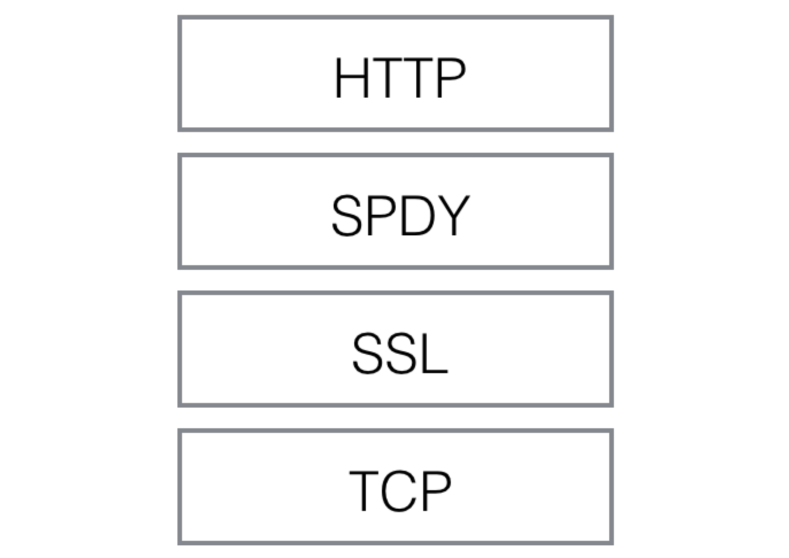
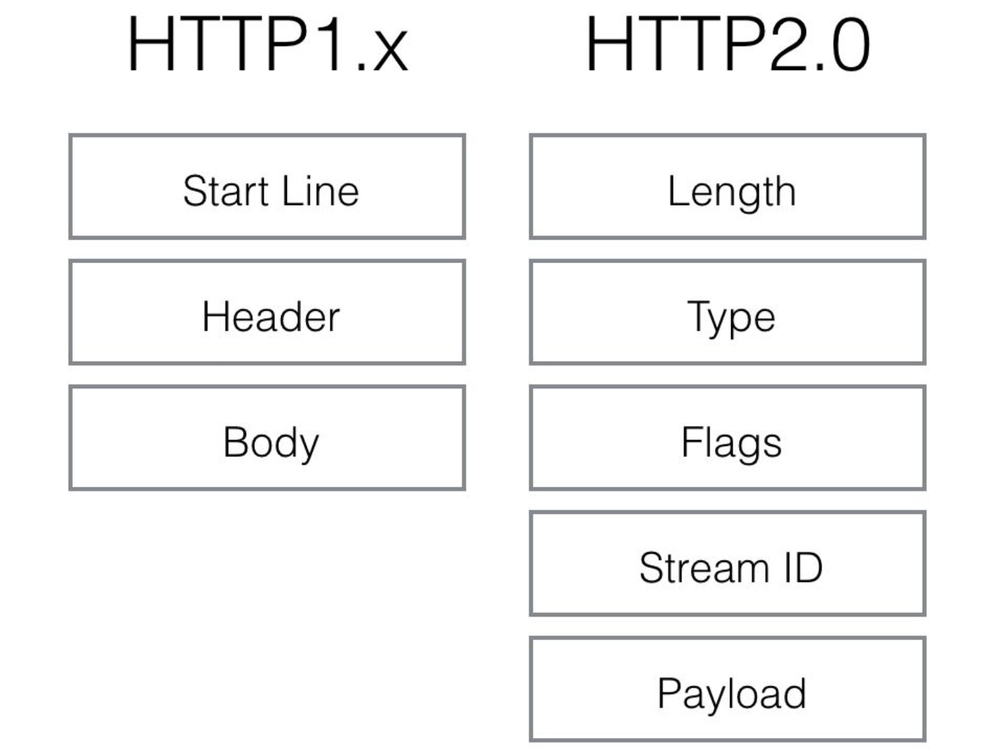
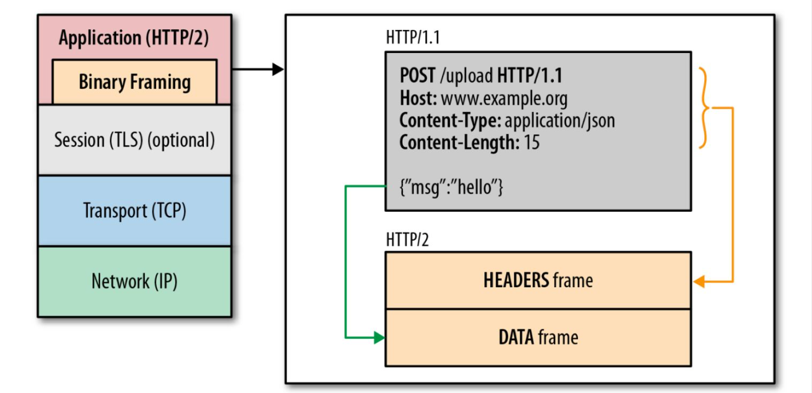
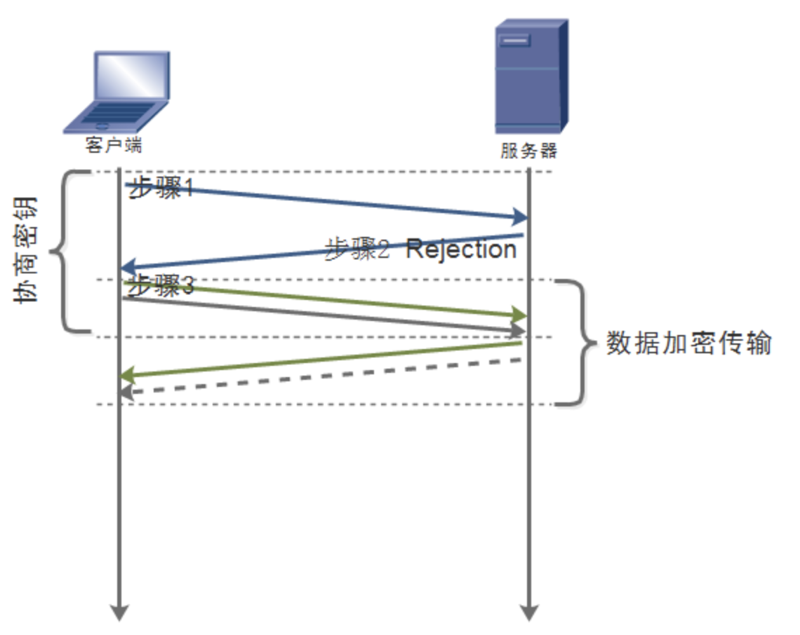

# HTTP/1.0

无状态无连接的应用层协议

* 无状态：服务不跟踪不记录请求过的状态
* 无连接：浏览器每次请求都需要建立 TCP 连接
HTTP/1.0 规定浏览器和服务器保持短暂的连接。浏览器的每次请求都需要与服务器建立一个TCP连接，服务器处理完成后立即断开 TCP 连接（**无连接**），服务器不跟踪每个客户端也不记录过去的请求（**无状态**）。无状态导致的问题可以借助 cookie/session 机制来做身份认证和状态记录解决。

 

然而，无连接特性将会导致以下性能缺陷：

1. 无法复用连接。每次发送请求都需要进行一次 TCP 连接，而 TCP 连接和释放都比较麻烦，会导致网络的利用率非常低。
2. 队头堵塞(head of line blocking)。由于 HTTP/1.0 规定下一个请求必须在前一个请求响应到达之前才能发送。假设一个请求响应一直不到达，那么下一个请求就不发送，就到导致阻塞后面的请求。
 为了解决这些问题，HTTP/1.1出现了。

# HTTP/1.1

HTTP/1.1 的改进：

## 长连接

>增加了一个 Connection 字段，设置为 keep-alive（默认值）可以保持连接不断开，避免每次请求都要重新建立 TCP 连接。客户端关闭连接可通过设置 Connection: fase 来告诉服务器关闭请求。

## 请求管道化

支持请求管道化，即 pipelining

>基于 HTTP/1.1 的长连接，使得请求管线化成为可能。管线化使得请求能够“并行”传输。举个例子来说，假如响应的主体是一个html页面，页面中包含了很多图片，这时 keep-alive 能够进行“并行”发送多个请求。

注意：这里的“并行”并不是真正的并行。服务器必须按照客户端请求的先后顺序依次回送相应的结果，以保证客户端能够区分出每次请求的响应内容。

可见，HTTP/1.1还是无法解决队头阻塞（head of line blocking）的问题。同时“管道化”技术存在各种各样的问题，所以很多浏览器要么根本不支持它，要么就直接默认关闭，并且开启的条件很苛刻，实际上好像并没有什么用处。

补充：在 Chrome 等浏览器控制台看到的并行请求是通过允许打开多个 TCP 会话来实现的真正的并行。

## 缓存处理

## 断点传输

>cache-control 字段

## Host

>一个服务器能够利用 Host 字段用来创建多个Web站点

# SPDY

## 背景

虽然 HTTP1.0 和 HTTP 1.1 存在这么多问题，业界也是想出了各种优化手段，但都是治标不治本，直到 SPDY 的诞生。 

SPDY 是由 Google 在2020年提出的方案，改进版本的HTTP1.1 （那时候还没有HTTP2）。它基于TCP协议，在HTTP的基础上，结合HTTP1.X的多个痛点进行改进和升级的产物。它的出现让大家开始从正面看待和解决老版本 HTTP 协议本身的问题，使web的加载速度有极大的提高。HTTP2也借鉴了很多 SPDY 的特性。

## 目标

SPDY 的目标在于解决 HTTP 的缺陷，即延迟和安全性。我们上面一直在讨论延迟，至于安全性，虽然我们上面没有具体聊，不过 HTTP 的明文传输确是个问题。如果以降低延迟为目标，应用层的 HTTP 和传输层的 TCP 都是都有调整的空间，不过 TCP 作为更底层协议存在已达数十年之久，其实现已深植全球的网络基础设施当中，如果要动必然伤经动骨，业界响应度必然不高，所以 SPDY 的手术刀对准的是 HTTP 。

* 降低延迟，客户端的单连接单请求，服务端的 FIFO 响应队列都是延迟的大头。
* HTTP 最初设计都是客户端发起请求，然后服务端进行响应，服务端无法主动发送内容到客户端。
* 压缩 HTTP header，HTTP 1.x 的 header 越来越膨胀，cookie 和 user agent 很容易让 header 的 size 增至1kb 大小甚至更多。而且由于 HTTP 的无状态特性，header 必须每次请求都重复携带，很浪费流量。
为了增加解决这些问题的可行性，Google 一开始就避开了从传输层动手，而且打算利用开源社区的力量以提高扩散的力度，对于协议使用者来说，也只需要在请求的 header 里设置 user agent，然后在服务端做好支持即可，极大的降低了部署的难度。SPDY 的设计如下：

SPDY位于HTTP之下，TCP和SSL之上，这样可以轻松兼容老版本的HTTP协议(将[http1.x](https://www.zhihu.com/search?q=http1.x&search_source=Entity&hybrid_search_source=Entity&hybrid_search_extra=%7B%22sourceType%22%3A%22answer%22%2C%22sourceId%22%3A108588042%7D)的内容封装成一种新的frame格式)，同时可以使用已有的SSL功能。SPDY的功能可以分为基础功能和高级功能两部分，基础功能默认启用，高级功能需要手动启用。

## 基础功能

* 多路复用(multiplexing)
多路复用通过多个请求共用一个连接的方式，降低了 TCP 连接建立和释放的开销，同时提高了带宽的利用率。

* 请求优先级(request prioritization)
多路复用带来的一个问题是，在共享连接的基础上会存在一些关键请求被阻塞，SPDY 允许给每个请求设置优先级，这样重要的请求就会优先得到响应。

* header 压缩
前面提到的 HTTP 1.x 的 header 很多时候都是重复而且多余的。选择合适的压缩算法可以减小包的大小和数量。SPDY 对 header 的压缩素可以达到 80% 以上。

## 高级功能

* 服务端推送
HTTP 只能由客户端发送，服务器只能被动发送响应。不过在开启服务端推送后，服务端通过 **X-Associated-Content ** header 会告知服务器会有新的内容被推送过来，

* 服务端暗示
和服务端推送所不同的是，服务端暗示不会推送内容，只是告诉客户端有新的内容产生，，内容的下载还是需要客户端主动发起请求。服务端暗示通过 X-Subresources header 来通知，一般应用场景是客户端需要先查询服务端状态，然后再下载资源，可以节约一次查询请求。

自从 SPDY 出现后，页面加载时间相比于 HTTP 减少了 64%，而且各大浏览器厂商在 SPDY 诞生之后的 1 年多时间里也都陆续支持了 SPDY。但是，SPDY 的生存时间却没有人们想象中的那么长，SPDY 从 2012 年诞生到 2016 年停止维护。

# HTTP/2.0

## 基本概念

* 帧
>HTTP/2.0 数据通信的最小单位消息：指 HTTP/2.0 中逻辑上的 HTTP 消息。例如请求和响应等，消息由一个或多个帧组成。

* 流
>连接中的一个虚拟通道。流可以承载双向消息，每个流都有一个唯一的整数ID。

* 消息
>与逻辑消息对应的完整的一系列数据帧。

## 兼容HTTP/1.1

## 二进制分帧

http1.x诞生的时候是明文协议，其格式由三部分组成：start line（request line或者status line），header，body。要识别这3部分就要做协议解析，http1.x的解析是基于文本。基于文本协议的格式解析存在天然缺陷，文本的表现形式有多样性，要做到健壮性考虑的场景必然很多，二进制则不同，只认0和1的组合。基于这种考虑http2.0的协议解析决定采用二进制格式，实现方便且健壮。

**HTTP/2.0 采用二进制格式传输数据，而非 HTTP/1.x 的文本格式，二进制协议解析起来更高效。** HTTP/1.x 的请求和响应报文，都是由起始行，首部和实体正文（可选）组成，各部分之间以文本换行符分隔。HTTP/2.0 将请求和响应数据分割为更小的帧，并且它们采用二进制编码。

http2.0用binary格式定义了一个一个的frame，和http1.x的格式对比如下图：

http2.0的格式定义更接近tcp层的方式，这张二机制的方式十分高效且精简。length定义了整个frame的开始到结束，type定义frame的类型（一共10种），flags用bit位定义一些重要的参数，stream id用作流控制，剩下的payload就是request的正文了。

虽然看上去协议的格式和http1.x完全不同了，实际上http2.0并没有改变http1.x的语义，只是把原来http1.x的header和body部分用frame重新封装了一层而已。调试的时候浏览器甚至会把http2.0的frame自动还原成http1.x的格式。具体的协议关系可以用下图表示：

## 多路复用

* 同域名下的所有通信都在单个连接中完成。
* 单个连接可以承载任意数量的双向数据流。
* 数据流以消息的形式发送，而消息又由一个或多个帧组成，多个帧之间可以乱序发送，因为根据帧首部的流标识可以重新组装。性能有很大提升。
* 同个域名只需要占用一个 TCP 连接，消除了因多个 TCP 连接而带来的延时和内存消耗。
* 单个连接上可以并行交错地请求和响应，之间互不干扰。
* 每个请求都可以带一个31bit的优先值（0表示最高优先级，数值越大优先级越低）。客户端和服务器可以在处理不同流时采取不同策略，以最优的方式发送流、消息和帧。
在 HTTP/1.1 协议中，浏览器客户端在同一时间、针对同一域名下的请求有一定数量限制，超过限制数据的请求会被阻塞。

而 HTTP/2.0 实现了真正的并行传输，能够在一个 TCP 上进行任意数量 HTTP 请求。而这个强大的功能则是基于“二进制分帧”的特性。

多路复用对延迟的改变可以参考：[https://http2.akamai.com/demo](https://http2.akamai.com/demo)

## 服务器推送

服务端可以主动推送，在发送页面 HTML 时主动推送其它资源，而不用等到浏览器解析到相应位置，发起请求再响应。

客户端也有权选择是否接收。如果服务端推送的资源已经被浏览器缓存过，浏览器可以通过发送 RST_STREAM 帧来拒收。主动推送也遵守同源策略，服务器不会随便推送第三方资源给客户端。

## 头部压缩

在 HTTP/1.x 中，头部元数据都是以纯文本的形式发送的，通常会给每个请求增加 500~800 字节的负荷。

HTTP/2.0 使用 encoder 来减少需要传输的 header 大小，通讯双方各自 cache 一份 header fields 表，既避免了重复 header 的传输，又减小了需要传输的大小。高效的压缩算法可以很大地压缩 header，减少发送包的数量从而降低延迟。 

# QUIC

## 简介

QUIC 是一种建立在 UDP 之上的新型多路复用传输。HTTP/3 旨在利用 QUIC 的功能，包括缺少流之间的 Head-Of-Line 阻塞。

## 特性

### 基于UDP建立的连接

基于TCP的协议，如http2，在首次建立连接的时候需要进行三次握手，即至少需要3个ntt，而考虑安全HTTPS的TLS层，又需要至少次的通信才能协商出密钥。这在短连接的场景中极大的增加了网络延迟，而这种延迟是无法避免的。

而基于UDP的quic协议，则不需要3次握手的过程，甚至在安全协商阶段只需要进行1~2次的协商通信，即可建立安全稳定的连接，极大的减少了网络延迟。

### 基于Diffie-Hellman的加密算法

HTTPS 使用的是 TLS + SSL 的加密手段，在交换证书、协商密钥的过程中，至少需要2次ntt进行协商通信。而quic使用了Diffie-Hellman算法，算法的原理使得客户端和浏览器之间只需要1次的协商就能获得通信密钥，quic建立安全链接的详细过程：

* 客户端发起Inchoate client hello
* 服务器返回Rejection，包括密钥交换算法的公钥信息，算法信息，证书信息等被放到server config中传给客户端
* 客户端发起client hello，包括客户端公钥信息
后续发起连接的过程中，一旦客户端缓存或持久化了server config，就可以复用并结合本地生成的私钥进行加密数据传输了，不需要再次握手，从而实现0RTT建立连接。

### 连接的迁移

在以往的基于TCP的协议中，往往使用四元组（源IP，源端口，目的IP，目的端口）来标识一条连接，当四元组中的IP或端口任一个发生变化了连接就需要重新建立，从而不具备连接迁移的能力。

而QUIC使用了connection id对连接进行唯一标识。即使网络从4G变成了wifi，只要两次连接中的 connection id不变，并且客户端或者服务器能通过校验，就不需要重新建立连接，连接迁移就能成功。

这在移动端场景的优势极为明显，因为手机经常会在wifi和4g中切换，使用quic协议降低了重建连接的成本。

### 协商的升级

在chorme浏览器中，发起一个TCP请求，这个请求会同时与服务器开始建立tcp 和 quic 的连接（前提是服务器支持），如果quic连接先建立成功，则使用quic建立的连接通信，反之，则使用tcp建立的连接进行通信。具体步骤如下：

1. 客户端发出tcp请求
2. 服务端如果支持quic可以通过响应头alt-svc告知客户端
3. 客户端同时发起tcp连接和quic连接竞赛
4. 一旦quic建立连接获胜则采用quic协议发送请求
5. 如遇网络或服务器不支持quic/udp，客户端标记quic为broken
6. 传输中的请求通过tcp重发
7. 5min后尝试重试quic，下一次尝试增大到10min
8. 一旦再次成功采用quic并把broken标记取消
### 其他特性

* 改进的拥塞控制
* 丢包恢复
* 底层的连接持久化
* head stream 保证包顺序
* 双级别流量控制

# HTTP3

## 背景

HTTP2协议虽然大幅提升了HTTP/1.1的性能，然而，基于TCP实现的HTTP2遗留下3个问题：

有序字节流引出的队头阻塞（[Head-of-line blocking](https://link.zhihu.com/?target=https%3A//en.wikipedia.org/wiki/Head-of-line_blocking)），使得HTTP2的多路复用能力大打折扣；TCP与TLS叠加了握手时延，建链时长还有1倍的下降空间；基于TCP四元组确定一个连接，这种诞生于有线网络的设计，并不适合移动状态下的无线网络，这意味着IP地址的频繁变动会导致TCP连接、TLS会话反复握手，成本高昂。

## 解决的问题

HTTP3基于UDP协议重新定义了连接，在QUIC层实现了无序、并发字节流的传输，解决了队头阻塞问题（包括基于QPACK解决了动态表的队头阻塞）；HTTP3重新定义了TLS协议加密QUIC头部的方式，既提高了网络攻击成本，又降低了建立连接的速度（仅需1个RTT就可以同时完成建链与密钥协商）；HTTP3 将Packet、QUIC Frame、HTTP3 Frame分离，实现了连接迁移功能，降低了5G环境下高速移动设备的连接维护成本。

基于TCP协议的好处是可以把网络数据的完整性由传输层保证，应用层只用关心传输什么内容，如何利用这些内容实现应用功能。 HTTP/3是基于UDP协议的，传输数据的完全性由应用层来保证。 

# 各协议区别

## keep-alive与多路复用区别

* HTTP/1.x 是基于文本的，只能整体去传；HTTP/2 是基于二进制流的，可以分解为独立的帧，交错发送
* HTTP/1.x keep-alive 必须按照请求发送顺序返回响应；HTTP/2 多路复用不按序响应
* HTTP/1.x keep-alive 为了解决队头阻塞，将同一个页面的资源分散到不同域名下，开启了多个 TCP 连接；HTTP/2 同域名下所有通信都在单个连接上完成
* HTTP/1.x keep-alive 单个 TCP 连接在同一时刻只能处理一个请求（两个请求的生命周期不能重叠）；HTTP/2 单个 TCP 同一时刻可以发送多个请求和响应
## pipelining与多路复用

HTTP/1.1 版本的管线化（pipelining）理论，默认关闭。与 HTTP/2.0 的多路复用比较类似，具体是什么区别？

HTTP/1.1 的管线化只能串行，即一个相应必须完全返回后，下一个请求才会开始传输。

HTTP/2.0 的多路复用则是利用分帧数据流，把HTTP协议分解为胡不依赖的帧（为每个帧标序发送，接收回来的时候按序重组），进而可以乱序发送避免一定程度上的队首阻塞问题。

但是无论是 HTTP/1.1 还是 HTTP/2.0，response响应的处理顺序总是需要跟request的请求顺序保持一致的。假如某个请求的response响应较慢，还是同样会有阻塞的问题。主要是受限于HTTP底层的传输协议是TCP，没办法完全解决线头阻塞的问题。

# Reference

[HTTP/2 服务器推送（Server Push）教程](https://www.ruanyifeng.com/blog/2018/03/http2_server_push.html)

[gRPC系列(三) 如何借助HTTP2实现传输](https://zhuanlan.zhihu.com/p/161577635)

[思考gRPC ：为什么是HTTP/2](https://hengyun.tech/thinking-about-grpc-http2/)

[HTTP/2 资料汇总](https://imququ.com/post/http2-resource.html)

[深入剖析HTTP3协议](https://zhuanlan.zhihu.com/p/431672713)

[HTTP1.0、1.1、2.0协议的特性及区别](https://juejin.cn/post/6963931777962344455#cache)

[SPDY与QUIC](https://segmentfault.com/a/1190000016265991)

[解密SPDY协议](https://linxiaobaixcg.github.io/2019/08/26/%E8%A7%A3%E8%AF%BBSPDY%E5%8D%8F%E8%AE%AE/)

