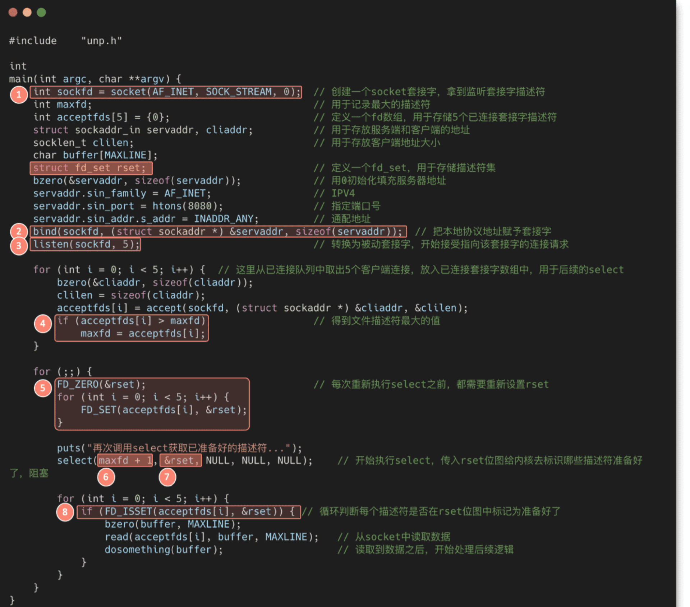

# 基本概念

## 同步异步阻塞非阻塞

同步：当前线程接收返回结果

异步：另外一个线程接收返回结果，多个线程

阻塞：一直等待直到结果返回

非阻塞：干其它事，不用一直等

>注意：没有 异步阻塞 这种

## IO模型同步异步

通常会说到同步阻塞IO、同步非阻塞IO，异步IO几种术语，所谓阻塞就是发起读取数据请求的时，当数据还没准备就绪的时候，这时请求是即刻返回，还是在这里等待数据的就绪，如果需要等待的话就是阻塞，反之如果即刻返回就是非阻塞。

区分了阻塞和非阻塞后再来分别下同步和异步，在IO模型里面如果请求方从发起请求到数据最后完成的这一段过程中都需要自己参与，那么这种称为同步请求；反之，如果应用发送完指令后就不再参与过程了，只需要等待最终完成结果的通知，那么这就属于异步。

再看同步阻塞、同步非阻塞，他们不同的只是发起读取请求的时候一个请求阻塞，一个请求不阻塞，但是相同的是，他们都需要应用自己监控整个数据完成的过程。而为什么只有异步非阻塞 而没有异步阻塞呢，因为异步模型下请求指定发送完后就即刻返回了，没有任何后续流程了，所以它注定不会阻塞，所以也就只会有异步非阻塞模型了。

# 5种IO模型


## 阻塞IO

## 非阻塞IO

## 多路复用IO

Java NIO就是多路复用IO

另外多路复用IO为何比非阻塞IO模型的效率高是因为在非阻塞IO中，不断地询问socket状态时通过用户线程去进行的，而在多路复用IO中，轮询每个socket状态是内核在进行的，这个效率要比用户线程要高的多。

单线程可以配合Selector完成对多个Channel可读写事件的监控，这称之为多路复用

>单线程+事件

* 多路复用仅针对网络IO、普通文件IO没法利用多路复用
* 如果不用Selector的非阻塞模式，线程大部分事件都在做无用功，而Selector能够保证
    * 有可连接事件时才去连接
    * 有可读事件才去读取
    * 有可写事件才去写入
        * 限于网络传输能力，Channel未必时时可写，一旦Channel可写，会触发Selector的可写事件

## 信号驱动IO

## 异步IO

# 2种高性能设计模式

* Reactor
* Proactor
# IO复用模型

## Select

函数签名：

```java
int select(int nfds,
            fd_set *restrict readfds,
            fd_set *restrict writefds,
            fd_set *restrict errorfds,
            struct timeval *restrict timeout);
```
传递给select函数的参数会告诉内核：
1. 我们所关心的文件描述符（三类，读、写、异常）
2. 对每个描述符，我们所关心的状态
3. 我们要等待多长时间
fd_set是bitmap结构，默认长度为1024，由内核中一个常量定义，因此select最多处理的fd长度就是1024，要修改该长度，需要重新编译内核。 fd_set 的使用涉及以下几个 API：

```plain
 #include <sys/select.h>
int FD_ZERO(int fd, fd_set *fdset);  // 将 fd_set 所有位置 0
int FD_CLR(int fd, fd_set *fdset);   // 将 fd_set 某一位置 0
int FD_SET(int fd, fd_set *fd_set);  // 将 fd_set 某一位置 1
int FD_ISSET(int fd, fd_set *fdset); // 检测 fd_set 某一位是否为 1
```
 从select函数返回后，内核告诉我们以下信息：
1. 对我们的要求已经做好准备的描述符的个数
2. 对于三种条件（读、写、异常），哪些描述符已经做好准备
有了这些信息，我们可以调用合适的I/O函数，并且这些函数不会再阻塞。




select的缺点

* fd_set中的bitmap是固定1024位的，也就是说最多只能监听1024个套接字。当然也可以改内核源码，不过代价比较大；
* fd_set每次传入内核之后，都会被改写，导致不可重用，每次调用select都需要重新初始化fd_set；
* 每次调用select都需要拷贝新的fd_set到内核空间，这里会做一个用户态到内核态的切换；
* 拿到fd_set的结果后，应用进程需要遍历整个fd_set，才知道哪些文件描述符有数据可以处理。

## Poll

poll 和 select 几乎没有区别。poll 采用链表的方式存储文件描述符，没有最大存储数量的限制。 从性能开销上看，poll 和 select 的差别不大。

## epoll

epoll 是对 select 和 poll 的改进，避免了“性能开销大”和“文件描述符数量少”两个缺点。即：

* 每次 select 需要把监控的 fds 传输到内核里，没有在内核中维护
* socket 只唤醒 select，不能告诉它是哪个 socket 
改进策略：

* 在内核里维护了 epoll 管理的 socket 集合，不用每次调用时都把所有管理的 fds 拷贝到内核
* 引入一个 ready_list 双向链表，callback 里面会把当前的 socket 加入到 ready_list 然后唤醒 epoll，被唤醒的 epoll 只需要遍历 ready_list 即可，这个链表里一定是有数据可读的 socket，相比于 select 就不会做无用的遍历
简而言之，epoll 有以下几个特点：

* 使用红黑树存储文件描述符集合
* 使用队列存储就绪的文件描述符
* 每个文件描述符只需在添加时传入一次；通过事件更改文件描述符状态

select、poll 模型都只使用一个函数，而 epoll 模型使用三个函数：epoll_create、epoll_ctl 和 epoll_wait，我们分开介绍。

### epoll_create

```plain
int epoll_create(int size);
```
 epoll_create 会创建一个 epoll 实例，同时返回一个引用该实例的文件描述符。 返回的文件描述符仅仅指向对应的 epoll 实例，并不表示真实的磁盘文件节点。其他 API 如 epoll_ctl、epoll_wait 会使用这个文件描述符来操作相应的 epoll 实例。 当创建好 epoll 句柄后，它会占用一个 fd 值，在 linux 下查看 /proc/进程id/fd/，就能够看到这个 fd。所以在使用完 epoll 后，必须调用 close(epfd) 关闭对应的文件描述符，否则可能导致 fd 被耗尽。当指向同一个 epoll 实例的所有文件描述符都被关闭后，操作系统会销毁这个 epoll 实例。 epoll 实例内部存储：
* **监听列表：所有要监听的文件描述符，使用****红黑树**
* **就绪列表：所有就绪的文件描述符，使用****链表**

### epoll_ctl

```plain
int epoll_ctl(int epfd, int op, int fd, struct epoll_event *event);
```
 epoll_ctl 会监听文件描述符 fd 上发生的 event 事件。 参数说明：
* epfd 即 epoll_create 返回的文件描述符，指向一个 epoll 实例
* fd 表示要监听的目标文件描述符
* event 表示要监听的事件（可读、可写、发送错误…）
* op 表示要对 fd 执行的操作，有以下几种：
    * EPOLL_CTL_ADD：为 fd 添加一个监听事件 event
    * EPOLL_CTL_MOD：Change the event event associated with the target file descriptor fd（event 是一个结构体变量，这相当于变量 event 本身没变，但是更改了其内部字段的值）
    * EPOLL_CTL_DEL：删除 fd 的所有监听事件，这种情况下 event 参数没用

返回值 0 或 -1，表示上述操作成功与否。 epoll_ctl 会将文件描述符 fd 添加到 epoll 实例的监听列表里，同时为 fd 设置一个回调函数，并监听事件 event。当 fd 上发生相应事件时，会调用回调函数，将 fd 添加到 epoll 实例的就绪队列上。

### epoll_wait

```plain
int epoll_wait(int epfd, struct epoll_event *events,
               int maxevents, int timeout);
```

 这是 epoll 模型的主要函数，功能相当于 select。 参数说明：

* epfd 即 epoll_create 返回的文件描述符，指向一个 epoll 实例
* events 是一个数组，保存就绪状态的文件描述符，其空间由调用者负责申请
* maxevents 指定 events 的大小
* timeout 类似于 select 中的 timeout。如果没有文件描述符就绪，即就绪队列为空，则 epoll_wait 会阻塞 timeout 毫秒。如果 timeout 设为 -1，则 epoll_wait 会一直阻塞，直到有文件描述符就绪；如果 timeout 设为 0，则 epoll_wait 会立即返回

返回值表示 events 中存储的就绪描述符个数，最大不超过 maxevents。

### epoll 的优点

一开始说，epoll 是对 select 和 poll 的改进，避免了“性能开销大”和“文件描述符数量少”两个缺点。 对于“文件描述符数量少”，select 使用整型数组存储文件描述符集合，而 epoll 使用红黑树存储，数量较大。 对于“性能开销大”，epoll_ctl 中为每个文件描述符指定了回调函数，并在就绪时将其加入到就绪列表，因此 epoll 不需要像 select 那样遍历检测每个文件描述符，只需要判断就绪列表是否为空即可。这样，在没有描述符就绪时，epoll 能更早地让出系统资源。

>相当于时间复杂度从 O(n) 降为 O(1)

此外，每次调用 select 时都需要向内核拷贝所有要监听的描述符集合，而 epoll 对于每个描述符，只需要在 epoll_ctl 传递一次，之后 epoll_wait 不需要再次传递。这也大大提高了效率。

### 水平触发和边缘触发

水平触发（LT，Level Trigger）：当文件描述符就绪时，会触发通知，如果用户程序没有一次性把数据读/写完，下次还会发出可读/可写信号进行通知。

边缘触发（ET，Edge Trigger）：仅当描述符从未就绪变为就绪时，通知一次，之后不会再通知。

select 只支持水平触发，epoll 支持水平触发和边缘触发。

区别：边缘触发效率更高，减少了事件被重复触发的次数，函数不会返回大量用户程序可能不需要的文件描述符。

>水平触发、边缘触发的名称来源：数字电路当中的电位水平，高低电平切换瞬间的触发动作叫边缘触发，而处于高电平的触发动作叫做水平触发。

举例：

如果一个客户端同时发来了 5 个数据包，正常的逻辑只需要唤醒一次 epoll ，把当前 socket 加一次到 ready_list 就行了，不需要加 5 次。然后用户程序可以把 socket 接收队列的所有数据包都读完。

但假设用户程序只读了一个包，然后处理报错了，后面不读了，那后面的 4 个包怎么处理？

如果是 ET 模式，就无法读取，因为没有把 socket 加入到 ready_list 的触发条件。除非该客户端发了新数据包过来，才会再把当前 socket 加入到 ready_list，在新包过来之前，这 4 个数据包都不会被读到。

而 LT 模式不一样，因为每次读完有感兴趣的事件发生之后，会把当前 socket 再加入到 ready_list，所以下次肯定能读到这个 socket，所以后面的 4 个数据包会被访问到，不论客户端是否发送新包。

# Reference

[美团技术团队-NIO](https://tech.meituan.com/2016/11/04/nio.html) 

[Java NIO：浅析I/O模型](https://www.cnblogs.com/dolphin0520/p/3916526.html)

[字节 I/O 模型介绍](https://tech.bytedance.net/articles/6941691923572719630#heading18)

[IO复用：IO处理杀手锏，带您深入了解select，poll，epoll](https://www.itzhai.com/articles/thoroughly-understand-io-reuse-take-you-in-depth-understanding-of-select-poll-epoll.html)

