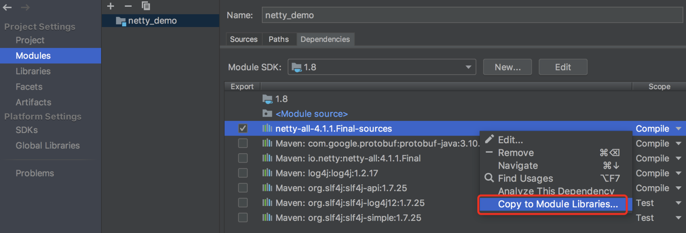
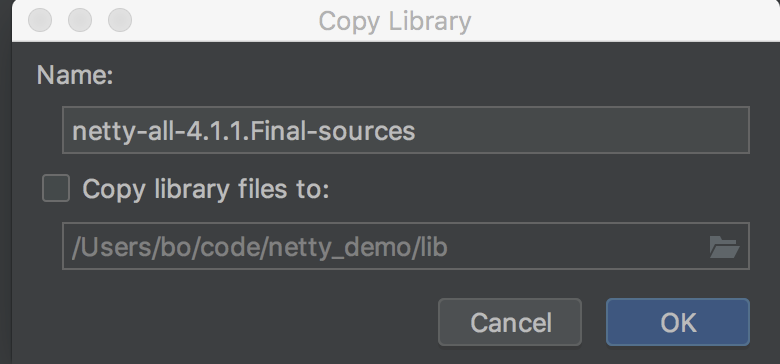

# Tips

netty-xxx-sources.jar包中会有个example文件夹，里面有netty的使用案例。本文可以以 EchoServer为例

## IDEA查看xx-sources.jar

sources.jar包可以通过 Moudels -> 添加 -> 右键菜单 -> Copy to Module Libraries ->  Copy library files to -> 项目的lib中可以看到该jar包





可以将demo的代码拷贝到项目中运行debug源码

# Demo

## EchoServer Demo

```java
public static void main(String[] args) throws Exception {
    // Configure SSL.
    final SslContext sslCtx;
    if (SSL) {
        SelfSignedCertificate ssc = new SelfSignedCertificate();
        sslCtx = SslContextBuilder.forServer(ssc.certificate(), ssc.privateKey()).build();
    } else {
        sslCtx = null;
    }
    // Configure the server.
    EventLoopGroup bossGroup = new NioEventLoopGroup(1);
    EventLoopGroup workerGroup = new NioEventLoopGroup();
    try {
        ServerBootstrap b = new ServerBootstrap();
        b.group(bossGroup, workerGroup)
         .channel(NioServerSocketChannel.class)
         // option添加TCP参数
         .option(ChannelOption.SO_BACKLOG, 100)
         .handler(new LoggingHandler(LogLevel.INFO))
         .childHandler(new ChannelInitializer<SocketChannel>() {
             @Override
             public void initChannel(SocketChannel ch) throws Exception {
                 ChannelPipeline p = ch.pipeline();
                 if (sslCtx != null) {
                     p.addLast(sslCtx.newHandler(ch.alloc()));
                 }
                 //p.addLast(new LoggingHandler(LogLevel.INFO));
                 p.addLast(new EchoServerHandler());
             }
         });
        // Start the server.
        ChannelFuture f = b.bind(PORT).sync();
        // Wait until the server socket is closed.
        f.channel().closeFuture().sync();
    } finally {
        // Shut down all event loops to terminate all threads.
        bossGroup.shutdownGracefully();
        workerGroup.shutdownGracefully();
    }
}
```
## 普通Demo

```java
public static void main(String[] args) throws Exception {
        EventLoopGroup bossGroup = new NioEventLoopGroup(1);
        EventLoopGroup workerGroup = new NioEventLoopGroup();
        try {
            ServerBootstrap b = new ServerBootstrap();
            b.group(bossGroup, workerGroup)
                    .channel(NioServerSocketChannel.class)
                    .handler(new SimpleServerHandler())
                    .childHandler(new SimpleServerInitializer())
                    .option(ChannelOption.SO_BACKLOG, 128)
                    .childOption(ChannelOption.SO_KEEPALIVE, true);
            ChannelFuture f = b.bind(8989).sync();
            f.channel().closeFuture().sync();
        } finally {
            bossGroup.shutdownGracefully();
            workerGroup.shutdownGracefully();
        }
    }
```


以下源码以 netty-4.1.1-Final.jar为例

# NioEventLoopGroup

以下根据 EchoServer 的main 的入口源码进行分析

```java
// io.netty.example.echo.EchoServer#main
// Configure the server.
EventLoopGroup bossGroup = new NioEventLoopGroup(1);
EventLoopGroup workerGroup = new NioEventLoopGroup();
```
## MultithreadEventExecutorGroup

NioEventLoopGroup继承了该类，其初始化主要该类的初始化过程。

## 默认线程个数

通过对 NioEventLoopGroup() 的跟踪，发现如果未指定线程个数，会调用MultithreadEventLoopGroup构造函数，默认使用 DEFAULT_EVENT_LOOP_THREADS ，而该参数的初始化是：

```java
// io.netty.channel.MultithreadEventLoopGroup#
// MultithreadEventLoopGroup(int, java.util.concurrent.Executor, java.lang.Object...)
private static final int DEFAULT_EVENT_LOOP_THREADS = Math.max(1, SystemPropertyUtil.getInt("io.netty.eventLoopThreads", Runtime.getRuntime().availableProcessors() * 2));
protected MultithreadEventLoopGroup(int nThreads, Executor executor, Object... args) {
    super(nThreads == 0 ? DEFAULT_EVENT_LOOP_THREADS : nThreads, executor, args);
}
```

## 参数说明

该类的构造方法才是 NioEventLoopGroup 真正的构造方法，这里可以看做是一个**模板方法（设计模式）。**

```java
// io.netty.util.concurrent.MultithreadEventExecutorGroup
/**
 * Create a new instance.
 *
 * @param nThreads          the number of threads that will be used by this instance.
 使用的线程数，默认 处理器个数*2
 * @param executor          the Executor to use, or {@code null} if the default should be used.
 执行器，如果传入null，则采用Netty默认的线程工厂和默认的执行器ThreadPerTaskExecutor
 * @param chooserFactory    the {@link EventExecutorChooserFactory} to use.
 单例new DefaultEventExecutorChooserFactory()
 * @param args              arguments which will passed to each {@link #newChild(Executor, Object...)} call
 在创建执行器的时候传入固定参数
 */
protected MultithreadEventExecutorGroup(int nThreads, Executor executor,
                                        EventExecutorChooserFactory chooserFactory, Object... args)
```

## 初始化过程

往下可以看到会创建 EventExecutor 数组 children

可以通过快捷键 ctrl + H（mac系统）查看类的 EventExecutor 类的层次结构，可以发现 EventExecutor <- SingleThreadEventLoop <- NioEventLoop，这里每个元素的类型是 NioEventLoop。

该函数中还对每个元素加了监听器

```java
protected MultithreadEventExecutorGroup(int nThreads, Executor executor,
                                        EventExecutorChooserFactory chooserFactory, Object... args) {
    if (nThreads <= 0) {
        throw new IllegalArgumentException(String.format("nThreads: %d (expected: > 0)", nThreads));
    }
    if (executor == null) {
        executor = new ThreadPerTaskExecutor(newDefaultThreadFactory());
    }
    // 创建指定线程数的执行器数组
    children = new EventExecutor[nThreads];
    // 初始化线程数组
    for (int i = 0; i < nThreads; i ++) {
        boolean success = false;
        try {
            // 创建 new NioEventLoop
            children[i] = newChild(executor, args);
            success = true;
        } catch (Exception e) {
            // TODO: Think about if this is a good exception type
            throw new IllegalStateException("failed to create a child event loop", e);
        } finally {
            // 创建失败，优雅关闭之前几个成功创建的 NioEventLoop
            if (!success) {
                for (int j = 0; j < i; j ++) {
                    children[j].shutdownGracefully();
                }
                for (int j = 0; j < i; j ++) {
                    EventExecutor e = children[j];
                    try {
                        while (!e.isTerminated()) {
                            e.awaitTermination(Integer.MAX_VALUE, TimeUnit.SECONDS);
                        }
                    } catch (InterruptedException interrupted) {
                        // Let the caller handle the interruption.
                        Thread.currentThread().interrupt();
                        break;
                    }
                }
            }
        }
    }
    chooser = chooserFactory.newChooser(children);
    final FutureListener<Object> terminationListener = new FutureListener<Object>() {
        @Override
        public void operationComplete(Future<Object> future) throws Exception {
            if (terminatedChildren.incrementAndGet() == children.length) {
                terminationFuture.setSuccess(null);
            }
        }
    };
    // 为每个单例线程池添加一个关闭监听器
    for (EventExecutor e: children) {
        e.terminationFuture().addListener(terminationListener);
    }
    Set<EventExecutor> childrenSet = new LinkedHashSet<EventExecutor>(children.length);
    // 将所有的单例线程池添加到一个 HashSet 中
    Collections.addAll(childrenSet, children);
    readonlyChildren = Collections.unmodifiableSet(childrenSet);
}
```
分析说明：
1、如果 executor 是null，创建一个默认的 ThreadPerTaskExecutor，使用Netty默认的线程工厂

2、根据传入的线程数（CPU*2）创建一个线程池的（单例线程池）数组

3、循环填充数组中元素。如果异常，则关闭所有的单例线程池

4、根据线程选择工程创建一个 线程选择器

5、为每一个单例线程池添加一个关闭监听器

6、将所有单例线程池添加到一个 HashSet 中

## NioEventLoop

```java
// io.netty.channel.nio.NioEventLoop#NioEventLoop
NioEventLoop(NioEventLoopGroup parent, ThreadFactory threadFactory, SelectorProvider selectorProvider) {
    super(parent, threadFactory, false);
    if (selectorProvider == null) {
        throw new NullPointerException("selectorProvider");
    }
    provider = selectorProvider;
    selector = openSelector();
}
```

### 
### 父类SingleThreadEventExecutor

```java
// 
```
该初始化函数主要做了两件事：
1、利用ThreadFactory创建来一个Thread，传入了一个Runnable对象，该Runnable重写的run代码比较长，不过重点仅仅是调用NioEventLoop类的run方法。

2、使用LinkedBlockingQueue类初始化taskQueue 。

# 绑定group

用于后期引导使用

```java
// io.netty.bootstrap.ServerBootstrap#
// group(io.netty.channel.EventLoopGroup, io.netty.channel.EventLoopGroup)
public ServerBootstrap group(EventLoopGroup parentGroup, EventLoopGroup childGroup) {
    super.group(parentGroup);
    if (childGroup == null) {
        throw new NullPointerException("childGroup");
    }
    if (this.childGroup != null) {
        throw new IllegalStateException("childGroup set already");
    }
    this.childGroup = childGroup;
    return this;
}
```
# 添加channel

其中参数一个Class对象，引导类将通过这个Class对象反射创建 ChannelFactory。

```java
// io.netty.bootstrap.AbstractBootstrap#channel
public B channel(Class<? extends C> channelClass) {
    if (channelClass == null) {
        throw new NullPointerException("channelClass");
    }
    return channelFactory(new ReflectiveChannelFactory<C>(channelClass));
}
```
channel的创建
```java
// io.netty.bootstrap.AbstractBootstrap#initAndRegister
final ChannelFuture initAndRegister() {
    final Channel channel = channelFactory.newChannel();
    try {
        init(channel);
    } catch (Throwable t) {
    
```
可以通过 debug 或 查看 initAndRegister 方法调用层次
# 日志处理器handler

添加服务器专属日志处理器handler。

注意是 ServerSocketChannel

```java
.handler(new LoggingHandler(LogLevel.INFO))
```

### 


# xxServerHandler

添加SocketChannel的handler

注意不是 ServerSocketChannel

```shell
.childHandler(xx)
```

这是一个普通的处理器类，用于处理客户端发送来的消息，入口函数中在 ServerBootstrap 的 .chanldHanlder 中添加该hanlder。

这里处理主要分析客户端发送内容来解析、打印、响应发送字符串给客户端的过程。

```java
// io.netty.example.echo.EchoServerHandler
@Sharable
public class EchoServerHandler extends ChannelInboundHandlerAdapter {
    @Override
    public void channelRead(ChannelHandlerContext ctx, Object msg) {
        ctx.write(msg);
    }
    @Override
    public void channelReadComplete(ChannelHandlerContext ctx) {
        ctx.flush();
    }
    @Override
    public void exceptionCaught(ChannelHandlerContext ctx, Throwable cause) {
        // Close the connection when an exception is raised.
        cause.printStackTrace();
        ctx.close();
    }
}
```


# ServerBootstrap

try块中创建了一个 ServerBootstrap 对象，它是一个引导类，用于启动服务器和引导整个程序的初始化。它和 ServerChannel 关联，而 ServerChannel 继承了 Channel。

```java
try {
    ServerBootstrap b = new ServerBootstrap();
    b.group(bossGroup, workerGroup)
     .channel(NioServerSocketChannel.class)
     .option(ChannelOption.SO_BACKLOG, 100)
     .handler(new LoggingHandler(LogLevel.INFO))
     .childHandler(xxxxx);
```
## 类的继承关系

ServerBootstrap -> AbstractBootstrap --> Cloneable

## 空构造函数

但是有默认的成员变量，会直接初始化

```java
// io.netty.bootstrap.ServerBootstrap
private final Map<ChannelOption<?>, Object> childOptions = new LinkedHashMap<ChannelOption<?>, Object>();
private final Map<AttributeKey<?>, Object> childAttrs = new LinkedHashMap<AttributeKey<?>, Object>();
// config很重要，后面会用到
private final ServerBootstrapConfig config = new ServerBootstrapConfig(this);
private volatile EventLoopGroup childGroup;
private volatile ChannelHandler childHandler;
public ServerBootstrap() { }
```

## 构造过程

```java
ServerBootstrap b = new ServerBootstrap();
b.group(bossGroup, workerGroup)
 .channel(NioServerSocketChannel.class)
 .option(ChannelOption.SO_BACKLOG, 100)
 .handler(new LoggingHandler(LogLevel.INFO))
 .childHandler(new ChannelInitializer<SocketChannel>() {
     @Override
     public void initChannel(SocketChannel ch) throws Exception {
         ChannelPipeline p = ch.pipeline();
         if (sslCtx != null) {
             p.addLast(sslCtx.newHandler(ch.alloc()));
         }
         //p.addLast(new LoggingHandler(LogLevel.INFO));
         p.addLast(new EchoServerHandler());
     }
 });
```
分析说明：
1、链式调用：group 方法，将boss和worker传入，boss赋值给parentGroup属性，worker赋值给childGroup属性

2、channel 方法传入 NioServerSocketChannel.class 对象。会根据这个创建 channel 对象

3、option 方法传入TCP参数，放在一个LinkedHashMap中

4、handler 方法传入一个hanlder，该hanler专属于 ServerSocketChannel 而不是 SocketChannel

5、childHandler 传入一个handler，这个handler将会在每个客户端连接的时候调用。供 SocketChannel 使用。

# 绑定端口

服务器在bind方法中启动完成的

```java
// io.netty.example.echo.EchoServer#main
// Start the server.
ChannelFuture f = b.bind(PORT).sync();
```
## bind方法

```java
// io.netty.bootstrap.AbstractBootstrap
public ChannelFuture bind(SocketAddress localAddress) {
    validate();
    if (localAddress == null) {
        throw new NullPointerException("localAddress");
    }
    return doBind(localAddress);
}
```
核心代码为doBind方法
### validate方法

该方法主要检查了两个参数，一个是group，一个是channelFactory。

这两个将bossGroup赋值给了group，将BootstrapChannelFactory赋值给了channelFactory。赋值如下：

```java
ServerBootstrap b = new ServerBootstrap();
b.group(bossGroup, workerGroup)
  .channel(NioServerSocketChannel.class)
```

## doBind方法

核心是两个方法 initAndRegister 和 doBind0

```java
// io.netty.bootstrap.AbstractBootstrap#doBind
private ChannelFuture doBind(final SocketAddress localAddress) {
    final ChannelFuture regFuture = initAndRegister(); // 1
    final Channel channel = regFuture.channel();
    if (regFuture.cause() != null) { // 2
        return regFuture;
    }
    if (regFuture.isDone()) { // 3
        // At this point we know that the registration was complete and successful.
        ChannelPromise promise = channel.newPromise();
        doBind0(regFuture, channel, localAddress, promise);
        return promise;
    } else { // 4
        // Registration future is almost always fulfilled already, but just in case it's not.
        final PendingRegistrationPromise promise = new PendingRegistrationPromise(channel);
        regFuture.addListener(new ChannelFutureListener() {
            @Override
            public void operationComplete(ChannelFuture future) throws Exception {
                Throwable cause = future.cause();
                if (cause != null) {
                    // Registration on the EventLoop failed so fail the ChannelPromise directly to not cause an
                    // IllegalStateException once we try to access the EventLoop of the Channel.
                    promise.setFailure(cause);
                } else {
                    // Registration was successful, so set the correct executor to use.
                    // See https://github.com/netty/netty/issues/2586
                    promise.registered();
                    doBind0(regFuture, channel, localAddress, promise);
                }
            }
        });
        return promise;
    }
}
```
doBind函数是分析重点，主要工作如下：
1、initAndRegister()方法得到一个ChannelFuture的实例regFuture。

2、regFuture.cause()方法判断是否在执行initAndRegister方法时产生来异常。如果产生异常直接返回，如果没有则进行第3步。

3、通过regFuture.isDone()来判断initAndRegister方法是否执行完毕，如果执行完成返回true，然后调用doBind0进行socket绑定。如果没有执行完成则返回false进行第4步。

4、regFuture会添加一个ChannelFutureListener监听，当initAndRegister执行完成时，调用operationComplete方法并执行doBind0进行socket绑定。

第3、4步同一个目的：调用doBind0方法进行socket绑定。

### initAndRegister

```plain
// io.netty.bootstrap.AbstractBootstrap#initAndRegister
final ChannelFuture initAndRegister() {
    final Channel channel = channelFactory.newChannel();
    try {
        init(channel);
    } catch (Throwable t) {
    }
    ChannelFuture regFuture = group().register(channel);
```
这里初始化 children channel。
#### newChannel分析

上面介绍过，channelFactory 是通过如下方式赋值的

```java
ServerBootstrap b = new ServerBootstrap();
b.group(bossGroup, workerGroup)
  .channel(NioServerSocketChannel.class)
```
channelFactory.newChannel() 方法的作用是通过 ServerBootstrap 的通道工厂反射创建一个 NioServerSocketChannel。
分析 NioServerSocketChannel 的构造函数：

0、继承关系

**NioServerSocketChannel -> AbstractNioMessageChannel -> AbstractNioChannel -> AbstractChannel**

1、通过NIO的 SelectorProvider 的 openServerSocketChannel 方法可以得到JDK的 channel，目的是让Netty包装JDK的channel

2、调用父类设置到ch属性中，并设置为非阻塞

```shell
// io.netty.channel.nio.AbstractNioChannel#AbstractNioChannel
protected AbstractNioChannel(Channel parent, SelectableChannel ch, int readInterestOp) {
    super(parent);
    this.ch = ch;
    this.readInterestOp = readInterestOp;
    try {
        ch.configureBlocking(false);
```
3、设置config属性
```plain
// io.netty.channel.socket.nio.NioServerSocketChannel#NioServerSocketChannel
public NioServerSocketChannel(ServerSocketChannel channel) {
    super(null, channel, SelectionKey.OP_ACCEPT);
    config = new NioServerSocketChannelConfig(this, javaChannel().socket());
}
```
NioServerSocketChannelConfig 对象，用于对外展示一些配置。
4、调用父构造函数设置unsafe属性、pipeline属性、ChannelId等

```java
// io.netty.channel.AbstractChannel#AbstractChannel
protected AbstractChannel(Channel parent) {
    this.parent = parent;
    id = newId();
    unsafe = newUnsafe();
    pipeline = newChannelPipeline();
}
```
NioMessageUnsafe 是在 AbstractNioMessageChannel 中创建的，用于操作消息。（cmd+F12查看NioServerSocketChannel及其父类的newUnsafe方法）
DefaultChannelPipeline 管道，是个双向链表结构，用于过滤所有的进出的消息。

#### init分析

1、init方法是AbstractBootstrap的抽象方法，具体由 ServerBootstrap 实现（上面分析b对象是new ServerBootstrap）

```java
// io.netty.bootstrap.ServerBootstrap#init
@Override
void init(Channel channel) throws Exception {
    final Map<ChannelOption<?>, Object> options = options0();
    synchronized (options) {
        channel.config().setOptions(options);
    }
    final Map<AttributeKey<?>, Object> attrs = attrs0();
    synchronized (attrs) {
        for (Entry<AttributeKey<?>, Object> e: attrs.entrySet()) {
            @SuppressWarnings("unchecked")
            AttributeKey<Object> key = (AttributeKey<Object>) e.getKey();
            channel.attr(key).set(e.getValue());
        }
    }
    ChannelPipeline p = channel.pipeline();
    final EventLoopGroup currentChildGroup = childGroup;
    final ChannelHandler currentChildHandler = childHandler;
    final Entry<ChannelOption<?>, Object>[] currentChildOptions;
    final Entry<AttributeKey<?>, Object>[] currentChildAttrs;
    synchronized (childOptions) {
        currentChildOptions = childOptions.entrySet().toArray(newOptionArray(childOptions.size()));
    }
    synchronized (childAttrs) {
        currentChildAttrs = childAttrs.entrySet().toArray(newAttrArray(childAttrs.size()));
    }
    p.addLast(new ChannelInitializer<Channel>() {
        @Override
        public void initChannel(Channel ch) throws Exception {
            ChannelPipeline pipeline = ch.pipeline();
            ChannelHandler handler = config.handler();
            if (handler != null) {
                pipeline.addLast(handler);
            }
            pipeline.addLast(new ServerBootstrapAcceptor(
                    currentChildGroup, currentChildHandler, currentChildOptions, currentChildAttrs));
        }
    });
}
```
2、设置 NioServerSocketChannel 的TCP属性，options
3、由于 LinkedHashMap 是非线程安全的，使用同步进行处理

4、对 NioServerSocketChannel 的 ChannelPipeline 添加 ChannelInitializer 处理器，重写 initChannel 方法，该方法通过 addList 向 serverChannel 的流水线处理器重加了一个 ServerBootstrapAcceptor，这是一个接入器，专门接受新请求，并扔给某个事件循环器

5、可以分析出，init 方法的核心作用是和 ChannelPipeline 相关

6、从 NioServerSocketChannel 的初始化过程可以分析出：pipeline是一个双向链表，并且本身初始化了 head 和 tail。ChannelPipeline 的 addLast 方法是将 hanlder 插入到 tail 的前面，tail永远在后面，用于做一些系统的固定工作。

总结

init只是初始化一些基本的配置和属性，以及在pipeline加入一个接入器，用来专门接受新请求，而并没有启动服务。

**分析addLast方法**

```plain
// io.netty.channel.DefaultChannelPipeline#addLast(io.netty.util.concurrent.EventExecutorGroup, java.lang.String, io.netty.channel.ChannelHandler)
@Override
public final ChannelPipeline addLast(EventExecutorGroup group, String name, ChannelHandler handler) {
    final AbstractChannelHandlerContext newCtx;
    synchronized (this) {
        checkMultiplicity(handler);

        newCtx = newContext(group, filterName(name, handler), handler);

        addLast0(newCtx);

        if (!registered) {
            callHandlerCallbackLater(newCtx, true);
            return this;
        }

        EventExecutor executor = newCtx.executor();
        if (!executor.inEventLoop()) {
            executor.execute(new OneTimeTask() {
                @Override
                public void run() {
                    callHandlerAdded0(newCtx);
                }
            });
            return this;
        }
    }
    callHandlerAdded0(newCtx);
    return this;
}
```
addLast 最终会调用 addLast0 方法
```plain
// io.netty.channel.DefaultChannelPipeline#addLast0
private void addLast0(AbstractChannelHandlerContext newCtx) {
    AbstractChannelHandlerContext prev = tail.prev;
    newCtx.prev = prev;
    newCtx.next = tail;
    prev.next = newCtx;
    tail.prev = newCtx;
}
```
addList结论：
1、addLast 方法在 DefaultChannelPipeline 类中

2、addList 方法是 pipeline 方法的核心

3、检查该 handler 是否符合标准

4、创建一个 AbstractChannelHandlerContext 对象

说明：ChannelHandlerContext 对象是 ChannelHandler 和 ChannelPipeline 之间的关联，每当有 ChannelHandler 添加到 Pipeline 中时，都会创建Context。

Context的主要功能是管理他所关联的 Handler 和同一个 Pipeline 中的其他 Handler 之间的交互。

5、将 Context 添加到链表中。也就是追加到 tail 节点的前面

6、最后，同步或异步或晚点异步的调用 callHandlerAdded 方法

#### register channel

继续看 initAndRegister 中的 register

```java
// io.netty.bootstrap.AbstractBootstrap#initAndRegister
ChannelFuture regFuture = group().register(channel);
```
由上文知道这里group为MultithreadEventLoopGroup，其register方法为
```java
// io.netty.channel.MultithreadEventLoopGroup#register
@Override
public ChannelFuture register(Channel channel) {
    return next().register(channel);
}
```
这里 next() 可以跟踪到父类初始化 chooser 根据是 executors.length 选择，next方法对length做了一点区别处理。
next的主要作用是因为 NioEventLoopGroup 中维护着多个 NioEventLoop，next方法回调用chooser策略找到下一个 NioEventLoop，并执行该对象的register方法进行注册。

register 实际调用 SingleThreadEventLoop

```java
// io.netty.channel.SingleThreadEventLoop#register
@Override
public ChannelFuture register(final ChannelPromise promise) {
    ObjectUtil.checkNotNull(promise, "promise");
    promise.channel().unsafe().register(this, promise);
    return promise;
}
```
unsafe上文分析了是 NioMessageUnsafe，unsafe().register方法实际调用 AbstractUnsafe 的方法
```java
// io.netty.channel.AbstractChannel.AbstractUnsafe#register
@Override
public final void register(EventLoop eventLoop, final ChannelPromise promise) {
    if (eventLoop == null) {
        throw new NullPointerException("eventLoop");
    }
    // 判断该 channel 是否已经被注册到 EventLoop 中
    if (isRegistered()) {
        promise.setFailure(new IllegalStateException("registered to an event loop already"));
        return;
    }
    if (!isCompatible(eventLoop)) {
        promise.setFailure(
                new IllegalStateException("incompatible event loop type: " + eventLoop.getClass().getName()));
        return;
    }
    // 将 eventLoop 设置到 NioServerSocketChannel 中
    AbstractChannel.this.eventLoop = eventLoop;
    // 判断当前线程是否为该 EventLoop 中拥有的线程，
    // 如果是直接注册，否则添加一个任务到该线程中
    if (eventLoop.inEventLoop()) {
        register0(promise);
    } else {
        try {
            // 非常重要
            eventLoop.execute(new OneTimeTask() {
                @Override
                public void run() {
                    register0(promise);
                }
            });
        } catch (Throwable t) {
            logger.warn(
                    "Force-closing a channel whose registration task was not accepted by an event loop: {}",
                    AbstractChannel.this, t);
            closeForcibly();
            closeFuture.setClosed();
            safeSetFailure(promise, t);
        }
    }
}
```
基本逻辑如下：
1、通过 eventLoop.inEventLoop() 判断当前线程是否为该 EventLoop 中拥有的线程，如果是直接注册，否则说明该 EventLoop 在等待并没有执行权。

2、提交一个任务到该线程中，等该 EventLoop 的线程有执行权就会执行该任务（负责调用调用 register0 方法）

重点为 register0 方法。

```plain
// io.netty.channel.AbstractChannel.AbstractUnsafe#register0
private void register0(ChannelPromise promise) {
    try {
        xxxx
        doRegister();
        neverRegistered = false;
        registered = true;

        safeSetSuccess(promise);
        pipeline.fireChannelRegistered();
        xxx
}
```
doRegister方法
```plain
// io.netty.channel.nio.AbstractNioChannel#doRegister
@Override
protected void doRegister() throws Exception {
    boolean selected = false;
    for (;;) {
        try {
            selectionKey = javaChannel().register(eventLoop().selector, 0, this);
            return;
        } catch (CancelledKeyException e) {
            if (!selected) {
                // Force the Selector to select now as the "canceled" SelectionKey may still be
                // cached and not removed because no Select.select(..) operation was called yet.
                eventLoop().selectNow();
                selected = true;
            } else {
                // We forced a select operation on the selector before but the SelectionKey is still cached
                // for whatever reason. JDK bug ?
                throw e;
            }
        }
    }
}
```
经上文 newChannel 分析，知道这里javaChannel方法返回的ch为实例化NioServerSocketChannel时产生的 SocketChannelImpl实例，并设置为非阻塞的。

#### 总结

1、initAndRegister 初始化 NioServerSocketChannel 通道并注册各个 handler，返回一个 future

2、通过 ServerBootrap 的通道工厂反射创建一个 NioServerSocketChannel

3、init初始化 NioServerSocketChannel

4、group().register(channel) 通过 ServerBootstrap 的 bossGroup 注册 NioServerSocketChannel

5、最后返回这个异步执行的占位符 regFuture

### dobind0方法

```plain
// io.netty.bootstrap.AbstractBootstrap#doBind0
private static void doBind0(
        final ChannelFuture regFuture, final Channel channel,
        final SocketAddress localAddress, final ChannelPromise promise) {

    // This method is invoked before channelRegistered() is triggered.  Give user handlers a chance to set up
    // the pipeline in its channelRegistered() implementation.
    channel.eventLoop().execute(new OneTimeTask() {
        @Override
        public void run() {
            if (regFuture.isSuccess()) {
                channel.bind(localAddress, promise).addListener(ChannelFutureListener.CLOSE_ON_FAILURE);
            } else {
                promise.setFailure(regFuture.cause());
            }
        }
    });
}
```
这里主要是提交了一个任务到 NioEventLoop 线程中。
提交的任务执行后，然后执行 channel.bind 方法并添加事件，完成 channel 与端口的绑定

#### executor方法

```plain
// io.netty.util.concurrent.SingleThreadEventExecutor#execute
@Override
public void execute(Runnable task) {
    if (task == null) {
        throw new NullPointerException("task");
    }
    boolean inEventLoop = inEventLoop();
    if (inEventLoop) {
        addTask(task);
    } else {
        startThread();
        addTask(task);
        if (isShutdown() && removeTask(task)) {
            reject();
        }
    }

    if (!addTaskWakesUp && wakesUpForTask(task)) {
        wakeup(inEventLoop);
    }
}
```
inEventLoop 方法判断当前线程是否为该 NioEventLoop 关联的线程，如果是添加任务到任务队列中，不是则先启动线程，然后添加任务到任务队列中去
#### channel.bind

```java
// io.netty.channel.AbstractChannelHandlerContext#bind
@Override
public ChannelFuture bind(final SocketAddress localAddress, final ChannelPromise promise) {
    if (localAddress == null) {
        throw new NullPointerException("localAddress");
    }
    if (!validatePromise(promise, false)) {
        // cancelled
        return promise;
    }
    final AbstractChannelHandlerContext next = findContextOutbound();
    EventExecutor executor = next.executor();
    if (executor.inEventLoop()) {
        next.invokeBind(localAddress, promise);
    } else {
        safeExecute(executor, new OneTimeTask() {
            @Override
            public void run() {
                next.invokeBind(localAddress, promise);
            }
        }, promise, null);
    }
    return promise;
}
```
findContextOutbound 就是在pipeline所持有的以 AbstractChannelHandlerContext 为节点的双向链表中从尾节点tail开始向前寻找第一个outbound=true的handler节点。
DefaultChannelPipeline 构造器中, 会实例化head和tail两个对象，形成了双向链表的头和尾。 head 是 HeadContext 的实例，实现了 ChannelOutboundHandler 接口和 ChannelInboundHandler 接口，它的 outbound 字段为 true。而tail 是 TailContext 的实例，实现了ChannelInboundHandler 接口，它的 outbound 字段为 false，inbound 字段为true。 因此 findContextOutbound方法 找到的 AbstractChannelHandlerContext 对象其实就是 head。

然后调用 next.invokeBind 方法

```plain
// io.netty.channel.AbstractChannelHandlerContext#invokeBind
private void invokeBind(SocketAddress localAddress, ChannelPromise promise) {
    if (isAdded()) {
        try {
            ((ChannelOutboundHandler) handler()).bind(this, localAddress, promise);
        } catch (Throwable t) {
            notifyOutboundHandlerException(t, promise);
        }
    } else {
        bind(localAddress, promise);
    }
}
```

继续看 bind 方法，这里是 HeadContext 的

```java
// io.netty.channel.DefaultChannelPipeline.HeadContext#bind
@Override
public void bind(
        ChannelHandlerContext ctx, SocketAddress localAddress, ChannelPromise promise)
        throws Exception {
    unsafe.bind(localAddress, promise);
}
```
这里的 unsafe 是在 HeadContext 构造函数中赋值的
```java
// io.netty.channel.DefaultChannelPipeline.HeadContext#HeadContext
HeadContext(DefaultChannelPipeline pipeline) {
    super(pipeline, null, HEAD_NAME, false, true);
    unsafe = pipeline.channel().unsafe();
    setAdded();
}
```
上文分析了，unsafe 实际上就是 NioMessageUnsafe。
分析 NioMessageUnsafe 的 bind 方法，实际上是 AbstractUnsafe 的方法

```java
// io.netty.channel.AbstractChannel.AbstractUnsafe#bind
@Override
public final void bind(final SocketAddress localAddress, final ChannelPromise promise) {
    boolean wasActive = isActive();
    try {
        doBind(localAddress);
    } catch (Throwable t) {
        safeSetFailure(promise, t);
        closeIfClosed();
        return;
    }
    if (!wasActive && isActive()) {
        invokeLater(new OneTimeTask() {
            @Override
            public void run() {
                pipeline.fireChannelActive();
            }
        });
    }
    safeSetSuccess(promise);
}
```
核心代码为 doBind 方法，该方法是 NioServerSocketChannel 中的
```java
@Override
protected void doBind(SocketAddress localAddress) throws Exception {
    javaChannel().socket().bind(localAddress, config.getBacklog());
}
```
javaChannel()方法返回的是NioServerSocketChannel实例初始化时所产生的Java NIO ServerSocketChannel实例（具体为ServerSocketChannelImple实例）。 等价于语句serverSocketChannel.socket().bind(localAddress)完成了指定端口的绑定，然后开始监听此端口。
绑定端口成功后，这里调用了我们自己定义的handler channelActive方法，绑定之前，isActive()方法返回false，绑定之后返回true。


# main线程阻塞等待关闭

```java
// Wait until the server socket is closed.
    f.channel().closeFuture().sync();
```
# 优雅关闭所有资源

```java
} finally {
    // Shut down all event loops to terminate all threads.
    bossGroup.shutdownGracefully();
    workerGroup.shutdownGracefully();
}
```
