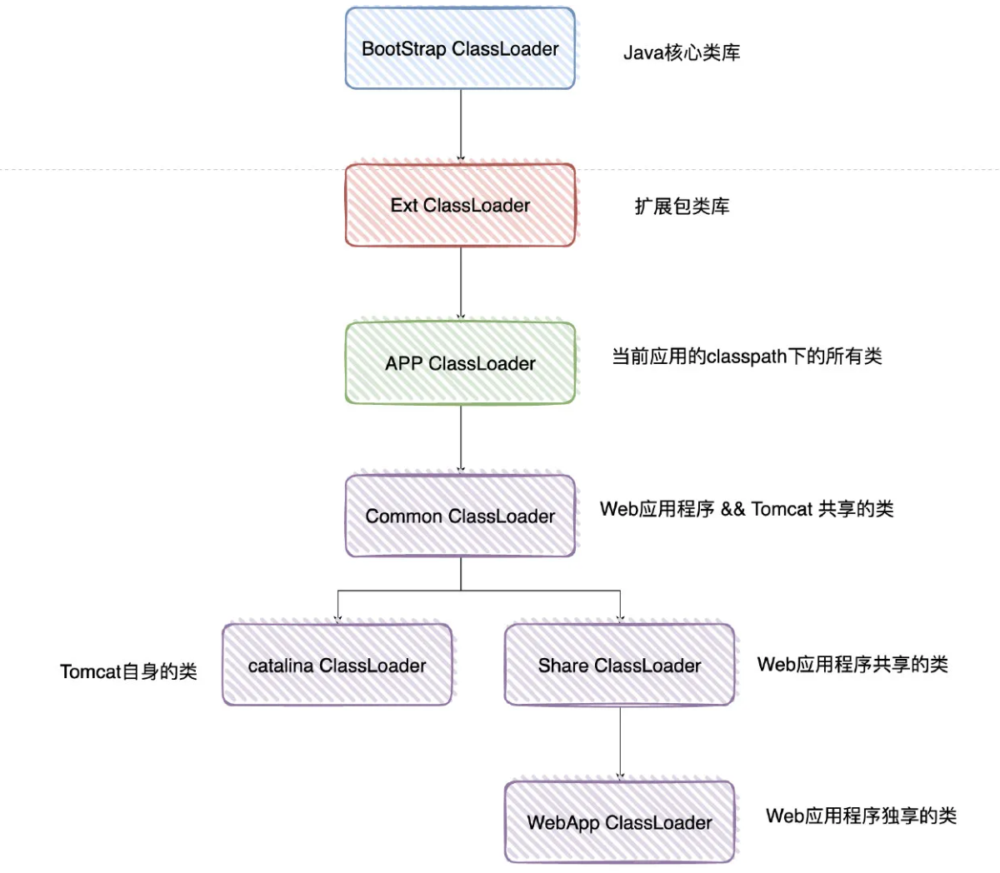

## 背景知识

JDK 中默认类加载器有 3 个：

* BootStrapClassLoader
* ExtClassLoader
* AppClassLoader
上述3个前者是后者的父加载器。

## 定义

双亲委派机制：加载器在加载过程中，先把类交由父类加载器进行加载，父类加载器没找到才优自身加载。

## 目的

防止内存中存在多份同样的字节码，安全考虑。

## 类加载规则

如果一个类由类加载器X加载，那么类的依赖类也是由**相同的类加载器**加载。

## 打破双亲委派机制

加载类时不是按照从 APPClassLoader -> ExtClassLoader -> BootStrap ClassLoader 的顺序找，就是打破双亲委派机制。

>只要不依次往上交由父加载器进行加载，就是打破双亲委派机制。

因为加载class核心方法是 LoaderClass 类的 loadClass 方法（双亲委派机制的核心实现）。所以只要自定义 ClassLoader，重写 loadClass 方法（不依照往上开始寻找类加载器），就是打破双亲委派机制。

## 案例分析

### Tomcat

#### 目的

隔离不同的应用程序，防止类全限名相同导致冲突。

#### 类加载结构图

#### Web应用层级隔离

Tomcat 给每个 Web 应用创建一个类加载器实例（WebAppClassLoader），该加载器重写了 loadClass 方法，优先加载当前应用目录下的类，如果找不到才一层一层往上找。这样就实现了 Web 应用层级的隔离。

#### 应用程序间共享

当然，并不是 Web 应用程序下的所有依赖都需要隔离，如 Redis 等类可以在应用程序中共享（如果需要），版本相同时没必要每个 Web 应用程序都独自加载一份。

实现方式是在 WebAppClassLoader 上加了一个父类加载器（SharedClassLoader），如果 WebAppClassLoader 自身没有加载到某个类，就委托 SharedClassLoader 去加载。

>其实就是把需要应用程序之间需要共享的类放到一个共享目录下。

#### 隔离Tomcat类

为了隔离 Web 应用和 Tomcat 自身的类，又有类加载器（CatalinaClassLoader）来加载 Tomcat 本身的依赖。

#### Tomcat与应用程序共享

如果 Tomcat 本身的依赖和 Web 应用还需要共享，还有类加载器（CommonClassLoader）来加载进而实现共享。

#### 小结

各个类加载器的加载目录可以查看 tomcat 的 catalina.properties 配置文件。

### JDBC

#### 目的

JDBC定义了接口，具体实现类由各个厂商来实现（如MySQL等）。

#### 实现

使用 JDBC 时是使用 DriverManager 来获取 Connection，DriverManager 在 java.sql 包中，按理是由 BootStrapClassLoader 来加载，但其无法加载第三方库中的类。当使用 DriverManager.getConnection 时无法加载到各个厂商实现的类。

所以 DriverManager 的解决方案是在其初始化时，得到“**线程上下文加载器**”，获取 Connection 时，先找 ExtClassLoader 和 BootStrapClassLoader（肯定加载不到），最终由 AppClassLoader 进行加载。

#### 讨论

本来是由 BootStrapClassLoader 进行类加载，但是 JDBC 改成了“**线程上下文加载器**”加载，但还遵守了：依次往上找父类加载器进行加载，都找不到时才由自身加载。类加载规则没有变化（也有说破坏了，仁者见仁智者见智，了解原理即可）。

