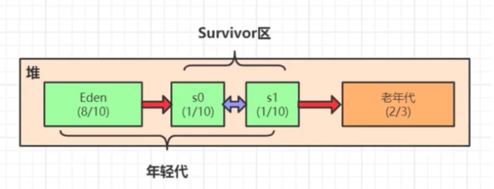
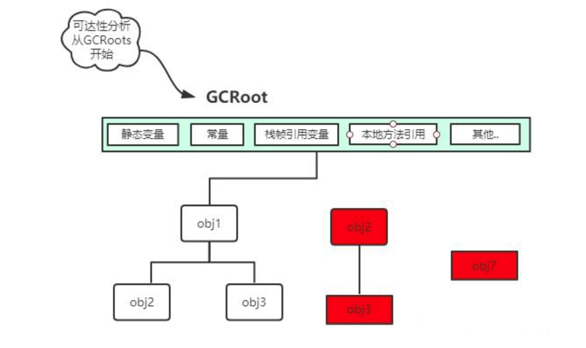

# 概述

当进行系统调优与线上问题排查时，深入理解 Java 虚拟机垃圾回收机制的底层原理是非常有必要的。Java 垃圾回收器的种类繁多，其设计主要在吞吐量（内存空间）与实时性（用户线程中断）进行权衡，适应场景也有所区别。本文主要针对 JDK8 进行分析。

# 内存/堆结构

新生代和老年代默认分配空间比为 1:2。

新生代又可以分为：

* Eden 区
* 两个 Survial 区（S0/S1）
空间占比：Eden（8/10）、S0（1/10）、S1（1/10）

一块独立的内存区域只能使用一种垃圾回收算法，根据对象生命周期特征，将其划到不同区域，再对特定区域使用特定的垃圾回收算法，将垃圾回收算法的优点发挥到极致。这种组合的垃圾回收算法成为**分代垃圾回收算法**。如：新生代使用**标记复制算法**，老年代使用**标记整理算法**。

# 对象回收算法

判断对象回收一般有两种方法。

## 引用计数器算法

对象被引用一次计数器加 1，对象取消被引用计数器减 1，计数器为 0 时则表示对象不被引用，可以被销毁。

该算法简单高效。但对于循环引用或者其它复杂情况，需要更多的开销，所以一般不使用该方法。

## 可达性分析算法

顺着 GCRoot 根向下搜索，只要在引用链上的对象就是可达的，在这之外的对象则不可达，不可达的对象就是可回收的。GCRoots 对象一般包括：

* 虚拟机栈帧上本地变量表中的引用对象（方法参数、局部变量、临时变量）
* 方法区中的静态属性引用类型对象、常量引用对象
* 本地方法栈中的引用对象（Native方法的引用对象）
* Java虚拟机内部的引用对象，如异常对象、系统类加载器等
* 被同步锁（synchronize）持有的对象
* Java 虚拟机内部情况的注册回调、本地缓存等

# 垃圾回收算法

垃圾具体如何回收涉及到垃圾回收算法。垃圾回收算法可分为3种：

* 标记清除算法
* 标记复制算法
* 标记整理算法
## 标记清除算法

### 流程

1. 标记出所有需要被回收的对象
2. 对标记对象进行统一清除
### 优点

* 效率高
### 缺点

* 执行效率不可控（如大部分对象都可回收，收集器需要一一大量执行标记、收集操作）
* 产生大量内存碎片
## 标记复制算法

### 流程

标记复制算法将内存分为大小相同的两个区域：

* 运行区域
* 预留区域
所有创建的新对象都分配到运行区域，当该区域内存不足时，则将该区域全部存活对象复制到预留区域，然后再清空整个运行区域内存。此时这两个区域的角色也互相调换。

标记复制算法在存在大量垃圾对象时，只需要复制较少的存活对象，不会产生内存碎片，新内存的分配只需要移动堆顶指针顺序分配即可，很好地兼顾了效率与内存碎片的问题。

### 优点

* 兼顾效率
* 避免内存碎片
### 缺点

* 预留一半空间造成浪费
* 少量垃圾大量存活对象时效果很差，复制操作很多但回收空间少
## 标记整理算法

基于前两种算法的优缺点，又提出了标记整理算法。

* 标记阶段：和其他算法一样
* 整理阶段：将存活的对象向内存空间一端移动，然后将存活对象边界以外的空间全部清空
# 堆内存回收过程

## 第一次MinorGC

* Eden 区空间不足时，触发 MinorGC
* 垃圾回收器首先将 Eden 区中存活对象复制到 S0 区中（S0或S1，互备）
* 清空 Eden 区空间
## 第二次MinorGC

* Eden 区空间不足时，再次触发 MinorGC
* 将 Eden 区存活对象复制到 S1 区
* 清空 Eden 区空间
* 将 S0 区存活对象复制到 S1 区并将对象的年龄加 1
* 清空 S0 区
第三次及之后 MinorGC 同理。

这里为了减少复制算法空白区域的空间浪费，不是将内存一分为二，而是巧妙地将内存分为三个区域，预留的空白区域只占整个年轻代的空间的 1/10。

## 进入老年代

进入老年代空间的条件：

* 从年轻代晋升
    * 年轻代分配担保：Survivor 区只有年轻代空间的 2/10 且一分为二，空间不足以分配所有存活对象时，将无法容纳的对象分配到老年代中
    * 对象年龄超过虚拟机 MaxTenuringThreshold 参数大小的对象（Parallel Scavenge:å 15，CMS: 6, G1: 15）
    * Survivor 空间中相同年龄所有对象大小的总和大于Survivor空间的一半（TargetSurvivorRatio），大于或等于该年龄的对象直接进入老年代
* 直接分配
    * 超过虚拟机 PretenureSizeThreshold 参数大小的大对象
    * 超过 Eden 大小的对象
    * 新生代分配失败，如大字符串或者大数组
## FullGC

老年代空间不足时就会触发 FullGC，FullGC 触发的条件一般有：

* 调用 System.gc()（建议虚拟机执行 FullGC，不一定真正去执行）
* 老年代空间不足
* 空间分配担保失败
* JDK 1.7 及以前的永久代空间不足
* CMS GC 时出现 Concurrent Mode Failure
