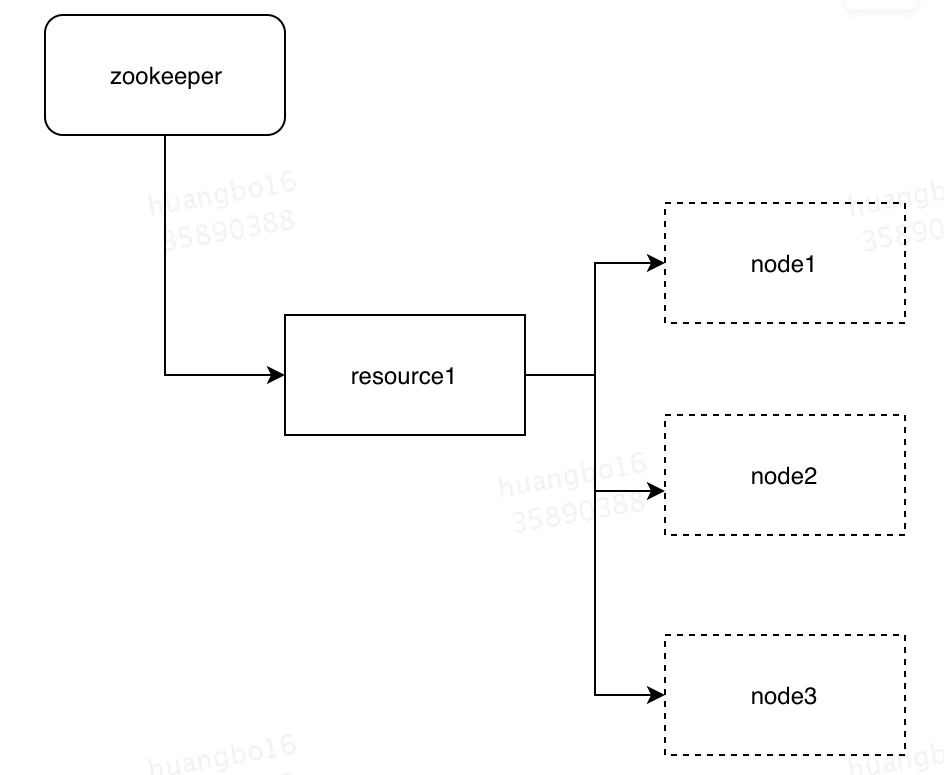

# **1.背景**

在单机时代，java中synchronized关键字和ReentrantLock可重入锁可以用来控制单机多线程对资源的并发访问。但是到了分布式系统的时代，系统可能会部署在不同的机器上，这些资源已经不是在单机多线程之间共享了，而是属于多机多线程之间共享。为了解决分布式环境下的资源共享问题，就需要使用到分布式锁。目前相对主流的实现方式有三种：数据库（mysql）、zookeeper、redis，本文主要介绍一下这3种实现方式及各自的优缺点。

# **2.典型实现**

## **2.1基于数据库实现**

### **2.1.1 基于数据表的简单分布式锁**

基于数据库来实现分布式锁需要依赖一张数据表，表结构如下：

```sql
 CREATE TABLE `methodLock` (
`ID` int(11) NOT NULL AUTO_INCREMENT COMMENT 'Primary Key',
`Method_name` varchar(64) NOT NULL DEFAULT '' COMMENT 'Locked Method Name',
`desc` varchar(1024) NOT NULL DEFAULT 'Note Information',
`update_time` timestamp NOT NULL DEFAULT CURRENT_TIMESTAMP ON UPDATE CURRENT_TIMESTAMP COMMENT 'save data time, automatic generation',
PRIMARY KEY (`id`),
UNIQUE KEY `uidx_method_name`(`method_name`) USING BTREE) ENGINE = InnoDB DEFAULT CHARSET = utf8 COMMENT='method in lock';
```
当我们想要对方法“method_A”添加锁时，可以采用下面的SQL语句往上表中插入一条记录
```sql
insert into methodLock(method_name,desc) values (‘method_A',‘desc')
```
因为这张数据表在method_name字段上创建了唯一索引，如果同时有多个插入请求提交，数据库会保证只会有一条记录插入成功。这样我们就可以认为插入记录成功的这个线程获取到了分布式锁，它可以执行后续的方法逻辑。
当方法执行完成后，需要执行下面的SQL语句来释放锁

```sql
delete from methodLock where method_name ='method_A'
```
上面利用数据库表简单实现了分布式锁的获取和释放，但是其存在多方面的问题：
* **对数据库是强依赖，存在单点问题，一旦数据库挂起，业务系统将不可用**
* **没有失效时间，一旦释放锁操作失败，将会一直持有锁，导致其他线程无法获取到锁**
* **非阻塞式，因为插入操作一旦失败数据库会直接返回错误信息，线程未获取到锁也不会进入等待重试队列，要再次获取锁，需要再次触发插入操作**
* **非可重入锁，同一线程在未释放锁前无法再次获取该锁，因为数据表中的数据已经存在了**
* **非公平锁，所有等待锁的线程会同时争抢锁，最终谁能够获取到锁，就要看谁比较幸运数据能够插入成功**

当然，上述几个问题也有相应的解决方案

* **数据库单点？可以建立数据库集群，在集群间进行数据同步，一旦主库挂掉，可以快速切到备库，保证分布式锁服务可用**
* **没有失效时间？只需要额外建立一个定时任务，定时清理超时数据**
* **非阻塞？可以通过while循环，在代码中添加重试逻辑，直到获取锁成功**
* **不可重入？在数据库中添加一个字段，记录当前获取到锁的主机和线程信息，下一次在获取锁前，先查询这个字段的信息，如果与当前获取锁的线程信息一致，则可以直接为该线程返回锁**
* **不公平？我们可以创建一张中间表来记录所有获取锁的线程，这张表就充当了队列的作用，按照插入时间排序，只有排在第一位的线程有机会获取锁**

### **2.1.2 基于数据库排他锁的分布式锁**

除了可以通过增删操作数据表中的记录以外，其实还可以借助数据中自带的锁来实现分布式锁。

仍然借助上面创建的数据表，在MySQL数据库的InnoDB引擎模式下，我们可以通过下面的方法来实现分布式锁操作，伪代码如下：

```java
public boolean lock(){
  connection.setAutoCommit(false);
  while(true){
    try{
      result = select * from methodLock where method_name=xxx for update;
      if(result==null){
        return true;
      }
    }catch(Exception e){
    }
    sleep(1000);
  }
  return false;
}
```
在查询语句后面添加“for update”语句，数据库会在查询过程中向数据库表添加独占锁，其他线程就无法再对这行记录加锁了。
我们可以假定一个线程获取了独占锁就获取了分布式锁，获取到锁以后，就可以执行后续业务逻辑。使用这种方式要注意进行事务的手动管理，在事务提交前执行业务逻辑，执行完成后手动提交事务来释放锁。

```java
public void unlock(){ connection.commit(); }
```
通过上面的这种方式可以高效解决上面提到的解锁和阻塞锁的问题。
针对解锁问题，在获取锁以后，如果服务突然宕机，不用担心锁不会释放，数据库连接会在在服务宕机后自动断开并释放锁。

针对阻塞问题，采用for update语句，其会保持阻塞状态，在成功执行或者执行失败后立即返回。

上述方案虽然解决了阻塞和解锁问题，但是数据库的单点、可重入、公平锁等问题仍需要进行额外处理。

### **2.1.3 小结**

基于数据库来实现分布式锁，都依赖于一个数据库表。一种是通过表中记录的存在来确定当前是否存在锁，另一种是通过数据库的排他锁来实现分布式锁。

优点就是简单明了，容易理解；缺点也很明显，为了实现一个功能完善的分布式锁，需要一堆额外的优化措施，使得整个方案变得愈加复杂，同时操作数据库需要一定的开销，性能问题不容忽视。

## **2.2 基于zookeeper实现**

基于ZooKeeper，是使用它的临时有序节点来实现的分布式锁。

zookeeper节点类型：

* 持久节点：创建后一直存在，直到主动删除；
* 临时节点：临时节点的生命周期和客户端会话绑定，客户端节点失效后，这个节点会自动被清除；
* 持久顺序节点：基本特性和持久节点一致，只是在创建节点时路径名后面增加一个自增的数字后缀；数字后缀的值记录在父节点的一个4bytes的字段中。
* 临时顺序节点：基本特性同临时节点，同样节点路径名带有自增数字。

### **2.2.1实现原理：**



加锁的流程:

1、创建永久节点resource1代表争抢的资源；

2、所有想获取锁的客户端都到resource1目录下创建临时顺序节点；

3、客户端获取当前目录下所有子节点，判断自己的节点是否位于子节点第一个；

4、如果是第一个，则获取到锁，返回成功；

5、如果不是第一个，则说明前面已经有客户端获取到锁了，那么需要获取自己节点的前一个节点，并监听前一个节点的状态，当监听到前一个节点被删除后返回步骤3。

解锁的流程:

删除当前客户端注册的临时节点即可。


锁超时：

Zookeeper不需要配置锁超时，创建临时节点的客户端维护着一个和服务端的session，服务端通过session判断客户端是否在线，当客户端机器宕机时，服务端会删除对应的临时节点。

### **2.2.2 公司内对zk分布式锁的封装**

公司内部已经对zk锁有了较好的封装。

**使用方式**

Lion对zk锁的使用进行了封装，业务可以方便的接入，因此在没有特殊情况下，我们使用lion封装好的分布式锁。

1.集群配置

在lion上配置${[app.name](http://app.name/)}.lion.lock.zookeeper.address集群地址

我们可以使用上海侧公共lion分布式锁的zk集群地址

线上：[dlm-zk.vip.sankuai.com:2181](http://dlm-zk.vip.sankuai.com:2181/)

线下：10.72.254.112:2181,10.72.254.204:2181,10.72.254.183:2181,10.72.206.230:2181,10.72.206.231:2181

2.代码接入

lion将对zk分布式锁的操作封装在ReentrantLock 和 ReentrantReadWriteLock 中，包名为com.dianping.lion.lock 含义与 Java 中的锁相同。

```java
String lockName = "testlock"; 
// 第二个参数为true，使用完锁后会删除锁节点，避免在ZK上残留大量节点 
lock = new ReentrantLock(lockName, true); 
```
在ZK上的路径是：/dp/lock/${[app.name](http://app.name/)}/${lockName}，lockName中只能包含字符数字和"-_."
### **2.2.3 小结**

zk实现的原理主要是ZAB协议控制所有写请求都转发到leader节点执行，以保证新建节点的唯一性。zk实现的分布式锁可用性较高，实现简单，自动锁释放，缺点是创建和删除节点的性能较差。zk分布式锁对于锁的qps和锁数量都有一定的要求，在锁QPS超过100或者锁的数量超过50万，建议不要使用基于ZK的分布式锁，应寻求其他分布式锁方案。

## **2.3基于redis实现**

redis实现分布式锁主要使用setnx这个命令实现，该命令的语义为如果该键不存在就设置该键的值，保证只有一个客户端能设置成功。

### **2.3.1 实现1**

加锁：

```shell
setnx key value；
expire key expireTime;
```
解锁：delete key
问题：setnx执行成功，而expire失败后机器宕机，会导致锁永远无法被释放。该方案基本不会被使用。

### **2.3.2 实现2**

redis从2.6.12版本开始，SET命令开始支持超时参数，并且保证整个操作是原子的。

加锁:SET key value NX PX expireMillSeconds

解锁:delete key

问题:

1.持有锁的线程挂掉后，其他线程必须等待锁超时失效后才能重新争抢；

2.不能保证删除锁的线程是锁的拥有者。

**2.3.3 实现3**

加锁:

```java
public boolean tryLock(){
  if (SET key expireTime NX PX expireMillSeconds 是否成功) {
    return true;
  } else {
    Date expireTime = get(key);
    if (expireTime < currentTime) {
      cas (key,expireTime,currentExpireTime 是否成功) {
      return true;
    } else {
      return false;
    }
    } else {
      return false;
    }
  }
}
```
解锁:delete key
问题:不能保证删除锁的线程是锁的拥有者。

### **2.3.4 实现4（防盗抢的实现）**

加锁:SET key value NX PX expireMillSeconds，value设置为一个独特的token。

解锁:compareAndDelete( key, token)

### **2.3.6 小结**

redis实现的原理是通过一致性哈希将不同key的散列到不同的机器进行处理，最终也是由master处理写。

redis实现的分布式锁性能最优，缺点是超时时间的设定比较困难。

如果需要保证只有锁的持有者才能释放锁，建议使用方案实现4，否则使用方案实现3，实现3可以减少锁持有者宕机后其他线程的等待时间。

# **3 方案比较**

|    |mysql|zookeeper|redis|
|:----|:----|:----|:----|
|实现复杂度|复杂|简单|简单|
|性能|3|2|1|
|可用性|3|1|2|
|可重入性|需要额外增加字段支持|支持|支持|
|锁超时|需要额外增加字段支持|支持，宕机后节点自动失效|支持，到达超时时间后失效|
|公司集群支持|支持|支持|支持|

总结：

* mysql方案理解最为简单，但是实现时需要处理的细节较多，适用于特别简单或者没有其他方案可选的场景。
* 在zk和redis都可选时，qps高于100或者锁数量大于50万时使用redis，否则使用zk。

PS:性能数据来源于参考文档。

# **4 参考文档**

[https://redis.io/commands/set](https://redis.io/commands/set)

[https://zookeeper.apache.org/doc/r3.1.2/zookeeperOver.html](https://zookeeper.apache.org/doc/r3.1.2/zookeeperOver.html)

[分布式锁benchmark](https://km.sankuai.com/page/28261920)

[https://www.cnblogs.com/zhili/p/redisdistributelock.html](https://www.cnblogs.com/zhili/p/redisdistributelock.html)

[https://xiaomi-info.github.io/2019/12/17/redis-distributed-lock/](https://xiaomi-info.github.io/2019/12/17/redis-distributed-lock/)

[https://zhuanlan.zhihu.com/p/100140241](https://zhuanlan.zhihu.com/p/100140241)

[https://juejin.im/post/6844903830442737671](https://juejin.im/post/6844903830442737671)
