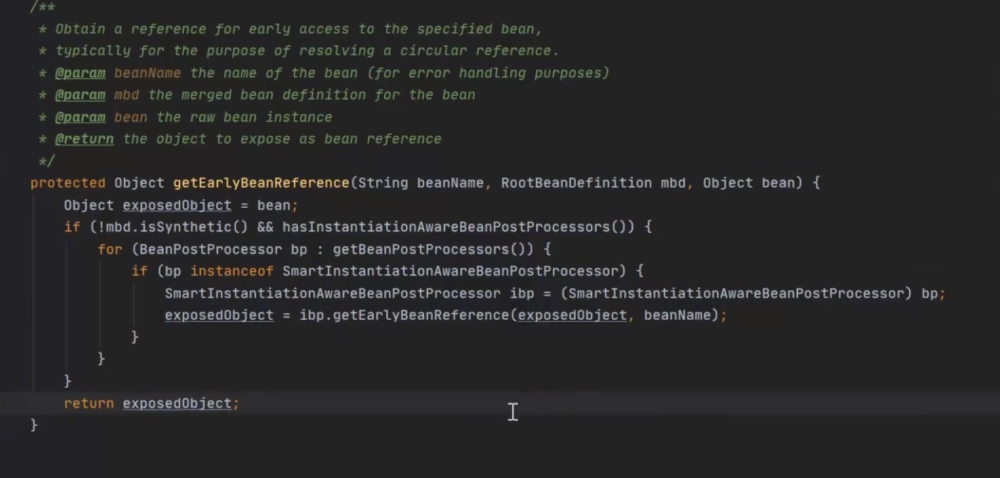

>本文主要讲解Spring循环依赖的缓存及其作用

## 三级缓存

### 一级缓存

Map<String, Object> singletonObjects = new ConCurrentHashMap<>(256)

用于保存BeanName和创建bean实例之间的关系**（成品对象）**

### 三级缓存

Map<String, ObjectFactory<?>> singletonFactories = new HashMap<>(16)

用于保存BeanName和创建bean的工厂之间的关系**（lambda表达式，完成代理对象的覆盖过程）**

**ObjectFactory是一个函数式接口，仅有一个方法，可以传入lambda表达式，可以是匿名内部类，通过调用getObject方法来执行具体的逻辑**

### 二级缓存

Map<String, Object> earlySingletonObjects = new ConCurrentHashMap<>(16)

保存BeanName和创建bean实例之间的关系，与singletonFactories的不同之处在于，当一个单例bean被放到这里之后，那么当bean还在就可以通过getBean方法获取到，可以方便进行循环依赖的检测**（半成品对象）**

set：可以解决

构造方法：没有办法解决

**实例化和初始化分开处理，提前暴露对象**

spring每次创建对象时都是先从容器中查找，找不到再创建

finishBeanFactoryInitialization(beanFactory)

beanFacatory.preInstantialteSingleton()

getBean() -> doGetBean() -> createBean() -> doCreateBean()

每次先按照顺序从一、二、三级缓存中寻找bean，当一级或二级中找到时，便移除二三级中的缓存（一级中存在时二三级都移除，二级存在时移除三级）。

## 问题

### 1、三级缓存解决循坏依赖问题的关键是什么？为什么通过提前暴露对象能解决？

实例化和初始化分开操作，在中间过中给其他对象赋值的时候，并不是一个完整对象，而是把半成品对象赋值给了其他对象

### 2、如果只使用一级缓存能不能解决问题？

不能。在整个处理过程中，缓存中存放的是半成品的和成品对象，如果只有一级缓存，那么成品和半成品都会放到一级缓存中，有可能在获取过程中获取到半成品对象，此时半成品对象是无法使用的，不能直接进行相关的处理，因此要把半成品和成品和成品的存放空间分割开来。

### 3、只使用二级缓存行不行？为什么需要三级缓存？

如果我能保证所有的bean对象都不去调用getEarlyBeanReference方法，使用二级缓存可以吗？

是的，如果保证所有的bean对象都不调用此方法，就可以只使用二级缓存！

使用三级缓存的本质在于使用AOP代理问题！！

### 4、如果某个bean对象代理对象，那么会不会创建普通的bean对象？

会！

### 5、为什么使用了三级缓存就可以解决AOP代理问题？

当一个对象需要被代理的时候，在整个过程中包含两个对象。一个是普通对象，一个是代理生成的对象，bean默认都是单例，那么我们在整个生命周期的处理环节中，一个beanname能对应两个对象吗？不能，既然不能，保证我们在使用的时候加一层判断，判断一下是否需要进行代理的处理。

### 6、怎么知道什么时候使用呢？

因为不知道什么时候会调用，所以通过一个匿名内部类的方式，在使用的时候直接对原对象进行覆盖操作，保证全局唯一！

### 7、为什么要包一层ObjectFactory对象？

如果创建的bean有对应的代理（前提），那么其他对象注入时，注入的应该是对应的代理对象；但是Spring无法提前知道这个对象是否有循环依赖的情况，而正常情况下（没有循环依赖），Spring都是在创建好完成品bean之后才创建对应的代理。这时候Spring有两个选择：

1）不管有没有循坏依赖，都提前创建好代理对象，并将代理对象放入缓存，出现循环依赖时，其他对象直接就可以取到代理对象并注入。

2）不提前创建好代理对象，在出现循坏依赖被其他对象注入时，才实时生成代理对象。这样在没有循环依赖的情况下，bean就可以按着Spring设计原则的步骤来创建。

Spring选择了第二种方式，那怎么做到提前曝光对象而又不生成代理呢？

Spring就是在对象外面包一层ObjectFactory，提前曝光的是ObjectFactory对象，在被注入时才在ObjectFactory.getObject方式内实时生成代理对象，并将生成好的代理对象放入到第二级缓存中。

为了防止对象在后面的初始化时重复代理，在创建代理时，第二级缓存会记录已代理的对象。

如果Spring选择了上面第一种方式，就会有以下不同的处理逻辑：

1、在提前曝光半成品时，直接执行getEarlyBeanReference创建到代理，并放入到二级缓存中。

2、有了上一步，就不需要通过ObjectFactory来延迟执行getEarlyBeanReference，也就不需要singletonFactory这一级缓存。

至于为什么不适用第一种方式在bean构造完之后就创建代理对象，是因为这违背了Spring的设计原则。Spring结合AOP跟bean的生命周期，是在bean创建完全之后通过AnnotationAwareAspectJAutoProxyCreator这个后置处理器来完成的，在这个后置处理的postProcessAfterInitialization方法中对初始化后的bean完成AOP代理。如果出现了循环依赖，那没有办法，只有给bean先创建代理，但是没有出现循环依赖的情况下，设计之初就是让bean在生命周期的最后一步完成代理而不是在实例化后（未初始化）就立马完成代理。

## 构造器依赖注入

解决方法及原理探索，参考：[https://www.jianshu.com/p/a178d84d2bcb](https://www.jianshu.com/p/a178d84d2bcb)

使用@lazy注解，代理。

构造器注入源码分析，参考：[https://cloud.tencent.com/developer/article/1461797](https://cloud.tencent.com/developer/article/1461797)  

[https://www.jianshu.com/p/885c2389b0e4](https://www.jianshu.com/p/885c2389b0e4)

## Reference

[Spring循环依赖是否可以去掉第三层缓存](https://segmentfault.com/a/1190000023647227)
