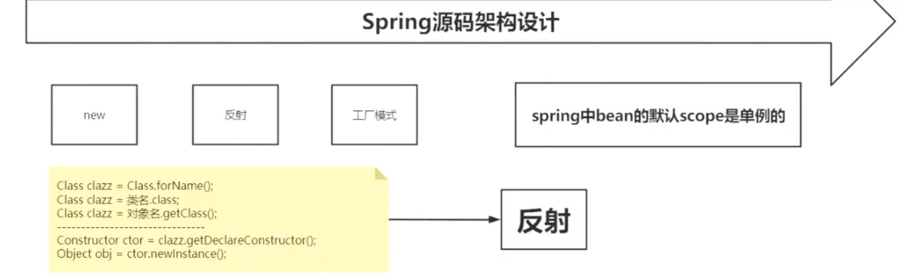
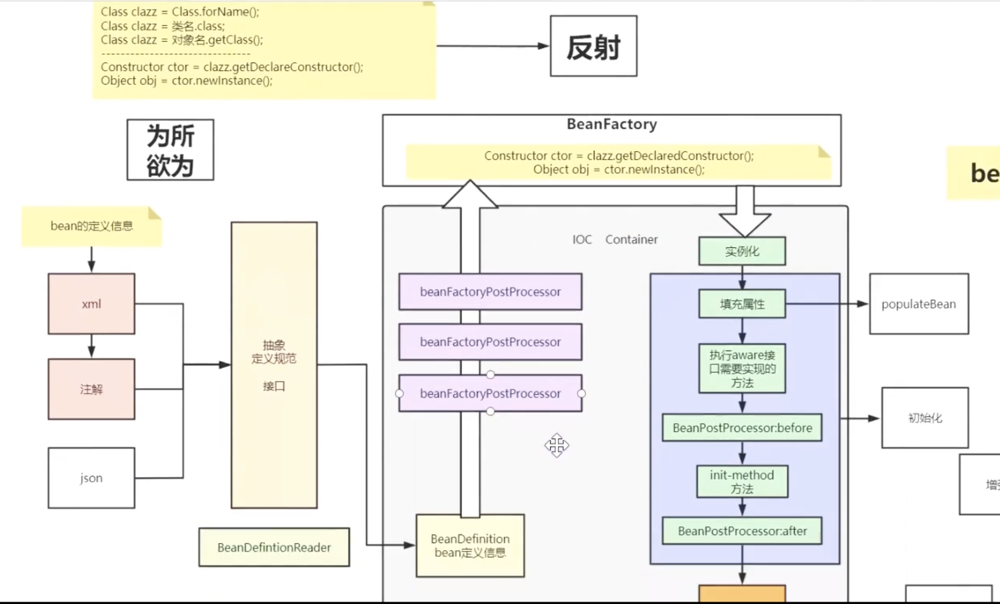
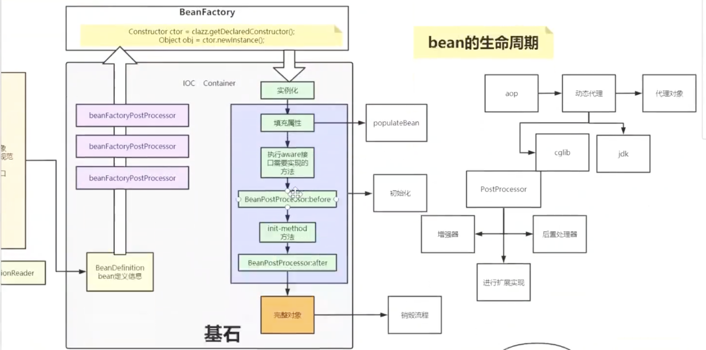
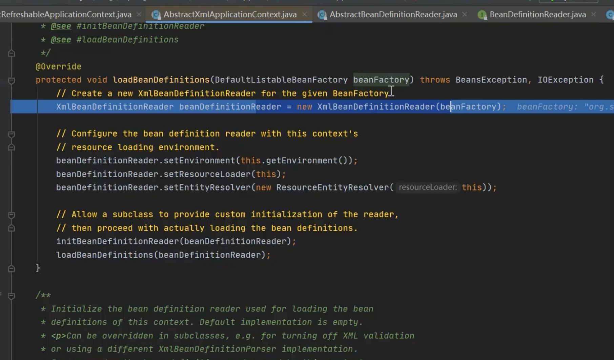
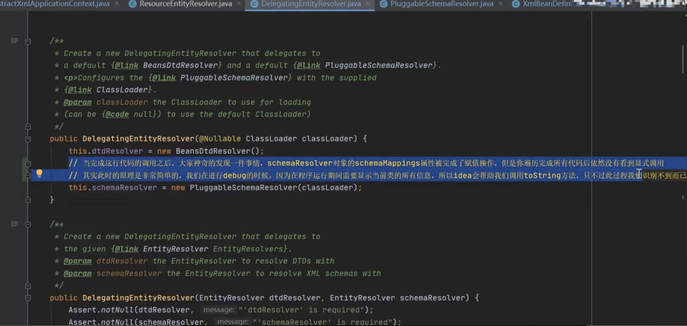

>本文主要讲解Spring Bean的加载

Spring源码阅读技巧

1、**Spring源码中真正干活的都是以do开头的方法**

2、只找有正确返回结果的代码

3、条件断点

4、发挥想象分析、猜


# 测试代码

resources/applicationContext.xml

```xml
<?xml version="1.0" encoding="UTF-8"?>
<beans xmlns="http://www.springframework.org/schema/beans"
       xmlns:xsi="http://www.w3.org/2001/XMLSchema-instance"
       xsi:schemaLocation="http://www.springframework.org/schema/beans http://www.springframework.org/schema/beans/spring-beans.xsd">
    <bean id="taxCalDTO" class="com.bytedance.cg.rebate.service.dto.common.TaxCalDTO">
        <property name="currency_code" value="USD"/>
    </bean>
</beans>
```

BeanTest.java

```java
package com.bytedance.cg;
import com.bytedance.cg.rebate.service.dto.common.TaxCalDTO;
import org.springframework.context.ApplicationContext;
import org.springframework.context.support.ClassPathXmlApplicationContext;
import org.springframework.context.support.FileSystemXmlApplicationContext;
public class BeanTest {
    public static void main(String[] args) {
        ApplicationContext ac = new FileSystemXmlApplicationContext("classpath:applicationContext.xml");
        ApplicationContext context = new ClassPathXmlApplicationContext("classpath:applicationContext.xml");
        TaxCalDTO taxCalDTO = (TaxCalDTO) context.getBean("taxCalDTO");
        System.out.println(taxCalDTO);
    }
}
```

# Bean的加载

参考Spring源码书P79

## 整体流程图








## bean的获取

```java
@Override
public Object getBean(String name) throws BeansException {
   return doGetBean(name, null, null, false);
}
@Override
public <T> T getBean(String name, Class<T> requiredType) throws BeansException {
   return doGetBean(name, requiredType, null, false);
}
```
获取bean的bean的过程：
### 1、转换对应的beanName

传入的参数name不一定是beanName，可能是别名，也可能是FactoryBean，需要进一步转换

```java
final String beanName = transformedBeanName(name);
```
* 去除FactoryBean的修饰符，也就是如果name="&aa"，那么首先去除&而使name="aa"
* 将别名alias转成最终的beanName

### 2、尝试从缓存中加载单例

单例在同一个容器中只会创建一次，先尝试加载单例，如果加载不成功则再次尝试从singletonFactories中加载。

```java
// 尝试从缓存获取 或 singletonFactories中的ObjectFactory中获取
Object sharedInstance = getSingleton(beanName);
// 存在如BeanFactory的情况并不是直接返回实例本身，而是返回指定方法返回的实例
bean = getObjectForBeanInstance(sharedInstance, name, beanName, null);
```
因为在创建单例bean的时候会存在依赖注入的情况，而在创建依赖的时候为了避免循环依赖，在Spring中创建bean的原则是不等bean创建完成就会将创建bean的ObjectFactory提早曝光加入到缓存中，一旦下一个bean创建时候需要依赖上一个bean则直接使用ObjectFactory（详细见循环依赖）
### 3、bean的实例化

如果从缓存中得到了bean的原始状态，则需要对bean进行实例化。

强调：缓存中只是原始的bean状态，不一定是最终想要的bean。如需要对工厂bean进行处理，那么这里得到的其实是工厂bean的初始状态，但我们真正需要的是工厂bean中定义的factory-method方法中返回的bean，而getObjectBeanInstance就是完成这个工作的

### 4、原型模式的依赖检查

只有在单例的情况下才会尝试解决循坏依赖

```java
if (isPrototypeCurrentlyInCreation(beanName)) {
   throw new BeanCurrentlyInCreationException(beanName);
}
```
### 5、检测parentBeanFactory

!containsBeanDefinition检测如果当前加载的XML配置文件中不包含beanName所对应的配置，就只能到parentBeanFactory尝试下，然后递归地调用getBean方法。

```java
// Check if bean definition exists in this factory.
BeanFactory parentBeanFactory = getParentBeanFactory();
if (parentBeanFactory != null && !containsBeanDefinition(beanName)) {
   // Not found -> check parent.
   String nameToLookup = originalBeanName(name);
   if (args != null) {
      // Delegation to parent with explicit args.
      return (T) parentBeanFactory.getBean(nameToLookup, args);
   }
   else {
      // No args -> delegate to standard getBean method.
      return parentBeanFactory.getBean(nameToLookup, requiredType);
   }
}
```
### 6、转换Definition

将存储XML配置文件的GernericBeanDifinition转换为RootBeanDifinition。

因为从XML配置文件中读取到的Bean信息是存储在GernericBeanDifinition中的，但是所有的Bean后续处理都是针对于RootBeanDefinition的，所以需要进行转换。转换的同时如果父类bean不为空的话，则会一并合并父类的属性。

```java
final RootBeanDefinition mbd = getMergedLocalBeanDefinition(beanName);
```
### 7、寻找依赖

因为bean的初始化过程中很可能会用到某些属性，某些属性很可能是动态配置的，并且配置成依赖于其他的bean，那么这个时候有必要先加载依赖的bean。

```java
String[] dependsOn = mbd.getDependsOn();
```
### 8、针对不同的scope进行bean的创建

Spring默认的scope是singleton，其他如prototype、request。该步骤根据不同的配置进行不同的初始化策略。

```java
String scopeName = mbd.getScope();
final Scope scope = this.scopes.get(scopeName);
```
### 9、类型转换

该功能是将返回的bean转换为requiredType指定的类型。如将String转换成Integer，或者其他的转换器。用户也可以自己扩展转换器。

```java
// Check if required type matches the type of the actual bean instance.
if (requiredType != null && bean != null && !requiredType.isAssignableFrom(bean.getClass())) {
   try {
      return getTypeConverter().convertIfNecessary(bean, requiredType);
   }
   catch (TypeMismatchException ex) {
      if (logger.isDebugEnabled()) {
         logger.debug("Failed to convert bean '" + name + "' to required type [" +
               ClassUtils.getQualifiedName(requiredType) + "]", ex);
      }
      throw new BeanNotOfRequiredTypeException(name, requiredType, bean.getClass());
   }
}
```
## 1、FactoryBean的使用

FactoryBean接口对于Spring框架来说占有重要的地位，Spring自身提供了70多个FactoryBean的实现。它们隐藏了实例化一些复杂的bean的细节，给上层应用带来了便利。

**当配置文件中<bean>的class属性配置的实现类是FactoryBean时，通过getBean()方法返回的不是FactoryBean本身，而是FactoryBean#getObject()方法所返回的对象，相当于FactoryBean#getObject()代理了getBean()方法。**

举个例子，使用逗号分隔将多个属性值配置在一个参数中，这种自定义的配置方式比较灵活。详细可见P84。

如果需要获取到XXFactoryBean的实例，则需要在使用getBean(beanName)方法时在beanName前显式地加上"&"前缀，例如getBean("&car")

## 2、缓存中获取单例bean

因为在创建单例bean的过程中会存在依赖注入的情况，而在创建依赖的时候为了避免循坏依赖，Spring创建bean的原则是不等bean创建完成就会将创建bean的ObjectFactory提早曝光加入到缓存中，一旦下一个bean创建时需要依赖上个bean，则直接使用ObjectFactory。

```java
@Override
public Object getSingleton(String beanName) {
   // 参数true设置标识允许早期依赖
   return getSingleton(beanName, true);
}
protected Object getSingleton(String beanName, boolean allowEarlyReference) {
   // 检查缓存中是否存在实例
   Object singletonObject = this.singletonObjects.get(beanName);
   if (singletonObject == null && isSingletonCurrentlyInCreation(beanName)) {
      // 如果为空，则锁定全局变量并进行处理
      synchronized (this.singletonObjects) {
         // 如果此bean正在加载则不处理
         singletonObject = this.earlySingletonObjects.get(beanName);
         if (singletonObject == null && allowEarlyReference) {
            // 某些方法需要提前初始化则会调用addSingletonFactory方法将对应的ObjectFactory初始化策略存储在singletonFactories
            ObjectFactory<?> singletonFactory = this.singletonFactories.get(beanName);
            if (singletonFactory != null) {
               // 调用预先设定的getObject方法
               singletonObject = singletonFactory.getObject();
               // 记录在缓存中，earlySingletonObjects和singletonFactories互斥
               this.earlySingletonObjects.put(beanName, singletonObject);
               this.singletonFactories.remove(beanName);
            }
         }
      }
   }
   return (singletonObject != NULL_OBJECT ? singletonObject : null);
}
```
简单解释存储bean的不同map
1、singletonObjects：用于保存BeanName和创建bean实例之间的关系，bean name -> bean instance

2、singletonFactories：用于保存BeanName和创建bean的工厂之间的关系，bean name -> ObjectFactory

3、earlySingletonObjects：也是保存beanName和创建bean实例之间的关系，只不过这里的bean相当于半成品，其目的是用来检测循环引用。

4、registeredSingletons：用来保存当前所有已注册的bean。

## 3、从bean的实例中获取对象

在getBean方法中，getObjectForBeanInstance是个高频使用的方法，无论是从缓存中获得bean还是根据不同的scope策略加载bean，总之我们得到bean的实例后要做的第一步就是调用该方法检测正确性，其实就是用于检测当前bean是否是FactoryBean类型的bean，如果是，则调用该bean对应FactoryBean实例中的getObject()作为返回值。

无论是从缓存中获取到的bean还是通过不同的scope策略加载的bean都只是最原始的bean状态，并不一定是我们最终想要的bean。举个例子，假如我们需要对工厂bean进行处理，那么这里得到的其实是工厂bean的初始状态，但是我们真正需要的是工厂bean中定义的factory-method方法中返回的bean，而getObjectForBeanInstance方法就是完成这个工作的。

```java
protected Object getObjectForBeanInstance(
      Object beanInstance, String name, String beanName, RootBeanDefinition mbd) {
   // 如果指定的name是工厂相关(以&为前缀)且beanInstance又不是FactoryBean类型则验证不通过
   if (BeanFactoryUtils.isFactoryDereference(name) && !(beanInstance instanceof FactoryBean)) {
      throw new BeanIsNotAFactoryException(transformedBeanName(name), beanInstance.getClass());
   }
   // 实例可能是正常的bean也可能是FactoryBean
   // 如果是FactoryBean，如果用户想要直接获取工厂实例而不是工厂对应的getObject方法对应的实例那么传入的name应该加入前缀&
   if (!(beanInstance instanceof FactoryBean) || BeanFactoryUtils.isFactoryDereference(name)) {
      return beanInstance;
   }
   // 加载FactoryBean
   Object object = null;
   if (mbd == null) {
      // 尝试从缓存中加载bean
      object = getCachedObjectForFactoryBean(beanName);
   }
   if (object == null) {
      // 到这里已经明确知道beanInstance一定是FactoryBean实例
      FactoryBean<?> factory = (FactoryBean<?>) beanInstance;
      // containsBeanDefinition检测beanDefinitionMap中也就是在所有已经加载的类中检测是否定义beanName
      if (mbd == null && containsBeanDefinition(beanName)) {
         // 将存储XML配置文件中的GernericBeanDefinition转换为RootBeanDefinition，如果指定BeanName是子Bean的话同时会合并父类的相关属性
         mbd = getMergedLocalBeanDefinition(beanName);
      }
      // 是否是用户定义的而不是应用程序本身定义的
      boolean synthetic = (mbd != null && mbd.isSynthetic());
      // 真正核心的代码
      object = getObjectFromFactoryBean(factory, beanName, !synthetic);
   }
   return object;
}
```
上述代码大多是辅助代码以及一些功能性的判断，真正的核心代码委托给了getObjectFromFactoryBean。
上述代码主要的工作：

1）对FactoryBean正确性的验证

2）对非FactoryBean不做任何处理

3）对bean进行转换

4）将从Factory中解析bean的工作委托给getObjectFromFactoryBean

getObjectFromFactoryBean方法只做了一件事，即返回的bean如果是单例的，就必须保证全局唯一，同时，如果是单例，不必重复创建，可以使用缓存来提高性能。

```java
protected Object getObjectFromFactoryBean(FactoryBean<?> factory, String beanName, boolean shouldPostProcess) {
   if (factory.isSingleton() && containsSingleton(beanName)) {
      synchronized (getSingletonMutex()) {
         Object object = this.factoryBeanObjectCache.get(beanName);
         if (object == null) {
            object = doGetObjectFromFactoryBean(factory, beanName);
            // Only post-process and store if not put there already during getObject() call above
            // (e.g. because of circular reference processing triggered by custom getBean calls)
            Object alreadyThere = this.factoryBeanObjectCache.get(beanName);
            if (alreadyThere != null) {
               object = alreadyThere;
            }
            else {
               if (object != null && shouldPostProcess) {
                  try {
                     // 调用后置处理器
                     object = postProcessObjectFromFactoryBean(object, beanName);
                  }
                  catch (Throwable ex) {
                     throw new BeanCreationException(beanName,
                           "Post-processing of FactoryBean's singleton object failed", ex);
                  }
               }
               this.factoryBeanObjectCache.put(beanName, (object != null ? object : NULL_OBJECT));
            }
         }
         return (object != NULL_OBJECT ? object : null);
      }
   }
   else {
      Object object = doGetObjectFromFactoryBean(factory, beanName);
      if (object != null && shouldPostProcess) {
         try {
            // 调用后置处理器
            object = postProcessObjectFromFactoryBean(object, beanName);
         }
         catch (Throwable ex) {
            throw new BeanCreationException(beanName, "Post-processing of FactoryBean's object failed", ex);
         }
      }
      return object;
   }
}
```
>注意后置处理代码在不同的spring版本中位置不一样，有的放在getObjectFromFactoryBean中，有的放在doGetObjectFromFactoryBean中
doGetObjectFromFactoryBean方法中就是最终的方法，即factory.getObject()。

```java
private Object doGetObjectFromFactoryBean(final FactoryBean<?> factory, final String beanName)
      throws BeanCreationException {
   Object object;
   try {
      // 需要权限验证
      if (System.getSecurityManager() != null) {
         AccessControlContext acc = getAccessControlContext();
         try {
            object = AccessController.doPrivileged(new PrivilegedExceptionAction<Object>() {
               @Override
               public Object run() throws Exception {
                     return factory.getObject();
                  }
               }, acc);
         }
         catch (PrivilegedActionException pae) {
            throw pae.getException();
         }
      }
      else {
         // 直接调用getObject方法
         object = factory.getObject();
      }
   }
   catch (FactoryBeanNotInitializedException ex) {
      throw new BeanCurrentlyInCreationException(beanName, ex.toString());
   }
   catch (Throwable ex) {
      throw new BeanCreationException(beanName, "FactoryBean threw exception on object creation", ex);
   }
   // Do not accept a null value for a FactoryBean that's not fully
   // initialized yet: Many FactoryBeans just return null then.
   if (object == null && isSingletonCurrentlyInCreation(beanName)) {
      throw new BeanCurrentlyInCreationException(
            beanName, "FactoryBean which is currently in creation returned null from getObject");
   }
   return object;
}
```
可以看到获取到bean之后，没有立即返回，而是接下来又进行了后处理的操作postProcessObjectFromFactoryBean
后处理规则：尽可能保证所有bean初始化后都会调用注册的BeanPostProcessor的postProcessAfterInitialization方法进行处理，在实际开发过程中大可以针对此特性设计自己的业务逻辑。

```java
@Override
public Object applyBeanPostProcessorsAfterInitialization(Object existingBean, String beanName)
      throws BeansException {
   Object result = existingBean;
   for (BeanPostProcessor beanProcessor : getBeanPostProcessors()) {
      result = beanProcessor.postProcessAfterInitialization(result, beanName);
      if (result == null) {
         return result;
      }
   }
   return result;
}
```
>注意：这里找代码涉及到子类方法的覆盖

## 4、获取单例

如果缓存中不存在已经加载过的单例bean就需要从头开始bean的加载过程了，而spring中使用getSingleton的重载方法实现bean的加载过程。

调用入口：

```java
sharedInstance = getSingleton(beanName, new ObjectFactory<Object>() {
   @Override
   public Object getObject() throws BeansException {
      try {
         return createBean(beanName, mbd, args);
      }
      catch (BeansException ex) {
         // Explicitly remove instance from singleton cache: It might have been put there
         // eagerly by the creation process, to allow for circular reference resolution.
         // Also remove any beans that received a temporary reference to the bean.
         destroySingleton(beanName);
         throw ex;
      }
   }
});
```
getSingleton重载方法
```java
public Object getSingleton(String beanName, ObjectFactory<?> singletonFactory) {
   Assert.notNull(beanName, "'beanName' must not be null");
   // 全局变量需要同步  
   synchronized (this.singletonObjects) {
      // 首先检查对应的bean是否已经加载过，因为singleton模式其实就是复用以创建的bean
      Object singletonObject = this.singletonObjects.get(beanName);
      // 如果为空才可以进行singleto的bean的初始化
      if (singletonObject == null) {
         if (this.singletonsCurrentlyInDestruction) {
            throw new BeanCreationNotAllowedException(beanName,
                  "Singleton bean creation not allowed while the singletons of this factory are in destruction " +
                  "(Do not request a bean from a BeanFactory in a destroy method implementation!)");
         }
         if (logger.isDebugEnabled()) {
            logger.debug("Creating shared instance of singleton bean '" + beanName + "'");
         }
         // 前处理
         beforeSingletonCreation(beanName);
         boolean newSingleton = false;
         boolean recordSuppressedExceptions = (this.suppressedExceptions == null);
         if (recordSuppressedExceptions) {
            this.suppressedExceptions = new LinkedHashSet<Exception>();
         }
         try {
            // 初始化bean
            singletonObject = singletonFactory.getObject();
            newSingleton = true;
         }
         catch (IllegalStateException ex) {
            // Has the singleton object implicitly appeared in the meantime ->
            // if yes, proceed with it since the exception indicates that state.
            singletonObject = this.singletonObjects.get(beanName);
            if (singletonObject == null) {
               throw ex;
            }
         }
         catch (BeanCreationException ex) {
            if (recordSuppressedExceptions) {
               for (Exception suppressedException : this.suppressedExceptions) {
                  ex.addRelatedCause(suppressedException);
               }
            }
            throw ex;
         }
         finally {
            if (recordSuppressedExceptions) {
               this.suppressedExceptions = null;
            }
            // 后处理
            afterSingletonCreation(beanName);
         }
         if (newSingleton) {
            // 加入缓存
            addSingleton(beanName, singletonObject);
         }
      }
      return (singletonObject != NULL_OBJECT ? singletonObject : null);
   }
}
```
上述代码使用了回调方法，使得程序可以在单例创建的前后做一些准备及处理操作，而真正的获取单例bean的方法其实并不是在此方法中实现的，其实现逻辑是在ObjectFactory类型的实例singletonFactory中实现的。而这些准备及处理操作包括如下内容：
1）检查缓存是否已经加载过

2）若没有加载，则记录beanName的正在加载状态

3）加载单例前记录状态

beforeSingletonCreation不是空实现，做了很重要的操作：记录加载状态，即通过singletonsCurrentlyInCreation.add(beanName)将当前正要创建的bean记录在缓存中，这样便可以对循环依赖进行检测。

```java
protected void beforeSingletonCreation(String beanName) {
   if (!this.inCreationCheckExclusions.contains(beanName) && !this.singletonsCurrentlyInCreation.add(beanName)) {
      throw new BeanCurrentlyInCreationException(beanName);
   }
}
```
4）通过调用参数传入的ObjectFactory的个体Object方法实例化bean
5）加载单例后的处理方法调用

与步骤3）相似，当bean加载结束后需要移除缓存中对该bean的正在加载状态的记录

6）将结果记录至缓存并删除加载bean过程中所记录的各种辅助状态

```java
protected void addSingleton(String beanName, Object singletonObject) {
   synchronized (this.singletonObjects) {
      this.singletonObjects.put(beanName, (singletonObject != null ? singletonObject : NULL_OBJECT));
      this.singletonFactories.remove(beanName);
      this.earlySingletonObjects.remove(beanName);
      this.registeredSingletons.add(beanName);
   }
}
```
7）返回处理结果
代码见上面的获取单例的调用入口getSingleton

## 5、准备创建bean

即上述getSingleton中调用createBean方法

>注意源码溯源方法的重载覆盖

```java
@Override
protected Object createBean(String beanName, RootBeanDefinition mbd, Object[] args) throws BeanCreationException {
   if (logger.isDebugEnabled()) {
      logger.debug("Creating instance of bean '" + beanName + "'");
   }
   RootBeanDefinition mbdToUse = mbd;
   // 锁定class，根据设置的class属性或者className来解析Class
   Class<?> resolvedClass = resolveBeanClass(mbd, beanName);
   if (resolvedClass != null && !mbd.hasBeanClass() && mbd.getBeanClassName() != null) {
      mbdToUse = new RootBeanDefinition(mbd);
      mbdToUse.setBeanClass(resolvedClass);
   }
   // 验证及准备覆盖的方法
   try {
      mbdToUse.prepareMethodOverrides();
   }
   catch (BeanDefinitionValidationException ex) {
      throw new BeanDefinitionStoreException(mbdToUse.getResourceDescription(),
            beanName, "Validation of method overrides failed", ex);
   }
   try {
      // 给BeanPostProcessors一个机会来返回代理替代真正的实例
      Object bean = resolveBeforeInstantiation(beanName, mbdToUse);
      if (bean != null) {
         return bean;
      }
   }
   catch (Throwable ex) {
      throw new BeanCreationException(mbdToUse.getResourceDescription(), beanName,
            "BeanPostProcessor before instantiation of bean failed", ex);
   }
   Object beanInstance = doCreateBean(beanName, mbdToUse, args);
   if (logger.isDebugEnabled()) {
      logger.debug("Finished creating instance of bean '" + beanName + "'");
   }
   return beanInstance;
}
```
### 处理override属性

```java
mbdToUse.prepareMethodOverrides();
```

### 实例化的前置处理

**当经过前置处理后返回的结如果不为空，那么会直接略过后序的Bean的创建而直接返回结果。这一特性起着至关重要的作用，AOP功能是基于这里判断的**

```java
resolveBeforeInstantiation
```
## 6、循环依赖

## 7、创建bean

createBean调用核心代码doCreateBean

整个函数的概要思路：

1）如果是单例需要首先清楚缓存

2）实例化bean，将BeanDefinition转换为BeanWrapper

3）MergedBeanDefinitionPostProcessor的应用

bean合并后的处理，Autowired注解正是通过此方法实现诸如类型的预解析

4）依赖处理

5）属性填充

6）循环依赖处理

7）注册DisposableBean

如果配置了destroy-method，需要注册以便于在销毁时候调用

8）完成创建并返回

```java
protected Object doCreateBean(final String beanName, final RootBeanDefinition mbd, final Object[] args) {
   // Instantiate the bean.
   BeanWrapper instanceWrapper = null;
   if (mbd.isSingleton()) {
      instanceWrapper = this.factoryBeanInstanceCache.remove(beanName);
   }
   if (instanceWrapper == null) {
      // 根据指定bean使用对应的策略创建新的实例，如：工厂方法、构造函数自动注入、简单初始化
      instanceWrapper = createBeanInstance(beanName, mbd, args);
   }
   final Object bean = (instanceWrapper != null ? instanceWrapper.getWrappedInstance() : null);
   Class<?> beanType = (instanceWrapper != null ? instanceWrapper.getWrappedClass() : null);
   // Allow post-processors to modify the merged bean definition.
   synchronized (mbd.postProcessingLock) {
      if (!mbd.postProcessed) {
         // 应用MergedBeanDefinitionPostProcessor
         applyMergedBeanDefinitionPostProcessors(mbd, beanType, beanName);
         mbd.postProcessed = true;
      }
   }
   // 是否需要提早曝光：单例&允许循环依赖&当前bean正在创建中，检测循环依赖
   boolean earlySingletonExposure = (mbd.isSingleton() && this.allowCircularReferences &&
         isSingletonCurrentlyInCreation(beanName));
   if (earlySingletonExposure) {
      if (logger.isDebugEnabled()) {
         logger.debug("Eagerly caching bean '" + beanName +
               "' to allow for resolving potential circular references");
      }
      // 为避免后期循环依赖，可以在bean初始化完成前将创建实例的ObjectFactory工厂
      addSingletonFactory(beanName, new ObjectFactory<Object>() {
         @Override
         public Object getObject() throws BeansException {
            // 对bean再一次循环依赖，主要应用SmartInstantiationAware BeanPostProcessor
            // 其中我们熟悉的AOP就是在这里将advice动态织入bean中，若没有则直接返回bean，不做处理
            return getEarlyBeanReference(beanName, mbd, bean);
         }
      });
   }
   // Initialize the bean instance.
   Object exposedObject = bean;
   try {
      // 对bean进行填充，将各个属性值织入，其中，可能存在依赖于其他bean的属性，则会递归初始依赖bean
      populateBean(beanName, mbd, instanceWrapper);
      if (exposedObject != null) {
         // 调用初始化方法，比如init-method
         exposedObject = initializeBean(beanName, exposedObject, mbd);
      }
   }
   catch (Throwable ex) {
      if (ex instanceof BeanCreationException && beanName.equals(((BeanCreationException) ex).getBeanName())) {
         throw (BeanCreationException) ex;
      }
      else {
         throw new BeanCreationException(mbd.getResourceDescription(), beanName, "Initialization of bean failed", ex);
      }
   }
   if (earlySingletonExposure) {
      Object earlySingletonReference = getSingleton(beanName, false);
      // 只有在检测到有循环依赖的情况下才会不为空
      if (earlySingletonReference != null) {
         // 如果exposedObject没有在初始化方法中被改变，也就是没有被增强
         if (exposedObject == bean) {
            exposedObject = earlySingletonReference;
         }
         else if (!this.allowRawInjectionDespiteWrapping && hasDependentBean(beanName)) {
            String[] dependentBeans = getDependentBeans(beanName);
            Set<String> actualDependentBeans = new LinkedHashSet<String>(dependentBeans.length);
            for (String dependentBean : dependentBeans) {
               // 检测依赖
               if (!removeSingletonIfCreatedForTypeCheckOnly(dependentBean)) {
                  actualDependentBeans.add(dependentBean);
               }
            }
            // 因为bean创建后其所依赖的bean一定是已经创建的
            // actualDependentBeans不为空则表示当前bean创建后其依赖的bean却没有没全部创建，也就是说存在循环依赖
            if (!actualDependentBeans.isEmpty()) {
               throw new BeanCurrentlyInCreationException(beanName,
                     "Bean with name '" + beanName + "' has been injected into other beans [" +
                     StringUtils.collectionToCommaDelimitedString(actualDependentBeans) +
                     "] in its raw version as part of a circular reference, but has eventually been " +
                     "wrapped. This means that said other beans do not use the final version of the " +
                     "bean. This is often the result of over-eager type matching - consider using " +
                     "'getBeanNamesOfType' with the 'allowEagerInit' flag turned off, for example.");
            }
         }
      }
   }
   // Register bean as disposable.
   try {
      // 根据scope注册bean
      registerDisposableBeanIfNecessary(beanName, bean, mbd);
   }
   catch (BeanDefinitionValidationException ex) {
      throw new BeanCreationException(mbd.getResourceDescription(), beanName, "Invalid destruction signature", ex);
   }
   return exposedObject;
}
```
### 创建bean的实例

实例化逻辑：

1）如果在RootBeanDefinition中存在factoryMethodName属性，或者在配置文件中配置了factory-method，那么Spring会尝试使用instantiateUsingFactoryMethod(beanName, mbd, args)方法根据RootBeanDefinition中的配置生成bean的实例

2）解析构造函数并进行构造函数的实例化。因为一个bean对应的类中可能会有多个构造函数，而每个构造函数的参数不同，Spring在根据参数及类型去判断最终会使用哪个构造函数进行实例化。但是，判断的过程是个比较消耗性能的步骤，所以采用缓存机制，如果已经解析过则不需要重复解析而是直接从RootBeanDefinition中的属性resolvedConstructorOrFacrotyMethod缓存的值去取，否则需要再次解析，并将解析的结果添加至RootBeanDefinition中的属性resolvedConstructorOrFactoryMethod中。

```java
protected BeanWrapper createBeanInstance(String beanName, RootBeanDefinition mbd, Object[] args) {
   // 解析class
   Class<?> beanClass = resolveBeanClass(mbd, beanName);
   if (beanClass != null && !Modifier.isPublic(beanClass.getModifiers()) && !mbd.isNonPublicAccessAllowed()) {
      throw new BeanCreationException(mbd.getResourceDescription(), beanName,
            "Bean class isn't public, and non-public access not allowed: " + beanClass.getName());
   }
   // 如果工厂方法不为空则使用工厂方法初始化策略
   if (mbd.getFactoryMethodName() != null)  {
      return instantiateUsingFactoryMethod(beanName, mbd, args);
   }
   // Shortcut when re-creating the same bean...
   boolean resolved = false;
   boolean autowireNecessary = false;
   if (args == null) {
      synchronized (mbd.constructorArgumentLock) {
         // 一个类有多个构造函数，每个构造函数都有不同的参数，所以调用前需要先根据参数锁定构造函数或对应的工厂方法
         if (mbd.resolvedConstructorOrFactoryMethod != null) {
            resolved = true;
            autowireNecessary = mbd.constructorArgumentsResolved;
         }
      }
   }
   // 如果已经解析过则使用解析好的构造函数方法不需要再次锁定
   if (resolved) {
      if (autowireNecessary) {
         // 构造函数自动注入
         return autowireConstructor(beanName, mbd, null, null);
      }
      else {
         // 使用默认构造函数构造
         return instantiateBean(beanName, mbd);
      }
   }
   // 需要根据参数解析构造函数
   Constructor<?>[] ctors = determineConstructorsFromBeanPostProcessors(beanClass, beanName);
   if (ctors != null ||
         mbd.getResolvedAutowireMode() == RootBeanDefinition.AUTOWIRE_CONSTRUCTOR ||
         mbd.hasConstructorArgumentValues() || !ObjectUtils.isEmpty(args))  {
      // 构造函数自动注入
      return autowireConstructor(beanName, mbd, ctors, args);
   }
   // 使用默认构造函数构造
   return instantiateBean(beanName, mbd);
}
```
#### 1、autowireConstructor

对于实例的创建Spring分成了两种情况，一种是通用的实例化，另一种是带有参数的实例化。带有参数的实例化过程相当复杂，因为存在着不确定性，所以在判断对应参数上做了大量工作。

>这里代码逻辑太长，略，见P105
1）构造函数参数的确定

* 根据explicitArgs参数判断
* 缓存中获取
* 配置文件中获取
2）构造函数的确定

3）根据确定的构造函数转换对应的参数类型

4）构造函数不确定性的验证

5）根据实例化策略以及得到的构造函数及构造函数参数实例化Bean。

#### 2、instantiateBean

不带参数的构造函数的实例化过程

```java
protected BeanWrapper instantiateBean(final String beanName, final RootBeanDefinition mbd) {
   try {
      Object beanInstance;
      final BeanFactory parent = this;
      if (System.getSecurityManager() != null) {
         beanInstance = AccessController.doPrivileged(new PrivilegedAction<Object>() {
            @Override
            public Object run() {
               return getInstantiationStrategy().instantiate(mbd, beanName, parent);
            }
         }, getAccessControlContext());
      }
      else {
         beanInstance = getInstantiationStrategy().instantiate(mbd, beanName, parent);
      }
      BeanWrapper bw = new BeanWrapperImpl(beanInstance);
      initBeanWrapper(bw);
      return bw;
   }
   catch (Throwable ex) {
      throw new BeanCreationException(mbd.getResourceDescription(), beanName, "Instantiation of bean failed", ex);
   }
}
```
#### 3、实例化策略

经过前面的分析，已经得到了足以实例化的所有相关信息，完全可以使用最简单的反射方法直接反射来构造实例对象，但Spring却没有这么做

```java
public Object instantiate(RootBeanDefinition bd, String beanName, BeanFactory owner) {
   // 如果有需要覆盖或者动态替换的方法则当然需要使用cglib进行动态代理，因为可以再创建代理的同时将动态方法织入类中
   // 但是如果没有需要动态改变的方法，为了方便直接反射就可以了
   if (bd.getMethodOverrides().isEmpty()) {
      Constructor<?> constructorToUse;
      synchronized (bd.constructorArgumentLock) {
         constructorToUse = (Constructor<?>) bd.resolvedConstructorOrFactoryMethod;
         if (constructorToUse == null) {
            final Class<?> clazz = bd.getBeanClass();
            if (clazz.isInterface()) {
               throw new BeanInstantiationException(clazz, "Specified class is an interface");
            }
            try {
               if (System.getSecurityManager() != null) {
                  constructorToUse = AccessController.doPrivileged(new PrivilegedExceptionAction<Constructor<?>>() {
                     @Override
                     public Constructor<?> run() throws Exception {
                        return clazz.getDeclaredConstructor((Class[]) null);
                     }
                  });
               }
               else {
                  constructorToUse = clazz.getDeclaredConstructor((Class[]) null);
               }
               bd.resolvedConstructorOrFactoryMethod = constructorToUse;
            }
            catch (Exception ex) {
               throw new BeanInstantiationException(clazz, "No default constructor found", ex);
            }
         }
      }
      return BeanUtils.instantiateClass(constructorToUse);
   }
   else {
      // Must generate CGLIB subclass.
      return instantiateWithMethodInjection(bd, beanName, owner);
   }
}
```
首先判断如果beanDefinition.getMethodOverrides()为空也就是用户没有使用replace或lookup的配置方法，那么直接使用反射的方式，简单快捷，但是如果使用了这两个特性，就直接使用反射的方式创建实例就不妥了，因为需要将这两个配置提供的功能切入进去，所以就必须使用动态代理的方式将包含两个特性对应的逻辑的拦截增强设置进去，这样百能保证在调用方法的时候会被相应的拦截器增强，返回值为包含拦截器的代理实例。
### 记录创建bean的ObjectFactory

在doCreate函数中有这样一段代码

```java
boolean earlySingletonExposure = (mbd.isSingleton() && this.allowCircularReferences &&
      isSingletonCurrentlyInCreation(beanName));
if (earlySingletonExposure) {
   if (logger.isDebugEnabled()) {
      logger.debug("Eagerly caching bean '" + beanName +
            "' to allow for resolving potential circular references");
   }
   // 为避免后期循环依赖，可以在bean初始化完成前将创建实例的ObjectFactory加入工厂
   addSingletonFactory(beanName, new ObjectFactory<Object>() {
      @Override
      public Object getObject() throws BeansException {
         // 对bean再一次依赖引用，主要应用SmartInstantiationAware BeanPostProcessor
         // 其中我们熟知的AOP就是在这里将advice动态织入bean中，若没有则直接返回bean，不做任何处理
         return getEarlyBeanReference(beanName, mbd, bean);
      }
   });
}
```
### 属性注入

```java
populateBean
```
#### autowireByName

#### autowireByType

autowireByType与autowireByName对于我们理解与使用来说复杂程度都很相似，但是其实现功能的复杂度却完全不一样。

#### applyPropertyValues

### 初始化bean

```java
initalizeBean
```
### 注册DisposableBean

除了熟知的配置属性destroy-method方法外，用户还可以注册后处理器DestructionAwareBeanPostProcessor来统一处理bean的销毁方法

# 容器的功能扩展

BeanFactory接口以及它的默认实现类XmlBeanFactory，Spring还提供了另一个接口ApplicationContext，用于扩展BeanFactory的现有功能。

ApplicationContext和BeanFactory都是用于加载bean的，相比之下，ApplicationContext提供了更多的扩展功能，包含BeanFactory的所有功能，通常建议比BeanFactory优先（除非在一些限制的场合，如字节长度对内存有很大的影响时(Applet)）。

```java
// 使用BeanFactory方式加载xml
BeanFactory bf = new XmlBeanFactory(new ClassPathResource("beanFacotryTest.xml"));
// 使用ApplicationContext方式加载xml
ApplicationContext bf = new ClassPathXmlApplicationContext("beanFactoryText.xml");
```


# Spring的扩展

## prepareRefresh

iniPropertySources()

留给子类覆盖，初始化属性资源

getEnvironment().validateRequiredProperties()

创建并获取环境对象，验证需要的属性文件是否都已经放入环境中


## obtainFreshBeanFactory

加载xml配置文件的属性值到当前工厂中，最重要的就是BeanDefinition


## 扩展实现customizeBeanFactory方法

此方法是用来实现BeanFactory的属性设置，主要是设置两个属性：

allowBeanDefinitionOverriding：是否允许覆盖同名称的不同定义的对象

allowCircularReferences：是否允许bean之间的循环依赖

```java
public class MyClassPathXmlApplicationContext extends ClassPathXmlApplicationContext {
  MyClassPathXmlApplicationContext(String... locations) {
  super(location);
}
  @Override
  protected void customizeBeanFactory(DefaultListableBeanFactory beanFactory) {
    super.setAllowBeanDefinitionOverriding(true);
    super.setAllowCircularReference(true);
    super.customizeBeanFactory(beanFactory);
  }
}

```


适配器模式



# 
debug时调用toString()方法初始化加载文件




xml配置文件头信息

```xml
<?xml version="1.0" encoding="UTF-8"?>
<beans xmlns="http://www.springframework.org/schema/beans"
       xmlns:context="http://www.springframework.org/schema/context"
       xmlns:xsi="http://www.w3.org/2001/XMLSchema-instance"
       xsi:schemaLocation="http://www.springframework.org/schema/beans http://www.springframework.org/schema/beans/spring-beans.xsd
        http://www.springframework.org/schema/context http://www.springframework.org/schema/context/spring-context.xsd
        ">
    <!-- 示意
    <context:property-placeholder location="classpath:spring-mvc.xml"></context:property-placeholder>
    -->
    <bean id="user" class="com.huangbo.pojo.User">
        <property name="name" value="zhangsan"/>
    </bean>
</beans>
```


## bean覆盖问题

[https://blog.csdn.net/f641385712/article/details/93777536](https://blog.csdn.net/f641385712/article/details/93777536)
