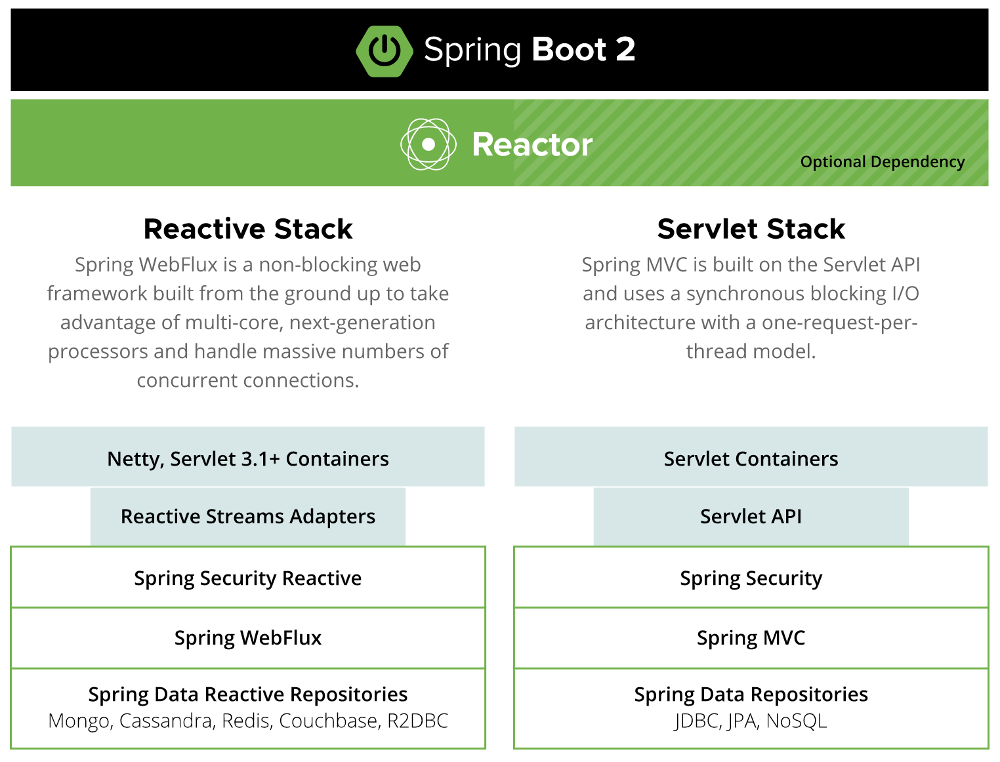
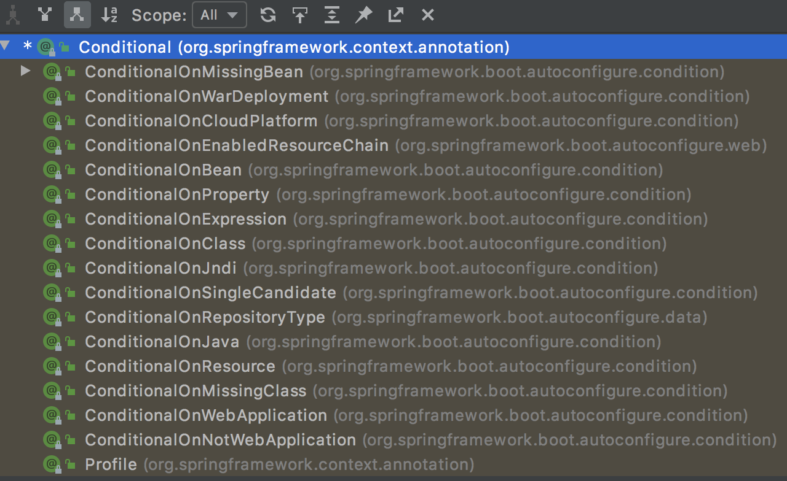
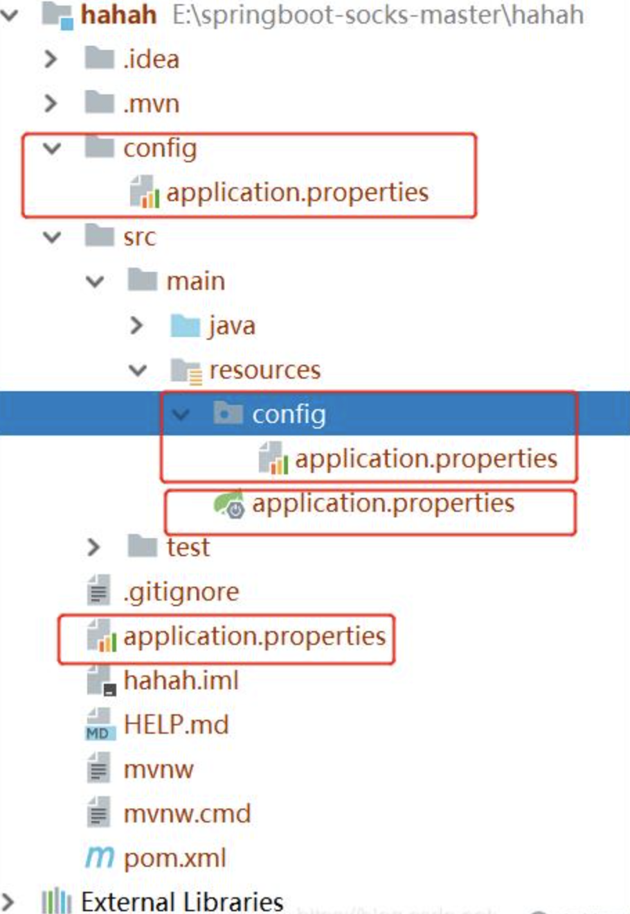

# 简介

## Spring与SpringBoot

### Spring的能力

参考 Spring 官网（[https://spring.io/](https://spring.io/)）：What Spring can do

* Microservices
* Reactive
* Cloud
* Web apps
* Serverless
* Event Driven
* Batch
### Spring的生态

参考 spring 官网：[https://spring.io/projects/spring-boot](https://spring.io/projects/spring-boot)

* web开发
* 数据访问
* 安全控制
* 分布式
* 消息服务
* 移动开发
* 批处理
* ....
### Spring5 重大升级

#### 响应式编程

参考：[https://spring.io/reactive](https://spring.io/reactive)




#### 支持Java8新特性

基于 Java8 的一些新特性，如：接口默认实现。重新设计源码架构等。

## SpringBoot优缺点

优点（Features）：

* Create stand-alone Spring applications
创建独立 Spring 应用

* Embed Tomcat, Jetty or Undertow directly (no need to deploy WAR files)
内嵌 web 服务器

* Provide opinionated 'starter' dependencies to simplify your build configuration
自动 starter 依赖，简化构建配置

* Automatically configure Spring and 3rd party libraries whenever possible
自动配置 Spring 以及第三方功能

* Provide production-ready features such as metrics, health checks, and externalized configuration
提供生产级别的监控、健康检查及外部化配置

* Absolutely no code generation and no requirement for XML configuration
无代码生成、无需编写XML

SpringBoot 是整合 Spring 技术的一站式框架。SpringBoot 是简化 Spring 技术栈的快速开发脚手架。

缺点：

* 迭代快，人称版本帝，需要时刻关注变化
* 封装太深，内部原理复杂，理解成本高
## 时代背景

### 微服务

[James Lewis and Martin Fowler (2014)](https://martinfowler.com/articles/microservices.html)  提出微服务完整概念 [https://martinfowler.com/microservices/](https://martinfowler.com/microservices/)。

* 微服务是一种架构风格
* 一个应用拆分为一组小型服务
* 每个服务运行在自己的进程内，即可独立部署和升级
* 服务之间使用轻量级HTTP交互
* 服务围绕业务功能拆分
* 可以由全自动部署机制独立部署
* 去中心化，服务自治。服务可以使用不同的语言、不同的存储技术
### 分布式

分布式的困难：

* 远程调用
* 服务发现
* 负载均衡
* 服务容错
* 配置管理
* 服务监控
* 链路追踪
* 日志管理
* 任务调度
* ...
分布式解决方案：SpringBoot + SpringCloud

### 云原生

原生应用如何上云：Cloud Native

上云的困难：

* 服务自愈
* 弹性伸缩
* 服务隔离
* 自动化部署
* 灰度发布
* 流量治理
* ......
## 官方文档

SpringBoot 官网：[https://spring.io/projects/spring-boot](https://spring.io/projects/spring-boot)

Document 路径： [learn](https://spring.io/projects/spring-boot#learn)（SpringBoot 主页面） -> [Documentation](https://docs.spring.io/spring-boot/docs/current/reference/html/) （各类文档，**重点**） -> [Documentation Overview](https://docs.spring.io/spring-boot/docs/current/reference/html/documentation.html#documentation)

SpringBoot 发布日志：[overview](https://spring.io/projects/spring-boot#overview) （SpringBoot 主页面）-> [release-notes](https://github.com/spring-projects/spring-boot/wiki#release-notes)（Github Wiki）

查看版本新特性：[https://github.com/spring-projects/spring-boot/wiki#release-notes](https://github.com/spring-projects/spring-boot/wiki#release-notes)


# SpringBoot2入门

## 系统要求

* Java8 & 兼容 Java14
* Maven 3.3+
* IDEA 2019.01.02+
### maven设置

* 配置阿里云镜像加速
* profiles
```xml
  <mirrors>
      <mirror>
        <id>nexus-aliyun</id>
        <mirrorOf>central</mirrorOf>
        <name>Nexus aliyun</name>
        <url>http://maven.aliyun.com/nexus/content/groups/public</url>
      </mirror>
  </mirrors>
 
  <profiles>
       <profile>
            <id>jdk-1.8</id>
            <activation>
              <activeByDefault>true</activeByDefault>
              <jdk>1.8</jdk>
            </activation>
            <properties>
              <maven.compiler.source>1.8</maven.compiler.source>
              <maven.compiler.target>1.8</maven.compiler.target>
              <maven.compiler.compilerVersion>1.8</maven.compiler.compilerVersion>
            </properties>
       </profile>
  </profiles>
```

## HelloWorld

参考官方文档：[getting-started](https://docs.spring.io/spring-boot/docs/current/reference/html/getting-started.html#getting-started)

### 创建maven工程

### 引入依赖

参考：[getting-started](https://docs.spring.io/spring-boot/docs/current/reference/html/getting-started.html#getting-started.first-application.pom)

```xml
<parent>
    <groupId>org.springframework.boot</groupId>
    <artifactId>spring-boot-starter-parent</artifactId>
    <version>2.3.0.RELEASE</version>
</parent>
<dependencies>
    <dependency>
        <groupId>org.springframework.boot</groupId>
        <artifactId>spring-boot-starter-web</artifactId>
    </dependency>
</dependencies>
```

### 创建主程序

```java
@SpringBootApplication
public class MainApplication {
    public static void main(String[] args) {
        SpringApplication.run(MainApplication.class, args);
    }
}
```

### 编写业务代码

```java
//@ResponseBody
//@Controller
// RestController = ResponseBody + Controller
@RestController
public class HelloController {
    // 可以直接配置在类上
    // @ResponseBody
    @RequestMapping("/hello")
    public String hello() {
        return "Hello World";
    }
}
```
RestController = ResponseBody + Controller
### 测试

直接运行 main 方法

### 简化配置

application.properties 配置可参考：

Document 路径： [learn](https://spring.io/projects/spring-boot#learn)（SpringBoot 主页面） -> [Documentation](https://docs.spring.io/spring-boot/docs/current/reference/html/) （各类文档，**重点**） -> 

[application-properties](https://docs.spring.io/spring-boot/docs/current/reference/html/application-properties.html#appendix.application-properties)

>注意：配置文件不生效需要注意项目 packaging 类型（默认是 jar 类型）。此外生效时 IDEA 会有 LSP 提示。

### 简化部署

```xml
</plugins>
  <plugin>
        <groupId>org.springframework.boot</groupId>
        <artifactId>spring-boot-maven-plugin</artifactId>
    </plugin>
</plugins>
```
把项目打成 jar 包，直接在目标服务器执行即可
```shell
java -jar xx.jar
```
注意：Windows 终端需要取消 cmd 快速编辑模式，否则点击终端会卡住。
# 自动配置原理

## 依赖管理

* 依赖管理
```xml
该项目的 parent
<parent>
    <groupId>org.springframework.boot</groupId>
    <artifactId>spring-boot-starter-parent</artifactId>
    <version>2.3.0.RELEASE</version>
</parent>

它的 parent
<parent>
  <groupId>org.springframework.boot</groupId>
  <artifactId>spring-boot-dependencies</artifactId>
  <version>2.3.0.RELEASE</version>
</parent>
spring-boot-dependencies pom 中声明了各种 properties，几乎包含开发中所有的jar
```
* starter 
starter 文档路径： [learn](https://spring.io/projects/spring-boot#learn)（SpringBoot 主页面） -> [Documentation](https://docs.spring.io/spring-boot/docs/current/reference/html/) （各类文档，**重点**） -> [using Spring Boot](https://docs.spring.io/spring-boot/docs/current/reference/html/using.html#using.build-systems.starters)

1. 官方 starter 命令规则：spring-boot-starter-*
2. 只要引入 starter，该场景常规需要的 jar 就自动引入
3. SpringBoot 所有支持的场景：[starters](https://docs.spring.io/spring-boot/docs/current/reference/html/using.html#using.build-systems.starters)
4. 第三方提供的简化开发的场景触发器：*-spring-boot-starter
* 修改版本号
在本 pom 中重写与 spring-boot-dependencies pom 相同的 properties，如：

```xml
<properties>
    <snakeyaml.version>1.30</snakeyaml.version>
</properties>
```

* 分析依赖树
IDEA 中 pom 文件中右键菜单：Diagrams

## 自动配置

* 自动配置 Tomcat
    * 引入 Tomcat 依赖
    * 配置 Tomcat
* 自动配置 SpringMVC
    * 引入 SpringMVC 依赖
    * 配置 SpringMVC 常用组件，如 dispatcherServlet
* 自动配置 Web 常见功能，如：字符编码问题
    * 配置如：characterEncodingFilter、*ViewResolver、multipartResolver
* 默认的包结构
    * 默认包扫描规则：主程序所在的包及其下面所有子包里面的组件都会被扫描出来。官网文档：[Using Spring Boot # locating-the-main-class](https://docs.spring.io/spring-boot/docs/current/reference/html/using.html#using.structuring-your-code.locating-the-main-class)
    * 指定扫描路径：
```java
@SpringBootApplication(scanBasePackages = "com.chnherb")
或
@ComponentScan(xxx)

其中 ComponentScan 与 SpringBootApplication 不能重复使用：
@SpringBootApplication 
等同于
@SpringBootConfiguration
@EnableAutoConfiguration
@ComponentScan(xxx)
```
* 配置各类默认值
    * 默认配置值最终都是映射到某个类上
    * 配置文件的值会绑定到每个类上，类会在容器中创建对象
* 按需加载所有自动配置项
    * 引入哪些场景的 starter 才会加载哪个场景的自动配置
    * 所有的自动配置功能都在 spring-boot-autoconfigure 包中
```xml
路径：spring-boot-starter-* -> spring-boot-starter -> spring-boot-autoconfigure
<dependency>
  <groupId>org.springframework.boot</groupId>
  <artifactId>spring-boot-autoconfigure</artifactId>
  <version>2.3.0.RELEASE</version>
  <scope>compile</scope>
</dependency>
```

# 组件与配置

## 组件添加

### Configuration注解

1. 配置类里面使用 @Bean 标注在方法上给容器注册组件，默认是单实例的

2. 配置类本身也是组件

3. proxyBeanMethods: 代理 bean 的方法

* Full(proxyBeanMethods = true, 默认)
配置类组件之间有依赖关系，方法会被调用得到之前单实例组件

* Lite(proxyBeanMethods = false)
配置类组件之间无依赖关系，加速容器启动过程，减少判断

### 其他主要注解

```java
@Component
@Controller
@Service
@Repository
```

### ComponentScan和Import注解

ComponentScan 包扫描使用主要注解如 @Component 等的文件自动注入。

Import 注解需要标注在 **组件类**（如 @Configuration 或 @Controller 等等）：

```java
@Import({User.class})
@Configuration
```
Import 导入的对象 id 默认是**全类名**。
### 条件装配

满足 Conditional 条件时则进行组件注入。可通过 ctrl + H 快捷键查看 Conditional 类的层次结构。




## xml配置文件引入

引入资源：

```java
@ImportResource(locations = "classpath:bean.xml")
public class HelloConfig {}
```
bean.xml 文件
>IDEA 中新建 xml 文件选择“XML Configuration File” -> “Spring Config” 即可创建带有 schema 的 xml 文件

```xml
<?xml version="1.0" encoding="UTF-8"?>
<beans xmlns="http://www.springframework.org/schema/beans"
       xmlns:xsi="http://www.w3.org/2001/XMLSchema-instance"
       xsi:schemaLocation="http://www.springframework.org/schema/beans http://www.springframework.org/schema/beans/spring-beans.xsd">
    <bean id="user01" class="com.chnherb.boot.bean.User">
        <property name="number" value="1001"></property>
        <property name="name" value="zhangsan"></property>
        <property name="age" value="20"></property>
    </bean>
</beans>
```

## 配置绑定

读取 properties 文件内容，并把它封装到 JavaBean 中。

原来的做法（代码读取文件逐步解析）：

```java
public class getProperties {
     public static void main(String[] args) throws FileNotFoundException, IOException {
         Properties pps = new Properties();
         pps.load(new FileInputStream("a.properties"));
         Enumeration enum1 = pps.propertyNames();//得到配置文件的名字
         while(enum1.hasMoreElements()) {
             String strKey = (String) enum1.nextElement();
             String strValue = pps.getProperty(strKey);
             System.out.println(strKey + "=" + strValue);
             //封装到JavaBean。
         }
     }
 }
```

SpringBoot 内置相关注解可自动解析配置文件。

>前提：只有容器中的组件，才能拥有 SpringBoot 提供的这些功能，所以需要配合其他注解使用，如 Component 注解等。

使用方式有如下几种：

1. Component等注解 + ConfigurationProperties 注解
2. EnableConfigurationProperties + ConfigurationProperties 注解
### ConfigurationProperties

>Component等注解 + ConfigurationProperties 注解

配置 application.propertites：

```xml
mycar.brand=BYD
mycar.price=200000
```

Bean 中引入：

```java
@Component
@ConfigurationProperties(prefix = "mycar")
public class Car {
    private String brand;
    private String price;
    ...
}
```

### EnableConfigurationProperties

>EnableConfigurationProperties + ConfigurationProperties 注解

场景：第三方包中的 Bean **没有 Component 等相关注解**时，需要绑定 properties。

在组件中使用 EnableConfigurationProperties 注解：

1. 开启配置绑定功能
2. 将组件自动注入到容器中
使用方式：

```java
@EnableConfigurationProperties(Car.class)
/**
 * 1.开启 Car 配置绑定功能
 * 2.将 Car 组件自动注入到容器中
 */
 
 @Configuration
 public class xxConfig {}
```
Bean 文件：
```java
//@Component
@ConfigurationProperties(prefix = "mycar")
public class Car {
    private String brand;
    private String price;
    ...
}
```

### 注解加载配置值

@Value("${"xxx"}")

@ConfigurationProperties(prefix = "test")

yaml配置文件

```yaml
test.name = wahaha
test.age = 27
test.tel = 18800118888
```

```java
@Component
public class Configuration {
  @Value("${test.age}")
  private int age
}

@Component
@ConfigurationProperties(prefix = "test")
public class Configuration {
    private String name;
    private String age;
    private Long tel;
    // setter getter
}
```

# 自动配置原理

## 引导加载自动配置类

首先看 SpringBootApplication 注解实现代码：

```java
@SpringBootConfiguration
@EnableAutoConfiguration
@ComponentScan(excludeFilters = { @Filter(type = FilterType.CUSTOM, classes = TypeExcludeFilter.class),
      @Filter(type = FilterType.CUSTOM, classes = AutoConfigurationExcludeFilter.class) })
public @interface SpringBootApplication {}
```
核心是上面三个注解组成。
### SpringBootConfiguration

看该注解实现代码：

```java
@Target(ElementType.TYPE)
@Retention(RetentionPolicy.RUNTIME)
@Documented
@Configuration
public @interface SpringBootConfiguration {}
```
可以看出该注解核心就是一个 Configuration 注解，代表当前是一个配置类。
### ComponentScan

指定扫描哪些包。这里不深入解释。

### EnableAutoConfiguration

看该注解实现代码：

```java
@Target(ElementType.TYPE)
@Retention(RetentionPolicy.RUNTIME)
@Documented
@Inherited
@AutoConfigurationPackage
@Import(AutoConfigurationImportSelector.class)
public @interface EnableAutoConfiguration {}
```

#### AutoConfigurationPackage

自动配置包。（自动导入用户定义的组件）

```java
@Target(ElementType.TYPE)
@Retention(RetentionPolicy.RUNTIME)
@Documented
@Inherited
@Import(AutoConfigurationPackages.Registrar.class)
public @interface AutoConfigurationPackage {}
```
该注解的核心是导入 AutoConfigurationPackages.Registrar 类，而该类是利用 Register 给容器中导入一系列组件。
这里可以通过设置断点调试源码：

```java
// org.springframework.boot.autoconfigure.AutoConfigurationPackages.Registrar#registerBeanDefinitions
   @Override
   public void registerBeanDefinitions(AnnotationMetadata metadata, BeanDefinitionRegistry registry) {
      register(registry, new PackageImports(metadata).getPackageNames().toArray(new String[0]));
   }
```
metadata表示注解的原信息，这里就是指 SpringBoot 启动的 Main 类，具体是 MainApplication。
所以通过源码调试可以得出：Registrar 就是将制定的一个包下的所有组件导入（Main 所在的包）。

#### AutoConfigurationImportSelector

自动配置加载器。（自动导入各种自动配置器）

```java
//org.springframework.boot.autoconfigure.AutoConfigurationImportSelector#selectImports
@Override
public String[] selectImports(AnnotationMetadata annotationMetadata) {
   if (!isEnabled(annotationMetadata)) {
      return NO_IMPORTS;
   }
   AutoConfigurationEntry autoConfigurationEntry = getAutoConfigurationEntry(annotationMetadata);
   return StringUtils.toStringArray(autoConfigurationEntry.getConfigurations());
}
```
该类利用 getAutoConfigurationEntry 方法给容器批量导入一些组件。
```java
// org.springframework.boot.autoconfigure.AutoConfigurationImportSelector#getAutoConfigurationEntry
protected AutoConfigurationEntry getAutoConfigurationEntry(AnnotationMetadata annotationMetadata) {
   if (!isEnabled(annotationMetadata)) {
      return EMPTY_ENTRY;
   }
   AnnotationAttributes attributes = getAttributes(annotationMetadata);
   List<String> configurations = getCandidateConfigurations(annotationMetadata, attributes);
   configurations = removeDuplicates(configurations);
   Set<String> exclusions = getExclusions(annotationMetadata, attributes);
   checkExcludedClasses(configurations, exclusions);
   configurations.removeAll(exclusions);
   configurations = getConfigurationClassFilter().filter(configurations);
   fireAutoConfigurationImportEvents(configurations, exclusions);
   return new AutoConfigurationEntry(configurations, exclusions);
}
```
调用 getCandidateConfigurations 方法获取到所有需要导入到容器中的配置类。
```java
protected List<String> getCandidateConfigurations(AnnotationMetadata metadata, AnnotationAttributes attributes) {
   List<String> configurations = SpringFactoriesLoader.loadFactoryNames(getSpringFactoriesLoaderFactoryClass(),
         getBeanClassLoader());
   Assert.notEmpty(configurations, "No auto configuration classes found in META-INF/spring.factories. If you "
         + "are using a custom packaging, make sure that file is correct.");
   return configurations;
}
```
利用Spring工厂加载器加载得到所有的组件。
```java
public static List<String> loadFactoryNames(Class<?> factoryType, @Nullable ClassLoader classLoader) {
   String factoryTypeName = factoryType.getName();
   return loadSpringFactories(classLoader).getOrDefault(factoryTypeName, Collections.emptyList());
}

private static Map<String, List<String>> loadSpringFactories(@Nullable ClassLoader classLoader) {
   MultiValueMap<String, String> result = cache.get(classLoader);
   if (result != null) {
      return result;
   }
   try {
      Enumeration<URL> urls = (classLoader != null ?
            // FACTORIES_RESOURCE_LOCATION = "META-INF/spring.factories"
            classLoader.getResources(FACTORIES_RESOURCE_LOCATION) :
            ClassLoader.getSystemResources(FACTORIES_RESOURCE_LOCATION));
      result = new LinkedMultiValueMap<>();
      while (urls.hasMoreElements()) {
         URL url = urls.nextElement();
         UrlResource resource = new UrlResource(url);
         Properties properties = PropertiesLoaderUtils.loadProperties(resource);
         for (Map.Entry<?, ?> entry : properties.entrySet()) {
            String factoryTypeName = ((String) entry.getKey()).trim();
            for (String factoryImplementationName : StringUtils.commaDelimitedListToStringArray((String) entry.getValue())) {
               result.add(factoryTypeName, factoryImplementationName.trim());
            }
         }
      }
      cache.put(classLoader, result);
      return result;
   }
   catch (IOException ex) {
      throw new IllegalArgumentException("Unable to load factories from location [" +
            FACTORIES_RESOURCE_LOCATION + "]", ex);
   }
}
```
从 META-INF/spring.factories 位置加载一个文件，默认扫描所有依赖包中该位置的文件。核心包：spring-boot-autoconfigure-2.3.0.RELEASE.jar，该包中包括所有自动配置的类（Auto Configure 类127个）。即该文件写死了 SpringBoot 启动需要给容器中加载的所有配置类。
## 按需开启自动配置项

虽然上面讲的 127 个场景的所有自动配置（**xxxAutoConfiguration**）启动时默认全部加载，但是按照条件装配规则（Conditional 注解），最终会按需配置。

比如 AopAutoConfiguration 类，仅当导入 aspectj 下面的 Advice 类才会配置。

## 修改默认配置

举例（文件上传解析器）：

```java
// org.springframework.boot.autoconfigure.web.servlet.DispatcherServletAutoConfiguration.DispatcherServletConfiguration#multipartResolver
@Bean
@ConditionalOnBean(MultipartResolver.class) // 容器中有这个类型的组件
@ConditionalOnMissingBean(name = DispatcherServlet.MULTIPART_RESOLVER_BEAN_NAME) 
// 容器中没有 multipartResolver 这个名字的组件
public MultipartResolver multipartResolver(MultipartResolver resolver) {
   // Detect if the user has created a MultipartResolver but named it incorrectly
   // 检测用户配置的文件上传解析器但名字不规范的情况。从容器中找该类型组件，并返回(改名)
   return resolver;
}
```

SpringBoot 默认会在底层代码中配置好所有的组件，如果用户配置过了以用户的优先，不会加载默认配置的（ConditionalOnMissingBean）。

总结：

* SpringBoot 先加载所有的自动配置类（xxxAutoConfiguration）
* 每个自动配置类按照条件进行生效，默认绑定配置文件的值（xxxProperties绑定配置文件）
* 生效的配置会给容器中装配很多组件
* 容器中存在这些组件即代表相应功能存在
* 定制化配置
    * 优先使用用户创建的 Bean
    * 修改组件配置文件的值
流程：

xxxAutoConfiguration -> 组件 -> xxxProperties -> application.properties

## 最佳实践

* 引入场景依赖，参考 [Using Spring Boot # starters](https://docs.spring.io/spring-boot/docs/current/reference/html/using.html#using.build-systems.starters)
* 查看自动配置项
    * 一般引入的场景都自动配置了
    * application.properties 中配置 debug=true开启自动配置报告。Negative（不生效）、Positive（生效）
* 自定义修改
    * 参考文档修改配置项
        * [Application Properties](https://docs.spring.io/spring-boot/docs/current/reference/html/application-properties.html#common-application-properties)
        * 参考源码：xxxProperties
    * 自定义配置 Bean，使用 Bean/Component 等注解
    * 自定义器：xxxCustomizer
    * ...
# 配置文件

## 配置文件及提示

### properties配置文件

同之前的 properties 配置文件用法

### yaml配置文件

语法不太一样

### 配置提示

文件路径： [learn](https://spring.io/projects/spring-boot#learn)（SpringBoot 主页面） -> [Documentation](https://docs.spring.io/spring-boot/docs/current/reference/html/) （各类文档，**重点**） -> 

[Configuration Metadata # Configuring the Annotation Processor](https://docs.spring.io/spring-boot/docs/current/reference/html/configuration-metadata.html#appendix.configuration-metadata.annotation-processor.configuring)

增加配置文件的提示功能：

1、导入依赖

```xml
<dependency>
    <groupId>org.springframework.boot</groupId>
    <artifactId>spring-boot-configuration-processor</artifactId>
    <optional>true</optional>
</dependency>
```
2、重新启动程序或 maven 重新导包
3、打包时过滤该包

```xml
<plugin>
    <groupId>org.springframework.boot</groupId>
    <artifactId>spring-boot-maven-plugin</artifactId>
    <configuration>
        <excludes>
            <exclude>
                <groupId>org.springframework.boot</groupId>
                <artifactId>spring-boot-configuration-processor</artifactId>
            </exclude>
        </excludes>
    </configuration>
</plugin>
```

## 配置文件路径及优先级

### 四个配置路径

* 当前项目根目录下的 config 目录下
* 当前项目的根目录下
* resources 目录下的 config 目录下
* resources 目录下
**优先级从高到底**




### 自定义配置路径

另外我们也可以在启动项目的时候，指定配置文件的位置，这个的操作主要针对于已经打包好的项目，无法修改配置文件了

```plain
java -jar demo.jar --spring.config.location=classpath:/myconfig/
```

### 自定义配置文件名称

```shell
java -jar demo.jar --spring.config.name=myconfig
```
多条命令
```shell
java -jar demo.jar --spring,config.name=myconfig;spring.config.location=classpath:/myconfig/
```
>参考：[https://m.yisu.com/zixun/14159.html](https://m.yisu.com/zixun/14159.html)

## 多模块使用对应配置文件

配置文件：

```yaml
spring.profiles: common-boei18n  # 指定环境
```
激活环境：
```shell
# 1.命令行添加参数
-Dspring.profiles.active=${PROFILE}
# 2.application.properties配置激活
spring.profiles.active=corePro,webPro
```
其他 module 的 yml 需要读取公共 module 的 yml，那么需要在其他 module 的 yml 配置:
```yaml
spring:
  profiles:
    include: utils
```
>参考：
>[https://blog.csdn.net/cw_hello1/article/details/79639448](https://blog.csdn.net/cw_hello1/article/details/79639448)
>[https://blog.csdn.net/xue_mind/article/details/106494732](https://blog.csdn.net/xue_mind/article/details/106494732)

## yml依赖

使用外部yml文件的两种方法。

>参考：[https://blog.csdn.net/Lonely_Devil/article/details/81875890](https://blog.csdn.net/Lonely_Devil/article/details/81875890)

## application.yml与bootstrap.yml的区别

>参考：[https://www.jianshu.com/p/c955c44ae534](https://www.jianshu.com/p/c955c44ae534)

# 开发小技巧

## Lombok

简化开发：

* 简化 JavaBean 开发
* 简化 log 开发（Slf4j 注解）
引入 pom 依赖：

```plain
        <dependency>
            <groupId>org.projectlombok</groupId>
            <artifactId>lombok</artifactId>
        </dependency>
```
IDEA 中搜索安装 lombok 插件即可。
## dev-tools

热更新开发工具。

引入 pom 依赖：

```plain
        <dependency>
            <groupId>org.springframework.boot</groupId>
            <artifactId>spring-boot-devtools</artifactId>
            <optional>true</optional>
        </dependency>
```
项目或者页面修改以后：Ctrl+F9；
# Reference

[spring-boot-demo](https://github.com/chnherb/spring-boot-demo)

[https://github.com/javastacks/spring-boot-best-practice](https://github.com/javastacks/spring-boot-best-practice)

加载配置文件源码：

[https://blog.csdn.net/chengkui1990/article/details/79866499](https://blog.csdn.net/chengkui1990/article/details/79866499)

[https://juejin.cn/post/6844903985913004045](https://juejin.cn/post/6844903985913004045)

[Spring自动注入原理初解与实现](https://blog.csdn.net/q610376681/article/details/88578155)

[自己动手写一个 starter](https://mp.weixin.qq.com/s/R6Ps4hgmNniC_Zw8v1F6FA)


