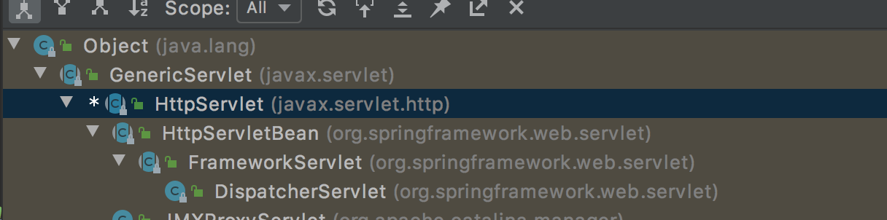
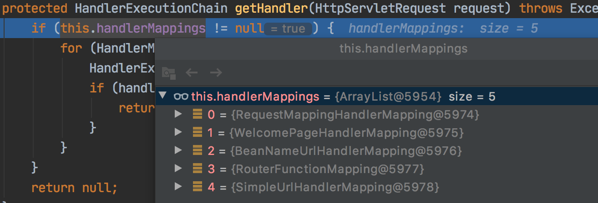
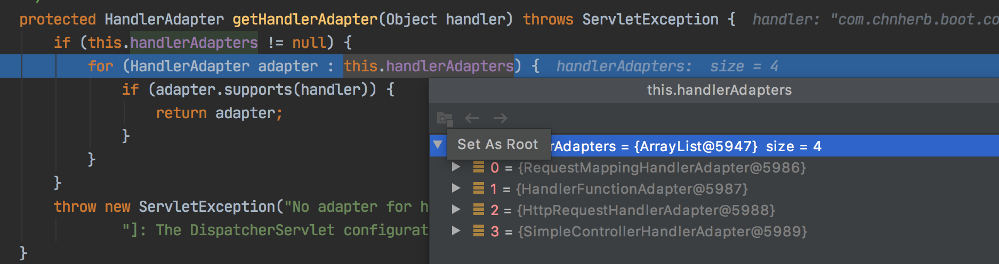
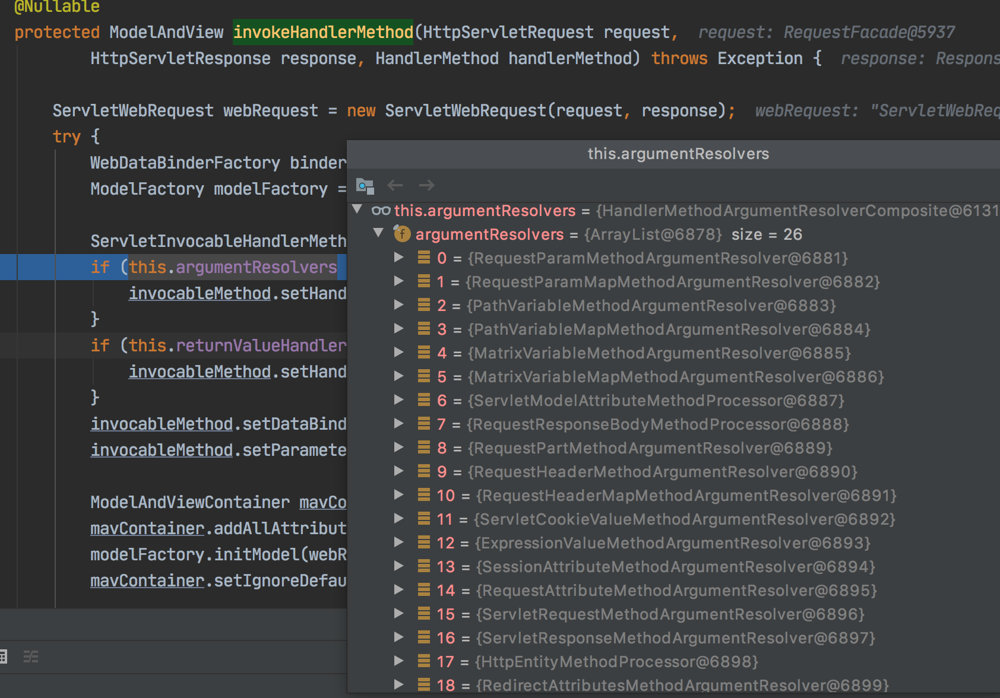
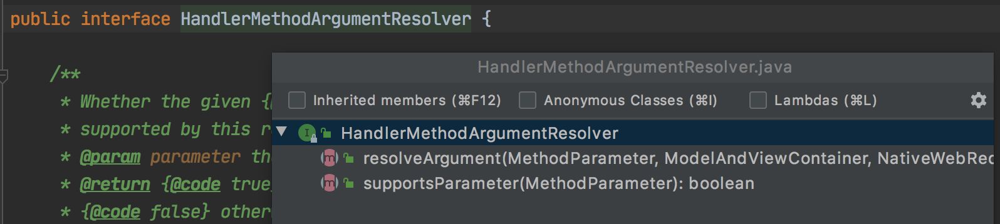
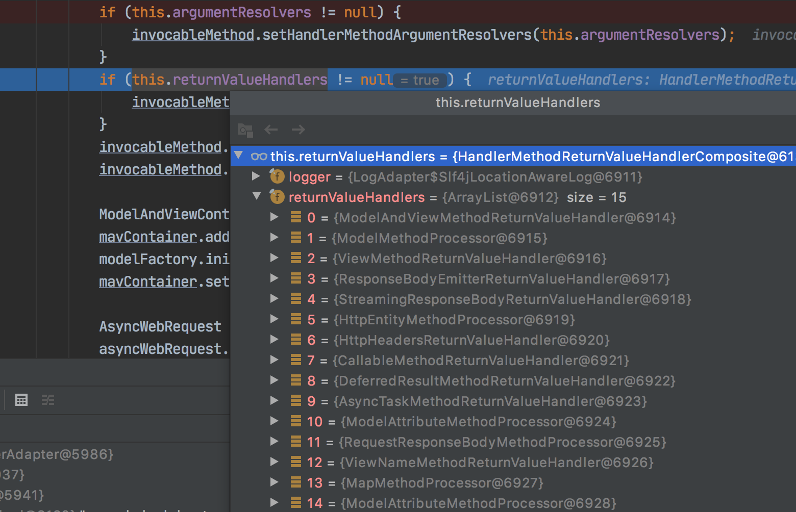

# 简介

Spring Boot is well suited for web application development. You can create a self-contained HTTP server by using embedded Tomcat, Jetty, Undertow, or Netty. Most web applications use the `spring-boot-starter-web` module to get up and running quickly. You can also choose to build reactive web applications by using the `spring-boot-starter-webflux` module. 

文档路径：文档路径： [learn](https://spring.io/projects/spring-boot#learn)（SpringBoot 主页面） -> [Documentation](https://docs.spring.io/spring-boot/docs/current/reference/html/) （各类文档，**重点**） -> [Web](https://docs.spring.io/spring-boot/docs/current/reference/html/web.html#web.servlet.spring-mvc)

# SpringMVC自动配置简介

SpringBoot 为 SpringMVC 提供了大多数场景的自动配置，这些自动配置添加了如下 Spring 的默认特性：

* 包括 `ContentNegotiatingViewResolver` (内容协商视图解析器)和 `BeanNameViewResolver` (BeanName视图解析器) 等 bean
* 支持静态资源包括 WebJars (covered [later in this document](https://docs.spring.io/spring-boot/docs/current/reference/html/features.html#web.servlet.spring-mvc.static-content))
* 自动注册`Converter`、`GenericConverter`和`Formatter` 等 bean
* 支持 `HttpMessageConverters` (covered [later in this document](https://docs.spring.io/spring-boot/docs/current/reference/html/features.html#web.servlet.spring-mvc.message-converters))
* 自动注册`MessageCodesResolver` (国际化使用)(covered [later in this document](https://docs.spring.io/spring-boot/docs/current/reference/html/features.html#web.servlet.spring-mvc.message-codes))
* 静态 `index.html` 支持
* 自定义 Favicon
* 自动使用 `ConfigurableWebBindingInitializer` bean (DataBind 负责将请求数据绑定到 JavaBean ) (covered [later in this document](https://docs.spring.io/spring-boot/docs/current/reference/html/features.html#web.servlet.spring-mvc.binding-initializer))
自定义 [MVC customizations](https://docs.spring.io/spring-framework/docs/5.3.23/reference/html/web.html#mvc) (interceptors, formatters, view controllers, and other features)，可以通过添加 `WebMvcConfigurer` 类型的 `@Configuration` 而不是`@EnableWebMvc`  

如果提供自定义的

`RequestMappingHandlerMapping`, `RequestMappingHandlerAdapter`, 或 `ExceptionHandlerExceptionResolver`, 并定制化Spring Boot MVC，可以声明 `WebMvcRegistrations` 类型的 bean 并使用其提供这些自定义组件的实例。

完全接管 SpringMVC，可以添加`@Configuration` 和 `@EnableWebMvc`注解或另外添加 `@Configuration` 和`DelegatingWebMvcConfiguration` 。

# 基础功能介绍

## 静态资源访问

文档：[spring-mvc # static-content](https://docs.spring.io/spring-boot/docs/current/reference/html/web.html#web.servlet.spring-mvc.static-content)

### 静态资源目录

只要静态资源放在类路径的 resources 下：`/static` 或`/public` 或 `/resources` 或 `/META-INF/resources`中即可。

访问方式：当前项目 + 根路径/ + 静态资源名称（无需增加目录名）

原理：静态资源映射 /**，请求到达先查找 controller ，不能匹配然后交给静态资源处理器，没找到就 404。

### 静态资源前缀

一般配置静态资源带有前缀，为了方便做权限控制。

```yaml
spring:
  mvc:
    static-path-pattern: /res/**  # 默认 /**
```
访问方式：当前项目 + static-path-pattern + 静态资源名称
### 静态资源路径

```yaml
spring:
  resources:
    static-locations: [classpath:/abc] # 表示 resources 下的 abc 文件夹
```

### webjars

自动映射 /[webjars](http://localhost:8080/webjars/jquery/3.5.1/jquery.js)/**

[https://www.webjars.org/](https://www.webjars.org/)

引入依赖：

```xml
<dependency>
    <groupId>org.webjars</groupId>
    <artifactId>jquery</artifactId>
    <version>3.5.1</version>
</dependency>
```
访问方式：当前项目 + /webjars/jquery/3.5.1/jquery.js （即依赖包的内容路径，可直接查看）
## 欢迎页

* 静态资源路径下
    * 可以配置静态资源路径
    * 不能配置静态资源前缀
## 自定义Favicon

favicon.ico 放在静态资源目录下即可。

配置静态资源前缀会影响该功能。

## 静态资源配置原理

上文讲过 SpringBoot 启动时会默认加载 xxxAutoConfiguration类（自动配置类），如 spring-boot-autoconfigure jar 包中的自动配置类，这里 web 启动会加载其中的 web 包中的相关配置类，如加载 WebMvcAutoConfiguration 

具体配置项：

```java
// org.springframework.boot.autoconfigure.web.servlet.WebMvcAutoConfiguration.WebMvcAutoConfigurationAdapter
@Configuration(proxyBeanMethods = false)
@Import(EnableWebMvcConfiguration.class)
@EnableConfigurationProperties({ WebMvcProperties.class, ResourceProperties.class })
@Order(0)
public static class WebMvcAutoConfigurationAdapter implements WebMvcConfigurer {}
```
注意 EnableConfigurationProperties 注解，配置文件的相关属性 WebMvcProperties（spring.mvc）、ResourceProperties（spring.resources）。
配置类只有一个有参构造器

>注意这里 jar 版本 2.3.0-RELEASE 没有最后两个参数，升级到 2.3.7-RELEASE 即可。

```java
// 有参构造器的所有参数值都会从容器中获取
// ResourceProperties resourceProperties 获取和 spring.resources 绑定的所有值的对象
// WebMvcProperties mvcProperties 获取和 spring.mvc 绑定的所有值的对象
// ListableBeanFactory beanFactory spring 的 beanFactory
// messageConvertersProvider 找到所有的 HttpMessageConverters
// resourceHandlerRegistrationCustomizerProvider 找到资源处理器的自定义器
// dispatcherServletPath dispatcherServlet 处理路径
// servletRegistrations 给应用注册 Servlet、Fileter、Listener 等
public WebMvcAutoConfigurationAdapter(ResourceProperties resourceProperties, WebMvcProperties mvcProperties,
      ListableBeanFactory beanFactory, ObjectProvider<HttpMessageConverters> messageConvertersProvider,
      ObjectProvider<ResourceHandlerRegistrationCustomizer> resourceHandlerRegistrationCustomizerProvider,
      ObjectProvider<DispatcherServletPath> dispatcherServletPath,
      ObjectProvider<ServletRegistrationBean<?>> servletRegistrations) {
   this.resourceProperties = resourceProperties;
   this.mvcProperties = mvcProperties;
   this.beanFactory = beanFactory;
   this.messageConvertersProvider = messageConvertersProvider;
   this.resourceHandlerRegistrationCustomizer = resourceHandlerRegistrationCustomizerProvider.getIfAvailable();
   this.dispatcherServletPath = dispatcherServletPath;
   this.servletRegistrations = servletRegistrations;
}
```

### 资源处理默认规则

```java
@Override
public void addResourceHandlers(ResourceHandlerRegistry registry) {
   // 是否禁用 properties 映射
   if (!this.resourceProperties.isAddMappings()) {
      logger.debug("Default resource handling disabled");
      return;
   }
   // 缓存时间
   Duration cachePeriod = this.resourceProperties.getCache().getPeriod();
   CacheControl cacheControl = this.resourceProperties.getCache().getCachecontrol().toHttpCacheControl();
   // webjars 规则
   if (!registry.hasMappingForPattern("/webjars/**")) {
      customizeResourceHandlerRegistration(registry.addResourceHandler("/webjars/**")
            .addResourceLocations("classpath:/META-INF/resources/webjars/")
            // 如果设置了缓存时间，可以观察浏览器请求为 304，并带有过期时间
            .setCachePeriod(getSeconds(cachePeriod)).setCacheControl(cacheControl));
   }
   // 静态资源路径规则
   String staticPathPattern = this.mvcProperties.getStaticPathPattern();
   if (!registry.hasMappingForPattern(staticPathPattern)) {
      customizeResourceHandlerRegistration(registry.addResourceHandler(staticPathPattern)
            .addResourceLocations(getResourceLocations(this.resourceProperties.getStaticLocations()))
            .setCachePeriod(getSeconds(cachePeriod)).setCacheControl(cacheControl));
   }
}
```

### 欢迎页处理规则

HandlerMapping：处理器映射，保存了每一个 Handler 能处理的请求。

```java
@Bean
public WelcomePageHandlerMapping welcomePageHandlerMapping(ApplicationContext applicationContext,
      FormattingConversionService mvcConversionService, ResourceUrlProvider mvcResourceUrlProvider) {
   WelcomePageHandlerMapping welcomePageHandlerMapping = new WelcomePageHandlerMapping(
         new TemplateAvailabilityProviders(applicationContext), applicationContext, getWelcomePage(),
         this.mvcProperties.getStaticPathPattern());
   welcomePageHandlerMapping.setInterceptors(getInterceptors(mvcConversionService, mvcResourceUrlProvider));
   welcomePageHandlerMapping.setCorsConfigurations(getCorsConfigurations());
   return welcomePageHandlerMapping;
}
WelcomePageHandlerMapping(TemplateAvailabilityProviders templateAvailabilityProviders,
      ApplicationContext applicationContext, Optional<Resource> welcomePage, String staticPathPattern) {
   // 必须使用 /** 才能使用欢迎页
   if (welcomePage.isPresent() && "/**".equals(staticPathPattern)) {
      logger.info("Adding welcome page: " + welcomePage.get());
      setRootViewName("forward:index.html");
   }
   // 调用 Controller 处理 /index
   else if (welcomeTemplateExists(templateAvailabilityProviders, applicationContext)) {
      logger.info("Adding welcome page template: index");
      setRootViewName("index");
   }
}
```

# 请求参数处理

## 请求映射

@xxxMapping 如 RequestMapping 注解

Rest 风格支持（使用 HTTP 请求方式来表示对资源的操作）。

核心 Filter：HiddenHttpMethodFilter。

用法：表单 method=post，隐藏域 _method=put

### Rest使用

Rest 接口：

```java
// 测试 REST
// @RequestMapping(value = "/user", method = RequestMethod.GET)
@GetMapping("/user")
public String getUser() {
    return "GET-USER";
}
// @RequestMapping(value = "/user", method = RequestMethod.POST)
@PostMapping("/user")
public String saveUser() {
    return "POST-USER";
}
// @RequestMapping(value = "/user", method = RequestMethod.PUT)
@PutMapping("/user")
public String updateUser() {
    return "PUT-USER";
}
// @RequestMapping(value = "/user", method = RequestMethod.DELETE)
@DeleteMapping("/user")
public String delUser() {
    return "DELETE-USER";
}
```
HTML 访问页面：
```xml
测试 REST：
<form action="/user" method="get">
    <input value="REST-GET SUBMIT" type="submit"/>
</form>
<form action="/user" method="post">
    <input value="REST-POST SUBMIT" type="submit"/>
</form>
无效：
<form action="/user" method="put">
    <input value="REST-PUT SUBMIT" type="submit"/>
</form>
<form action="/user" method="delete">
    <input value="REST-DELETE SUBMIT" type="submit"/>
</form>
有效：
<form action="/user" method="post">
    <input name="_method", type="hidden" value="PUT">
    <input value="REST-PUT SUBMIT" type="submit"/>
</form>
<form action="/user" method="post">
    <input name="_method", type="hidden" value="DELETE">
    <input value="REST-DELETE SUBMIT" type="submit"/>
</form>
```

手动开启：

```yaml
spring:
  mvc:
    hiddenmethod:
      filter:
        enabled: true
```

### Rest原理

背景知识：

HTML4 / XHTML1 仅允许以表格形式进行 GET 和 POST 请求。`<form method="put">`是无效的HTML，将被视为`<form>` ，即发送一个GET请求。

 

为了解决这个问题，SpringBoot 做了一些适配功能，步骤如下：

* 表单提交会带上 _method=PUT
* 接受请求被 HiddenHttpMethodFilter 拦截
    * 请求是否正常且是 POST 方式
        * 获取到 _method 的值
        * 允许的请求方式：PUT/DELETE/PATCH
        * 原生 request（post），包装模式 requestWarpper 重写 getMethod 方式
        * 过滤器链放行使用的是 warpper 对象
注意：**如果是使用 Rest 客户端工具，直接发送 Put、delete 等请求，无需配置 filter。**

```java
@Bean
@ConditionalOnMissingBean(HiddenHttpMethodFilter.class)
@ConditionalOnProperty(prefix = "spring.mvc.hiddenmethod.filter", name = "enabled", matchIfMissing = false)
public OrderedHiddenHttpMethodFilter hiddenHttpMethodFilter() {
   return new OrderedHiddenHttpMethodFilter();
}
```
该类继承了 HiddenHttpMethodFilter 类
```java
public class OrderedHiddenHttpMethodFilter extends HiddenHttpMethodFilter implements OrderedFilter {}
```
核心逻辑：HiddenHttpMethodFilter 的 doFilterInternal 方法
```java
// org.springframework.web.filter.HiddenHttpMethodFilter#doFilterInternal
@Override
protected void doFilterInternal(HttpServletRequest request, HttpServletResponse response, FilterChain filterChain)
      throws ServletException, IOException {
   HttpServletRequest requestToUse = request;
   if ("POST".equals(request.getMethod()) && request.getAttribute(WebUtils.ERROR_EXCEPTION_ATTRIBUTE) == null) {
      String paramValue = request.getParameter(this.methodParam);
      if (StringUtils.hasLength(paramValue)) {
         String method = paramValue.toUpperCase(Locale.ENGLISH);
         if (ALLOWED_METHODS.contains(method)) {
            requestToUse = new HttpMethodRequestWrapper(request, method);
         }
      }
   }
   filterChain.doFilter(requestToUse, response);
}
```
request 请求被包装成 HttpMethodRequestWrapper（继承了 HttpServletRequest），替换了新的 method。
```java
private static class HttpMethodRequestWrapper extends HttpServletRequestWrapper {
   private final String method;
   public HttpMethodRequestWrapper(HttpServletRequest request, String method) {
      super(request);
      this.method = method;
   }
```

自定义 rest methodParam

```java
    // 自定义修改 rest methodParam
    @Bean
    public HiddenHttpMethodFilter hiddenHttpMethodFilter() {
        HiddenHttpMethodFilter methodFilter = new HiddenHttpMethodFilter();
        methodFilter.setMethodParam("_method");
//        methodFilter.setMethodParam("_m");
        return methodFilter;
    }
```

## 请求映射原理

类的继承关系（快捷键：ctrl + H）

DispatcherServlet：

```java
public class DispatcherServlet extends FrameworkServlet {}
public abstract class FrameworkServlet extends HttpServletBean implements ApplicationContextAware {}
public abstract class HttpServletBean extends HttpServlet implements EnvironmentCapable, EnvironmentAware {}
```



方法的调用关系：

```java
HttpServlet.doGet
  HttpServletBean
    FrameworkServlet.processRequest -> doService
      DispatchServlet.doService -> doDispatch
```
核心方法：doDispatch（可断点查看）
```java
// org.springframework.web.servlet.DispatcherServlet#doDispatch
protected void doDispatch(HttpServletRequest request, HttpServletResponse response) throws Exception {
   HttpServletRequest processedRequest = request;
   HandlerExecutionChain mappedHandler = null;
   boolean multipartRequestParsed = false;
   WebAsyncManager asyncManager = WebAsyncUtils.getAsyncManager(request);
   try {
      ModelAndView mv = null;
      Exception dispatchException = null;
      try {
         // 检查文件上传请求
         processedRequest = checkMultipart(request);
         multipartRequestParsed = (processedRequest != request);
         // Determine handler for the current request.
         // 找到当前请求处理的 handler
         mappedHandler = getHandler(processedRequest);
         if (mappedHandler == null) {
            noHandlerFound(processedRequest, response);
            return;
         }
         // Determine handler adapter for the current request.
         // handler 适配器
         HandlerAdapter ha = getHandlerAdapter(mappedHandler.getHandler());
         // Process last-modified header, if supported by the handler.
         String method = request.getMethod();
         boolean isGet = "GET".equals(method);
         if (isGet || "HEAD".equals(method)) {
            long lastModified = ha.getLastModified(request, mappedHandler.getHandler());
            if (new ServletWebRequest(request, response).checkNotModified(lastModified) && isGet) {
               return;
            }
         }
         if (!mappedHandler.applyPreHandle(processedRequest, response)) {
            return;
         }
         // Actually invoke the handler.
         mv = ha.handle(processedRequest, response, mappedHandler.getHandler());
         if (asyncManager.isConcurrentHandlingStarted()) {
            return;
         }
         applyDefaultViewName(processedRequest, mv);
         mappedHandler.applyPostHandle(processedRequest, response, mv);
      }
      ...
}
```
其中 HandleMapping 包含 5 个 



RequestMappingHandlerMapping：保存了所有 @RequestMapping 和 handler 的映射规则。其 mappingRegistry.registry 保存了 RequestMapping 所有的路径匹配信息。

小结：

所有请求映射都在HandlerMapping 中：

* SpingBoot 自动配置了欢迎页的 HandlerMapping，访问 / 能访问到 index.html
* 处理请求时会遍历所有的 HanlderMapping 匹配请求信息
    * 匹配上则返回该 HanlderMapping 的 handler
    * 没有匹配上则继续遍历下一个 HandlerMapping
* 自定义映射处理时，往容器中注入 HandlerMapping 即可，即自定义 HanlderMapping
## 常用参数注解

### 注解

@PathVariable、@RequestHeader、@ModelAttribute、@RequestParam、@MatrixVariable、@CookieValue、@RequestBody

测试 demo：

```java
package com.chnherb.boot.controller;
import org.springframework.boot.autoconfigure.web.servlet.WebMvcAutoConfiguration;
import org.springframework.web.bind.annotation.*;
import javax.servlet.http.Cookie;
import java.util.HashMap;
import java.util.List;
import java.util.Map;
@RestController
public class ParameterController {
    // 请求：/user/1001/name/zhangsan?age=20&number=1234&interest=ball&interest=game
    @GetMapping("/user/{id}/name/{username}")
    public Map<String, Object> getUser(@PathVariable("id") Integer id,
                                       @PathVariable("username") String name,
                                       @PathVariable Map<String, String> pv, // PathVariable 注解注释中说明会将所有参数放入 Map 中
                                       @RequestHeader("User-Agent") String userAgent,
                                       @RequestHeader Map<String, String> header,
                                       @RequestParam("age") Integer age,
                                       @RequestParam("interest") List<String> interests,
                                       @RequestParam Map<String, String> params,
                                       @CookieValue("_ga") String _ga,
                                       @CookieValue("_ga") Cookie cookie
    ) {
        Map<String, Object> map = new HashMap<>();
        map.put("id", id);
        map.put("name", name);
        map.put("pv", pv);
        map.put("userAgent", userAgent);
        map.put("header", header);
        map.put("age", age);
        map.put("interests", interests);
        map.put("params", params);
        map.put("_ga", _ga);
        map.put("cookie", cookie);
        return map;
    }
    @PostMapping("/save")
    public Map<String, Object> save(@RequestBody String content) {
        Map<String, Object> map = new HashMap<>();
        map.put("content", content);
        return map;
    }
    // 1、语法：/cars/sell;low=23;brand=byd,audi,dazhong
    // 2、SpringBoot 默认关闭矩阵变量
    // 手动开启原理：
    // WebMvcAutoConfiguration.WebMvcAutoConfigurationAdapter 类中的 configurePathMatch 方法，
    // UrlPathHelper 中 removeSemicolonContent 变量默认 true，默认移除分号后的内容
    @GetMapping("cars/{path}") // 3、注意矩阵变量是绑定到路径变量中的，这里不能直接写成 cars/sell
    public Map<String, Object> carsSell(@MatrixVariable("low") Integer low,
                                        @MatrixVariable("brand") List<String> brands,
                                        @PathVariable("path") String path
    ) {
        Map<String, Object> map = new HashMap<>();
        map.put("low", low);
        map.put("brands", brands);
        map.put("path", path);
        return map;
    }
    // /boss/2;age=20/3;age=30
    @GetMapping("/boss/{bossId}/{empId}")
    public Map<String, Object> boos(@MatrixVariable(value = "age", pathVar = "bossId") Integer bossAge,
                                    @MatrixVariable(value = "age", pathVar = "empId") Integer empAge
    ) {
        Map<String, Object> map = new HashMap<>();
        map.put("bossAge", bossAge);
        map.put("empAge", empAge);
        return map;
    }
}
```

```plain
package com.chnherb.boot.controller;

import org.springframework.stereotype.Controller;
import org.springframework.web.bind.annotation.GetMapping;
import org.springframework.web.bind.annotation.RequestAttribute;
import org.springframework.web.bind.annotation.ResponseBody;

import javax.servlet.http.HttpServletRequest;
import java.util.HashMap;
import java.util.Map;

@Controller
public class RequestController {

    @GetMapping("goto")
    public String gotoPage(HttpServletRequest request) {
        request.setAttribute("code", 301);
        request.setAttribute("msg", "this is msg");
        return "forward:success"; // 转发到 /success 请求
    }

    @ResponseBody
    @GetMapping("/success")
    public Map<String, Object> success(@RequestAttribute("code") int code,
                                       @RequestAttribute("msg") String msg,
                                       HttpServletRequest request
    ) {
        Object msg1 = request.getAttribute("msg");
        Object code1 = request.getAttribute("code");
        Map<String, Object> map = new HashMap<>();
        map.put("requestAttributeMsg", msg1);
        map.put("requestAttributeCode", code1);
        map.put("msg", msg);
        map.put("code", code);
        return map;
    }
}
```

测试 html：

```xml
测试基本注解：
<ul>
    <a href="user/1001/name/zhangsan?age=20&number=1234&interest=ball&interest=game">user/{id}/name/{username}</a>
    <li>@PathVariable（路径变量）</li>
    <li>@RequestHeader（获取请求头）</li>
    <li>@RequestParam（获取请求头参数）</li>
    <li>@CookieValue（获取 cookie 值）</li>
    <li>@RequestBody（获取请求体 POST ）</li>
    <li>@RequestAttribute（获取 request 域属性）</li>
    <li>@MatrixVariable（矩阵变量）</li>
</ul>
@RequestBody（获取请求体 POST ）
<form action="/save", method="post">
    @RequestBody（获取请求体 POST ）<br>
    用户：<input name="usernmae" /> <br>
    邮箱：<input name="email"/> <br>
    <input type="submit" value="提交"/>
</form>
矩阵变量
<a href="/cars/sell;low=21;brand=byd,dazhong,aodi">MatrixVariable</a> <br>
<a href="/cars/sell;low=21;brand=byd;brand=baoma;brand=aodi">MatrixVariable</a> <br>
<a href="/boss/1;age=22/3;age=18">MatrixVariable /boos/{boosId}/{empId}</a> <br>
```

SpringBoot 默认关闭矩阵变量，开启方式：

```java
@Configuration(proxyBeanMethods = false) // 没有依赖可以配置成 false
public class WebConfig
//        implements WebMvcConfigurer
{
    // 开启矩阵变量
    @Bean // 1、注入 WebMvcConfigurer
    public WebMvcConfigurer webMvcConfigurer() {
        return new WebMvcConfigurer() {
            @Override
            public void configurePathMatch(PathMatchConfigurer configurer) {
                UrlPathHelper urlPathHelper = new UrlPathHelper();
                urlPathHelper.setRemoveSemicolonContent(false); // 不移除分号后面的内容
                configurer.setUrlPathHelper(urlPathHelper);
            }
        };
    }
//    // 2、实现 WebMvcConfigurer
//    @Override
//    public void configurePathMatch(PathMatchConfigurer configurer) {
//        UrlPathHelper urlPathHelper = new UrlPathHelper();
//        urlPathHelper.setRemoveSemicolonContent(false); // 不移除分号后面的内容
//        configurer.setUrlPathHelper(urlPathHelper);
//    }
}
```
开启原理：
查看 WebMvcAutoConfiguration.WebMvcAutoConfigurationAdapter 类中的 configurePathMatch 方法，

UrlPathHelper 中 removeSemicolonContent 变量默认 true，默认移除分号后的内容，即默认关闭矩阵变量功能。

### Servlet API

除了上面常见的注解，还支持内置的 Servlet API 对象：

WebRequest、ServletRequest、MultipartRequest、 HttpSession、javax.servlet.http.PushBuilder、Principal、InputStream、Reader、HttpMethod、Locale、TimeZone、ZoneId

如 ServletRequestMethodArgumentResolver 能够解析以上部分参数（见下文参数处理原理 debug 得到）

### 复杂参数

Map

Model（map、model里面的数据会被放在request的请求域  request.setAttribute）Errors/BindingResult

RedirectAttributes（ 重定向携带数据）

ServletResponse（response）

SessionStatus

UriComponentsBuilder

ServletUriComponentsBuilder

Map 和 Model 类型的参数，会返回 mavContainer.getModel()，其类型为 BindingAwareModelMap，既是 Model 也是 Map。

## 参数处理原理

* HandlerMapping 中找到能处理请求的 Hanlder（Controller.method）
* 为当前 Handler 找到 HandlerAdapter
### HandlerAdapter

```java
// org.springframework.web.servlet.DispatcherServlet#doDispatch
HandlerAdapter ha = getHandlerAdapter(mappedHandler.getHandler());

protected HandlerAdapter getHandlerAdapter(Object handler) throws ServletException {
   if (this.handlerAdapters != null) {
      for (HandlerAdapter adapter : this.handlerAdapters) {
         if (adapter.supports(handler)) {
            return adapter;
         }
      }
   }
  ...
}
```




介绍下几个 HandlerAdapter：

* 0 - 支持方法上标注 @RequestMapping
* 1 - 支持函数式编程的
* ...
```java
// org.springframework.web.servlet.DispatcherServlet#doDispatch
mv = ha.handle(processedRequest, response, mappedHandler.getHandler());

// org.springframework.web.servlet.mvc.method.AbstractHandlerMethodAdapter#handle
@Override
@Nullable
public final ModelAndView handle(HttpServletRequest request, HttpServletResponse response, Object handler)
      throws Exception {
   return handleInternal(request, response, (HandlerMethod) handler);
}
```

RequestMappingHandlerAdapter 处理：

```java
// org.springframework.web.servlet.mvc.method.annotation.RequestMappingHandlerAdapter#handleInternal
@Override
protected ModelAndView handleInternal(HttpServletRequest request,
      HttpServletResponse response, HandlerMethod handlerMethod) throws Exception {
   ModelAndView mav;
   checkRequest(request);
   ...
   mav = invokeHandlerMethod(request, response, handlerMethod);
   ...
   return mav;
}
```

### 执行目标方法

```java
// org.springframework.web.servlet.mvc.method.annotation.RequestMappingHandlerAdapter#invokeHandlerMethod
@Nullable
protected ModelAndView invokeHandlerMethod(HttpServletRequest request,
      HttpServletResponse response, HandlerMethod handlerMethod) throws Exception {
ServletWebRequest webRequest = new ServletWebRequest(request, response);
try {
   WebDataBinderFactory binderFactory = getDataBinderFactory(handlerMethod);
   ModelFactory modelFactory = getModelFactory(handlerMethod, binderFactory);
   ServletInvocableHandlerMethod invocableMethod = createInvocableHandlerMethod(handlerMethod);
   if (this.argumentResolvers != null) {
      invocableMethod.setHandlerMethodArgumentResolvers(this.argumentResolvers);
   }
   if (this.returnValueHandlers != null) {
      invocableMethod.setHandlerMethodReturnValueHandlers(this.returnValueHandlers);
   }
}
```

### 参数解析器

this.argumentResolvers




该参数解析器实现的接口（cmd+F12 查看所有方法）：




* 当前解析器是否支持解析参数
* 支持就调用 resolveArgument
### 调用并处理

```java
// org.springframework.web.servlet.mvc.method.annotation.RequestMappingHandlerAdapter#invokeHandlerMethod
invocableMethod.invokeAndHandle(webRequest, mavContainer);

// org.springframework.web.servlet.mvc.method.annotation.ServletInvocableHandlerMethod#invokeAndHandle
public void invokeAndHandle(ServletWebRequest webRequest, ModelAndViewContainer mavContainer,
      Object... providedArgs) throws Exception {
   // 真正执行目标方法
   Object returnValue = invokeForRequest(webRequest, mavContainer, providedArgs);
   ...
}
```
执行目标方法
```java
// org.springframework.web.method.support.InvocableHandlerMethod#invokeForRequest
@Nullable
public Object invokeForRequest(NativeWebRequest request, @Nullable ModelAndViewContainer mavContainer,
      Object... providedArgs) throws Exception {
   // 获取请求参数
   Object[] args = getMethodArgumentValues(request, mavContainer, providedArgs);
   if (logger.isTraceEnabled()) {
      logger.trace("Arguments: " + Arrays.toString(args));
   }
   // 利用反射调用目标方法
   return doInvoke(args);
}
```

### 获取方法参数值

```java
// org.springframework.web.method.support.InvocableHandlerMethod#getMethodArgumentValues
protected Object[] getMethodArgumentValues(NativeWebRequest request, @Nullable ModelAndViewContainer mavContainer,
      Object... providedArgs) throws Exception {
   // 获取所有方法参数声明(参数类型、索引值)
   MethodParameter[] parameters = getMethodParameters();
   if (ObjectUtils.isEmpty(parameters)) {
      return EMPTY_ARGS;
   }
   Object[] args = new Object[parameters.length];
   for (int i = 0; i < parameters.length; i++) {
      MethodParameter parameter = parameters[i];
      parameter.initParameterNameDiscovery(this.parameterNameDiscoverer);
      args[i] = findProvidedArgument(parameter, providedArgs);
      if (args[i] != null) {
         continue;
      }
      // 判断参数解析器是否支持解析该参数
      if (!this.resolvers.supportsParameter(parameter)) {
         throw new IllegalStateException(formatArgumentError(parameter, "No suitable resolver"));
      }
      try {
         args[i] = this.resolvers.resolveArgument(parameter, mavContainer, request, this.dataBinderFactory);
      }
      catch (Exception ex) {
         // Leave stack trace for later, exception may actually be resolved and handled...
         if (logger.isDebugEnabled()) {
            String exMsg = ex.getMessage();
            if (exMsg != null && !exMsg.contains(parameter.getExecutable().toGenericString())) {
               logger.debug(formatArgumentError(parameter, exMsg));
            }
         }
         throw ex;
      }
   }
   return args;
}
```

#### 遍历判断参数解析器是否支持

```java
@Nullable
private HandlerMethodArgumentResolver getArgumentResolver(MethodParameter parameter) {
   HandlerMethodArgumentResolver result = this.argumentResolverCache.get(parameter);
   if (result == null) {
      for (HandlerMethodArgumentResolver resolver : this.argumentResolvers) {
         if (resolver.supportsParameter(parameter)) {
            result = resolver;
            // 缓存起来，第一次运行较慢，后面有了缓存会越来越快！！
            this.argumentResolverCache.put(parameter, result);
            break;
         }
      }
   }
   return result;
}
```

#### 解析参数值

```java
@Override
@Nullable
public Object resolveArgument(MethodParameter parameter, @Nullable ModelAndViewContainer mavContainer,
      NativeWebRequest webRequest, @Nullable WebDataBinderFactory binderFactory) throws Exception {
   HandlerMethodArgumentResolver resolver = getArgumentResolver(parameter);
   if (resolver == null) {
      throw new IllegalArgumentException("Unsupported parameter type [" +
            parameter.getParameterType().getName() + "]. supportsParameter should be called first.");
   }
   return resolver.resolveArgument(parameter, mavContainer, webRequest, binderFactory);
}
```

#### 自定义参数类型

ServletModelAttributeMethodProcessor 参数处理器支持

```java
WebDataBinder binder = binderFactory.createBinder(webRequest, null, namedValueInfo.name);
```
WebDataBinder：web数据绑定器，将请求参数的值绑定到指定的 JavaBean 里面。
GenericConversionService：设置每个属性值时，使用 converter 转换数据类型。

#### 自定义参数转换器

在 WebDataBinder 中添加自定义的 Converter 可以自定义类型转换器：

```java
@Bean // 1、注入 WebMvcConfigurer
public WebMvcConfigurer webMvcConfigurer() {
    return new WebMvcConfigurer() {
        // 自定义类型转换器，用作请求参数转换
        @Override
        public void addFormatters(FormatterRegistry registry) {
            registry.addConverter(new Converter<String, Car>() {
                @Override
                public Car convert(String source) {
                    // byd,200000
                    if (StringUtils.isEmpty(source)) {
                        return null;
                    }
                    String[] split = source.split(",");
                    if (split.length != 2) {
                        return null;
                    }
                    Car car = new Car();
                    car.setBrand(split[0]);
                    car.setPrice(Integer.parseInt(split[1]));
                    return car;
                }
            });
        }
    };
}
```

### 目标方法执行完成

将所有的数据都放在 ModelAndViewContainer，包含要去的页面地址 View 和 Model 数据。

```java
// org.springframework.web.servlet.mvc.method.annotation.RequestMappingHandlerAdapter#invokeHandlerMethod
  return getModelAndView(mavContainer, modelFactory, webRequest);

// org.springframework.web.servlet.mvc.method.annotation.RequestMappingHandlerAdapter#getModelAndView
@Nullable
private ModelAndView getModelAndView(ModelAndViewContainer mavContainer,
      ModelFactory modelFactory, NativeWebRequest webRequest) throws Exception {
   modelFactory.updateModel(webRequest, mavContainer);
   if (mavContainer.isRequestHandled()) {
      return null;
   }
   ModelMap model = mavContainer.getModel();
   ModelAndView mav = new ModelAndView(mavContainer.getViewName(), model, mavContainer.getStatus());
   if (!mavContainer.isViewReference()) {
      mav.setView((View) mavContainer.getView());
   }
   if (model instanceof RedirectAttributes) {
      Map<String, ?> flashAttributes = ((RedirectAttributes) model).getFlashAttributes();
      HttpServletRequest request = webRequest.getNativeRequest(HttpServletRequest.class);
      if (request != null) {
         RequestContextUtils.getOutputFlashMap(request).putAll(flashAttributes);
      }
   }
   return mav;
}
```

### 处理派发结果

```java
// org.springframework.web.servlet.DispatcherServlet#doDispatch
processDispatchResult(processedRequest, response, mappedHandler, mv, dispatchException);
```

# 数据响应与内容协商

数据响应

* 响应页面
* 响应数据
    * JSON
    * XML
    * xls
    * 图片、音视频...
    * 自定义协议数据
内容协商：浏览器以请求头的方式告诉服务器能接受什么类型的内容。

## 响应JSON

web starter 自动引入了 json 相关包。

实现条件：

1、json 相关包

2、@ResponseBody

## 响应处理原理

基本大的流程同上文请求参数处理

```java
# doDispatch
org.springframework.web.servlet.DispatcherServlet#doDispatch
# handle
org.springframework.web.servlet.mvc.method.AbstractHandlerMethodAdapter#handle
# handleInternal
org.springframework.web.servlet.mvc.method.annotation.RequestMappingHandlerAdapter#handleInternal
# invokeHandlerMethod
org.springframework.web.servlet.mvc.method.annotation.RequestMappingHandlerAdapter#invokeHandlerMethod
# invokeAndHandle
org.springframework.web.servlet.mvc.method.annotation.ServletInvocableHandlerMethod#invokeAndHandle
# handleReturnValue
org.springframework.web.method.support.HandlerMethodReturnValueHandlerComposite#handleReturnValue
```
### 返回值处理器




处理返回值方法

```java
// org.springframework.web.servlet.mvc.method.annotation.ServletInvocableHandlerMethod#invokeAndHandle
try {
   this.returnValueHandlers.handleReturnValue(
         returnValue, getReturnValueType(returnValue), mavContainer, webRequest);
}

// org.springframework.web.method.support.HandlerMethodReturnValueHandlerComposite#handleReturnValue
@Override
public void handleReturnValue(@Nullable Object returnValue, MethodParameter returnType,
      ModelAndViewContainer mavContainer, NativeWebRequest webRequest) throws Exception {
   HandlerMethodReturnValueHandler handler = selectHandler(returnValue, returnType);
   if (handler == null) {
      throw new IllegalArgumentException("Unknown return value type: " + returnType.getParameterType().getName());
   }
   handler.handleReturnValue(returnValue, returnType, mavContainer, webRequest);
}

@Nullable
private HandlerMethodReturnValueHandler selectHandler(@Nullable Object value, MethodParameter returnType) {
   boolean isAsyncValue = isAsyncReturnValue(value, returnType);
   for (HandlerMethodReturnValueHandler handler : this.returnValueHandlers) {
      if (isAsyncValue && !(handler instanceof AsyncHandlerMethodReturnValueHandler)) {
         continue;
      }
      if (handler.supportsReturnType(returnType)) {
         return handler;
      }
   }
   return null;
}
```

返回值处理器先判断是否支持该类型返回值，支持则调用 handleReturnValue 方法处理，同处理请求参数。

### MethodProcessor

因为业务代码标注了 ResponseBody 注解，所以是使用 RequestResponseBodyMethodProcessor

```java
// org.springframework.web.servlet.mvc.method.annotation.RequestResponseBodyMethodProcessor#handleReturnValue
@Override
public void handleReturnValue(@Nullable Object returnValue, MethodParameter returnType,
      ModelAndViewContainer mavContainer, NativeWebRequest webRequest)
      throws IOException, HttpMediaTypeNotAcceptableException, HttpMessageNotWritableException {
   mavContainer.setRequestHandled(true);
   ServletServerHttpRequest inputMessage = createInputMessage(webRequest);
   ServletServerHttpResponse outputMessage = createOutputMessage(webRequest);
   // Try even with null return value. ResponseBodyAdvice could get involved.
   writeWithMessageConverters(returnValue, returnType, inputMessage, outputMessage);
}
```
MessageConverters
```java
// org.springframework.web.servlet.mvc.method.annotation.AbstractMessageConverterMethodProcessor#writeWithMessageConverters
protected <T> void writeWithMessageConverters(@Nullable T value, MethodParameter returnType,
      ServletServerHttpRequest inputMessage, ServletServerHttpResponse outputMessage)
      throws IOException, HttpMediaTypeNotAcceptableException, HttpMessageNotWritableException {
   ...
   MediaType selectedMediaType = null;
   MediaType contentType = outputMessage.getHeaders().getContentType();
   boolean isContentTypePreset = contentType != null && contentType.isConcrete();
   if (isContentTypePreset) {
      if (logger.isDebugEnabled()) {
         logger.debug("Found 'Content-Type:" + contentType + "' in response");
      }
      selectedMediaType = contentType;
   }
   else {
      HttpServletRequest request = inputMessage.getServletRequest();
      // 获取浏览器接受的数据类型，浏览器请求头 Accept 字段
      List<MediaType> acceptableTypes = getAcceptableMediaTypes(request);
      // 获取服务器能够处理的数据类型
      List<MediaType> producibleTypes = getProducibleMediaTypes(request, valueType, targetType);
      if (body != null && producibleTypes.isEmpty()) {
         throw new HttpMessageNotWritableException(
               "No converter found for return value of type: " + valueType);
      }
      // 可以使用的媒体类型
      List<MediaType> mediaTypesToUse = new ArrayList<>();
      // 浏览器和服务器的数据类型进行匹配
      for (MediaType requestedType : acceptableTypes) {
         for (MediaType producibleType : producibleTypes) {
            if (requestedType.isCompatibleWith(producibleType)) {
               mediaTypesToUse.add(getMostSpecificMediaType(requestedType, producibleType));
            }
         }
      }
      if (mediaTypesToUse.isEmpty()) {
         if (body != null) {
            throw new HttpMediaTypeNotAcceptableException(producibleTypes);
         }
         if (logger.isDebugEnabled()) {
            logger.debug("No match for " + acceptableTypes + ", supported: " + producibleTypes);
         }
         return;
      }
      MediaType.sortBySpecificityAndQuality(mediaTypesToUse);
      for (MediaType mediaType : mediaTypesToUse) {
         if (mediaType.isConcrete()) {
            selectedMediaType = mediaType;
            break;
         }
         else if (mediaType.isPresentIn(ALL_APPLICATION_MEDIA_TYPES)) {
            selectedMediaType = MediaType.APPLICATION_OCTET_STREAM;
            break;
         }
      }
      if (logger.isDebugEnabled()) {
         logger.debug("Using '" + selectedMediaType + "', given " +
               acceptableTypes + " and supported " + producibleTypes);
      }
   }
```

### HttpMessageConverter

HttpMessageConverter 判断是否支持将当前类型转换为 MediaType 类型的数据。如对象转 JSON 或 JSON 转对象，具体调用该接口的方法。

```java
   // 代码接上文
   ...
   if (selectedMediaType != null) {
     selectedMediaType = selectedMediaType.removeQualityValue();
     // 遍历容器所有的 HttpMessageConverter
     for (HttpMessageConverter<?> converter : this.messageConverters) {
        GenericHttpMessageConverter genericConverter = (converter instanceof GenericHttpMessageConverter ?
              (GenericHttpMessageConverter<?>) converter : null);
        if (genericConverter != null ?
              ((GenericHttpMessageConverter) converter).canWrite(targetType, valueType, selectedMediaType) :
              converter.canWrite(valueType, selectedMediaType)) {
           body = getAdvice().beforeBodyWrite(body, returnType, selectedMediaType,
                 (Class<? extends HttpMessageConverter<?>>) converter.getClass(),
                 inputMessage, outputMessage);
           if (body != null) {
              Object theBody = body;
              LogFormatUtils.traceDebug(logger, traceOn ->
                    "Writing [" + LogFormatUtils.formatValue(theBody, !traceOn) + "]");
              addContentDispositionHeader(inputMessage, outputMessage);
              if (genericConverter != null) {
                 genericConverter.write(body, targetType, selectedMediaType, outputMessage);
              }
      ...
   }
}
```

write

```java
// org.springframework.http.converter.AbstractHttpMessageConverter#write
@Override
public final void write(final T t, @Nullable MediaType contentType, HttpOutputMessage outputMessage)
      throws IOException, HttpMessageNotWritableException {
   ...
      writeInternal(t, outputMessage);
   ...
}
```
writeInternal
```java
// org.springframework.http.converter.AbstractGenericHttpMessageConverter#writeInternal(T, org.springframework.http.HttpOutputMessage)
@Override
protected void writeInternal(T t, HttpOutputMessage outputMessage)
      throws IOException, HttpMessageNotWritableException {
   writeInternal(t, null, outputMessage);
}
```
AbstractJackson2HttpMessageConverter （该类子类 MappingJackson2HttpMessageConverter）
该类利用底层的 jackson 的 objectMapper 进行转换。

```java
// org.springframework.http.converter.json.AbstractJackson2HttpMessageConverter#writeInternal
```

小结：

* 返回值处理器判断是否支持该类型
* 返回值处理器调用 handleReturnValue 进行处理
* RequestResponseBodyMethodProcessor 处理标记 ResponseBody 注解的方法
    * MessageConverters 处理：将数据写为 JSON
        * 内容协商（浏览器请求头带有自身接受数据类型）
        * 服务器根据自身能力决定生产出什么类型的数据
            * 利用 MappingJackson2HttpMessageConverter 将对象写为 json
## 内容协商

### XML响应

默认的请求是以 JSON 方式响应，如果想使用 XML 方式响应方法如下：

引入依赖：

```xml
<dependency>
    <groupId>com.fasterxml.jackson.dataformat</groupId>
    <artifactId>jackson-dataformat-xml</artifactId>
</dependency>
```

浏览器请求时响应的是 XML，原因：引入 XML 处理依赖包表示服务端可以处理 XML，浏览器 Request Headers 的 Accpet 字段为：

```plain
Accept: text/html,application/xhtml+xml,application/xml;q=0.9,image/avif,image/webp,image/apng,*/*;q=0.8,application/signed-exchange;v=b3;q=0.9
```
表示 XML 优先于 JSON（没有 JSON）。
注意：如果 Accept 为 */*，那么返回是 JSON。

### 内容协商原理

* 判断当前响应头中是否存在已经确定的媒体类型 MediaType
* 获取客户端支持接受的内容类型（请求头 Accept 字段）
* 遍历所有的 MessageConverter，判断是否支持操作当前类型的对象
* 找到支持当前类型对象的 converter，统计其支持的媒体类型
* 获取客户端需要的媒体类型和服务端支持的媒体类型
* 进行内容协商，匹配最佳媒体类型
* 调用支持将对象转为最佳匹配媒体类型的 converter 进行转换
#### 导入默认MessageConverter

WebMvcAutoConfiguration 自动配置类启动时会配置 MessageConverters

```java
// org.springframework.boot.autoconfigure.web.servlet.WebMvcAutoConfiguration.WebMvcAutoConfigurationAdapter#configureMessageConverters
@Override
public void configureMessageConverters(List<HttpMessageConverter<?>> converters) {
   this.messageConvertersProvider
         .ifAvailable((customConverters) -> converters.addAll(customConverters.getConverters()));
}
```

HttpMessageConverters 初始化会给 converters 赋值

```java
// org.springframework.boot.autoconfigure.http.HttpMessageConverters#HttpMessageConverters
public HttpMessageConverters(boolean addDefaultConverters, Collection<HttpMessageConverter<?>> converters) {
   List<HttpMessageConverter<?>> combined = getCombinedConverters(converters,
         addDefaultConverters ? getDefaultConverters() : Collections.emptyList());
   combined = postProcessConverters(combined);
   this.converters = Collections.unmodifiableList(combined);
}
```

获取默认的 Converters

```java
private List<HttpMessageConverter<?>> getDefaultConverters() {
   ...
      converters.addAll(new WebMvcConfigurationSupport() {
         public List<HttpMessageConverter<?>> defaultMessageConverters() {
            return super.getMessageConverters();
         }
      }.defaultMessageConverters());
   }
   ...
}
```
默认的 Converter 从父类获取
```java
// org.springframework.web.servlet.config.annotation.WebMvcConfigurationSupport#getMessageConverters
protected final List<HttpMessageConverter<?>> getMessageConverters() {
   if (this.messageConverters == null) {
      this.messageConverters = new ArrayList<>();
      configureMessageConverters(this.messageConverters);
      if (this.messageConverters.isEmpty()) {
         addDefaultHttpMessageConverters(this.messageConverters);
      }
      extendMessageConverters(this.messageConverters);
   }
   return this.messageConverters;
}
```
更多的 converter 就在 addDefaultHttpMessageConverters 方法中
```java
// org.springframework.web.servlet.config.annotation.WebMvcConfigurationSupport#addDefaultHttpMessageConverters
protected final void addDefaultHttpMessageConverters(List<HttpMessageConverter<?>> messageConverters) {
		messageConverters.add(new ByteArrayHttpMessageConverter());
		messageConverters.add(new StringHttpMessageConverter());
		messageConverters.add(new ResourceHttpMessageConverter());
		messageConverters.add(new ResourceRegionHttpMessageConverter());
		...
        if (jackson2XmlPresent) {
			Jackson2ObjectMapperBuilder builder = Jackson2ObjectMapperBuilder.xml();
			if (this.applicationContext != null) {
				builder.applicationContext(this.applicationContext);
			}
			messageConverters.add(new MappingJackson2XmlHttpMessageConverter(builder.build()));
		}
		else if (jaxb2Present) {
			messageConverters.add(new Jaxb2RootElementHttpMessageConverter());
		}
        ...				
	}
```
初始化用于判断的 present 变量：
```java
// org.springframework.web.servlet.config.annotation.WebMvcConfigurationSupport
static {
   ClassLoader classLoader = WebMvcConfigurationSupport.class.getClassLoader();
   romePresent = ClassUtils.isPresent("com.rometools.rome.feed.WireFeed", classLoader);
   jaxb2Present = ClassUtils.isPresent("javax.xml.bind.Binder", classLoader);
   jackson2Present = ClassUtils.isPresent("com.fasterxml.jackson.databind.ObjectMapper", classLoader) &&
         ClassUtils.isPresent("com.fasterxml.jackson.core.JsonGenerator", classLoader);
   jackson2XmlPresent = ClassUtils.isPresent("com.fasterxml.jackson.dataformat.xml.XmlMapper", classLoader);
   jackson2SmilePresent = ClassUtils.isPresent("com.fasterxml.jackson.dataformat.smile.SmileFactory", classLoader);
   jackson2CborPresent = ClassUtils.isPresent("com.fasterxml.jackson.dataformat.cbor.CBORFactory", classLoader);
   gsonPresent = ClassUtils.isPresent("com.google.gson.Gson", classLoader);
   jsonbPresent = ClassUtils.isPresent("javax.json.bind.Jsonb", classLoader);
}
```
可以发现自动导入各种 converter 是通过类工具判断项目中是否导入对应的 class。
### 开启参数方式内容协商

默认的内容协商管理器 contentNegotationManager 只有一个策略根据请求的 Accept 来决定，可以增加根据请求参数来进行内容协商。方法如下：

```java
spring:
  mvc:  
    contentnegotiation:
      favor-parameter: true 
```
发起请求时带上参数 format=xml 或 format=json 即可（仅支持这两种）。
## 自定义MessageConverter

实现多协议数据兼容。

* 标记 ResponseBody 注解，调用 RequestResponseBodyMethodProcessor 处理
* Processor 处理方法返回值，通过 MessageConverter 处理
* 所有 MessageConverter 组织起来可以支持各种媒体类型的数据操作（读写）
* 内容协商找到最佳的 MessageConverter
自定义步骤：

* 添加自定义的 MessageConverter 到系统容器中
* 系统会自动统计出所有 MessageConverter 支持操作的数据类型
* 客户端内容协商
### HerbMessageConverter

```java
package com.chnherb.boot.converter;

public class HerbConverter implements HttpMessageConverter<Car> {
    // @ResponseBody 能读能写，这里不关注读功能，都为 false
    @Override
    public boolean canRead(Class<?> clazz, MediaType mediaType) {
        return false;
    }
    @Override
    public boolean canWrite(Class<?> clazz, MediaType mediaType) {
        return clazz.isAssignableFrom(Car.class);
    }
    // 服务器统计所有 MessageConverter 支持的媒体类型
    @Override
    public List<MediaType> getSupportedMediaTypes() {
        return MediaType.parseMediaTypes("application/x-herb");
    }
    @Override
    public Car read(Class<? extends Car> clazz, HttpInputMessage inputMessage) throws IOException, HttpMessageNotReadableException {
        return null;
    }
    @Override
    public void write(Car car, MediaType contentType, HttpOutputMessage outputMessage) throws IOException, HttpMessageNotWritableException {
        // 自定义协议数据的写
        String data = "yyds: " + car.getBrand() + "; " + car.getPrice();
        // 写出去
        OutputStream body = outputMessage.getBody();
        body.write(data.getBytes());
    }
}
```

### WebMvcConfigurer配置类

```java
package com.chnherb.boot.config;

@Configuration(proxyBeanMethods = false) // 没有依赖可以配置成 false
public class WebConfig {
    @Bean // 1、注入 WebMvcConfigurer
    public WebMvcConfigurer webMvcConfigurer() {
        return new WebMvcConfigurer() {
            // 扩展 MessageConverters，注意不是配置 configureMessageConverters 覆盖
            // 请求方式
            // curl 'http://localhost:8888/getCar' \
            //       -H 'Accept: application/x-herb'
            @Override
            public void extendMessageConverters(List<HttpMessageConverter<?>> converters) {
                converters.add(new HerbConverter());
            }
        };
    }
}
```

## 调用方式

```shell
curl 'http://localhost:8888/getCar' \
  -H 'Accept: application/x-herb'
```
注意这里不支持基于参数的请求方式：
```shell
curl 'http://localhost:8888/getCar?format=x-herb' # 无响应
```

### 自定义内容协商协议

为了解决上面说的自定义 MessageConverter 不支持基于参数的请求方式，在 WebMvcConfigurer 配置中覆盖 configureContentNegotiation 方法即可

```java
// 自定义内容协商策略，默认只有 json 和 xml
@Bean
public WebMvcConfigurer webMvcConfigurer() {
    return new WebMvcConfigurer() {
      ...
      @Override
      public void configureContentNegotiation(ContentNegotiationConfigurer configurer) {
          Map<String, MediaType> mediaTypes = new HashMap<>();
          mediaTypes.put("json", MediaType.APPLICATION_JSON);
          mediaTypes.put("xml", MediaType.APPLICATION_XML);
          mediaTypes.put("x-herb", MediaType.parseMediaType("application/x-herb"));
          // 指定支持解析哪些参数对应的媒体类型 mediaType
          ParameterContentNegotiationStrategy parameterStrategy = new ParameterContentNegotiationStrategy(mediaTypes);
          HeaderContentNegotiationStrategy headerStrategy = new HeaderContentNegotiationStrategy();
          configurer.strategies(Arrays.asList(parameterStrategy, headerStrategy));
      }
    }
    ...
```
这里请求参数加上 format 可以发现有自定义响应。
注意事项：自定义功能可能会导致默认功能失效，如这里的 HeaderContentNegotiationStrategy，如果自定义就无法支持请求头的转换方式。

