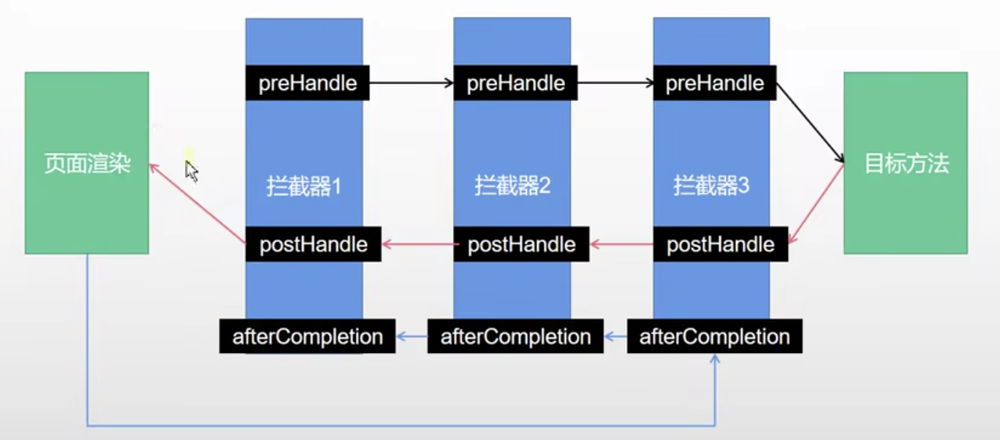

# 视图解析与模板引擎

## 视图解析

视图处理处理方式

* 转发
* 重定向
* 自定义视图
### 视图解析原理流程

核心方法：

```java
org.springframework.web.servlet.DispatcherServlet#doDispatch
```
1. 目标方法处理过程中，所有数据都会放在 ModelAndViewContainer 中，包括数据和视图地址。
2. 方法的参数是自定义类型对象（从请求参数中确定），会重新放在 ModelAndViewContainer 中。
3. 任何目标方法执行完成后都会返回 ModelAndView（数据和视图地址）
4. processDispatchResult  处理派发结果（页面如何响应）
    1. render(mv, request, response); 进行页面渲染逻辑，根据方法的String返回值得到View对象
        1. 遍历所有的视图解析器能否支持根据当前返回值得到View对象
        2.  创建RedirectView 对象（org.thymeleaf.spring5.view.ThymeleafViewResolver#createView）
        3. view.render(mv.getModelInternal(), request, response)
视图解析：

* 返回值以 forward: 开始： new InternalResourceView(forwardUrl);  转发request.getRequestDispatcher(path).forward(request, response); 
* 返回值以 redirect: 开始： new RedirectView() ， render就是重定向 
* 返回值是普通字符串： new ThymeleafView（）

## 模板引擎-Thymeleaf

### thymeleaf简介

**Thymeleaf** is a modern server-side Java template engine for both web and standalone environments.

**服务端Java模板引擎**

thymeleaf 官网地址：[https://www.thymeleaf.org/](https://www.thymeleaf.org/)

doc：[documentation](https://www.thymeleaf.org/documentation.html) ->(Read online) [usingthymeleaf](https://www.thymeleaf.org/doc/tutorials/3.0/usingthymeleaf.html)

### 基本语法

#### 表达式

[https://www.thymeleaf.org/doc/tutorials/3.0/usingthymeleaf.html#standard-expression-syntax](https://www.thymeleaf.org/doc/tutorials/3.0/usingthymeleaf.html#standard-expression-syntax)

|表达式名字|语法|用途|
|:----|:----|:----|
|变量取值|${...}|获取请求域、session域、对象等值|
|选择变量|*{...}|获取上下文对象值|
|消息|#{...}|获取国际化等值|
|链接|@{...}|生成链接|
|片段表达式|~{...}|jsp:include作用，引入公共页面片段|

#### 字面量

文本值: **'one text' , 'Another one!' ,…**数字: **0 , 34 , 3.0 , 12.3 ,…**布尔值: **true , false**

空值: **null**

变量： one，two，.... 变量不能有空格

#### 文本操作

字符串拼接: **+**

变量替换: **|The name is ${name}|**

#### 数学运算

运算符: + , - , * , / , %

#### 布尔运算

运算符:  **and , or**

一元运算: **! , not**

#### 比较运算

比较: **> , < , >= , <= ( gt , lt , ge , le )**等式: **== , != ( eq , ne )**

#### 条件运算

If-then: **(if) ? (then)**

If-then-else: **(if) ? (then) : (else)**

Default: (value) **?: (defaultvalue)**

#### 特殊操作

无操作： _

### 设置属性值

-th:attr

设置单个值

```plain
<form action="subscribe.html" th:attr="action=@{/subscribe}">
  <fieldset>
    <input type="text" name="email" />
    <input type="submit" value="Subscribe!" th:attr="value=#{subscribe.submit}"/>
  </fieldset>
</form>
```
设置多个值
```plain

```

以上两个的代替写法 th:xxxx

```plain
<input type="submit" value="Subscribe!" th:value="#{subscribe.submit}"/>
<form action="subscribe.html" th:action="@{/subscribe}">
```

所有h5兼容的标签写法

[https://www.thymeleaf.org/doc/tutorials/3.0/usingthymeleaf.html#setting-value-to-specific-attributes](https://www.thymeleaf.org/doc/tutorials/3.0/usingthymeleaf.html#setting-value-to-specific-attributes)

### 迭代

```xml
<tr th:each="prod : ${prods}">
        <td th:text="${prod.name}">Onions</td>
        <td th:text="${prod.price}">2.41</td>
        <td th:text="${prod.inStock}? #{true} : #{false}">yes</td>
</tr>
```

```xml
<tr th:each="prod,iterStat : ${prods}" th:class="${iterStat.odd}? 'odd'">
  <td th:text="${prod.name}">Onions</td>
  <td th:text="${prod.price}">2.41</td>
  <td th:text="${prod.inStock}? #{true} : #{false}">yes</td>
</tr>
```

### 条件运算

```xml
<a href="comments.html"
th:href="@{/product/comments(prodId=${prod.id})}"
th:if="${not #lists.isEmpty(prod.comments)}">view</a>
```

```xml
<div th:switch="${user.role}">
  <p th:case="'admin'">User is an administrator</p>
  <p th:case="#{roles.manager}">User is a manager</p>
  <p th:case="*">User is some other thing</p>
</div>
```

### 属性优先级

[https://www.thymeleaf.org/doc/tutorials/3.0/usingthymeleaf.html#attribute-precedence](https://www.thymeleaf.org/doc/tutorials/3.0/usingthymeleaf.html#attribute-precedence)

|Order|Feature|Attributes|
|:----|:----|:----|
|1|Fragment inclusion|th:insert<br>th:replace|
|2|Fragment iteration|th:each|
|3|Conditional evaluation|th:if<br>th:unless<br>th:switch<br>th:case|
|4|Local variable definition|th:object<br>th:with|
|5|General attribute modification|th:attr<br>th:attrprepend<br>th:attrappend|
|6|Specific attribute modification|th:value<br>th:href<br>th:src<br>...|
|7|Text (tag body modification)|th:text<br>th:utext|
|8|Fragment specification|th:fragment|
|9|Fragment removal|th:remove|

## thymeleaf使用

### 引入starter

[using spring boot # build-systems.starters](https://docs.spring.io/spring-boot/docs/current/reference/html/using.html#using.build-systems.starters)

```xml
<dependency>
    <groupId>org.springframework.boot</groupId>
    <artifactId>spring-boot-starter-thymeleaf</artifactId>
</dependency>
```

### 自动配置原理

```java
// org.springframework.boot.autoconfigure.thymeleaf.ThymeleafAutoConfiguration
@Configuration(proxyBeanMethods = false)
@EnableConfigurationProperties(ThymeleafProperties.class)
@ConditionalOnClass({ TemplateMode.class, SpringTemplateEngine.class })
@AutoConfigureAfter({ WebMvcAutoConfiguration.class, WebFluxAutoConfiguration.class })
public class ThymeleafAutoConfiguration { }
```

自动配置的策略：

1、所有的配置值都在 ThymeleafProperties

```java
public static final String DEFAULT_PREFIX = "classpath:/templates/";
public static final String DEFAULT_SUFFIX = ".html";
```
2、配置了 SpringTemplateEngine
3、配置了 ThymeleafViewResolver

用户只要导入依赖包自动配置然后直接开发页面即可。

### 页面开发

controller

```java
@Controller
public class ViewController {
    @GetMapping("/thyinfo")
    public String thyInfo(Model model) {
        // model 中的数据会被放在请求域中 request.setAttribute("msg", aa)
        model.addAttribute("msg", "hello thyinfo");
        return "thyinfo";
    }
}
```
模板页面
```xml
<!DOCTYPE html>
<html lang="en" xmlns:th="http://www.thymeleaf.org">
<head>
    <meta charset="UTF-8">
    <title>thyinfo</title>
</head>
<body>
<h1 th:text="${msg}">info</h1>
</body>
</html>
```

# 拦截器

## HandlerInterceptor接口

```java
public class LoginInterceptor implements HandlerInterceptor {
    final Logger log = LoggerFactory.getLogger(LoginInterceptor.class);
    // 目标方法执行之前
    @Override
    public boolean preHandle(HttpServletRequest request, HttpServletResponse response, Object handler) throws Exception {
        String requestURI = request.getRequestURI();
        log.info("preHandle拦截的请求路径是{}", requestURI);
        //登录检查逻辑
        HttpSession session = request.getSession();
        Object loginUser = session.getAttribute("loginUser");
        if (loginUser != null) {
            //放行
            return true;
        }
        //拦截住。未登录。跳转到登录页
        request.setAttribute("msg", "请先登录");
//        re.sendRedirect("/");
        request.getRequestDispatcher("/error").forward(request, response);
        return false;
    }
    // 目标方法执行完成以后
    @Override
    public void postHandle(HttpServletRequest request, HttpServletResponse response, Object handler, ModelAndView modelAndView) throws Exception {
        log.info("postHandle执行{}", modelAndView);
    }
    // 页面渲染完成之后
    @Override
    public void afterCompletion(HttpServletRequest request, HttpServletResponse response, Object handler, Exception ex) throws Exception {
        log.info("afterCompletion Exception={}", ex);
    }
}

```


## 配置拦截器

```java
@Configuration
public class InterceptorConfig implements WebMvcConfigurer {
    @Override
    public void addInterceptors(InterceptorRegistry registry) {
        registry.addInterceptor(new LoginInterceptor())
                .addPathPatterns("/**")   //  /** 默认拦截所有路径
                .excludePathPatterns("/", "/error");
    }
}
```

## 拦截器原理

核心代码入口：

```java
// org.springframework.web.servlet.DispatcherServlet#doDispatch
mappedHandler = getHandler(processedRequest); // 类型 HandlerExecutionChain
```

1. 根据当前请求找到 HandlerExecutionChain，即 handler 及其所有拦截器。mappedHandler 中包含了 HandlerInterceptor 列表
2. 顺序执行 所有拦截器的 preHandle 方法
    1. 如果返回为 true 则执行下一个拦截器的 preHandle
    2. 如果返回为 false 则倒序执行已经执行拦截器的 afterCompletion 方法
3. 任何一个拦截器返回 false，直接跳出不会执行目标方法
4. 所有拦截器都返回 true，执行目标方法
5. 倒序执行所有拦截器的 postHandle 方法
6. 前面步骤任何异常都会直接倒序触发已经执行了拦截器的 afterCompletion 方法
7. 页面成功渲染之后，也会倒序触发 afterCompletion 方法
流程图如下：




# 文件上传

## 页面表单

```xml
<form method="post" action="/upload" enctype="multipart/form-data">
    <input type="file" name="file"><br>
    <input type="submit" value="提交">
</form>
```

## 文件上传

```java
@ResponseBody
@PostMapping("/upload")
public String upload(@RequestParam("email") String email,
                     @RequestParam("username") String username,
                     @RequestParam("header") MultipartFile header,
                     @RequestParam("photos") MultipartFile[] photos) throws IOException {
    if (!header.isEmpty()) {
        String originFilename = header.getOriginalFilename();
        header.transferTo(new File("/Users/bo/code/spring-boot-demo/" + originFilename));
    }
    if (photos.length > 0) {
        for (MultipartFile photo : photos) {
            if (!photo.isEmpty()) {
                String originFilename = photo.getOriginalFilename();
                photo.transferTo(new File("/Users/bo/code/spring-boot-demo/" + originFilename));
            }
        }
    }
    return "upload success";
}
```

## 自动配置原理

文件上传自动配置类 MultipartAutoConfiguration 自动配置了 StandardServletMultipartResolver（文件上传解析器）和 MultipartProperties

自动配置代码：

```java
// org.springframework.boot.autoconfigure.web.servlet.MultipartAutoConfiguration
```

文件上传源码入口：

```java
// protected void doDispatch(HttpServletRequest request, HttpServletResponse response) throws Exception {
processedRequest = checkMultipart(request);
```

原理步骤：

1. 请求进来使用文件上传解析器判断（isMultipart）并封装（resolveMultipart，返回MultipartHttpServletRequest）文件上传请求
2. 参数解析器来解析请求中的文件内容封装成 MultipartFile
3. 将request中文件信息封装为一个Map；MultiValueMap<String, MultipartFile>
FileCopyUtils。实现文件流的拷贝。

# 异常处理

官方文档：[web # error-handling](https://docs.spring.io/spring-boot/docs/current/reference/html/web.html#web.reactive.webflux.error-handling)

## 错误处理

### 默认规则

* 默认情况下，Spring Boot提供`/error`处理所有错误的映射
* 对于机器客户端，它将生成JSON响应，其中包含错误，HTTP状态和异常消息的详细信息。对于浏览器客户端，响应一个“ whitelabel”错误视图，以HTML格式呈现相同的数据
```json
// json格式：(页面可直接取该变量值进行显示)
{
  "timestamp": "xxx",
  "status": 404,
  "error": "xxxx",
  "message": "",
  "path": ""
}
```
*  要完全替换默认行为，可以实现 `ErrorController`并注册该类型的Bean定义，或添加`ErrorAttributes类型的组件`以使用现有机制但替换其内容。
* error/下的4xx，5xx页面会被自动解析；
 

## 定制错误处理逻辑

* 自定义错误页
    * error/404.html   error/5xx.html；有精确的错误状态码页面就匹配精确，没有就找 4xx.html；如果都没有就触发白页
* @ControllerAdvice+@ExceptionHandler处理全局异常；底层是 **ExceptionHandlerExceptionResolver 支持的**
* @ResponseStatus+自定义异常 ；底层是 **ResponseStatusExceptionResolver ，把responsestatus注解的信息底层调用 response.sendError(statusCode, resolvedReason)；tomcat发送的/error**
* Spring底层的异常，如 参数类型转换异常；**DefaultHandlerExceptionResolver 处理框架底层的异常。**
    * response.sendError(HttpServletResponse.**SC_BAD_REQUEST**, ex.getMessage()); 
* 自定义实现 HandlerExceptionResolver 处理异常；可以作为默认的全局异常处理规则
* **ErrorViewResolver**  实现自定义处理异常；
    * response.sendError 。error请求就会转给controller
    * 异常没有任何人能处理。tomcat底层 response.sendError。error请求就会转给controller
    * basicErrorController 要去的页面地址是 ErrorViewResolver  ；
## 异常处理自动配置原理

自动配置类：

```java
// org.springframework.boot.autoconfigure.web.servlet.error.ErrorMvcAutoConfiguration
public class ErrorMvcAutoConfiguration {}
```
该类用于自动配置异常处理规则。
容器中的组件：

1、DefaultErrorAttributes

定义错误页面中可以包含哪些数据，如 timestamp、error、message 等

```java
// org.springframework.boot.web.servlet.error.DefaultErrorAttributes#getErrorAttributes
@Override
public Map<String, Object> getErrorAttributes(WebRequest webRequest, ErrorAttributeOptions options) {}
```

2、BasicErrorController

处理默认 /error 路径的请求。

根据请求的不同（produces = MediaType.TEXT_HTML_VALUE）响应页面或者 json。

```java
// org.springframework.boot.autoconfigure.web.servlet.error.BasicErrorController#errorHtml
@RequestMapping(produces = MediaType.TEXT_HTML_VALUE)
public ModelAndView errorHtml(HttpServletRequest request, HttpServletResponse response) {
   HttpStatus status = getStatus(request);
   Map<String, Object> model = Collections
         .unmodifiableMap(getErrorAttributes(request, getErrorAttributeOptions(request, MediaType.TEXT_HTML)));
   response.setStatus(status.value());
   ModelAndView modelAndView = resolveErrorView(request, response, status, model);
   return (modelAndView != null) ? modelAndView : new ModelAndView("error", model);
}
@RequestMapping
public ResponseEntity<Map<String, Object>> error(HttpServletRequest request) {
  ...
}
```

3、BeanNameViewResolver

视图解析器，按照返回的视图名作为组件的 id 去容器中寻找 View 对象。

```java
// org.springframework.boot.autoconfigure.web.servlet.error.ErrorMvcAutoConfiguration.WhitelabelErrorViewConfiguration#beanNameViewResolver
@Bean
@ConditionalOnMissingBean
public BeanNameViewResolver beanNameViewResolver() {
   BeanNameViewResolver resolver = new BeanNameViewResolver();
   resolver.setOrder(Ordered.LOWEST_PRECEDENCE - 10);
   return resolver;
}
```

4、DefaultErrorViewResolver

如果发生错误，会以HTTP的状态码 作为视图页地址（viewName），寻找真正的页面如：error/404、5xx.html

```java
// org.springframework.boot.autoconfigure.web.servlet.error.ErrorMvcAutoConfiguration.DefaultErrorViewResolverConfiguration#conventionErrorViewResolver
@Bean
@ConditionalOnBean(DispatcherServlet.class)
@ConditionalOnMissingBean(ErrorViewResolver.class)
DefaultErrorViewResolver conventionErrorViewResolver() {
   return new DefaultErrorViewResolver(this.applicationContext, this.resourceProperties);
}
```

## 异常处理流程

1、执行目标方法，目标方法任何异常都会被 catch 且标记请求结束，并用 **dispatchException**

 保存异常信息。

```java
// org.springframework.web.servlet.DispatcherServlet#doDispatch
mv = ha.handle(processedRequest, response, mappedHandler.getHandler());
```
2、进入视图解析流程
```java
processDispatchResult(processedRequest, response, mappedHandler, mv, dispatchException);
```

3、处理 handler 异常

```java
// org.springframework.web.servlet.DispatcherServlet#processDispatchResult
mv = processHandlerException(request, response, handler, exception);
```
1）遍历所有的处理器异常解析器 handlerExceptionResolvers 
2）系统默认的异常解析器 DefaultErrorAttributes 先处理异常，会把异常信息保存到 request 域中且返回 null。

* 没有能处理的最终底层会发送 /error 请求，继而被 BasicErrorController 处理
* 解析错误试图，遍历所有的 ErrorViewResolver 
* 默认的 DefaultErrorViewResolver 将响应状态码作为错误页的地址
* 模板引擎最终响应 error/xxx.html

# Web原生组件注入

官方参考文档：[web # web.servlet.embedded-container](https://docs.spring.io/spring-boot/docs/current/reference/html/web.html#web.servlet.embedded-container)

Servlets, Filters, and listeners

根据官方文档描述，有如下两种方式可以注入上述组件。

## Servlet API

1、编写自定义 MyServlet

```java
@WebServlet(urlPatterns = "/my")
public class MyServlet extends HttpServlet {}
```
2、启动类配置 @ServletComponentScan(basePackages = "com.chnherb.boot")
3、编写自定义 MyFilter

```java
@WebFilter(urlPatterns = {"/css/*", "/images/*"})  
// * 是servlet的写法，** 是spring的写法
public class MyFilter implements Filter {}
```
4、编写自定义 MyListener
```java
@WebListener
public class MyListener implements ServletContextListener {}
```

## RegistrationBean

`ServletRegistrationBean`, `FilterRegistrationBean`, and `ServletListenerRegistrationBean` 。

推荐使用该方式。

```java
@Configuration
public class MyRegistConfig {
    @Bean
    public ServletRegistrationBean myServlet() {
        MyServlet myServlet = new MyServlet();
        return new ServletRegistrationBean(myServlet, "/my", "/my2");
    }
    @Bean
    public FilterRegistrationBean myFilter() {
        MyFilter myFilter = new MyFilter();
//        // 第一种写法：配置拦截 servlet
//        FilterRegistrationBean filterRegistrationBean = new FilterRegistrationBean(myFilter, myServlet());
        // 第二种写法：自定义 urlPatterns
        FilterRegistrationBean filterRegistrationBean = new FilterRegistrationBean(myFilter);
        filterRegistrationBean.setUrlPatterns(Arrays.asList("/images/*"));
                return filterRegistrationBean;
    }
    @Bean
    public ServletListenerRegistrationBean myListener() {
        MyListener myListener = new MyListener();
        return new ServletListenerRegistrationBean(myListener);
    }
}
```

## 扩展：DispatcherServlet注册

问：为什么上文 servlet 路径 /my 等没有被 spring 的 DispatchServlet 拦截？

DispatcherServlet 通过 DispatcherServletAutoConfiguration 注册：

* 容器中自动配置了 DispatcherServlet  属性绑定到 WebMvcProperties；对应的配置文件配置项是 **spring.mvc。**
* **通过 ServletRegistrationBean**<DispatcherServlet> 把 DispatcherServlet  配置进来。
* 默认映射的是 / 路径。
Tomcat-Servlet 精准优先匹配原则：

多个Servlet都能处理到同一层路径，精确优选匹配原则，即能匹配到 /my 就不会匹配 /。


# 嵌入式Servlet容器

根据官方文档 [web # web.servlet.embedded-container](https://docs.spring.io/spring-boot/docs/current/reference/html/web.html#web.servlet.embedded-container) 介绍，支持的嵌入式 Servlet 容器有 Tomcat、Jetty 和 Undertow.

## 基本原理

（参考 [web # web.servlet.embedded-container.application-context](https://docs.spring.io/spring-boot/docs/current/reference/html/web.html#web.servlet.embedded-container.application-context)）

* SpringBoot 应用启动发现当前是 Web 应用则会导入 tomcat
* Web 应用会创建一个 web 版的 ioc 容器 ServletWebServerApplicationContext
* ServletWebServerApplicationContext 容器启动寻找 ServletWebServerFactory（Servlet 的服务器工厂） 并引导创建 Servlet 服务器。
* SpringBoot 底层默认有很多 WebServer 工厂如 TomcatServletWebServerFactory、JettyServletWebServerFactory、UndertowServletWebServerFactory
    * 底层会有一个自动配置类 ServletWebServerFactoryAutoConfiguration，该类有 Import 了 ServletWebServerFactoryConfiguration
    * ServletWebServerFactoryConfiguration 条件装配（根据导入的包）上面三个 XxxWebServerFactory
    * 以 TomcatServletWebServerFactory 为例会创建出 TomcatWebServer
其实就是将手动启动服务器自动化实现。

创建 WebServer 代码流程

```java
// org.springframework.boot.web.servlet.context.ServletWebServerApplicationContext#createWebServer
private void createWebServer() {
   WebServer webServer = this.webServer;
   ServletContext servletContext = getServletContext();
   if (webServer == null && servletContext == null) {
      // 找不到或找到多个会抛出异常
      ServletWebServerFactory factory = getWebServerFactory();
      this.webServer = factory.getWebServer(getSelfInitializer());
      getBeanFactory().registerSingleton("webServerGracefulShutdown",
            new WebServerGracefulShutdownLifecycle(this.webServer));
      getBeanFactory().registerSingleton("webServerStartStop",
            new WebServerStartStopLifecycle(this, this.webServer));
   }
=   
   ...
   initPropertySources();
}
```

## 切换服务器

```xml
<dependency>
    <groupId>org.springframework.boot</groupId>
    <artifactId>spring-boot-starter-web</artifactId>
    <exclusions>
        <exclusion>
            <groupId>org.springframework.boot</groupId>
            <artifactId>spring-boot-starter-tomcat</artifactId>
        </exclusion>
    </exclusions>
</dependency>
<dependency>
    <groupId>org.springframework.boot</groupId>
    <artifactId>spring-boot-starter-undertow</artifactId>
</dependency>
```

## 自定义Servlet容器

* 修改配置文件 server.xxx
* 直接自定义 ConfigurableServletWebServerFactory（ServletWebServerFactory）
* 实现 WebServerFactoryCustomizer<ConfigurableServletWebServerFactory>，把配置文件的值和 ServletWebServerFactory 进行绑定 （参考：[web # web.servlet.embedded-container.customizing.programmatic](https://docs.spring.io/spring-boot/docs/current/reference/html/web.html#web.servlet.embedded-container.customizing.programmatic)）
```java
@Component
public class MyWebServerFactoryCustomizer implements WebServerFactoryCustomizer<ConfigurableServletWebServerFactory> {
    @Override
    public void customize(ConfigurableServletWebServerFactory server) {
        server.setPort(9000);
    }
}
```

# 定制化总结

参考 [web # web.servlet.spring-mvc.auto-configuration](https://docs.spring.io/spring-boot/docs/current/reference/html/web.html#web.servlet.spring-mvc.auto-configuration)

基本思路是：

1. 导入场景 starter
2. xxxAutoConfiguration 
3. 自动配置类导入相关组件
4. 绑定 xxxProperties
5. 绑定配置文件
## 定制化方法

* 修改配置文件
* 自定义配置类 xxxConfiguration + Bean 注入（替换或增加默认组件）
* 自定义配置类并实现 WebMvcConfigurer + Bean 注入
* 自定义 Customizer
* 使用注解@EnableWebMvc + 实现 WebMvcConfigurer + bean 全面接管 SpringMVC，所有规则重新配置（慎用）
## EnableWebMvc注解原理

前提：WebMvcAutoConfiguration  默认的SpringMVC的自动配置功能类。包含静态资源、欢迎页等。

@EnableWebMvc 注解会 @Import(DelegatingWebMvcConfiguration.class)。

DelegatingWebMvcConfiguration 只保证 SpringMVC 最基本的使用：

* 将系统中所有的 WebMvcConfigurer 合并一起作用生效
* 该类继承 WebMvcConfigurationSupport
* WebMvcConfigurationSupport 会自动配置一些非常底层的组件，如 RequestMappingHandlerMapping
但是 WebMvcAutoConfiguration 类条件配置生效是

```java
@ConditionalOnMissingBean(WebMvcConfigurationSupport.class)
```
所以当开启 @EnableWebMvc 注解时，WebMvcAutoConfiguration 就不满足条件配置了。
