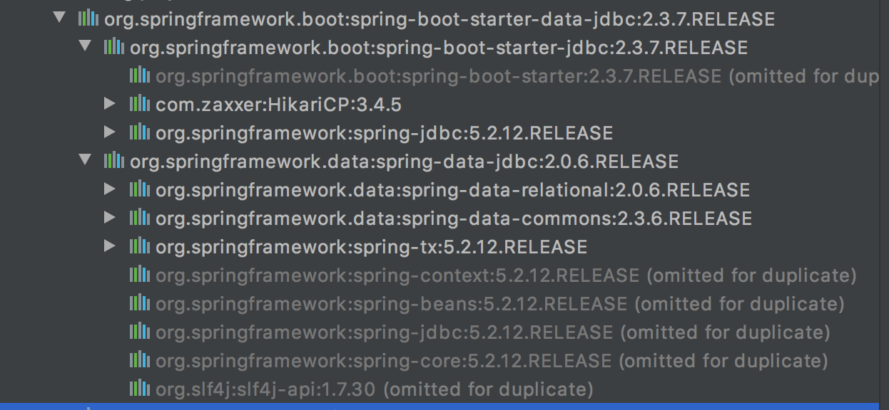

# HikariDataSource

## 导入JDBC

```xml
<!-- jdbc -->
<dependency>
    <groupId>org.springframework.boot</groupId>
    <artifactId>spring-boot-starter-data-jdbc</artifactId>
</dependency>
<!-- mysql 驱动 -->
<dependency>
    <groupId>mysql</groupId>
    <artifactId>mysql-connector-java</artifactId>
</dependency>
```

jdbc maven 包：




注意：mysql 驱动版本要和实际安装的数据库版本一致。比如本文中 mysql 驱动默认的版本在 spring-boot-starter-parent -> spring-boot-dependencies 中默认为：

```xml
<mysql.version>8.0.22</mysql.version>
```
如果机器上实际安装的版本不一样就需要修改，方法如下：
1、直接依赖引入具体版本（maven的就近依赖原则）

```xml
<dependency>
    <groupId>mysql</groupId>
    <artifactId>mysql-connector-java</artifactId>
    <version>xxx</version>
</dependency>
```
2、重新声明版本（maven的属性的就近优先原则）
```xml
    <properties>
        <mysql.version>xxx</mysql.version>
    </properties>
```

## 自动配置

自动配置包 spring-boot-autoconfigure 下的 jdbc 目录下，主要的自动配置类有：

* DataSourceAutoConfiguration
    * 数据源相关配置：spring.datasource
    * 容器中没有DataSource才会自动配置
    * 本场景会自动配置 HikariDataSource
* DataSourceTransactionManagerAutoConfiguration： 事务管理器的自动配置
* JdbcTemplateAutoConfiguration： JdbcTemplate的自动配置，可以来对数据库进行crud
    * 配置项@ConfigurationProperties(prefix = "spring.jdbc") 
    * @Bean@Primary    JdbcTemplate；容器中有这个组件
* JndiDataSourceAutoConfiguration： jndi的自动配置
* XADataSourceAutoConfiguration： 分布式事务相关的
## Datasource配置

```yaml
# 导入相关包不配置启动会报错
spring:
  datasource:
    url: jdbc:mysql://localhost:3306/Demo
    username: root
    password: root1234
    driver-class-name: com.mysql.jdbc.Driver
  #    type: com.zaxxer.hikari.HikariDataSource
```

## 单测

```java
@Slf4j
@RunWith(SpringRunner.class)
@SpringBootTest(classes = MainApplication.class)
public class MainApplicationTest {
    @Autowired
    JdbcTemplate jdbcTemplate;
    @Test
    public void contextLoads() {
//        jdbcTemplate.queryForObject("select * from user");
//        jdbcTemplate.queryForList("select * from user", )
        Long count = jdbcTemplate.queryForObject("select count(*) from user", Long.class);
        log.info("count: {}", count);
    }
}
```

# Druid数据源

官方Github地址：[https://github.com/alibaba/druid](https://github.com/alibaba/druid)

整合第三方技术的两种方式

* 自定义
* starter
## 自定义使用

### 导入依赖

```xml
<dependency>
    <groupId>com.alibaba</groupId>
    <artifactId>druid</artifactId>
    <version>1.1.17</version>
</dependency>
```
### 数据源配置

```xml
<bean id="dataSource" class="com.alibaba.druid.pool.DruidDataSource"
		destroy-method="close">
		<property name="url" value="${jdbc.url}" />
		<property name="username" value="${jdbc.username}" />
		<property name="password" value="${jdbc.password}" />
		<property name="maxActive" value="20" />
		<property name="initialSize" value="1" />
		<property name="maxWait" value="60000" />
		<property name="minIdle" value="1" />
		<property name="timeBetweenEvictionRunsMillis" value="60000" />
		<property name="minEvictableIdleTimeMillis" value="300000" />
		<property name="testWhileIdle" value="true" />
		<property name="testOnBorrow" value="false" />
		<property name="testOnReturn" value="false" />
		<property name="poolPreparedStatements" value="true" />
		<property name="maxOpenPreparedStatements" value="20" />
```
转成config配置
```java
@Configuration
public class MyDataSourceConfig {
    @Bean
    @ConfigurationProperties("spring.datasource")
    public DataSource dataSource() throws SQLException {
        DruidDataSource druidDataSource = new DruidDataSource();
        return druidDataSource;
    }
    xxx
}
```

### StatViewServlet

StatViewServlet的用途包括：

* 提供监控信息展示的html页面
* 提供监控信息的JSON API
xml配置：

```xml
    <servlet>
		<servlet-name>DruidStatView</servlet-name>
		<servlet-class>com.alibaba.druid.support.http.StatViewServlet</servlet-class>
	</servlet>
	<servlet-mapping>
		<servlet-name>DruidStatView</servlet-name>
		<url-pattern>/druid/*</url-pattern>
	</servlet-mapping>
```
转成config配置：
```java
    @Bean
    public ServletRegistrationBean statViewServlet() {
        StatViewServlet statViewServlet = new StatViewServlet();
        ServletRegistrationBean servletRegistrationBean = new ServletRegistrationBean(statViewServlet, "/druid/*");
        return servletRegistrationBean;
    }
```

### StatFilter

用于统计监控信息；如SQL监控、URI监控

xml配置：

```xml
// 需要给数据源中配置如下属性；可以允许多个filter，多个用，分割；如：
<property name="filters" value="stat,slf4j" />
```
转成config配置：
```java
    @Bean
    @ConfigurationProperties("spring.datasource")
    public DataSource dataSource() throws SQLException {
        DruidDataSource druidDataSource = new DruidDataSource();
        druidDataSource.setFilters("stat,wall");
        return druidDataSource;
    }
    @Bean
    public FilterRegistrationBean webStatFilter() {
        WebStatFilter webStatFilter = new WebStatFilter();
        FilterRegistrationBean<WebStatFilter> filterRegistrationBean = new FilterRegistrationBean<>(webStatFilter);
        filterRegistrationBean.setUrlPatterns(Arrays.asList("/*"));
        filterRegistrationBean.addInitParameter("exclusions", "*.js,*.gif,*.jpg,*.png,*.css,*.ico,/druid/*");
        return filterRegistrationBean;
    }
```

## starter使用

### 引入依赖

```xml
<dependency>
    <groupId>com.alibaba</groupId>
    <artifactId>druid-spring-boot-starter</artifactId>
    <version>1.1.17</version>
</dependency>
```

### 自动配置

* 扩展配置项 spring.datasource.druid
* DruidSpringAopConfiguration.class,   监控SpringBean的；配置项：spring.datasource.druid.aop-patterns
* DruidStatViewServletConfiguration.class, 监控页的配置：spring.datasource.druid.stat-view-servlet；默认开启
*  DruidWebStatFilterConfiguration.class, web监控配置；spring.datasource.druid.web-stat-filter；默认开启
* DruidFilterConfiguration.class}) 所有Druid自己filter的配置
### 配置示例

```yaml
spring:
  datasource:
    url: jdbc:mysql://localhost:3306/db_account
    username: root
    password: 123456
    driver-class-name: com.mysql.jdbc.Driver

    druid:
      aop-patterns: com.atguigu.admin.*  #监控SpringBean
      filters: stat,wall     # 底层开启功能，stat（sql监控），wall（防火墙）

      stat-view-servlet:   # 配置监控页功能
        enabled: true
        login-username: admin
        login-password: admin
        resetEnable: false

      web-stat-filter:  # 监控web
        enabled: true
        urlPattern: /*
        exclusions: '*.js,*.gif,*.jpg,*.png,*.css,*.ico,/druid/*'

      filter:
        stat:    # 对上面filters里面的stat的详细配置
          slow-sql-millis: 1000
          logSlowSql: true
          enabled: true
        wall:
          enabled: true
          config:
            drop-table-allow: false
```

# Mybatis整合

官方地址：[https://github.com/mybatis](https://github.com/mybatis)

springboot官方starter：spring-boot-starter-*

第三方starter：xx-spring-boot-starter

在 github 中自行寻找

```xml
<dependency>
    <groupId>org.mybatis.spring.boot</groupId>
    <artifactId>mybatis-spring-boot-starter</artifactId>
    <version>2.1.4</version>
</dependency>
```

## 配置模式

全局配置文件：

* SqlSessionFactory: 自动配置
* SqlSession：自动配置了 SqlSessionTemplate 组合了SqlSession
* @Import(AutoConfiguredMapperScannerRegistrar.class）；
* Mapper： 只要操作MyBatis接口标注了 @Mapper 就会被自动扫描进来
```java
@org.springframework.context.annotation.Configuration
@ConditionalOnClass({ SqlSessionFactory.class, SqlSessionFactoryBean.class })
@ConditionalOnSingleCandidate(DataSource.class)
@EnableConfigurationProperties(MybatisProperties.class)
@AutoConfigureAfter({ DataSourceAutoConfiguration.class, MybatisLanguageDriverAutoConfiguration.class })
public class MybatisAutoConfiguration implements InitializingBean {}

@ConfigurationProperties(prefix = MybatisProperties.MYBATIS_PREFIX)
public class MybatisProperties {}
```

## 配置mybatis规则

application.yml文件中配置：

```yaml
mybatis:
  config-location: classpath:mybatis/mybatis-config.xml  #全局配置文件位置
  mapper-locations: classpath:mybatis/mapper/*.xml  #sql映射文件位置
```

查看 MybatisProperties 代码可以发现其中有个 private Configuration configuration。那么mybatis.configuration就是相当于改mybatis全局配置文件中的值。即不配置 mybatis.config-location 指定全局配置文件的内容。(注意：不要同时存在）

书写代码：controller->service->mapper->xml

## 注解模式

```java
@Mapper
public interface CityMapper {
    @Select("Select * from city where id=#{id}")
    public City getByID(Long id);
    @Insert("insert into City(`name`, `country`) values (#{name}, #{country})")
    @Options(useGeneratedKeys = true, keyProperty = "id")
    public void insert(City city);
}
```

## 混合模式

```java
@Mapper
public interface CityMapper {
    @Select("Select * from city where id=#{id}")
    public City getByID(Long id);
    public void insert(City city);
}
```
mapper.xml
```xml
<mapper namespace="com.chnherb.boot.mapper.CityMapper">
    <insert id="insert" useGeneratedKeys="true" keyProperty="id">
        insert into City(`name`, `country`) values (#{name}, #{country})
    </insert>
</mapper>
```


## 最佳实战

* 引入 starter
* 配置application.yml
* 编写 mapper 接口并标注 @Mapper 注解
* 简单方法直接使用注解方式
* 复杂方法编写 mapper.xml 进行绑定映射
* @MapperScan("com.chnherb.boot.mapper") 简化，其他接口可以不使用 @Mapper 注解标注
# 整合MyBatis-Plus

## MyBatis-Plus简介

[MyBatis-Plus](https://github.com/baomidou/mybatis-plus) 是一个 [MyBatis](http://www.mybatis.org/mybatis-3/) 增强工具，在 MyBatis 的基础上只做增强不做改变，为简化开发、提高效率而生。

[mybatis plus 官网](https://baomidou.com/)，建议安装 **MybatisX**插件。

## 引入依赖

```xml
<dependency>
    <groupId>com.baomidou</groupId>
    <artifactId>mybatis-plus-boot-starter</artifactId>
    <version>3.4.1</version>
</dependency>
```

## 自动配置

自动配置

* MybatisPlusAutoConfiguration 配置类，MybatisPlusProperties 配置项绑定。mybatis-plus：xxx 就是对mybatis-plus的定制
* SqlSessionFactory 自动配置好。底层是容器中默认的数据源
* mapperLocations 自动配置好的。有默认值。classpath*:/mapper/**/*.xml；任意包的类路径下的所有mapper文件夹下任意路径下的所有xml都是sql映射文件。  建议以后sql映射文件，放在 mapper下
* 容器中也自动配置好了 SqlSessionTemplate
* @Mapper 标注的接口也会被自动扫描；建议直接 @MapperScan("com.atguigu.admin.mapper") 批量扫描就行
优点：

*  只需要Mapper继承 BaseMapper 就可以拥有CRUD能力
