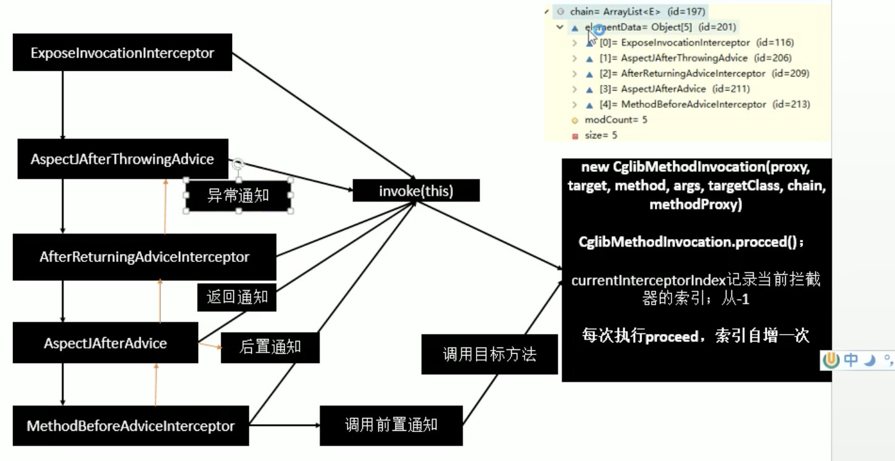

## 组件注册

给容器中注入组件

### 1）包扫描+组件标注注解

（@Controller/@Service/@Repository/@Component） 

### 2）@Bean导入

[导入的第三方包里面的组件] 

### 3）@Import

[快速给容器中导入一个组件]，查看源码，可以看到有三种导入方法 

#### 3.1）@Import

(要导入到容器中的组件)：容器找那个就会自动注册这个组件，id默认是全类名 

#### 3.2）ImportSelector

返回需要导入的全类名数组(注意：可以返回空数组，但不要返回null) 

#### 3.3）ImportBeanDefinitionRegistrar 

注：在Config的类上注，如下

```plain
@Import({Color.class,Red.class, MyImportSelector.class, MyImportBeanDefinitionRegistrar})
//@Import(Color.class)
@Configuration
public class Config{
    @Lazy
    @Bean("person")
    public Person person() {
        return new Person();
    }
}

public class MyImportSelector implements ImportSelector {
    // 返回值，就是要导入到容器中的组件全类名
    @Override
    public String[] selectImports(AnnotationMetadata importingClassMetadata) {
        // 不要返回null
        return new String[]{"com.xxx.xxx.Yellow","com.xxx.xxx.Blue"}
    }
}

public class MyImportBeanDefinitionRegistrar implements ImportBeanDefinitionRegistrar {
    // AnnotationMetadata: 当前类的注解信息
    // BeanDefinitionRegistry: BeanDefinition注册类，把所有需要添加到容器中的类注册进去.
    // 调用BeanDefinitionRegistry.registerBeanDefinition手工注册
    @Override
    public void registerBeanDefinitions(AnnotationMetadata importingClassMetadata, BeanDefinitionRegistry beanDefinitionRegistry) {
        boolean definition = registry.containBeanDefinition("red");
        if (definition) {
            
        }
    }
}
```
### 4）使用FactoryBean（工厂Bean） 

4.1）默认获取到的是工厂bean调用getObject创建的对象 

4.2）要获取工厂Bean本身，需要在id前面加一个&（查看FactoryBean接口源码，定义了常量）

```plain
public class ColorFactoryBean implements FactoryBean<Color> {
    // 返回一个对象，该对象会添加到容器中
    @Override
    public Color getObject() throws Exception {
        return new Color();
    }
    @Override
    public Class<?> getObjectType() {
        return Color.class;
    }
    // ture：容器中只保留一份
    // false: 多份
    @Override
    public boolean isSingleton() {
        reutrn false;
    }
}

@Configuration
public class Config{
    @Bean
    public ColorFactoryBean colorFactoryBean() {
        return new ColorFactoryBean();
    }
}
```
## 生命周期

### 指定初始化和销毁方法

1、指定初始化方法和销毁方法

```plain
@ComponentSan("com.xxx.bean")
@Configuration
public class MainConfigOfLifeCycle {
    // 指定car中定义的方法
    @Bean(initMethod="init", destroyMethod="destroy")
    public Car car() {
        returen new Car();
    }
}
```
2、通过让Bean实现InitializingBean（定义初始化逻辑） 、DisposableBean（定义销毁逻辑）
3、可以使用JSR250，在bean定义的方法上加上以下注解 @PostConstruct：bean创建完成 @PreDestroy：容易移除bean之前

4、BeanPostProcessor接口，bean的后置处理器；在bean初始化前后进行一些处理工作； postProcessBeforeInitialization(Object object, xxx); postProcessAfterInittialization(Object object, xxx);

### InstantiationAwareBeanPostProcessor

其方法postProcessAfterInstantiation，可以根本Object bean判断需要实例话的方法，或者全部不实例化 

## AOP

### @EnableAspectJAutoProxy

1、@Import(AspectJAutoProxyRegistrar.class 给容器中导入AspectJAutoProxyRegistrar，

利用AspectJAutoProxyRegistrar自定义给容器中注册bean。

internalAutoProxyCreator = AnnotationAwareAspectJAutoProxyCreator

给容器中注册一个AnnotationAwareAspectJAutoProxyCreator

2、AnnotationAwareAspectJAutoProxyCreator

类的继承关系

```java
AnnotationAwareAspectJAutoProxyCreator
  ->AspectJAwareAdvisorAutoProxyCreator
    ->AbstractAdvisorAutoProxyCreator
      ->AbstractAutoProxyCreator
      impl SmartInstantiationAwareBeanPostProcessor, BeanFactoryAware
      //关注后置处理器、自动装配bean
```
类的主要方法
```java
AbstractAutoProxyCreator.setBeanFactory()
AbstractAutoProxyCreator.后置处理器逻辑

AbstractAdvisorAutoProxyCreator.setBeanFactory()->initBeanFactory()

AnnotationAwareAspectJAutoProxyCreator.initBeanFactory()
```

### 调用流程

1、传入配置类，创建ioc容器

2、注册配置类，调用refresh()刷新容器

3、registerBeanPostProcessors(beanFactory);注册bean的后置处理器来拦截bean的创建

3.1、先获取ioc容器已经定义了的需要创建对象的所有BeanPostProcessor

3.2、给容器中加别的BeanPostProcessor

3.3、优先注册实现了PriorityOrdered接口的BeanPostProcessor

3.4、再给容器中注册实现了Ordered接口的BeanPostProcessor

3.5、没实现优先级接口的BeanPostProcessor

3.6、注册BeanPostProcessor，实际上就是创建BeanPostProcessor对象，保存在容器中。

创建internalAutoProxyCreator的BeanPostProcessor【AnnotationAwareAspectJAutoProxyCreator】

3.6.1、创建bean的实例

3.6.2、populateBean：给bean各种属性赋值

3.6.3、initializeBean：初始化bean

3.6.3.1、invokeAwareMethods()：处理Aware接口的方法回调

3.6.3.2、applyBeanPostProcessorsBeforeInitialization()：应用后置处理器的BeforeInitialization

3.6.3.3、invokeInitMethods()：执行自定义的初始化方法

3.6.3.4、applyBeanPostProcessorsAfterInitialization()：执行后置处理器的postProcessAfterInitialization()

3.6.4、BeanPostProcessor(AnnotationAwareAspectJAutoProxyCreator)

3.7、把BeanPostProcessor注册到BeanFactory中：

beanFactory.addBeanPostProcessor(postProcessor);

===以上是创建和注册AnnotationAwareAspectJAutoProxyCreator的过程===

4、finishBeanFactoryInitialization(beanFactory);完成BeanFactory初始话工作，创建剩下的单实例bean

4.1、编译获取容器中所有的bean，依次创建对象getBean(beanName);

getBean->doGetBean()->getSingleton()

4.2、创建bean

【AnnotationAwareAspectJAutoProxyCreator在所有bean创建之前会有一个拦截，InstantiationAwareBeanPostProcessor，会调用postProcessBeforeInstantiation()】

4.2.1、先从缓存中获取当前bean，如果能获取到，说明bean是之前被创建过直接使用，否则再创建；只要创建好的bean都会被缓存起来

4.2.2、createBean(); 创建bean; AnnotationAwareAspectJAutoProxyCreator会在任何bean创建之前尝试返回bean的实例

【BeanPostProcessor是在Bean对象创建完成初始化前后调用的】

【InstantiationAwareBeanPostProcessor是在创建Bean实例之前先尝试用后置处理器返回对象的】

4.2.2.1、resolveBeforeInstantiation(beanName, mbdToUse); 解析BeforeInstantiation

希望后置处理器在次能返回一个代理对象，如果不能就继续

4.2.2.1.1、后置处理器先尝试返回对象；

bean=applyBeanPostProcessorsBeforeInstantiation()

拿到所有后置处理器，如果是InstanttiationAwareBeanPostProcessor，就执行postProcessBeforeInstantiation

if (bean != null) {

bean = applyBeanPostProcessorsAfterInitialization(bean, beanName);

  }

4.2.2.2、doCreateBean(beanName, mbdToUse, args); 真正地去创建一个bean实例；和3.6流程一致


### processor的作用

AnnotationAwareAspectJAutoProxyCreator【InstanttiationAwareBeanPostProcessor】的作用：

1、每一个bean创建之前，调用postProcessBeforeInstantiation();

关心MathCalculator和LogAspect的创建

1.1、判断当前bean是否在advisedBeans中（保存了所有需要增强bean）

1.2、判断当前bean是否是基本类型Advice/PointCut/Adivsor/AopInfrastructureBean，或者是否为切面(@Aspect)

1.3、是否需要跳过

1.3.1、获取候选的增强器（切面里面的通知方法）【List<Advisor> candidateAdvisors】

每一个封装的通知方法的增强器是InstantiationModelAwarePointcutAdvisor;

判断每一个增强器是否是AspectJPointcutAdvisor类型的，返回true

1.3.2、永远返回false

2、创建对象

postProcessAfterInitialization;

return wrapIfNecessary(bean, beanName, cacheKey);//包装如果需要的情况下

2.1、获取当前bean的所有增强器（通知方法）Object[] specificInterceptors

2.1.1、找到能在当前bean使用的增强器（找哪些通知方法是需要切入当前bean方法的）

2.1.2、获取到能在bean使用的增强器。

2.1.3、给增强排序

2.2、保存当前bean在advisedBeans中

2.3、如果当前bean需要增强，创建当前bean的代理对象

2.3.1、获取所有增强器（通知方法）

2.3.2、保存到proxyFactory

2.3.3、创建代理对象，spring自动决定（jdk、cglib）

2.4、给容器中返回当前组件使用cglib增强了的代理对象

2.5、以后容器中获取到的就是这个组件的代理对象，执行目标方法的时候，代理对象就会执行通知方法的流程

3、目标方法的执行

容器中保存了组件的代理对象（cglib增强后的对象），这个对象里面保存了详细信息（比如增强器，目标对象，xxx）；

3.1、CglibAopProxy.intercept(); 拦截目标方法的执行

3.2、根据ProxyFactory对象获取将要执行的目标方法的拦截器链;

List<Object> chain=this.advised.getInterceptorsAndDynamicInterceptionAdvice(method, targetClass);

3.2.1、List<Object> interceptroList保存所有拦截器5

1个默认的ExposeInvocationInterceptor和4个增强器

3.2.2、遍历所有的增强器，将其转为Interceptor;

registry.getInterceptors(advisor);

3.2.3、将增强器转为List<MethodInterceptor>;

如果是MethodInterceptor，直接加入到集合中；如果不是使用AdvisorAdapter将增强器转为MethodInterceptor；转换完成返回MethodInterceptor数组；

3.3、如果没有拦截器链，直接执行目标方法

拦截器链（每一个通知方法又被包装成方法拦截器，利用MethodInterceptor机制）

3.4、如果有拦截器链，把需要执行的目标对象、目标方法、拦截器等信息传入创建一个CglibMethodInvocation对象，并调用Object retVal = mi.proceed();

3.5、拦截器的触发过程

3.5.1、如果没有拦截器执行目标方法，或者拦截器的索引和拦截器

3.5.2、链式获取每一个拦截器，拦截器执行invoke方法，每一个拦截器等待下一个拦截器执行完成返回以后来执行；

拦截器的机制，保证通知方法与目标方法的执行顺序

拦截器链




### 总结

1、@EnableAspectJAutoProxy开启aop功能

2、@EnableAspectJAutoProxy会给容器中注册一个组件AnnotationAwareAspectJAutoProxyCreator

3、AnnotationAwareAspectJAutoProxyCreator是一个后置处理器

4、容器的创建流程

4.1、registerBeanPostProcessors()注册后置处理器，创建AnnotationAwareAspectJAutoProxyCreator对象

4.2、finishBeanFactoryInitailization()初始化剩下的单实例bean

4.2.1、创建业务逻辑组件和切面组件

4.2.2、AnnotationAwareAspectJAutoProxyCreator拦截组件的创建过程

4.2.3、组件创建完之后，判断组件是否需要增强

  是：切面的通知方法，包装成增强器（Advisor）；给业务组件创建一个代理对象(cglib)

5、执行目标方法

5.1、代理对象执行目标方法

5.2、CglibAopProxy.intercept();

5.2.1、得到目标方法的拦截器链，（增强器包装成拦截器MethodInterceptor）

5.2.2、利用拦截器链式机制，依次进入每一个拦截器进行执行

5.2.3、效果：

正常执行：前置通知->目标方法->后置通知->返回通知

出现异常：前置通知->目标方法->后置通知->异常通知
