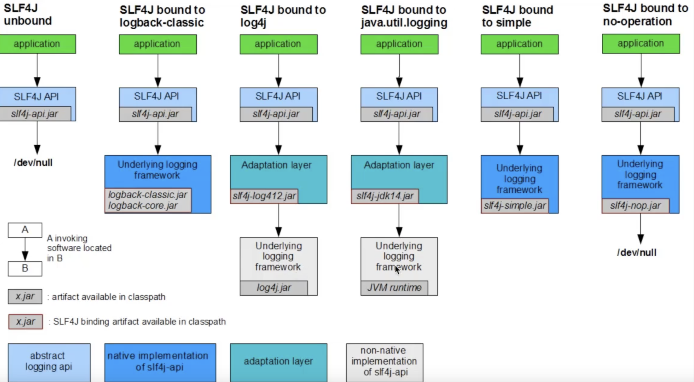
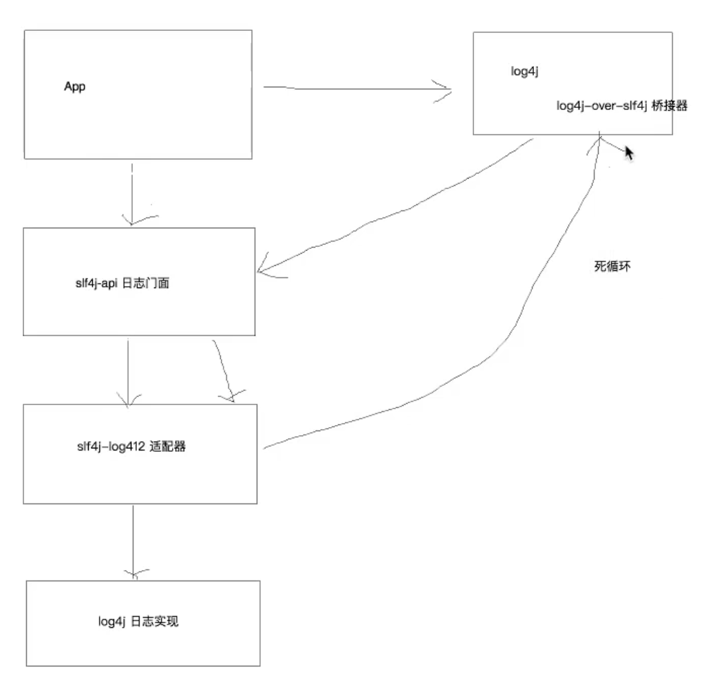
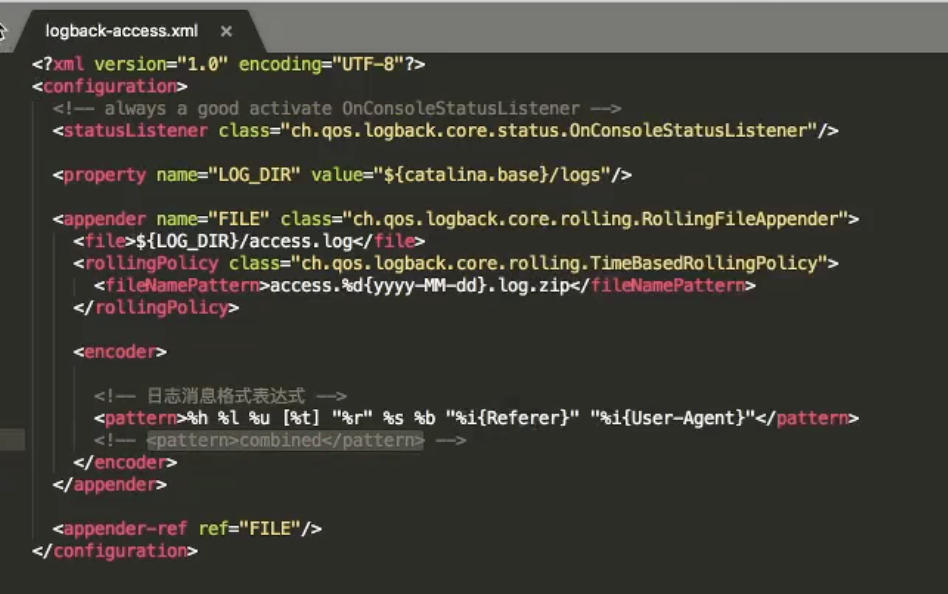
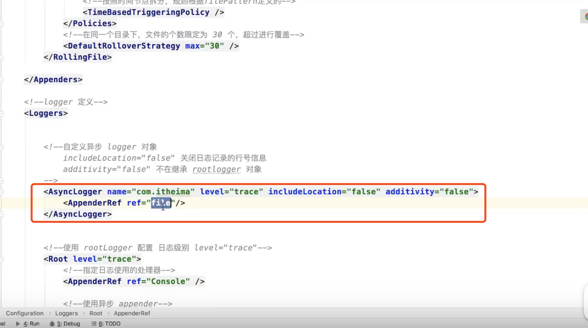
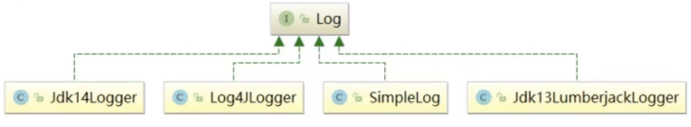
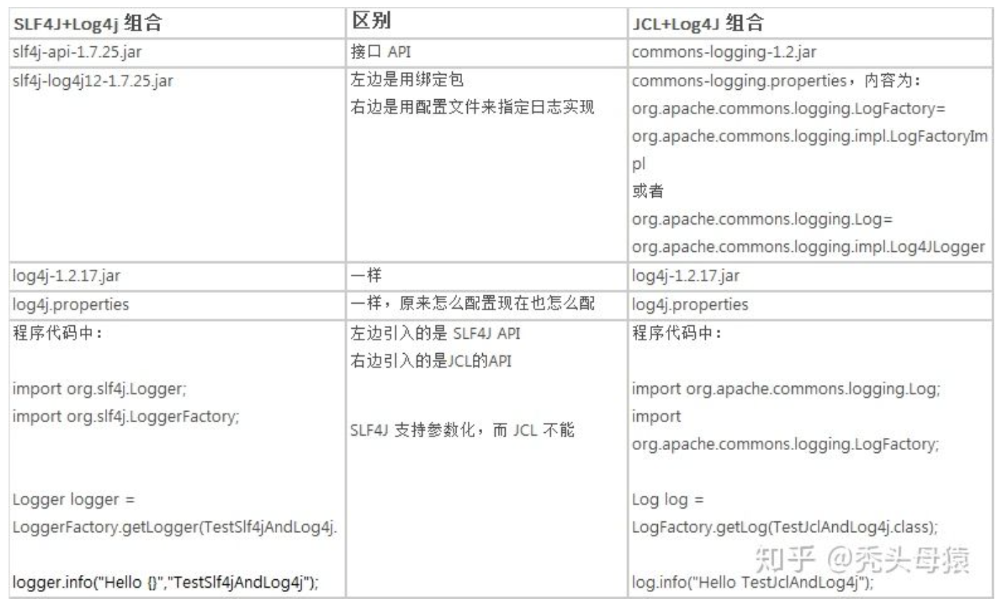
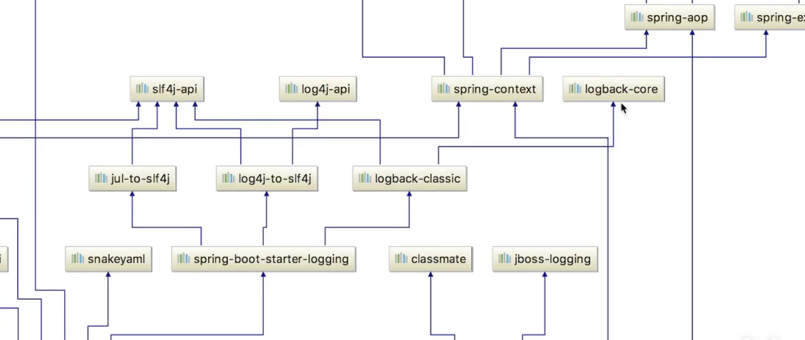
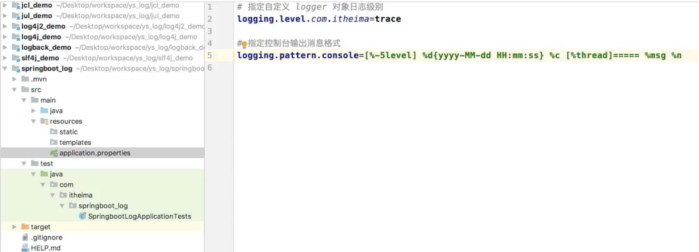
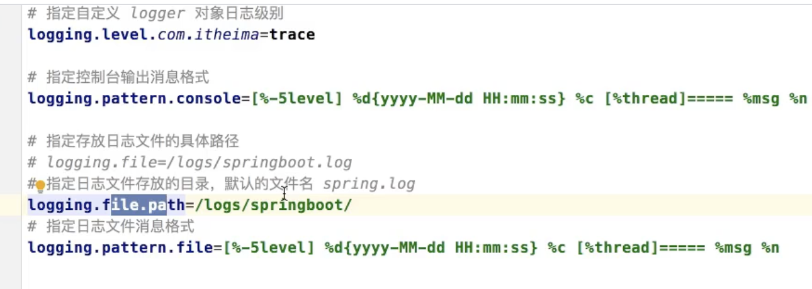

# 背景

日志出现的顺序：

log4j -> JUL -> JCL -> slf4j -> logback -> log4j2

# 基本概念

## 日志接口

java common logging

SLF4J(Simple Logging Facade for Java)

## 日志实现

log4j

java.util.logging

simplelog

LogBack

log4j2



图片来自官网 [http://slf4j.org/manual.html](http://slf4j.org/manual.html)

# jar包简介

```xml
<!-- slf4j 日志门面 -->
<dependency>
    <groupId>org.slf4j</groupId>
    <artifactId>slf4j-api</artifactId>
    <version>1.7.26</version>
</dependency>

<!-- slf4j 内置的简单实现 -->
<dependency>
    <groupId>org.slf4j</groupId>
    <artifactId>slf4j-simple</artifactId>
    <version>1.7.21</version>
</dependency>

<!-- junit 单元测试 -->
<dependency>
    <groupId>junit</groupId>
    <artifactId>junit</artifactId>
    <version>4.12</version>
</dependency>

<!-- logback 日志实现 -->
<dependency>
    <groupId>ch.qos.logback</groupId>
    <artifactId>logback-classic</artifactId>
    <version>1.2.3</version>
</dependency>

<!-- nop 日志开关 -->
<dependency>
    <groupId>org.slf4j</groupId>
    <artifactId>slf4j-nop</artifactId>
    <version>1.7.25</version>
</dependency>

<!-- 绑定 log4j 日志实现，需要导入适配器 -->
<dependency>
    <groupId>org.slf4j</groupId>
    <artifactId>slf4j-log4j12</artifactId>
    <version>1.7.12</version>
</dependency>
<dependency>
    <groupId>log4j</groupId>
    <artifactId>log4j</artifactId>
    <version>1.2.17</version>
</dependency>

<!-- 绑定 jul 日志实现，需要导入适配器 -->
<dependency>
    <groupId>org.slf4j</groupId>
    <artifactId>slf4j-jdk14</artifactId>
    <version>1.7.25</version>
</dependency>

<!-- 配置 log4j 的桥接器  -->
<dependency>
    <groupId>org.slf4j</groupId>
    <artifactId>log4j-over-slf4j</artifactId>
    <version>1.7.25</version>
</dependency>
```
注意：如果slf4j绑定了多个实现日志，默认使用第一个
## 桥接器

初期代码中使用的是具体日志实现如log4j或者jcl，后期想修改成slf4j+xx，那么无需修改代码，使用桥接器即可做到

**使用桥接器注意问题**

1、jcl-over-sIf4j.jar和slf4j-jcl.jar不能同时部署。前一个jar文件将导致JCL将日志系统的选择始托给SLF4J,后一个jar文件将导致SLF4J将日志系统的选择委托给JCL,从而导致无益循环。

2、log4j-overI-slf4j.jar（桥接器）和sif4j-log4j12.jar（适配器）不能同时出现。（死循环）

3、jul-to-sIf4j.jar（桥接器）和sIf4j-jdk14.jar（适配器）不能同时出现

4、所有的桥接器都只对Logger日志记录器对象有效，如果程序中调用了内部的配置类或者是Appender，Filter等对象，将无法产生效果。

其中2、3点死循环原因如下图：（报错：栈内存溢出StackOverflowError！！）



# 

# SLF4J

## slf4j中适配器原理


## 使用slf4j的日志绑定流程：

1、添加sIf4j-api的依赖

2、使用sIf4j的API在项目中进行统一的日志记录

3、绑定具体的日志实现框架

3.1 绑定已经实现了sIf4j的日志框架,直接添加对应依赖

3.2 绑定没有实现slf4j的日志框架,先添加日志的适配器,再添加实现类的依赖

4、sIf4j有且仅有一个日志实现框架的绑定(如果出现多个默认使用第一个依赖日志实现)

slf4j自动绑定实现类的方式基于约定：它要求你在实现类的包名和拿到LoggerFactory实例的文件路径必须是：org/slf4j/impl/StaticLoggerBinder.class


# LogBack

## logback入门

Logback 主要由三个模块组成：

* logback-core：其它两个模块的基础模块
* logback-classic：log4j的一个改良版本，同时完整实现了slf4j API
* logback-access：访问模块与Servlet容器集成提供通过Http来访问日志的功能
其中 logback-core 提供了 LogBack 的核心功能，是另外两个组件的基础。logback-classic 的地位和作用等同于 Log4J，它也被认为是 Log4J 的一个改进版，并且它实现了简单日志门面 SLF4J，所以当想配合 SLF4J 使用时，需要将 logback-classic 加入 classpath；而 logback-access 主要作为一个与 Servlet 容器交互的模块，比如说 tomcat 或者 jetty，提供一些与 HTTP 访问相关的功能。

## logback配置

logback会一次读取以下类型配置文件：

* logback.groovy
* logback-test.xml
* logback.xml
如果均不存在会采用默认配置

### **1、logback组件之间的关系**

1.1 Logger：日志的记录器，把它关联到到应用的对应的context上后，主要用于存放日志对象，也可以定义日志类型、级别

1.2 Appender：用于指定日志输出的目的地，目的地可以是控制台、文件、数据库的等等。

1.3 Layout：负责把时间转换成字符串，格式化的日志信息的输出。在logback中Layout对象被封装在encoder中。

### 2、FileAppender

```xml
<?xml version="1.0" encoding="UTF-8">
  <!--
  日志输出格式：
  %-5level
  %d{yyyy-MM-dd HH:mm:ss.SSS}日期
  %c类的完整名称
  %M为method
  %L为行号
  %thread线程名称
  %m或者%msg为信息
  %n换行 
  -->
  <property name="pattern" value="[%-5level] %d{yyyy-MM-dd HH:mm:ss.SSS} %c %M %L [%thread] %m%n"></property>
  
  <!-- 定义日志文件保存路径信息 -->
  <property name="log_dir" value="/logs"></property>
  
  <!-- 控制台日志输出的 appender -->
  <appender name="console" class="ch.qos.logback.core.ConsoleAppender">
    <!-- 控制器输出流对象 默认 System.out 改为 System.err -->
    <target>System.err</target>
    <!-- 日志消息格式配置 -->
    <encoder class="ch.qos.logback.classic.encoder.PatternLayoutEncoder">
      <pattern>${pattern}</pattern>
    </encoder>
  </appender>
  
  <!-- 日志文件输出的 appender -->
  <appender name="file" class="ch.qos.logback.core.FileAppender">
    <!-- 日志文件保存信息 -->
    <file>${log_dir}/logback.log</file>
    <!-- 日志消息格式配置 -->
    <encoder class="ch.qos.logback.classic.encoder.PatternLayoutEncoder">
      <pattern>${pattern}</pattern>
    </encoder>
  </appender>
  
  <!-- 日志文件输出的 appender -->
  <appender name="htmlFile" class="ch.qos.logback.core.FileAppender">
      <!-- 日志文件保存信息 -->
      <file>${log_dir}/logback.html</file>
        <!-- html 消息格式配置 -->
      <encoder class="ch.qos.logback.classic.encoder.LayoutWrappingEncoder">
        <layout class="ch.qos.logback.classic.html.HTMLLayout">
          <pattern>%-5level%d{yyyy-MM-dd HH:mm:ss.SSS}%c%M%L%thread %m</pattern>
        </layout>
      </encoder>
   </appender>
    
   <!-- 日志拆分和归档压缩的 appender 对象-->
   <appender name="rollFile" class="ch.qos.logback.core.rollling.RollingFileAppender">
     <!-- 日志文件保存信息 -->
     <file>${log_dir}/roll_logback.log</file>
     <!-- 日志消息格式配置 -->
     <encoder class="ch.qos.logback.classic.encoder.PatternLayoutEncoder">
      <pattern>${pattern}</pattern>
     </encoder>
     <!-- 指定拆分规则 可查看源码 -->
     <rollingPolicy class="ch.qos.logback.core.rolling.SizeAndTimeBasedRollingPolicy">
        <!-- 按时间和压缩格式声明拆分的文件名 -->
        <fileNamePattern>${log_dir}/rolling.%d{yyyy-MM-dd-HH-mm-ss}.log%i.gz</fileNamePattern>
        <maxFileSize>1MB<maxFileSize>
      </rollingPolicy>
      <!-- 日志级别过滤器 -->
      <filter class="ch.qos.logback.classc.filter.LevelFilter">
        <!-- 日志过滤规则 -->
        <level>ERROR</level>
        <onMatch>ACCEPT</onMatch>
        <onMismatch>DENY</onMismatch>
      </filter>
   </appender>
   
   <!-- 异步日志 -->
   <appender name="async" class="ch.qos.logback.classic.AsyncAppender">
     <!-- 指定某个具体的 appender -->
     <appender-ref ref="rollFile"/>
   </appender>
   
   <!-- root logger 配置-->
   <root level="ALL">
     <appender-ref ref="console"></appender-ref>
     <appender-ref ref="file"></appender-ref>
   </root>
   
   <!-- 自定义 logger对象 
       additivity="false" 自定义 logger 对象是否继承 rootLogger -->
   <logger name="com.iteima" level="info" additivity="false">
     <appender-ref ref="console"/>
   </logger>
</configuration>
```
### 3、logback-access的使用

logback-access模块与Servlet容器（如Tomcat和Jetty）集成，以提供HTTP访问日志功能。我们可以使用logback-access模块来替换tomcat的访问日志

1）将logback-access.jar与logback-core.jar复制到%TOMCAT_HOME/lib/目录下

2）修改$TOMCAT_HOME/conf/server.xml中的Host元素中添加：

```xml
<Value className="ch.qos.logback.access.tomcat.LogbackValue" />
```
3）logback默认会在$TOMCAT_HOME/conf下查找文件logback-access.xml



## logback使用步骤

1、jar包

```xml
<dependency>
                <groupId>org.slf4j</groupId>
                <artifactId>slf4j-api</artifactId>
                <version>1.7.25</version>
            </dependency>

            <dependency>
                <groupId>ch.qos.logback</groupId>
                <artifactId>logback-core</artifactId>
                <version>1.2.3</version>
            </dependency>

            <dependency>
                <groupId>ch.qos.logback</groupId>
                <artifactId>logback-classic</artifactId>
                <version>1.2.3</version>
            </dependency>

            <dependency>
                <groupId>ch.qos.logback</groupId>
                <artifactId>logback-access</artifactId>
                <version>1.2.3</version>
            </dependency>
```
 2、logback.xml
在 src 根目录下建立 logback.xml

```xml
<?xml version="1.0" encoding="UTF-8"?>
    <!--日志级别以及优先级排序: OFF > FATAL > ERROR > WARN > INFO > DEBUG > TRACE > ALL -->
    <!-- status用来指定log4j本身的打印日志的级别 -->
    <!--monitorInterval：Log4j能够自动检测修改配置文件和重新配置本身，设置间隔秒数 -->
    <configuration status="WARN" monitorInterval="30">
        <!--先定义所有的appender -->
        <appenders>
            <!--这个输出控制台的配置 -->
            <console name="Console" target="SYSTEM_OUT">
                <!--输出日志的格式 -->
                <PatternLayout
                    pattern="[%d{yyyy-MM-dd HH:mm:ss.SSS}] [%-5level] %l %logger{36} - %msg%n" />
            </console>

            <!--定义输出到指定位置的文件 -->
            <File name="log" fileName="/jpm/log4j2/logs/log.log" append="true">
                <PatternLayout
                    pattern="[%d{yyyy-MM-dd HH:mm:ss.SSS}] [%-5level] %l %logger{36} - %msg%n" />
            </File>

            <!-- 这个会打印出所有的info及以下级别的信息，每次大小超过size，则这size大小的日志会自动存入按年份-月份建立的文件夹下面并进行压缩，作为存档 -->
            <RollingFile name="RollingFileInfo" fileName="/jpm/log4j2/logs/info.log"
                filePattern="/jpm/log4j2/logs/$${date:yyyy-MM}/info-%d{yyyy-MM-dd}-%i.log">
                <!--控制台只输出level及以上级别的信息（onMatch），其他的直接拒绝（onMismatch） -->
                <!-- DENY，日志将立即被抛弃不再经过其他过滤器； NEUTRAL，有序列表里的下个过滤器过接着处理日志； ACCEPT，日志会被立即处理，不再经过剩余过滤器。 -->
                <ThresholdFilter level="error" onMatch="DENY"
                    onMismatch="ACCEPT" />
                <PatternLayout
                    pattern="[%d{yyyy-MM-dd HH:mm:ss.SSS}] [%-5level] %l %logger{36} - %msg%n" />
                <Policies>
                    <TimeBasedTriggeringPolicy />
                    <SizeBasedTriggeringPolicy size="100 MB" />
                </Policies>
                <!-- DefaultRolloverStrategy属性如不设置，则默认为最多同一文件夹下7个文件，这里设置了30 -->
                <DefaultRolloverStrategy max="30" />
            </RollingFile>

            <RollingFile name="RollingFileError" fileName="/jpm/log4j2/logs/error.log"
                filePattern="/jpm/log4j2/logs/$${date:yyyy-MM}/error-%d{yyyy-MM-dd}-%i.log">
                <ThresholdFilter level="ERROR" onMatch="ACCEPT"
                    onMismatch="DENY" />
                <PatternLayout
                    pattern="[%d{yyyy-MM-dd HH:mm:ss.SSS}] [%-5level] %l %logger{36} - %msg%n" />
                <Policies>
                    <TimeBasedTriggeringPolicy />
                    <SizeBasedTriggeringPolicy size="100 MB" />
                </Policies>
            </RollingFile>
        </appenders>

        <!--只有定义了logger并引入的appender，appender才会生效 -->
        <loggers>
            <!--过滤掉spring和mybatis的一些无用的DEBUG信息 -->
            <logger name="org.springframework" level="INFO"></logger>
            <logger name="org.mybatis" level="INFO"></logger>
            <root level="INFO">
                <appender-ref ref="Console" />
                <appender-ref ref="log" />
                <appender-ref ref="RollingFileInfo" />
                <appender-ref ref="RollingFileError" />
            </root>
        </loggers>
    </configuration>
```
3、输出日志代码
```java
    import org.slf4j.Logger;
    import org.slf4j.LoggerFactory;
    public class TestLogback {
        public static void main(String[] args) {
            final Logger LOGGER = LoggerFactory.getLogger(TestLogback.class);
            LOGGER.debug("print debug log.");
            LOGGER.info("print info log.");
            LOGGER.error("print error log.");
        }
    }
```
# Log4j

## log4使用步骤

### 1、jar包

```xml
<!-- slf4j 日志门面 -->
<dependency>
    <groupId>org.slf4j</groupId>
    <artifactId>slf4j-api</artifactId>
    <version>1.7.26</version>
</dependency>

<!-- log4j, 与log4j2不要共存 -->
<!-- 绑定 log4j 日志实现，需要导入适配器 -->
<dependency>
    <groupId>org.slf4j</groupId>
    <artifactId>slf4j-log4j12</artifactId>
    <version>1.7.12</version>
</dependency>
<dependency>
    <groupId>log4j</groupId>
    <artifactId>log4j</artifactId>
    <version>1.2.17</version>
</dependency>
```
### 2、log4j.properties

```xml
#log4j.appender.CONSOLE = org.apache.log4j.ConsoleAppender
#log4j.appender.Threshold = DEBUG
#log4j.appender.CONSOLE.Target = System.out
#log4j.appender.CONSOLE.layout = org.apache.log4j.PatternLayout
#log4j.appender.CONSOLE.layout.ConversionPattern = [framework] % d - % c -%- 4r [ % t] %- 5p % c % x - % m % n
#
##log4j.appender.CONSOLE.layout.ConversionPattern = [start] % d {DATE} [DATE] % n % p[PRIORITY] % n % x[NDC] % n % t[THREAD] n % c[CATEGORY] % n % m[MESSAGE] % n % n

log4j.rootLogger=INFO, stdout, D
# Console Appender
log4j.appender.stdout=org.apache.log4j.ConsoleAppender
log4j.appender.stdout.layout=org.apache.log4j.PatternLayout
log4j.appender.stdout.layout.ConversionPattern= %d{hh:mm:ss,SSS} [%t] %-5p %c %x - %m%n
# Custom tweaks
log4j.logger.com.codahale.metrics=WARN
log4j.logger.com.ryantenney=WARN
log4j.logger.com.zaxxer=WARN
log4j.logger.org.apache=WARN
log4j.logger.org.hibernate=WARN
log4j.logger.org.hibernate.engine.internal=WARN
log4j.logger.org.hibernate.validator=WARN
log4j.logger.org.springframework=WARN
log4j.logger.org.springframework.web=WARN
log4j.logger.org.springframework.security=WARN
# log file
log4j.appender.D = org.apache.log4j.DailyRollingFileAppender
log4j.appender.D.File = /Users/bo/code/JavaDemo/log.log
log4j.appender.D.Append = true
log4j.appender.D.Threshold = DEBUG 
log4j.appender.D.layout = org.apache.log4j.PatternLayout
log4j.appender.D.layout.ConversionPattern = %-d{yyyy-MM-dd HH:mm:ss}  [ %t:%r ] - [ %p ]  %m%n
```


# Log4j2

ApacheLog4j2是对Log4j的升级版,参考了logback的一些优秀的设计,并且修复了一些问题,因此带来了一些重大的提升,主要有:

1、异常处理 ：在logback中,Appender中的异常不会被应用感知到,但是在log84j2中,提供了一些异常处理机制。

2、性能提升：log4j2相较于log4j和logback都具有很明显的性能提升,后面会有官方测试的数据。

3、自动重载配置：参考了logback的设计,当然会提供自动刷新参数配置,最实用的就是我们在生产上可以动态的修改日志的级别而不需要重启应用。

4、无垃圾机制：log4j2在大部分情况下,都可以使用其设计的一套无垃圾机制,避免频繁的日志收集导致的jvm gc。

## **日志实现方式**

Log4j2提供了两种实现日志的方式,一个是通过AsyncAppender（一般性能低不使用），一个是通过AsyncLogger，分别对应我们说的Appender组件和Logger组件。

注意：配置异步日志需要添加依赖

```xml
<!-- 异步日志依赖 -->
<dependency>
  <groupId>com.1max</gzoupId>
  <artifactId>disruptor</artifactId>
  <version>3.3.4</version>
</dependency>
```
### AsyncAppender方式

```xml
<?xml version="1.0" encoding="UTF-8"?>
<Configurationstatus="warn">
  <properties>
    <propertyname="LOG_HOME">D:/logs</property>
  </properties>
  <Appenders>
    <File name="file" fileName="${LOGHOME}/myfile.log">
      <PatternLayout>
        <Pattern>%d %p %c{1.} {%t} %m%n</Pattern>
      </PatternLayout>
    </File>
    <!-- 异步日志 AsyncAppender -->
    <Async name="Async">
      <AppenderRef ref="file"/>
    </Async>
  </Appenders>
  <Loggers>
    <Root level="error">
      <AppenderRef ref="Async"/>
    </Root>
  </Loggers>
</Configuration>
```

### AsyncLogger方式

AsyncLogger才是log4j2的重头戏,也是官方推荐的异步方式。它可以使得调用Logger.log返回的更快。你可以有两种选择:全局异步和混合异步。

全局异步

所有的日志都异步的记录,在配置文件上不用做任何改动,只需要添加个log4j2.component.properties配置（Resources路径下）;

```xml
Log4jContextSelector=org.apache.1ogging.1og4j.core.async.AsyncLoggerContextSelector
```

混合异步

可以在应用中同时使用同步日志和异步日志,这使得日志的配置方式更加灵活。

```xml
<?xmlversion="1.0"encoding="UTF-8"?>
<Configurationstatus="WARN">
  <properties>
    <propertyname="LOG_HOME">D:/logs</property>
  </properties>
  <Appenders>
    <File name="file" fileName="${LOG_HOME}/myfile.log">
      <PatternLayout>
        <Pattern>%d%p%c{1.}[%t]%m$n</Pattern>
      </PatternLayout>
    </File>
  <Async name="Async">
    <AppenderRef ref="file"/>
  </Async>
</Appenders>
<Loggers>
  <!-- 自定义异步logger日志 -->
  <AsyncLogger name="com.itheima"level="trace" additivity="false">
    <AppenderRef ref="file"/>
  </AsyncLogger>
  <Root level=“info" includeLocation="true">
    <AppenderRef ref="file"/>
  </Root>
</Loggers>
</Configuration>
```



使用异步日志需要注意的问题:

1、如果使用异步日志,AsyncAppender、AsyncLogger和全局目志,不要同时出现。性能会和

AsyncAppend一致，降至最低。（木桶原理）

2、设置includeLocation=false，否则打印位置信息会急剧降低异步日志的性能,比同步日志还要慢。

**无垃圾记录**

垃圾收集暂停是延迟峰值的常见原因,并且对于许多系统而言,花费大量精力来控制这些暂停。

许多日志库（包括以前版本的Log4j）在稳态日志记录期间分配临时对象,如日志事件对象,字符串,字符数组,字节数组等。这会对垃圾收集器造成压力并增加GC暂停发生的频率。

从版本2.6开始,默认情况下Log4j以“无垃圾“模式运行,其中重用对象和缓冲区,平且尽可能不分配临时对象。还有一个“低垃圾“模式,它不是完全无垃圾,但不使用ThreadLocal字段。

Log4j 2.6中的无垃圾日志记录部分通过重用ThreadLoca|字段中的对象来实现,部分通过在将文本转换为字节时重用缓冲区来实现。

有两个单独的系统厘性可用于手动控制Log4j用于邀免创建临时对象的机制:

* log4j2.enableThreadlocals - 如果"true"(非Web应用程序的默认值)对象存储ThreadLocal字段中并重新使用,否则将为每个日志事件创建新对象。
* log4j2.enablepirectEncoders - 如果将"true"(默认)日志事件转换为文本,则将此文本转换为字节而不创建临时对象。注意:由于共享缓冲区上的同步,在此模式下多线程应用程序的同步日志记录性能可能更差。如果您的应用程序是多线程的并且日志记录性能很重要,请考虑使用异步记录器。

## log4j2使用步骤

### 1、jar包

```xml
<!-- slf4j 日志门面 -->
<dependency>
    <groupId>org.slf4j</groupId>
    <artifactId>slf4j-api</artifactId>
    <version>1.7.26</version>
</dependency>

<!-- log4j2, 与log4j不要共存 -->
<!-- 用于与slf4j保持桥接 -->
<dependency>
    <groupId>org.apache.logging.log4j</groupId>
    <artifactId>log4j-slf4j-impl</artifactId>
    <version>2.8.2</version>
</dependency>
<!-- log4j2核心包，注意路径与log4j不同 -->
<dependency>
    <groupId>org.apache.logging.log4j</groupId>
    <artifactId>log4j-api</artifactId>
    <version>2.8.2</version>
</dependency>
<dependency>
    <groupId>org.apache.logging.log4j</groupId>
    <artifactId>log4j-core</artifactId>
    <version>2.8.2</version>
</dependency>
```
### 2、log2j 配置文件：log4j2.xml

```xml
<?xml version="1.0" encoding="UTF-8"?>
    <!--日志级别以及优先级排序: OFF > FATAL > ERROR > WARN > INFO > DEBUG > TRACE > ALL -->
    <!-- status用来指定Log4j本身的打印日志的级别 -->
    <!--monitorInterval：Log4j能够自动检测修改配置文件和重新配置本身，设置间隔秒数 -->
    <configuration status="WARN" monitorInterval="30">
        <!--先定义所有的appender -->
        <appenders>
            <!--这个输出控制台的配置 -->
            <console name="Console" target="SYSTEM_OUT">
                <!--输出日志的格式 -->
                <PatternLayout
                    pattern="[%d{yyyy-MM-dd HH:mm:ss.SSS}] [%-4level] %l %logger{36} - %msg%n" />
            </console>
            <!-- <Console name="STDOUT" target="SYSTEM_OUT">
              <PatternLayout pattern="%d %-5p [%t] %C{2} (%F:%L) - %m%n"/>
            </Console> -->
            <!--定义输出到指定位置的文件 -->
            <File name="log" fileName="/jpm/log4j2/logs/log.log" append="true">
                <PatternLayout
                    pattern="[%d{yyyy-MM-dd HH:mm:ss.SSS}] [%-5level] %l %logger{36} - %msg%n" />
            </File>
            <!-- 这个会打印出所有的info及以下级别的信息，每次大小超过size，则这size大小的日志会自动存入按年份-月份建立的文件夹下面并进行压缩，作为存档 -->
            <RollingFile name="RollingFileInfo" fileName="/jpm/log4j2/logs/info.log"
                filePattern="/jpm/log4j2/logs/$${date:yyyy-MM}/info-%d{yyyy-MM-dd}-%i.log">
                <!--控制台只输出level及以上级别的信息（onMatch），其他的直接拒绝（onMismatch） -->
                <ThresholdFilter level="info" onMatch="ACCEPT"
                    onMismatch="DENY" />
                <PatternLayout
                    pattern="[%d{yyyy-MM-dd HH:mm:ss.SSS}] [%-5level] %l %logger{36} - %msg%n" />
                <Policies>
                    <TimeBasedTriggeringPolicy />
                    <SizeBasedTriggeringPolicy size="100 MB" />
                </Policies>
                <!-- DefaultRolloverStrategy属性如不设置，则默认为最多同一文件夹下7个文件，这里设置了30 -->
                <DefaultRolloverStrategy max="30" />
            </RollingFile>
            <RollingFile name="RollingFileError" fileName="/jpm/log4j2/logs/error.log"
                filePattern="/jpm/log4j2/logs/$${date:yyyy-MM}/error-%d{yyyy-MM-dd}-%i.log">
                <ThresholdFilter level="error" onMatch="ACCEPT"
                    onMismatch="DENY" />
                <PatternLayout
                    pattern="[%d{yyyy-MM-dd HH:mm:ss.SSS}] [%-5level] %l %logger{36} - %msg%n" />
                <Policies>
                    <TimeBasedTriggeringPolicy />
                    <SizeBasedTriggeringPolicy size="100 MB" />
                </Policies>
            </RollingFile>
        </appenders>
        <!--只有定义了logger并引入的appender，appender才会生效 -->
        <Loggers>
            <!--过滤掉spring和mybatis的一些无用的DEBUG信息 -->
            <logger name="org.springframework" level="INFO"></logger>
            <logger name="org.mybatis" level="INFO"></logger>
            <root level="INFO">
                <appender-ref ref="Console" />
                <appender-ref ref="log" />
                <appender-ref ref="RollingFileInfo" />
                <appender-ref ref="RollingFileError" />
            </root>
        </Loggers>
    </configuration>
```
### 3、输出日志代码

```java
import org.apache.logging.log4j.LogManager;
    import org.apache.logging.log4j.Logger;
    public class TestLog4j2 {
        public static void main(String[] args) {
            final Logger LOGGER = LogManager.getLogger(LogManager.ROOT_LOGGER_NAME);
            LOGGER.debug("TestLog4j2 debug log.");
            LOGGER.info("TestLog4j2 info log.");
            LOGGER.error("TestLog4j2 error log.");
        }
    }
```

# 对比

## 核心jar包

log4j只需要引用一个包 log4j.log4j

log4j2需要2个核心包：org.apache.logging.log4j.log4j-api 和 org.apache.logging.log4j.log4j-core，并且路径不同

## logger调用

```java
import lombok.extern.slf4j.Slf4j;
@Slf4j
public class Log4JDemo {
    public static void main(String[] args) {
        String name = "${java:os}";
        // @Slf4j
        log.info(name);
        // slf4j LoggerFactory
        final org.slf4j.Logger LOGGER = org.slf4j.LoggerFactory.getLogger(Log4JDemo.class);
        LOGGER.info(name);
        // log4j Logger
        final org.apache.log4j.Logger LOGGER1 = org.apache.log4j.Logger.getLogger(Log4JDemo.class);
        LOGGER1.info(name);
        // log4j2 LogManager
        final org.apache.logging.log4j.Logger LOGGER2 = org.apache.logging.log4j.LogManager.getLogger(Log4JDemo.class);
        LOGGER2.info(name);
    }
}
```
# JCL

## 1、动态加载

通过LogFactory动态加载Log实现类



## 2、支持日志

日志门面支持的日志实现数组

```java
private static final String[] classesToDiscover = 
  new String[]{"org.apache.commons.logging.impl.Log4JLogger",
              "org.apache.commons.logging.impl.Jdk14Logger",
              "org.apache.commons.logging.impl.Jdk13LumberjackLogger",
              "org.apache.commons.logging.impl.SimpleLog"}
```
缺陷：只考虑了主流的日志框架
## 3、日志实现

获取具体的日志实现

```java
for(int i = 0; i<classesToDiscover.length && result == null; ++i) {
  result = this.createLogFromClass(classesToDiscover[i], logCategory, true);
}
```
## JCL(java common logging)+Log4j 

1、jar包

```xml
<dependency>
                <groupId>commons-logging</groupId>
                <artifactId>commons-logging</artifactId>
                <version>1.2</version>
            </dependency>
            <dependency>
                <groupId>log4j</groupId>
                <artifactId>log4j</artifactId>
                <version>1.2.17</version>
            </dependency>
```
2、配置 common-logging.properties 文件
只需要一行即可，放在 classpath 下，如果是 Maven 中就在 src/resources 下，不过如果没有 common-logging.properties 文件，但是 src 下有 log4j.properties 配置也可以正常的输出 Log4j 设置的日志。

```xml
org.apache.commons.logging.Log=org.apache.commons.logging.impl.Log4JLogger
```
3、配置log4j.properties
略

4、输出日志代码

```java
package jpm.jcllog4j;
    import org.apache.commons.logging.Log;
    import org.apache.commons.logging.LogFactory;
    public class TestJclAndLog4j {
        public static void main(String[] args) {
            final Log LOGGER = LogFactory.getLog(TestJclAndLog4j.class);
            LOGGER.debug("TestJclAndLog4j debug log.");
            LOGGER.info("TestJclAndLog4j info log.");
            LOGGER.error("TestJclAndLog4j error log.");
        }
    }
```
## JCL与SLF4J比较



# Spring boot日志

## 1、日志结构



总结:

1、springboot底层默认使用logback作为日志实现。

2、ERTSLEDBIE

3、将JUL也转换成sIf4j

4、也可以使用log4j2作为日志门面,但是最终也是通过sIf4j调用logback

## 2、消息格式

指定控制台输出消息格式





## 3、指定配置

给类路径下放上每个日志框架自己的配置文件;SpringBoot就不使用默认配置的了

|日志框架|配置文件|
|:----|:----|
|Logback|logback-spring.xml|
|Log4j2|log4j2-spring.xml,log4j2.xml|
|JUL|logging.properties|

>logbackxml:直接就被日志框架识别了

## 4、解析日志配置

使用SpringBoot解析日志配置

logback-spring.xml:由SpringBoot解析日志配置

```xml
<encoderclass=“ch.qdos.Logback.classic.encoder.PatternLayoutEncoder“>
  <springProfile name="dev">
    <pattern>${pattern}</pattern>
  </springProfile>t
  <springProfile name="pro">
    <pattern>$d{yyyyMMdd:HH:mm:ss.SSS}[%thread]%-Slevel%msgtn</pattern>
  </springProfile>
</encoder>
```
application.properties
```xml
spring.profiles.active=dev
```
另参考：springboot不同环境日志：[https://springboot.io/t/topic/757](https://springboot.io/t/topic/757)
```shell
java -jar xxx.jar --spring.profiles.active=test
```

## 5、日志切换为log4j2

```xml
<dependency>
  <groupId>org.springframework.boot</groupId>
  <artifactId>spring-boot-starter-web</artifactId>
  <exclusions>
    <!-- 排除Logback -->
    <exclusion>
      <artifactId>spring-boot-starter-logging</artifactId>
      <groupId>org.springframework.boot</groupId>
    </exclusion>
  </exclusions>
</dependency>
<!--添加log4j2-->
<dependency>
  <groupId>org.springframework.boot</groupId>
  <artifactId>spring-boot-starter-log4j2</artifactId>
</dependency>
```


# Reference

[Java日志从入门到实践](https://zhuanlan.zhihu.com/p/64353891)

[slf4j中的桥接器是如何运作的](https://cloud.tencent.com/developer/article/1754967)

[Java日志框架-Slf4j](https://developer.aliyun.com/article/600529)

[slf4j + log4j原理实现及源码分析](https://my.oschina.net/xianggao/blog/519199)

[从零实现一个日志框架（带源码）](https://mp.weixin.qq.com/s/q8np4mj_ojpC7OZl5z-aNA)

[slf自己主动绑定实现类过程推断 ](https://blog.csdn.net/weixin_30642869/article/details/98631187)

[不同jar包相同同名类--Classloader.getResource--slf4j原理](https://blog.csdn.net/c5113620/article/details/78912084)

[浅谈在JAR中同名类冲突问题](https://blog.csdn.net/holy_cat/article/details/81409171)

[SLF4J--自动绑定实现类原理（源码）](https://blog.csdn.net/szzt_lingpeng/article/details/81353639)

[判断项目中是否有slf4j的实现类](https://www.cnblogs.com/adeng/p/7026162.html)
