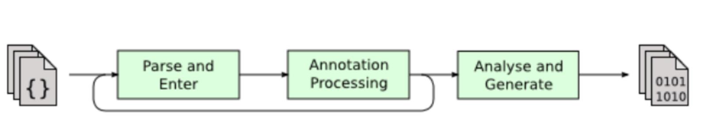
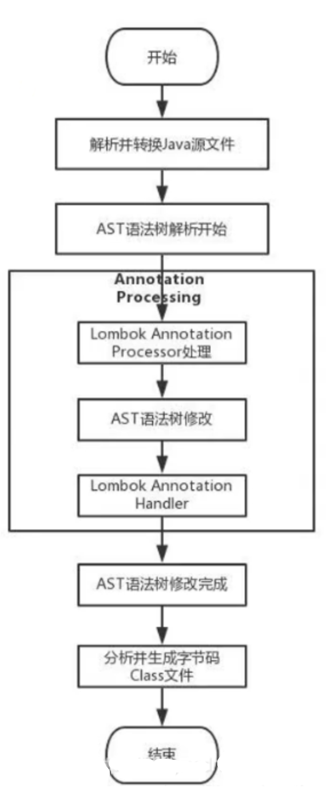

# 概述

lombok官网：[https://projectlombok.org](https://projectlombok.org)

# 使用

1、IDE安装lombok插件

2、项目引入依赖

```xml
<dependency>
  <groupId>org.projectlombok</groupId>
  <artifactId>lombok</artifactId>
  <version>1.16.20</version>
  <scope>provided</scope>
</dependency>
```

# 功能

## @Data

注解在类上，相当于同时使用了@ToString、@EqualsAndHashCode、@Getter、@Setter和@RequiredArgsConstrutor这些注解，对于POJO类十分有用

## @Value

用在类上，是@Data的不可变形式，相当于为属性添加final声明，只提供getter方法，而不提供setter方法

## @Builder

用在类、构造器、方法上，为你提供复杂的builder APIs，让你可以像如下方式一样调用Person.builder().name("Adam Savage").city("San Francisco").job("Mythbusters").job("Unchained Reaction").build();更多说明参考[Builder](https://projectlombok.org/features/Builder)

## @Log

根据不同的注解生成不同类型的log对象，但是实例名称都是log，有六种可选实现类

## @Slf4j

自动引入log对象

## @Getter/@Setter

用在属性上，再也不用自己手写setter和getter方法了，还可以指定访问范围

## @NonNull

给方法参数增加这个注解会自动在方法内对该参数进行是否为空的校验，如果为空，则抛出NPE（NullPointerException）

## @Cleanup

自动管理资源，用在局部变量之前，在当前变量范围内即将执行完毕退出之前会自动清理资源，自动生成try-finally这样的代码来关闭流

# 原理

## java注解

从JDK5开始,Java增加对元数据（描述数据属性的信息）的支持，也就是注解，可以把注解理解为代码里的特殊标记，这些标记可以在编译，类加载，运行时被读取，并执行相应的处理。通过注解开发人员可以在不改变原有代码和逻辑的情况下在源代码中嵌入补充信息。

## 注解解析方式

JDK5引入了注解的同时，也提供了两种解析方式。

1、运行时解析

2、编译时解析

### 运行时解析

运行时能够解析的注解，必须将@Retention设置为RUNTIME，这样就可以通过反射拿到该注解。java.lang,reflect反射包中提供了一个接口AnnotatedElement，该接口定义了获取注解信息的几个方法，Class、Constructor、Field、Method、Package等.

### 编译时解析

编译时解析有两种机制：

1、Annotation Processing Tool

2、Pluggable Annotation Processing API：插入式注解处理器

APT自JDK5产生，JDK7已标记为过期，不推荐使用，JDK8中已彻底删除。新的解析机制为 [JSR 269规范](https://www.jcp.org/en/jsr/detail?id=269)（可插拔批注处理API）。

在JAVA 1.6后，JDK提供了一种方式，可以让我们修改编译过程，在编译期融入我们自己编译逻辑，也就是插入式注解处理器，它提供了一组编译器的插入式注解处理器的标准API在编译期间对注解进行处理。解决了APT没有集成到javac中，只能在运行时通过反射来获取注解值，运行时代码效率降低等问题。

javac的编译过程，大致可以分为3个过程，分别是：

1、解析与填充符号表过程

读取命令行上指定的所有源文件，将其解析为语法树，然后将所有外部可见的定义输入到编译器的符号表中。

2、插入式注解处理器的注解处理过程

调用所有适当的注解处理器。如果任何注解处理器生成任何新的源文件或类文件，则将重新启动编译，直到没有新文件创建为止。

3、分析与字节码生成过程

最后，分析器创建的语法树将被分析并转换为类文件。在分析过程中，可能会找到对其他类的引用。编译器将检查这些类的源和类路径。如果在源路径上找到它们，则这些文件也将被编译，尽管它们将不受注解处理。



## 自定义支持JSR269

一般javac的编译过程，java文件首先通过进行解析构建出一个AST，然后执行注解处理，最后经过分析优化生成二进制的.class文件。**我们能做到的是，在注解处理阶段进行一些相应处理**。



## 定义注解

```java
@Retention(RetentionPolicy.SOURCE) // 注解只在源码中保留
@Target(ElementType.TYPE) // 用于修饰类
public @interface MyGetter {
    String value();
}
```
Retention 注解上面有一个属性value，它是RetentionPolicy类型的枚举类，RetentionPolicy枚举类中有三个值。
```plain
public enum RetentionPolicy {
    SOURCE, //修饰的注解，注解信息会被编译器抛弃只会留在源文件中，不会留在class文件中
    CLASS, //注解信息被保留在class文件(字节码文件)中，但运行的时候不会被虚拟机读取
    RUNTIME // 注解信息被保留在class文件(字节码文件)中，程序编译时会被虚拟机保留在运行时。能够通过反射调用
}
```
 Target 注解上面也有个属性value，它是ElementType类型的枚举。是用来修饰此注解作用在哪的。
```plain
public enum ElementType {
    TYPE,
    FIELD,
    METHOD,
    PARAMETER,
    CONSTRUCTOR,
    LOCAL_VARIABLE,
    ANNOTATION_TYPE,
    PACKAGE,
    TYPE_PARAMETER,
    TYPE_USE
}
```
## 定义注解处理器

定义注解处理器，需要继承AbstractProcessor 类。继承完以后基本的框架类型如下

```plain
@SupportedSourceVersion(SourceVersion.RELEASE_8) // 支持的Java版本
@SupportedAnnotationTypes("aboutjava.annotion.MyGetter") // 处理器要处理的注解
public class MyGetterProcessor extends AbstractProcessor {
    @Override
    public synchronized void init(ProcessingEnvironment processingEnv) {
	super.init(processingEnv);
    }

    @Override
    public boolean process(Set<!--? extends TypeElement--> annotations, RoundEnvironment roundEnv) {
        return true;
    }
}
```
继承了父类的两个方法，方法描述如下
1、init方法：主要是获得编译时期的一些环境信息

2、process方法：在编译时，编译器执行的方法。也就是我们写具体逻辑的地方

编译

```plain
javac -processor aboutjava.annotion.MyGetterProcessor aboutjava/annotion/TestAno.java
```
 
## 验证

这里验证@Slf4j的log字段。步骤如下：

1、编写代码，引用@Slf4j并使用log变量，编译

2、将编译好的class反编译，会发现Slf4j会自动将注解转换成

```java
private static final Logger log = LoggerFactory.getLogger(XXX.class);
```


# Reference

[Lombok实现原理](https://blog.csdn.net/qq_43437874/article/details/117292238?spm=1001.2101.3001.6650.1&utm_medium=distribute.pc_relevant.none-task-blog-2%7Edefault%7ECTRLIST%7Edefault-1.pc_relevant_paycolumn&depth_1-utm_source=distribute.pc_relevant.none-task-blog-2%7Edefault%7ECTRLIST%7Edefault-1.pc_relevant_paycolumn)

[别再自己用LoggerFactory生成logger实例了](https://c.m.163.com/news/a/FK30K2HE0517EJSQ.html?from=wap_redirect&spss=adap_pc&referFrom=)

[Lombok注解原理](https://zhuanlan.zhihu.com/p/138217840)
