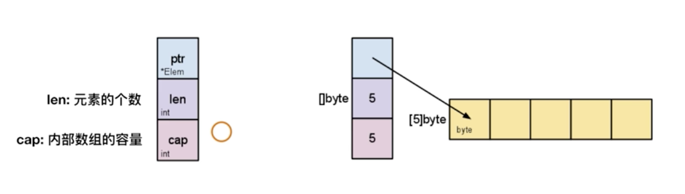
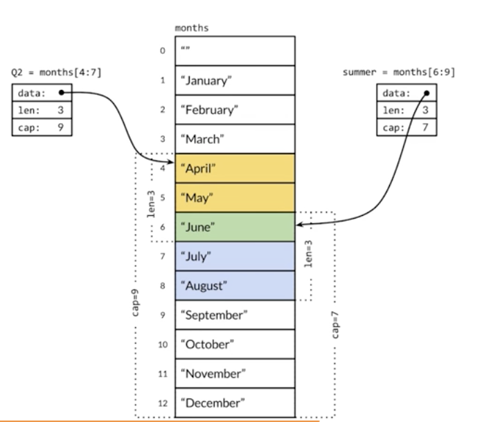

# 背景&简介

## 历史背景

软件开发的新挑战：

1、多核硬件架构

2、超大规模分布式计算集群

3、Web 模式导致的前所未有的开发规模和更新速度

## 发展现状

## 语言特性

简单：

Go 语言足够简单，只有 25 个关键字。相比 C 语言 37 个关键字，C++ 语言 84 个关键字。

高效：

1）垃圾回收

2）指针

生产力：

只支持“复合”而非“继承”

云计算语言：

1）Docker

2）kubernetes

区块链语言：

1）ethereum（以太坊）

2）HYPERLEDGER

# 安装使用

## 下载安装

下载安装 Go 语言：

[https://go.dev/doc/install](https://go.dev/doc/install)

[https://golang.google.cn/dl/](https://golang.google.cn/dl/)

## 开发环境构建

### GOPATH

1、在 1.8 版本前必须设置这个环境变量

2、1.8 版本后（含 1.8）如果没有设置使用默认值

1）在 Unix 上默认 $HOME/go

2）在 Windows 上默认为 %USERPROFILE%/go

3）在 Mac 上 GOPATH 可以通过修改 ~/.bash_profile 来设置

示例代码参考：[https://github.com/chnherb/go-demo](https://github.com/chnherb/go-demo)

### 运行程序

```shell
go run hello.go
```
注意，hello.go 必须 `package main` （go 中 package 和 目录不必一致），否则会报错“go run: cannot run non-main package”
### 编译程序

```shell
go build hello.go
./hello
```

## main 函数

### 退出返回值

与其他主要编程语言的差异：

1、Go 中 main 函数不支持任何返回值

2、通过 os.Exit 来返回状态

```go
os.Exit(0) // 表示成功退出
os.Exit(-1)  // exit status 255
```

### 获取命令行参数

与其他主要编程语言的差异：

1、main 函数不支持传入参数

```go
func main(args []string) // error
```
2、在程序中直接通过 os.Args 获取命令行参数
```go
func main() {
  fmt.Println(os.Args)
  if len(os.Args) > 1 {
     fmt.Println("args:", os.Args[1])
  }
}
// go run hello.go haha
```

# 基本程序架构

## 变量&常量

快速设置连续值

```go
const (
  Monday = iota + 1
  TuesDay
  WednesDay
)

const (
  Open = 1 << iota // bit 第1位为 1，其它位为 0
  Close // 第2位为 1，其它位为 0
  Pending // 第3位为 1，其它位为 0
)
```

## 数据类型

### 基本数据类型

```go
bool
string
int   int8   int16   int32   int64
uint  uint8  uint16  uint32  uint64 uintptr
byte // alias for uint8
rune // alias for int32, represents a Unicode code point
float32  float64
complex64  complex128
```

### 类型转换

与其它主要编程语言的差异

1、Go 语言不允许隐式类型转换

2、别名和原有类型也不能进行隐式类型转换

```go
type MyInt int64
func Implicit() {
  var a int32 = 1
  var b int64
  b = int64(a)
  var c MyInt
  c = MyInt(b)
}
```

### 类型的预定义值

1、math.MaxInt64

2、math.MaxFloat64

3、math.MaxUint32

### 指针类型

1、不支持指针运算

2、string 是值类型，其默认的初始化值为空字符串，而不是 nil

```go
  a := 1
  aPtr := &a
  // aPtr = aPtr + 1 // error
  fmt.Println(a, aPtr)
  fmt.Printf("%T, %T
", a, aPtr) // %T 打印类型
```

## 运算符

### 算数运算符

|运算符|描述|示例|
|:----|:----|:----|
|+|相加|    |
|-|相减|    |
|*|相乘|    |
|/|相除|    |
|%|求余|    |
|++|自增|    |
|--|自减|    |

Go 语言中没有前置 ++/--

### 比较运算符

如 ==、!= 、>、<、>=、<= 省略介绍

#### 用 == 比较数组

与其它语言比较数组时比较引用不同，Go 比较的是数组中的值。

1、相同维度且含有相同个数元素的数组才可以比较

2、每个元素都相同的才相等

```go
a := [...]int{1, 2, 3, 4}
b := [...]int{1, 2, 3, 5}
//c := [...]int{1, 2, 3, 4, 5}
d := [...]int{1, 2, 3, 4}
fmt.Println(a == b)
//fmt.Println(a == c) // error
fmt.Println(a == d)
```

### 逻辑运算符

&&、||、!、

### 位运算符

&、|、^、<<、>> 等

与其它语言主要差异：

&^ 按位清零

```go
# 右边操作数位上为 1 的，对应到左边操作数的位置为 0 ；
# 右边操作数位上为 0 的，对应到左边操作数的位上的值不变；
1 &^ 0 -- 1
1 &^ 1 -- 0
0 &^ 0 -- 0
0 &^ 0 -- 0
```

## 条件和循环

### 循环

Go 语言只支持循环关键 for，且不需要括号

```go
// 条件循环
n := 0
for n < 5 {
  n++
}
// 无限循环
for {
  
}
```

### if 条件

```go
if condition {
  //
} else if condition2 {
  // 
} else {
  // 
}
```
与其它语言的差异：
1、condition 必须为布尔值

2、支持变量赋值：

```go
if var declaration; condition {
  //
}
// eg
if v, err := someFun(); err == nil {
  //
} else {
  // 
}
```

### switch 条件

与其它语言的差异：

1、条件表达式不限制为常量或者整数；

2、单个 case 中，可以出现多个结果选项，使用逗号分隔；

3、与 C 语言等规则相反，Go 语言不需要用 break 来明确退出一个 case；

4、可以不设定 switch 之后的条件表达式，这种情况下，整个 switch 结构与多个 if...else... 的逻辑作用相同。

```go
switch os := runtime.GOOS; os {
  case "darwin":
    fmt.Println("OS X.")
    // break // 默认不需要加 break
  case "linux":
    fmt.Println("linux")
  default:
    fmt.Printf("%s.", os)
}

switch {
  case 0 <= Num && Num <= 3:
    fmt.Println("0-3")
  case 4 <= Num && Num <= 6:
    fmt.Println("4-6")
  case 7 <= Num && Num <= 9:
    fmt.Println("7-9")
}
```

# 常用集合

## 数组和切片

### 数组基础操作

```go
var a [3]int // 声明并初始化为默认零值
a[0] = 1

b := [3]int{1, 2, 3} // 声明同时初始化
c := [2][2]int{{1, 2}, {3, 4}} // 多维数组初始化
```
遍历
```go
arr3 := [...]int{1, 2, 3, 4}
for i := 0; i < len(arr3); i++ {
  fmt.Println(arr3[i])
}
for idx, e := range arr3 { // 不需要 idx 用 _ 替代
  fmt.Println(idx, e)
}
```
### 数组截取

a[开始索引(包含), 结束索引(不包含), ]

```go
a := [...]int{1, 2, 3, 4, 5}
a[1: 2] // 2
a[1: 3] // 2, 3
a[1: len(a)] // 2, 3, 4, 5
a[1:] // 2, 3, 4, 5
a[:3] // 1, 2, 3
```

### 切片

切片内部结构




```go
var s0 []int // 没有长度
s0 = append(s0, 1)
fmt.Println(len(s0), cap(s0))

var s1 []int{1, 2, 3, 4} // 没有 ...
fmt.Println(len(s1), cap(s1))

// []type, len, cap
// 其中 len 个元素会被初始化为默认值0，未初始化元素不可以访问
s2 := make([]int, 3, 5)
fmt.Println(len(s2), cap(s2))
```

切片共享存储结构




```go
// 切片增长  
s := []int{}
for i := 0; i < 10; i++ {
  s = append(s, i)
  fmt.Println(len(s), cap(s))
}
  
// 共享存储
year := []string{"Jan", "Feb", "Mar", "Apr", "May", "Jun", "Jul", "Aug", "Sep", "Oct", "Nov", "Dec"}
Q2 := year[3: 6]
fmt.Println(len(Q2), cap(Q2)) // 3 9
summer := [5: 8]
fmt.Println(len(summer), cap(summer)) // 3 7
summer[0] = "Unknow" // "Jun" -> "Unknow" 
```

### 数组 vs 切片

1、 容量是否可伸缩

数组不可伸缩，切片可以

2、是否可以进行比较

数组可以直接比较是否相等，切片不可以比较

## Map

### Map 基础操作

Map 声明

```go
m := map[string]int{"one": 1, "two": 2, "three": 3}
m1 := map[string]int{}
m1["one"] = 1
m2 := make(map[string]int, 10 /*Initial Capacity*/)
// 为什么不初始化len? len默认初始化默认值0，map没有办法赋值0
```
与其它语言的区别：
在访问的 key 不存在时，会返回默认值，不能通过返回 nil 来判断元素是否存在。

```go
// 访问不存在key的值会返回默认值
m1 := map[string]int{}
fmt.Println(m1["haha"]) // default 0
// m1["haha"] = 2
if v, ok := m1["haha"]; ok {
   fmt.Println("exist haha:", v)
} else {
   fmt.Println("don't exist")
}
```
map遍历
```go
m1 := map[int]int{1: 1, 2: 4, 3: 9}
for k, v := range m1 {
  fmt.Println(k, v)
}
```
### Map 与工厂模式

1、Map 的 value 可以是一个方法

2、与 Go 的 Dock type 接口方式一起，可以方便地实现单一方法对象的工厂模式

```go
m := map[int]func(op int) int{}
m[1] = func(op int) int { return op }
m[2] = func(op int) int { return op * op }
m[3] = func(op int) int { return op * op * op }
fmt.Println(m[1](2), m[2](2), m[3](2)) // 2 4 8
```

### 实现 Set

Go 的内置集合中没有 Set 试下，可以 map[type]bool

1、元素的唯一性

2、基本操作

1）添加元素

2）判断元素是否存在

3）删除元素

4）元素个数

```go
mySet := map[int]bool{}
mySet[1] = true
n := 3
if mySet[n] {
   fmt.Printf("%d exist
", n)
} else {
   fmt.Printf("%d not exist
", n)
}
mySet[3] = true
fmt.Println(len(mySet))
delete(mySet, 1)
n = 1
if mySet[n] {
   fmt.Printf("%d exist
", n)
} else {
   fmt.Printf("%d not exist
", n)
}
```

# 字符串

### string 基本操作

与其它语言的主要差异：

1、string 是数据类型，不是引用或指针类型

2、string 是只读的 byte slice，len 函数可以它所包含的 byte 数

3、string 的 byte 数组可以存放任何数据

```go
var s string
fmt.Printf("s:%s*
", s)
s = "hello"
fmt.Println(len(s)) // 5
// s[1] = '3' // error, string 是不可变的 byte slice
s = "严" // 可以存储任意二进制数据
fmt.Printf("s:%s*
", s) // s:严*
fmt.Println(len(s)) // 3
s = "中"
fmt.Printf("s:%s*
", s) // s:中*
fmt.Println(len(s)) // 3  byte数
```

### Unicode UTF8

1、Unicode 是一种字符集（code point）

2、UTF8 是 unicode 的存储实现（转换为字节序列的规则）

```go
s := "中"
fmt.Printf("s:%s*
", s) // s:中*
fmt.Println(len(s)) // 3  byte数
c := []rune(s) // 取出字符串的 Unicode
fmt.Println(len(c)) // 1
fmt.Printf("中 Unicode %x
", c[0]) // 中 Unicode 4e2d
fmt.Printf("中 UTF8 %x
", s) // 中 UTF8 e4b8ad
```
编码与存储
|字符|“中”|
|:----|:----|
|Unicode|0x4E2D|
|UTF-8|0XE4B8AD|
|string/[]byte|[0xE4, 0xB8, 0xAD]|

常用字符串函数

1、string 包（[https://pkg.go.dev/strings](https://pkg.go.dev/strings)）

2、strconv 包（[https://pkg.go.dev/strconv](https://pkg.go.dev/strconv)）

```go
func strToRune() {
   s := "中华人民共和国"
   for _, c := range s { // string rang 时默认转成 rune
      fmt.Printf("%[1]c, %[1]x
", c) // [1]表示取第一个参数
   }
}
```

# 函数

## 函数是一等公民

与其它语言的差异：

1、可以有多个返回值

2、**所有参数都是值传递**：slice，map，channel 会有传引用的错觉（可参考slice数据结构）

3、函数可以作为变量的值

4、函数可以作为参数和返回值

### 函数编程

计时函数

```go
func main() {
   tsSF := timeSpent(slowFunc)
   fmt.Println(tsSF(10))
}
func timeSpent(inner func(op int) int) func(op int) int {
   return func(n int) int {
      start := time.Now()
      ret := inner(n)
      fmt.Println("time spent: ", time.Since(start).Seconds())
      return ret
   }
}
func slowFunc(op int) int {
   time.Sleep(time.Second * 1)
   return op
}
```
学习函数式编程
推荐书籍：《计算机程序的构造和解释》

### 可变参数

```go
func sum(ops ...int) int {
   s := 0
   for _, op := range ops {
      s += op
   }
   return s
}
// sum(1, 2, 3)
```

### defer 函数

```go
func deferDemo() {
   defer func() {
      fmt.Println("deferDemo defer")
   }()
   fmt.Println("deferDemo")
   panic("Fatal error") // defer函数仍会执行
}
```

# 面向对象编程

## 行为定义和实现

go是面向对象编程语言吗？[https://go.dev/doc/faq#Is_Go_an_object-oriented_language](https://go.dev/doc/faq#Is_Go_an_object-oriented_language)

是也不是。

### 结构体定义

```go
type Employee struct {
   Id   string
   Name string
   Age  int
}
```

### 实例创建及初始化

```go
func initEmployee() {
   e := Employee{"0", "Bob", 20}
   e1 := Employee{Id: "1", Name: "Mike", Age: 21}
   e2 := new(Employee) // 注意这里返回的引用/指针，相当于 e := &Employee{}
   e2.Id = "2" // 与其它语言的差异，通过实例的指针访问不需要使用 ->
   e2.Name = "Rose"
   e2.Age = 18
   fmt.Println(e)
   fmt.Println(e1)
   fmt.Println(e2)
   fmt.Printf("%T, %T, %T
", e, e1, e2)
}
```

### 行为（方法）定义

```go
// 第一种定义方式在实例对应方法被调用时，实例的成员会进行值复制
func (e Employee) String1() string {
   fmt.Printf("Address is %x
", unsafe.Pointer(&e.Name))
   return fmt.Sprintf("ID: %s - Name: %s - Age: %s", e.Id, e.Name, e.Age)
}
// 通常情况下为了避免内存拷贝使用第二种定义方式
func (e *Employee) String2() string {
   fmt.Printf("Address is %x
", unsafe.Pointer(&e.Name))
   return fmt.Sprintf("ID: %s - Name: %s - Age: %s", e.Id, e.Name, e.Age)
}
```

## Go 接口

与其它主要编程语言的差异：

1、接口为非入侵性，实现不依赖于接口定义（duck type）

2、接口的定义可以包含在接口使用者包内

## 扩展与复用

1、没有继承、重载、LSP（参数为父类、传入子类）等功能

2、只能通过匿名嵌套的方式

```go
type Dog struct {
  // p *Pet
  Pet // 匿名嵌套类型，直接复用Pet定义的方法
}
```

## 多态

```go
package main
import "fmt"
type Code string
type Programmer interface {
   WriteHelloWord() Code
}
type GoProgrammer struct {
}
func (p *GoProgrammer) WriteHelloWord() Code {
   return "fmt.Println(\"Hello world\")"
}
type JavaProgrammer struct {
}
func (p *JavaProgrammer) WriteHelloWord() Code {
   return "System.out.Println(\"Hello world\")"
}
func writeHelloWorld(p Programmer) {
   fmt.Printf("%T %v
", p, p.WriteHelloWord())
}
func main() {
   goProg := new(GoProgrammer) // 指针类型，或为&GoProgrammer{}，但不能为 GoProgrammer{}
   javaProg := new (JavaProgrammer)
   writeHelloWorld(goProg)
   writeHelloWorld(javaProg)
}
```
## 空接口与断言

1、空接口可以表示任何类型

2、通过断言来将空接口转换为指定类型

```go
v, ok := p.(int) // ok=true 表示转换成功

func main() {
   DoSomething(10)
   DoSomething("10")
}
func DoSomething(p interface{}) {
   //if i, ok := p.(int); ok {
   // fmt.Println("int", i)
   // return
   //}
   //if s, ok := p.(string); ok {
   // fmt.Println("string", s)
   // return
   //}
   //fmt.Println("Unkown Type")
   switch v := p.(type) {
   case int:
      fmt.Println("int", v)
   case string:
      fmt.Println("string", v)
   default:
      fmt.Println("Unkown Type")
   }
}
```

## Go 接口最佳实践

1、倾向于使用晓得接口定义，很多接口只包含一个方法

```go
type Reader interface {
  Read(p []byte) (n int, err error)
}
type Writer interface {
  write(p []byte) (n int, err error)
}
```
2、较大的接口定义，可以由多个小接口定义组合而成
```go
type ReadWriter interface {
  Reader
  Writer
}
```
3、只依赖于必要功能的最小接口
```go
func StoreData(reader Reader) error {
}
```

# 错误处理

## Go 的错误机制

1、没有异常机制

2、error 类型实现了 error 接口

```go
type error interface {
  Error() string
}
```
3、可以通过 errors.New 来快速创建错误实例
```go
errors.New("n must be in the range [0,10]")
```

最佳实践

及早失败，避免嵌套

## panic

### panic vs os.Exit

1、os.Exit 退出时不会调用 defer 指定的函数

2、os.Exit 退出时不输出当前调用栈信息

## recover

```go
defer func() {
  if err := recover(); err != nil {
    // 恢复错误
  }
}()
```

当心 recover 成为恶魔

1、形成僵尸服务进程，导致 health check 失效

2、“Let it Crash!” 往往是恢复不确定性错误的最好方法

# 包和依赖管理

## package

1、基本复用模块单元

以首字母大写来表明可被包外代码访问

2、代码的 package 可以和所在目录不一致

3、同一目录的 Go 代码的 package 要保持一致

其它注意项：

1、通过 go get 来获取远程依赖

go get -u 强制从网络更新远程依赖

2、注意代码在 GitHub 上的组织形式，以适应 go get

直接以代码路径开始，不要有 src

示例：[https://github.com/easierway/concurrent_map](https://github.com/easierway/concurrent_map)

### init 方法

1、在 main 被执行前，所有依赖的 package 的 init 方法都会被执行

2、不同包的 init 函数依照包导入的依赖关系决定执行顺序

3、每个包可以有多个 init 函数

4、包的每个源文件也可以有多个 init 函数，这点比较特殊

## 依赖管理

Go 未解决的依赖问题

1、同一环境下，不同项目使用同一包的不同版本

2、无法管理对包的特定版本的依赖

### vendor 路径

随着 Go 1.5 release 版本的发布，vendor 目录被添加到除了 GOPATH 和 GOROOT 之外的依赖目录查找的解决方案。在 Go 1.6 之前，需要手动设置环境变量。

查找依赖包路径的解决方案如下：

1、当前包下的 vendor 目录

2、向上级目录查找，直到找到 src 下的 vendor 目录

3、在 GOPATH 下面查找依赖包

4、在 GOROOT 目录下查找

### 常用的依赖管理工具

godep：[https://github.com/tools/godep](https://github.com/tools/godep)

glide：[https://github.com/Masterminds/glide](https://github.com/Masterminds/glide)

dep：[https://github.com/golang/dep](https://github.com/golang/dep)

# 测试

## 编写测试程序

1、源码文件以 _test 结尾：xxx_test.go

2、测试方法名以 Test 开头：func TestXXX(t *testing.T) {...} （或 Test_XXX）

## 单元测试

functions.go

```go
package ch02
func square(op int) int {
   return op * op
}
```
functions_test.go
```go
package ch02
import "testing"
func TestSquare(t *testing.T) {
   inputs := [...]int{1, 2, 3}
   expected := [...]int{1, 4, 9}
   for i := 0; i < len(inputs); i++ {
      ret := square(inputs[i])
      if ret != expected[i] {
         t.Errorf("input is %d, the expected is %d, the actual %d",
            inputs[i], expected[i], ret)
      }
   }
}
```

## 内置单元测试框架

1、Fail, Error：该测试失败，该测试继续，其他测试继续执行

2、FailNow, Fatal：该测试失败，该测试中止，其他测试继续执行

```go
func TestErrorInCode(t *testing.T) {
   fmt.Println("Start")
   t.Error("Error") // 测试继续
   fmt.Println("End")
}
func TestFailErrorInCode(t *testing.T) {
   fmt.Println("Start")
   t.Fatal("Error") // 测试中止
   fmt.Println("End")
}
```

代码覆盖率

```shell
go test -v - cover
```
断言
[https://github.com/stretchr/testify](https://github.com/stretchr/testify)

```shell
go get -u github.com/stretchr/testify/assert
```
代码示例：
```go
import (
   "fmt"
   "testing"
   "github.com/stretchr/testify/assert"
)
func TestSquareWithAssert(t *testing.T) {
   inputs := [...]int{1, 2, 3}
   expected := [...]int{1, 4, 9}
   for i := 0; i < len(inputs); i++ {
      ret := square(inputs[i])
      assert.Equal(t, expected[i], ret)
   }
}
```
tips：导入包报错，重启 Goland 即可。
## Benchmark

benchmark_test.go

```plain
func BenchmarkDemo(b *testing.B) {
   // 与性能测试无关的代码
   elems := []string{"1","2","3", "4", "5"}
   b.ResetTimer()
   for j := 0; j < b.N; j++ {
      var buf bytes.Buffer
      for _, elem := range elems{
         buf.WriteString(elem)
      }
   }
   b.StopTimer()
}
```


运行测试

```shell
go test -bench=.  # Windows 下为 -bench="."
go test -bench=. benchmen  # 分析原因，增加内存使用信息
```

## BDD

Behavior Driven Development

Story Card

### BDD in Go

项目网站：[https://github.com/smartystreets/goconvey](https://github.com/smartystreets/goconvey)

安装：

```shell
go get -u github.com/smartystreets/goconvey/convey
```
启动 Web UI
```shell
$GOPATH/bin/goconvey
```

使用示例：

```go
import (
   . "github.com/smartystreets/goconvey/convey"
   "testing"
)
func TestSpec(t *testing.T) {
   // Only pass t into top-level Convey Calls
   Convey("Given 2 even numbers", t, func() {
      a := 2
      b := 4
      Convey("When add the two numbers", func() {
         c := a + b
         Convey("Then the result is still even", func() {
            So(c%2, ShouldEqual, 0)
         })
      })
   })
}
```

# Reference

[Go 语言规范文档](https://golang.google.cn/ref/spec)
