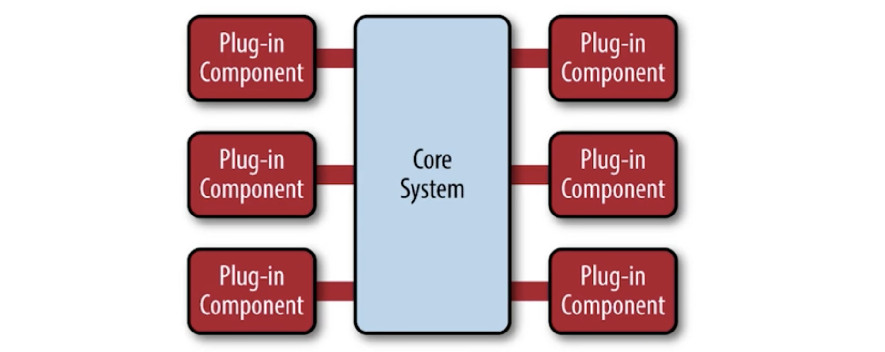

# 并发编程

## 协程机制

Thread vs Groutine

1、创建时默认的 stack 的大小

1）JDK5 以后 Java Thread stack 默认为 1M

2）Groutine 的 Stack 初始化大小为 2K

2、和 KSE（Kernel Space Entity）的对应关系

1）Java Thread 是 1:1

2）Goroutine 是 M:N

## 共享内存并发机制

### Mutex

```go
var mut sync.Mutex
counter := 0
for i := 0; i <5000; i++ {
   go func() {
      defer func() {
         mut.Unlock()
      }()
      mut.Lock()
      counter++
   }()
}
time.Sleep(1 * time.Second)
fmt.Println(counter)
```

### WaitGroup

```go
var wg sync.WaitGroup
for i := 0; i <5000; i++ {
   wg.Add(1)
   go func() {
      defer func() {
         wg.Done()
      }()
   }()
}
wg.Wait()
```

```go
var mut sync.Mutex
var wg sync.WaitGroup
counter := 0
for i := 0; i < 5000; i++ {
   wg.Add(1)
   go func() {
      defer func() {
         mut.Unlock()
      }()
      mut.Lock()
      counter++
      wg.Done()
   }()
}
wg.Wait()
fmt.Println(counter)
```

## CSP 并发机制

Communicating sequential processes

### CSP vs Actor

1、和 Actor 直接通讯不同，CSP 模式则是通过 Channel 进行通讯的，更松耦合一些

2、Go 中 channel 是有容量限制并且独立于处理 Groutine，而如 Erlang、Actor 模式中的 mailbox 容量是无限的，接收进程也总是被动地处理消息

```go
package main
import (
   "fmt"
   "time"
)
func service() string {
   time.Sleep(time.Microsecond * 50)
   return "Done"
}
func otherTask() {
   fmt.Println("working on something else")
   time.Sleep(time.Microsecond * 100)
   fmt.Println("Task is done.")
}
func AsyncService() chan string {
   //retCh := make(chan string)
   retCh := make(chan string, 1) // 更高效，不阻塞
   go func() {
      ret := service()
      fmt.Println("returned result.")
      retCh <- ret  // retCh buf 为 1 不阻塞
      fmt.Println("service existed")
   }()
   return retCh
}
func main() {
   //fmt.Println(service())
   //otherTask()
   retCh := AsyncService()
   otherTask()
   fmt.Println(<-retCh)
   time.Sleep(time.Second + 1)
}
```

## 多路选择和超时

多渠道的选择

```plain
select {
case ret := <-retCh1:
   fmt.Println("xxx")
case ret := <-retCh2:
   fmt.Println("xxx")
default:
   fmt.Println("xxx")
}
```

超时控制

```plain
select {
case ret := <-retCh:
   fmt.Println("xxx")
case <-time.After(time.Second * 1)
   fmt.Println("time out")

}
```

## channel 关闭和广播

1、想关闭的 channel 发送数据，会导致 panic

2、v, ok <- ch; ok 为 bool 值，true 表示正常接收，false 表示通道关闭。（通道关闭后如果取值会返回默认值）

3、所有的 channel 接收者都会在 channel 关闭时，立刻从阻塞等待中返回且上述 ok 值为 false。这个广播机制常被利用，进行多个订阅者同时发送信号。如：退出信号。


## 任务的取消

```go
package main
import (
   "fmt"
   "time"
)
func isCancelled(cancelCh chan struct{}) bool {
   select {
   case <-cancelCh:
      return true
   default:
      return false
   }
}
func cancel_1(cancelCh chan struct{}) {
   cancelCh <- struct{}{}
}
func cancel_2(cancelCh chan struct{}) {
   close(cancelCh)
}
func taskCancel() {
   cancelCh := make(chan struct{}, 0)
   for i := 0; i < 5; i++ {
      go func(i int, cancelCh chan struct{}) {
         for {
            if isCancelled(cancelCh) {
               break
            }
            time.Sleep(time.Microsecond * 5)
         }
         fmt.Println(i, "Cancelled")
      }(i, cancelCh)
   }
   //cancel_1(cancelCh)
   cancel_2(cancelCh)
   time.Sleep(time.Second * 1)
}
func main() {
   taskCancel()
}
```

## Context 与任务取消

### Context

1、根 Context：通过 context.Background() 创建

2、子 Context：context.WithCancel(parentContext) 创建

ctx, cancel := context.WithCancel(context.Background())

3、当前 Context 被取消时，基于他的子 Context 都被会取消

4、接收取消通知 <- ctx.Done()

```go
package main
import (
   "context"
   "fmt"
   "time"
)
func isCancelled(ctx context.Context) bool {
   select {
   case <-ctx.Done():
      return true
   default:
      return false
   }
}
func taskCancel1() {
   ctx, cancel := context.WithCancel(context.Background())
   for i := 0; i < 5; i++ {
      go func(i int, ctx context.Context) {
         for {
            if isCancelled(ctx) {
               break
            }
            time.Sleep(time.Microsecond * 5)
         }
         fmt.Println(i, "Cancelled")
      }(i, ctx)
   }
   cancel()
   time.Sleep(time.Second * 1)
}
func main() {
   taskCancel1()
}
```

# 典型并发任务

## 只运行一次

```go
package main
import (
   "fmt"
   "sync"
   "unsafe"
)
type Singleton struct {
}
var singleInstance *Singleton
var once sync.Once
func GetSingletonObj() *Singleton {
   once.Do(func() {
      fmt.Println("Create Obj")
      singleInstance = new(Singleton)
   })
   return singleInstance
}
func main() {
   var wg sync.WaitGroup
   for i := 0; i < 10; i++ {
      wg.Add(1)
      go func() {
         obj := GetSingletonObj()
         fmt.Printf("%x
",unsafe.Pointer(obj))
         wg.Done()
      }()
   }
   wg.Wait()
}
```

## 仅需任意任务完成

```go
package main
import (
   "fmt"
   "runtime"
   "time"
)
func runTask(id int) string {
   time.Sleep(10 * time.Microsecond)
   return fmt.Sprintf("The result is from %d", id)
}
func FirstResponse() string {
   numOfRunner := 10
   ch := make(chan string, numOfRunner) // 改成 buffer channel，不用阻塞等待
   for i := 0; i < numOfRunner; i++ {
      go func(i int) {
         ret := runTask(i)
         ch <- ret
      }(i)
   }
   return <-ch
}
func main() {
   fmt.Println("Before:", runtime.NumGoroutine())
   fmt.Println(FirstResponse())
   fmt.Println("After:", runtime.NumGoroutine())
}
```

## 所有任务完成

```go
func AllResponse() string {
   numOfRunner := 10
   ch := make(chan string, numOfRunner) // 改成 buffer channel，不用阻塞等待
   for i := 0; i < numOfRunner; i++ {
      go func(i int) {
         ret := runTask(i)
         ch <- ret
      }(i)
   }
   finalRet := ""
   for i:=0 ; i<numOfRunner; i++ {
      finalRet += <-ch + "
"
   }
   return finalRet
}
```

## 对象池

```go
package main
import (
   "errors"
   "fmt"
   "time"
)
type ReusableObj struct {
}
type ObjPool struct {
   bufChan chan *ReusableObj
}
func NewObjPool(numOfObj int) *ObjPool {
   objPool := ObjPool{}
   objPool.bufChan = make(chan *ReusableObj, numOfObj)
   for i := 0; i < numOfObj; i++ {
      objPool.bufChan <- &ReusableObj{}
   }
   return &objPool
}
func (p *ObjPool) GetObj(timeout time.Duration) (*ReusableObj, error) {
   select {
   case ret := <-p.bufChan:
      return ret, nil
   case <-time.After(timeout):
      return nil, errors.New("time out")
   }
}
func (p *ObjPool) ReleaseObj(obj *ReusableObj) error {
   select {
   case p.bufChan <- obj:
      return nil
   default:
      return errors.New("overflow")
   }
}
func main() {
   pool := NewObjPool(10)
   //if err := pool.ReleaseObj(&ReusableObj{}); err != nil {
   // fmt.Println(err.Error()) // overflow
   //}
   for i := 0; i < 11; i++ {
      if v, err := pool.GetObj(time.Second * 1); err != nil {
         fmt.Println(err.Error())
      } else {
         fmt.Printf("%T
", v)
         // 不及时释放，上面 get 就会 timeout
         //if err := pool.ReleaseObj(v); err != nil {
         // fmt.Println(err.Error())
         //}
      }
   }
   fmt.Println("Done")
}
```

## sync.pool 对象缓存

sync.pool 对象获取：

1、尝试从私有对象（协程安全）获取

2、私有对象不存在，尝试从当前 Processor 的共享池（协程不安全）获取

3、如果当前 Processor 共享池也是空的，那么久尝试去其他 Processor 的共享池获取

sync.pool 对象放回：

1、如果私有对象不存在则保存为私有对象

2、如果私有对象存在，放入当前 Processor 子池的共享池中

使用方式：

```go
pool := &sync.Pool {
  New: func() interface() {
    return 0
  },
}
arry := pool.Get().(int)
pool.put(10)
```

sync.Pool 对象的生命周期

1、GC 会清除 sync.pool 缓存的对象

2、对象的缓存有效期为下一次 GC 之前

使用示例：

```go
pool := &sync.Pool{
   New: func() interface{} {
      fmt.Println("Create a new object.")
      return 100
   },
}
v := pool.Get().(int)
fmt.Println(v)
pool.Put(3)
//runtime.GC() // 清除 sync.Pool 中缓存的对象
v1, _ := pool.Get().(int)
fmt.Println(v1)
v2, _ := pool.Get().(int)
fmt.Println(v2)

// multi value
pool := &sync.Pool{
   New: func() interface{} {
      fmt.Println("Create a new object.")
      return 100
   },
}
pool.Put(10)
pool.Put(10)
pool.Put(10)
var wg sync.WaitGroup
for i := 0; i < 10; i++ {
   wg.Add(1)
   go func(id int) {
      fmt.Println(pool.Get())
      wg.Done()
   }(i)
}
wg.Wait()
```

sync.Pool 总结：

1、适合于通过复用，降低复杂对象的创建和 GC 代价

2、协程安全，会有锁的开销

3、生命周期受 GC 影响，不适合于做连接池等，需自己管理生命周期的资源的池化

# 反射

**reflect.TypeOf vs reflect.ValueOf**

1、reflect.TypeOf 返回类型（reflect.Type）

2、reflect.ValueOf 返回值（reflect.Value）

3、可以从 reflect.Value 获得类型

4、通过 Kind() 的来判断类型

利用反射编写灵活的代码

1、按名字访问结构的成员

```go
reflect.ValueOf(*e).FieldByName("Name")
```
2、按名字访问结构的方法
```go
reflect.ValueOf(e).MethodByName("UpdateAge").Call([]reflect.Value{reflect.ValueOf(1)})
```

反射示例：

```go
type Employee struct {
   EmployeeID string
   Name       string `format:"normal"`
   Age        int
}
func (e *Employee) UpdateAge(newVal int) {
   e.Age = newVal
}
func TestInvokeByName(t *testing.T) {
   e := &Employee{"1", "Mike", 20}
   // 按照名字获取成员
   t.Logf("Name: value(%[1]v), Type(%[1]T) ", reflect.ValueOf(*e).FieldByName("Name"))
   if nameField, ok := reflect.TypeOf(*e).FieldByName("Name"); !ok {
      t.Error("Failed to get 'Name' field")
   } else {
      t.Log("Tag:format", nameField.Tag.Get("format"))
   }
   reflect.ValueOf(e).MethodByName("UpdateAge").Call(
      []reflect.Value{reflect.ValueOf(1)})
   t.Log("Updated Age:", e)
   fmt.Println(e.Age)
}
```

## DeepEqual

比较切片和map

```go
type Customer struct {
   CookieID string
   Name     string
   Age      int
}
func TestDeepEqual(t *testing.T) {
   a := map[int]string{1: "one", 2: "two", 3: "three"}
   b := map[int]string{1: "one", 2: "two", 3: "three"}
   // t.Log(a == b)  // error
   t.Log(reflect.DeepEqual(a, b)) // true
   s1 := []int{1, 2, 3}
   s2 := []int{1, 2, 3}
   s3 := []int{2, 3, 1}
   // t.Log(s1 == s2) // error
   t.Log("s1 == s2?", reflect.DeepEqual(s1, s2)) // true
   t.Log("s1 == s3?", reflect.DeepEqual(s1, s3)) // false
   c1 := Customer{"1", "Mike", 20}
   c2 := Customer{"1", "Mike", 20}
   t.Log(c1 == c2)                  // true
   t.Log(reflect.DeepEqual(c1, c2)) // true
}
```

## 万能程序

```go
type Employee struct {
   EmployeeID string
   Name       string `format:"normal"`
   Age        int
}
type Customer struct {
   CookieID string
   Name     string
   Age      int
}

func fillBySettings(st interface{}, settings map[string]interface{}) error {
   // func (v Value) Elem() Value
   // Elem returns the value that the interface v contains or that the pointer v points to.
   // It panics if v's Kind is not Interface or Ptr.
   // It returns the zero Value if v is nil.
   if reflect.TypeOf(st).Kind() != reflect.Ptr {
      return errors.New("the first param should be a pointer to the struct type.")
   }
   // Elem() 获取指针指向的值
   if reflect.TypeOf(st).Elem().Kind() != reflect.Struct {
      return errors.New("the first param should be a pointer to the struct type.")
   }
   if settings == nil {
      return errors.New("settings is nil.")
   }
   var (
      field reflect.StructField
      ok    bool
   )
   for k, v := range settings {
      if field, ok = (reflect.ValueOf(st)).Elem().Type().FieldByName(k); !ok {
         continue
      }
      if field.Type == reflect.TypeOf(v) {
         vstr := reflect.ValueOf(st)
         vstr = vstr.Elem()
         vstr.FieldByName(k).Set(reflect.ValueOf(v))
      }
   }
   return nil
}
func TestFillNameAndAge(t *testing.T) {
   settings := map[string]interface{}{"Name": "Mike", "Age": 30}
   e := Employee{}
   if err := fillBySettings(&e, settings); err != nil {
      t.Fatal(err)
   }
   t.Log(e)
   c := new(Customer)
   if err := fillBySettings(c, settings); err != nil {
      t.Fatal(err)
   }
   t.Log(*c)
}
```

## unsafe

### 不安全行为

“不安全”行为的危险性

```go
i := 10
f := *(*float64)(unsafe.Pointer(&i)) // 0xc0000aa1b0
t.Log(unsafe.Pointer(&i)) // 5e-323
t.Log(f)
```

### 合理转换

```go
// The cases is suitable for unsafe
type MyInt int
//合理的类型转换
func TestConvert(t *testing.T) {
   a := []int{1, 2, 3, 4}
   b := *(*[]MyInt)(unsafe.Pointer(&a))
   t.Log(b)
}
```

### 原子类型操作

```go
//原子类型操作
func TestAtomic(t *testing.T) {
   var shareBufPtr unsafe.Pointer
   //var shareBufPtr []int
   writeDataFn := func() {
      data := []int{}
      for i := 0; i < 100; i++ {
         data = append(data, i)
      }
      atomic.StorePointer(&shareBufPtr, unsafe.Pointer(&data))
      //shareBufPtr = data
   }
   readDataFn := func() {
      data := atomic.LoadPointer(&shareBufPtr)
      fmt.Println(data, *(*[]int)(data))
      //data := shareBufPtr
      //fmt.Println(unsafe.Pointer(&data), data)
   }
   var wg sync.WaitGroup
   writeDataFn()
   for i := 0; i < 10; i++ {
      wg.Add(1)
      go func() {
         for i := 0; i < 10; i++ {
            writeDataFn()
            time.Sleep(time.Microsecond * 100)
         }
         wg.Done()
      }()
      wg.Add(1)
      go func() {
         for i := 0; i < 10; i++ {
            readDataFn()
            time.Sleep(time.Microsecond * 100)
         }
         wg.Done()
      }()
   }
   wg.Wait()
}
```

# 常见架构模式实现

## pipe-filter framework

1、非常适合与数据处理及数据分析系统

2、Filter 封装数据处理的功能

3、松耦合：Filter 只跟数据（格式）耦合

4、Pipe 用于连接 Filter 传递数据或者在异步处理过程中缓冲数据流

进程内同步调用时，pipe 演变为数据在方法调用间传递

## micro-kernel framework

特点

1）易于扩展

2）错误隔离

3）保持架构一致性

要点

1）内核包含公共流程或通用逻辑

2）将可变或可扩展部分规划为扩展点

3）抽象扩展点行为，定义接口




# 常见任务

## 内置JSON解析

利用反射实现，通过 FeildTag 来标识对应的 json 值（性能很低，不适用于高 QPS 场景）

```go
type BasicInfo struct {
   Name string `json:"name"`
   Age  int    `json:"age"`
}
type JobInfo struct {
   Skills []string `json:"skills"`
}
type Employee struct {
   BasicInfo BasicInfo `json:"basic_info"`
   JobInfo   JobInfo   `json:"job_info"`
}

var jsonStr = `{
   "basic_info":{
      "name":"Mike",
      "age":30
   },
   "job_info":{
      "skills":["Java","Go","C"]
   }
}  `
func TestEmbeddedJson(t *testing.T) {
   e := new(Employee)
   err := json.Unmarshal([]byte(jsonStr), e)
   if err != nil {
      t.Error(err)
   }
   fmt.Println(*e)
   if v, err := json.Marshal(e); err == nil {
      fmt.Println(string(v))
   } else {
      t.Error(err)
   }
}
```

## easyjson

EasyJSON 采用代码生成而非反射

安装：

```shell
# 注意，这里的 ... 不用替换
go get -u github.com/mailru/easyjson/...
```
使用：
```shell
# 生成代码
easyjson -all <结构定义>.go
```

## HTTP服务

路由规则：

1、URL 分为两种，末尾是 / 表示一个子树，后面可以跟其他子路径；末尾不是 /，表示一个叶子，固定的路径以 / 结尾的 URL 可以匹配它的任何子路径，比如 /images/ 会匹配 /images/cute-cat.jpg

2、它采用最长匹配原则，如果有多个匹配，一定采用匹配路径最长的那个进行处理。

3、如果没有找到任何匹配项，会返回 404 错误。

代码示例：

```go
package main
import (
   "fmt"
   "net/http"
   "time"
)
func main() {
   http.HandleFunc("/", func(w http.ResponseWriter, r *http.Request) {
      fmt.Fprintf(w, "Hello World!")
   })
   http.HandleFunc("/time/", func(w http.ResponseWriter, r *http.Request) {
      t := time.Now()
      timeStr := fmt.Sprintf("{\"time\": \"%s\"}", t)
      w.Write([]byte(timeStr))
   })
   http.ListenAndServe(":8080", nil)
}
```

## Restful服务

更好的 Router

[https://github.com/julienschmidt/httprouter](https://github.com/julienschmidt/httprouter)

```go
package main

import (
	"fmt"
	"log"
	"net/http"

	"github.com/julienschmidt/httprouter"
)

func Index(w http.ResponseWriter, r *http.Request, _ httprouter.Params) {
	fmt.Fprint(w, "Welcome!
")
}

func Hello(w http.ResponseWriter, r *http.Request, ps httprouter.Params) {
	fmt.Fprintf(w, "hello, %s!
", ps.ByName("name"))
}

func main() {
	router := httprouter.New()
	router.GET("/", Index)
	router.GET("/hello/:name", Hello)

	log.Fatal(http.ListenAndServe(":8080", router))
}
```

# 性能调优

## 性能分析工具

准备工作：

1、安装 graphviz

```shell
brew install graphviz
```
2、将 $GOPATH 加入到 $PATH
Mac OS：在 .bash_profile 中修改路径

3、安装 go-torch（go1.1之后已经内置）

1）go get 

```shell
go get github.com/uber/go-torch
```
2）下载并复制 flamegraph.pl （[https://github.com/brendangregg/FlameGraph](https://github.com/brendangregg/FlameGraph)）至 $GOPATH/bin 路径下
3）将 $GOPATH/bin 加入 $PATH

通过文件方式输出 Profile

1、灵活性高，适用于特定代码段的分析

2、通过手动调用 runtime/pprof 的 API

3、API 相关文档 [https://pkg.go.dev/runtime/pprof](https://pkg.go.dev/runtime/pprof)

4、

```shell
go tool pprof [binary] [binary.prof]
```


go 支持多种 profile

1、go help testflag

2、[https://pkg.go.dev/github.com/pkg/profile](https://pkg.go.dev/github.com/pkg/profile)


代码示例：[https://github.com/chnherb/go-demo/tree/master/ch17_tools/file](https://github.com/chnherb/go-demo/tree/master/ch17_tools/file)

查看 profile

```shell
go tool pprof prof cpu.prof

go-torch cpu.prof
```

### 通过 HTTP 方式输出 Profile

1、简单，适合于持续运行的应用

2、在应用程序中导入 import _ "net/http/pprof" ，并启动 http server 即可

3、http://<host>:<port>/debug/pprof

4、

```shell
go tool pprof http://<host>:<port>/debug/pprof/profile?seconds=10  # 默认值为30秒
```
5、
```shell
go-torch -seconds 10 http://<host>:<port>/debug/pprof/profile
```

## 锁的性能

sync.Map

1、适合读多写少，且 key 相对稳定的环境。

2、采用了空间换时间的方案，并且采用指针的方式简介实现值的映射，所以存储空间会较 built-in map 大。

Concurrent Map

1、适用于读写都很频繁的情况

[https://github.com/easierway/concurrent_map](https://github.com/easierway/concurrent_map)

代码示例：[https://github.com/chnherb/go-demo/tree/master/ch18_lock](https://github.com/chnherb/go-demo/tree/master/ch18_lock)

## GC友好的代码

避免内存分配和复制

1、复杂对象尽量传递引用

1）数组的传递

2）结构体传递

2、初始化至合适的大小

1）自动扩容是有代价的

3、复用内存

打开 GC 日志

只要在程序执行之前加上环境变量 GODEBUG=gctrace=1，如：

```shell
GODEBUG=gctrace=1 go test -bench=.
GODEBUG=gctrace=1 go run main.go
```
日志详细信息参考：[https://pkg.go.dev/runtime](https://pkg.go.dev/runtime)
### go tool trace

普通程序输出 trace 信息

```go
package main
import (
  "os"
  "runtime/trace"
)
func main() {
  f, err := os.Create("trace.out")
  if err != nil {
    panic(err)
  }
  defer f.Close()
}
```

测试程序输出 trace 信息

```shell
go test -trace trace.out
```

可视化 trace 信息

```shell
go tool trace trace.out
```

# 
