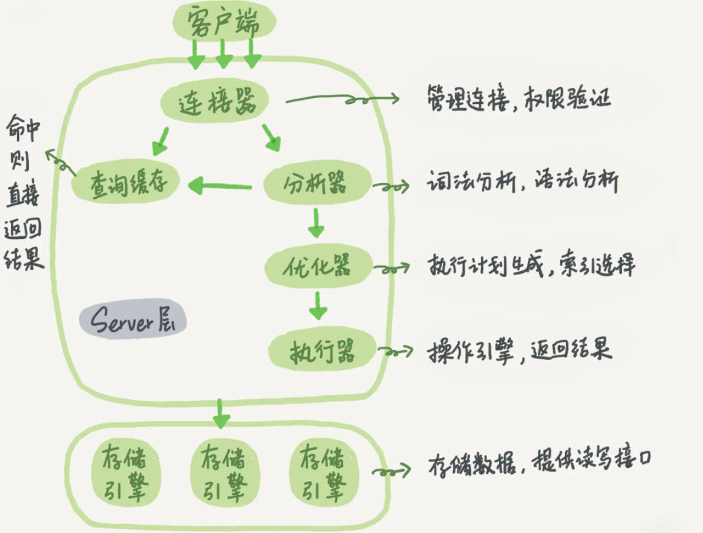

>本文介绍 MySQL 的逻辑架构。如一条 SQL 查询语句的执行过程等。

# 逻辑架构

MySQL 的逻辑架构图




大体来说，MySQL 可以分为**Server 层**和**存储引擎层**两部分。

## Server层

Server 层包括连接器、查询缓存、分析器、优化器、执行器等，涵盖 MySQL 的大多数核心服务功能，以及所有的内置函数（如日期、时间、数学和加密函数等），所有跨存储引擎的功能都在这一层实现，比如存储过程、触发器、视图等。

## 存储引擎层

存储引擎层负责数据的存储和提取。其架构模式是插件式的，支持 InnoDB、MyISAM、Memory 等多个存储引擎。

现在最常用的存储引擎是 InnoDB，它从 MySQL 5.5.5 版本开始成为了默认存储引擎。创建表时如果不指定引擎类型，默认使用的就是 InnoDB。指定引擎：

```shell
engine=memory  # 指定使用内存引擎创建表
```
不同存储引擎的表数据存取方式不同，支持的功能也不同。
# 连接器

连接器负责跟客户端建立连接、获取权限、维持和管理连接。连接命令一般写法：

```shell
mysql -h$ip -P$port -u$user -p
```
连接命令 mysql 是客户端命令，完成 TCP 握手后，连接器会验证身份。如果身份不对会返回“Access denied for user”的错误。身份通过后，该连接的权限判断都依赖此时读取的权限（不会热更新权限）。
创建 2 个连接，如果都是空闲，使用其中一个连接  `show processlist` 

```shell
mysql> show processlist;
+----+------+-----------+------+---------+------+----------+------------------+
| Id | User | Host      | db   | Command | Time | State    | Info             |
+----+------+-----------+------+---------+------+----------+------------------+
|  4 | root | localhost | NULL | Sleep   |   20 |          | NULL             |
|  5 | root | localhost | NULL | Query   |    0 | starting | show processlist |
+----+------+-----------+------+---------+------+----------+------------------+
2 rows in set (0.00 sec)
```
可以看到 Command 列显示“Sleep”的行是一个空闲的连接。
## 自动断开

客户端长时间没有动静，连接器会自动断开。由参数 wait_timeout 控制，默认 8 小时。

## 长连接

长连接是指连接成功后，如果客户端持续有请求，则一直使用同一个连接。短连接则是指每次执行完很少的几次查询就断开连接，下次查询再重新建立一个。

建立连接的过程通常是比较复杂的，建议使用中尽量减少建立连接的动作，也就是尽量使用长连接。

但是全部使用长连接后，你可能会发现，有些时候 MySQL 占用内存涨得特别快，这是因为 MySQL 在执行过程中临时使用的内存是管理在连接对象里面的。这些资源会在连接断开的时候才释放。所以如果长连接累积下来，可能导致内存占用太大，被系统强行杀掉（OOM），从现象看就是 MySQL 异常重启了。

解决方案：

1、定期断开长连接。使用一段时间，或者程序里面判断执行过一个占用内存的大查询后，断开连接，之后要查询再重连。

2、使用 MySQL 5.7 或更新版本，可以在每次执行一个比较大的操作后，通过执行 mysql_reset_connection 来重新初始化连接资源。这个过程不需要重连和重新做权限验证，但是会将连接恢复到刚刚创建完时的状态。

# 查询缓存

连接建立完成后，就可以执行 select 语句。执行逻辑就会来到第二步：查询缓存。

MySQL 拿到一个查询请求后，会先到查询缓存看看，之前是不是执行过这条语句。之前执行过的语句及其结果可能会以 key-value 对的形式，被直接缓存在内存中。key 是查询的语句，value 是查询的结果。如果你的查询能够直接在这个缓存中找到 key，这个 value 就会被直接返回给客户端。

如果语句不在查询缓存中，就会继续后面的执行阶段。执行完成后，执行结果会被存入查询缓存中。如果查询命中缓存，MySQL 不需要执行后面的复杂操作，直接返回结果，效率会很高。

但是建议不要使用查询缓存，往往弊大于利。

1、缓存需要语句完全相等，包括参数。

2、表更新后就会失效 因此，只有在表更新频率不高，查询语句完全一致的情况下，可以手动开启缓存，其他一律关闭。

( 注意：mysql8之后，取消了缓存功能。)

MySQL 也提供了这种“按需使用”的方式。将参数 query_cache_type 设置成 DEMAND，这样对于默认的 SQL 语句都不使用查询缓存。而对于你确定要使用查询缓存的语句，可以用 SQL_CACHE 显式指定：

```shell
mysql> select SQL_CACHE * from T where ID=10；
```

# 分析器

如果没有命中查询缓存，就要开始真正执行语句了。首先需要对 SQL 语句做解析。

## 词法分析

分析器先会做“词法分析”。解析字符串分别是什么，代表什么。

## 语法分析

然后做“语法分析”。根据语法规则，判断 SQL 语句是否满足语法。

如果语句不对，就会收到“You have an error in your SQL syntax”的错误提醒。

# 优化器

经过了分析器，MySQL 就知道要做什么。在开始执行之前，还要先经过优化器的处理。

优化器是在表里面有多个索引的时候，决定**使用哪个索引**；或者在一个语句有多表关联（join）的时候，决定**各个表的连接顺序**。


# 执行器

MySQL 通过分析器知道要做什么，通过优化器知道该怎么做，就进入了执行器阶段，开始执行语句。

首先判断执行权限。

然后继续执行。

如果没有索引，慢查询日志会有一个 **row_examined 的字段，表示执行器获取到的数据行数，不是真正的扫描行数**。
