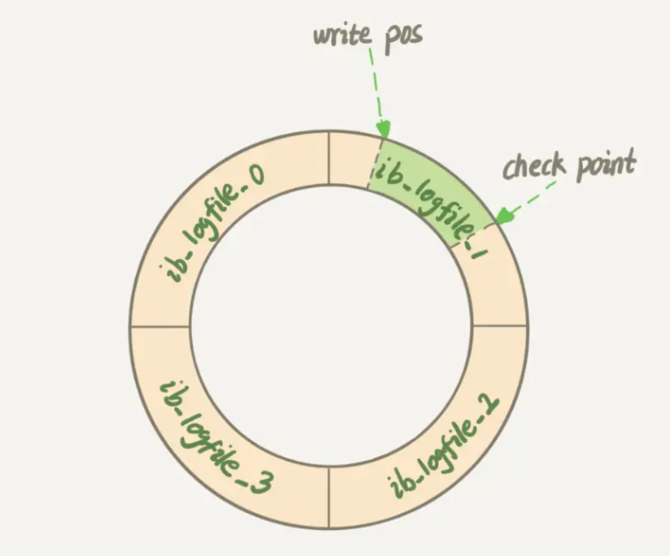
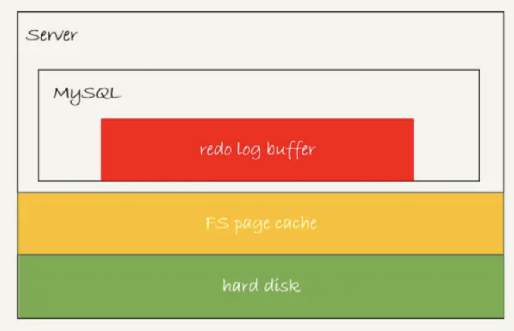
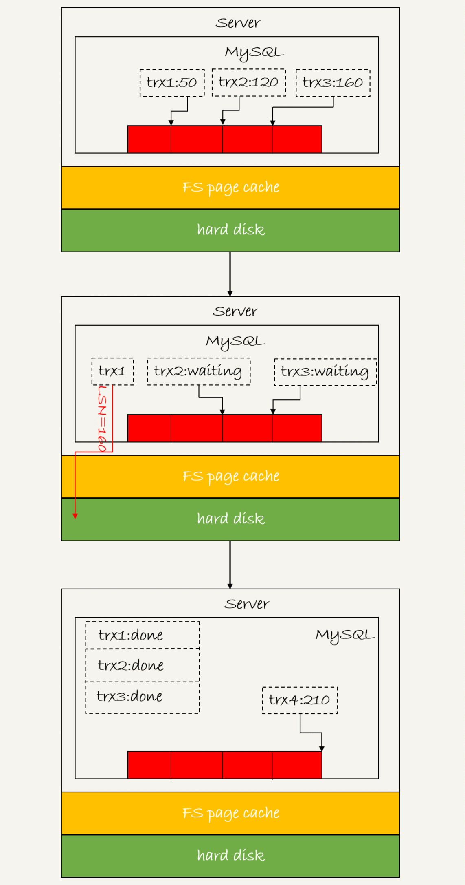
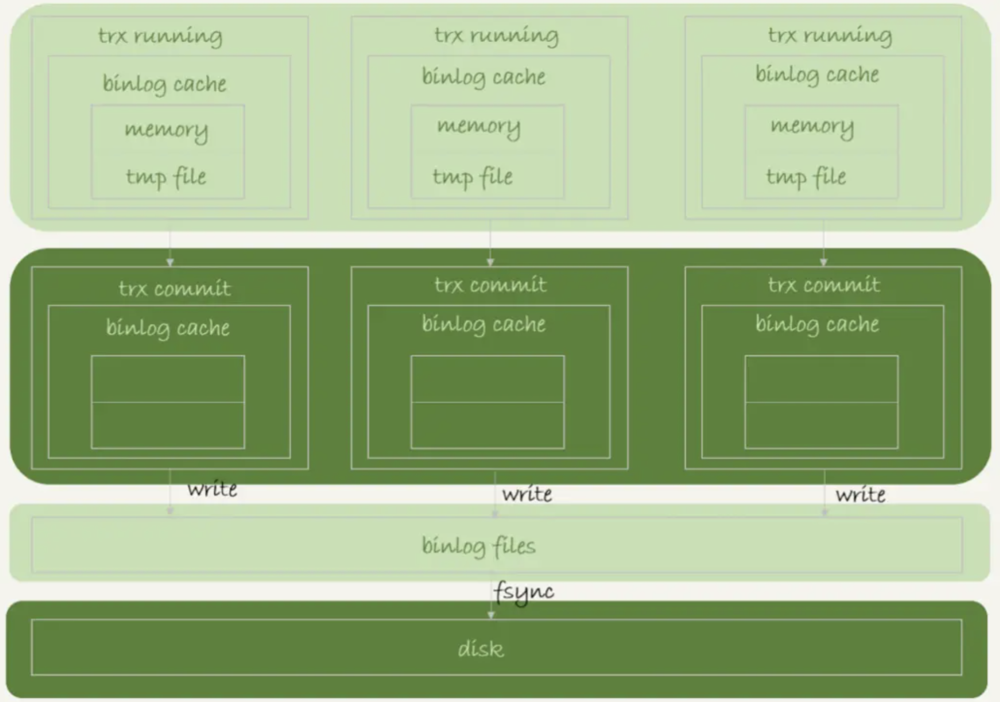
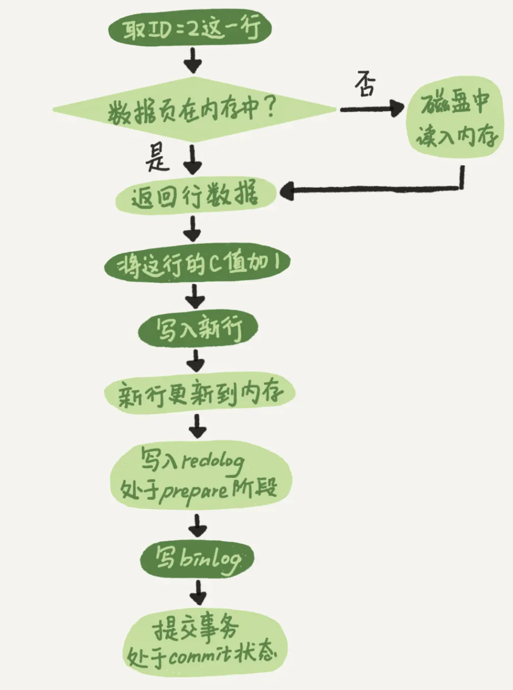
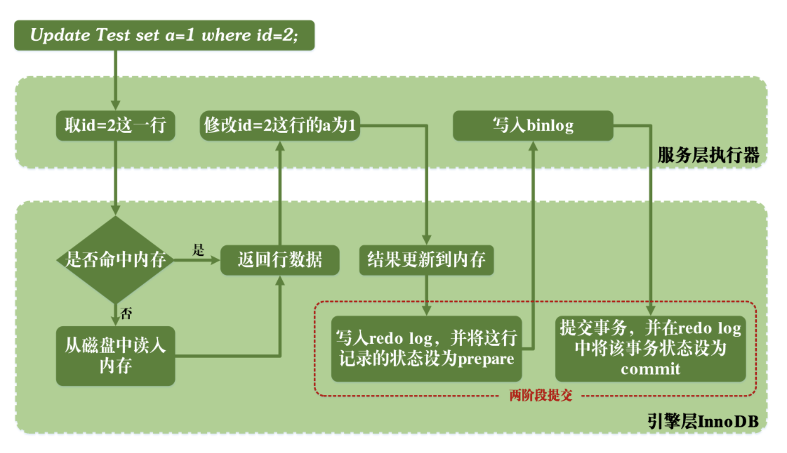

>本文介绍 MySQL 的日志，同时会介绍一个 SQL 更新语句的执行过程。

# 背景

SQL 更新语句和查询语句的大致流程类似，首先通过连接器连接数据库，然后分析器会通过词法和语法解析知道这是更新语句（跟这个表有关的查询缓存会失效）。

与查询流程不一样的是，更新流程还涉及两个重要的日志模块：redo log（重做日志）和 binlog（归档日志）

# 名词介绍

**物理/逻辑日志**

物理日志记录的是修改页的的详情，逻辑日志记录的是操作语句。物理日志恢复的速度快于逻辑日志。

# redo log

redo log 是**事务日志、物理机日志**

先写日志再写磁盘的过程就是 WAL 技术（Write-Ahead Logging）。

当有一条记录需要更新的时候，InnoDB 引擎就会先把记录写到 redo log 里面，并更新内存，此时更新就算完成了。同时，InnoDB 引擎会在适当的时候，将这个操作记录更新到磁盘里面，而这个更新往往是在系统比较空闲的时候做。

InnoDB 的 redo log 是固定大小的。如果 redo log 满了，就会将 redo log 中一部分的记录更新到磁盘，然后将这些记录从 redo log 中删除腾出空间。

redo log 大小固定，从头开始写，写到末尾会重头开始写。




write pos 是当前记录的位置，一边写一边后移，写到第 3 号文件末尾后就回到 0 号文件开头。checkpoint 是当前要擦除的位置，也是往后推移并且循环的，擦除记录前要把记录更新到数据文件。

有了 redo log，InnoDB 就可以保证即使数据库发生异常重启，之前提交的记录都不会丢失，这个能力称为 crash-safe。

## redo log作用

保证事务的原子性和持久性。

redo log 是重做日记，属于 InnoDB 引擎的日志。

前滚操作：具备 crash-safe 能力，提供断电重启时解决事务丢失数据问题。

提高性能：先写 redo log记录更新。当等到有空闲线程、内存不足、redo log 满了时刷脏。写 redo log 是顺序写入，刷脏是随机写，节省的是随机写磁盘的 IO 消耗（转成顺序写），所以性能得到提升。此技术称为 WAL 技术：Write-Ahead Logging，它的关键点就是先写日记磁盘，再写数据磁盘。

## redo log写入机制

redo log 可能存在的三种状态，对应下图中的三个颜色块：




[MySQL redo log 存储状态]

这三种状态分别是：

1、存在 redo log buffer 中，物理上是在 MySQL 进程内存中，就是图中的红色部分；

2、写到磁盘 (write)，但是没有持久化（fsync)，物理上是在文件系统的 page cache 里面，也就是图中的黄色部分；

3、持久化到磁盘，对应的是 hard disk，也就是图中的绿色部分。

日志写到 redo log buffer 是很快的，wirte 到 page cache 也差不多，但是持久化到磁盘的速度就慢多了。

### redo log持久化

为了控制 redo log 的写入策略，InnoDB 提供了 innodb_flush_log_at_trx_commit 参数，它有三种可能取值（默认为1）：

0 表示每次事务提交时都只是把 redo log 留在 redo log buffer 中 ;

1 表示每次事务提交时都将 redo log 直接持久化到磁盘；

2 表示每次事务提交时都只是把 redo log 写到 page cache。

InnoDB 有一个后台线程，每隔 1 秒就会把 redo log buffer 中的日志，调用 write 写到文件系统的 page cache，然后调用 fsync 持久化到磁盘。

注意，事务执行中间过程的 redo log 也是直接写在 redo log buffer 中的，这些 redo log 也会被后台线程一起持久化到磁盘。也就是一个没有提交的事务的 redo log，也是可能已经持久化到磁盘的。

实际除了后台线程每秒一次的轮询操作外，还有两种场景会让一个没有提交的事务的 redo log 写入到磁盘中：

1、**redo log buffer 占用的空间即将达到 innodb_log_buffer_size 一半的时候，后台线程会主动写盘**。

注意，由于这个事务并没有提交，所以这个写盘动作只是 write，而没有调用 fsync，也就是只留在了文件系统的 page cache。

2、**并行的事务提交的时候，顺带将这个事务的 redo log buffer 持久化到磁盘**。

假设一个事务 A 执行到一半，已经写了一些 redo log 到 buffer 中，这时候有另外一个线程的事务 B 提交，如果 innodb_flush_log_at_trx_commit 设置的是 1，那么按照这个参数的逻辑，事务 B 要把 redo log buffer 里的日志全部持久化到磁盘。这时候，就会带上事务 A 在 redo log buffer 里的日志一起持久化到磁盘。


两阶段提交时序上 redo log 先 prepare， 再写 binlog，最后再把 redo log commit。如果把 innodb_flush_log_at_trx_commit 设置成 1，那么 redo log 在 prepare 阶段就要持久化一次，因为有一个崩溃恢复逻辑是要依赖于 prepare 的 redo log，再加上 binlog 来恢复的。

每秒一次后台轮询刷盘，再加上崩溃恢复这个逻辑，InnoDB 就认为 redo log 在 commit 时就不需要 fsync 了，只会 write 到文件系统的 page cache 中就够了。

通常 MySQL 的“双 1”配置，指 sync_binlog 和 innodb_flush_log_at_trx_commit 都设置成 1。也就是说，一个事务完整提交前，需要等待两次刷盘，一次是 redo log（prepare 阶段），一次是 binlog。

### 组提交(group commit)

MySQL 看到的 TPS 是每秒两万的话，每秒就会写四万次磁盘。但用工具测试，磁盘能力也就两万左右，怎么能实现两万的 TPS？

日志逻辑序列号（log sequence number，LSN）是单调递增的，用来对应 redo log 的一个个写入点。每次写入长度为 length 的 redo log， LSN 的值就会加上 length。

LSN 也会写到 InnoDB 的数据页中，来确保数据页不会被多次执行重复的 redo log。




[redo log组提交]

上图所示，三个并发事务 (trx1, trx2, trx3) 在 prepare 阶段，都写完 redo log buffer，持久化到磁盘的过程，对应的 LSN 分别是 50、120 和 160。

由图得到：

1、trx1 是第一个到达的，会被选为这组的 leader；

2、等 trx1 要开始写盘的时候，这个组里面已经有了三个事务，这时候 LSN 也变成了 160；

3、trx1 去写盘的时候，带的就是 LSN=160，因此等 trx1 返回时，所有 LSN 小于等于 160 的 redo log，都已经被持久化到磁盘；

4、此时 trx2 和 trx3 就可以直接返回了。

所以一次组提交里面，组员越多，节约磁盘 IOPS 的效果越好。但如果只有单线程压测，那就只能老老实实地一个事务对应一次持久化操作了。

在并发更新场景下，第一个事务写完 redo log buffer 以后，接下来这个 fsync 越晚调用，组员可能越多，节约 IOPS 的效果就越好。

为了让一次 fsync 带的组员更多，MySQL 有一个很有趣的优化：拖时间。

两阶段提交的过程：

1、写入 redo log，处于 prepare 阶段

2、写 binlog

3、提交事务，处于 commit 阶段

实际上，第 2 步写 binlog 是分为两步的：

1）先把 binlog 从 binlog cache 中写到磁盘上的 binlog 文件；

2）调用 fsync 持久化。

MySQL 为了让组提交的效果更好，把 redo log 做 fsync 的时间拖到了步骤 1 之后。也就是两阶段提交的细化过程：

1、redo log prepare; write

2、binlog; write

3、redo log prepare; fsync

4、binlog; fsync

5、redo log commit; write


不过通常情况下上面第 3 步执行得会很快，所以 binlog 的 write 和 fsync 间的间隔时间短，导致能集合到一起持久化的 binlog 比较少，因此 binlog 的组提交的效果通常不如 redo log 的效果那么好。

如果想提升 binlog 组提交的效果，可以通过设置 binlog_group_commit_sync_delay 或 binlog_group_commit_sync_no_delay_count 来实现。

1、binlog_group_commit_sync_delay 参数，表示延迟多少微秒后才调用 fsync;

2、binlog_group_commit_sync_no_delay_count 参数，表示累积多少次以后才调用 fsync。

每次提交事务都要写 redo log 和 binlog，WAL 机制主要得益于两个方面：

1、redo log 和 binlog 都是顺序写，磁盘的顺序写比随机写速度要快；

2、组提交机制，可以大幅度降低磁盘的 IOPS 消耗。


如果出现了 IO 性能瓶颈，可以考虑以下几种方法：

1、设置 binlog_group_commit_sync_delay 和 binlog_group_commit_sync_no_delay_count 参数，减少 binlog 的写盘次数。这个方法是基于“额外的故意等待”来实现的，因此可能会增加语句的响应时间，但没有丢失数据的风险。

2、将 sync_binlog 设置为大于 1 的值（比较常见是 100~1000）。风险：主机掉电会丢 binlog 日志。

3、将 innodb_flush_log_at_trx_commit 设置为 2。风险：主机掉电的时候会丢数据。

（不建议把 innodb_flush_log_at_trx_commit 设置成 0。因为这表示 redo log 只保存在内存，MySQL 本身异常重启也会丢数据风险太大。而 redo log 写到文件系统的 page cache 的速度也是很快的，所以将这个参数设置成 2 跟设置成 0 其实性能差不多，但这样做 MySQL 异常重启时就不会丢数据，相比之下风险更小。）


FAQ

1、执行 update 语句以后，再去执行 hexdump 命令直接查看 ibd 文件内容，没有看到数据有改变？

可能是因为 WAL 机制的原因。update 语句执行完成后，InnoDB 只保证写完了 redo log、内存，可能还没来得及将数据写到磁盘。

2、为什么 binlog cache 是每个线程自己维护的，而 redo log buffer 是全局共用的？

这么设计的主要原因是，binlog 是不能“被打断的”。一个事务的 binlog 必须连续写，因此要整个事务完成后，再一起写到文件里。

而 redo log 并没有这个要求，中间有生成的日志可以写到 redo log buffer 中。redo log buffer 中的内容还能“搭便车”，其他事务提交的时候可以被一起写到磁盘中。

3、事务执行期间，没到提交阶段，如果发生 crash，redo log 丢了会不会导致主备不一致？

不会。因为这时候 binlog 也还在 binlog cache 里，没发给备库。crash 以后 redo log 和 binlog 都没有了，从业务角度看这个事务也没有提交，所以数据是一致的。

4、binlog 写完盘后发生 crash，这时还没给客户端答复就重启。等客户端再重连进来，发现事务已经提交成功了，是 bug？

不是 bug。实际上数据库的 crash-safe 保证的是：

1、如果客户端收到事务成功的消息，事务一定持久化了；

2、如果客户端收到事务失败（比如主键冲突、回滚等）的消息，事务就一定失败了；

3、如果客户端收到“执行异常”的消息，应用需要重连后通过查询当前状态来继续后续的逻辑。此时数据库只需要保证内部（数据和日志之间，主库和备库之间）一致就可以。

联想更极端的情况，如果整个事务都提交了，从库也收到 binlog 并执行了，但主库和客户端网络断开，导致事务成功的包无法返回，那么这种也算事务成功执行的。

## flush

当内存数据页跟磁盘数据页内容不一致的时候，我们称这个内存页为“脏页”。内存数据写入到磁盘后，内存和磁盘上的数据页的内容就一致了，称为“干净页”。

将脏页数据写到磁盘中。称作刷脏页（flush）。

### 触发flush

1、redo log 空间满了。

2、系统内存不足。

需要淘汰一些数据页，空出内存给别的数据页使用。如果淘汰的是“脏页”，需要先将脏页写到磁盘

3、系统“空闲”时。

4、MySQL正常关闭时。

下次启动时可以直接从磁盘读数据，启动速度更快。

针对第 1 种情况，要尽量避免，对性能影响较大。

针对第 2 种情况是常态。InnoDB 用缓冲池（buffer pool）管理内存，缓冲池中的内存页有三种状态：

1、还没有使用的；

2、使用了并且是干净页；

3、使用了并且是脏页。

InnoDB 的策略是尽量使用内存，因此对于一个长时间运行的库来说，未被使用的页面很少。

但是出现以下两种情况，会明显影响性能。

1、一个查询要淘汰的脏页个数太多，会导致查询的响应时间明显变长；

2、日志写满，更新全部堵住，写性能跌为 0。

所以，InnoDB 需要有控制脏页比例的机制，来尽量避免上面的这两种情况。

### flush控制策略

1、设置磁盘 IO 能力

通过 innodb_io_capacity 参数设置磁盘的 IO 能力，建议设置成磁盘的 IOPS。

fio 工具可以测试磁盘的 IOPS

```shell
fio -filename=$filename -direct=1 -iodepth 1 -thread -rw=randrw -ioengine=psync -bs=16k -size=500M -numjobs=10 -runtime=10 -group_reporting -name=mytest 
```

2、脏页比例

参数 innodb_max_dirty_pages_pct 是脏页比例上限，默认值是 75%。

**脏页比例**是通过 Innodb_buffer_pool_pages_dirty/Innodb_buffer_pool_pages_total 得到的，命令参考：

从mysql5.7.6开始information_schema.global_status已经开始被舍弃，为了兼容性，此时需要打开 show_compatibility_56

```sql
show variables like '%show_compatibility_56%'; # 查看状态
# 方法1：临时打开
set global show_compatibility_56=on;
# 方法2：永久打开
vim /etc/my.cnf
show_compatibility_56 = 1  # 添加该行
```
查看脏页比例命令：
```sql
use information_schema;
select VARIABLE_VALUE into @a from global_status where VARIABLE_NAME = 'Innodb_buffer_pool_pages_dirty';
select VARIABLE_VALUE into @b from global_status where VARIABLE_NAME = 'Innodb_buffer_pool_pages_total';
select @a/@b;
```


3、刷脏页速度

InnoDB 会根据当前的脏页比例（假设为 M），算出一个范围在 0 到 100 之间的数字 F1(M)，计算这个数字的伪代码类似这样：

```c++
F1(M)
{
  if M>=innodb_max_dirty_pages_pct then
      return 100;
  return 100*M/innodb_max_dirty_pages_pct;
}
```

InnoDB 每次写入的日志都有一个序号，当前写入的序号跟 checkpoint 对应的序号之间的差值，假设为 N。InnoDB 根据 N 算出一个范围在 0 到 100 之间的数字，计算公式可以 F2(N)。这个算法比较复杂， N 越大值越大。

根据上述算得的 F1(M) 和 F2(N) 两个值，取其中较大的值记为 R，之后引擎就可以按照 innodb_io_capacity 定义的能力乘以 R% 来控制刷脏页的速度。

4、刷新相邻页面策略

一旦一个查询请求需要在执行过程中先 flush 掉一个脏页时，该查询可能比平时慢。

而 MySQL 中的一个机制，可能会让查询更慢：

在准备刷一个脏页时，如果该数据页旁边的数据页刚好是脏页，就会把这个“邻居”一起刷掉；而且这个把“邻居”拖下水的逻辑还可以继续蔓延，即对于每个邻居数据页，如果跟它相邻的数据页也还是脏页的话，也会被放到一起刷。

InnoDB 中，innodb_flush_neighbors 参数用来控制该行为，值为 1 时会有上述的“连坐”机制，开启脏页相邻淘汰，值为 0 时表示关闭脏页相邻淘汰。（MySQL 8.0中，默认 0）

找“邻居”这个优化在机械硬盘时代是很有意义的，可以减少很多随机 IO。机械硬盘的随机 IOPS 一般只有几百，相同的逻辑操作减少随机 IO 就意味着系统性能的大幅度提升。

SSD IOPS 值有上千，建议设置该参数为 0。


# binlog

MySQL 整体来看分为两块：Server 层主要做的是功能层面的事情；引擎层负责存储相关的具体事宜。redo log 是 InnoDB 引擎特有的日志，而 Server 层也有自己的日志，称为 binlog（归档日志）。

## 为什么会有两份日志

最开始 MySQL 里并没有 InnoDB 引擎。MySQL 自带的引擎是 MyISAM，但是 MyISAM 没有 crash-safe 的能力，binlog 日志只能用于归档。而 InnoDB 是另一个公司以插件形式引入 MySQL 的，既然只依靠 binlog 是没有 crash-safe 能力的，所以 InnoDB 使用另外一套日志系统，也就是 redo log 来实现 crash-safe 能力。

## binlog写入机制

写入逻辑：事务执行过程中，先把日志写到 binlog cache，事务提交的时候，再把 binlog cache 写到 binlog 文件中。

一个事务的 binlog 是不能被拆开的，因此不论这个事务多大，也要确保一次性写入。涉及到 binlog cache 的保存问题。

系统给 binlog cache 分配了一片内存，每个线程一个，参数 binlog_cache_size 用于控制单个线程内 binlog cache 所占内存的大小。如果超过了这个参数规定的大小，就要暂存到磁盘。

事务提交的时候，执行器把 binlog cache 里的完整事务写入到 binlog 中，并清空 binlog cache。




[binlog写盘状态]

可以看到，每个线程有自己的 binlog cache，但是共用同一份 binlog 文件。上图中的 write，指的就是指把日志写入到文件系统的 page cache，并没有把数据持久化到磁盘，所以速度比较快。图中的 fsync，才是将数据持久化到磁盘的操作。一般情况下认为 fsync 才占磁盘的 IOPS。

### binlog持久化

write 和 fsync 的时机，是由参数 sync_binlog 控制的：

1、sync_binlog=0 的时候，表示每次提交事务都只 write，不 fsync；

2、sync_binlog=1 的时候，表示每次提交事务都会执行 fsync；

3、sync_binlog=N(N>1) 的时候，表示每次提交事务都 write，但累积 N 个事务后才 fsync。

出现 IO 瓶颈时，将 sync_binlog 设置成一个比较大的值，可以提升性能。在实际的业务场景中，考虑到丢失日志量的可控性，一般不建议将这个参数设成 0，常见将其设置为 100~1000 中的某个数值。

将 sync_binlog 设置为 N，对应的风险是：如果主机发生异常重启，会丢失最近 N 个事务的 binlog 日志。

## binlog日志格式

statement：记录执行的 SQL 语句。

row：会记录行的内容（包括 id），记两条，更新前和更新后都有。

mixed：以上两种混合，可以利用 statment 格式的优点，同时又避免了数据不一致的风险。

mixed 格式存在的场景：

1、有些 statement 格式的 binlog 可能会导致主备不一致，所以要使用 row 格式。原因：如果 where 条件中有多个索引，主备库在执行这条语句时，选择的索引可能不同执行结果也就不同。

2、row 格式的缺点是很占空间。比如一个 delete 语句删掉 10 万行数据，用 statement 的话就是一个 SQL 语句被记录到 binlog 中，占用几十个字节的空间。但如果用 row 格式就要把这 10 万条记录都写到 binlog 中。这样不仅会占用更大的空间，同时写 binlog 也要耗费 IO 资源，影响执行速度。

3、折中方案，MySQL 会判断 SQL 语句是否可能引起主备不一致，如果可能就用 row 格式，否则就用 statement 格式。

现在越来越多的场景要求把 MySQL 的 binlog 格式设置成 row。比如恢复数据。row 格式记录了操作前后的数据，可以直接恢复。

由 delete、insert 或者 update 语句导致的数据操作错误，需要恢复到操作之前状态的情况，也时有发生。MariaDB 的 [Flashback](https://mariadb.com/kb/en/library/flashback) 工具就是基于这种原理来回滚数据的。

mix 格式举例：

```sql
insert into t values(10,10, now());
```
查看 binlog 日志是 statement 格式。
mysqlbinlog 工具查看，原来 binlog 在记录 event 的时候，多记了一条命令：SET TIMESTAMP=1546103491。它用 SET TIMESTAMP 命令约定了接下来的 now() 函数的返回时间。

因此，得出结论：重放 binlog 数据，将 statement 语句直接拷贝出来执行有很大风险。

标准做法：

```shell
mysqlbinlog master.000001  --start-position=2738 --stop-position=2973 | mysql -h127.0.0.1 -P13000 -u$user -p$pwd;
```
(将 master.000001 文件里面从第 2738 字节到第 2973 字节中间这段内容解析出来，放到 MySQL 去执行。)
# undo log

(逻辑日志)——记录相反的sql语句

1、保证事务的一致性

2、InnoDB的MVCC


# 日志对比

## redo log与binlog对比

|    |redo log|binlog|
|:----|:----|:----|
|日志类型|物理日志|逻辑日志|
|文件大小|大小固定|可通过参数max_binlog_size设置每个binlog文件的大小|
|实现方式|由innodb引擎层实现，不是所有引擎都有|由service层实现，所有引擎都可以使用|
|记录|采用循环写的方式记录，当写到结尾时，会回到开头循坏写日志|通过追加的方式记录，当文件大小大于给定值后，后续的日志会记录到新的文件上|
|适用场景|适用于崩溃恢复（crash-safe）|适用于主从复制和数据恢复|


# update语句执行流程

update 语句：

```shell
mysql> update T set c=c+1 where ID=2;
```
1、执行器先找引擎取 ID=2 这一行。ID 是主键，引擎直接用树搜索找到这一行。如果 ID=2 这一行所在的数据页本来就在内存中，就直接返回给执行器；否则，需要先从磁盘读入内存，然后再返回。
2、执行器拿到引擎给的行数据，把这个值加上 1，比如原来是 N，现在就是 N+1，得到新的一行数据，再调用引擎接口写入这行新数据。

3、引擎将这行新数据更新到内存中，同时将这个更新操作记录到 redo log 里面，此时 redo log 处于 prepare 状态。然后告知执行器执行完成了，随时可以提交事务。

4、执行器生成这个操作的 binlog，并把 binlog 写入磁盘。

5、执行器调用引擎的提交事务接口，引擎把刚刚写入的 redo log 改成提交（commit）状态，更新完成。

update 语句执行流程图





# 两阶段提交

更新内存后引擎层写 Redo log 将状态改成 prepare 为预提交第一阶段，Server 层写 Binlog，将状态改成 commit为提交第二阶段。两阶段提交可以确保 Binlog 和 Redo log 数据一致性。

## 数据备份同步

1、找到最近时间的全量备份；

2、基于备份的时间点重放 binlog。

## 容灾恢复过程

1、判断 redo log 是否完整，如果判断是完整（commit）的，直接用 Redo log 恢复

2、如果 redo log 只是预提交 prepare 但不是 commit 状态，这个时候就会去判断 binlog 是否完整，如果完整就提交 Redo log，用 redo log 恢复，不完整就回滚事务，丢弃数据。

**只有在 redo log 状态为 prepare 时，才会去检查 binlog 是否存在，否则只校验 redo log 是否是 commit 就可以啦。**

怎么检查 binlog：一个完整事务 binlog 结尾有固定的格式。

1、statement 格式的 binlog，最后会有 COMMIT；

2、row 格式的 binlog，最后会有一个 XID event。

另外，在 MySQL 5.6.2 版本以后，还引入了 binlog-checksum 参数，用来验证 binlog 内容的正确性。

## 两阶段提交分析

1、先写 redo log 后写 binlog。

假设 redo log 写完，binlog 还没写完。系统异常重启，那么系统仍然可以根据 redo log 将数据恢复。

但是 binlog 没有写完就 crash 了，没有该更新记录。因此之后备份数据恢复的时候，自然也没有该更新记录。使用 binlog 恢复临时库就会发生与原库数据不同的问题。

2、先写 binlog 后写 redo log

假设 binlog 写完，redo log 还没写完。系统异常重启，因为 redo log 中没有该更新记录，库中的记录还是原来的值。但是 binlog 已经存在更新记录，所以之后用 binlog 恢复临时库该记录就是新的值，与原库数据不同。

鉴此，两阶段提交可以保证 redo log 和 binlog 数据的一致性。即两个日志都可以表示事物的提交状态。

# change buffer

当需要更新一个数据页时，如果数据页在内存中就直接更新，而如果这个数据页还没有在内存中的话，在不影响数据一致性的前提下，InnoDB 会将这些更新操作直接缓存在 change buffer 中，这样就不需要从磁盘中读入这个数据页再更新了。

**「change buffer 主要节省的则是随机读磁盘的 IO 消耗」**，下次查询读取数据页时用上 change buffer 中的记录即可。

change buffer 可以持久化，在内存中有拷贝，也会被写入到磁盘上。

将更新操作先记录在 change buffer，减少读磁盘，语句的执行速度会明显提升。而且，数据读入内存是需要占用 buffer pool 的，所以还能够避免占用内存，提高内存利用率。

## merge

将 change buffer 中的操作应用到原数据页，得到最新结果的过程称为 merge。除了访问这个数据页会触发 merge 外，系统有后台线程会定期 merge。在数据库正常关闭（shutdown）的过程中，也会执行 merge 操作。

## cb使用条件

唯一索引的更新就不能使用 change buffer，实际上也只有普通索引可以使用。

因为对于唯一索引来说，所有的更新操作都要先判断操作是否违反唯一性约束。必须要将数据页读入内存才能判断。如果都已经读入到内存了，那直接更新内存会更快，就没必要使用 change buffer 了。

## cb限制

change buffer 用的是 buffer pool 里的内存，因此不能无限增大。

change buffer 的大小，可以通过参数 innodb_change_buffer_max_size 来动态设置。这个参数设置为 50 的时候，表示 change buffer 的大小最多只能占用 buffer pool 的 50%。

## cb插入数据流程

### 目标页在内存中

* 对于唯一索引，目标页在内存中，直接判断唯一索引值是否冲突，然后插入数据，语句执行结束
* 对于普通索引，找到目标页中插入数据的位置，插入该记录，语句执行结束

### 目标页不在内存中

* 对于唯一索引，需要将数据页读入内存，判断是否冲突，然后插入数据，语句执行结束
* 对于普通索引，将记录插入 change buffer，语句执行结束

## cb使用场景

首先，change buffer 只限于用在普通索引的场景下，而不适用于唯一索引。

其次，因为 merge 的时候是真正进行数据更新的时刻，而 change buffer 的主要目的就是将记录的变更动作缓存下来，所以在一个数据页做 merge 之前，change buffer 记录的变更越多（也就是这个页面上要更新的次数越多），收益就越大。

因此，对于写多读少的业务来说，页面在写完以后马上被访问到的概率比较小，此时 change buffer 的使用效果最好。这种业务模型常见的就是账单类、日志类的系统。

相反，如果一个业务是写入数据后立即查询，会触发 merge 过程，随机访问 IO 的次数不会减少，且会增加 change buffer 的维护代价。这种业务下 change buffer 反而起到了副作用。


# 日志延伸

## **change buffer 和 redo log**

redo log 主要节省的是随机写磁盘的 IO 消耗（转成顺序写），而 change buffer 主要节省的则是随机读磁盘的 IO 消耗。

redo log 与 change buffer (含磁盘持久化) 这 2 个机制，不同之处在于优化了整个变更流程的不同阶段。

先不考虑这二者机制，简化抽象一个更新 (insert、update、delete) 流程：

1、从磁盘读取待变更的行所在的数据页，读入内存页中

2、对内存页中的行，执行变更操作

3、将变更后的数据页，写入至数据磁盘中

其中，流程中的步骤 1 涉及随机读磁盘 IO；步骤 3 涉及随机写磁盘 IO；刚好对应 change buffer 和 redo log。

根据以上流程得出结论：

1、change buffer 机制，优化了步骤 1——避免了随机读磁盘 IO ，将不在内存中的数据页的操作写入 change buffer 中，而不是将数据页从磁盘读入内存页中

2、redo log 机制， 优化了步骤 3——避免了随机写磁盘 IO，将随机写磁盘，优化为了顺序写磁盘(写 redo log，确保 crash-safe)

change buffer 机制不是一直会被应用到，仅当待操作的数据页当前不在内存中，需要先读磁盘加载数据页时，change buffer 才有用武之地。而 redo log 机制，为了保证 crash-safe 会一直被用到。

## checkpoint

redo log中带有checkpoint,用来高效的恢复数据.


# 最佳实践

## flush案例

一个内存配置为 128GB、innodb_io_capacity 设置为 20000 的大规格实例，正常会建议将 redo log 设置成 4 个 1GB 的文件。

如果配置时不慎将 redo log 设置成了 1 个 100M 的文件，会发生的情况及原因？

每次事务提交都要写 redo log，如果设置太小很快就会被写满，write pos 一直追着 checkpoint。

此时系统不得不停止所有更新去推进 checkpoint。

现象：磁盘压力很小，数据库出现间歇性的性能下跌。

## 生产库非双1场景

通常 MySQL 的“双 1”配置，指的就是 sync_binlog 和 innodb_flush_log_at_trx_commit 都设置成 1。也就是一个事务完整提交前，需要等待两次刷盘，一次是 redo log（prepare 阶段），一次是 binlog。

非双1场景有如下：

1、业务高峰期。一般如果有预知的高峰期，DBA 会有预案，把主库设置成“非双 1”。

2、备库延迟，为了让备库尽快赶上主库。

3、用备份恢复主库的副本，应用 binlog 的过程，跟第 2 个场景类似。

4、批量导入数据的时候。

一般情况下，把生产库改成“非双 1”配置，是设置 innodb_flush_logs_at_trx_commit=2、sync_binlog=1000。

# 日志FAQ

## red log和binlog关联

它们有一个共同的数据字段，叫 XID。崩溃恢复的时候，会按顺序扫描 redo log：

1、如果碰到既有 prepare、又有 commit 的 redo log，就直接提交；

2、如果碰到只有 parepare、而没有 commit 的 redo log，就拿着 XID 去 binlog 找对应的事务。

## 两阶段提交的必要性

处于 prepare 阶段的 redo log 加上完整 binlog，重启就能恢复，为什么还要两阶段提交？

两阶段提交是经典的分布式系统问题，并不是 MySQL 独有的。

两阶段提交的必要性，是事务的持久性问题。

对于 InnoDB 引擎来说，如果 redo log 提交完成了，事务就不能回滚（如果这还允许回滚，就可能覆盖掉别的事务的更新）。而如果 redo log 直接提交，然后 binlog 写入的时候失败，InnoDB 又回滚不了，数据和 binlog 日志又不一致了。两阶段提交就是为了进可攻退可守。

## redo log一般设置多大

redo log 太小会导致很快就被写满，不得不强行刷 redo log，这样 WAL 机制的能力就发挥不出来。

现在常见的几个 TB 的磁盘的话，可以直接将 redo log 设置为 4 个文件、每个文件 1GB 。

## redo log最终落盘

正常运行中的实例，数据写入后的最终落盘，是从 redo log 更新过来的还是从 buffer pool 更新过来的呢？

涉及 redo log 里面是什么。

redo log 记录了"在某个数据页上做了什么修改"，而不是"这个数据修改后最新的值"。因此是需要先把磁盘的数据读入内存再执行 redo log 中的内容。

1、正常运行的实例的话，数据页被修改以后，跟磁盘的数据页不一致，称为脏页。最终数据落盘，就是把内存中的数据页写盘。这个过程，甚至与 redo log 毫无关系；

2、崩溃恢复场景中，InnoDB 如果判断一个数据页可能在崩溃恢复时丢失了更新，会将它读到内存，然后让 redo log 更新内存内容。更新完成后，内存页变成脏页，就回到了第 1 种情况的状态。

## redo log buffer是什么

先修改内存，还是先写 redo log 文件？

插入数据的过程中，生成的日志都得先保存起来，但又不能在还没 commit 的时候就直接写到 redo log 文件里。

所以 redo log buffer 就是一块内存，用来先存 redo 日志。即在执行更新操作时（未 commit），数据的内存被修改了，redo log buffer 也写入了日志。

但是，真正把日志写到 redo log 文件（文件名是 ib_logfile+ 数字），是在执行 commit 语句的时候做的。

# Reference

[https://bbs.huaweicloud.com/blogs/200758](https://bbs.huaweicloud.com/blogs/200758)

[https://mp.weixin.qq.com/s/e082trAojq6wu_SvTVPrsg](https://mp.weixin.qq.com/s/e082trAojq6wu_SvTVPrsg)
