>本文介绍基于 MySQL 的日志的主从架构

# 主从同步

从库和从库在概念上其实差不多。有的地方会把在 HA 过程中被选成新主库的，称为从库，其他的称为从库。

## 从库readonly

建议把从库设置成只读（readonly）模式。有以下几个考虑：

1、一些运营类查询语句可能会被放到从库上去查，设置为只读可以防止误操作；

2、防止切换逻辑有 bug，比如切换过程中出现双写，造成主从不一致；

3、可以用 readonly 状态，来判断节点的角色。

把从库设置成只读了，如何跟主库保持同步更新？readonly 设置对超级 (super) 权限用户是无效的，而用于同步更新的线程拥有超级权限。

## 主从同步流程

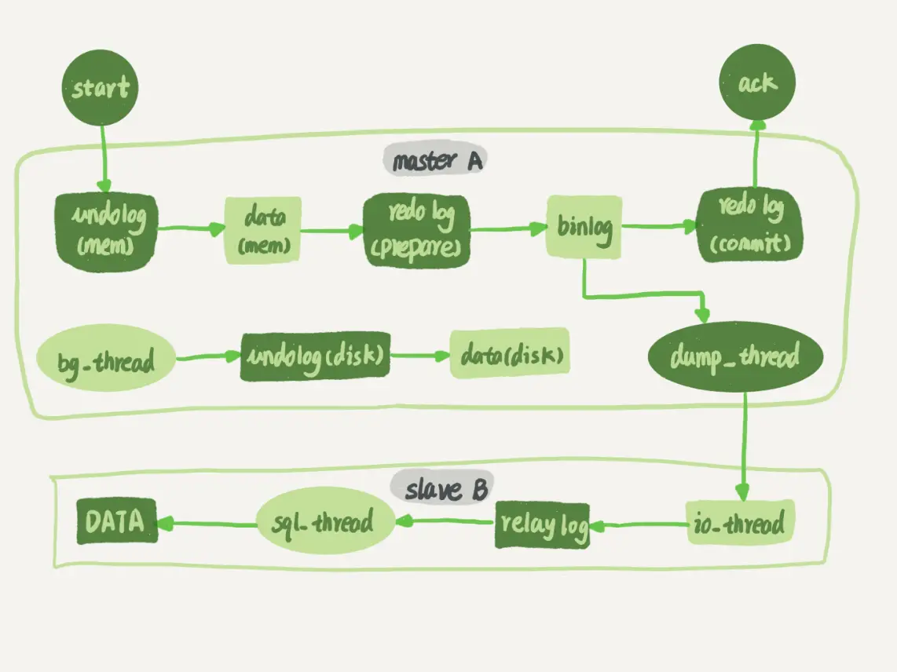


[主从同步流程图]

从库 B 跟主库 A 之间维持了一个长连接。主库 A 内部有一个线程，专门用于服务从库 B 的这个长连接。一个事务日志同步的完整过程是这样的：

1、在从库 B 上通过 change master 命令，设置主库 A 的 IP、端口、用户名、密码，以及要从哪个位置开始请求 binlog，这个位置包含文件名和日志偏移量。

2、在从库 B 上执行 start slave 命令，这时候从库会启动两个线程，就是图中的 io_thread 和 sql_thread。其中 io_thread 负责与主库建立连接。

3、主库 A 校验完用户名、密码后，开始按照从库 B 传过来的位置，从本地读取 binlog，发给 B。

4、从库 B 拿到 binlog 后，写到本地文件，称为中转日志（relay log）。

5、sql_thread 读取中转日志，解析出日志里的命令，并执行。

由于多线程复制方案的引入，sql_thread 后来演化成为了多个线程。

## 循环复制问题

（建议把参数 log_slave_updates 设置为 on，表示从库执行 relay log 后生成 binlog）

双节点双主库可能存在循环使用 binlog 同步数据的情况，可以通过 server id 解决，有如下规定：

1、规定两个库的 server id 必须不同，如果相同，则它们之间不能设定为主从关系；

2、一个从库接到 binlog 并在重放过程中，生成与原 binlog 的 server id 相同的新的 binlog；

3、每个库在收到从自己的主库发过来的日志后，先判断 server id，如果跟自己的相同，表示这个日志是自己生成的，就直接丢弃这个日志。

但这个机制其实并不完备，在某些场景下还是有可能出现死循环。比如：

1、在一个主库更新事务后，用命令 set global server_id=x 修改了 server_id。等日志再传回来的时候，发现 server_id 跟自己的 server_id 不同就只能执行了。

2、三个节点复制的场景，如 server id 是 B 节点产生的，binlog 传给 A 执行，然后 A 又和 A1 形成双 M 结构，就会出现循环复制。

数据迁移时会遇到这种三节点循环复制的问题，可以临时在迁移后的节点上（比如上面的 A 或 A1 ）执行：

```sql
stop slave；
CHANGE MASTER TO IGNORE_SERVER_IDS=(server_id_of_B);
start slave;
```
这样这个节点收到日志后就不会再执行。数据迁移完后，再执行下面的命令把改回来：
```sql
stop slave；
CHANGE MASTER TO IGNORE_SERVER_IDS=();
start slave;
```

# 主从延迟

MySQL 要提供高可用能力，只有最终一致性是不够的。

主从切换可能是一个主动运维动作，比如软件升级、主库所在机器按计划下线等，也可能是被动操作，比如主库所在机器掉电。

## 延迟时间计算

与数据同步有关的时间点主要包括以下三个：

1、主库 A 执行完成一个事务，写入 binlog，我们把这个时刻记为 T1；

2、之后传给从库 B，我们把从库 B 接收完这个 binlog 的时刻记为 T2；

3、从库 B 执行完成这个事务，我们把这个时刻记为 T3。

主从延迟就是同一个事务，在从库执行完成的时间和主库执行完成的时间之间的差值，也就是 T3-T1。

在从库上执行  `show slave status`  命令，返回结果里面会显示 seconds_behind_master，用于表示当前从库延迟了多少秒。seconds_behind_master 的计算方法是这样的：

1、每个事务的 binlog 里面都有一个时间字段，用于记录主库上写入的时间；

2、从库取出当前正在执行的事务的时间字段的值，计算它与当前系统时间的差值，得到 seconds_behind_master。

主从库机器的系统时间设置不一致，不会影响该值。因为，从库连接到主库时，会通过执行 SELECT UNIX_TIMESTAMP() 函数来获得当前主库的系统时间。如果发现主库的系统时间与自己不一致，从库在执行 seconds_behind_master 计算的时候会自动扣掉这个差值。

## 主从延迟原因

在网络正常的时候，日志从主库传给从库所需的时间是很短的，即 T2-T1 的值是非常小的。也就是说，网络正常情况下，主从延迟的主要来源是从库接收完 binlog 和执行完这个事务之间的时间差。

主从延迟最直接的表现是，从库消费中转日志（relay log）的速度，比主库生产 binlog 的速度要慢。可能是由以下原因导致的。

### 从库机器性能差

比如将众多从库都放在同一台机器上。

更新请求对 IOPS 的压力，在主库和从库上是无差别的。做这种部署时，一般都会将从库设置为“非双 1”的模式。

但实际上更新过程中也会触发大量的读操作。所以，当从库主机上的多个从库都在争抢资源的时候，就可能会导致主从延迟了。

一般比较常见是主从库机器相同，因为主从可能发生切换，从库随时可能变成主库，所以主从库选用相同规格的机器，并且做对称部署。

### 从库压力大

由于主库直接影响业务，使用起来会比较克制，反而忽视了从库的压力控制。结果就是，从库上的查询耗费了大量的 CPU 资源，影响了同步速度，造成主从延迟。如一些运营后台需要的分析语句。

处理方法：

1、一主多从。除了从库外，可以多接几个从库，让这些从库来分担读的压力。

2、通过 binlog 输出到外部系统，比如 Hadoop 这类系统，让外部系统提供统计类查询的能力。

### 大事务

主库上必须等事务执行完成才会写入 binlog，再传给从库。所以如果一个主库上的语句执行 10 分钟，那这个事务很可能就会导致从库延迟 10 分钟。比如一个典型的大事务场景：不要一次性地用 delete 语句删除太多数据。

### 大表DDL

处理方案就是计划内的 DDL，建议使用 gh-ost 方案

### 从库并行复制能力


## 应对策略

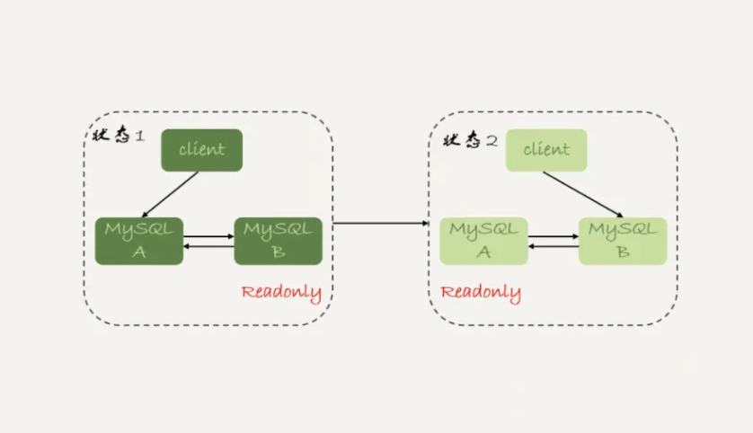


[主从切换流程-双 M 结构]

### 可靠性优先策略

在 [主从切换流程-双 M 结构] 下，从状态 1 到状态 2 切换的详细过程是这样的：

1、判断从库 B 现在的 seconds_behind_master，如果小于某个值（比如 5 秒）继续下一步，否则持续重试这一步；

2、把主库 A 改成只读状态，即把 readonly 设置为 true；

3、判断从库 B 的 seconds_behind_master 的值，直到这个值变成 0 为止；

4、把从库 B 改成可读写状态，也就是把 readonly 设置为 false；

5、把业务请求切到从库 B。

这个切换流程，一般是由专门的 HA 系统来完成的，暂时称之为可靠性优先流程。

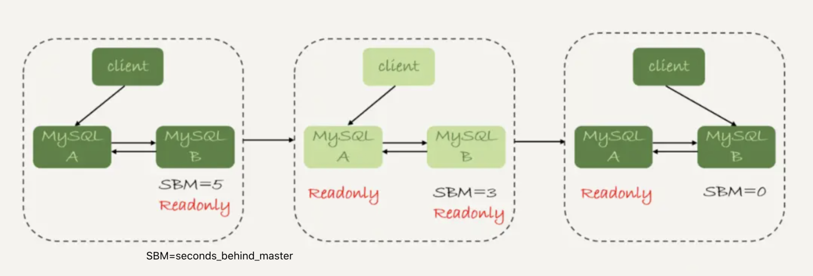


[可靠性优先主从切换流程]

这个切换流程中是有不可用时间的。因为在步骤 2 之后，主库 A 和从库 B 都处于 readonly 状态，也就是说这时系统处于不可写状态，直到步骤 5 完成后才能恢复。

### 可用性优先策略

如果强行把步骤 4、5 调整到最开始执行，也就是说不等主从数据同步，直接把连接切到从库 B，并且让从库 B 可以读写，那么系统几乎就没有不可用时间了。

这个切换流程暂时称作可用性优先流程。这个切换流程的代价，就是可能出现数据不一致的情况。分析如下：

表：

```sql
CREATE TABLE `t` (
  `id` int(11) unsigned NOT NULL AUTO_INCREMENT,
  `c` int(11) unsigned DEFAULT NULL,
  PRIMARY KEY (`id`)
) ENGINE=InnoDB;

insert into t(c) values(1),(2),(3);
```
这个表定义了一个自增主键 id，初始化数据后，主库和从库上都是 3 行数据。接下来继续在表 t 上执行两条插入语句的命令，依次是：
```sql
insert into t(c) values(4);
insert into t(c) values(5);
```
假设现在主库上其他的数据表有大量的更新，导致主从延迟达到 5 秒。在插入一条 c=4 的语句后，发起了主从切换。
**binlog 为 mixed 格式流程**

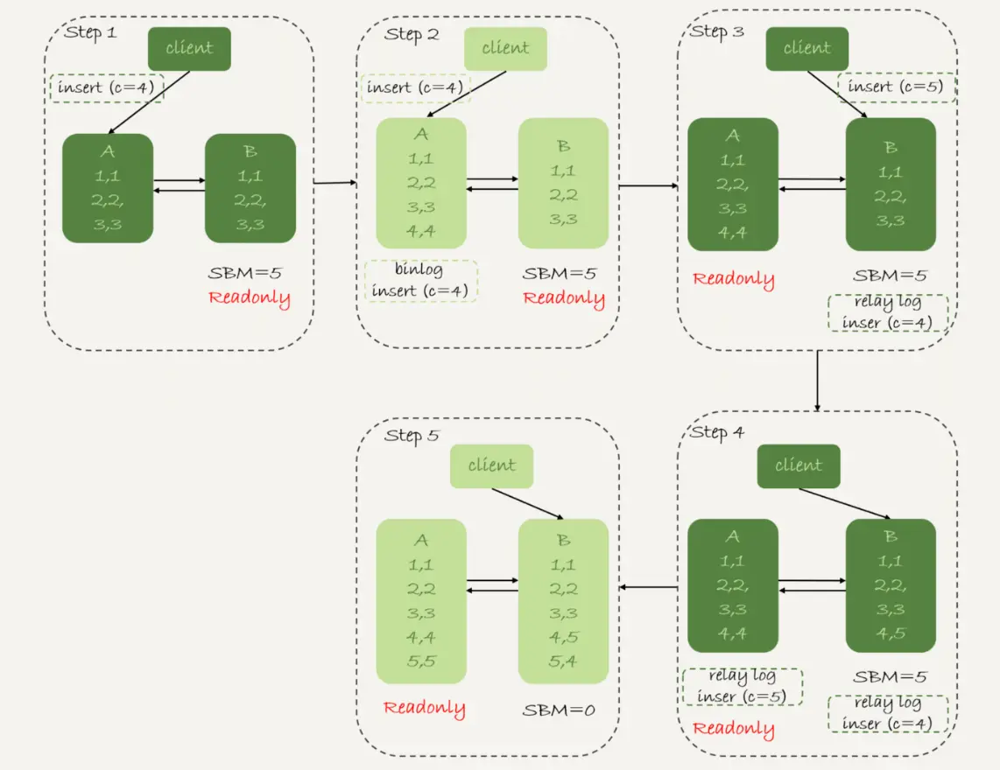


[可用性优先策略流程] （binlog_format=mixed）

切换流程：

1、步骤 2 中，主库 A 执行完 insert 语句，插入了一行数据（4,4），之后开始进行主从切换。

2、步骤 3 中，由于主从之间有 5 秒的延迟，所以从库 B 还没来得及应用“插入 c=4”这个中转日志，就开始接收客户端“插入 c=5”的命令。

3、步骤 4 中，从库 B 插入了一行数据（4,5），并且把这个 binlog 发给主库 A。

4、步骤 5 中，从库 B 执行“插入 c=4”这个中转日志，插入了一行数据（5,4）。而直接在从库 B 执行的“插入 c=5”这个语句，传到主库 A，就插入了一行新数据（5,5）。

最后的结果就是，主库 A 和从库 B 上出现了两行不一致的数据。可以看到，这个数据不一致，是由可用性优先流程导致的。

binlog 为 row 格式流程：

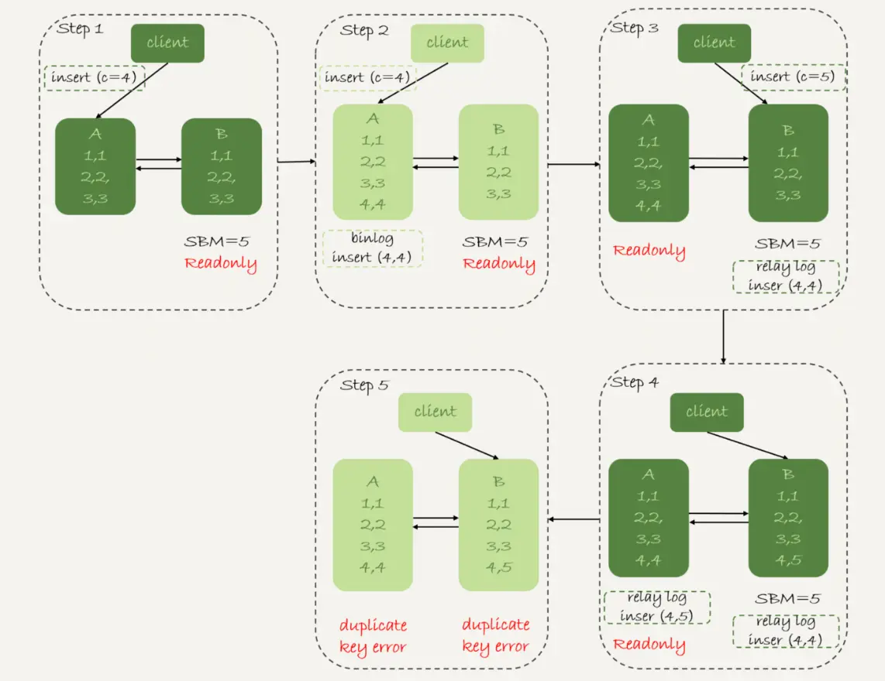


[可用性优先策略流程] （binlog_format=row）

因为 row 格式在记录 binlog 的时候，会记录新插入的行的所有字段值，所以最后只会有一行不一致。而且，两边的主从同步的应用线程会报错 duplicate key error 并停止。也就是说，这种情况下，从库 B 的 (5,4) 和主库 A 的 (5,5) 这两行数据，都不会被对方执行。

结论：

1、使用 row 格式的 binlog 时，数据不一致的问题更容易被发现。而使用 mixed 或者 statement 格式的 binlog 时，数据不一致很难发现且随着时间推移可能会造成更多数据逻辑不一致。

2、主从切换的可用性优先策略会导致数据不一致。大多数情况下建议使用可靠性优先策略。一般对数据服务来说，数据的可靠性一般优于可用性的。

可用性优先级更高的场景：

有个库的作用是记录操作日志。如果数据不一致可以通过 binlog 来修补，而这个短暂的不一致也不会引发业务问题。同时，业务系统依赖于这个日志写入逻辑，如果库不可写会导致线上的业务操作无法执行。

MySQL 的高可用性，依赖于主从延迟。主从延迟的时间越小，出现故障的时候，服务需要恢复的时间就越短，可用性就越高。

# 从库并行复制

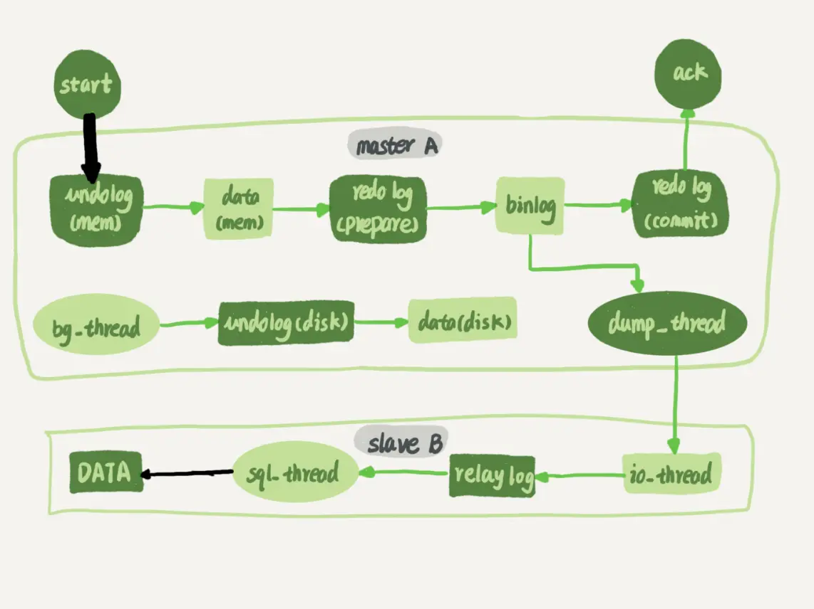


[主从同步流程图]

谈到主从的并行复制能力，要关注上图中黑色的两个箭头。一个箭头代表了客户端写入主库，另一箭头代表的是从库上 sql_thread 执行中转日志（relay log）。如果用箭头的粗细来代表并行度的话，那么真实情况就如图所示，第一个箭头要明显粗于第二个箭头。

主库影响并发度就是各种锁。由于 InnoDB 引擎支持行锁，除了所有并发事务都在更新同一行（热点行）这种极端场景外，对业务并发度的支持还是很友好。

而日志在从库执行，就是图中从库上 sql_thread 更新数据的逻辑。如果用单线程就会导致从库应用日志不够快，造成主从延迟。

## sql_thread多线程

在官方的 5.6 版本之前，MySQL 只支持单线程复制，由此在主库并发高、TPS 高时就会出现严重的主从延迟问题。MySQL 多线程复制的演进过程经历了好几个版本。

多线程复制机制，都是要把 [主从同步流程图] 中只有一个线程的 sql_thread，拆成多个线程，基本都符合下面的模型：

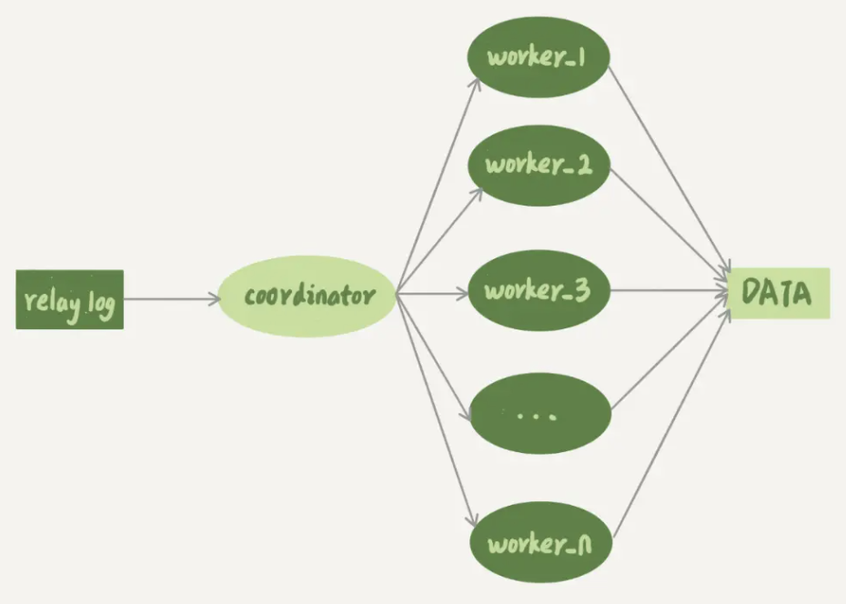


[sql_thread多线程模型]

coordinator 就是原来的 sql_thread，它不再直接更新数据，只负责读取中转日志和分发事务。真正更新日志的变成了 worker 线程。而 work 线程的个数，就是由参数 slave_parallel_workers 决定。根据经验把参数设置为 8~16 之间最好（32 核物理机），毕竟从库还有可能要提供读查询，不要占用过多 CPU。

事务能不能按照轮询的方式分发给各个 worker，否则 workder 独立执行速度快慢不一。同一个事物的多个 SQL 语句也不能分配给多个 worker 执行，否则破坏事务的隔离性（查询可能看到事务执行一半的结果）。

所以coordinator 在分发时，需要满足以下两个基本要求：

1、不能造成更新覆盖。这就要求更新同一行的两个事务，必须被分发到同一个 worker 中。

2、同一个事务不能被拆开，必须放到同一个 worker 中。

各个版本的多线程复制，都遵循了这两条基本原则。

## 通用并行复制策略

官方 MySQL 5.5 版本是不支持并行复制的，第三方开发了按表分发策略和按行分发策略。

### 按表分发策略

按表分发事务的基本思路是，如果两个事务更新不同的表，它们就可以并行。因为数据是存储在表里的，所以按表分发，可以保证两个 worker 不会更新同一行，如果有跨表的事务，要把两张表放在一起考虑。

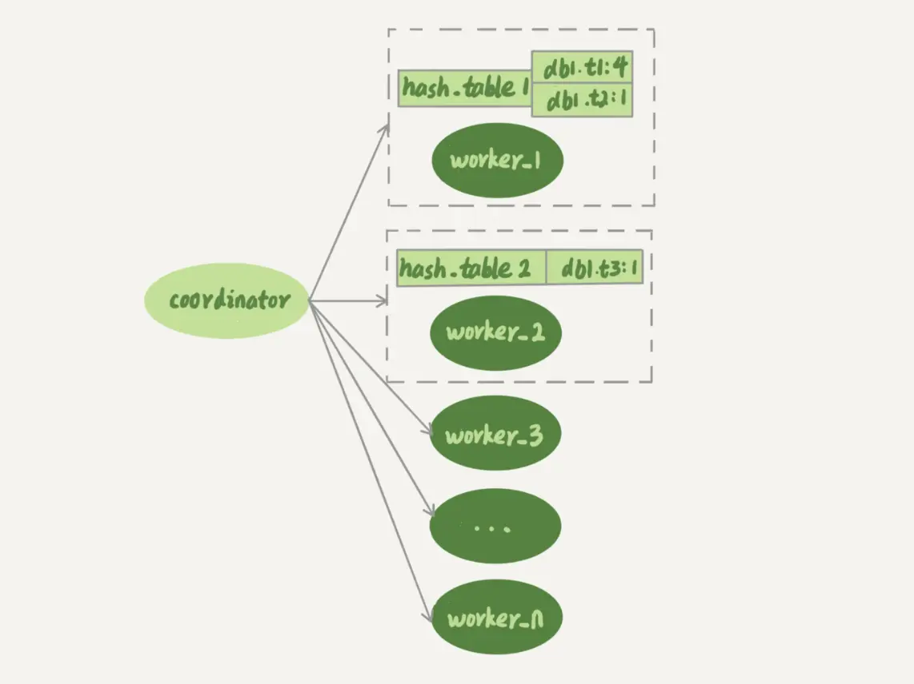


[按表并行复制程模型]

每个 worker 线程对应一个 hash 表，用于保存当前正在这个 worker 的“执行队列”里的事务所涉及的表。hash 表的 key 是“库名. 表名”，value 是一个数字，表示队列中有多少个事务修改这个表。

在有事务分配给 worker 时，事务里面涉及的表会被加到对应的 hash 表中。worker 执行完成后，这个表会被从 hash 表中去掉。

每个事务在分发的时候，跟所有 worker 的冲突关系包括以下三种情况：

1、如果跟所有 worker 都不冲突，coordinator 线程就会把这个事务分配给最空闲的 woker；

2、如果跟多于一个 worker 冲突，coordinator 线程就进入等待状态，直到和这个事务存在冲突关系的 worker 只剩下 1 个；

3、如果只跟一个 worker 冲突，coordinator 线程就会把这个事务分配给这个存在冲突关系的 worker。

这个按表分发的方案，在多个表负载均匀的场景里应用效果很好。但是，如果碰到热点表，比如所有的更新事务都会涉及到某一个表的时候，所有事务都会被分配到同一个 worker 中，就变成单线程复制了。

### 按行分发策略

要解决热点表的并行复制问题，需要按行并行复制的方案。核心思路是：如果两个事务没有更新相同的行，它们在从库上可以并行执行。显然这个模式要求 binlog 格式必须是 row。

判断一个事务 T 和 worker 是否冲突，用的就规则就不是“修改同一个表”，而是“修改同一行”。

key，就必须是“库名 + 表名 + 唯一键的值”，考虑到唯一索引，基于行的策略，事务 hash 表中还需要考虑唯一键，即 key 应该是“库名 + 表名 + 索引名字 + 索引值”。

举例：

```sql
CREATE TABLE `t6` (
  `id` int(11) NOT NULL,
  `a` int(11) DEFAULT NULL,
  `b` int(11) DEFAULT NULL,
  PRIMARY KEY (`id`),
  UNIQUE KEY `a` (`a`)
) ENGINE=InnoDB;

insert into t6 values(1,1,1),(2,2,2),(3,3,3),(4,4,4),(5,5,5);
```
SQL 语句：
|Session A|Session B|
|:----|:----|
|update t6 set a=6 where id=1;|    |
|    |update t6 set a=1 where id=2;|

这两个事务要更新的行的主键值不同，但是如果它们被分到不同的 worker，就有可能 Session B 的语句先执行。此时 id=1 的行的 a 的值还是 1，就会报唯一键冲突。

表 t1 上执行 update t1 set a=1 where id=2 语句，binlog 里面记录了整行的数据修改前各个字段的值，和修改后各个字段的值。

因此，coordinator 在解析这个语句的 binlog 的时候，这个事务的 hash 表就有三个项:

1、key=hash_func(db1+t1+"PRIMARY"+2), value=2; 这里 value=2 是因为修改前后的行 id 值不变，出现了两次。

2、key=hash_func(db1+t1+"a"+2), value=1，表示会影响到这个表 a=2 的行。（修改前 a=2）

3、key=hash_func(db1+t1+"a"+1), value=1，表示会影响到这个表 a=1 的行。（修改后 a=1）


相比于按表并行分发策略，按行并行策略在决定线程分发时，需要消耗更多的计算资源。两个方案其实都有一些约束条件：

1、要能够从 binlog 里面解析出表名、主键值和唯一索引的值。也就是说，主库的 binlog 格式必须是 row；

2、表必须有主键；不能有外键。表上如果有外键，级联更新的行不会记录在 binlog 中，这样冲突检测就不准确。

按行分发的策略有两个问题：

1、耗费内存。比如一个语句要删除 100 万行数据，这时 hash 表就要记录 100 万个项。

2、耗费 CPU。解析 binlog，然后计算 hash 值，对于大事务成本很高。

因此实现这个策略时会设置一个阈值，单个事务如果超过设置的行数阈值（比如，如果单个事务更新的行数超过 10 万行），就暂时退化为单线程模式，退化过程的逻辑如下：

1、coordinator 暂时先 hold 住这个事务；

2、等待所有 worker 都执行完成，变成空队列；

3、coordinator 直接执行这个事务；

4、恢复并行模式。

## 官方并行复制策略

### MySQL5.6并行复制策略

只是支持的粒度是按库并行，用于决定分发策略的 hash 表里，key 就是数据库名。

这个策略的并行效果，取决于压力模型。如果在主库上有多个 DB，并且各个 DB 的压力均衡，使用这个策略的效果会很好。相比于按表和按行分发，这个策略有两个优势：

1、构造 hash 值的时候很快，只需要库名；而且一个实例上 DB 数也不会很多，不会出现需要构造 100 万个项这种情况。

2、不要求 binlog 的格式。因为 statement 格式的 binlog 也可以很容易拿到库名。

但是，如果主库上的表都放在同一个 DB 里面，这个策略就没有效果；或者如果不同 DB 的热点不同，比如一个是业务逻辑库，一个是系统配置库，那也起不到并行的效果。

### MariaDB并行复制策略

MariaDB 的并行复制策略利用了 redo log 组提交 (group commit) 优化的特性 ：

1、能够在同一组里提交的事务，一定不会修改同一行；

2、主库上可以并行执行的事务，从库上也一定是可以并行执行的。

实现上的流程：

1、在一组里面一起提交的事务，有一个相同的 commit_id，下一组就是 commit_id+1；

2、commit_id 直接写到 binlog 里面；

3、传到从库应用的时候，相同 commit_id 的事务分发到多个 worker 执行；

4、这一组全部执行完成后，coordinator 再去取下一批。

这个策略出来的时候相当惊艳。因为之前业界的思路都是在“分析 binlog，并拆分到 worker”上。而 MariaDB 的这个策略，目标是“模拟主库的并行模式”。

但是这个策略有一个问题，它并没有实现“真正的模拟主库并发度”这个目标。主库一组事务 commit 时，下一组事务是同时处于“执行中”状态的。从库上执行时，要等第一组事务完全执行完成后，第二组事务才能开始执行，这样系统的吞吐量就不够。

另外，这个方案很容易被大事务拖后腿。假设 trx2 是一个超大事务，那么在从库应用的时候，trx1 和 trx3 执行完成后，就只能等 trx2 完全执行完成，下一组才能开始执行。这段时间只有一个 worker 线程在工作，是对资源的浪费。

该策略仍然是一个很好的创新，对原系统的改造非常少，实现很优雅。

### MySQL5.7并行复制策略

参数 slave-parallel-type （ `show variables like 'slave_parallel_type` ）来控制并行复制策略：

1、配置为 DATABASE，表示使用 MySQL 5.6 版本的按库并行策略；

2、配置为 LOGICAL_CLOCK，表示类似 MariaDB 的策略。不过 MySQL 5.7 这个策略，针对并行度做了优化。

首先，同时处于“执行状态”的所有事务，不能并行执行。因为里面可能有由于锁冲突而处于锁等待状态的事务。MariaDB 策略的核心是“所有处于 commit”状态的事务可以并行。事务处于 commit 状态，表示已经通过了锁冲突的检验了。

两阶段提交过程中，其实不用等到 commit 阶段，只要能够到达 redo log prepare 阶段，就表示事务已经通过锁冲突的检验了。

因此，MySQL 5.7 并行复制策略的思想是：

1、同时处于 prepare 状态的事务，在从库执行时是可以并行的；

2、处于 prepare 状态的事务，与处于 commit 状态的事务之间，在从库执行时也是可以并行的。

binlog 的组提交有两个参数：

1、binlog_group_commit_sync_delay 表示延迟多少微秒后才调用 fsync；

2、binlog_group_commit_sync_no_delay_count 表示累积多少次以后才调用 fsync。

这两个参数是用于故意拉长 binlog 从 write 到 fsync 的时间，以此减少 binlog 的写盘次数。在 MySQL 5.7 的并行复制策略里，它们可以用来制造更多的“同时处于 prepare 阶段的事务”。这样可以从库复制的并行度。

即这两个参数，既可以“故意”让主库提交得慢些，又可以让从库执行得快些。在 MySQL 5.7 处理从库延迟时，可以考虑调整这两个参数值，来达到提升从库复制并发度的目的。

### MySQL5.7.22并行复制策略

这个版本增加了一个新的并行复制策略，基于 WRITESET 的并行复制。新增了一个参数 binlog-transaction-dependency-tracking，用来控制是否启用这个新策略，参数值：

1、COMMIT_ORDER 表示根据同时进入 prepare 和 commit 来判断是否可以并行的策略。

2、WRITESET 表示对于事务涉及更新的每一行，计算出这一行的 hash 值，组成集合 writeset。如果两个事务没有操作相同的行，也就是说它们的 writeset 没有交集，就可以并行。

3、WRITESET_SESSION 表示在 WRITESET 的基础上多了一个约束，即在主库上同一个线程先后执行的两个事务，在从库执行的时候，要保证相同的先后顺序。

为了唯一标识，这个 hash 值是通过“库名 + 表名 + 索引名 + 值”计算出来的。如果一个表上除了有主键索引外，还有其他唯一索引，那么对于每个唯一索引，insert 语句对应的 writeset 就要多增加一个 hash 值。

跟前面介绍的基于 MySQL 5.5 版本的按行分发的策略差不多。不过 MySQL 官方的实现还是有很大的优势：

1、writeset 是在主库生成后直接写入到 binlog 里面的，这样在从库执行的时候，不需要解析 binlog 内容（event 里的行数据），节省了很多计算量；

2、不需要把整个事务的 binlog 都扫一遍才能决定分发到哪个 worker，更省内存；

3、由于从库的分发策略不依赖于 binlog 内容，所以 binlog 是 statement 格式也是可以的。

因此，MySQL 5.7.22 的并行复制策略在通用性上还是有保证的。当然对于“表上没主键”和“外键约束”的场景，WRITESET 策略也是没法并行的，也会暂时退化为单线程模型。

# 主备切换

一主多从的架构下，假设 A 为主库，A1 为从库，B、C、D 为从库，当 A 断电后，A1 会成为新的主库，从库 B、C、D 也要重新指向 A1。

## 基于位点的主备切换

把节点 B 设置成节点 A’的从库的时候，需要执行一条 change master 命令：

```sql
CHANGE MASTER TO 
MASTER_HOST=$host_name 
MASTER_PORT=$port 
MASTER_USER=$user_name 
MASTER_PASSWORD=$password 
MASTER_LOG_FILE=$master_log_name 
MASTER_LOG_POS=$master_log_pos  
```
参数：
1、MASTER_HOST、MASTER_PORT、MASTER_USER 和 MASTER_PASSWORD 四个参数，分别代表了主库 A’的 IP、端口、用户名和密码。

2、最后两个参数 MASTER_LOG_FILE 和 MASTER_LOG_POS 表示，要从主库的 master_log_name 文件的 master_log_pos 这个位置的日志继续同步。这个位置就是同步位点，也就是主库对应的文件名和日志偏移量。

### 同步位点

原来节点 B 是 A 的从库，本地记录的也是 A 的位点。但是相同的日志，A 的位点和 A’的位点是不同的。因此从库 B 切换时，需要先“找同步位点”。

本质是重放binlog，如果太靠后可能会丢记录，稍微往前点的可以经过判断跳过已经执行的。

一种取同步位点的方法是这样的：

1、等待新主库 A’把中转日志（relay log）全部同步完成；

2、在 A’上执行 show master status 命令，得到当前 A’上最新的 File 和 Position；

3、取原主库 A 故障的时刻 T；

4、用 mysqlbinlog 工具解析 A’的 File，得到 T 时刻的位点。

```shell
mysqlbinlog File --stop-datetime=T --start-datetime=T
```
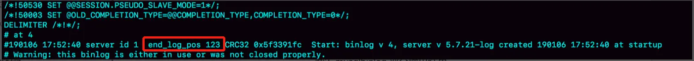


[mysqlbinlog 部分输出结果]

图中 end_log_pos 后面的值“123”，表示的就是 A1 这个实例，在 T 时刻写入新的 binlog 的位置。然后，我们就可以把 123 这个值作为 $master_log_pos ，用在节点 B 的 change master 命令里。

该值不准确的原因：

假设 T 时刻主库 A 已经执行完成了一个 insert 语句插入了一行数据 R，并且已经将 binlog 传给了 A1 和 B，然后在传完的瞬间主库 A 主机掉电。

此时系统状态是：

1、在从库 B 上，由于同步了 binlog， R 这一行已经存在；

2、在新主库 A1上， R 这一行也已经存在，日志是写在 123 这个位置之后的；

3、在从库 B 上执行 change master 命令，指向 A1 的 File 文件的 123 位置，就会把插入 R 这一行数据的 binlog 又同步到从库 B 去执行。

从库 B 的同步线程就会提示主键冲突，然后停止同步。

### 主动跳过错误

通常情况下，在切换任务时，要先主动跳过这些错误，有两种常用的方法。一种做法是：

```sql
set global sql_slave_skip_counter=1;
start slave;
```
切换过程中，可能会不止重复执行一个事务，需要在从库 B 刚开始接到新主库 A1 时，持续观察，每次碰到这些错误就停下来，执行一次跳过命令，直到不再出现停下来的情况，以此来跳过可能涉及的所有事务。
另一种方式是：设置 slave_skip_errors 参数，直接设置跳过指定的错误。

执行主备切换时，有两类错误经常遇到：

1、1062 错误是插入数据时唯一键冲突；

2、1032 错误是删除数据时找不到行。

因此可以把 slave_skip_errors 设置为 “1032,1062”。

注意：主备间的同步关系建立完成，并稳定执行一段时间之后，需要把这个参数设置为空，以免之后真的出现了主从数据不一致也跳过。

## GTID

虽然上面的方法最终可以建立从库 B 和新主库 A1 的主从关系，但操作都很复杂，而且容易出错。MySQL 5.6 版本引入了 GTID，彻底解决了这个困难。

GTID 的全称是 Global Transaction Identifier，即全局事务 ID，是一个事务在提交的时候生成的唯一标识。由两部分组成，格式是：

```plain
GTID=server_uuid:gno
```
1、server_uuid 是一个实例第一次启动时自动生成的，是一个全局唯一的值；
2、gno 是一个整数，初始值是 1，每次提交事务的时候分配给这个事务，并加 1。

官方定义格式：

```plain
GTID=source_id:transaction_id
```
source_id 就是 server_uuid，transaction_id 容易造成误解，两个都是递增，不同点是事务 id 自增但不一定连续，因为会被回滚，而 gno 在提交时分配，所以是连续递增的。
在 GTID 模式下，每个事务都会跟一个 GTID 一一对应。这个 GTID 有两种生成方式，而使用哪种方式取决于 session 变量 gtid_next 的值：

1、默认值 automatic，MySQL 就会把 server_uuid:gno 分配给这个事务。

1）记录 binlog 时，先记录一行 SET @@SESSION.GTID_NEXT=‘server_uuid:gno’；

2）把这个 GTID 加入本实例的 GTID 集合。

2、gtid_next 是一个指定的 GTID 的值，比如通过 set gtid_next='current_gtid’指定为 current_gtid，有两种可能：

1）如果 current_gtid 已经存在于实例的 GTID 集合中，接下来执行的这个事务会直接被系统忽略；

2）如果 current_gtid 没有存在于实例的 GTID 集合中，就将这个 current_gtid 分配给接下来要执行的事务，也就是说系统不需要给这个事务生成新的 GTID，因此 gno 也不用加 1。

注意，一个 current_gtid 只能给一个事务使用。事务提交后要执行下一个事务，就要执行 set 命令，把 gtid_next 设置成另外一个 gtid 或者 automatic。这样每个 MySQL 实例都维护了一个 GTID 集合，用来对应“这个实例执行过的所有事务”。

举例说明：

```sql
CREATE TABLE `t` (
  `id` int(11) NOT NULL,
  `c` int(11) DEFAULT NULL,
  PRIMARY KEY (`id`)
) ENGINE=InnoDB;

insert into t values(1,1);
```
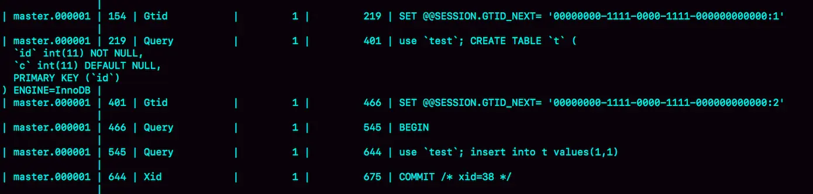


[初始化数据的binlog]

查看 binlog，事务的 BEGIN 之前有一条 SET @@SESSION.GTID_NEXT 命令。这时，如果实例 X 有从库，那么将 CREATE TABLE 和 insert 语句的 binlog 同步过去执行的话，执行事务之前就会先执行这两个 SET 命令， 这样被加入从库的 GTID 集合的，就是上图的这两个 GTID。

如果从库主键冲突，可以执行：

```sql
set gtid_next='aaaaaaaa-cccc-dddd-eeee-ffffffffffff:10';
begin;
commit;
set gtid_next=automatic;
start slave;
```
前三条语句的作用，是通过提交一个空事务，把这个 GTID 加到实例 X 的 GTID 集合中。然后 `show master status` 可以看到 Executed_Gtid_set 已经加入了这个 GTID。
再执行  `start slave`  命令让同步线程执行起来时，虽然实例 X 上还是会继续执行实例 Y 传过来的事务，但是由于“xxxx:10”已经存在于实例的 GTID 集合中了，就会直接跳过这个事务，也就不会再出现主键冲突的错误。

 `set gtid_next=automatic` 的作用是“恢复 GTID 的默认分配行为”，如果之后有新的事务再执行，就还是按照原来的分配方式，继续分配 gno=3。

## 基于GTID的主备切换

GTID 模式下，从库 B 要设置为新主库 A1 的从库的语法如下：

```sql
CHANGE MASTER TO 
MASTER_HOST=$host_name 
MASTER_PORT=$port 
MASTER_USER=$user_name 
MASTER_PASSWORD=$password 
master_auto_position=1 
```
master_auto_position=1 就表示这个主备关系使用的是 GTID 协议。可以看到难以指定的 MASTER_LOG_FILE 和 MASTER_LOG_POS 参数，已经不需要指定了。
实例 A1 的 GTID 集合记为 set_a，实例 B 的 GTID 集合记为 set_b。

实例 B 上执行 start slave 命令，取 binlog 的逻辑：

1、实例 B 指定主库 A1，基于主备协议建立连接。

2、实例 B 把 set_b 发给主库 A1。

3、实例 A1 算出 set_a 与 set_b 的差集，也就是所有存在于 set_a 但不存在于 set_b 的 GTID 集合，判断 A1 本地是否包含了这个差集需要的所有 binlog 事务。

1）如果不包含，表示 A1 已经把实例 B 需要的 binlog 给删掉了，直接返回错误；

2）如果确认全部包含，A1 从自己的 binlog 文件中找出第一个不在 set_b 的事务，发给 B；

4、之后就从这个事务开始，往后读文件，按顺序取 binlog 发给 B 去执行。

主备切换，若选择 A1 作为新的主库，必须要包含从库 B 的全部内容；如果存在事务 B 中有，A1 没有，则 A1 不能成为新的主库。

主备切换的流程：

由于不需要找位点了，从库 B、C、D 只需要分别执行 change master 命令指向实例 A1 即可。（找位点在 A1 内部完成了）

之后系统就由新主库 A1 写入，主库 A1 生成的 binlog 中的 GTID 集合格式是：server_uuid_of_A1:1-M。

## GTID和在线DDL

假设两个互为主备关系的库是实例 X 和实例 Y，且当前主库是 X，并且都打开了 GTID 模式。这时的主备切换流程可以变成下面这样：

1、在实例 X 上执行 stop slave。

2、在实例 Y 上执行 DDL 语句。注意，这里并不需要关闭 binlog。

3、执行完成后，查出这个 DDL 语句对应的 GTID，并记为 server_uuid_of_Y:gno。

4、到实例 X 上执行以下语句序列：

```sql
set GTID_NEXT="server_uuid_of_Y:gno";
begin;
commit;
set gtid_next=automatic;
start slave;
```
目的：既可以让实例 Y 的更新有 binlog 记录，同时也可以确保不会在实例 X 上执行这条更新。
5、按照之前的流程继续执行。

# 读写分离

读写分离的主要目标就是分摊主库的压力。一般有两种架构：

1、客户端直连方案

需要了解后端部署细节，在出现主备切换、库迁移等操作的时候，客户端都会感知到，并且需要调整数据库连接信息。一般采用这样的架构，一定会伴随一个负责管理后端的组件，比如 Zookeeper，尽量让业务端只专注于业务逻辑开发。

2、Proxy

客户端不需要关注后端细节，连接维护、后端信息维护等工作，都是由 proxy 完成的。对后端维护团队的要求会更高。Proxy 需要有高可用架构。整体相对比较复杂。

不论使用哪种架构，都会碰到由于主从可能存在延迟，客户端执行完一个更新事务后马上发起查询，如果查询选择的是从库，就有可能读到刚刚的事务更新之前的状态。本文称作“过期读”。

主从延迟不能 100% 避免的。下面介绍一下处理“过期读”的方案

## 强制走主库方案

强制走主库方案其实就是，将查询请求做分类：

1、对于必须要拿到最新结果的请求，强制将其发到主库上。

2、对于可以读到旧数据的请求，才将其发到从库上。

## sleep方案

主库更新后，读从库之前先 sleep 一下。

具体的方案就是，类似于执行一条 select sleep(1) 命令。这个方案的假设是：大多数情况下主备延迟在 1 秒之内，做一个 sleep 可以有很大概率拿到最新的数据。

更靠谱的方案

客户端将用户数据的数据直接展示在页面上，而不是真正的去请求后端数据库。等到卖家再刷新页面去查询时，已经过了一段时间，相当于 sleep 了。

## 判断无延迟方案

确保从库无延迟，通常有三种做法：

1、 `show slave status`  结果里的 seconds_behind_master 参数的值（秒级），可以用来衡量主备延迟时间的长短。

每次从库执行查询请求前，先判断 seconds_behind_master 是否已经等于 0。如果不等于，就必须等到为 0 才能执行查询请求。

2、对比位点确保主从无延迟

1）Master_Log_File 和 Read_Master_Log_Pos，表示的是读到的主库的最新位点；

2）Relay_Master_Log_File 和 Exec_Master_Log_Pos，表示的是从库执行的最新位点。

如果 Master_Log_File 和 Relay_Master_Log_File、Read_Master_Log_Pos 和 Exec_Master_Log_Pos 这两组值完全相同，就表示接收到的日志已经同步完成。

3、对比 GTID 集合确保主备无延迟

1）Auto_Position=1 ，表示这对主从关系使用了 GTID 协议。

2）Retrieved_Gtid_Set，是从库收到的所有日志的 GTID 集合

3）Executed_Gtid_Set，是从库所有已经执行完成的 GTID 集合。

如果这两个集合相同，也表示从库接收到的日志都已经同步完成。

对比位点和对比 GTID 这两种方法，都要比判断 seconds_behind_master 是否为 0 更准确。

## 配合semi-sync方案

引入半同步复制，也就是 semi-sync replication。semi-sync 做了这样的设计：

1、事务提交的时候，主库把 binlog 发给从库；

2、从库收到 binlog 后，发回给主库一个 ack，表示收到了；

3、主库收到 ack 后，才能给客户端返回“事务完成”的确认。

如果启用了 semi-sync，就表示所有给客户端发送过确认的事务，都确保了从库已经收到了这个日志。


semi-sync 配合前面关于位点的判断，能够确定在从库上执行的查询请求，可以避免过期读。

但是，semi-sync+ 位点判断的方案，只对一主一从的场景是成立的。在一主多从场景中，主库只要等到一个从库的 ack，就开始给客户端返回确认。

判断同步位点的方案还有另外一个潜在问题，即：如果在业务更新的高峰期，主库的位点或者 GTID 集合更新很快，那么上面的两个位点等值判断就会一直不成立，很可能出现从库上迟迟无法响应查询请求的情况。

semi-sync 配合判断主备无延迟的方案，存在两个问题：

1、一主多从的时候，在某些从库执行查询请求会存在过期读的现象；

2、在持续延迟的情况下，可能出现过度等待的问题。

扩展延伸

如果主库掉电时，有些 binlog 还来不及发给从库，会不会导致系统数据丢失？

如果使用的是普通的异步复制模式，就可能会丢失，但 semi-sync 就可以解决这个问题。

## 等主库位点方案

```sql
select master_pos_wait(file, pos[, timeout]);
```
这条命令的逻辑：
1、它是在从库执行的；

2、参数 file 和 pos 指的是主库上的文件名和位置；

3、timeout 可选，设置为正整数 N 表示这个函数最多等待 N 秒。

这个命令正常返回的结果是一个正整数 M，表示从命令开始执行，到应用完 file 和 pos 表示的 binlog 位置，执行了多少事务。

还会返回一些其他结果，包括：

1、如果执行期间，从库同步线程发生异常则返回 NULL；

2、如果等待超过 N 秒，就返回 -1；

3、如果刚开始执行时，发现已经执行过这个位置则返回 0。

如果主库频繁写入事务，并不需要获取当前事务对应的pos，执行完事务之后，获取的pos肯定是要比当前事务的pos的位置要大，只要在从库上面执行，master_pos_wait 返回大于等于 0 的值就说明事务已经在从库执行了。查询的结果就是正确的。

等位点执行流程如下：

1、trx1 事务更新完成后，马上执行 show master status 得到当前主库执行到的 File 和 Position；

2、选定一个从库执行查询语句；

3、在从库上执行 select master_pos_wait(File, Position, 1)；

4、如果返回值是 >=0 的正整数，则在这个从库执行查询语句；

5、否则，到主库执行查询语句。

## 等GTID方案

```sql
select wait_for_executed_gtid_set(gtid_set, 1);
```
这条命令的逻辑是：
1、等待，直到这个库执行的事务中包含传入的 gtid_set，返回 0；

2、超时返回 1。

等位点的方案中，执行完事务后要主动去主库执行 show master status。而 MySQL 5.7.6 版本开始，允许在执行完更新类事务后，把这个事务的 GTID 返回给客户端，这样等 GTID 的方案就可以减少一次查询。

等 GTID 执行流程如下：

1、trx1 事务更新完成后，从返回包直接获取这个事务的 GTID，记为 gtid1；

2、选定一个从库执行查询语句；

3、在从库上执行 select wait_for_executed_gtid_set(gtid1, 1)；

4、如果返回值是 0，则在这个从库执行查询语句；

5、否则，到主库执行查询语句。

将参数 session_track_gtids 设置为 OWN_GTID，MySQL 在执行事务后，就会在返回包中带上 GTID，然后通过 API 接口 mysql_session_track_get_first 从返回包解析出 GTID 的值即可。[API 接口](https://dev.mysql.com/doc/refman/5.7/en/c-api-functions.html)

# 最佳实践

## 从库45度延迟

一般现在的数据库运维系统都有从库延迟监控，其实就是在从库上执行 show slave status，采集 seconds_behind_master 的值。

假设维护的一个从库，它的延迟监控的图像类似下图，是一个 45°斜向上的线段，可能是什么原因导致呢？如何确认？

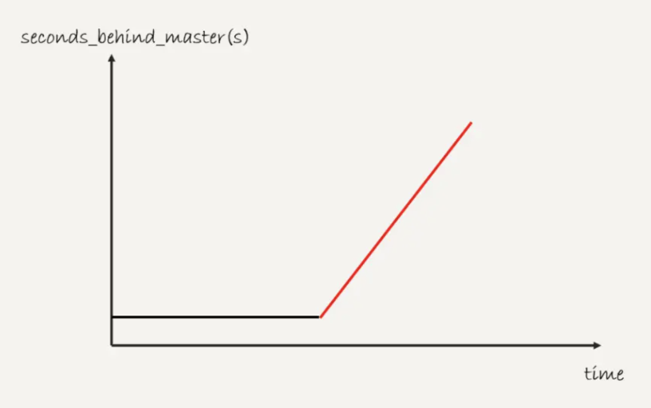


从库的同步在这段时间完全被堵住了。产生这种现象典型的场景主要包括两种：

1、大事务（包括大表 DDL、一个事务操作很多行）；

2、从库起了一个长事务，比如

```sql
begin; 
select * from t limit 1;
```
然后就不动了。这时候主库对表 t 做了一个加字段操作，即使这个表很小，这个 DDL 在从库应用的时候也会被堵住，也不能看到这个现象。
注意：从库跟不上主库的更新速度（并行复制）会导致主从延迟，但不会表现为这种标准的呈 45 度的直线。

## 从库并行复制策略选择

如果主库都是单线程压力模式，在从库追主库的过程中，binlog-transaction-dependency-tracking 应该选用什么参数？

应该将这个参数设置为 WRITESET。

由于主库是单线程压力模式，所以每个事务的 commit_id 都不同，那么设置为 COMMIT_ORDER 模式的话，从库也只能单线程执行。

同样地，由于 WRITESET_SESSION 模式要求在从库应用日志的时候，同一个线程的日志必须与主库上执行的先后顺序相同，也会导致主库单线程压力模式下退化成单线程复制。所以，应该将 binlog-transaction-dependency-tracking 设置为 WRITESET。

## GTID下主库binlog丢失

GTID 模式下，从库执行 start slave 命令后，主库发现需要的 binlog 已经被没了，导致主备创建不成功，如何处理？

1、如果业务允许主从不一致的情况，那么可以在主库上先执行 show global variables like ‘gtid_purged’，得到主库已经删除的 GTID 集合，假设是 gtid_purged1；然后先在从库上执行 reset master，再执行 set global gtid_purged =‘gtid_purged1’；最后执行 start slave，就会从主库现存的 binlog 开始同步。binlog 缺失的那一部分，数据在从库上就可能会有丢失，造成主从不一致。

2、如果需要主从数据一致，最好还是通过重新搭建从库来做。

3、如果有其他的从库保留有全量的 binlog ，可以把新的从库先接到这个保留了全量 binlog 的从库，追上日志后，如果有需要再接回主库。

4、如果 binlog 有备份的情况，可以先在从库上应用缺失的 binlog，然后再执行 start slave。

## GTID等位点读写分离做DDL

如果使用 GTID 等位点的方案做读写分离，在对大表做 DDL 的时候会怎么样？

假设，这条语句在主库上要执行 10 分钟，提交后传到从库就要 10 分钟（典型的大事务）。那么，在主库 DDL 之后再提交的事务的 GTID，去从库查的时候，就会等 10 分钟才出现。这样，这个读写分离机制在这 10 分钟之内都会超时，然后走主库。

这种预期内的操作，应该在业务低峰期的时候，确保主库能够支持所有业务查询，然后把读请求都切到主库，再在主库上做 DDL。等从库延迟追上以后，再把读请求切回从库。

需要关注大事务对等位点方案的影响。另外使用 gh-ost 方案来解决这个问题也是不错的选择。

## 判断主库故障

主从切换有两种场景，一种是主动切换，一种是被动切换。而其中被动切换往往是因为主库出问题了，由 HA 系统发起的。

判断主库故障的方法：

### select 1 判断

select 1 成功返回，只能说明这个库的进程还在，并不能说明主库没问题。

可以通过设置 innodb_thread_concurrency 参数控制 InnoDB 的并发线程上限，使用多个语句如  `select sleep(100) from t;` 占用查询，新建会话发现 select 1 可以返回，但是其他 SQL 语句却因为分配不到连接线程被阻塞。

该参数默认为 0，表示不限制并发线程数量。建议设置为 64~128。

注意并发连接和并发查询，并不是同一个概念。show processlist 中看到的几千个连接，指的就是并发连接。而“当前正在执行”的语句，才是并发查询。并发连接数达到几千个影响并不大，就是多占一些内存而已。并发查询太高才是 CPU 杀手。

线程进入锁等待以后，并发线程的计数会减一，也就是等行锁（也包括间隙锁）的线程是不算在这个参数里面的。

### 查表判断

为了能够检测 InnoDB 并发线程数过多导致的系统不可用情况，我们需要找一个访问 InnoDB 的场景。一般做法是在系统库（mysql 库）里创建一个表，比如命名为 health_check，里面只放一行数据，然后定期执行：

```sql
select * from mysql.health_check; 
```
问题：更新事务要写 binlog，而一旦 binlog 所在磁盘的空间占用率达到 100%，那么所有的更新语句和事务提交的 commit 语句就都会被堵住。但是，系统这时候还是可以正常读数据的。
### 更新判断

既然要更新，就要放个有意义的字段，常见做法是放一个 timestamp 字段，用来表示最后一次执行检测的时间。这条更新语句类似于：

```sql
update mysql.health_check set t_modified=now();
```
节点可用性的检测都应该包含主库和从库。如果用更新来检测主库的话，那么从库也要进行更新检测。
但从库的检测也是要写 binlog 的。因为一般会把数据库 A 和 B 的主备关系设计为双 M 结构，所以在备库 B 上执行的检测命令，也要发回给主库 A。

但是如果主库 A 和备库 B 都用相同的更新命令，就可能出现行冲突，也就是可能会导致主备同步停止。所以现在看来 mysql.health_check 这个表就不能只有一行数据了。

为了让主备之间的更新不产生冲突，可以在 mysql.health_check 表上存入多行数据，并用 A、B 的 server_id 做主键。

```sql
CREATE TABLE `health_check` (
  `id` int(11) NOT NULL,
  `t_modified` timestamp NOT NULL DEFAULT CURRENT_TIMESTAMP,
  PRIMARY KEY (`id`)
) ENGINE=InnoDB;

/* 检测命令 */
insert into mysql.health_check(id, t_modified) values (@@server_id, now()) on duplicate key update t_modified=now();
```
由于 MySQL 规定了主库和备库的 server_id 必须不同（否则创建主备关系的时候就会报错），这样就可以保证主从库各自的检测命令不会发生冲突。
但是更新判断还是有“判定慢”的问题。根本原因是上面说的所有方法，都是基于外部检测的，有一个随机性的天然问题。外部检测都需要定时轮询，可能需要等到下一个检测发起执行语句时，才有可能发现问题。

比如 IO 利用率 100% 表示系统的 IO 是在工作的，每个请求都有机会获得 IO 资源，执行自己的任务。而检测使用的 update 命令，需要的资源很少，所以可能在拿到 IO 资源的时候就可以提交成功，并且在超时时间 N 秒未到达之前就返回给了检测系统。

### 内部统计

针对磁盘利用率，如果 MySQL 可以告诉我们内部每一次 IO 请求的时间，那判断数据库是否出问题的方法就很可靠。

MySQL 5.6 版本以后提供的 performance_schema 库，就在 file_summary_by_event_name 表里统计了每次 IO 请求的时间。

file_summary_by_event_name 表里有很多行数据，先看看 event_name='wait/io/file/innodb/innodb_log_file’这一行。

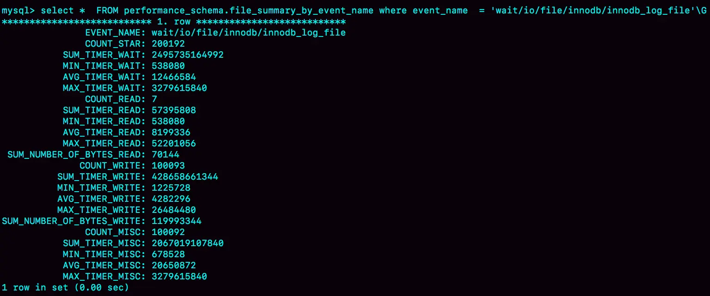


这一行表示统计的是 redo log 的写入时间，第一列 EVENT_NAME 表示统计的类型。

接下来的三组数据，显示的是 redo log 操作的时间统计。

第一组五列，是所有 IO 类型的统计。其中，COUNT_STAR 是所有 IO 的总次数，接下来四列是具体的统计项， 单位是皮秒；前缀 SUM、MIN、AVG、MAX，顾名思义指的就是总和、最小值、平均值和最大值。

第二组六列，是读操作的统计。最后一列 SUM_NUMBER_OF_BYTES_READ 统计的是，总共从 redo log 里读了多少个字节。

第三组六列，统计的是写操作。

最后的第四组数据，是对其他类型数据的统计。在 redo log 里，可以认为就是对 fsync 的统计。

在 performance_schema 库的 file_summary_by_event_name 表里，binlog 对应的是 event_name = "wait/io/file/sql/binlog"这一行。各个字段的统计逻辑，与 redo log 的各个字段完全相同。

如果打开所有的 performance_schema 项，性能大概会下降 10% 左右。

如果要打开 redo log 的时间监控，可以执行这个语句：

```sql
update setup_instruments set ENABLED='YES', Timed='YES' where name like '%wait/io/file/innodb/innodb_log_file%';
```

可以通过 MAX_TIMER 的值来判断数据库是否出问题。比如可以设定阈值，单次 IO 请求时间超过 200 毫秒属于异常，然后使用类似下面这条语句作为检测逻辑：

```sql
select event_name,MAX_TIMER_WAIT  FROM performance_schema.file_summary_by_event_name where event_name in ('wait/io/file/innodb/innodb_log_file','wait/io/file/sql/binlog') and MAX_TIMER_WAIT>200*1000000000;
```
发现异常后获取到需要的信息。可通过下面这条语句把之前的统计信息清空：
```sql
truncate table performance_schema.file_summary_by_event_name;
```

### 判断主库故障小结

使用非常广泛的 MHA（Master High Availability），默认使用 select 1 方法。

MHA 中的另一个可选方法是只做连接，就是 “如果连接成功就认为主库没问题”。但选择这个方法的很少。

建议是优先考虑 update 系统表，然后再配合增加检测 performance_schema 的信息。
