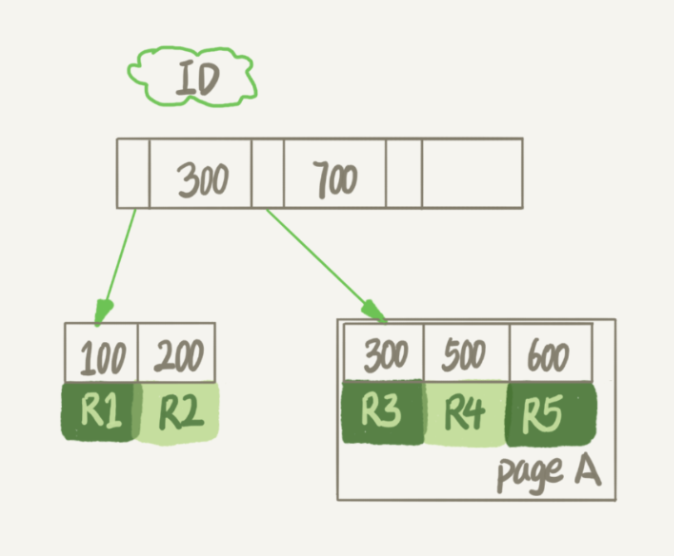
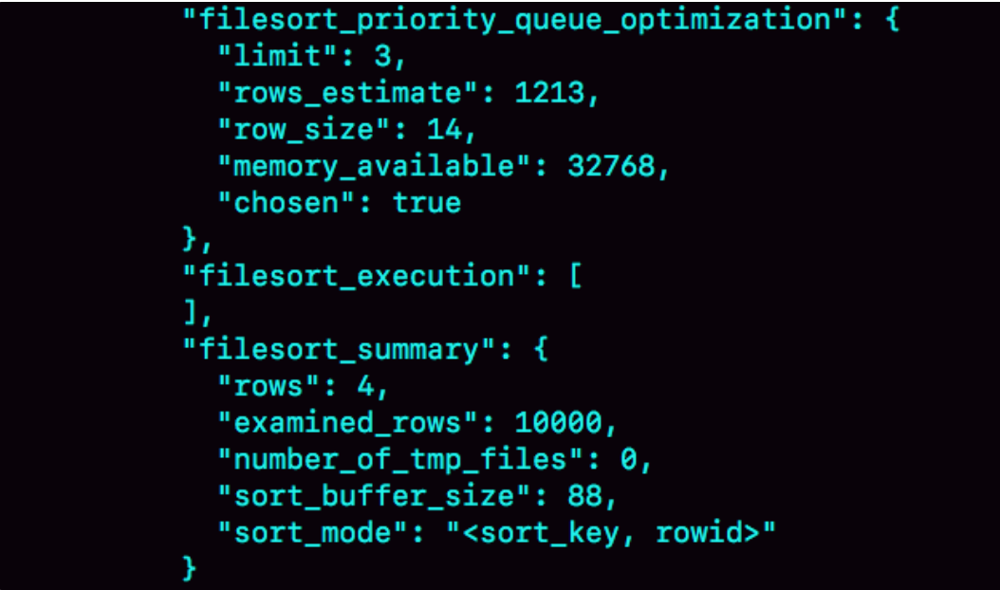
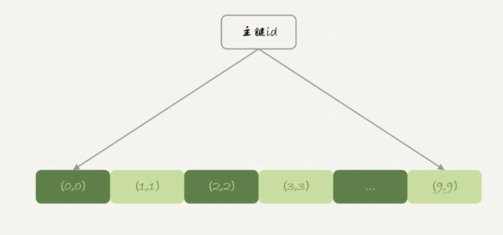
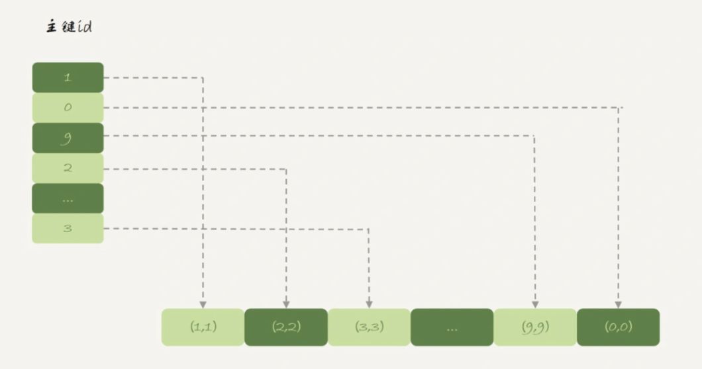
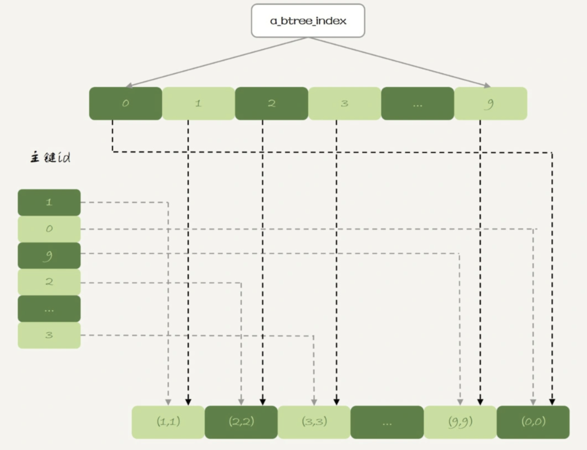
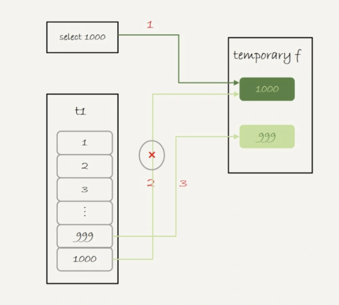
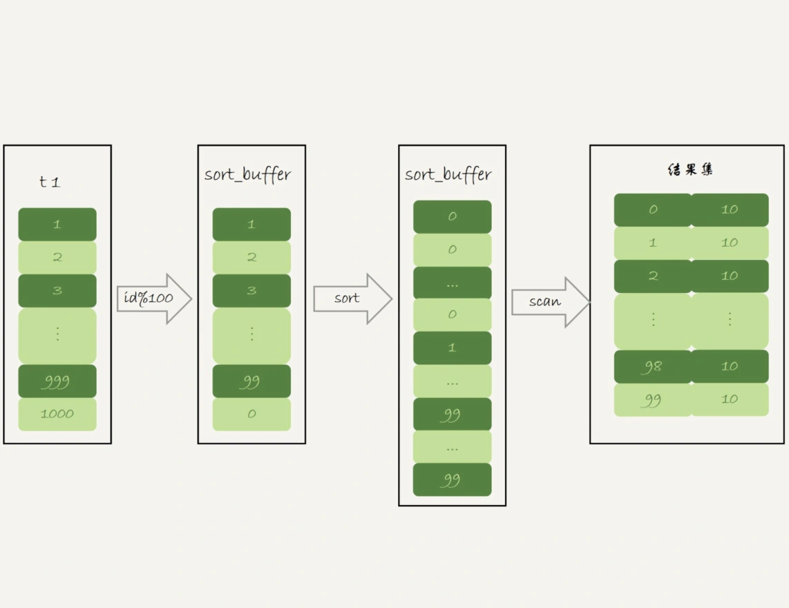
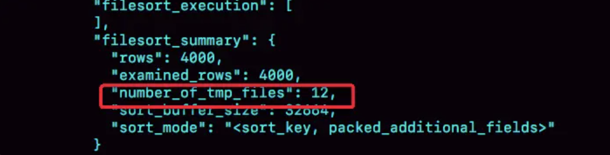
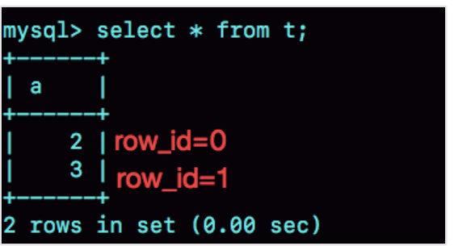

# 表

## 表的组成

一个 InnoDB 表包含两部分，即：表结构定义和数据。

在 MySQL 8.0 版本以前，表结构是存在以.frm 为后缀的文件里。而 MySQL 8.0 版本，则已经允许把表结构定义放在系统数据表中了。表结构定义占用的空间很小。

## 表数据

表数据既可以存在共享表空间里，也可以是单独的文件。这个行为是由参数 innodb_file_per_table 控制的：

1、设置为 OFF 表示：表的数据放在系统共享表空间，也就是跟数据字典放在一起；

2、设置为 ON 表示：每个 InnoDB 表数据存储在一个以 .ibd 为后缀的文件中。

从 MySQL 5.6.6 版本开始，默认值就是 ON 。

建议无论哪个版本都将这个值设置为 ON。因为一个表单独存储为一个文件更容易管理，而且不需要这个表时，通过 drop table 命令，系统就会直接删除这个文件。而如果是放在共享表空间中，即使表删掉了，空间也是不会回收的。

## 数据删除流程

InnoDB 里的数据都是用 B+ 树的结构组织的。




[B+ 树索引示意图]

假设删除 R4 记录，InnoDB 引擎只会把 R4 记录标记为删除。如果之后要插入一个 ID 在 300 和 600 之间的记录时，可能会复用该位置。但是，磁盘文件的大小并不会缩小。

InnoDB 的数据是按页存储的，如果删除了一个数据页上的所有记录，那么整个数据页就可以被复用了。

注意：**数据页的复用和记录的复用是不同的！**

记录的复用，只限于符合范围条件的数据。而整个页从 B+ 树里面摘掉以后，可以复用到任何位置。

如果相邻的两个数据页利用率都很小，系统就会把两个页上的数据合到其中一个页上，另外一个数据页就被标记为可复用。

如果用 delete 命令将整个表的数据删除，所有的数据页都会被标记为可复用。但是磁盘上文件不会变小。这些可以复用，而没有被使用的空间，看起来就像是“空洞”。

实际上，插入数据也会造成这种“空洞”。

比如上图中的 page A 已满，插入一条数据（如 ID 为 550）会造成页分类，page A 和新增的 page B 都会留下“空洞”。

以此类推，更新索引上的值，可以理解为删除一个旧的值，再插入一个新的值，也是会造成空洞的。

因此，重建表可以达到去掉空洞、收缩表空间的目的。

## 重建表

把表 B 作为临时表，数据从表 A 导入表 B 的操作完成后，用表 B 替换 A，从效果上看，就起到了收缩表 A 空间的作用。

可以使用  `alter table A engine=InnoDB` 命令来重建表，MySQL 会自动完成转存数据、交换表名、删除旧表的操作。

在整个 DDL 过程中，表 A 中不能有更新。即这个 DDL 不是 Online 的。

MySQL 5.6 版本开始引入的 Online DDL，对该操作流程做了优化。

引入了 Online DDL 之后，重建表的流程：

1、建立一个临时文件，扫描表 A 主键的所有数据页；

2、用数据页中表 A 的记录生成 B+ 树，存储到临时文件中；

3、生成临时文件的过程中，将所有对 A 的操作记录在一个日志文件（row log）中；

4、临时文件生成后，将日志文件中的操作应用到临时文件，得到一个逻辑数据上与表 A 相同的数据文件；

5、用临时文件替换表 A 的数据文件。

总结不同之处在于，由于日志文件记录和重放操作功能的存在，方案在重建表的过程中，允许对表 A 做增删改操作。这也就是 Online DDL 名字的来源。

（关于获取写锁，然后降级成读锁不阻塞更新过程，可参考“锁”章节 Online DDL）

Online DDL 可以考虑在业务低峰期使用，线上服务如果想要更安全的操作的话，建议使用 GitHub 开源的 gh-ost 来操作。

## Online和inplace

DDL 中把表 A 中的数据导出来的存放位置叫作 tmp_table。这是一个临时表，在 server 层创建。

Online DDL 中根据表 A 重建出来的数据是放在“tmp_file”里的，这个临时文件是 InnoDB 在内部创建出来的。整个 DDL 过程都在 InnoDB 内部完成。对于 server 层来说，没有把数据挪动到临时表，是一个“原地”操作，这就是“inplace”名称的来源。

所以 inplace 的 DDL 受到磁盘空间约束，如果额外的空间不够 tmp_file 使用，则无法执行。


重建表的语句  `alter table A engine=InnoDB` ，隐含的意思就是：

```sql
alter table A engine=InnoDB,ALGORITHM=inplace;
```
跟 inplace 对应的就是拷贝表的方式，用法是：
```sql
alter table A engine=InnoDB,ALGORITHM=copy;
```
当使用 ALGORITHM=copy 时表示强制拷贝表，对应的流程就是 非 Online 的 DDL。
上面的逻辑看起来 inplace 跟 Online 是一个意思？其实并不是。

比如，给 InnoDB 表的一个字段加全文索引：

```sql
alter table t add FULLTEXT(field_name);
```
该过程是 inplace 的，但是会阻塞 增删改 操作，是非 Online 的。
二者之间的关系概括：

1、DDL 过程如果是 Online 的，那么一定是 inplace 的；

2、反之不一定，inplace 的 DDL 有可能不是 Online 的。

（MySQL 8.0 添加全文索引（FULLTEXT index）和空间索引（SPATIAL index）就属于这种情况。

**optimize table、analyze table 和 alter table 区别**

1、从 MySQL 5.6 版本开始，alter table t engine = InnoDB（也就是 recreate）默认的 Online DDL

2、analyze table t 其实不是重建表，只是对表的索引信息做重新统计，没有修改数据，这个过程中加了 MDL 读锁；

3、optimize table t 等于 recreate+analyze。

**表重建后占用空间更大是什么原因？**

本身已经没有“空洞”了，DDL 期间，刚好有外部的 DML 正在执行，可能引入一些“空洞”。

更深层次的，在重建表的时候，InnoDB 不会把整张表占满，每个页留了 1/16 给后续的更新用。也就是说，其实重建表之后不是最紧凑的。

# 临时表

## 内存临时表

如 MEMORY 内存临时表，当使用 order by rand() 查询语句时会自动生成。或者  `create table … engine=memory` 

## 磁盘临时表

mp_table_size 这个配置限制了内存临时表的大小，默认值是 16M。如果临时表大小超过了 tmp_table_size，那么内存临时表就会转成磁盘临时表。

磁盘临时表使用的引擎默认是 InnoDB，是由参数 internal_tmp_disk_storage_engine 控制的。

### 排序过程

当使用磁盘临时表的时候，对应的就是一个没有显式索引的 InnoDB 表的排序过程。

验证过程，将 tmp_table_size 设置成 1024，把 sort_buffer_size 设置成 32768, 把 max_length_for_sort_data 设置成 16。

```sql
set tmp_table_size=1024;
set sort_buffer_size=32768;
set max_length_for_sort_data=16;
/* 打开 optimizer_trace，只对本线程有效 */
SET optimizer_trace='enabled=on'; 

/* 执行语句 */
select word from words order by rand() limit 3;

/* 查看 OPTIMIZER_TRACE 输出 */
SELECT * FROM `information_schema`.`OPTIMIZER_TRACE`\G
```



[OPTIMIZER_TRACE 部分结果]

因为将 max_length_for_sort_data 设置成 16，小于 word 字段的长度定义，所以 sort_mode 里面显示的是 rowid 排序。

rand 字段存放的随机值就 8 个字节，rowid 是 6 个字节，数据总行数是 10000，有 140000 字节，超过了 sort_buffer_size 定义的 32768 字节。但是，number_of_tmp_files 的值是 0。因为这里没有用到临时文件，采用是 MySQL 5.6 版本引入的优先队列排序而不是归并排序（不需要将所有数据都排序）。

优先队列算法可以精确地只得到三个最小值，执行流程如下：

1、对于这 10000 个准备排序的 (rand,rowid)，先取前三行，构造成一个堆；

2、取下一个行 (rand’,rowid’)，跟当前堆里面最大的 rand 比较，如果 rand’小于 rand，把这个 (rand,rowid) 从堆中去掉，换成 (rand’,rowid’)；

3、重复第 2 步，直到第 10000 个 (rand’,rowid’) 完成比较。

## 临时表特性

1、建表语法是 create temporary table …。

2、**临时表只能被创建它的 session 访问，对其他线程不可见**。

3、临时表可以与普通表同名。

4、session 内有同名的临时表和普通表的时候，show create 语句，以及增删改查语句访问的是临时表。

5、show tables 命令不显示临时表。

由于临时表只能被创建它的 session 访问，所以 session 结束时会自动删除临时表。也正是由于这个特性，临时表就特别适合 join 优化场景。原因主要包括以下两个方面：

1、不同 session 的临时表是可以重名的，如果有多个 session 同时执行 join 优化，不需要担心表名重复导致建表失败的问题。

2、不需要担心数据删除问题。如果使用普通表，在流程执行过程中客户端发生了异常断开，或者数据库发生异常重启，还需要专门来清理中间过程中生成的数据表。而临时表由于会自动回收，所以不需要这个额外的操作。

## 临时表应用

由于不用担心线程之间的重名冲突，临时表经常会被用在复杂查询的优化过程中。其中，分库分表系统的跨库查询就是一个典型的使用场景。

## 临时表数据

frm 文件放在临时文件目录下，文件名的后缀是.frm，前缀是进程id_线程id_序列号，每个线程的线程 id 不同，所以不同线程可以创建同名的临时表。可以使用 select @@tmpdir 命令，来显示实例的临时文件目录。

临时表中数据的存放方式，在不同的 MySQL 版本中有着不同的处理方式：

1、在 5.6 以及之前的版本里，MySQL 会在临时文件目录下创建一个相同前缀、以.ibd 为后缀的文件，用来存放数据文件；

2、从 5.7 版本开始，MySQL 引入了一个临时文件表空间，专门用来存放临时文件的数据。因此不需要再创建 ibd 文件。

MySQL 维护数据表，除了物理上要有文件外，内存里面也有一套机制区别不同的表，每个表都对应一个 table_def_key。

1、一个普通表的 table_def_key 的值是由“库名 + 表名”得到，所以如果要在同一个库下创建两个同名的普通表，创建第二个表的过程中就会发现 table_def_key 已经存在了。

2、而对于临时表，table_def_key 在“库名 + 表名”基础上，又加入了“server_id+thread_id”。

## 临时表与主从同步

如果当前的 binlog_format=row，那么跟临时表有关的语句，不会记录到 binlog 里。也就是只在 binlog_format=statment/mixed 的时候，binlog 中才会记录临时表的操作。

这种情况下，创建临时表的语句会传到从库执行，因此从库的同步线程就会创建这个临时表。主库在线程退出的时候，会自动删除临时表，但是从库同步线程是持续在运行的。所以这时候就需要在主库上再写一个 DROP TEMPORARY TABLE 传给从库执行。

MySQL 在记录 binlog 的时候，不论是 create table 还是 alter table 语句都是原样记录，甚至于连空格都不变。但是如果执行 drop table t_normal，系统记录 binlog 就会改成了标准的格式：

```sql
DROP TABLE `t_normal` /* generated by server */
```
drop table 命令是可以一次删除多个表的。比如设置 binlog_format=row，如果主库上执行 "drop table t_normal, temp_t"这个命令，那么 binlog 中就只能记录上面改写的语句。因为从库上并没有表 temp_t，将这个命令重写后再传到从库执行，才不会导致从库同步线程停止。

主库上不同的线程创建同名的临时表是没关系的，传到从库执行要把这两个同名的临时表当做两个不同的临时表来处理。MySQL 记录 binlog 时，会把主库执行语句的线程 id 写到 binlog 中。这样从库的应用线程就能够知道执行每个语句的主库线程 id，并利用这个线程 id 来构造临时表的 table_def_key（库名 + 表名 + serverid + thread_id）。

## 临时表FAQ

**MySQL 什么时候使用内部临时表？**

1、如果语句执行过程可以一边读数据，一边直接得到结果，不需要额外内存，否则就需要额外的内存，来保存中间结果；

2、join_buffer 是无序数组，sort_buffer 是有序数组，临时表是二维表结构；

三者的区别

joinBuffer: 用于在join语句中对驱动表进行暂存用，是无序数组；所以为什么BKA算法在用了JoinBuffer后不能原地排序只好借由MRR算法排序； 

sortBuffer: order by 语句时，会将排序列进行暂存。sortBuffer不够的情况下，则是分段排序最后整合； 

临时表：一种二维表结构，有主键，有field。所以如果中间数据需要用到二维表特性，那么就需要使用临时表，且内存临时表不够的前提下，会转为使用磁盘临时表

3、如果执行逻辑需要用到二维表特性，就会优先考虑使用临时表。union 需要用到唯一索引约束， group by 还需要用到另外一个字段来存累积计数。

排序，分组，去重等可能会使用内存临时表。


**为什么不能用 rename 修改临时表的改名？**

在实现上执行 rename table 语句时，要求按照“库名 / 表名.frm”的规则去磁盘找文件，但是临时表在磁盘上的 frm 文件是放在 tmpdir 目录下的，并且文件名的规则是“#sql{进程 id}_{线程 id}_ 序列号.frm”，因此会报“找不到文件名”的错误。

# 内存表

两个 group by 语句都用了 order by null，使用内存临时表得到的语句结果里，0 在最后一行；而使用磁盘临时表得到的结果里，0 在第一行。这与内存的数据组织结构有关。

## 内存表数据组织结构

```sql
create table t21(id int primary key, c int) engine=Memory;
create table t22(id int primary key, c int) engine=innodb;
insert into t21 values(1,1),(2,2),(3,3),(4,4),(5,5),(6,6),(7,7),(8,8),(9,9),(0,0);
insert into t22 values(1,1),(2,2),(3,3),(4,4),(5,5),(6,6),(7,7),(8,8),(9,9),(0,0);
```
分别执行：
```shell
mysql> select * from t21;
+----+------+
| id | c    |
+----+------+
|  1 |    1 |
|  2 |    2 |
|  3 |    3 |
|  4 |    4 |
|  5 |    5 |
|  6 |    6 |
|  7 |    7 |
|  8 |    8 |
|  9 |    9 |
|  0 |    0 |
+----+------+
10 rows in set (0.02 sec)

mysql> select * from t22;
+----+------+
| id | c    |
+----+------+
|  0 |    0 |
|  1 |    1 |
|  2 |    2 |
|  3 |    3 |
|  4 |    4 |
|  5 |    5 |
|  6 |    6 |
|  7 |    7 |
|  8 |    8 |
|  9 |    9 |
+----+------+
10 rows in set (0.00 sec)
```
可以看到，内存表 t21 的返回结果里面 0 在最后一行，而 InnoDB 表 t22 的返回结果里 0 在第一行。
InnoDB 表的数据就放在主键索引树上，主键索引是 B+ 树。主键索引上的值是有序存储的。在执行 select * 的时候，就会按照叶子节点从左到右扫描，所以得到的结果里，0 就出现在第一行。




[t22 表的组织结构]

与 InnoDB 引擎不同，Memory 引擎的数据和索引是分开的。下图可以看到，内存表的数据部分以数组的方式单独存放，而主键 id 索引里，存的是每个数据的位置。主键 id 是 hash 索引，索引上的 key 并不是有序的。在内存表 t21 中执行 select * 的时候，走的是全表扫描，也就是顺序扫描这个数组。因此 0 就是最后一个被读到，并放入结果集的数据。




[t21 表的组织结构]

InnoDB 和 Memory 引擎的数据组织方式是不同的：

1、InnoDB 引擎把数据放在主键索引上，其他索引上保存的是主键 id。这种方式称之为索引组织表（Index Organizied Table）。

2、而 Memory 引擎采用的是把数据单独存放，索引上保存数据位置的数据组织形式，称之为堆组织表（Heap Organizied Table）。

两个引擎的一些典型不同：

1、InnoDB 表的数据总是有序存放的，而内存表的数据就是按照写入顺序存放的；

2、当数据文件有空洞时，InnoDB 表在插入新数据为了保证数据有序性，只能在固定的位置写入新值，而内存表找到空位就可以插入新值；

3、数据位置发生变化时，InnoDB 表只需要修改主键索引，而内存表需要修改所有索引；

4、InnoDB 表用主键索引查询时需要走一次索引查找，用普通索引查询的时候，需要走两次索引查找。而内存表没有这个区别，所有索引的“地位”都是相同的。

5、InnoDB 支持变长数据类型，不同记录的长度可能不同；内存表不支持 Blob 和 Text 字段，并且即使定义了 varchar(N)，实际也当作 char(N)，也就是固定长度字符串来存储，因此内存表的每行数据长度相同。

由于内存表的这些特性，每个数据行被删除以后，空出的这个位置都可以被接下来要插入的数据复用。比如，在表 t21 中执行：

```sql
delete from t21 where id=5;
insert into t21 values(10,10);
select * from t21;
```
就会看到返回结果里，id=10 这一行出现在 id=4 之后，也就是原来 id=5 这行数据的位置。
表 t21 的这个主键索引是哈希索引，因此如果执行范围查询，如  `select * from t1 where id<5;` ，是用不上索引的，需要走全表扫描。

## hash索引和B-Tree索引

内存表也是支持 B-Tree 索引的。在 id 列上创建一个 B-Tree 索引，SQL 语句可以这么写：

```sql
alter table t21 add index a_btree_index using btree (id);
```
表 t1 的数据组织形式就变成了下图，跟 InnoDB 的 b+ 树索引组织形式类似：



```shell
mysql> select * from t21 where id<5;
+----+------+
| id | c    |
+----+------+
|  0 |    0 |
|  1 |    1 |
|  2 |    2 |
|  3 |    3 |
|  4 |    4 |
+----+------+
5 rows in set (0.01 sec)

mysql> select * from t21 force index(primary) where id<5;
+----+------+
| id | c    |
+----+------+
|  1 |    1 |
|  2 |    2 |
|  3 |    3 |
|  4 |    4 |
|  0 |    0 |
+----+------+
5 rows in set (0.00 sec)
```
可以看到，执行  `select * from t21 where id<5`  的时候，优化器会选择 B-Tree 索引，所以返回结果是 0 到 4。 使用 force index 强行使用主键 id 这个索引，id=0 这一行就在结果集的最末尾了。
不建议在生产环境上使用内存表。原因主要包括两个方面：

1、锁粒度问题；

2、数据持久化问题。

## 内存表的锁

内存表的锁粒度：内存表不支持行锁，只支持表锁。一张表只要有更新，就会堵住其他所有在这张表上的读写操作。

需要注意的是，这里的表锁跟之前介绍过的 MDL 锁不同，但都是表级的锁。

模拟内存表的表级锁

|Session A|Session B|Session C|
|:----|:----|:----|
|update t21 set id=sleep(50) where id=1;|    |    |
|    |select * from t21 where id=2;<br>(wait 50s)|    |
|    |    |show processlist;|

在这个执行序列里，Session A 的 update 语句要执行 50 秒，在这个语句执行期间 Session B 的查询会进入锁等待状态。Session C 的 show processlist 结果输出如下：

```shell
+----+------+-----------------+--------------------+---------+------+------------------------------+----------------------------------------+
| Id | User | Host            | db                 | Command | Time | State                        | Info                                   |
+----+------+-----------------+--------------------+---------+------+------------------------------+----------------------------------------+
| 41 | root | localhost       | test               | Query   |   21 | User sleep                   | update t21 set id=sleep(50) where id=1 |
| 43 | root | localhost       | test               | Query   |    6 | Waiting for table level lock | select * from t21 where id=2           |
| 45 | root | localhost       | test               | Query   |    0 | starting                     | show processlist                       |
+----+------+-----------------+--------------------+---------+------+------------------------------+----------------------------------------+
```

## 内存表数据持久性

数据放在内存中，是内存表的优势，但也是一个劣势。因为，数据库重启的时候，所有的内存表都会被清空。

从库重启，内存表数据会被清空，接收客户端 update 语句后会执行失败，这样就会导致主备同步停止。如果这时候发生主备切换的话，客户端会看到表中数据“丢失”了。

MySQL 在实现上做了这样一件事儿：在数据库重启之后，（主库）往 binlog 里面写入一行 DELETE FROM t1。

由于重启会丢数据，如果一个备库重启，会导致主备同步线程停止；如果主库跟这个备库是双 M 架构，还可能导致主库的内存表数据被删掉。

建议把普通内存表都用 InnoDB 表来代替。有一个场景例外，就是临时表。

内存临时表刚好可以无视内存表的两个不足，主要是下面的三个原因：

1、临时表不会被其他线程访问，没有并发性的问题；

2、临时表重启后也是需要删除的，清空数据这个问题不存在；

3、备库的临时表也不会影响主库的用户线程。

扩展延伸

从库重启之后肯定是会导致从库的内存表数据被清空，进而导致主从同步停止。最好的做法是将它修改成 InnoDB 引擎表。如果业务场景暂时不允许修改引擎如何处理从库重启？

假设的是主库暂时不能修改引擎，那么就把从库的内存表引擎先都改成 InnoDB。对于每个内存表，执行

```sql
set sql_log_bin=off;
alter table tbl_name engine=innodb;
```
这样就能避免从库重启时数据丢失的问题。
由于主库重启后，会往 binlog 里面写“delete from tbl_name”，这个命令传到从库，从库的同名的表数据也会被清空。因此，就不会出现主从同步停止的问题。

如果由于主库异常重启触发了 HA，这时之前修改过引擎的备库变成了主库。而原来的主库变成了新备库，在新备库上把所有的内存表（这时候表里没数据因为重启了）都改成 InnoDB 表。所以如果不能直接修改主库上的表引擎，可以配置一个自动巡检的工具，在备库上发现内存表就把引擎改了。

# union

sort buffer、内存临时表和 join buffer 这三个数据结构都是用来存放语句执行过程中的中间数据，以辅助 SQL 语句的执行的。其中，排序时用到了 sort buffer，在使用 join 语句的时候用到了 join buffer。

## union执行流程

```shell
mysql> explain  (select 1000 as f) union (select id from t11 order by id desc limit 2);
+----+--------------+------------+------------+-------+---------------+---------+---------+------+------+----------+-----------------+
| id | select_type  | table      | partitions | type  | possible_keys | key     | key_len | ref  | rows | filtered | Extra           |
+----+--------------+------------+------------+-------+---------------+---------+---------+------+------+----------+-----------------+
|  1 | PRIMARY      | NULL       | NULL       | NULL  | NULL          | NULL    | NULL    | NULL | NULL |     NULL | No tables used  |
|  2 | UNION        | t11        | NULL       | index | NULL          | PRIMARY | 4       | NULL |    2 |   100.00 | Using index     |
| NULL | UNION RESULT | <union1,2> | NULL       | ALL   | NULL          | NULL    | NULL    | NULL | NULL |     NULL | Using temporary |
+----+--------------+------------+------------+-------+---------------+---------+---------+------+------+----------+-----------------+
3 rows in set, 1 warning (0.00 sec)
```
第三行的 Extra 字段，表示在对子查询的结果集做 union 的时候，使用了临时表 (Using temporary)。
这条语句的执行流程：

1、创建一个内存临时表，这个临时表只有一个整型字段 f，并且 f 是主键字段。

2、执行第一个子查询，得到 1000 这个值，并存入临时表中。

3、执行第二个子查询：

1）拿到第一行 id=1000，试图插入临时表中。但由于 1000 这个值已经存在于临时表了，违反了唯一性约束，所以插入失败，然后继续执行；

2）取到第二行 id=999，插入临时表成功。

4、从临时表中按行取出数据，返回结果，并删除临时表，结果中包含两行数据分别是 1000 和 999。




[union 执行流程]

这里的内存临时表起到了暂存数据的作用，而且计算过程还用上了临时表主键 id 的唯一性约束，实现了 union 的语义。如果把上面这个语句中的 union 改成 union all 的话，就没有了“去重”的语义。这样执行时就依次执行子查询，得到的结果直接作为结果集的一部分，发给客户端。因此也就不需要临时表了。

```shell
mysql> explain  (select 1000 as f) union all (select id from t11 order by id desc limit 2);
+----+-------------+-------+------------+-------+---------------+---------+---------+------+------+----------+----------------+
| id | select_type | table | partitions | type  | possible_keys | key     | key_len | ref  | rows | filtered | Extra          |
+----+-------------+-------+------------+-------+---------------+---------+---------+------+------+----------+----------------+
|  1 | PRIMARY     | NULL  | NULL       | NULL  | NULL          | NULL    | NULL    | NULL | NULL |     NULL | No tables used |
|  2 | UNION       | t1    | NULL       | index | NULL          | PRIMARY | 4       | NULL |    2 |   100.00 | Using index    |
+----+-------------+-------+------------+-------+---------------+---------+---------+------+------+----------+----------------+
2 rows in set, 1 warning (0.01 sec)
```
可以看到，第二行的 Extra 字段显示的是 Using index，表示只使用了覆盖索引，没有用临时表了。
## group by执行流程

```sql
mysql> explain  select id%10 as m, count(*) as c from t11 group by m;
+----+-------------+-------+------------+-------+---------------+------+---------+------+------+----------+----------------------------------------------+
| id | select_type | table | partitions | type  | possible_keys | key  | key_len | ref  | rows | filtered | Extra                                        |
+----+-------------+-------+------------+-------+---------------+------+---------+------+------+----------+----------------------------------------------+
|  1 | SIMPLE      | t1    | NULL       | index | PRIMARY,a     | a    | 5       | NULL |  100 |   100.00 | Using index; Using temporary; Using filesort |
+----+-------------+-------+------------+-------+---------------+------+---------+------+------+----------+----------------------------------------------+
1 row in set, 1 warning (0.00 sec)
```
在 Extra 字段里面，可以看到三个信息：
1、Using index，表示这个语句使用了覆盖索引，选择了索引 a，不需要回表；

2、Using temporary，表示使用了临时表；

3、Using filesort，表示需要排序。

语句的执行流程：

1、创建内存临时表，表里有两个字段 m 和 c，主键是 m；

2、扫描表 t1 的索引 a，依次取出叶子节点上的 id 值，计算 id%10 的结果，记为 x；

1）如果临时表中没有主键为 x 的行，就插入一个记录 (x,1);

2）如果表中有主键为 x 的行，就将 x 这一行的 c 值加 1；

3、遍历完成后，再根据字段 m 做排序，得到结果集返回给客户端。

如果并不需要对结果进行排序，那可以在 SQL 语句末尾增加 order by null，也就是改成：

```sql
select id%10 as m, count(*) as c from t11 group by m order by null; // Q11
```
这样就跳过了最后排序的阶段，直接从临时表中取数据返回。
内存临时表的大小是有限制的，参数 tmp_table_size 就是控制这个内存大小的，默认是 16M。

如果把内存临时表的大小限制为最大 1024 字节，并把语句改成 id % 100，这样返回结果里有 100 行数据。但是，这时的内存临时表大小不够存下这 100 行数据，也就是说，执行过程中会发现内存临时表大小到达了上限（1024 字节）。

这时候就会把内存临时表转成磁盘临时表，磁盘临时表默认使用的引擎是 InnoDB。

```shell
mysql> set tmp_table_size=1024;
mysql> select id%100 as m, count(*) as c from t11 group by m order by null limit 10; // Q12
+------+----+
| m    | c  |
+------+----+
|    0 | 10 |
|    1 | 10 |
|    2 | 10 |
|    3 | 10 |
|    4 | 10 |
|    5 | 10 |
|    6 | 10 |
|    7 | 10 |
|    8 | 10 |
|    9 | 10 |
+------+----+
10 rows in set (0.01 sec)
```
如果这个表 t1 的数据量很大，很可能这个查询需要的磁盘临时表就会占用大量的磁盘空间。
扩展：

Q11 和 Q12 都是 order by null，但是 m 的排序不一样，一个是 9-0 另一个是 0-9

因为 Q11 使用的是内存临时表，使用的引擎是 Memory，哈希索引按插入的顺序读取数据；Q12 使用的磁盘临时表，使用的引擎是innodb，innodb是索引组织表，按主键顺序存储数据，所以是按照m字段有序的。

### group by索引优化

上面可以看到，不论是使用内存临时表还是磁盘临时表，group by 逻辑都需要构造一个带唯一索引的表，执行代价比较高。如果表的数据量比较大，上面这个 group by 语句执行起来就会很慢。

group by 的语义逻辑，是统计不同的值出现的个数。但是，由于每一行的 id%100 的结果是无序的，所以就需要有一个临时表，来记录并统计结果。如果扫描过程中可以保证出现的数据是有序的，那么计算 group by 的时候，就只需要从左到右，顺序扫描，依次累加。也就是下面这个过程：

1、当碰到第一个 1 的时候，已经知道累积了 X 个 0，结果集里的第一行就是 (0,X)；

2、当碰到第一个 2 的时候，已经知道累积了 Y 个 1，结果集里的第二行就是 (1,Y);

就可以拿到 group by 的结果，不需要临时表，也不需要再额外排序。

InnoDB 的索引，就可以满足这个输入有序的条件！

在 MySQL 5.7 版本支持了 generated column 机制，用来实现列数据的关联更新。你可以用下面的方法创建一个列 z，然后在 z 列上创建一个索引（如果是 MySQL 5.6 及之前的版本，也可以创建普通列和索引，来解决这个问题）

```sql
alter table t11 add column z int generated always as(id % 100), add index(z);
```
这样索引 z 上的数据就是有序了。上面的 group by 语句就可以改成：
```sql
mysql> select z, count(*) as c from t11 group by z;
+----+-------------+-------+------------+-------+---------------+------+---------+------+------+----------+-------------+
| id | select_type | table | partitions | type  | possible_keys | key  | key_len | ref  | rows | filtered | Extra       |
+----+-------------+-------+------------+-------+---------------+------+---------+------+------+----------+-------------+
|  1 | SIMPLE      | t11   | NULL       | index | z             | z    | 5       | NULL | 1000 |   100.00 | Using index |
+----+-------------+-------+------------+-------+---------------+------+---------+------+------+----------+-------------+
1 row in set, 1 warning (0.00 sec)
```
从 Extra 字段可以看到，这个语句的执行不再需要临时表，也不需要排序了。
### group by直接排序优化

碰上不适合创建索引的场景就没办法使用索引优化了。

一个 group by 语句中需要放到临时表上的数据量特别大，却还是要按照“先放到内存临时表，插入一部分数据后，发现内存临时表不够用了再转成磁盘临时表”不太好。可以直接走磁盘临时表。

在 group by 语句中加入 SQL_BIG_RESULT 这个提示（hint），就可以告诉优化器：这个语句涉及的数据量很大，请直接用磁盘临时表。

MySQL 的优化器看磁盘临时表是 B+ 树存储，存储效率不如数组高，从磁盘空间考虑直接用数组。

```sql
select SQL_BIG_RESULT id%100 as m, count(*) as c from t11 group by m;
```
流程如下：
1、初始化 sort_buffer，确定放入一个整型字段，记为 m；

2、扫描表 t1 的索引 a，依次取出里面的 id 值, 将 id%100 的值存入 sort_buffer 中；

3、扫描完成后，对 sort_buffer 的字段 m 做排序（如果 sort_buffer 内存不够用，就会利用磁盘临时文件辅助排序）；

4、排序完成后，就得到了一个有序数组。




[使用 SQL_BIG_RESULT 的执行流程图]

```sql
# alter table t11 drop column z;  # 删除索引 z
# desc t11;  # 查看表结构
mysql> explain select SQL_BIG_RESULT id%100 as m, count(*) as c from t11 group by m;
+----+-------------+-------+------------+-------+---------------+------+---------+------+------+----------+-----------------------------+
| id | select_type | table | partitions | type  | possible_keys | key  | key_len | ref  | rows | filtered | Extra                       |
+----+-------------+-------+------------+-------+---------------+------+---------+------+------+----------+-----------------------------+
|  1 | SIMPLE      | t11   | NULL       | index | PRIMARY,a     | a    | 5       | NULL | 1000 |   100.00 | Using index; Using filesort |
+----+-------------+-------+------------+-------+---------------+------+---------+------+------+----------+-----------------------------+
1 row in set, 1 warning (0.00 sec)
```
从 Extra 字段可以看到，这个语句的执行没有再使用临时表，而是直接用了排序算法。
### group by小结

group by 使用指导原则：

1、如果对 group by 语句的结果没有排序要求，要在语句后面加 order by null；

2、尽量让 group by 过程用上表的索引，确认方法是 explain 结果里没有 Using temporary 和 Using filesort；

3、如果 group by 需要统计的数据量不大，尽量只使用内存临时表；也可以通过适当调大 tmp_table_size 参数，来避免用到磁盘临时表；

4、如果数据量实在太大，使用 SQL_BIG_RESULT 这个提示，来告诉优化器直接使用排序算法得到 group by 的结果。

# 排序

## 全字段排序

全字段排序流程：

这个语句执行流程如下所示 ：

1、初始化 sort_buffer，确定放入查询的所有字段；

2、从二级索引中找到第一个满足条件的主键 id；

3、到主键 id 索引取出整行，取 查询的所有字段 的值，存入 sort_buffer 中；

4、从二级索引中取下一个记录的主键 id；

5、重复步骤 3、4 直到 where 查询条件不满足为止；

6、对 sort_buffer 中的数据按照 order 字段做**快速排序**；

7、按照排序结果取前 limit 行返回给客户端。

按照 order 字段排序，可能在内存中完成，也可能需要使用外部排序，这取决于排序所需的内存和参数 sort_buffer_size。

sort_buffer_size，就是 MySQL 为排序开辟的内存（sort_buffer）的大小。如果要排序的数据量小于 sort_buffer_size，排序就在内存中完成。但如果排序数据量太大，内存放不下，则不得不利用磁盘临时文件辅助排序。

可以用下面介绍的方法，来确定一个排序语句是否使用了临时文件。

```sql
/* 打开optimizer_trace，只对本线程有效 */
SET optimizer_trace='enabled=on'; 

/* @a保存Innodb_rows_read的初始值 */
select VARIABLE_VALUE into @a from  performance_schema.session_status where variable_name = 'Innodb_rows_read';

/* 执行语句，查询的 SQL 语句 */
select xxx from tx where xx order by xx limit xx; 

/* 查看 OPTIMIZER_TRACE 输出 */
SELECT * FROM `information_schema`.`OPTIMIZER_TRACE`\G

/* @b保存Innodb_rows_read的当前值 */
select VARIABLE_VALUE into @b from performance_schema.session_status where variable_name = 'Innodb_rows_read';

/* 计算Innodb_rows_read差值 */
select @b-@a;
```

通过查看 OPTIMIZER_TRACE 的结果来确认的，可以从 number_of_tmp_files 中看到是否使用临时文件。




number_of_tmp_files 表示排序过程中使用的临时文件数。

内存放不下需要排序的数据时，就会用外部排序，一般使用归并排序。这里临时文件数就是归并排序将数据分成的份数，最后再合并成一个文件。

如果 sort_buffer_size 超过了需要排序的数据量大小，number_of_tmp_files 就是 0，表示排序可以直接在内存中完成。

examined_rows 表示参与排序的行数

sort_mode 里面的 packed_additional_fields 的意思是，排序过程对字符串做了“紧凑”处理。即使字段的定义是 varchar(xx)，在排序过程中还是要按照实际长度来分配空间。

注意：因为查询 OPTIMIZER_TRACE 表时，需要用到临时表，而 internal_tmp_disk_storage_engine 的默认值是 InnoDB。如果使用的是 InnoDB 引擎的话，把数据从临时表取出来的时候，会让 Innodb_rows_read 的值加 1，可以设置成 MyISAM。


举例：

```sql
CREATE TABLE `t` (
  `id` int(11) NOT NULL,
  `city` varchar(16) NOT NULL,
  `name` varchar(16) NOT NULL,
  `age` int(11) NOT NULL,
  `addr` varchar(128) DEFAULT NULL,
  PRIMARY KEY (`id`),
  KEY `city` (`city`)
) ENGINE=InnoDB;
```
查询语句：
```sql
select city,name,age from t where city='杭州' order by name limit 1000  ;
```
这里需要在 city 字段加上索引（略）。
explain SQL 查询语句，Extra 这个字段中的“Using filesort”表示的就是需要排序，MySQL 会给每个线程分配一块内存用于排序，称为 sort_buffer。

## rowid排序

如果 MySQL 认为排序的单行长度太大，会采用另外一种 rowid 排序算法（如果没有主键 id，那么会自动生成一个长度为 6 字节的rowid 来作为主键）。

可以通过下列参数设置用于排序的行数据的长度的一个参数。

```plain
SET max_length_for_sort_data = 16;
```

新的算法会根据行数据的长度计算放入 sort_buffer 的字段，如只要排序的列和主键 id。整体流程如下：

1、初始化 sort_buffer，确定放入两个字段，即 排序字段 和主键 id；

2、从二级索引中找到第一个满足条件的主键 id；

3、到主键 id 索引取出整行，取 条件、id 字段，存入 sort_buffer 中；

4、从二级索引中取下一个记录的主键 id；

5、重复步骤 3、4 直到不满足条件为止；

6、对 sort_buffer 中的数据按照排序字段进行排序；

7、遍历排序结果，取前 limit 行，并按照 id 的值回到原表中取出其它所需字段返回给客户端。

## 排序对比

MySQL 认为内存太小，会影响排序效率，就会采用 rowid 排序算法，排序过程中一次可以排序更多航，但是需要再回到原表去取数据。

如果认为内存足够大，会优先选择全字段排序，把需要的字段都放到 sort_buffer 中，排序后可以直接从内存中返回查询结果，不用再回到原表中去取数据。

排序的操作成本较高，排序的根本原因在于原来的数据都是无序的，如果要避免排序操作，那么保证原来的数据有序即可。这里自然联想到使用索引，具体来说是联合索引，可以通过 explain 的 Extra 字段来验证。进一步还可以结合覆盖索引，避免回表的操作。

# 全表扫描

## 客户端连接

如果库里面的表特别多，连接就会很慢。其实这并不是连接慢也不是服务端慢，而是客户端慢，因为要执行哈希操作构建一个本地的哈希表。

比如有些线上的库，会包含很多表如 6 万个表。会发现每次用客户端连接都会卡在下面这个连接上：

```sql
mysql -h127.0.0.1 -uroot -pxxx db123
```
并且终端还提示使用 -A 参数可以关掉自动补全功能，然后客户端就可以快速返回了。
除了加 -A 以外，加 –quick(简写为 -q) 参数，也可以跳过这个阶段。但是需要注意设置这个参数可能会降低服务端的性能。

因为 MySQL 客户端发送请求后，接收服务端返回结果的方式有两种：

1、一种是本地缓存，也就是在本地开一片内存，先把结果存起来。API 开发对应的就是 mysql_store_result 方法。

2、另一种是不缓存，读一个处理一个。API 开发对应的就是 mysql_use_result 方法。

MySQL 客户端默认采用第一种方式，而如果加上–quick 参数，就会使用第二种不缓存的方式。

采用不缓存的方式时，如果本地处理得慢，就会导致服务端发送结果被阻塞，因此会让服务端变慢。

## server层

对一个 200G 的 InnoDB 表 db1. t，执行一个全表扫描。把扫描结果保存在客户端，会使用类似这样的命令：

```sql
mysql -h$host -P$port -u$user -p$pwd -e "select * from db1.t" > $target_file
```
服务端查询数据并不需要保存一个完整的结果集。取数据和发数据的流程：
1、获取一行，写到 net_buffer 中。这块内存的大小是由参数 net_buffer_length 定义的，默认是 16k。

2、重复获取行，直到 net_buffer 写满，调用网络接口发出去。

3、如果发送成功，就清空 net_buffer，然后继续取下一行，并写入 net_buffer。

4、如果发送函数返回 EAGAIN 或 WSAEWOULDBLOCK，就表示本地网络栈（socket send buffer）写满了，进入等待。直到网络栈重新可写，再继续发送。

从这个流程可以知道：

1、一个查询在发送过程中，占用的 MySQL 内部的内存最大就是 net_buffer_length 这么大，全表扫描时并不会达到表的大小；

2、socket send buffer 在全表扫描时也不可能达到表的大小（默认定义 /proc/sys/net/core/wmem_default），如果 socket send buffer 被写满，就会暂停读数据的流程。

所以 MySQL 是“边读边发”，就意味着如果客户端接收得慢，会导致 MySQL 服务端由于结果发不出去，事务的执行时间变长。

## InnoDB引擎层

### Buffer Pool

介绍 WAL 机制时，分析了 InnoDB 内存的一个作用是保存更新的结果，再配合 redo log，就避免了随机写盘。

内存的数据页是在 Buffer Pool (BP) 中管理的，在 WAL 里 Buffer Pool 起到了加速更新的作用。而实际上，Buffer Pool 还有一个更重要的作用是加速查询。

由于有 WAL 机制，当事务提交的时候，磁盘上的数据页是旧的，如果这时马上有一个查询要来读这个数据页，并不需要立即把 redo log 应用到数据页。因为这时候内存数据页的结果是最新的，直接读内存页就可以了。（注意这里跟 change buffer 和 redo log 不矛盾）

InnoDB Buffer Pool 的大小是由参数 innodb_buffer_pool_size 确定的，一般建议设置成可用物理内存的 60%~80%。

### 内存命中率

Buffer Pool 对查询的加速效果，依赖于内存命中率这个重要指标。

一般一个稳定服务的线上系统，要保证响应时间符合要求的话，内存命中率要在 99% 以上。查看系统当前 BP 命中率，可以通过 show engine innodb status，“Buffer pool hit rate”字样显示的就是当前的命中率。

### LRU算法改进

InnoDB 内存管理用的是最近最少使用 (Least Recently Used, LRU) 算法，这个算法的核心就是淘汰最久未使用的数据。

但是全表扫描就会把当前的 Buffer Pool 里的数据全部淘汰掉，存入扫描过程中访问到的数据页的内容。也就是说 Buffer Pool 里面主要放的是这个历史数据表的数据。会使内存命令率急剧下降，磁盘压力增加，SQL 语句响应变慢。因此对 LRU 算法进行了改进。

在 InnoDB 实现上，按照 5:3 的比例把整个 LRU 链表分成了 young 区域和 old 区域。靠近链表头部的 5/8 是 young 区域，靠近链表尾部的 3/8 是 old 区域。

改进后的 LRU 算法逻辑：

1、扫描过程中，需要新插入的数据页，都被放到 old 区域 ;

2、一个数据页里面有多条记录，这个数据页会被多次访问到，但由于是顺序扫描，这个数据页第一次被访问和最后一次被访问的时间间隔不会超过 1 秒，因此还是会被保留在 old 区域；

3、再继续扫描后续的数据，之前的这个数据页之后也不会再被访问到，于是始终没有机会移到链表头部（也就是 young 区域），很快就会被淘汰出去。

这个策略最大的收益就是在扫描这个大表的过程中，虽然也用到了 Buffer Pool，但是对 young 区域完全没有影响，从而保证了 Buffer Pool 响应正常业务的查询命中率。

# 自增id

## 自增主键

自增主键可以让主键索引尽量地保持递增顺序插入，避免了页分裂，索引更紧凑。

但自增主键不能保证连续递增。

### 自增值保存策略

实际上，表的结构定义存放在后缀名为.frm 的文件中，但是并不会保存自增值。

不同的引擎对于自增值的保存策略不同。

1、MyISAM 引擎的自增值保存在数据文件中。

2、InnoDB 引擎的自增值，其实是保存在了内存里，并且到了 MySQL 8.0 版本后，才有了“自增值持久化”的能力，也就是才实现了“如果发生重启，表的自增值可以恢复为 MySQL 重启前的值”，具体情况是：

1）在 MySQL 5.7 及之前的版本，自增值保存在内存里，并没有持久化。每次重启后，第一次打开表的时候，都会去找自增值的最大值 max(id)，然后将 max(id)+1 作为这个表当前的自增值。

举例：如果一个表当前数据行里最大的 id 是 10，AUTO_INCREMENT=11。这时删除 id=10 的行，AUTO_INCREMENT 还是 11。但如果马上重启实例，重启后这个表的 AUTO_INCREMENT 就会变成 10。也就是说，MySQL 重启可能会修改一个表的 AUTO_INCREMENT 的值。

2）在 MySQL 8.0 版本，将自增值的变更记录在了 redo log 中，重启的时候依靠 redo log 恢复重启之前的值。

### 自增值修改机制

MySQL 里面，如果字段 id 被定义为 AUTO_INCREMENT，在插入一行数据的时候，自增值的行为如下：

1、如果插入数据时 id 字段指定为 0、null 或未指定值，那么就把这个表当前的 AUTO_INCREMENT 值填到自增字段；

2、如果插入数据时 id 字段指定了具体的值，就直接使用语句里指定的值。

根据要插入的值和当前自增值的大小关系，自增值的变更结果也会有所不同。假设，某次要插入的值是 X，当前的自增值是 Y。

1、如果 X<Y，那么这个表的自增值不变；

2、如果 X≥Y，就需要把当前自增值修改为新的自增值。

新的自增值生成算法是：从 auto_increment_offset 开始，以 auto_increment_increment 为步长，持续叠加，直到找到第一个大于 X 的值，作为新的自增值。（两个系统参数默认都为1）

### 自增值修改时机

自增值改成插入的值，是在真正执行插入数据的操作之前。

自增值不连续的原因：

1、唯一键冲突

2、事务回滚

3、批量插入（申请id是上一次的 2 倍）

**自增值不能回退的原因**

假设有两个并行执行的事务，在申请自增值时，为了避免两个事务申请到相同的自增 id，肯定要加锁然后顺序申请。

1、假设事务 A 申请到了 id=2， 事务 B 申请到 id=3，那么这时候表 t 的自增值是 4，之后继续执行。

2、事务 B 正确提交了，但事务 A 出现了唯一键冲突。

3、如果允许事务 A 把自增 id 回退，也就是把表 t 的当前自增值改回 2，那么就会出现：表里面已经有 id=3 的行，而当前的自增 id 值是 2。

4、接下来，继续执行的其他事务就会申请到 id=2，然后再申请到 id=3。这时，就会出现插入语句报错“主键冲突”。

为了解决这个主键冲突，有两种方法：

1、每次申请 id 之前，先判断表里面是否已经存在这个 id。如果存在，就跳过这个 id。但是，这个方法的成本很高。因为，本来申请 id 是一个很快的操作，现在还要再去主键索引树上判断 id 是否存在。

2、把自增 id 的锁范围扩大，必须等到一个事务执行完成并提交，下一个事务才能再申请自增 id。这个方法的问题，就是锁的粒度太大，系统并发能力大大下降。

这两个方法都会导致性能问题。因此 InnoDB 放弃了这个设计，语句执行失败也不回退自增 id。

### 自增锁的优化

自增 id 锁并不是一个事务锁，而是每次申请完就马上释放，以便允许别的事务再申请。（在 MySQL 5.1 版本之前，并不是这样的）

在 MySQL 5.0 版本，自增锁的范围是语句级别。如果一个语句申请了一个表自增锁，这个锁会等语句执行结束以后才释放。这样设计会影响并发度。

MySQL 5.1.22 版本引入了一个新策略，新增参数 innodb_autoinc_lock_mode，默认值是 1。

1、参数值为 0 时，表示采用之前 MySQL 5.0 版本的策略，即语句执行结束后才释放锁；

2、参数值为 1 时：普通 insert 语句，自增锁在申请之后就马上释放；类似 insert … select 这样的批量插入数据的语句，自增锁还是要等语句结束后才被释放；

2、参数值为 2 时，所有的申请自增主键的动作都是申请后就释放锁。

默认设置下 insert … select 要使用语句级锁 和 默认值不为 2 都是为了数据的一致性。

举例：

|Session A|Session B|
|:----|:----|
|insert into t31 values(null, 1, 1);<br>insert into t31 values(null, 2, 2);<br>insert into t31 values(null, 3, 3);<br>insert into t31 values(null, 4, 4);|    |
|    |create table t32 like t31;|
|insert into t32 values(null, 5, 5);|insert into t32(c,d) select c,d from t31;|

如果 Session B 是申请了自增值以后马上就释放自增锁，那么可能出现：

1、Session B 先插入了两个记录，(1,1,1)、(2,2,2)；

2、然后 Session A 来申请自增 id 得到 id=3，往 t32 插入了（3,5,5)；

3、之后 Session B 继续执行，插入两条记录 (4,3,3)、 (5,4,4)。

如果 binlog_format=statement，由于两个 session 是同时执行插入数据命令的，所以 binlog 里面对表 t32 的更新日志只有两种情况：要么先记 Session A 要么先记 Session B 。

但不论是哪一种，binlog 去从库执行或者用来恢复临时实例，从库和临时实例里面，Session B 语句执行出来生成的结果里面，id 都是连续的。这时，这个库就发生了数据不一致。

出现这个问题是因为原库 Session B 的 insert 语句，生成的 id 不连续。这个不连续的 id，用 statement 格式的 binlog 来串行执行，是执行不出来的。

要解决这个问题有两种思路：

1、让原库的批量插入数据语句，固定生成连续的 id 值。自增锁直到语句执行结束才释放就是为了这个目的。

2、在 binlog 里面把插入数据的操作都如实记录进来，到从库执行的时候，不再依赖于自增主键去生成。其实就是 innodb_autoinc_lock_mode 设置为 2，同时 binlog_format 设置为 row。

生产上尤其是有 insert … select 这种批量插入数据（insert … select、replace … select 和 load data 语句）的场景时，从并发插入数据性能的角度考虑，建议这样设置：innodb_autoinc_lock_mode=2 ，并且 binlog_format=row. 这样既能提升并发性又不会出现数据一致性问题。

在普通的 insert 语句里面包含多个 value 值的情况下，即使 innodb_autoinc_lock_mode 设置为 1，也不会等语句执行完成才释放锁。因为这类语句在申请自增 id 的时候，是可以精确计算出需要多少个 id 的，一次性申请完成后锁就可以释放了。所以只有针对不知道预先需要申请多少个 id 的场景需要注意。

### 批量插入申请id策略

对于批量插入数据的语句，MySQL 有一个批量申请自增 id 的策略：

1、语句执行过程中，第一次申请自增 id，会分配 1 个；

2、1 个用完以后，这个语句第二次申请自增 id，会分配 2 个；

3、2 个用完以后，这个语句第三次申请自增 id，会分配 4 个；

4、依此类推，同一个语句去申请自增 id，每次申请到的自增 id 个数都是上一次的两倍。

举例：

```sql
insert into t31 values(null, 1,1);
insert into t31 values(null, 2,2);
insert into t31 values(null, 3,3);
insert into t31 values(null, 4,4);
create table t32 like t31;
insert into t32(c,d) select c,d from t31;
insert into t32 values(null, 5,5);
```
insert…select，实际上往表 t32 中插入了 4 行数据。但是，这四行数据是分三次申请的自增 id，第一次申请到了 id=1，第二次被分配了 id=2 和 id=3， 第三次被分配到 id=4 到 id=7。由于这条语句实际只用上了 4 个 id，所以 id=5 到 id=7 就被浪费掉了。之后，再执行
insert into t32 values(null, 5,5)，实际上插入的数据就是（8,5,5)。

这是主键 id 出现自增 id 不连续的第三种原因。

### 自增主键主从同步

binlog_format=statement下，即使两个 INSERT 语句在主备库的执行顺序不同，自增主键字段的值也不会不一致。因为会通过  `SET INSERT_ID` 设置主键：

```sql
SET INSERT_ID=2;
语句B；
SET INSERT_ID=1;
语句A；
```

## 自增id上限

无符号整型 (unsigned int) 是 4 个字节，上限就是 2^32-1。

### 表定义自增值id

```sql
create table te(id int unsigned auto_increment primary key) auto_increment=4294967295;
insert into te values(null);
//成功插入一行 4294967295
show create table t;
/* CREATE TABLE `t` (
  `id` int(10) unsigned NOT NULL AUTO_INCREMENT,
  PRIMARY KEY (`id`)
) ENGINE=InnoDB AUTO_INCREMENT=4294967295;
*/

insert into t values(null);
//Duplicate entry '4294967295' for key 'PRIMARY'
```
2^32-1（4294967295）不是一个特别大的数，对于一个频繁插入删除数据的表来说，是可能会被用完的。因此在建表时需要考察表是否有可能达到这个上限，如果有可能，就应该创建成 8 个字节的 bigint unsigned。
### InnoDB自增row_id

如果创建的 InnoDB 表没有指定主键，那么 InnoDB 会给你创建一个不可见的，长度为 6 个字节的 row_id。InnoDB 维护了一个全局的 dict_sys.row_id 值，所有无主键的 InnoDB 表，每插入一行数据，都将当前的 dict_sys.row_id 值作为要插入数据的 row_id，然后把 dict_sys.row_id 的值加 1。

实际上，在代码实现时 row_id 是一个长度为 8 字节的无符号长整型 (bigint unsigned)。但是，InnoDB 在设计时，给 row_id 留的只是 6 个字节的长度，这样写到数据表中时只放了最后 6 个字节，所以 row_id 能写到数据表中的值，就有两个特征：

1、row_id 写入表中的值范围，是从 0 到 2^48-1；

2、当 dict_sys.row_id=2^48时，如果再有插入数据的行为要来申请 row_id，拿到以后再取最后 6 个字节的话就是 0。

验证（使用 gdb 修改系统的自增 row_id 来实现）：

```shell
mysql> create table tem(a int)engine=innodb;
gdb -p <pid of mysqld> -ex 'p dict_sys.row_id=1' --batch
mysql> insert into tem values(1);
gdb -p <pid of mysqld> -ex 'p dict_sys.row_id=281474976710656' --batch
mysql> insert into tem values(2);
mysql> insert into tem values(3);
mysql> select * from tem;
```



图中可以看到，a=1 的数据被覆盖了。

从这个角度看，我们还是应该在 InnoDB 表中主动创建自增主键。因为，表自增 id 到达上限后，再插入数据时报主键冲突错误，是更能被接受的。

毕竟覆盖数据，就意味着数据丢失，影响的是数据可靠性；报主键冲突，是插入失败，影响的是可用性。而一般情况下，可靠性优先于可用性。

### Xid

redo log 和 binlog 相配合的时候，提到了它们有一个共同的字段叫作 Xid。它在 MySQL 中是用来对应事务的。

MySQL 内部维护了一个全局变量 global_query_id，每次执行语句的时候将它赋值给 Query_id，然后给这个变量加 1。如果当前语句是这个事务执行的第一条语句，那么 MySQL 还会同时把 Query_id 赋值给这个事务的 Xid。

而 global_query_id 是一个纯内存变量，重启之后就清零了。所以在同一个数据库实例中，不同事务的 Xid 也是有可能相同的。

但是 MySQL 重启之后会重新生成新的 binlog 文件，这就保证了，同一个 binlog 文件里，Xid 一定是惟一的。

如果 global_query_id 达到上限后，就会继续从 0 开始计数。从理论上讲，还是就会出现同一个 binlog 里面出现相同 Xid 的场景。2^64-1 太大了，这个可能性仅存在理论上。

### innodb trx_id

Xid 是由 server 层维护的。InnoDB 内部使用 Xid 是为了能够在 InnoDB 事务和 server 之间做关联。trx_id 就是MVCC的版本号，是InnoDB内部自己维护的，每次事务开启时都会向InnoDB事务系统申请，是严格顺序递增的。

InnoDB 内部维护了一个 max_trx_id 全局变量，每次需要申请一个新的 trx_id 时，就获得 max_trx_id 的当前值，然后并将 max_trx_id 加 1。

InnoDB 数据可见性的核心思想是：每一行数据都记录了更新它的 trx_id，当一个事务读到一行数据的时候，判断这个数据是否可见的方法，就是通过事务的一致性视图与这行数据的 trx_id 做对比。

对于正在执行的事务，你可以从 information_schema.innodb_trx 表中看到事务的 trx_id。如：

```sql
use information_schema;
select trx_id, trx_mysql_thread_id from information_schema.innodb_trx;
```

trx_id 实验的时候发现不止加 1，原因如下：

1、update 和 delete 语句除了事务本身，还涉及到标记删除旧数据，也就是要把数据放到 purge 队列里等待后续物理删除，这个操作也会把 max_trx_id+1， 因此在一个事务中至少加 2；

2、InnoDB 的后台操作，比如表的索引信息统计这类操作，也是会启动内部事务的，因此你可能看到，trx_id 值并不是按照加 1 递增的。

对于只读事务（select 后面加上 for update 不是只读事务），InnoDB 并不会分配 trx_id。会话没有执行到更新语句也是只读事务，等执行到更新语句才不是只读事务，才开始分配 trx_id。

只读事务分配的 trx_id 仅用作展示，值看起来很大。这个数字是每次查询的时候由系统临时计算出来的。算法是：把当前事务的 trx 变量的指针地址转成整数，再加上 2^48。可以保证如下：

1、为同一个只读事务在执行期间，它的指针地址是不会变的，所以不论是在 innodb_trx 还是在 innodb_locks 表里，同一个只读事务查出来的 trx_id 就会是一样的。

2、如果有并行的多个只读事务，每个事务的 trx 变量的指针地址肯定不同。这样，不同的并发只读事务，查出来的 trx_id 就是不同的。

在显示值里面加上 2^48，目的是要保证只读事务显示的 trx_id 值比较大，正常情况下就会区别于读写事务的 id。但是，trx_id 跟 row_id 的逻辑类似，定义长度也是 8 个字节。因此，在理论上还是可能出现一个读写事务与一个只读事务显示的 trx_id 相同的情况。不过这个概率很低，并且也没有什么实质危害，可以忽略。

只读事务不分配 trx_id 的好处：

1、可以减小事务视图里面活跃事务数组的大小。因为当前正在运行的只读事务，是不影响数据的可见性判断的。所以在创建事务的一致性视图时，InnoDB 就只需要拷贝读写事务的 trx_id。

2、可以减少 trx_id 的申请次数。在 InnoDB 里，即使只是执行一个普通的 select 语句，在执行过程中，也是要对应一个只读事务的。所以只读事务优化后，普通的查询语句不需要申请 trx_id，就大大减少了并发事务申请 trx_id 的锁冲突。

max_trx_id 会持久化存储，重启也不会重置为 0，理论上只要一个 MySQL 服务跑得足够久，就可能出现 max_trx_id 达到 248-1 的上限，然后从 0 开始的情况。当达到这个状态后，MySQL 就会持续出现一个脏读的 bug。

```shell
mysql> create table tem(id int primary key, c int)engine=innodb;
mysql> insert into tem values(1,1);
gdb -p <pid of mysqld> -ex 'p trx_sys->max_trx_id=281474976710655' --batch
```

|    |Session A|Session B|
|:----|:----|:----|
|T1|begin;<br>select * from tem;<br>(1,1)|    |
|    |    |update tem set c=2 where id=1;<br>begin;<br>update tem set c=3 where id=1;|
|    |select * from tem;<br>(1,3) // 脏读|    |

由于已经把系统的 max_trx_id 设置成了 2^48-1，所以在 Session A 启动的事务 TA 的低水位就是 2^48-1。

T2 时刻，Session B 执行第一条 update 语句的事务 id 就是 2^48-1，而第二条 update 语句的事务 id 就是 0，即 trx_id 就是 0。

T3 时刻，Session A 执行 select 语句时，判断可见性发现 c=3 的 trx_id 小于事务 TA 的低水位，因此认为这个数据可见。

这就导致了脏读。且MySQL 重启时 max_trx_id 也不会清 0，也就是说重启 MySQL，这个 bug 仍然存在。这个 bug 是只要 MySQL 实例服务时间够长，就会必然出现的。

### thread_id

thread_id 就是系统保存了一个全局变量 thread_id_counter，每新建一个连接就将 thread_id_counter 赋值给这个新连接的线程变量。

show processlist 里的第一列就是 thread_id。

thread_id_counter 定义的大小是 4 个字节，达到 2^32-1 后就会重置为 0，然后继续增加。不会在 show processlist 里看到两个相同的 thread_id。因为 MySQL 设计了一个唯一数组的逻辑，给新线程分配 thread_id 的时候，逻辑代码会判断：

```c++
do {
  new_id= thread_id_counter++;
} while (!thread_ids.insert_unique(new_id).second);
```

### 自增id上限小结

每种自增 id 有各自的应用场景，在达到上限后的表现也不同：

1、表的自增 id 达到上限后，再申请时它的值就不会改变，进而导致继续插入数据时报主键冲突的错误。

2、row_id 达到上限后，则会归 0 再重新递增，如果出现相同的 row_id，后写的数据会覆盖之前的数据。

3、Xid 只需要不在同一个 binlog 文件中出现重复值即可。虽然理论上会出现重复值，但是概率极小，可以忽略不计。

4、InnoDB 的 max_trx_id 递增值每次 MySQL 重启都会被保存起来，上文中提到的脏读的例子就是一个必现的 bug，好在还有很充裕的时间去解决。

5、thread_id 是使用中最常见的，而且也是处理得最好的一个自增 id 逻辑。

# 分区表

```sql
CREATE TABLE `t51` (
  `ftime` datetime NOT NULL,
  `c` int(11) DEFAULT NULL,
  KEY (`ftime`)
) ENGINE=InnoDB DEFAULT CHARSET=latin1
PARTITION BY RANGE (YEAR(ftime))
(PARTITION p_2017 VALUES LESS THAN (2017) ENGINE = InnoDB,
 PARTITION p_2018 VALUES LESS THAN (2018) ENGINE = InnoDB,
 PARTITION p_2019 VALUES LESS THAN (2019) ENGINE = InnoDB,
PARTITION p_others VALUES LESS THAN MAXVALUE ENGINE = InnoDB);
insert into t51 values('2017-4-1',1),('2018-4-1',1);
```
这个表包含了一个.frm 文件和 4 个.ibd 文件，每个分区对应一个.ibd 文件。即：
1、对于引擎层来说，这是 4 个表；

2、对于 Server 层来说，这是 1 个表。

（略，待补充）

# 最佳实践

## 更新相同数据

表：

```sql
CREATE TABLE `t3` (
`id` int(11) NOT NULL primary key auto_increment,
`a` int(11) DEFAULT NULL
) ENGINE=InnoDB;
insert into t3 values(1,2);  # 只有一条数据
```
执行更新语句
```shell
mysql> update t3 set a=2 where id=1;
Query OK, 0 rows affected (0.03 sec)
Rows matched: 1  Changed: 0  Warnings: 0
```
可能发生以下三种情况：
1、更新都是先读后写，MySQL 读出数据发现值与原来相同，不更新直接返回；

2、MySQL 调用了 InnoDB 引擎提供的修改接口，但是引擎发现值与原来相同，不更新直接返回；

3、InnoDB 执行了修改接口，该解锁的加锁，该更新的更新。

问题：实际情况是哪种？如何构造实验验证？

**验证情况 1**

|Session A|Session B|
|:----|:----|
|begin;<br>update t3 set a=2 where id=1;|    |
|    |update t3 set a=2 where id=1;<br>(blocked)|

Session B 的 update 语句被 blocked 了，加锁这个动作是 InnoDB 才能做的，所以排除情况 1。

验证情况 2

使用可见性实验确认

|Session A|Session B|
|:----|:----|
|begin;<br>select * from t3 where id=1;<br># 返回 (1,2)|    |
|    |update t3 set a=3 where id=1;|
|update t3 set a=3 where id=1;<br>Query OK, 0 rows affected (0.00 sec)<br>Rows matched: 1  Changed: 0  Warnings: 0|    |
|select * from t3 where id=1;<br># 返回 (1,3)|    |

（注意：这里 set a=3 不会触发“当前读”）

session A 的第二个 select 语句是一致性读（快照读)，它是不能看见 session B 的更新的。

现在它返回的是 (1,3)，表示它看见了某个新的版本，这个版本只能是 session A 自己的 update 语句做更新的时候生成。

所以应该是情况 3。

为什么 MySQL 更新前不判断值是否相同？

其实 MySQL 确认了。只是这个语句中，MySQL 认为读出来的值只有 id=1 是确定的，而要写的是 a=3，只从这两个信息看不出来“不需要修改”。

验证：

|Session A|Session B|
|:----|:----|
|begin;<br>select * from t3 where id=1;<br># 返回 (1,2)|    |
|    |update t3 set a=3 where id=1;|
|update t3 set a=3 where id=1 and a=3;<br>Query OK, 0 rows affected (0.01 sec)<br>Rows matched: 1  Changed: 0  Warnings: 0|    |
|select * from t3 where id=1;<br># 返回 (1,2)|    |

注意：上面的验证结果都是在 binlog_format=statement 格式下进行的。

如果是 binlog_format=row 并且 binlog_row_image=FULL 的时候，由于 MySQL 需要在 binlog 里面记录所有的字段，所以在读数据的时候就会把所有数据都读出来了。

根据上面说的规则，“既然读了数据，就会判断”， 因此在这时候，select * from t where id=1，结果就是“返回 (1,2)”。

同理，如果是 binlog_row_image=NOBLOB, 会读出除 blob 外的所有字段，在我们这个例子里，结果还是“返回 (1,2)”。

MySQL 5.6 版本引入的，对应的代码读字段逻辑：


如果表中有 timestamp 字段而且设置了自动更新的话，那么更新“别的字段”的时候，MySQL 会读入所有涉及的字段，这样通过判断，就会发现不需要修改。

## in使用索引

例：

```sql
select * from t where field1 in ('AA',"BB") order by field2 limit n;
select * from t where field1 in ('AA',"BB") order by field2 limit start,page;
```
方法1：
```sql
select * from t where field1="AA" order by field2 limit n; 
select * from t where field1="BB" order by field2 limit n;

select * from t where field1="AA" order by field2 limit (start+page); 
select * from t where field1="BB" order by field2 limit (start+page);
```
方法2：
```sql
select id,a,... from t where field1="AA" order by field2 limit (start+page); 
select id,a,... from t where field1="BB" order by field2 limit (start+page);
```

## rand排序

表结构：

```sql
CREATE TABLE `words` (
  `id` int(11) NOT NULL AUTO_INCREMENT,
  `word` varchar(64) DEFAULT NULL,
  PRIMARY KEY (`id`)
) ENGINE=InnoDB;

delimiter ;;
create procedure idata_word()
begin
  declare i int;
  set i=0;
  while i<10000 do
    insert into words(word) values(concat(char(97+(i div 1000)), char(97+(i % 1000 div 100)), char(97+(i % 100 div 10)), char(97+(i % 10))));
    set i=i+1;
  end while;
end;;
delimiter ;

call idata_word();
```
随机读取 3 个单词：
```sql
select word from words order by rand() limit 3;
```

分析：

explain 查看 Extra 字段显示 Using temporary，表示需要使用临时表；Using filesort 表示需要执行排序操作。

对于 InnoDB 表来说，执行全字段排序会减少磁盘访问，会被优先选择。

但是这里是 临时内存表，回表过程只是简单根据数据行的位置直接访问内存得到数据，不会增加访问磁盘次数。所以优化器会优先考虑用于排序的行越小越好，因此这时会选择 rowid 排序。

上述随机读取单词 SQL 执行流程：

1、创建一个临时表。临时表使用的是 memory 引擎，表里有主键 id 和 double 类型的 rand。（表没有索引）

2、按主键顺序取出所有的 word 字段，对于每一个 word 值，调用 rand() 生成一个大于 0 小于 1 的随机小数，并把随机小数和 word 分别存入临时表的字段中，到此扫描行数是 10000。

3、在内存临时表中，准备按照 rand() 字段排序。

4、初始化 sort_buffer。一个主键 id 另外一个 rand 字段。

5、从内存临时表中一行一行取出 rand 值和位置信息（InnoDB 表是主键 id，MEMORY 引擎不是索引组织表，可以理解 rowid 就是数组的下标），分别存入 sort_buffer 中的两个字段里。这个过程要对内存临时表做全表扫描，此时扫描行数增加了 10000，变成了 20000。

6、在 sort_buffer 中根据 rand 值进行排序。注意：这里没有涉及到表操作，不会增加扫描行数。

7、排序完成后，取出前三个结果的位置信息，依次到内存临时表中取出 word 值返回给客户端。这个过程中，访问了表的三行数据，总扫描行数变成了 20003。

可以通过慢日志（slow log）验证上述分析得到的扫描行数。

```plain
# Query_time: 0.900376 Lock_time: 0.000347 
Rows_sent: 3 Rows_examined: 20003SET timestamp=1541402277;
select word from words order by rand() limit 3;
```
Rows_examined：20003 就表示这个语句执行过程中扫描了 20003 行。
## 随机排序

同上，如果只随机选择 1 个 word 值。

### 随机算法1

1、取得这个表的主键 id 的最大值 M 和最小值 N；

2、用随机函数生成一个最大值到最小值之间的数 X = (M-N)*rand() + N；

3、取不小于 X 的第一个 ID 的行。

执行语句：

```sql
select max(id),min(id) into @M,@N from t ;
set @X= floor((@M-@N+1)*rand() + @N);
select * from t where id >= @X limit 1;
```
该方法效率很高，取 max(id) 和 min(id) 都是不需要扫描索引的，而第三步的 select 也可以用索引快速定位，可以认为就只扫描了 3 行。
但它不是真正的随机，因为 id 可能不是连续的，选择不同行的概率不一样。

### 随机算法2

1、取得整个表的行数，并记为 C。

2、取得 Y = floor(C * rand())。 floor 函数在这里的作用，就是取整数部分。

3、再用 limit Y,1 取得一行。

```sql
select count(*) into @C from t;
set @Y = floor(@C * rand());
set @sql = concat("select * from t limit ", @Y, ",1");
prepare stmt from @sql;
execute stmt;
DEALLOCATE prepare stmt;
```
（limit 后面的参数不能直接跟变量，代码中使用了 prepare+execute 的方法）
总结，这种随机算法比 rand 排序效率要高很多。

进阶：如果需要取 3 个值

### 随机算法3

1、取得整个表的行数，记为 C；

2、根据相同的随机方法得到 Y1、Y2、Y3；

3、再执行三个 limit Y, 1 语句得到三行数据。

```sql
select count(*) into @C from t;
set @Y1 = floor(@C * rand());
set @Y2 = floor(@C * rand());
set @Y3 = floor(@C * rand());
select * from t limit @Y1，1； //在应用代码里面取Y1、Y2、Y3值，拼出SQL后执行
select * from t limit @Y2，1；
select * from t limit @Y3，1；
```

### 随机算法4

随机算法 3 的总扫描行数是 C+(Y1+1)+(Y2+1)+(Y3+1)，对其进一步优化，减少扫描行数。

取 Y1、Y2 和 Y3 里面最大的一个数，记为 M，最小的一个数记为 N，然后执行下面这条 SQL 语句：

```sql
select * from t limit N, M-N+1;
```
再加上取整个表总行数的 C 行，扫描行数总共只需要 C+M+1 行。
## SQL长时间不返回

表结构与数据：

```sql
CREATE TABLE `t4` (
  `id` int(11) NOT NULL,
  `c` int(11) DEFAULT NULL,
  PRIMARY KEY (`id`)
) ENGINE=InnoDB;

delimiter ;;
create procedure idata_4()
begin
  declare i int;
  set i=1;
  while(i<=100000) do
    insert into t4 values(i,i);
    set i=i+1;
  end while;
end;;
delimiter ;

call idata_4();
```
### 等MDL锁

查询语句：

```sql
select * from t4 where id=1;
```
一般这种情况，大概率是表 t4 被锁住了。接下来分析原因的时候，一般都是首先执行一下 show processlist 命令，查看当前语句处于什么状态。
show processlist 可以看到 Waiting for table metadata lock，这个状态表示，有一个线程正在表 t4 上请求或者持有 MDL 写锁，把 select 语句堵住了。

```shell
mysql> show processlist;
+----+------+-----------------+--------------------+---------+------+---------------------------------+-----------------------------+
| Id | User | Host            | db                 | Command | Time | State                           | Info                        |
+----+------+-----------------+--------------------+---------+------+---------------------------------+-----------------------------+
| 18 | root | localhost:52900 | test               | Sleep   |   52 |                                 | NULL                        |
| 20 | root | localhost       | test               | Query   |    5 | Waiting for table metadata lock | select * from t4 where id=1 |
| 21 | root | localhost       | NULL               | Query   |    0 | starting                        | show processlist            |
+----+------+-----------------+--------------------+---------+------+---------------------------------+-----------------------------+
3 rows in set (0.00 sec)
```

MySQL 5.7 复现：

|Session A|Session B|
|:----|:----|
|lock table t4 write;|    |
|    |select * from t4 where id=1;|

由于在 show processlist 的结果里面，session A 的 Command 列是“Sleep”，导致查找不方便。不过有了 performance_schema 和 sys 系统库之后比较方便。（MySQL 启动时需要设置 performance_schema=on，相比于设置为 off 会有 10% 左右的性能损失)

```sql
select blocking_pid from sys.schema_table_lock_waits;
```

### 等flush

查询语句：

（这里的 id 是上面 show processlist 结果的 ID）

```sql
select * from information_schema.processlist where id=1;
```
通过 State 字段如“Waiting for table flush”，表示有一个线程正要对表 t 做 flush 操作。MySQL 里面对表做 flush 操作的用法，一般有以下两个：
```sql
flush tables t4 with read lock; # 表 t4
flush tables with read lock;  # 所有的表ß
```
出现 Waiting for table flush 状态的可能情况是：有一个 flush tables 命令被别的语句堵住了，然后它又堵住了我们的 select 语句。
复现：

|Session A|Session B|Session C|
|:----|:----|:----|
|select sleep(1) from t4;|    |    |
|    |flush tables t4;|    |
|    |    |select * from t4 where id=1;|

session A 中，每行都调用一次 sleep(1)，这样语句默认要执行 10 万秒，在这期间表 t4 一直是被 session A“打开”着。然后，session B 的 flush tables t4 命令再要去关闭表 t4，就需要等 session A 的查询结束。这样，session C 要再次查询的话，就会被 flush 命令堵住了。

### 等行锁

共享锁 (lock in share mode)、排他锁 (for update)

查询语句：

```sql
select * from t4 where id=1 lock in share mode;
```
由于访问 id=1 记录时要加读锁，如果此时已经有一个事务在这行记录上持有一个写锁， select 语句就会被堵住。
排查方法：

如果是 MySQL 5.7 版本，可以通过 sys.innodb_lock_waits 表查到。

```sql
mysql> select * from sys.innodb_lock_waits where locked_table='`test`.`t4`'\G
*************************** 1. row ***************************
                wait_started: 2022-04-01 21:02:03
                    wait_age: 00:00:04
               wait_age_secs: 4
                locked_table: `test`.`t4`
                locked_index: PRIMARY
                 locked_type: RECORD
              waiting_trx_id: 281479574768312
         waiting_trx_started: 2022-04-01 21:02:03
             waiting_trx_age: 00:00:04
     waiting_trx_rows_locked: 1
   waiting_trx_rows_modified: 0
                 waiting_pid: 22
               waiting_query: select * from t4 where id=1 lock in share mode
             waiting_lock_id: 281479574768312:65:4:2
           waiting_lock_mode: S
             blocking_trx_id: 408821
                blocking_pid: 20
              blocking_query: NULL
            blocking_lock_id: 408821:65:4:2
          blocking_lock_mode: X
        blocking_trx_started: 2022-04-01 20:55:56
            blocking_trx_age: 00:06:11
    blocking_trx_rows_locked: 1
  blocking_trx_rows_modified: 1
     sql_kill_blocking_query: KILL QUERY 20
sql_kill_blocking_connection: KILL 20
1 row in set, 3 warnings (0.05 sec)
```
注意：如果上面结果是 Empty set, 3 warnings (0.00 sec)，那么可能是上面查询结果超时了被结束掉了。
可以看到信息很全，20 号线程是造成堵塞的罪魁祸首，并给出了方法就是 KILL QUERY 4 或 KILL 4。“KILL QUERY 4”表示停止 4 号线程当前正在执行的语句，但该方法是没有用的。因为占有行锁的是 update 语句，这个语句已经是之前执行完成了的，现在执行 KILL QUERY，无法让这个事务去掉 id=1 上的行锁。

实际 KILL 4 才有效，即直接断开这个连接。这里隐含的逻辑是：连接被断开的时候，会自动回滚连接里面正在执行的线程，也就释放了 id=1 上的行锁。

## SQL查询慢

复用上面的表 t4

### 没有索引查询慢

查询语句：

```sql
select * from t4 where c=50000 limit 1;
```
由于字段 c 上没有索引，这个语句只能走 id 主键顺序扫描，因此需要扫描 5 万行。
可以通过查询慢日志验证

（注意，为了把所有语句记录到 slow log 里，先执行了 set long_query_time=0，将慢查询日志的时间阈值设置为 0。）

### 不加读锁更慢

|Session A|Session B|
|:----|:----|
|start transaction with consistent snapshot;|    |
|    |update t4 set c=c+1 where id=1; <br>//执行一万次|
|select * from t4 where id=1;|    |
|select * from t4 where id=1 lock in share mode;|    |

带 lock in share mode 的 SQL 语句是当前读，会直接读到 1000001 这个结果，所以速度很快；

而 select * from t where id=1 是一致性读，因此需要从 1000001 开始，依次执行 undo log，执行了 100 万次以后，才将 1 这个结果返回。

扩展

如果是下面的语句：

```sql
begin;
select * from t where c=5 for update;
commit;
```
那么如何加锁？什么时候释放锁？
RC 隔离级别下，对非索引字段更新，有个锁全表记录的过程，不符合条件的会及时释放行锁，不必等事务结束时释放；而直接用索引列更新，只会锁索引查找值和行。update产生的 X 锁在不释放的情况下，DELETE语句无法执行，但是 UPDATE 语句能更新不符合之前X锁的记录。

RR 隔离级别下，为保证 binlog 记录顺序，非索引更新会锁住全表记录，且事务结束前不会对不符合条件记录有逐步释放的过程。DELETE 和 UPDATE 语句都不能执行

## 客户端响应慢

如果客户端由于压力过大，迟迟不能接收数据，会对服务端造成什么严重的影响？

这个问题的核心是，造成了“长事务”。结合锁、MVCC 的知识点。

1、如果前面的语句有更新，意味着它们在占用着行锁，会导致别的语句更新被锁住；

2、当然读的事务也有问题，就是会导致 undo log 不能被回收，导致回滚段空间膨胀。


## 误删数据

误删数据一般分为以下几类：

1、使用 delete 语句误删数据行；

2、使用 drop table 或者 truncate table 语句误删数据表；

3、使用 drop database 语句误删数据库；

4、使用 rm 命令误删整个 MySQL 实例。

### 误删行

如果是使用 delete 语句误删了数据行，可以用 Flashback 工具通过闪回把数据恢复回来。

Flashback 恢复数据的原理，是修改 binlog 的内容，拿回原库重放。而使用这个方案的前提是需要确保 binlog_format=row 和 binlog_row_image=FULL。

具体恢复数据时，对单个事务做如下处理：

1、对于 insert 语句，对应的 binlog event 类型是 Write_rows event，把它改成 Delete_rows event 即可；

2、同理，对于 delete 语句，也是将 Delete_rows event 改为 Write_rows event；

3、而如果是 Update_rows 的话，binlog 里面记录了数据行修改前和修改后的值，对调这两行的位置即可。


如果误操作不是一个而是多个，比如下面三个事务：

```plain
(A)delete ...
(B)insert ...
(C)update ...
```
用 Flashback 工具解析 binlog 后，写回主库的命令是：
```plain
(reverse C)update ...
(reverse B)delete ...
(reverse A)insert ...
```
也就是说，如果误删数据涉及到多个事务，需要将事务的顺序调过来再执行。
**需要说明的是，不建议直接在主库上执行这些操作。**

恢复数据比较安全的做法是恢复出一个备份，或者找一个从库作为临时库，在这个临时库上执行这些操作，然后再将确认过的临时库的数据，恢复回主库。

因为一个在执行线上逻辑的主库，数据状态的变更往往是有关联的。可能由于发现数据问题的时间晚了，导致已经在之前误操作的基础上，业务代码逻辑又继续修改了其他数据。如果这时单独恢复这几行数据，而又未经确认的话，就可能会出现对数据的二次破坏。

误删数据的事前预防：

1、把 sql_safe_updates 参数设置为 on。如果忘记在 delete 或者 update 语句中写 where 条件，或者 where 条件里面没有包含索引字段的话执行就会报错。

2、代码上线前，必须经过 SQL 审计。

delete 全表很慢，需要生成回滚日志、写 redo、写 binlog。所以，从性能角度考虑，应该优先考虑使用 truncate table 或者 drop table 命令。

使用 truncate /drop table 和 drop database 命令删除数据，没办法通过 Flashback 来恢复。

因为即使配置了 binlog_format=row，执行命令记录的 binlog 还是 statement 格式。binlog 里面就只有一个 truncate/drop 语句，这些信息无法恢复数据。

### 误删库表

要想恢复数据，就需要使用全量备份，加增量日志的方式了。这个方案要求线上有定期的全量备份，并且实时备份 binlog。

这两个条件都具备的情况下，假如有人中午 12 点误删了一个库，恢复数据的流程如下：

1、取最近一次全量备份，假设这个库是一天一备，上次备份是当天 0 点；

2、用备份恢复出一个临时库；

3、从日志备份里面，取出凌晨 0 点之后的日志；

4、把这些日志，除了误删除数据的语句外，全部应用到临时库。

这个过程需要注意：

1、如果这个临时库上有多个数据库，为了加速数据恢复，可以在使用 mysqlbinlog 命令时，加上一个–database 参数，用来指定误删表所在的库。这样就避免在恢复数据时还要应用其他库日志的情况。

2、在应用日志的时候，需要跳过 12 点误操作的那个语句的 binlog：

1）如果原实例没有使用 GTID 模式，只能在应用到包含 12 点的 binlog 文件的时候，先用–stop-position 参数执行到误操作之前的日志，然后再用–start-position 从误操作之后的日志继续执行；

2）如果实例使用了 GTID 模式更加方便。假设误操作命令的 GTID 是 gtid1，那么只需要执行 set gtid_next=gtid1;begin;commit; 先把这个 GTID 加到临时实例的 GTID 集合，之后按顺序执行 binlog 的时候，就会自动跳过误操作的语句。

使用 mysqlbinlog 方法恢复数据可能还不够快，主要原因有两个：

1、如果是误删表，最好就是只恢复出这张表，即只重放这张表的操作，但是 mysqlbinlog 工具并不能指定只解析一个表的日志；

2、用 mysqlbinlog 解析出日志应用，应用日志的过程就只能是单线程。并行复制的方法，在这里都用不上。

加速备份恢复的办法 

1、从最近一次全量备份恢复出来一个临时库

2、将误删表的gtid加入临时库 

3、将临时库设为线上备库的从库 

4、临时库就可以并行复制备库的 binlog

### 延迟复制从库

有非常核心的业务，不允许太长的恢复时间，可以考虑搭建延迟复制的备库。这个功能是 MySQL 5.6 版本引入的。

延迟复制的备库是一种特殊的备库，通过 CHANGE MASTER TO MASTER_DELAY = N 命令，可以指定这个备库持续保持跟主库有 N 秒的延迟。比如把 N 设置为 3600，这就代表了如果主库上有数据被误删了，并且在 1 小时内发现了这个误操作命令，这个命令就还没有在这个延迟复制的备库执行。这时到这个备库上执行 stop slave，再通过之前介绍的方法，跳过误操作命令，就可以恢复出需要的数据。

### 预防误删库表

1、账号分离。目的避免写错命令。

比如：只给业务开发同学 DML 权限，而不给 truncate/drop 权限。而如果业务开发人员有 DDL 需求的话，也可以通过开发管理系统得到支持。即使是 DBA 团队成员，日常也都规定只使用只读账号，必要的时候才使用有更新权限的账号。

show grants 命令查看账户的权限

2、制定操作规范。目的避免写错要删除的表名。

在删除数据表之前，必须先对表做改名操作。观察一段时间，确保对业务无影响以后再删除表。改表名时要求给表名加固定的后缀（比如加 _to_be_deleted)，然后删除表的动作必须通过管理系统执行。并且管理系删除表时，只能删除固定后缀的表。

### rm删除数据

对于一个有高可用机制的 MySQL 集群，最不怕 rm 删除数据。只要不是恶意地删除整个集群，而只是删掉了其中某一个节点的数据，HA 系统就会开始工作，选出一个新的主库，从而保证整个集群的正常工作。要做的就是在这个节点上把数据恢复回来，再接入整个集群。

现在不止 DBA 有自动化系统，SA（系统管理员）也有自动化系统，所以也许一个批量下线机器的操作，会让整个 MySQL 集群的所有节点都下线。应对这种情况，建议只能是说尽量备份跨机房，或者最好是跨城市保存。

## 复制表

### mysqldump复制

把结果输出到临时文件：

```shell
mysqldump -h$host -P$port -u$user --add-locks=0 --no-create-info --single-transaction  --set-gtid-purged=OFF db1 t --where="a>900" --result-file=/client_tmp/t.sql
```
主要参数含义如下：
1、–single-transaction 的作用是，在导出数据的时候不需要对表 db1.t 加表锁，而是使用 START TRANSACTION WITH CONSISTENT SNAPSHOT 的方法；

2、–add-locks 设置为 0，表示在输出的文件结果里，不增加" LOCK TABLES t WRITE;" ；

3、–no-create-info 的意思是，不需要导出表结构；

4、–set-gtid-purged=off 表示的是，不输出跟 GTID 相关的信息；

5、–result-file 指定了输出文件的路径，其中 client 表示生成的文件是在客户端机器上的。

将这些 INSERT 语句放到 db2 库里去执行：

```shell
mysql -h127.0.0.1 -P13000  -uroot db2 -e "source /client_tmp/t.sql"
```
source 不是一条 SQL 语句，而是一个客户端命令。mysql 客户端执行这个命令的流程：
1、打开文件，默认以分号为结尾读取一条条的 SQL 语句；

2、将 SQL 语句发送到服务端执行。

### 导出csv文件

```sql
select * from db1.t where a>900 into outfile '/server_tmp/t.csv';
```
注意如下几点。
1、这条语句会将结果保存在服务端。如果执行命令的客户端和 MySQL 服务端不在同一个机器上，客户端机器的临时目录下是不会生成 t.csv 文件的。

2、into outfile 指定了文件的生成位置（/server_tmp/），这个位置必须受参数 secure_file_priv 的限制。参数 secure_file_priv 的可选值和作用分别是：

1）如果设置为 empty，表示不限制文件生成的位置，这是不安全的设置；

2）如果设置为一个表示路径的字符串，就要求生成的文件只能放在这个指定的目录，或者它的子目录；

3）如果设置为 NULL，就表示禁止在这个 MySQL 实例上执行 select … into outfile 操作。

3、这条命令不会覆盖文件，因此需要确保 /server_tmp/t.csv 这个文件不存在，否则执行语句时就会因为有同名文件的存在而报错。

4、这条命令生成的文本文件中，原则上一个数据行对应文本文件的一行。但是，如果字段中包含换行符，在生成的文本中也会有换行符。不过类似换行符、制表符这类符号，前面都会跟上“\”这个转义符，这样可以跟字段之间、数据行之间的分隔符区分开。

将数据导入到目标表 db2.t 中：

```sql
load data infile '/server_tmp/t.csv' into table db2.t;
```
这条语句的执行流程：
1、打开文件 /server_tmp/t.csv，以制表符 (	) 作为字段间的分隔符，以换行符（
）作为记录之间的分隔符，进行数据读取；

2、启动事务。

3、判断每一行的字段数与表 db2.t 是否相同：

1）若不相同，则直接报错，事务回滚；

2）若相同，则构造成一行，调用 InnoDB 引擎接口，写入到表中。

4、重复步骤 3，直到 /server_tmp/t.csv 整个文件读入完成，提交事务。

**（binlog_format=statement）load 语句记录到 binlog 在从库重放**

由于 /server_tmp/t.csv 文件只保存在主库所在的主机上，如果只是把这条语句原文写到 binlog 中，在备库执行的时候，备库的本地机器上没有这个文件，就会导致主备同步停止。所以流程应该如下：

1、主库执行完成后，将 /server_tmp/t.csv 文件的内容直接写到 binlog 文件中

2、往 binlog 文件中写入语句 load data local infile ‘/tmp/SQL_LOAD_MB-1-0’ INTO TABLE `db2`.`t`。

3、把这个 binlog 日志传到备库。

4、备库的 apply 线程在执行这个事务日志时：

1）先将 binlog 中 t.csv 文件的内容读出来，写入到本地临时目录 /tmp/SQL_LOAD_MB-1-0 中；

2）再执行 load data 语句，往备库的 db2.t 表中插入跟主库相同的数据。

local 的意思是“将执行这条命令的客户端所在机器的本地文件 /tmp/SQL_LOAD_MB-1-0 的内容，加载到目标表 db2.t 中”。有两种用法：

1、不加“local”，是读取服务端的文件，这个文件必须在 secure_file_priv 指定的目录或子目录下；

2、加上“local”，读取的是客户端的文件，只要 mysql 客户端有访问这个文件的权限即可。这时候，MySQL 客户端会先把本地文件传给服务端，然后执行上述的 load data 流程。

select …into outfile 方法不会生成表结构文件, 所以我们导数据时还需要单独的命令得到表结构定义。mysqldump 提供了一个–tab 参数，可以同时导出表结构定义文件和 csv 数据文件。这条命令的使用方法如下：

```shell
mysqldump -h$host -P$port -u$user ---single-transaction  --set-gtid-purged=OFF db1 t --where="a>900" --tab=$secure_file_priv
```
这条命令会在 $secure_file_priv 定义的目录下，创建一个 t.sql 文件保存建表语句，同时创建一个 t.txt 文件保存 CSV 数据。
### 物理拷贝

在 MySQL 5.6 版本引入了可传输表空间(transportable tablespace) 的方法，可以通过导出 + 导入表空间的方式，实现物理拷贝表的功能。

假设现在的目标是在 db1 库下，复制一个跟表 t 相同的表 r，具体的执行步骤如下：

1、执行 create table r like t，创建一个相同表结构的空表；

2、执行 alter table r discard tablespace，这时 r.ibd 文件会被删除；

3、执行 flush table t for export，这时候 db1 目录下会生成一个 t.cfg 文件；

4、在 db1 目录下执行 cp t.cfg r.cfg; cp t.ibd r.ibd；这两个命令（这里需要注意的是，拷贝得到的两个文件，MySQL 进程要有读写权限）；

5、执行 unlock tables，这时候 t.cfg 文件会被删除；

6、执行 alter table r import tablespace，将 r.ibd 文件作为表 r 的新的表空间，由于这个文件的数据内容和 t.ibd 是相同的，所以表 r 中就有了和表 t 相同的数据。
