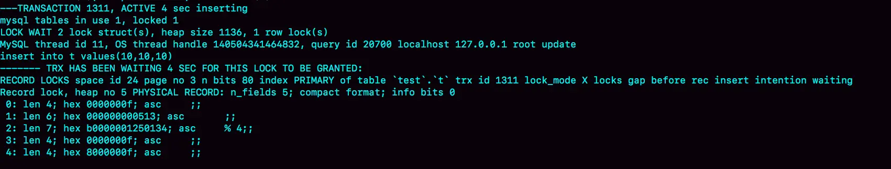
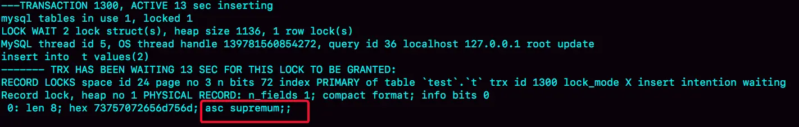

# 背景

数据库锁设计的初衷是处理并发问题。作为多用户共享的资源，当出现并发访问的时候，数据库需要合理地控制资源的访问规则。而锁就是用来实现这些访问规则的重要数据结构。

根据加锁的范围，MySQL 里面的锁大致可以分成**全局锁**、**表级锁**和**行锁**三类。

# 全局锁

## 全局锁定义

顾名思义，全局锁就是对整个数据库实例加锁。MySQL 提供了一个加全局读锁的方法，命令是 

```shell
Flush tables with read lock (FTWRL)
```
当需要让整个库处于只读状态的时候，可以使用这个命令，之后其他线程的以下语句会被阻塞：数据更新语句（数据的增删改）、数据定义语句（包括建表、修改表结构等）和更新类事务的提交语句。
业务的更新不只是增删改数据（DML)，还有可能是加字段等修改表结构的操作（DDL）。不论是哪种方法，一个库被全局锁上以后，对里面任何一个表做加字段操作，都是会被锁住的。

## 全局锁使用场景

全局锁的典型使用场景是，做**全库逻辑备份**。也就是把整库每个表都 select 出来存成文本。

如果是一张一张表分别做备份而不是锁全库，将会出现表之间的数据不一致。需要保证备份的库是在同一个逻辑时间点下。

官方自带的逻辑备份工具是 mysqldump。在 RR 隔离级别下，当 mysqldump 使用参数 –single-transaction 的时候，导数据之前就会启动一个事务，来确保拿到一致性视图。而由于 MVCC 的支持，这个过程中数据是可以正常更新的。

**为什么使用 FTWRL 而不是 mysqldump**

前提条件是引擎要支持 RR 隔离级别。MyISAM 就不支持，只能使用 FTWRL。

**全库只读，为什么不使用 set global readonly=true 的方式**

这种方式也能让全库进入只读状态。两个原因不使用：

1、readonly可能用作其他逻辑

有些系统中，readonly 的值会被用来做其他逻辑，比如用来判断一个库是主库还是备库。因此，修改 global 变量的方式影响面更大，不建议使用。

2、在异常处理机制上有差异。

如果执行 FTWRL 命令之后由于客户端发生异常断开，那么 MySQL 会自动释放这个全局锁，整个库回到可以正常更新的状态。而将整个库设置为 readonly 之后，如果客户端发生异常，则数据库就会一直保持 readonly 状态，这样会导致整个库长时间处于不可写状态，风险较高。

# 表级锁

MySQL 里面表级别的锁有两种：一种是表锁，一种是元数据锁（meta data lock，MDL)。

## 表锁

表锁的语法是`lock tables 表名 read/write`。与 FTWRL 类似，可以用 `unlock tables` 主动释放锁，也可以在客户端断开的时候自动释放。

需要注意，lock tables 语法除了会限制别的线程的读写外，也限定了本线程接下来的操作对象。

## 元数据锁

MDL 不需要显式使用，在访问一个表的时候会被自动加上。MDL 的作用是，保证读写的正确性。

在 MySQL 5.5 版本中引入了 MDL，**当对一个表做增删改查操作的时候，加 MDL 读锁；当要对表做结构变更操作的时候，加 MDL 写锁**。防止表结构变更导致数据读写有问题。

1、读锁之间不互斥，可以有多个线程对同一张表增删改查

2、读写锁之间、写锁之间互斥，用来保证变更表结构操作的安全性。因此，如果多个线程同时修改表结构需要串行；变更表期间不允许对表增删改查。

## 如何安全修改表结构

首先我们要解决长事务，事务不提交，就会一直占着 MDL 锁。如果此时需改表结构，需要 MDL 写锁会被阻塞。之后所有要新申请 MDL 读锁的请求也会被阻塞，可能导致库的线程被打满。

在 MySQL 的 information_schema 库的 innodb_trx 表中，可以查到当前执行中的事务。如果要做 DDL 变更的表时有长事务在执行，要考虑先暂停 DDL，或者 kill 掉这个长事务（kill可能不管用，因为新的请求可能又来了）。

阻塞了可以通过 `show processlist` 看到大量的Waiting for table metadata lock。真正阻塞的会话的 State 为空，Command 为 Sleep。

 

比较理想的机制，在 alter table 语句中设定等待时间，等待时间内拿到 MDL 写锁最好，拿不到也不要阻塞后面的业务语句。

MariaDB 已经合并了 AliSQL 的这个功能，所以这两个开源分支目前都支持 DDL NOWAIT/WAIT n 这个语法。需要确认是否支持该语法。

```sql
ALTER TABLE tbl_name NOWAIT add column ...
ALTER TABLE tbl_name WAIT N add column ... 
```
当使用 NOWAIT 关键字时，则在执行ddl语句时，遇到 MDL 锁不进行等待。
当使用 WAIT 关键字时，等待 N 

**Online DDL**

过程

1、拿MDL写锁

2、降级成MDL读锁

3、真正做DDL

4、升级成MDL写锁

5、释放MDL锁

1、2、4、5如果没有锁冲突，执行时间非常短。第3步占用了DDL绝大部分时间，这期间这个表可以正常读写数据，是因此称为“Online”。一般在第 1 步会被阻塞。

第 2 步退化成读锁的目的是为了实现 Online 更新，因为 MDL 读锁不会阻塞增删改操作。

不直接解锁是为了保护自己，禁止其他线程对这个表同时做 DDL。

额外说明的是，重建方法都会扫描原表数据和构建临时文件。对于大表来说该操作很消耗 IO 和 CPU 资源。Online DDL 可以考虑在业务低峰期使用，线上服务如果想要更安全的操作的话，建议使用 GitHub 开源的 gh-ost 来操作。

# 行锁

MySQL 的行锁是在引擎层由各个引擎自己实现的。但并不是所有的引擎都支持行锁，比如 MyISAM 引擎就不支持行锁。不支持行锁意味着并发控制只能使用表锁，对于这种引擎的表，同一张表上任何时刻只能有一个更新在执行，这就会影响到业务并发度。InnoDB 是支持行锁的，这也是 MyISAM 被 InnoDB 替代的重要原因之一。

## 两阶段锁

**在 InnoDB 事务中，行锁是在需要的时候才加上的，但并不是不需要了就立刻释放，而是要等到事务结束时才释放。这个就是两阶段锁协议。**

举例：

|事务A|事务B|
|:----|:----|
|begin;<br>update t set k=k+1 where id=1;<br>update t set k=k+1 where id=2;|    |
|    |begin;<br>update t set k=k+2 where id=1;|
|commit;|    |
|    |commit;|

事务 B 的 update 语句会被阻塞，直到事务 A 执行 commit 之后，事务 B 才能继续执行。事务 A 持有的两个记录的行锁，都是在 commit 的时候才释放的。

## 死锁和死锁检测

当并发系统中不同线程出现循环资源依赖，涉及的线程都在等待别的线程释放资源时，就会导致这几个线程都进入无限等待的状态，称为死锁。

死锁举例：

|事务A|事务B|
|:----|:----|
|begin;<br>update t set k=k+1 where id=1;<br>|begin;|
|    |update t set k=k+2 where id=2;|
|update t set k=k+1 where id=2;|    |
|commit;|update t set k=k+2 where id=1;|
|    |commit;|

解决策略：

1、设置等待超时，通过参数 innodb_lock_wait_timeout 来设置

InnnoDB 中该参数默认值为 50s，在线业务无法接受。但设置太短容易误伤简单的锁等待。

2、发起死锁检测，主动回滚死锁链条中的某一个事务，让其他事务得以继续执行。将参数 innodb_deadlock_detect 设置为 on，表示开启这个逻辑（默认开启）。

一般采取主动死锁检测。但每个新来的线程被堵住都要判断是否因为自己的加入导致死锁，时间复杂度为 O(n)。需要消耗大量的 CPU 资源。因此可以看到 CPU 利用率很高，但是每秒却执行不了几个事务。

**那么怎么解决热点行更新导致的性能问题？**

1、如果确保业务一定不会出现死锁，可以关闭死锁检测。

2、控制并发度。比如同一行同时最多只能有 10 个线程在更新，那么死锁的检测成本很低。在数据库接入层（中间件/修改 MySQL 源码）做并发控制，而不是客户端！

3、将一行记录拆分成多行来减少行冲突，如账户金额，可以拆成多个子账户，金额相加即为总账户金额。（可能会使业务逻辑变复杂）

# 间隙锁

本节隔离级别无特别说明默认 RR。

**锁是加在索引上的，这是 InnoDB 的一个基础设定。**所以分析加锁过程就具体分析锁加在哪个索引上。

## 幻读的由来

表定义：

```sql
CREATE TABLE `t5` (
  `id` int(11) NOT NULL,
  `c` int(11) DEFAULT NULL,
  `d` int(11) DEFAULT NULL,
  PRIMARY KEY (`id`),
  KEY `c` (`c`)
) ENGINE=InnoDB;

insert into t5 values(0,0,0),(5,5,5),
(10,10,10),(15,15,15),(20,20,20),(25,25,25);
```

|    |Session A|Session B|Session C|
|:----|:----|:----|:----|
|T1|begin;<br>select * from t5 where d=5 for update; // Q1<br>result: (5,5,5)|    |    |
|T2|    |update t5 set d=5 where id=0;|    |
|T3|select * from t5 where d=5 for update; // Q2<br>result: (0,0,5), (5,5,5)|    |    |
|T4|    |    |insert into t5 values (1,1,5);|
|T5|select * from t5 where d=5 for update; // Q3<br>result: (0,0,5),(1,1,5),(5,5,5)|    |    |
|T6|commit;|    |    |

Q3 读到 id=1 这一行的现象，被称为“幻读”。**幻读指一个事务在前后两次查询同一个范围的时候，后一次查询看到了前一次查询没有看到的行。**

幻读特别说明：

1、在 RR 隔离级别下，普通的查询是快照读，是不会看到别的事务插入的数据的。因此幻读在“当前读”下才会出现。

2、上面 session B 的修改结果，被 session A 之后的 select 语句用“当前读”看到，不能称为幻读。幻读仅专指“新插入的行”。

## 幻读的问题

1、语义的破坏

Session A 在 T1 时刻声明了“要把所有 d=5 的行锁住，不允许其它事务进行读写操作”。而实际上破坏了 Q1 的加锁声明，语义被破坏。

2、数据一致性的问题

**锁的设计是为了保证数据的一致性。不止数据库内部数据状态在同一时刻的一致性，还包含数据和日志在逻辑上的一致性。**

数据不一致举例：

|    |Session A|Session B|Session C|
|:----|:----|:----|:----|
|T1|begin;<br>select * from t5 where d=5 for update; // Q1<br>update t5 set d=100 where d=5;|    |    |
|T2|    |update t5 set d=5 where id=0;|    |
|T3|select * from t5 where d=5 for update; // Q2|    |    |
|T4|    |    |insert into t5 values (1,1,5);|
|T5|select * from t5 where d=5 for update; // Q3|    |    |
|T6|commit;|    |    |

如果按照前面的分析，数据应该是 

T1: (5,5,100)

T2: (0,5,0)

T4: (1,1,5)

但是 binlog 内容是：

T2 时刻，Session B 事务提交，写入了两条语句；

T4 时刻，Session C 事务提交，写入了两条语句；

T6 时刻，Session A 事务提交，写入了 update t set d=100 where d=5 这条语句。

即：

```sql
update t set d=5 where id=0; /*(0,0,5)*/

insert into t values(1,1,5); /*(1,1,5)*/

update t set d=100 where d=5;/*所有d=5的行，d改成100*/
```
binlog 用作主从同步或者克隆库时，数据为：(0,0,100)、(1,1,100) 和 (5,5,100)。
这样就造成了数据的不一致。

解决办法自然就是将 **扫描过程中碰到的行都加上写锁**。即 T1 时刻 Session A 把所有行都加上写锁。这样 T2 时刻 Session B 就被阻塞了，需要等到 T6 时刻 Session A commit 之后才能执行。

但是此时仍然有问题，对于 Session C 的插入行无法阻塞。

id 为 1 的行在数据库中是 (1,1,5)

binlog 内容为：

```sql
insert into t values(1,1,5); /*(1,1,5)*/

update t set d=100 where d=5;/*所有d=5的行，d改成100*/

update t set d=5 where id=0; /*(0,0,5)*/
```
而按照 binlog 的执行顺序是 (1,1,100)。
造成这个问题的原因是给所有行都加上锁时，id=1 这一行还不在所以加不上行锁。

## 解决幻读

产生幻读的原因是行锁只能锁住行，但是新插入记录，要更新记录之间的“间隙”。因此为了解决幻读问题，InnoDB 只好引入新的锁，也就是间隙锁 (Gap Lock)。

当执行  `select * from t where d=5 for update`  时，就不止是给数据库中已有的 6 个记录加上行锁，同时加了 7 个间隙锁。这样就确保了无法再插入新的记录。

与行锁的冲突间不一样，跟间隙锁存在冲突关系的是“往这个间隙中插入一个记录”这个操作。间隙锁之间都不存在冲突关系。举例：

|Session A|Session B|
|:----|:----|
|begin;<br>select * from t5 where c=7 lock in share mode;|    |
|    |begin;<br>select * from t5 where c=7 for update;|

这两个会话是不会冲突的，即 Session B 不会被阻塞。因为表中并没有 c=7 的数据，两个语句都是加的间隙锁，保证间隙不会插入数据。

**间隙锁 + 行锁 = next-key**

**Gap-Lock是左开右开，next-key lock是左开右闭**

**间隙锁在 RR 隔离级别下才会生效。如果把隔离级别设置为 RC 就没有间隙锁了。但同时要解决可能出现的数据和日志不一致问题，需要把 binlog 格式设置为 row。**

但间隙锁的出现，会影响并发度，比如带来了死锁的问题。如（分析略）：

|Session A|Session B|
|:----|:----|
|begin;<br>select * from t5 where id=9 for update;|    |
|    |begin;<br>select * from t5 where id=9 for update;|
|    |insert into t5 values (9,9,9);<br>(block)|
|insert into t5 values (9,9,9);<br>(error, Deadlock found)|    |

# 加锁规则

前提：MySQL 后面的版本可能会改变加锁策略，这里的规则只限于截止到现在的最新版本，即 5.x 系列 <=5.7.24，8.0 系列 <=8.0.13

2个原则+2个优化+1个bug

原则 1：加锁的基本单位是 next-key lock（前开后闭区间）。

原则 2：查找过程中访问到的对象才会加锁。

优化 1：索引上的等值查询，给唯一索引加锁的时候，next-key lock 退化为行锁。

优化 2：索引上的等值查询，向右遍历时且最后一个值不满足等值条件的时候，next-key lock 退化为间隙锁。

一个 bug：唯一索引上的范围查询会访问到不满足条件的第一个值为止。

表：

```sql
CREATE TABLE `t5` (
  `id` int(11) NOT NULL,
  `c` int(11) DEFAULT NULL,
  `d` int(11) DEFAULT NULL,
  PRIMARY KEY (`id`),
  KEY `c` (`c`)
) ENGINE=InnoDB;

insert into t5 values(0,0,0),(5,5,5),
(10,10,10),(15,15,15),(20,20,20),(25,25,25);
```

## 等值查询间隙锁

查询示例：

|Session A|Session B|Session C|
|:----|:----|:----|
|begin;<br>update t5 set d=d+1 where id=7;|    |    |
|    |insert into t5 values(8,8,8);<br>(blocked)|    |
|    |    |update t5 set d=d+1 where id=10;<br>(Query OK)|

由于表 t 中没有 id=7 的记录，所以用加锁规则判断：

1、根据原则 1，加锁单位是 next-key lock，Session A 加锁范围就是 (5,10]；

2、根据优化 2，这是一个等值查询 (id=7)，而 id=10 不满足查询条件，next-key lock 退化成间隙锁，因此最终加锁的范围是 (5,10)。

所以，Session B 要往这个间隙里面插入 id=8 的记录会被锁住，但是 Session C 修改 id=10 这行是可以的。

## 非唯一索引等值锁

查询示例：

|Session A|Session B|Session C|
|:----|:----|:----|
|begin;<br>select id from t5 where c=5 lock in share mode;|    |    |
|    |update t5 set d=d+1 where id=5;<br>(Query OK)|    |
|    |    |insert into t5 values(7,7,7);<br>(blocked)|

Session A 要给索引 c 上 c=5 的这一行加上读锁。

1、根据原则 1，加锁单位是 next-key lock，因此会给 (0,5] 加上 next-key lock。

2、要注意 c 是普通索引，因此仅访问 c=5 这一条记录是不能马上停下来的，需要向右遍历，查到 c=10 才放弃。根据原则 2，访问到的都要加锁，因此要给 (5,10] 加 next-key lock。

3、同时这个符合优化 2：等值判断，向右遍历，最后一个值不满足 c=5 这个等值条件，因此退化成间隙锁 (5,10)。

4、根据原则 2 ，只有访问到的对象才会加锁，这个查询使用覆盖索引，并不需要访问主键索引，所以主键索引上没有加任何锁，这就是为什么 Session B 的 update 语句可以执行完成。

Session C 要插入一个 (7,7,7) 的记录，会被 Session A 的间隙锁 (5,10) 锁住。注意，这个例子中 lock in share mode 只锁覆盖索引，但是如果是 for update 就不一样。 执行 for update 时，系统会认为接下来要更新数据，因此会顺便给主键索引上满足条件的行加上行锁。

这个例子说明，锁是加在索引上的；同时，如果要用 lock in share mode 来给行加读锁避免数据被更新的话，就必须得绕过覆盖索引的优化，在查询字段中加入索引中不存在的字段。比如，将 Session A 的查询语句改成 select d from t where c=5 lock in share mode。

## 主键索引范围锁

思考，下面两个语句加锁范围：

```sql
select * from t where id=10 for update;
select * from t where id>=10 and id<11 for update;
```
逻辑上，id 是 int 型，两条查语句肯定是等价的，但是它们的加锁规则不太一样。
查询示例：

|Session A|Session B|Session C|
|:----|:----|:----|
|begin;<br>select * from t5 where id>=10 and id<11 for update;|    |    |
|    |insert into t5 values(8,8,8);<br>(Query OK)<br>insert into t5 values(13,13,13);<br>(blocked)|    |
|    |    |update t5 set d=d+1 where id=15;<br>(blocked)|

Session A 会加锁：

1、开始执行要找到第一个 id=10 的行，本该是 next-key lock(5,10]。 根据优化 1， 主键 id 上的等值条件，退化成行锁，只加了 id=10 这一行的行锁。

2、范围查找就往后继续找，找到 id=15 这一行停下来，因此需要加 next-key lock(10,15]。

所以，Session A 锁的范围就是主键索引上，行锁 id=10 和 next-key lock(10,15]。

这里需要注意，首次 Session A 定位查找 id=10 的行的时候，是当做等值查询来判断的，而向右扫描到 id=15 的时候，用的是范围查询判断。

如果 Session A 是  `select * from t5 where id=10 for update;` ，那么 Session B 和 Session C 都不会阻塞。

## 非唯一索引范围锁

示例：

|Session A|Session B|Session C|
|:----|:----|:----|
|begin;<br>select * from t5 where c>=10 and c<11 for update;|    |    |
|    |insert into t5 values(8,8,8);<br>(blocked)<br>insert into t5 values(13,13,13);<br>(blocked)|    |
|    |    |update t5 set d=d+1 where c=15;<br>(blocked)|

Session A 用字段 c 来判断，加锁规则跟 唯一索引范围锁 唯一的不同是：在第一次用 c=10 定位记录时，索引 c 上加了 (5,10] 这个 next-key lock 后，由于索引 c 是非唯一索引，没有优化规则不会蜕变为行锁，因此最终加锁为：索引 c 上的 (5,10] 和 (10,15] 这两个 next-key lock。

Session c 需要扫描到 c=15 才停止扫描，是合理的，因为 InnoDB 要扫到 c=15，才知道不需要继续往后查找。注意：如果是  `update t5 set d=d+1 where id=15` 是不阻塞的，因为这是用的主键索引更新没有锁住的索引 c。但如果是  `update t5 set c=c+1 where id=15` 仍然是阻塞的，因为更新了锁住的索引 c。

## 唯一索引范围锁bug

示例：

|Session A|Session B|Session C|
|:----|:----|:----|
|begin;<br>select * from t5 where id>10 and id<=15 for update;|    |    |
|    |update t5 set d=d+1 where id=20;<br>(blocked)|    |
|    |    |insert into t5 values(16,16,16);<br>(blocked)|

Session A 是一个范围查询，按照原则 1 的话，应该是索引 id 上只加 (10,15]这个 next-key lock，并且因为 id 是唯一键，所以循环判断到 id=15 这一行就应该停止了。

但是实现上，InnoDB 会往前扫描到第一个不满足条件的行为止，也就是 id=20。而且由于这是个范围扫描，因此索引 id 上的 (15,20]这个 next-key lock 也会被锁上。

Bug 范围：InnoDB（5.x 系列 <=5.7.24，8.0 系列 <=8.0.13。）【待验证】

非主键唯一索引 bug 范围：InnoDB （<=8.0.21）【待验证】

注意 唯一索引 并不一定是 主键索引。

## 非唯一索引存在等值

先在索引 c 上增加一条 c=10 的记录：

```sql
insert into t5 values(30,10,30);
```
示例：
|Session A|Session B|Session C|
|:----|:----|:----|
|begin;<br>delete from t5 where c=10;|    |    |
|    |insert into t5 values(12,12,12);<br>(blocked)|    |
|    |    |update t5 set d=d+1 where c=15;<br>(Query OK)|

Session A 在遍历的时候，先访问第一个 c=10 的记录。根据原则 1，这里加的是 (c=5,id=5) 到 (c=10,id=10) 这个 next-key lock。然后，session A 向右查找，直到碰到 (c=15,id=15) 这一行，循环才结束。根据优化 2，这是一个等值查询，向右查找到了不满足条件的行，所以会退化成 (c=10,id=10) 到 (c=15,id=15) 的间隙锁。

## limit加锁

接着上面 非唯一索引存在等值 的情况，同样地这里也增加一条 c=10 的记录。

|Session A|Session B|
|:----|:----|
|begin;<br>delete from t5 where c=10 limit2;|    |
|    |insert into t5 values(12,12,12);<br>(Query OK)|

Session A 的 delete 语句加了 limit 2。其实表 t5 里 c=10 的记录其实只有两条加不加 limit 2，删除的效果是一样的，但是加锁的效果却不同。可以看到Session B 的 insert 语句执行通过了，跟上面案例的结果不同。

这里 delete 语句明确加了 limit 2 的限制，因此在遍历到 (c=10, id=30) 这一行之后，满足条件的语句已经有两条，循环就结束了。索引 c 上的加锁范围就变成了从（c=5,id=5) 到（c=10,id=30) 这个前开后闭区间。(c=10,id=30）之后的这个间隙并没有在加锁范围里，因此 insert 语句插入 c=12 是可以执行成功的。

经验：**在删除数据的时候尽量加 limit。不仅可以控制删除数据的条数让操作更安全，还可以减小加锁的范围。**

注意：binlog 格式为 statement时，删除语句where中有多个索引并且带limit可能会导致不同数据库之间，所选用的索引不一致而导致选到的数据不一致。

## 死锁示例

示例：

|Session A|Session B|
|:----|:----|
|begin;<br>select id from t5 where c=10 lock in share mode;|    |
|    |update t5 set d=d+1 where c=10;<br>(blocked)|
|insert into t5 values(8,8,8);<br>(Query OK)|    |
|    |Deadlock found|

分析：

1、Session A 启动事务后执行查询语句加 lock in share mode，在索引 c 上加了 next-key lock (5,10] 和间隙锁 (10,15)；

2、Session B 的 update 语句也要在索引 c 上加 next-key lock (5,10] ，进入锁等待；

3、Session A 要再插入 (8,8,8) 这一行，被 Session B 的间隙锁（B 的加锁范围和 A 相同）锁住。由于出现了死锁，InnoDB 让 session B 回滚。

问题：Session B 的锁不是阻塞了吗？为什么还会有死锁？

Session B 加 next-key lock (5,10] 操作，实际上分成了两步，先是加 (5,10) 的间隙锁，加锁成功；然后加 c=10 的行锁，这时候才被锁住的。（间隙锁之间不冲突，行锁与间隙锁才冲突）

## order加锁

示例：

|Session A|Session B|Session C|
|:----|:----|:----|
|begin;<br>select * from t5 where c>=15 and c<=20 order by c desc lock in share mode;|    |    |
|    |insert into t5 values(8,8,8);<br>(blocked)|    |
|    |    |insert into t5 values(11,11,11);<br>(blocked)|

分析：

1、由于是 order by c desc，第一个要定位的是索引 c 上“最右边的”c=20 的行，所以会加上间隙锁 (20,25) 和 next-key lock (15,20]。

2、在索引 c 上向左遍历，要扫描到 c=10 才停下来，所以 next-key lock 会加到 (5,10]，这正是阻塞 Session B 的 insert 语句的原因。

3、扫描过程中，c=20、c=15、c=10 这三行都存在值，由于是 select *，所以会在主键 id 上加三个行锁，c=10 不满足条件就蜕化了。

所以 Session A 的 select 语句锁的范围就是：

1、索引 c 上 (5, 25)；

2、主键索引上 id=15、20 两个行锁。

## insert加锁*

表：

```sql
CREATE TABLE `t41` (
  `id` int(11) NOT NULL AUTO_INCREMENT,
  `c` int(11) DEFAULT NULL,
  `d` int(11) DEFAULT NULL,
  PRIMARY KEY (`id`),
  UNIQUE KEY `c` (`c`)
) ENGINE=InnoDB;

insert into t41 values(null, 1,1);
insert into t41 values(null, 2,2);
insert into t41 values(null, 3,3);
insert into t41 values(null, 4,4);

create table t42 like t41;
```
### insert select语句

insert … select 是很常见的在两个表之间拷贝数据的方法。在可重复读隔离级别下，这个语句会给 select 的表里扫描到的记录和间隙加读锁。不加锁会出现主从不一致。

### insert循环写入

语句1：

```sql
insert into t42(c,d)  (select c+1, d from t41 force index(c) order by c desc limit 1);
```
这个语句的加锁范围是表 t41 索引 c 上的 (3,4] 和 (4,supremum] 这两个 next-key lock，以及主键索引上 id=4 这一行。
慢查询日志查到 Rows_examined=1，正好验证了执行这条语句的扫描行数为 1。

语句2：

```sql
insert into t41(c,d)  (select c+1, d from t41 force index(c) order by c desc limit 1);
```
慢查询日志 Rows_examined 的值是 5。
```shell
mysql> explain insert into t41(c,d)  (select c+1, d from t41 force index(c) order by c desc limit 1);
+----+-------------+-------+------------+-------+---------------+------+---------+------+------+----------+-----------------+
| id | select_type | table | partitions | type  | possible_keys | key  | key_len | ref  | rows | filtered | Extra           |
+----+-------------+-------+------------+-------+---------------+------+---------+------+------+----------+-----------------+
|  1 | INSERT      | t41   | NULL       | ALL   | NULL          | NULL | NULL    | NULL | NULL |     NULL | NULL            |
|  1 | SIMPLE      | t41   | NULL       | index | NULL          | c    | 5       | NULL |    1 |   100.00 | Using temporary |
+----+-------------+-------+------------+-------+---------------+------+---------+------+------+----------+-----------------+
2 rows in set (0.00 sec)
```
Extra 字段可以看到“Using temporary”字样，表示这个语句用到了临时表。即执行过程中，需要把表 t 的内容读出来，写入临时表。但 rows 为 1。
可以通过  `show status like '%Innodb_rows_read%';` 看看 InnoDB 扫描的行数。

```shell
mysql> show status like '%Innodb_rows_read%';
+------------------+---------+
| Variable_name    | Value   |
+------------------+---------+
| Innodb_rows_read | 1474566 |
+------------------+---------+
1 row in set (0.01 sec)

mysql> insert into t41(c,d)  (select c+1, d from t41 force index(c) order by c desc limit 1);
Query OK, 1 row affected (0.00 sec)
Records: 1  Duplicates: 0  Warnings: 0

mysql> show status like '%Innodb_rows_read%';
+------------------+---------+
| Variable_name    | Value   |
+------------------+---------+
| Innodb_rows_read | 1474570 |
+------------------+---------+
1 row in set (0.00 sec)
```
可以看到，这个语句执行前后，Innodb_rows_read 的值增加了 4。因为默认临时表是使用 Memory 引擎的，所以这 4 行查的都是表 t41，也就是说对表 t41 做了全表扫描。
执行过程：

1、创建临时表，表里有两个字段 c 和 d。

2、按照索引 c 扫描表 t，依次取 c=4、3、2、1，然后回表读到 c 和 d 的值写入临时表。这时，Rows_examined=4。

3、由于语义里面有 limit 1，所以只取了临时表的第一行，再插入到表 t 中。这时，Rows_examined 的值加 1，变成了 5。

也就是这个语句会导致在表 t41 上做全表扫描，并且会给索引 c 上的所有间隙都加上共享的 next-key lock。所以，这个语句执行期间，其他事务不能在这个表上插入数据。

对于一边遍历数据，一边更新数据的情况，如果不使用临时表保存遍历的数据，可能会导致读到刚刚插入的记录，与语义不符。 优化：创建临时表，先插入临时表，再从临时表中取数据。

```sql
create temporary table temp_t(c int,d int) engine=memory;
insert into temp_t  (select c+1, d from t force index(c) order by c desc limit 1);
insert into t select * from temp_t;
drop table temp_t;
```


如果 insert 和 select 的对象是同一个表，则有可能会造成循环写入。这种情况下需要引入用户临时表来做优化。

### insert冲突加锁

举例（RR 下）：

|Session A|Session B|
|:----|:----|
|insert into t41 values(10,10,10);|    |
|begin;<br>insert into t41 values(11,10,10);<br>(Duplicate entry '10' for key 'c')|    |
|    |insert into t41 values(12,9,9);<br>(blocked)|

Session A 执行的 insert 语句，发生唯一键冲突时，并不只是简单地报错返回，还在冲突的索引上加了锁。一个 next-key lock 就是由它右边界的值定义的。这时 Session A 持有索引 c 上的 (5,10] 共享 next-key lock（读锁）。

[官方文档](https://dev.mysql.com/doc/refman/8.0/en/innodb-locks-set.html) 描述认为如果冲突的是主键索引就加记录锁，唯一索引才加 next-key lock。但实际上，这两类索引冲突加的都是 next-key lock。

按照提交的信息看这是mysql bug，已经修正。 （mysql 5.7.33）primary key 是不会block 的，唯一索引还是加的 next-key lock。

**唯一键冲突导致死锁场景**

|    |Session A|Session B|Session C|
|:----|:----|:----|:----|
|T1|begin;<br>insert into t41 values(null,5,5);|    |    |
|T2|    |insert into t41 values(null,5,5);|insert into t41 values(null,5,5);|
|T3|rollback;|    |(Deadlock found)|
|    |    |    |    |
|    |    |    |    |

这个死锁产生的逻辑：

1、在 T1 时刻，启动 Session A，并执行 insert 语句，此时在索引 c 的 c=5 上加了记录锁。注意，这个索引是唯一索引，因此退化为记录锁。

2、在 T2 时刻，session B 要执行相同的 insert 语句，发现了唯一键冲突，加上读锁；同样地，Session C 也在索引 c 上，c=5 这一个记录上，加了读锁。

3、T3 时刻，Session A 回滚。这时 Session B 和 Session C 都试图继续执行插入操作，都要加上写锁。两个 session 都要等待对方的行锁，所以就出现了死锁。（B C有一个会被执行，另一个被回滚）

insert 语句如果出现唯一键冲突，会在冲突的唯一值上加共享的 next-key lock(S 锁)。因此，碰到由于唯一键约束导致报错后，要尽快提交或回滚事务，避免加锁时间过长。

### insert on duplicate

```sql
insert into t41 values(11,10,10) on duplicate key update d=100; 
```
会给索引 c 上 (5,10] 加一个排他的 next-key lock（写锁）。
insert into … on duplicate key update 这个语义的逻辑是，插入一行数据，如果碰到唯一键约束，就执行后面的更新语句。如果有多个列违反了唯一性约束，就会按照索引的顺序，修改跟第一个索引冲突的行。

执行语句的 affected rows 返回的如果是 2 很容易造成误解。实际真正更新的只有一行，只是在代码实现上，insert 和 update 都认为成功了，update 计数加了 1， insert 计数也加了 1。

# 最佳实践

## 如何查看死锁

执行  `show engine innodb status`  命令会输出很多信息，有一节 LATESTDETECTED DEADLOCK，就是记录的最后一次死锁信息。

结果分成三部分：

(1) TRANSACTION，是第一个事务的信息；

(2) TRANSACTION，是第二个事务的信息；

WE ROLL BACK TRANSACTION (1)，是最终的处理结果，如回滚了哪一个事务。

（更多信息略）

得到两个结论：

1、由于锁是一个个加的，要避免死锁，对同一组资源，要按照尽量相同的顺序访问；

2、会回滚成本更小的事务。如在发生死锁的时刻，for update 这条语句占有的资源更多，回滚成本更大，所以 InnoDB 选择了回滚成本更小的 lock in share mode 语句。

## 如何查看锁等待

数据库记录为本文中的 t5。

|Session A|Session B|
|:----|:----|
|begin;<br>select * from t5 where id>10 and id<15 for update;|    |
|    |delete from t5 where id=10;<br>(Query OK)|
|    |insert into t5 values(10,10,10);<br>(blocked)|

 通过 `show engine innodb status` 查看信息，锁信息是在这个命令输出结果的 TRANSACTIONS 这一节




查看信息可以知道这是因为间隙锁阻塞了，原来的两个间隙 (5,10)、(10,15）变成了一个 (5,15)。

**间隙是随着数据的改变而改变。**

## update示例

|Session A|Session B|
|:----|:----|
|begin;<br>select c from t5 where c>5 lock in share mode;|    |
|    |update t set c=1 where c=5;<br>(Query OK)|
|    |update t set c=5 where c=1;<br>(blocked)|

Session A 的加锁范围是索引 c 上的 (5,10]、(10,15]、(15,20]、(20,25]和 (25,supremum]。注意：根据 c>5 查到的第一个记录是 c=10，因此不会加 (0,5]这个 next-key lock。

Session B 的第一个 update 语句，要把 c=5 改成 c=1，可以理解为两步：

1、插入 (c=1, id=5) 这个记录；

2、删除 (c=5, id=5) 这个记录。

索引 c 上 (5,10) 间隙是由这个间隙右边的记录，也就是 c=10 定义的。所以通过这个操作，Session A 的加锁范围就变成了  (1,10]、(10,15]、(15,20]、(20,25]和 (25,supremum]。

接下来 Session B 要执行 update t set c = 5 where c = 1 一样地可以拆成两步：

1、插入 (c=5, id=5) 这个记录；

2、删除 (c=1, id=5) 这个记录。

第一步试图在已经加了间隙锁的 (1,10) 中插入数据就被堵住了。

**这个例子的间隙也是随着数据的改变而改变。**

# FAQ

## 备份时DDL会怎么样

问题：当备库用 mysqldump 工具 –single-transaction 做逻辑备份的时候，如果从主库的 binlog 传来一个 DDL 语句会怎么样？

备份过程关键语句：

```shell
Q1:SET SESSION TRANSACTION ISOLATION LEVEL REPEATABLE READ;
Q2:START TRANSACTION  WITH CONSISTENT SNAPSHOT；
/* other tables */
Q3:SAVEPOINT sp;
/* 时刻 1 */
Q4:show create table `t1`;
/* 时刻 2 */
Q5:SELECT * FROM `t1`;
/* 时刻 3 */
Q6:ROLLBACK TO SAVEPOINT sp;
/* 时刻 4 */
/* other tables */
```
在备份开始的时候，为了确保 RR（可重复读）隔离级别，再设置一次 RR 隔离级别 (Q1)；
启动事务，这里用 WITH CONSISTENT SNAPSHOT 确保这个语句执行完就可以得到一个一致性视图（Q2)；

设置一个保存点，这个很重要（Q3）；

show create 是为了拿到表结构 (Q4)，然后正式导数据 （Q5），回滚到 SAVEPOINT sp，在这里的作用是释放 t1 的 MDL 锁 （Q6）。当然这部分属于“超纲”，上文正文里面都没提到。

DDL 从主库传过来的时间按照效果不同，定义了四个时刻。题目设定为小表，假定到达后，如果开始执行，则很快能够执行完成。

参考答案如下：

1、如果在 Q4 语句执行之前到达，现象：没有影响，备份拿到的是 DDL 后的表结构。

2、如果在“时刻 2”到达，则表结构被改过，Q5 执行的时候，报 Table definition has changed, please retry transaction，现象：mysqldump 终止；

3、如果在“时刻 2”和“时刻 3”之间到达，mysqldump 占着 t1 的 MDL 读锁，binlog 被阻塞，现象：主从延迟，直到 Q6 执行完成。

4、从“时刻 4”开始，mysqldump 释放了 MDL 读锁，现象：没有影响，备份拿到的是 DDL 前的表结构。

总结：

如果 mysqldump 备份的是整个 schema，某个小表t1只是该schema上其中有一张表

情况1：

master上对小表 t1 的 DDL 传输到 slave 去应用的时刻，mysqldump 已经备份完了t1表的数据，此时slave 同步正常，不会有问题。

情况2：

master上对小表 t1 的 DDL 传输到slave去应用的时刻，mysqldump 正在备份t1表的数据,此时会发生MDL 锁，从库上t1表的所有操作都会Hang 住。

情况3：

master 上对小表 t1 的 DDL 传输到slave去应用的时刻，mysqldump 还没对t1表进行备份，该DDL会在slave的t1表应用成功，但是当导出到t1表的时候会报“ERROR 1412 (HY000): Table definition has changed, please retry transaction” 错误，导致导出失败！

**在备份期间，备份线程 mysqldump 用 RR ，而业务线程用的是 RC。同时存在两种事务隔离级别会不会有问题？**


## 批量删除数据

删除一个表中的前 10000 条数据，有 3 种方法：

1、直接执行 `delete from t limit 10000` 

2、在一个连接中循环执行 20 次 `delete from t limit 500` 

3、在 20 个连接中同时执行 `delete from t limit 500` 

答案：

第 2 种方式相对较好。

第 1 种方式单个语句占用时间长，持有锁时间长，大事务还会导致主从延迟。

第 3 种方式会人为造成锁冲突。

或者采取用某种条件将 10000 行数据天然分开，如主键id或业务条件（结合第3种）

## 空表是否有间隙

一个空表就只有一个间隙。

|Session A|Session B|
|:----|:----|
|create table t7(id int primary key)engine=innodb;<br>begin;<br>select * from t7 where id>1 for update;|    |
|    |insert into t7 values(2);<br>(blocked)|
|show engine innodb status;|    |

Session A 加锁的范围就是 next-key lock (-∞, supremum]。


