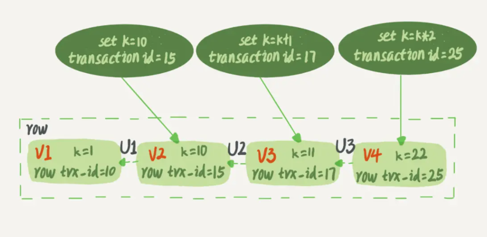

# 背景

MySQL 中，事务支持是在引擎层实现的。你现在知道，MySQL 是一个支持多引擎的系统，但并不是所有的引擎都支持事务。比如 MySQL 原生的 MyISAM 引擎就不支持事务，这也是 MyISAM 被 InnoDB 取代的重要原因之一。

# **事务特性**

ACID（Atomicity、Consistency、Isolation、Durability）

原子性:满足原子操作单元,对数据的操作,要么全部执行,要么全部失败。

一致性:事务开始和完成,数据都必须保持一致,

隔离性:事务之间是相互独立的,中间状态对外不可见。

持久性:数据的修改是永久的。

# 事务隔离级别

## 事务并发问题

当数据库上有多个事务同时执行的时候，就可能出现下列问题：

1、脏读（dirty read）

A事务还未提交,B事务就读到了A事务的结果。(**破坏了隔离性**)

2、不可重复读（non-repeatable read）

A事务在本次事务中,对自己未操作过的数据,进行了多次读取,结果出现了不一致或记录不存在的情况（**破坏了一致性**，update和delete）

3、幻读（phantom read）

A事务在本次事务中，对自己未操作过的数据，进行了多次读取，第一次读取时记录不存在，第二次读取时却出现记录

为了解决这些问题，就有了“隔离级别”的概念。

## 隔离级别

隔离级别越高，效率就会越低。因此需要在二者之间寻找一个平衡点。

SQL 标准的事务隔离级别包括：

1、读未提交（read uncommitted）

一个事务还没提交时，它做的变更就能被别的事务看到

2、读已提交（read committed）

一个事务提交之后，它做的变更才会被其他事务看到

3、可重复读（repeatable read）

一个事务执行过程中看到的数据，总是跟这个事务在启动时看到的数据是一致的。当然在可重复读隔离级别下，未提交变更对其他事务也是不可见的

4、串行化（serializable ）

对于同一行记录，“写”会加“写锁”，“读”会加“读锁”。当出现读写锁冲突的时候，后访问的事务必须等前一个事务执行完成，才能继续执行。

注意：这四个级别只是一个标准，各个数据库厂商，并不是完全按照这个标准来做的。

## 案例：不同隔离级别下读

|事务A|事务B|
|:----|:----|
|启动事务，<br>查询得到值 1|启动事务|
|    |查询得到值 1|
|    |将值 1 改成 2|
|查询得到值 V1|    |
|    |提交事务B|
|查询得到值 V2|    |
|提交事务A|    |
|查询得到值 V3|    |

针对这个案例，不同隔离级别会有不同的返回结果：

**读未提交**

虽然事务B还没有提交，但是事务A可以看到，V1 是 2，V2、V3都是2。

**读已提交**

事务A不可以看到事务B未提交的数据，因此 V1 是 1。事务B提交后事务A可以看到，因此 V2 是 2，V3 也是 2。

**可重复读**

V1 是 1，因为事务A在执行期间看到的数据前后必须是一致的，所以 V2 是 1，提交之后可见其它事务提交的数据，所以 V3 是 2。

**串行化**

事务B执行“将1改成2”时会被锁住，直到事务A提交后，事务B才可以继续执行。所以 V1、V2 是 1，V3 是 2。

## DB默认级别

大部分数据库的默认隔离级别是“读已提交”，如 Oracle。

而MySQL 默认隔离级别为“可重复读”。


# 事务实现(InnoDB)

在实现上，数据库里面会创建一个视图，访问的时候以视图的逻辑结果为准。

在“可重复读”隔离级别下，视图是在事务启动时创建的，整个事务存在期间都用这个视图。

在“读提交”隔离级别下，这个视图是在每个 SQL 语句开始执行的时候创建的。

这里需要注意的是，“读未提交”隔离级别下直接返回记录上的最新值，没有视图概念；

而“串行化”隔离级别下直接用加锁的方式来避免并行访问。

## 锁机制

阻止其他事务对数据进行操作,各个隔离级别主要体现在读取数据时加的锁和释放时机。

RU

事务读取的时候,不加锁

RC

事务读取的时候加行级共享锁(读到才加锁),一旦读完,立刻释放(并不是事务结束)。

RR

事务读取时加行级共享锁,直到事务结束才会释放。

SE

事务读取时加表级共享锁,直到事务结束时,才会释放。

其他还有一些不同,主要就这些。

## MVCC机制

生成一个数据快照,并用这个快照来提供一定级别的一致性的读取,也成为了多版本数据控制。

实际就是[CAS版本控制』和『读写分离』的思想。主要作用于 RC 和 RR 级别。

# MVCC

## 视图

在 MySQL 中，有两个“视图”概念：

1、一个是 view。它是一个用查询语句定义的虚拟表，在调用的时候执行查询语句并生成结果。创建视图的语法是 create view … ，而它的查询方法与表一样。

2、另一个是 InnoDB 在实现 MVCC 时用到的一致性读视图，即 consistent read view，用于支持 RC（Read Committed，读提交）和 RR（Repeatable Read，可重复读）隔离级别的实现。

它没有物理结构，作用是事务执行期间用来定义“我能看到什么数据”。

## 快照

在可重复读隔离级别下，事务在启动的时候就“拍了个快照”。注意，这个快照是基于整库的。

InnoDB 里面每个事务有一个唯一的事务 ID，叫作 transaction id。它是在事务开始的时候向 InnoDB 的事务系统申请的，是按申请顺序严格递增的。

而每行数据也都是有多个版本的。每次事务更新数据的时候，都会生成一个新的数据版本，并且把 transaction id 赋值给这个数据版本的事务 ID，记为 row trx_id。同时，旧的数据版本要保留，并且在新的数据版本中，能够有信息可以直接拿到它。

也就是说，数据表中的一行记录，其实可能有多个版本 (row)，每个版本有自己的 row trx_id。

如下图就是一个记录被多个事务连续更新后的状态。

行状态变更图




上图中的三个虚线箭头，就是 undo log；而 V1、V2、V3 并不是物理上真实存在的，而是每次需要的时候根据当前版本和 undo log 计算出来的。比如，需要 V2 的时候，就是通过 V4 依次执行 U3、U2 算出来。

## 一致性视图

按照可重复读的定义，一个事务启动时，能够看到所有已经提交的事务结果。但是之后这个事务的执行期间，其他事务的更新对它不可见。

在实现上， InnoDB 为每个事务构造了一个数组，用来保存这个事务启动瞬间，当前正在“活跃”的所有事务 ID。**“活跃”指的就是，启动了但还没提交**。

数组里面事务 ID 的最小值记为低水位，当前系统里面已经创建过的事务 ID 的最大值加 1 记为高水位。

这个视图数组和高水位，就组成了当前事务的一致性视图（read-view）

而数据版本的可见性规则，就是基于数据的 row trx_id 和这个一致性视图的对比结果得到的。

视图数据把所有的 row trx_id 分成了几种不同的情况。


[数据版本可见性规则]

对于当前事务的启动瞬间来说，一个数据版本的 row trx_id，有以下几种可能：

1、如果落在绿色部分，表示这个版本是已提交的事务或者是当前事务自己生成的，这个数据是可见的；

2、如果落在红色部分，表示这个版本是由将来启动的事务生成的，是肯定不可见的；

3、如果落在黄色部分，那就包括两种情况

a、若 row trx_id 在数组中，表示这个版本是由还没提交的事务生成的，不可见；

b、若 row trx_id 不在数组中，表示这个版本是已经提交了的事务生成的，可见。（注意上面说的“活跃”：启动了但还没提交）

所以InnoDB 利用了“所有数据都有多个版本”的这个特性，实现了“秒级创建快照”的能力。

一个数据版本，对于一个事务视图来说，除了自己的更新总是可见以外，有三种情况：

**1、版本未提交，不可见；**

**2、版本已提交，但是是在视图创建后提交的，不可见；**

**3、版本已提交，而且是在视图创建前提交的，可见。**

换言之 一致性读 下：

1、对于可重复读，查询只承认在事务启动前就已经提交完成的数据；

2、对于读提交，查询只承认在语句启动前就已经提交完成的数据。

**而当前读，总是读取已经提交完成的最新版本。**

## 当前读

**更新数据都是先读后写的，而这个读，只能读当前的值，称为“当前读”（current read）**

除了 update 语句外，select 语句如果加锁（lock in share mode 或 for update），也是当前读。如：

```sql
select k from t where id=1 lock in share mode;
select k from t where id=1 for update;
```

## MVCC延伸

表结构变更（DDL）为什么不支持“可重复读”？这是因为表结构没有对应的行数据，也没有 row trx_id，因此只能遵循当前读的逻辑。

MySQL 8.0 已经可以把表结构放在 InnoDB 字典里了，也许以后会支持表结构的可重复读。

# 案例

## 无法更新数据

事务隔离级别为 RR。

```sql
mysql> CREATE TABLE `t` (
  `id` int(11) NOT NULL,
  `c` int(11) DEFAULT NULL,
  PRIMARY KEY (`id`)
) ENGINE=InnoDB;
insert into t(id, c) values(1,1),(2,2),(3,3),(4,4);
```
更新数据：0 rows
```shell
mysql> begin;
Query OK, 0 rows affected (0.00 sec)

mysql> select * from t;
+----+------+
| id | c    |
+----+------+
|  1 |    1 |
|  2 |    2 |
|  3 |    3 |
|  4 |    4 |
+----+------+
4 rows in set (0.00 sec)

mysql> update t set c=0 where id=c;
Query OK, 0 rows affected (0.00 sec)
Rows matched: 0  Changed: 0  Warnings: 0

mysql> select * from t;
+----+------+
| id | c    |
+----+------+
|  1 |    1 |
|  2 |    2 |
|  3 |    3 |
|  4 |    4 |
+----+------+
4 rows in set (0.00 sec)
```
问题：模拟该情况，并说明原理。
答案1：

|Session A|Session B|
|:----|:----|
|begin;<br>select * from t;|    |
|    |update t set c=c+1;|
|update t set c=0 where id=c;<br>select * from t;|    |

答案2：（类似答案1）

|Session A|Session B|
|:----|:----|
|    |begin;<br>select * from t;|
|begin;<br>select * from t;|    |
|    |update t set c=c+1;<br>commit;|
|update t set c=0 where id=c;<br>select * from t;|    |


# 实战操作

## 事务启动方式

显示启动事务

```shell
begin;  # 或 start transaction
rollback;
commit;
```
隐式启动事务
```shell
# 取消线程的自动提交，直到主动执行 commit 或 rollback
set autocommit=0  # 建议设置为 1，显示启动事务
```

注意：

begin/start transaction 命令并不是一个事务的起点，在执行到它们之后的第一个操作 InnoDB 表的语句，事务才真正启动。如果你想要马上启动一个事务，可以使用 start transaction with consistent snapshot 这个命令。

第一种启动方式，一致性视图是在执行第一个快照读语句时创建的；

第二种启动方式，一致性视图是在执行 start transaction with consistent snapshot 时创建的。

额外说明：

“start transaction with consistent snapshot; ”的意思是从这个语句开始，创建一个持续整个事务的一致性快照。所以，在 RC 隔离级别下，这个用法就没意义了，等效于普通的 start transaction。

因为 RC 级别下，事务开启后每一个语句执行前都会重新计算一个新视图，用这种方式解决脏读，但是有不可重复读的问题。和 RR 级别下创建视图和使用视图不一样。


# FAQ

## 避免长事务影响

从应用开发端和数据库端来看：

### 应用开发端

1、确认是否使用了 set_autocommit=0。

可以通过开启 general_log，查询日志开启。（将其值改为 1）

方法一： 　

```shell
# 设置路径 　　
mysql>set global general_log_file='/tmp/general.lg'; 
# 开启general log模式
mysql>set global general_log=on; 
mysql>set global general_log=off; 
```
关闭general log模式 命令行设置即可,无需重启 在general log模式开启过程中，所有对数据库的操作都将被记录 general.log 文件 
方法二： 

也可以将日志记录在表中 set global log_output='table' 运行后,可以在mysql数据库下查找 general_log 表 

```sql
# 二、查询日志关闭 查看是否是开启状态： 
mysql> show global variables like '%general%'; 
mysql> set global general_log = off; // 关闭查询日志
```

2、确实是否有不必要的只读事务

有些框架会习惯不管什么语句先用 begin/commit 框起来。我见过有些是业务并没有这个需要，但是也把好几个 select 语句放到了事务中。这种只读事务可以去掉。

3、控制每个语句执行的最长时间

业务连接数据库的时候，根据业务本身的预估，通过 SET MAX_EXECUTION_TIME 命令，避免单个语句意外执行太长时间。

### 数据库端

1、监控 information_schema.Innodb_trx 表，设置长事务阈值，超过就报警 / 或者 kill

2、Percona 的 pt-kill 这个工具不错，推荐使用

3、在业务功能测试阶段要求输出所有的 general_log，分析日志行为提前发现问题；

4、如果使用的是 MySQL 5.6 或者更新版本，把 innodb_undo_tablespaces 设置成 2（或更大的值）。如果真的出现大事务导致回滚段过大，这样设置后清理起来更方便。

innodb_undo_tablespaces 是控制 undo 是否开启独立的表空间的参数。

为0表示：undo使用系统表空间，即ibdata1 

不为0表示：使用独立的表空间，一般名称为 undo001 undo002，存放地址的配置项为：innodb_undo_directory 一般innodb_undo_tablespaces 默认配置为0，innodb_undo_directory默认配置为当前数据目录


# Reference

[https://github.com/Yhzhtk/note/issues/42](https://github.com/Yhzhtk/note/issues/42)

[https://juejin.im/post/6844903919387148296](https://juejin.im/post/6844903919387148296)

[https://tech.meituan.com/2014/08/20/innodb-lock.html](https://tech.meituan.com/2014/08/20/innodb-lock.html)
