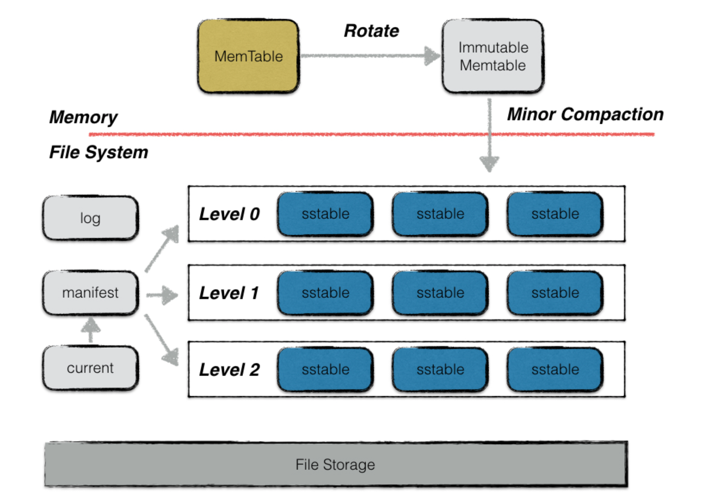

# 简介

## 简介

LevelDB 是一个key/value型的单机存储引擎，由google开发，并宣布在BSD许可下开放源代码。它是 leveling+ 分区实现的LSM典型代表。

## 特性

* key、value支持任意的byte类型数组，不单单支持字符串
* LevelDB 是一个持久化存储的KV系统，将大部分数据存储到磁盘上
*  按照记录key值顺序存储数据，并且LevleDb支持按照用户定义的比较函数进行排序
* 操作接口简单，包括写/读记录以及删除记录，也支持针对多条操作的原子批量操作。
* 支持数据快照（snapshot）功能，使得读取操作不受写操作影响，可以在读操作过程中始终看到一致的数据。
* 支持数据压缩（snappy压缩）操作，有效减小存储空间、并增快IO效率。
* LSM典型实现，适合写多读少。
## 限制

LevelDB 只是一个 C/C++ 编程语言的库，需要封装自己的网络服务器，无法像一般意义的存储服务器（如 MySQL）那样直接用客户端来连接。非关系型数据模型（NoSQL），不支持sql语句，也不支持索引，且一次只允许一个进程访问一个特定的数据库。

## 编译与使用

### 源码

源码下载

```shell
git clone https://github.com/google/leveldb.git
git submodule update --init
```
安装三方模块
直接编译因为 third_party 中缺少 googletest 和 benchmark 子模块，需要单独安装。

```shell
cd third_party
git clone git@github.com:google/googletest.git
git clone git@github.com:google/benchmark.git
```

安装 sqlite3：

```shell
sudo apt-get install sqlite3
```

编译

>注意避免修改了源码文件导致编译失败。

```shell
cd leveldb
mkdir -p build && cd build 
# release版
cmake -DCMAKE_BUILD_TYPE=Release .. && cmake --build .
# 或debug版
cmake -DCMAKE_BUILD_TYPE=Debug .. && cmake --build .
```
编译Demo
```shell
# 头文件加入系统目录(可选)
cp -r ./include/leveldb /usr/include/
cp build/libleveldb.a /usr/local/lib/
# 编写demo
# 编译demo
g++ -o xxx xxx.cpp libleveldb.a -lpthread
```

## 压测

参照源码中的 benchmarks 目录

# 整体架构




LevelDB 作为存储系统，数据记录的存储介质包括内存以及磁盘文件。写数据时，接口会同时写入 MemTable（内存）和 Log 文件。当 MemTable 达到阈值时，MemTable 会冻结变成 Immutable MemTable（内存），并将数据写入 SSTable（磁盘上）中，在此同时会生成新的 MemTable 及 Log 文件供新的数据写入。

## Log文件

LevelDB 写操作不是直接写入磁盘，而是先写入内存。加入写入到内存的数据还未来得及持久化，发生异常或者服务器宕机等会造成写入的数据丢失。因此，在写入内存之前会首先将所有的写操作写入日志文件中（其它存储系统都是这种通用做法）。每次写操作都是通过 append 方式顺序写入，整体写入性能好效率高。

## Memtable

写入操作并不是直接将数据写入到磁盘文件，而是采用先将数据写入内存的方式。memtable 就是使用跳表实现的内存数据结构。数据按用户定义的方法排序之后按序存储，等到其存储内容到达阈值时（4MB）时，便将其转换成一个不可修改的 memtable，与此同时创建一个新的memtable 来供用户进行读写操作。因为使用跳表，它的大多数操作都是O(logn)。

## Immutable Memtable

达到 Memtable 设置的容量上限后，Memtable 会变为 Immutable 为之后向SST文件的归并做准备。 同 Memtable 的结构定义一样。两者的区别只是 Immutable Memtable 是只读的。Immutable Memtable 被创建时，LevelDB 的后台压缩进程便会利用其中的内容创建一个sstable，然后持久化到磁盘中。Immutable Mumtable不再接受用户写入，同时生成新的 Memtable、Log 文件供新数据写入。

## SSTable文件

磁盘数据存储文件。SSTable(Sorted String Table) 就是由内存中的数据不断导出并进行Compaction 操作后形成的，而且 SSTable 的所有文件是一种层级结构，第一层为Level 0，第二层为 Level 1，依次类推，层级逐渐增高，这也是为何称之为 LevelDB 的原因。此外，Compact 动作会将多个 SSTable 合并成少量的几个 SSTable，以剔除无效数据，保证数据访问效率并降低磁盘占用。

### Manifest文件

Manifest 文件中记录SST文件在不同Level的分布，单个SST文件的最大最小key，以及其他一些LevelDB需要的元信息。

## Current文件

主要是记录当前 Manifest 的文件名。LevelDB 启动时的首要任务就是找到当前的 Manifest，而 Manifest 文件可能有多个。Current 文件记录了当前 Manifest 的文件名，从而让 LevelDB 启动时能够找到当前的 Manifest。


# Reference

[https://github.com/google/leveldb](https://github.com/google/leveldb)

