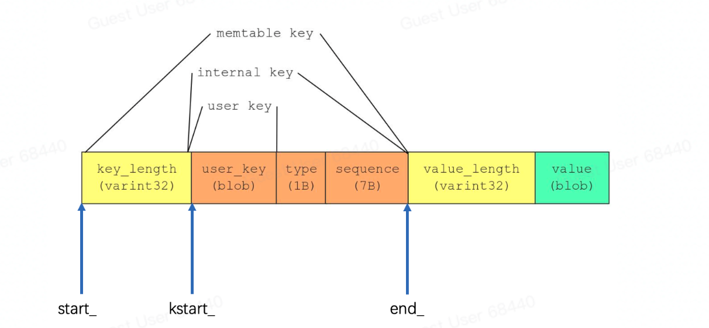

# Slice

## 作用

Slice 是 leveldb 中自定义的字符串处理类，主要是因为标准库中的 string 存在如下问题：

* 默认语义为拷贝，会损失性能。（在可预期的条件下，可以通过指针传递）
* 使用不太方便，不支持 remove_prefix 和 starts_with 等函数
Slice 的作用：

* 数据结构简单，包括length和一个指向外部字节数组的指针。
* 相比返回 std::string，返回 Slice的开销小很多（没有拷贝，Slice 没有实际数据只有指向数据的指针）
* 允许key和value包含’\0’
## 兼容性

可以方便实现与 std::string 的互相转换

```c++
// string 转slice：
leveldb::Slice s1 = "hello";
std::string str("world");
leveldb::Slice s2 = str;

// slice转string:
std::string str = s1.ToString();
assert(str == std::string("hello"));
```

## 源码

在 include/leveldb/slice.h 中，较简单。

# Key

Key 的代码都在 dbformat.cc / dbformat.h

Key 的关系图如下：




## InternalKey

### 作用

用户输入的数据 key 使用 slice ，LevelDB 则使用 InternalKey 作为 内部key，常用来比较 key 等场景。

### 结构

[Slice user_key] + [SequenceNumber<<8 + ValueType]，后半部分固定64位，即8字节。

## LookupKey

### 作用

查找对象的时候，查找顺序是从第0层到第n层遍历查找，找到为止(最新的修改或者删除的数据会优先被找到)。由于不同层的键值不同，所以 LookupKey 提供了不同层所需的键值。（用于 DBImpl:Get）

### 结构

```c++
private:
 // We construct a char array of the form:
 //    klength  varint32               <-- start_
 //    userkey  char[klength]          <-- kstart_
 //    tag      uint64
 //                                    <-- end_
 // The array is a suitable MemTable key.
 // The suffix starting with "userkey" can be used as an InternalKey.
 const char* start_;  // user_key.size() + 8 变长编码后的值
 const char* kstart_; // userkey
 const char* end_;    // 64位整型顺序号<<8+值类型 64位定长编码后的值
 char space_[200];  // Avoid allocation for short keys
```

memtable_key = start_ + kstart_ + end_

internal_key = kstart_ + end_

user_key = kstart_

 

## ParsedInternalKey

### 作用

对 InternalKey 的解析，InternalKey 是一个字符串

### 结构

```plain
struct ParsedInternalKey {
  Slice user_key;
  SequenceNumber sequence;
  ValueType type;
```

# SkipList

## 定义

跳跃表：可以代替平衡树的数据结构，可以看成并联的有序链表。跳跃表通过概率保证平衡，而平衡树通过严格的旋转来保证平衡，因此跳跃表实现比较容易，相比平衡树有较高的运行效率。

>Redis 中默认的最大 level 为 64。

## 实现

```c++
// skiplist.h
template <typename Key, class Comparator>
class SkipList {
 private:
  struct Node;
 public:
  ...
   private:
    const SkipList* list_;
    Node* node_;
    // Intentionally copyable
  };
 private:
  enum { kMaxHeight = 12 };
  inline int GetMaxHeight() const {
    return max_height_.load(std::memory_order_relaxed);
  }
  Node* NewNode(const Key& key, int height);
  int RandomHeight();
  bool Equal(const Key& a, const Key& b) const { return (compare_(a, b) == 0); }
  // Return true if key is greater than the data stored in "n"
  bool KeyIsAfterNode(const Key& key, Node* n) const;
  // Return the earliest node that comes at or after key.
  // Return nullptr if there is no such node.
  //
  // If prev is non-null, fills prev[level] with pointer to previous
  // node at "level" for every level in [0..max_height_-1].
  Node* FindGreaterOrEqual(const Key& key, Node** prev) const;
  // Return the latest node with a key < key.
  // Return head_ if there is no such node.
  Node* FindLessThan(const Key& key) const;
  // Return the last node in the list.
  // Return head_ if list is empty.
  Node* FindLast() const;
  // Immutable after construction
  Comparator const compare_;
  Arena* const arena_;  // Arena used for allocations of nodes
  Node* const head_;
  // Modified only by Insert().  Read racily by readers, but stale
  // values are ok.
  std::atomic<int> max_height_;  // Height of the entire list
  // Read/written only by Insert().
  Random rnd_;
};
// Implementation details follow
template <typename Key, class Comparator>
struct SkipList<Key, Comparator>::Node {
  explicit Node(const Key& k) : key(k) {}
  Key const key;
  // Accessors/mutators for links.  Wrapped in methods so we can
  // add the appropriate barriers as necessary.
  Node* Next(int n) {
    assert(n >= 0);
    // Use an 'acquire load' so that we observe a fully initialized
    // version of the returned Node.
    return next_[n].load(std::memory_order_acquire);
  }
  void SetNext(int n, Node* x) {
    assert(n >= 0);
    // Use a 'release store' so that anybody who reads through this
    // pointer observes a fully initialized version of the inserted node.
    next_[n].store(x, std::memory_order_release);
  }
  // No-barrier variants that can be safely used in a few locations.
  Node* NoBarrier_Next(int n) {
    assert(n >= 0);
    return next_[n].load(std::memory_order_relaxed);
  }
  void NoBarrier_SetNext(int n, Node* x) {
    assert(n >= 0);
    next_[n].store(x, std::memory_order_relaxed);
  }
 private:
  // Array of length equal to the node height.  next_[0] is lowest level link.
  // 提前使用声明分配1个对象的内存，因为第0层数据肯定都有
  // 使用数组的方式，后续分配的内存都是连续的，atomic 保证原子性
  std::atomic<Node*> next_[1];
};
template <typename Key, class Comparator>
typename SkipList<Key, Comparator>::Node* SkipList<Key, Comparator>::NewNode(
    const Key& key, int height) {
  // 前面已经分配了一层，所以 level-1
  char* const node_memory = arena_->AllocateAligned(
      sizeof(Node) + sizeof(std::atomic<Node*>) * (height - 1));
  return new (node_memory) Node(key);
}
```

# Compare

## 作用

LevelDB 抽象了一个基类 Comparator 用于各种 key 之间的比较，毕竟数据是按照键有序存储的。且必须要支持线程安全。

## 源码

在 include/leveldb/comparator.h 中

## 结构

```c++
class LEVELDB_EXPORT Comparator {
 public:
  virtual ~Comparator();
  // Three-way comparison.  Returns value:
  //   < 0 iff "a" < "b",
  //   == 0 iff "a" == "b",
  //   > 0 iff "a" > "b"
  // 支持 >、=、< 三种操作
  virtual int Compare(const Slice& a, const Slice& b) const = 0;
  // 比较器名字，以 leveldb. 开头
  virtual const char* Name() const = 0;
  // 如果 *start < limit, 将 *start 更改为 [start,limit) 中的短字符串
  // 简单的比较器实现可能以 *start 不变返回。
  virtual void FindShortestSeparator(std::string* start,
                                     const Slice& limit) const = 0;
  // 将 *key 更改为 string >= *key.Simple 比较器实现可能会在 *key 不变的情况下返回                                  
  virtual void FindShortSuccessor(std::string* key) const = 0;
};
```

具体实现有：

* BytewiseComparatorImpl
* InternalKeyComparator
## BytewiseComparatorImpl

### 作用

* Slice并没有规定Key具体类型，LevelDB 支持用户自定义比较器，创建数据库对象时可以通过Option 指定。
* 默认的比较器，基于二进制比较
### 源码

在 util/comparator.cc 中。

## InternalKeyComparator

### 作用

* 用于内部的Key比较器。
* 内部调用的也是 BytewiseComparatorImpl
* cmp原则：
    * userkey 
    * seq 越大越新
* FindShortestSeparator / FindShortSuccessor 
    * 提取 userkey，通过 userkey 查找
    * 追加 kMaxSequenceNumber + kValueTypeForSeek
### 源码

在 db/dbformat.h 中。

# Env

LevelDB 是跨平台的，因此 Env 封装了跨平台的内容。

Env 是一个纯虚类，有三个实现版本：

* PosixEnv：封装了 [posix](https://zhuanlan.zhihu.com/p/526876127) 标准下所有接口
* WindowsEnv：封装了 win 相关接口
* EnvWrapper：对 Env 的扩展，将所有调用转发到其他的 Env 实现
## EnvWrapper

EnvWrapper 可以理解成对 Env 的扩展，使用了代理模式来实现扩展。

