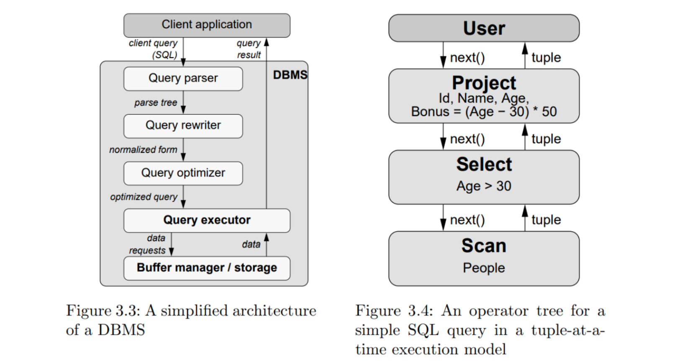
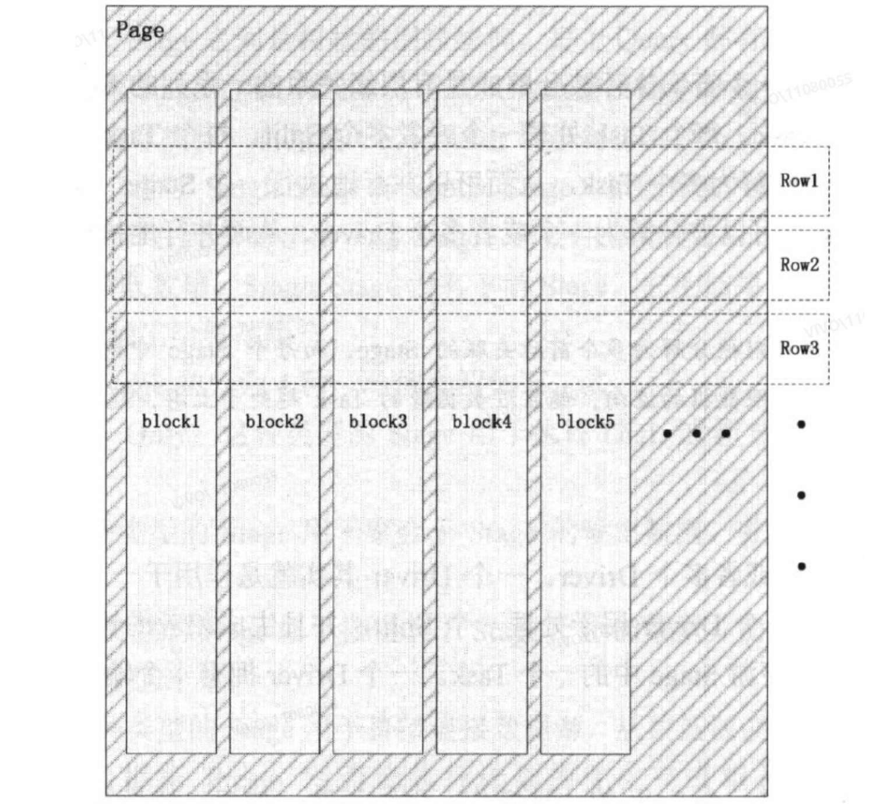

# 背景

业务开发使用数据库时，通常规定不允许使用过多的表Join，如阿里巴巴开发手册中：

>【强制】超过三个表禁止Join。需要Join的字段，数据类型必须绝对一致；多表关联查询时，保证被关联的字段需要有索引。说明：即使双表Join也要注意表索引、SQL性能。

大数据数仓中，既有星型结构和雪花结构，但最终交付业务使用的大多是宽表。

# Join基本原理

## Join分类

Join分为如下几类：

* Cross Join
* Inner Join
* Outer Join
    * full join
    * left join
    * right join

### Cross Join

交叉连接，返回连接的两个表所有数据行的**笛卡尔积**，一般不加条件限制。使用：

```sql
SELECT  *  FROM  tableA, tableB  # 等价
SELECT  *  FROM  tableA CROSS JOIN tableB
```

### Inner Join

Inner join 获取两张表的交集，是内联查询，不是产生笛卡尔集，结合ON子句使用，直接基于join condition做连接，生成的join集合就是最终的输出结果，产生的中间数据更小。

### Outer Join

Outer join 获取两张表的并集，是内联查询。

* full join：产生A和B的并集
* left join：产生表A的完全集，而B表中匹配的则有值，没有匹配的则以NULL值取代。
* right join：产生表B的完全集，而A表中匹配的则有值，没有匹配的则以NULL值取代。

## 关联算法

>Join关联算法可参考本博客：[https://chnherb.github.io/docs/30.%E5%AD%98%E5%82%A8/%E5%88%86%E5%B8%83%E5%BC%8F%E6%95%B0%E6%8D%AE%E5%BA%93%E7%90%86%E8%AE%BA%E6%A6%82%E8%BF%B0/#%E5%85%B3%E8%81%94%E7%AE%97%E6%B3%95](https://chnherb.github.io/docs/30.%E5%AD%98%E5%82%A8/%E5%88%86%E5%B8%83%E5%BC%8F%E6%95%B0%E6%8D%AE%E5%BA%93%E7%90%86%E8%AE%BA%E6%A6%82%E8%BF%B0/#%E5%85%B3%E8%81%94%E7%AE%97%E6%B3%95)

常见的关联算法有三大类，分别是

* 嵌套循环（Nested Loop Join）
* 排序归并（Sort-Merge Join）
* 哈希（Hash Join）
# Join工程化理论

## 火山模型

SQL语法支持的操作类型非常丰富：查询表(TableScan)、过滤数据(Filter)、排序(Order)、限制(Limit)、字段进行运算(Project)、 聚合(Group)、关联(Join)等。为了实现上述的能力，需要一个具备并行化能力且可扩展的架构。

1994年Goetz Graefe在论文《Volcano-An Extensible and Parallel Query Evaluation System》提出了一个架构设计思想，这就是大名鼎鼎的火山模型，也称为迭代模型。火山模型包含了文件系统和查询处理两个部分。




来源于《Balancing vectorized execution with bandwidth-optimized storage》

### 职责分离

将不同操作独立成一个的Operator，Operator采用open-next-close的迭代器模式。如一般的SQL语句对应到Scan、Select、Project三个Operator，数据交互通过next()函数实现。

Presto中的Operator：

* SourceOperator
    * TableScanSourceOperator
* OrderOperator
* LimitOperator
* TaskOutputOperator
### 动态组装

Operator基于SQL语句的解析实现动态组装，多个Operator形成一个管道(pipeline)。

Presto在火山模型的基础上，吸收了其它思想做了如下优化：

* Operator数据处理优化成一次一个Page，而不是一次行(也称为tuple)。
* Page的存储采用列式结构。即相同的列封装到一个Block中。
**批量处理**结合**列式存储**奠定了**向量化计算**的基础**，**也是**数据库领域的优化方向**。 

## 批量处理和列式存储

Presto源码中，随处可见 Page 和 Block。

通常 OLAP 场景不需要读取所有字段，于是衍生了列式存储，如下结构：




将数据封装成Page在各个Operator中流转，一方面避免了对象的序列化和反序列化成本，另一方面相比行（tuple）的方式降低了函数调用的开销。类似集装箱运货降低运输成本的思想。

示例代码：

```java
import com.facebook.presto.common.Page;
import com.facebook.presto.common.PageBuilder;
import com.facebook.presto.common.block.Block;
import com.facebook.presto.common.block.BlockBuilder;
import com.facebook.presto.common.type.BigintType;
import com.facebook.presto.common.type.Type;
import com.facebook.presto.common.type.VarcharType;
import com.google.common.collect.Lists;
import io.airlift.slice.Slice;
import java.util.List;
import static io.airlift.slice.Slices.utf8Slice;
public class PageBlockDemo {
 
    private static Page buildPage(List<Type> types,List<Object[]> dataSet){
        PageBuilder pageBuilder = new PageBuilder(types);
        // 封装成Page
        for(Object[] row:dataSet){
            // 完成一行
            pageBuilder.declarePosition();
            for (int column = 0; column < types.size(); column++) {
                BlockBuilder out =  pageBuilder.getBlockBuilder(column);
 
                Object colVal = row[column];
                if(colVal == null){
                    out.appendNull();
                }else{
                    Type type = types.get(column);
                    Class<?> javaType = type.getJavaType();
                    if(javaType == long.class){
                        type.writeLong(out,(long)colVal);
                    }else if(javaType == Slice.class){
                        type.writeSlice(out, utf8Slice((String)colVal));
                    }else{
                        throw new UnsupportedOperationException("not implemented");
                    }
                }
            }
        }
        // 生成Page
        Page page = pageBuilder.build();
        pageBuilder.reset();
        return page;
    }
 
    private static void readColumn(List<Type> types,Page page){
        // 从Page中读取列
        for(int column=0;column<types.size();column++){
            Block block = page.getBlock(column);
            Type type = types.get(column);
            Class<?> javaType = type.getJavaType();
 
            System.out.print("column["+type.getDisplayName()+"]>>");
            List<Object> colList = Lists.newArrayList();
            for(int pos=0;pos<block.getPositionCount();pos++){
                if(javaType == long.class){
                    colList.add(block.getLong(pos));
                }else if(javaType == Slice.class){
                    colList.add(block.getSlice(pos,0,block.getSliceLength(pos)).toStringUtf8());
                }else{
                    throw new UnsupportedOperationException("not implemented");
                }
            }
            System.out.println(colList);
        }
    }
 
    public static void main(String[] args) {
        /**
         * 假设有两个字段，一个字段类型为int, 一个字段类型为varchar
         */
        List<Type> types = Lists.newArrayList(BigintType.BIGINT, VarcharType.VARCHAR);
 
        // 按行存储
        List<Object[]> dataSet = Lists.newArrayList(
                new Object[]{1L,"aa"},
                new Object[]{2L,"ba"},
                new Object[]{3L,"cc"},
                new Object[]{4L,"dd"});
 
        Page page = buildPage(types, dataSet);
 
        readColumn(types,page);
 
    }
}
// 运行结果：
//column[bigint]>>[1, 2, 3, 4]
//column[varchar]>>[aa, ba, cc, dd]
```

# Join工程化实践

## 基本流程

* Parser:  借助ANTLR的能力即可实现SQL语法的检测。
* Binding: 基于SQL语句生成AST，利用元数据检测字段和表的映射关系以及Join条件的字段类型。
* Planner: 基于AST生成查询计划。 
* Executor: 基于查询计划生成对应的Operator并执行。
## 落地事项

* 支持所有的Join语义
* 分布式能力
* 性能优化
* 多表Join的顺序选择
* 大表与小表Join
* Semi Join优化
* Join算法倾斜
## 示例：Nested Loop Join

以 Nested Loop Join 算法为例，Presto是拆解为两个阶段：

* 组合阶段
* 过滤阶段
实现JoinOperator时，只需负责两个表数据的笛卡尔积组合即可。核心代码如下：

```java
// NestedLoopPageBuilder中实现两个Page计算笛卡尔积的处理逻辑，
// 这里RunLengthEncodedBlock用于一个元素复制，典型地笛卡尔积计算中需要将一列元素从1行复制成多行。
@Override
public Page next()
{
    if (!hasNext()) {
        throw new NoSuchElementException();
    }
 
    if (noColumnShortcutResult >= 0) {
        rowIndex = maxRowIndex;
        return new Page(noColumnShortcutResult);
    }
 
    rowIndex++;
 
    // Create an array of blocks for all columns in both pages.
    Block[] blocks = new Block[numberOfProbeColumns + numberOfBuildColumns];
 
    // Make sure we always put the probe data on the left and build data on the right.
    int indexForRleBlocks = buildPageLarger ? 0 : numberOfProbeColumns;
    int indexForPageBlocks = buildPageLarger ? numberOfProbeColumns : 0;
 
    // For the page with less rows, create RLE blocks and add them to the blocks array
    for (int i = 0; i < smallPage.getChannelCount(); i++) {
        Block block = smallPage.getBlock(i).getSingleValueBlock(rowIndex);
        blocks[indexForRleBlocks] = new RunLengthEncodedBlock(block, largePage.getPositionCount());
        indexForRleBlocks++;
    }
 
    // Put the page with more rows in the blocks array
    for (int i = 0; i < largePage.getChannelCount(); i++) {
        blocks[indexForPageBlocks + i] = largePage.getBlock(i);
    }
 
    return new Page(largePage.getPositionCount(), blocks);
}
```

