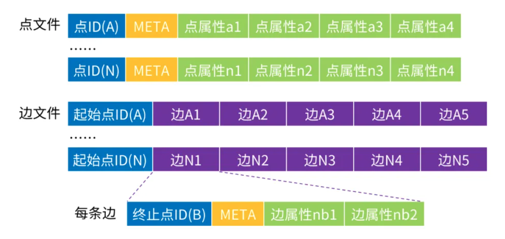
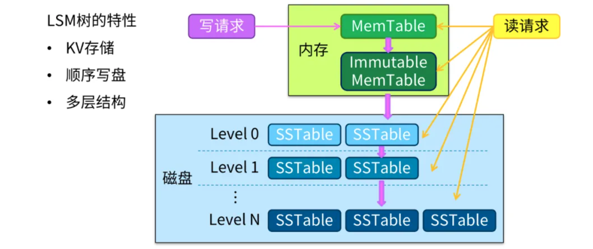
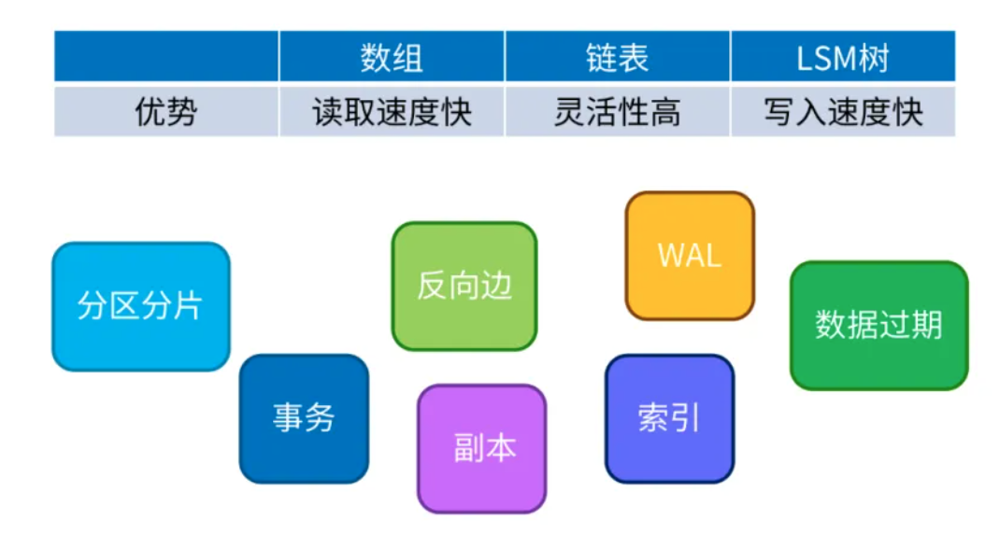
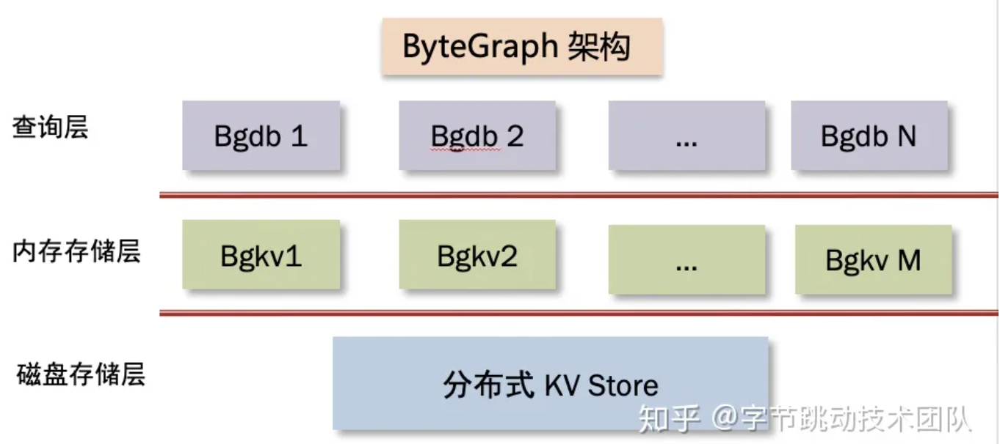
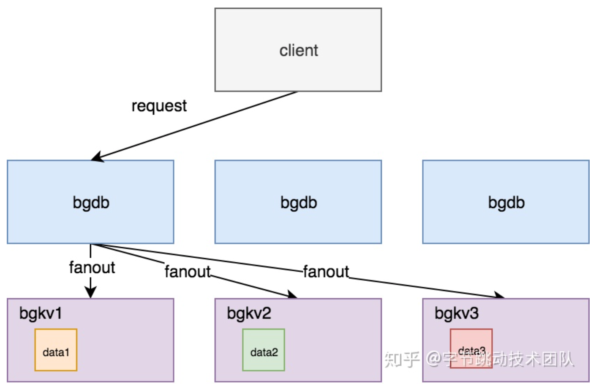
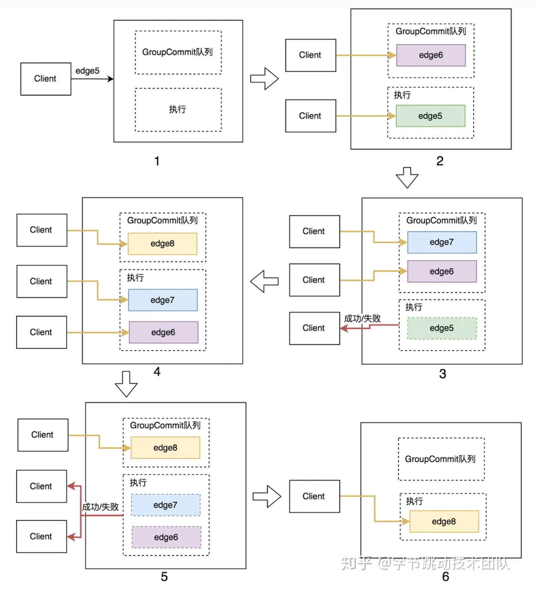
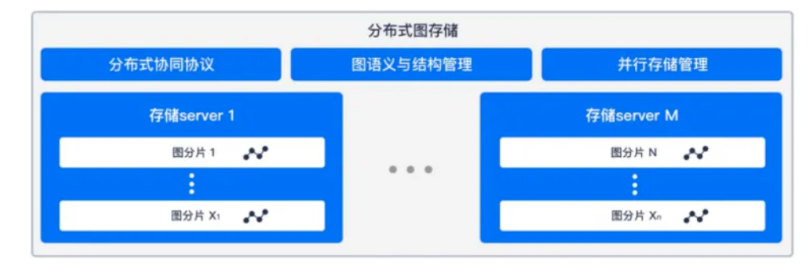
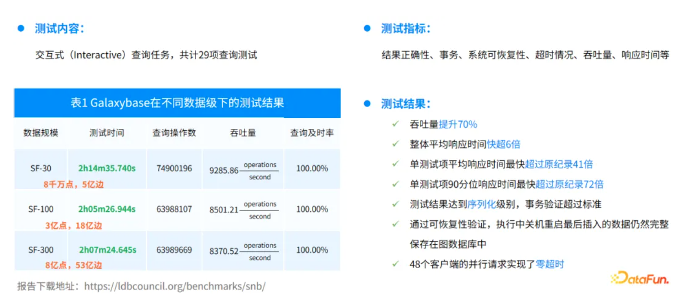
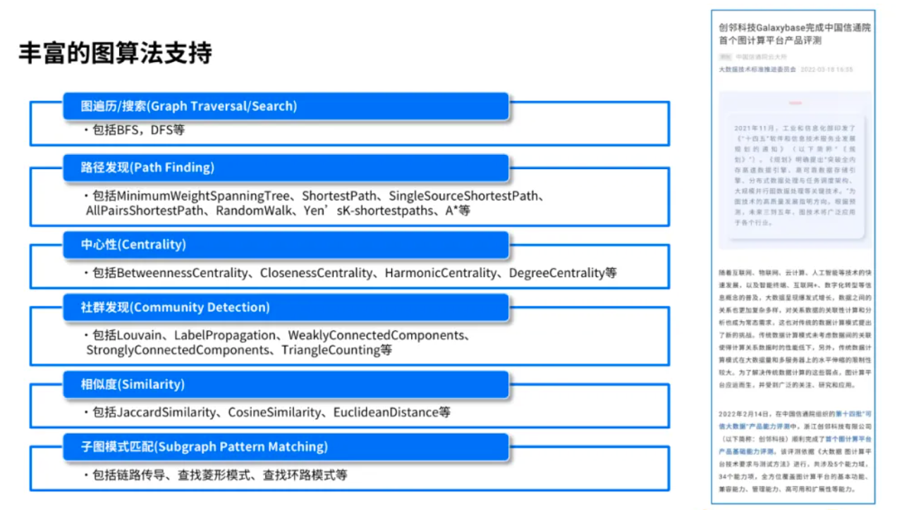

# 简介

## 简介

世间万物都是存在普遍联系的，人们的生产活动中，时时刻刻都在产生大量的数据，形成了一个个庞大且复杂的关系网。传统的数据库对于这种庞大复杂的关系网无法高效准确地表达，因此诞生了图数据库，它可以更加高效、准确地表达出这种关联关系，且有助于进一步挖掘出更深层次的关系。

## 场景

### 社交网络

精准营销、好友推荐、舆情追踪。

### 金融

信用卡反欺诈、资金流向识别。

### 零售

用户360画像、商品实时推荐、反薅羊毛等。

### 电力

电网调度仿真、故障分析、电碳因子计算。

### 电信

防骚扰、防诈骗。

### 政企

道路规划、智能交通、疫情精准防控。

### 制造

供应链管理、物流优化、产品溯源。

### 网络安全

攻击溯源、调用链分析。

## 挑战

* 数据规模大
* 关联跳数深
* 实时要求高
## 基本概念


# 核心目标

## 核心语义

数据规模大、关联跳数深、实时要求高的场景下，完成一个图查询或者图分析，核心的操作是：**邻居的迭代遍历**。

关系型数据库中，边（即实体之间的关系）不是直接存储的，而是以外键的形式来表示。它的问题在于性能无法满足要求，即使在主键和外键上都建立索引，在面临大规模数据和查询跳数较深时，索引对性能的提升也非常有限。

## 查询性能对比


## 免索引邻接

定义

免索引邻接（Index Free Adjacency）

写入时：保证一个点和它直接相连的边总是存储在一起

查询时：迭代遍历一个点的所有邻居可以直接进行，而不需要依赖其他数据结构

**图数据库存储的核心目标是实现免索引邻接**。

写入时，免索引邻接可以保证一个点和与它相邻的边总是存储在一起。因此查询时迭代遍历一个点的所有邻居就可以直接进行，而不需要依赖其它索引类的数据结构。与全局索引对比，查询操作的时间复杂度是 O(1) vs O(log(n))。

因为免索引邻接迭代一个点的所有邻居的时间，就是这个点的邻居数量乘以O(1)，仅与这个点的邻居数量有关，而与整个图中全体的点边数量无关。

而使用全局索引，那么每次定位都需要一个 O(log(n)) 的时间复杂度。n 指参与全局索引的数据规模，可以理解为整体的边数量。因此迭代一个点的所有邻接时间就是这个点的邻居数量乘以 O(log(n))。

从算法的时间度复杂度上看，O(log(n)) 已经非常快，当处理巨大规模数据量时，这个值也会非常可观。但是需要注意的是，log(n)的值会随着n的增大而不断增大。假设点只有一个邻居，使用全局索引，会随着图中的总边数增加而越来越慢。如果具备了免索引邻接的能力，那么获取这个邻居的时间就是一个恒定值，而与全局的图规模无关。这个特点会带来巨大的性能提升。所以可以明确，图数据库存储的核心目标就是实现免索引邻接。

# 技术方案

## 数据模型

### 点(Vertex)

### 边(Edge)

### 边的方向

## 数组存储

数组存储结构图




**最直接的方法就是用一个数组，把每一个点上面的所有边，按照顺序一起存储**。点文件就是一系列的点组成，每个点的存储，包括点的ID、META信息，以及这个点的一系列属性。每个边文件中，按照起始点的顺序存储点上对应的边。每条边的存储包括终止点ID、META信息，以及边的属性。META信息包括点边类型、边方向、实现事务的额外字段等。在这个存储里，可以直接从起始点遍历所有的边数据，**读取性能非常高**。

### 变长数组

存在的问题：变长数组。

可能有很多因素导致。如：两个点的属性数量不同、属性本身内容不同、属性值是字符串也是变长的（属性长度不一样导致每个点的存储空间变长）。点文件和边文件都会面临变长数组的问题。

解决思路：

1、用额外的 offset 来记住存储位置

2、预先划分好部分预留空间

数组存储结构图（处理变长）


## 链表存储

链表存储结构图


链表的存储方式中，点文件和边文件里面存储的都是ID，每个ID都是固定长度的，通过ID可以计算偏移量位置，通过偏移量位置直接读取数据。因为它能够通过位置计算ID，偏移量和ID是一一对应的，所以每个点也不用保存自身的ID。

### 边迭代

链表存储结构图（迭代边示意）


边迭代的过程：

首先从点A出发，在点文件中找到首个边ID：α，去边文件中找到α对应的偏移量，就能把整条边数据读出来。边数据里，有起始点和终止点，比如这条边的起始点A、终止点B。下一条边的偏移量是θ，那么就再找到θ的位置。θ边读出来，它是从起始点C到终止点A。这时候点A是处于终止点的位置上，我们找对应终止点的下一条边，是ω。然后再找ω的偏移量，读出来，是一个A到D的边，A在起始点的位置上，下一条边是NULL，迭代遍历结束。我们可以看到，链表存储的方式很好地解决了变长的问题。

### 随机读操作

链表存储下，每次迭代时offset的位置是随机的，不是连续存储的，因此会有大量的随机读操作。而磁盘对随机读操作是很不友好的，也就是说虽然时间复杂度是O(1)，但是这个O(1)的单位是磁盘随机读的时间。而前面数组方案中的O(1)的单位是磁盘顺序读的时间，这两者在性能上差别非常大。所以使用链表的存储方法，非常依赖一个高效实现的缓存机制。如果我们能把这个存储结构在内存中缓存起来，那么在内存中进行随机访问的性能会非常高。

## LSM树存储

LSM树存储示意图




**LSM树存储是一种基于顺序写盘、多层结构的KV存储**。

上图展示了LSM树读写操作的核心流程：

在写请求时，直接写入内存中的MemTable。如果这个MemTable没满，这个写请求就直接返回了，所以写请求性能是很高的。当这个MemTable满了的时候，把它变成Immutable MemTable，同时生成一个新的MemTable供后续的写请求使用。同时，把Immutable MemTable的内容写到磁盘上，形成SSTable文件。内存中的MemTable和Immutable MemTable都是按Key排序的，所以SSTable也是按Key排序的。SSTable文件是分层组织的，直接从内存中写出来的是第0层，当第0层数据达到一定大小之后，就把它跟第1层合并，类似归并排序。合并出来的第1层文件也是顺序写排的，当第1层达到一定大小也会继续和下层合并，以此类推。在合并的时候，会清除重复的数据或者被删除的数据。

在读取请求时，首先去内存中的MemTable查找，查到就直接返回。没查到就去第0层的文件中查找，第0层没有再到第1层，这样逐层查找。

### Key设计

关键点：合理地设计边的Key，使一个点的所有边在排序后是相邻的。


因为在SSTable文件的存储中，key是有序排列的，所以我们只要通过LSM树实现免索引邻接的能力。关键点在于合理地设计边的Key，要让一个点的所有边在排序后是相邻的。

上图中例1，只要把边Key的最高位放起始点ID，那么排序之后，从这个起点出发的边自然就会排在一起。这里还可以有一个编号字段，加入编号字段就可以支持在两点之间的同类型多条边的共存。因为LSM树是KV结构，所以如果只有起始点、终止点和META的话，那么两点之间同类型的边只有一个Key，所以只能存一条。对于像转账交易、访问记录这样具有事件性质的边来说，两点之间肯定会有多条同类型的边，在这样的场景下，这个能力就是非常重要的。

在某些场景下边的Key也可以不以起始点开始，比如例2的场景下。可以先放边的类型，再放起始点ID。这样做的目的是为了能够通过边类型直接做分片。因为在分布式环境下，做这样的分片可能会有更好的性能。这样虽然一个点的所有边是分散存储的，但是一个点某个类型的所有边还是顺序存储在一起的。如果业务场景是边查群总是按照类型分别迭代的，那么它也能提供很好的免索引邻接的能力。

难点：

1、读性能

2、Compaction的影响

3、依赖第三方存储

首先，SSTable文件是分层的，在查询时的最坏情况下，需要找遍所有层才能知道找得到或者找不到，因此读性能是没有直接使用数组的方式那么高的。另外，Compaction对它的影响是很大的，Compaction是个后台操作，会占用大量的磁盘IO，势必对前台读写性能造成影响。第三是，使用LSM方案通常都要依赖第三方存储，对于一些特定的需求，必须要改动第三方存储项目才能实现。

## 优化之路




可以看到，几种常见的实现免索引邻接的存储方式，都不是一劳永逸的方案，而是各有各的优势和短板：

通过数组的方式读取速度快，但写入速度慢；通过LSM树的方式写入速度快，但是读取速度慢。通过链表的方式，读取和写入的速度都不占优，但却是灵活性最高的方式。

在实际实现一个图数据库的过程中，要根据我们的设计理念去做取舍。

实现一个完整的图数据库产品，还有很多功能和性能的问题需要考虑。比如图数据库特有的反向边一致性的问题，还有分布式条件下怎样做分区分片，怎样处理分布式事务，是否支持mvcc快照，实时副本怎么做，WAL怎么做，属性索引怎么做，以及是否支持数据过期等。这些都是一个成熟的图数据库产品需要解决的问题。解决这些问题的同时，也要兼顾底层存储的特性。

# 图算法

## 路径搜索类

路径搜索是搜索途中节点通过边建立的直接或间接的联系。

## 中心性分析类

中心新分析是指分析特定节点在途中的重要程度及其影响力。

## 社区发现类

社区发现意在发现图中联系更紧密的群体结构。

# 查询语言

Germlin Cypher 


# 应用实践

## 开源图数据库杂谈

目前比较成熟的大部分都是面对传统行业较小的数据集和较低的访问吞吐场景，开源的 Neo4j 是单机架构；因此，在互联网场景下，通常都是基于已有的基础设施定制系统：比如 Facebook 基于 MySQL 系统封装了 Social Graph 系统 TAO，几乎承载了 Facebook 所有数据逻辑；Linkedln 在 KV 之上构建了 Social Graph 服务；微博是基于 Redis 构建了粉丝和关注关系。

## Neo4j

### 简介

Neo4j是图数据库中一个主要代表，其开源，且用Java实现（需安装JDK）。经过几年的发展，已经可以用于生产环境。其有两种运行方式，一种是服务的方式，对外提供REST接口；另外一种是嵌入式模式，数据以文件的形式存放在本地，可以直接对本地文件进行操作。

### Neo4j相关特性

### 数据模型

Neo4j被称为property graph，除了顶点（Node）和边(Relationship，其包含一个类型)，还有一种重要的部分——属性。无论是顶点还是边，都可以有任意多的属性。属性的存放类似于一个hashmap，key为一个字符串，而value必须是Java基本类型、或者是基本类型数组，比如说String、int或者int[]都是合法的。

#### 索引

Neo4j支持索引，其内部实际上通过Lucene实现。

#### 事务

Neo4j完整支持事务，即满足ACID性质。

## Neo4j优缺点

优点：

1. 数据的插入，查询操作很直观，不用再像之前要考虑各个表之间的关系。
2. 提供的图搜索和图遍历方法很方便，速度也是比较快的。
3. 更快的数据库操作。当然，有一个前提条件，那就是数据量较大，在MySql中存储的话需要许多表，并且表之间联系较多（即有不少的操作需要join表）。
缺点：

1. 当数据过大时插入速度可能会越来越慢。.
2. 超大节点。当有一个节点的边非常多时（常见于大V），有关这个节点的操作的速度将大大下降。这个问题很早就有了，官方也说过会处理，然而现在仍然不能让人满意。
3. 提高数据库速度的常用方法就是多分配内存，然而看了官方操作手册，貌似无法直接设置数据库内存占用量，而是需要计算后为其”预留“内存…
注：鉴于其明显的优缺点，Neo4j适合存储”修改较少，查询较多，没有超大节点“的图数据。

## ByteGraph

### 简介

字节跳动的 Graph 在线存储场景， 其需求也是有自身特点的，可以总结为：

* 海量数据存储：百亿点、万亿边的数据规模；并且图符合幂律分布，比如少量大 V 粉丝达到几千万；
* 海量吞吐：最大集群 QPS 达到数千万；
* 低延迟：要求访问延迟 pct99 需要限制在毫秒级；
* 读多写少：读流量是写流量的接近百倍之多；
* 轻量查询多，重量查询少：90%查询是图上二度以内查询；
* 容灾架构演进：要能支持字节跳动城域网、广域网、洲际网络之间主备容灾、异地多活等不同容灾部署方案。
面对字节跳动世界级的海量数据和海量并发请求，用万亿级分布式存储、千万高并发、低延迟、稳定可控这三个条件一起去筛选，业界在线上被验证稳定可信赖的开源图存储系统基本没有满足的了。

在 18 年 8 月份，开始从第一行代码开始踏上图数据库的漫漫征程，从解决一个最核心的抖音社交关系问题入手，逐渐演变为支持有向属性图数据模型、支持写入原子性、部分 Gremlin 图查询语言的通用图数据库系统，在公司所有产品体系落地称之为 ByteGraph。

### 场景

* 记录关注关系A关注B
* 查询A关注的且关注了C的所有用户
* 查询A的好友的好友（二度关系）
### 系统架构

下面这张图展示了 ByteGraph 的内部架构，其中 bg 是 ByteGraph 的缩写。

就像 MySQL 通常可以分为 SQL 层和引擎层两层一样，ByteGraph 自上而下分为查询层 (bgdb)、存储/事务引擎层（bgkv）、磁盘存储层三层，每层都是由多个进程实例组成。其中 bgdb 层与 bgkv 层混合部署，磁盘存储层独立部署，我们详细介绍每一层的关键设计。




### 查询层(bgdb)

bgdb 层和 MySQL 的 SQL 层一样，主要工作是做读写请求的解析和处理；其中，所谓“处理”可以分为以下三个步骤：

1. 将客户端发来的 Gremlin 查询语句做语法解析，生成执行计划；
2. 并根据一定的路由规则（例如一致性哈希）找到目标数据所在的存储节点（bgkv），将执行计划中的读写请求发送给 多个 bgkv；
3. 将 bgkv 读写结果汇总以及过滤处理，得到最终结果，返回给客户端。
bgdb 层没有状态，可以水平扩容，用 Go 语言开发。




### 存储/事务引擎层(bgkv)

bgkv 层是由多个进程实例组成，每个实例管理整个集群数据的一个子集（shard / partition)。

bgkv 层的实现和功能有点类似内存数据库，提供高性能的数据读写功能，其特点是：

接口不同：只提供点边读写接口；支持算子下推：通过把计算(算子)移动到存储（bgkv）上，能够有效提升读性能；举例：比如某个大 V 最近一年一直在涨粉，bgkv 支持查询最近的 100 个粉丝，则不必读出所有的百万粉丝。

缓存存储有机结合：其作为 KV store 的缓存层，提供缓存管理的功能，支持缓存加载、换出、缓存和磁盘同步异步 sync 等复杂功能。

从上述描述可以看出，bgkv 的性能和内存使用效率是非常关键的，因此采用 C++ 编写。

### 磁盘存储层(KV Cluster)

为了能够提供海量存储空间和较高的可靠性、可用性，数据必须最终落入磁盘，我们底层存储是选择了公司自研的分布式 KV store。

问题：如何把动辄百万粉丝的图数据存储在KV数据库中？

在字节跳动的业务场景中，存在很多访问热度和“数据密度”极高的场景，比如抖音的大 V、热门的文章等，其粉丝数或者点赞数会超过千万级别；但作为 KV store，希望业务方的 KV 对的大小（Byte 数）是控制在 KB 量级的，且最好是大小均匀的：对于太大的 value，是会瞬间打满 I/O 路径的，无法保证线上稳定性；对于特别小的 value，则存储效率比较低。事实上，数据大小不均匀这个问题困扰了很多业务团队，在线上也会经常爆出事故。

对于一个有千万粉丝的抖音大 V，相当于图中的某个点有千万条边的出度，不仅要能存储下来，而且要能满足线上毫秒级的增删查改，ByteGraph 是如何解决这个问题？

思路其实很简单，总结来说，就是采用灵活的边聚合方式，使得 KV store 中的 value 大小是均匀的，具体可以用以下四条来描述：

1. 一个点（Vertex）和其所有相连的边组成了一数据组（Group）；不同的起点和及其终点是属于不同的 Group，是存储在不同的 KV 对的；比如用户 A 的粉丝和用户 B 的粉丝，就是分成不同 KV 存储；
2. 对于某一个点的及其出边，当出度数量比较小（KB 级别），将其所有出度即所有终点序列化为一个 KV 对，我们称之为一级存储方式（后面会展开描述）；
3. 当一个点的出度逐渐增多，比如一个普通用户逐渐成长为抖音大 V，我们则采用分布式 B-Tree 组织这百万粉丝，我们称之为二级存储；
4. 一级存储和二级存储之间可以在线并发安全的互相切换；
一级存储

一级存储格式中，只有一个 KV 对，key 和 value 的编码：

```plain
-  key: 某个起点 id + 起点 type + 边 type
-  value: 此起点的所有出边（Edge）及其边上属性聚合作为 value，但不包括终点的属性
```
二级存储（点的出度大于阈值）
如果一个大 V 疯狂涨粉，则存储粉丝的 value 就会越来越大，解决这个问题的思路也很朴素：拆成多个 KV 对。

ByteGraph 的方式就是把所有出度和终点拆成多个 KV 对，所有 KV 对形成一棵逻辑上的分布式 B-Tree，之所以说“逻辑上的”，是因为树中的节点关系是靠 KV 中 key 来指向的，并非内存指针； B-Tree 是分布式的，是指构成这棵树的各级节点是分布在集群多个实例上的，并不是单机索引关系。具体关系如下图所示：


其中，整棵 B-Tree 由多组 KV 对组成，按照关系可以分为三种数据：

* 根节点：根节点本质是一个 KV 系统中的一个 key，其编码方式和一级存储中的 key 相同
* Meta 数据：
    * Meta 数据本质是一个 KV 中的 value，和根节点组成了 KV 对；
    * Meta 内部存储了多个 PartKey，其中每个 PartKey 都是一个 KV 对中的 key，其对应的 value 数据就是下面介绍的 Part 数据；
* Part 数据
    * 对于二级存储格式，存在多个 Part，每个 Part 存储部分出边的属性和终点 ID
    * 每个 Part 都是一个 KV 对的 value，其对应的 key 存储在 Meta 中。
从上述描述可以看出，对于一个出度很多的点和其边的数据（比如大 V 和其粉丝），在 ByteGraph 中，是存储为多个 KV 的，面对增删查改的需求，都需要在 B-Tree 上做二分查找。相比于一条边一个 KV 对或者所有边存储成一个 KV 对的方式，B-Tree 的组织方式能够有效的在读放大和写放大之间做一些动态调整。

但在实际业务场景下，粉丝会处于动态变化之中：新诞生的大 V 会快速新增粉丝，有些大 V 会持续掉粉；因此，存储方式会在一级存储和二级存储之间转换，并且 B-Tree 会持续的分裂或者合并；这就会引发分布式的并发增删查改以及分裂合并等复杂的问题，有机会可以再单独分享下这个有趣的设计。

ByteGraph 和 KV store 的关系，类似文件系统和块设备的关系，块设备负责将存储资源池化并提供 Low Level 的读写接口，文件系统在块设备上把元数据和数据组织成各种树的索引结构，并封装丰富的 POSIX 接口，便于外部使用。

 

### 一些问题深入讨论

#### 热点数据读写解决

热点数据在字节跳动的线上业务中广泛存在：热点视频、热点文章、大 V 用户、热点广告等等；热点数据可能会出现瞬时出现大量读写。ByteGraph 在线上业务的实践中，打磨出一整套应对性方案。

* 热点读
热点读的场景随处可见，比如线上实际场景：某个热点视频被频繁刷新，查看点赞数量等。在这种场景下，意味着访问有很强的数据局部性，缓存命中率会很高，因此，我们设计实现了多级的 Query Cache 机制以及热点请求转发机制；在 bgdb 查询层缓存查询结果， bgdb 单节点缓存命中读性能 20w QPS 以上，而且多个 bgdb 可以并发处理同一个热点的读请求，则系统整体应对热点度的“弹性”是非常充足的。

* 热点写
热点读和热点写通常是相伴而生的，热点写的例子也是随处可见，比如：热点新闻被疯狂转发， 热点视频被疯狂点赞等等。对于数据库而言，热点写入导致的性能退化的背后原因通常有两个：行锁冲突高或者磁盘写入 IOPS 被打满，我们分别来分析：

    * 行锁冲突高：目前 ByteGraph 是单行事务模型，只有内存结构锁，这个锁的并发量是每秒千万级，基本不会构成写入瓶颈；
    * 磁盘 IOPS 被打满：
    * IOPS（I/O Count Per Second）的概念：磁盘每秒的写入请求数量是有上限的，不同型号的固态硬盘的 IOPS 各异，但都有一个上限，当上游写入流量超过这个阈值时候，请求就会排队，造成整个数据通路堵塞，延迟就会呈现指数上涨最终服务变成不可用。
    * Group Commit 解决方案：Group Commit 是数据库中的一个成熟的技术方案，简单来讲，就是多个写请求在 bgkv 内存中汇聚起来，聚成一个 Batch 写入 KV store，则对外体现的写入速率就是 BatchSize * IOPS。



对于某个独立数据源来说，一般热点写的请求比热点读会少很多，一般不会超过 10K QPS，目前 ByteGraph 线上还没有出现过热点写问题问题。

#### 图的索引

就像关系型数据库一样，图数据库也可以构建索引。默认情况下，对于同一个起点，我们会采用边上的属性（时间戳）作为主键索引；但为了加速查询，我们也支持其他元素（终点、其他属性）来构建二级的聚簇索引，这样很多查找就从全部遍历优化成了二分查找，使得查询速度大幅提升。

ByteGraph 默认按照边上的时间戳（ts）来排序存储，因此对于以下请求，查询效率很高：

查询最近的若干个点赞查询某个指定时间范围窗口内加的好友

方向的索引可能有些费解，举个例子说明下：给定两个用户来查询是否存在粉丝关系，其中一个用户是大 V，另一个是普通用户，大 V 的粉丝可达千万，但普通用户的关注者一般不会很多；因此，如果用普通用户作为起点大 V 作为终点，查询代价就会低很多。其实，很多场景下，我们还需要用户能够根据任意一个属性来构建索引，这个也是我们正在支持的重要功能之一。

### 未来探索

过去的一年半时间里，ByteGraph 都是在有限的人力情况下，优先满足业务需求，在系统能力构建方面还是有些薄弱的，有大量问题都需要在未来突破解决：

从图存储到图数据库：对于一个数据库系统，是否支持 ACID 的事务，是一个核心问题，目前 ByteGraph 只解决了原子性和一致性，对于最复杂的隔离性还完全没有触碰，这是一个非常复杂的问题；另外，中国信通院发布了国内图数据库功能白皮书，以此标准，如果想做好一个功能完备的“数据库”系统，我们面对的还是星辰大海；标准的图查询语言：目前，图数据库的查询语言业界还未形成标准（GQL 即将在 2020 年发布），ByteGraph 选择 Apache、AWS 、阿里云的 Gremlin 语言体系，但目前也只是支持了一个子集，更多的语法支持、更深入的查询优化还未开展；Cloud Native 存储架构演进：现在 ByteGraph 还是构建与 KV 存储之上，独占物理机全部资源；从资源弹性部署、运维托管等角度是否有其他架构演进的探索可能，从查询到事务再到磁盘存储是否有深度垂直整合优化的空间，也是一个没有被回答的问题；现在 ByteGraph 是在 OLTP 场景下承载了大量线上数据，这些数据同时也会应用到推荐、风控等复杂分析和图计算场景，如何把 TP 和轻量 AP 查询融合在一起，具备部分 HTAP 能力，也是一个空间广阔的蓝海领域。

## Galaxybase

### 特点

Galaxybase是一个国产高性能分布式图数据库。它具有如下特点：

* 速度快：原生分布式并行图存储，毫秒级完成传统方案无法实现的深链分析, 较同类技术百倍提升。
* 高扩展：完全分布式架构，动态在线扩容，高效支持万亿级超级大图。
* 实时计算：内置丰富分布式图算法、无ETL实现实时图分析。
* 高效数据压缩：优化资源利用，节省硬件和维护成本。
* 全自主可控、兼容国际开源生态与国产底层硬件。
### 技术方案




* 自研分布式原生图存储，不依赖第三方存储引擎
* 使用数据分片，支持热备
* 支持动态压缩，节省存储空间
### 性能优势

和中山大学携手共建的一个国家重点研发图计算项目。它依托国家超算广州中心的环境，仅用50台机器的集群就完成了5万亿规模交易数据的智能挖掘系统，实现了当前全球商业图数据支持的最大规模图数据处理。打破了之前用1000台机器集群创造了1.2万亿规模的大图处理的世界记录。我们涵盖的出入度，最大有超过1000万的超级节点。六跳深链查询平均耗时仅6.7秒。

### 优异的查询性能




Galaxybase图数据库具有优异的查询性能。上图是LDBC-SNB官方对Galaxybase进行测试的结果。测试由国外权威机构进行，首先进行了结果正确性验证确保图数据库返回正确结果；随后进行了系统稳定性、可用性、事务支持性和可恢复性验证，均达到官方标准；最后进行了各项性能测试。Galaxybase表现优异，达到国际领先水平。在使用完全相同系统配置前置下，Galaxybase较LDBC之前公布的最高记录吞吐量提升了70%，平均查询性能达6倍以上提升，最高查询性能提升72倍。

### 丰富的图算法支持




Galaxybase也提供了丰富的算法支持，提供了包括像图遍历、路径发现、中心性分析、社群发现、相似度分析、子图模式匹配等几个大类的上百种图算法。不久前率先通过了信通院图计算平台的一个产品基础能力评测，涉及五个能力域，34个能力项的评测，全方位覆盖了图平台的基本能力、兼容能力、管理能力、高可用和扩展能力。


# Reference

[图数据库存储技术及实践](https://zhuanlan.zhihu.com/p/551466845)

[字节跳动自研万亿级图数据库 & 图计算实践](https://zhuanlan.zhihu.com/p/109401046)

[人人都在谈的图数据库到底是个啥](https://zhuanlan.zhihu.com/p/373446678)

