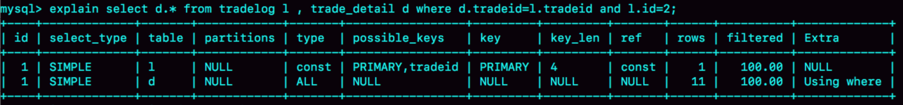

# 简介

索引的出现其实就是为了提高数据查询的效率，就像书的目录一样

# 索引常见模型

实现索引的方式有很多种，可以用户提高读写效率的数据结构很多，三种常见、比较简单的数据结构分别是：**哈希表、有序数组和搜索树**。

跳表、LSM 树等数据结构也被用于引擎设计中。

## 哈希表

优点：

增加新的索引速度很快

缺点：

不是有序的，做区间查询慢

适用于只有等值查询的场景

## 有序数组

优点：

查询效率高

缺点：

更新数据效率低

只适用于静态存储引擎

## 搜索树

二叉树是搜索效率最高的，但是实际上大多数的数据库存储却并不使用二叉树。其原因是，索引不止存在内存中，还要写到磁盘上。

一棵 100 万节点的平衡二叉树，树高 20。一次查询可能需要访问 20 个数据块。在机械硬盘时代，从磁盘随机读一个数据块需要 10 ms 左右的寻址时间。也就是说，对于一个 100 万行的表，如果使用二叉树来存储，单独访问一个行可能需要 20 个 10 ms 的时间，这个查询可真够慢的。

为了让一个查询尽量少地读磁盘，就必须让查询过程访问尽量少的数据块。那么，我们就不应该使用二叉树，而是要使用“N 叉”树。这里，“N 叉”树中的“N”取决于数据块的大小。

以 InnoDB 的一个整数字段索引为例，这个 N 差不多是 1200。这棵树高是 4 的时候，就可以存 1200 的 3 次方个值，这已经 17 亿了。考虑到树根的数据块总是在内存中的，一个 10 亿行的表上一个整数字段的索引，查找一个值最多只需要访问 3 次磁盘。其实，树的第二层也有很大概率在内存中，那么访问磁盘的平均次数就更少了。

N 叉树由于在读写上的性能优点，以及适配磁盘的访问模式，已经被广泛应用在数据库引擎中了。

# InnoDB索引模型

在 InnoDB 中，表都是根据主键顺序以索引的形式存放的，这种存储方式的表称为索引组织表。又因为前面我们提到的，InnoDB 使用了 B+ 树索引模型，所以数据都是存储在 B+ 树中的。

**每一个索引在 InnoDB 里面对应一棵 B+ 树。**

## 索引类型

根据叶子节点的内容，索引类型分为主键索引和非主键索引。

主键索引的叶子节点存的是整行数据。在 InnoDB 里，主键索引也被称为聚簇索引（clustered index）。

非主键索引的叶子节点内容是主键的值。在 InnoDB 里，非主键索引也被称为二级索引（secondary index）。

基于主键索引和普通索引的查询有什么区别？

* 如果语句是 select * from T where ID=500，即主键查询方式，则只需要搜索 ID 这棵 B+ 树；
* 如果语句是 select * from T where k=5，即普通索引查询方式，则需要先搜索 k 索引树，得到 ID 的值为 500，再到 ID 索引树搜索一次。这个过程称为回表。

也就是说，基于非主键索引的查询需要多扫描一棵索引树。因此，我们在应用中应该尽量使用主键查询。

# 索引维护

## 非自增主键

如果新增一个中间的主键 ID 记录，需要逻辑上挪动后面的数据空出位置。更糟的情况是 当前所在的页 已经满了，根据 B+ 树的算法需要申请一个新的数据页，然后挪动部分数据过去。这个过程称为**页分裂**。会影响性能和数据页的利用率。原本放在一个页的数据，需要分到两个页中，整体空间利用率降低大约 50%。（而自增主键防止页分裂，逻辑删除而非物理删除）

有分裂就有合并。当相邻两个页由于删除了数据，利用率很低之后，会将数据页做合并。合并的过程，可以认为是分裂过程的逆过程。

## 自增主键

自增主键是指自增列上定义的主键，在建表语句中一般是这么定义的：  `NOT NULL PRIMARY KEY AUTO_INCREMENT` 。

插入新记录的时候可以不指定 ID 的值，系统会获取当前 ID 最大值加 1 作为下一条记录的 ID 值。

也就是说，自增主键的插入数据模式，正符合了前面提到的递增插入的场景。每次插入一条新记录，都是追加操作，都不涉及到挪动其他记录，也不会触发叶子节点的分裂。

而由业务逻辑的字段做主键，则往往不容易保证有序插入，写数据成本相对较高。


**身份证做主键还是自增主键？**

由于每个非主键索引的叶子节点上都是主键的值。如果用身份证号做主键，那么每个二级索引的叶子节点占用约 20 个字节，而如果用整型做主键，则只要 4 个字节，如果是长整型（bigint）则是 8 个字节。

显然，主键长度越小，普通索引的叶子节点就越小，普通索引占用的空间也就越小。

**结论：从性能和存储空间方面考量，自增主键往往是合理的选择。**

1、业务字段不一定是递增的，有可能会造成主键索引的页分裂，导致性能不稳定；

2、二级索引存储的值是主键，如果使用业务字段占用大小不好控制，业务字段过长可能会导致二级索引占用空间过大，利用率不高。

**适合业务字段做主键的场景**

1、只有一个索引

2、该索引必须是唯一索引

（这不就是 KV 场景么）

由于没有其他索引，所以也就不用考虑其他索引的叶子节点大小的问题。这时候就要优先考虑上一段提到的“尽量使用主键查询”原则，直接将这个索引设置为主键，可以避免每次查询需要搜索两棵树。

非聚集组合索引的一种形式，它包括在查询里的 Select、Join 和 Where 子句用到的所有列（即建立索引的字段正好是覆盖查询语句 [select子句] 与查询条件 [Where子句] 中所涉及的字段，也即，**索引包含了查询正在查找的所有数据**）。

# 覆盖索引

不是所有类型的索引都可以成为覆盖索引。覆盖索引必须要存储索引的列，而哈希索引、空间索引和全文索引等都不存储索引列的值，所以 MySQL 只能使用 B-Tree 索引做覆盖索引

当发起一个被索引覆盖的查询(也叫作索引覆盖查询)时，在 EXPLAIN 的Extra 列可以看到“Using index”的信息

Using where：表示优化器需要通过索引回表查询数据；

Using index：表示直接访问索引就足够获取到所需要的数据，不需要通过索引回表；

Using index condition：在5.6版本后加入的新特性（Index Condition Pushdown）;

Using index condition 会先条件过滤索引，过滤完索引后找到所有符合索引条件的数据行，随后用 WHERE 子句中的其他条件去过滤这些数据行；

# 最左前缀原则

索引项是按照索引定义里面出现的字段顺序排序的。

只要满足最左前缀，就可以利用索引来加速检索。这个最左前缀可以是联合索引的最左 N 个字段，也可以是字符串索引的最左 M 个字符。

**建立联合索引时，如何安排索引内的字段顺序？**

第一原则是，如果通过调整顺序，可以少维护一个索引，那么这个顺序往往就是需要优先考虑采用的。

# 索引下推

## 索引下推定义

索引下推（index condition pushdown ）简称 ICP，在 Mysql 5.6 的版本上推出，用于优化查询。

在不使用 ICP 的情况下，在使用非主键索引（又叫普通索引或者二级索引）进行查询时，存储引擎通过索引检索到数据，然后返回给 MySQL 服务器，服务器然后判断数据是否符合条件 。

在使用 ICP 的情况下，如果存在某些被索引的列的判断条件时，MySQL 服务器将这一部分判断条件传递给存储引擎，然后由存储引擎通过判断索引是否符合 MySQL 服务器传递的条件，只有当索引符合条件时才会将数据检索出来返回给 MySQL 服务器。

索引条件下推优化可以减少存储引擎查询基础表（回表）的次数，也可以减少 MySQL 服务器从存储引擎接收数据的次数。

## 索引下推案例

如建立了一个联合索引（name, age），要同时查询 name like '张%' and age=20 的条件。

如果是根据最左前缀索引规则（没有索引下推），只用到了 name 的索引。需要回表到主键索引找出数据行，然后再比对 age 过滤。

使用了索引下推，就会在（name, age）联合索引内部判断 age 是否等于 20，减少回表的次数。

# 索引查询过程

1、对于普通索引来说，查找到满足条件的第一个记录后，需要查找下一个记录，直到碰到第一个不满足索引条件的记录。

2、对于唯一索引来说，由于索引定义了唯一性，查找到第一个满足条件的记录后，就会停止继续检索。

这点不同带来的影响微乎其微。因为 InnoDB 是按数据页为单位读写的，当读一条记录的时候，并不是将这个记录从磁盘读出来，而是以页为单位，将其整体读入内存。在 InnoDB 中，每个数据页的大小默认是 16KB。

对于下一条记录在同一个数据页时，多做的那一次“查找和判断下一条记录”操作，只需要一次指针寻找和一次计算。对于整型字段，一个数据页可以存放近千个 key，所以在同一个数据页的概率较大。

如果下一条记录在下一个数据页，则必须读取下一个数据页。

综合计算平均性能差异时，扔可以认为该操作成本可以忽略不计。

# 优化器

优化器选择索引的依据是综合考虑 扫描行数、是否使用临时表、是否排序等因素。

## 扫描行数

MySQL 在真正开始执行语句之前，并不能精确地知道满足这个条件的记录有多少条，而只能根据统计信息来估算记录数。（explain 中的 rows 字段）

这个统计信息就是索引的“区分度”。显然，一个索引上不同的值越多，这个索引的区分度就越好。而一个索引上不同的值的个数，我们称之为“基数”（cardinality）。基数越大，索引的区分度越好。

可以使用 `show index from tablename` 看到索引的基数

```sql
mysql> show index from t1;
+-------+------------+----------+--------------+-------------+-----------+-------------+----------+--------+------+------------+---------+---------------+
| Table | Non_unique | Key_name | Seq_in_index | Column_name | Collation | Cardinality | Sub_part | Packed | Null | Index_type | Comment | Index_comment |
+-------+------------+----------+--------------+-------------+-----------+-------------+----------+--------+------+------------+---------+---------------+
| t1    |          0 | PRIMARY  |            1 | id          | A         |      100256 |     NULL | NULL   |      | BTREE      |         |               |
| t1    |          1 | a        |            1 | a           | A         |      100256 |     NULL | NULL   | YES  | BTREE      |         |               |
| t1    |          1 | b        |            1 | b           | A         |      100256 |     NULL | NULL   | YES  | BTREE      |         |               |
+-------+------------+----------+--------------+-------------+-----------+-------------+----------+--------+------+------------+---------+---------------+
3 rows in set (0.05 sec)
```
三个索引的基数值不同，结果并不一定准确。
**如何得到索引的基数？**

一行行统计代价太高，一般选择“采样统计”。

采样的时候 InnoDB 默认会选择 N 个数据页，统计这些页面上的不同值，得到一个平均值，然后乘以这个索引的页面数，就得到了这个索引的基数。

而数据表会持续更新，索引统计信息也不会固定不变。所以当变更的数据行数超过 1/M 时，会自动触发重新做一次索引统计。

MySQL 中，有两种存储索引统计的方式，可以通过设置参数 innodb_stats_persistent 的值来选择：

1、设置为 on 的时候，表示统计信息会持久化存储。这时，默认的 N 是 20，M 是 10。

2、设置为 off 的时候，表示统计信息只存储在内存中。这时，默认的 N 是 8，M 是 16。

优化器会根据扫描行数和索引类型（主键索引、普通索引）综合权衡。


**解决统计信息不准确**

当统计信息不准确，可以通过  `analyze table tablename`  命令，可以用来重新统计索引信息.

## 索引选择异常和处理

方法1：**使用 force index 强行选择一个索引。**

缺点：写法不优美；索引名称变动可能很麻烦；变更的及时性、不够敏捷。

方法2：**修改语句，引导使用期望的索引。**

见索引实践->选错索引

方法3：**新建索引或删除误用索引。**

# 前缀索引

在建立索引时关注的是区分度，区分度越高越好。因为区分度越高，意味着重复的键值越少。


针对字符串字段如何加索引呢？

可以考虑前缀索引，对于前缀长度可以通过 count(distinct) 来评估。

```sql
select 
  count(distinct xxx) as L,
  count(distinct left(xxx,4)）as L4,
  count(distinct left(xxx,5)）as L5,
  count(distinct left(xxx,6)）as L6
from tablename;
```
可能会损失区分度，设定可接受的损失比例 x%，计算 Lx=L*(1-x%)，选择最小的Lx。
缺点：

1、可能会增加扫描行数

2、对覆盖索引有影响

无法利用覆盖索引对查询性能的优化。


# 索引实践

## 重建索引

表 T 定义：

```sql
mysql> create table T(
id int primary key, 
k int not null, 
name varchar(16),
index (k))engine=InnoDB;
```
如果要重建索引 k，两个 SQL 语句可以这么写：
```sql
alter table T drop index k;
alter table T add index(k);
```
如果要重建主键索引，也可以这么写：
```sql
alter table T drop primary key;
alter table T add primary key(id);
```
问题：两个重建索引的做法是否合理？
重建索引 k 的做法是合理的，可以达到节省空间的目的。但是，重建主键索引的过程不合理！不论是删除主键还是创建主键，都会将整个表重建。所以连着 重建索引 k 和 重建主键索引 两个动作，第一个就白做了。可以使用一个语句替代：

```sql
alter table T engine=InnoDB
```

**附：首先解释重建索引的原因**

索引可能因为删除，或者页分裂等原因，导致数据页有空洞，重建索引的过程会创建一个新的索引，把数据按顺序插入，这样页面的利用率最高，也就是索引更紧凑、更省空间。

## 多个索引合理性

表定义：

```sql

CREATE TABLE `geek` (
  `a` int(11) NOT NULL,
  `b` int(11) NOT NULL,
  `c` int(11) NOT NULL,
  `d` int(11) NOT NULL,
  PRIMARY KEY (`a`,`b`),
  KEY `c` (`c`),
  KEY `ca` (`c`,`a`),
  KEY `cb` (`c`,`b`)
) ENGINE=InnoDB;
```
历史原因，该表需要 a，b 做联合主键，查询场景：
```sql
select * from geek where c=N order by a limit 1;
select * from geek where c=N order by b limit 1;
```
问题：“ca”、“cb”是否合理？
联合主键的聚簇索引组织顺序相当于 order by a,b，也就是先按 a 排序再按 b 排序，c 无序。

索引 c 的组织顺序是 cab

索引 ca 的组织是先按 c 排序，再按 a 排序，同时记录主键（注意这里主键部分只有 b），即 cab

索引 cb 的组织是先按 c 排序，再按 b 排序，同时记录主键（注意这里主键部分只有 a），即 cab

所以，结论就是 ca 可以去掉（或者去掉索引 c），cb 可以保留。

## 普通索引和唯一索引

唯一索引和普通索引在查询能力上没有差别，主要考虑的是更新性能的影响，建议尽量选择普通索引。

结合 change buffer 原理及其使用场景，如果数据更新（包括插入）之后会立即查询，应当关闭 change buffer。其它情况下，change buffer 和普通索引的配合使用，对于数据量大的表的更新优化还是挺明显的。

尤其使用机械硬盘时，change buffer 的收益非常显著。这种情况下，尽量使用普通索引，将 change buffer 尽量开大，以确保数据写入速度。

## 选错索引

隔离级别 RR，表结构：

```sql
CREATE TABLE `t1` (
  `id` int(11) NOT NULL AUTO_INCREMENT,
  `a` int(11) DEFAULT NULL,
  `b` int(11) DEFAULT NULL,
  PRIMARY KEY (`id`),
  KEY `a` (`a`),
  KEY `b` (`b`)
) ENGINE=InnoDB;
```
利用存储过程创建数据：
```sql
delimiter ;;  # 重定义分隔符
create procedure idata()
begin
  declare i int;
  set i=1;
  while(i<=100000)do
    insert into t1 values(i, i, i);
    set i=i+1;
  end while;
end;;
delimiter ;  # 恢复分隔符
call idata();  # 调用存储过程
```
额外操作：
```shell
drop procedure idata; # 删除存储过程
SELECT * FROM information_schema.routines WHERE routine_name='idata';
```

### 选错case1

实验过程：

```sql
mysql> explain select * from t1 where a between 10000 and 20000;
+----+-------------+-------+------------+-------+---------------+------+---------+------+-------+----------+-----------------------+
| id | select_type | table | partitions | type  | possible_keys | key  | key_len | ref  | rows  | filtered | Extra                 |
+----+-------------+-------+------------+-------+---------------+------+---------+------+-------+----------+-----------------------+
|  1 | SIMPLE      | t1    | NULL       | range | a             | a    | 5       | NULL | 10001 |   100.00 | Using index condition |
+----+-------------+-------+------------+-------+---------------+------+---------+------+-------+----------+-----------------------+
1 row in set, 1 warning (0.01 sec)
```
事务并发操作：
|Session A|Session B|
|:----|:----|
|start transaction with consistent snapshot;|    |
|    |delete from t1;<br>call idata();|
|    |explain select * from t1 where a between 10000 and 20000;|
|commit;|    |

Session B 使用以下 SQL 语句，然后查看 慢查询日志 耗时。

```sql
set long_query_time=0;  # 设置超时时间为 0 
select * from t1 where a between 10000 and 20000; /*Q1*/
select * from t1 force index(a) where a between 10000 and 20000;/*Q2*/
```
选错原因：不断删除和新增导致采样统计不准确。这里就是扫描行数的统计不准确。
场景：对应不断删除历史数据和新增数据的场景。

解决办法：可以考虑使用 force index。

**为什么需要 Session A 的配合？**

Session A 开启了事务并没有提交，RR 级别会创建一个一致性读视图。Session B 的删除会产生记录的新版本（空记录），同时会产生新的 undo log；一致性读视图需要的 undo log 不会删除，所以之前插入的 10 万行数据不能删除。因此之前的数据每一行数据都有两个版本，旧版本是 delete 之前的数据，新版本是标记为 deleted 的数据。不删除的情况下，记录还在数据页上占着空间，Session B 又把数据加回来，索引数据页出现大量分裂，导致 caredinality 不准。

```sql
show table status like 't1'\G # \G 等于 分号？
```

### 选错case2

```sql
mysql> explain select * from t1 where (a between 1 and 1000) and (b between 50000 and 100000) order by b limit 1;
+----+-------------+-------+------------+-------+---------------+------+---------+------+-------+----------+------------------------------------+
| id | select_type | table | partitions | type  | possible_keys | key  | key_len | ref  | rows  | filtered | Extra                              |
+----+-------------+-------+------------+-------+---------------+------+---------+------+-------+----------+------------------------------------+
|  1 | SIMPLE      | t1    | NULL       | range | a,b           | b    | 5       | NULL | 50128 |     1.00 | Using index condition; Using where |
+----+-------------+-------+------------+-------+---------------+------+---------+------+-------+----------+------------------------------------+
1 row in set, 1 warning (0.04 sec)
```
经过 expalin 分析，返回结果 key 字段显示，优化器选择了索引 b，而 rows 字段需要扫描的行数是 50128。
原因：

优化器认为使用索引 b 可以避免排序（b 本身是索引，已经有序），所以即使扫描行数多，也判定为代价更小。

解决办法：引导优化器选择期望的索引，修改 SQL 语句：

方法1：修改语义

```sql
select * from t1 where (a between 1 and 1000) and (b between 50000 and 100000) order by b,a limit 1;
```
方法2：修改 limit：
```sql
select * from  (select * from t1 where (a between 1 and 1000)  and (b between 50000 and 100000) order by b limit 100)alias limit 1;
```
通过 limit 100 让优化器意识到，使用索引 b 代价很高。根据数据特征诱导优化器，不具备通用型。 
## 字符串字段加索引

### 使用前缀索引

表定义：

```sql
create table SUser(
ID bigint unsigned primary key,
email varchar(64), 
... 
)engine=innodb; 
```
使用邮箱登录：
```sql
select f1, f2 from SUser where email='xxx';
```
考虑增加索引：
```sql
alter table SUser add index index1(email);
或
alter table SUser add index index2(email(6));
```
如何选取前缀索引长度？
```sql
select 
  count(distinct email) as L
  count(distinct left(email,4)）as L4,
  count(distinct left(email,5)）as L5,
  count(distinct left(email,6)）as L6,
  count(distinct left(email,7)）as L7,
from SUser;
```
可能会损失区分度，如设定可接受的损失比例 5%，计算 Lx=L*95%，选择最小的Lx。
### 使用倒序索引

如身份证同一个地区一般前 6 位相同，前缀索引区分度不高，相反后 6 位区分度较高。可以使用 count(distinct) 验证。

如果将身份证倒序存储，那么建立索引后查询时也倒序就可以提高效率（利用 reverse 函数）。

```sql
select xx from xx where id_card = reverse(xxx);
```
再进一步，可以采用 倒序索引+前缀索引 的方式。
缺点：

不支持范围查询

### 使用hash字段

如新增额外的整型字段，如通过 crc32() 函数，一般在图片链接可以通过这种方式。

注意事项：

hash 可能冲突，SQL 的 where 条件需要再加上原字段的判断条件。

缺点：

不支持范围查询，只支持等值查询

### 学号加索引

邮箱作为登录名是 学号@gmail.com，学号规则：十五位的数字，前三位是所在城市编号、第四到第六位是学校编号、第七位到第十位是入学年份、最后五位是顺序编号。

问题：如何创建登录名的索引？

前 6 位是固定的，邮箱后缀相同，因此可以只存 入学年份和顺序编号，长度共为 9 位。

## 索引效率低下案例

### month函数案例

表定义：

```sql
CREATE TABLE `tradelog` (
  `id` int(11) NOT NULL,
  `tradeid` varchar(32) DEFAULT NULL,
  `operator` int(11) DEFAULT NULL,
  `t_modified` datetime DEFAULT NULL,
  PRIMARY KEY (`id`),
  KEY `tradeid` (`tradeid`),
  KEY `t_modified` (`t_modified`)
) ENGINE=InnoDB DEFAULT CHARSET=utf8mb4;
```
表里记录了从 2016 年初到 2018 年底的所有数据，要统计发生在所有年份中 7 月份的交易记录总数。SQL 语句可能是：
```sql
select count(*) from tradelog where month(t_modified)=7;
```
虽然 t_modified 字段上有索引，但语句却执行了很久。因为**对字段做了函数计算就用不上索引**。
进一步分析，条件是 where t_modified='2018-7-1’的时候为什么可以用上索引。实际上 B+ 树提供的这个快速定位能力，来源于同一层兄弟节点的有序性。对索引字段做函数操作，可能会破坏索引值的有序性，因此优化器就决定放弃走树搜索功能。

注意：**优化器并不是要放弃使用这个索引**。

这个例子中放弃了树搜索功能，优化器可以选择遍历主键索引，也可以选择遍历索引 t_modified，优化器对比索引大小后发现，索引 t_modified 更小，遍历这个索引比遍历主键索引来得更快。因此最终还是会选择索引 t_modified。

也可通过 explain 命令查看 key 字段确实使用了 t_modified 索引，rows 扫描了的行数也是所有行，Extra 字段的 Using index，表示的使用了覆盖索引。

改进 SQL（加上所有年份的 7 月）：

```sql
select count(*) from tradelog where
    -> (t_modified >= '2016-7-1' and t_modified<'2016-8-1') or
    -> (t_modified >= '2017-7-1' and t_modified<'2017-8-1') or 
    -> (t_modified >= '2018-7-1' and t_modified<'2018-8-1');
```
注意，对于不改变有序性的函数，优化器也不会优化，如：
```sql
select * from tradelog where id + 1 = 10000
```
需要改成  `where id = 10000 - 1` 才可以。
### 隐式类型转换案例

复用上述 tradelog 表，分析下述 SQL 语句：

```sql
select * from tradelog where tradeid=123456;
```
tradeid 是有索引的，但是 explain 结果显示这条语句需要走全表扫描。因为 tradeid 的字段是 varchar(32)，而输入的参数却是整型，所以需要做类型转换。
类型转换的规则

```sql
select "10" > 9
```
这条语句的结果是 1。所以能确认 MySQL 的转换规则：**在 MySQL 中，字符串和数字做比较的话，是将字符串转换成数字。**
所以上面的 SQL 查询语句相当于：

```sql
select * from tradelog where CAST(tradid AS signed int) = 123456;
```
即触发了规则：对索引字段做函数操作，优化器会放弃走树搜索功能。
扩展延伸

id 是 int 类型，那么下面这条语句，是否导致全表扫描：

```sql
select * from tradelog where id="123";
```
验证：
上面验证了当字符串和数字作比较是将字符串转换成数字，索引隐式转换不会应用到字段上，所以可以走索引。另外，当字符串不能转换成数字时，都被转换成 0 了，下面的语句可以验证。

```sql
select 'a' = 0;  # 结果是 1
```

### 隐式字符编码转换案例

复用上面的表 tradelog，在这基础上再加上下面的表：

```sql
CREATE TABLE `trade_detail` (
  `id` int(11) NOT NULL,
  `tradeid` varchar(32) DEFAULT NULL,
  `trade_step` int(11) DEFAULT NULL, /*操作步骤*/
  `step_info` varchar(32) DEFAULT NULL, /*步骤信息*/
  PRIMARY KEY (`id`),
  KEY `tradeid` (`tradeid`)
) ENGINE=InnoDB DEFAULT CHARSET=utf8;

insert into tradelog values(1, 'aaaaaaaa', 1000, now());
insert into tradelog values(2, 'aaaaaaab', 1000, now());
insert into tradelog values(3, 'aaaaaaac', 1000, now());

insert into trade_detail values(1, 'aaaaaaaa', 1, 'add');
insert into trade_detail values(2, 'aaaaaaaa', 2, 'update');
insert into trade_detail values(3, 'aaaaaaaa', 3, 'commit');
insert into trade_detail values(4, 'aaaaaaab', 1, 'add');
insert into trade_detail values(5, 'aaaaaaab', 2, 'update');
insert into trade_detail values(6, 'aaaaaaab', 3, 'update again');
insert into trade_detail values(7, 'aaaaaaab', 4, 'commit');
insert into trade_detail values(8, 'aaaaaaac', 1, 'add');
insert into trade_detail values(9, 'aaaaaaac', 2, 'update');
insert into trade_detail values(10, 'aaaaaaac', 3, 'update again');
insert into trade_detail values(11, 'aaaaaaac', 4, 'commit');
```
如果要查询 id=2 的交易的所有操作步骤信息，SQL 语句可以是：
```sql
select d.* from tradelog l, trade_detail d where d.tradeid=l.tradeid and l.id=2; /*语句Q1*/
```
explain 结果如下：



1、第一行显示优化器会先在交易记录表 tradelog 上查到 id=2 的行，这个步骤用上了主键索引，rows=1 表示只扫描一行；

2、第二行 key=NULL，表示没有用上交易详情表 trade_detail 上的 tradeid 索引，进行了全表扫描。

在这个执行计划里，是从 tradelog 表中取 tradeid 字段，再去 trade_detail 表里查询匹配字段。因此，我们把 tradelog 称为驱动表，把 trade_detail 称为被驱动表，把 tradeid 称为关联字段。

上面 SQL 的执行流程：

1、根据 id 在 tradelog 表里找到 id=2 这一行；

2、从这行中取出 tradeid 字段的值；

3、根据 tradeid 值到 trade_detail 表中查找条件匹配的行。explain 结果里第二行 key=NULL 表示：这个过程是通过遍历主键索引的方式，逐一判断 tradeid 的值是否匹配。

这时会发现第 3 步不符合预期。原因：两个表的字符集不同，一个是 utf8，一个是utf8mb4，所以做表连接查询时用不上关联子弹的索引。

将第 3 步单独改成 SQL 语句：

```sql
select * from trade_detail where tradeid=$L2.tradeid.value; # L2 表示 id=2 的行
```
$L2.tradeid.value 的字符集是 utf8mb4。utf8mb4 是 utf8 的超集，所以当这两个类型的字符串做比较时，MySQL 会先把 utf8 字符串转成 utf8mb4 字符集，再做比较。
即：

```sql
select * from trade_detail  where CONVERT(traideid USING utf8mb4)=$L2.tradeid.value; 
```
CONVERT() 函数会将字符串转成 utf8mb4 字符集。还是触发了规则：对索引字段做函数操作，优化器会放弃走树搜索功能。
**对比验证**

```sql
select l.operator from tradelog l , trade_detail d where d.tradeid=l.tradeid and d.id=4;
```
同上，第 3 步可以转换成：
```sql
select operator from tradelog where traideid =$R4.tradeid.value;
```
$R4.tradeid.value 的字符集是 utf8, 按照字符集转换规则，要转成 utf8mb4，所以这个过程就被改写成：
```sql
select operator from tradelog  where traideid =CONVERT($R4.tradeid.value USING utf8mb4); 
```
这里的 CONVERT 函数是加在输入参数上，可以用上被驱动表的 traideid 索引。
这里也可以结合 expain 分析。

优化方案

1、修改 trade_detail 表数据集为 utf8mb4

2、如果业务数据量大无法做第 1 步的 DDL，那么实行修改 SQL：

```sql
select d.* from tradelog l , trade_detail d where d.tradeid=CONVERT(l.tradeid USING utf8) and l.id=2; 
```

### 字段长度超长案例

```sql
CREATE TABLE `table_a` (
  `id` int(11) NOT NULL,
  `b` varchar(10) DEFAULT NULL,
  PRIMARY KEY (`id`),
  KEY `b` (`b`)
) ENGINE=InnoDB;
```
如果表中有 100 万行数据，其中有 10 万行数据的值是 ‘1234567890’，分析下述 SQL 语句执行过程：
```sql
select * from table_a where b='1234567890abcd';
```

这条 SQL 语句执行很慢，流程如下：

1、传给引擎执行时做了字符截断。因为引擎里面这个行只定义了长度是 10，所以只截取前 10 个字节，就是’1234567890’进去做匹配；

2、这样满足条件的数据有 10 万行；

3、因为是 select *， 所以要做 10 万次回表；

4、但是每次回表后查出整行，到 server 层判断，b 的值都不是’1234567890abcd’；

5、返回结果是空。

**虽然执行过程中可能经过函数操作，但是最终在拿到结果后，server 层还要做一轮判断。**


# 索引优化

## **索引下推优化**

合理借助联合索引。

	

## **覆盖索引优化**

身份证号是市民的唯一标识。如果有根据身份证号查询市民信息的需求，只要在身份证号字段上建立索引就够了。而再建立一个（身份证号、姓名）的联合索引，是不是浪费空间？如果现在有一个高频请求，要根据市民的身份证号查询他的姓名，这个联合索引就有意义了。它可以在这个高频请求上用到覆盖索引，不再需要回表查整行记录，减少语句的执行时间。

## **查询优化**

**优化顺序**

1）尽量少作计算。

2）尽量少 join。

3）尽量少排序。

4）尽量避免 select *。

5）尽量用 join 代替子查询。

6）尽量少 or。

7）尽量用 union all 代替 union。

8）尽量早过滤。

9）避免类型转换。

10）优先优化高并发的 SQL，而不是执行频率低某些“大”SQL。

11）从全局出发优化，而不是片面调整。

12）尽可能对每一条运行在数据库中的SQL进行 Explain。

**优化方向**

* 加索引
* 避免返回不必要的数据
* 适当分批量进行
* 优化sql结构
* 分库分表
* 读写分离
### 慢查询优化步骤

0、先运行看看是否真的很慢，注意设置SQL_NO_CACHE

1、where条件单表查，锁定最小返回记录表。这句话的意思是把查询语句的where都应用到表中返回的记录数最小的表开始查起，单表每个字段分别查询，看哪个字段的区分度最高

2、explain查看执行计划，是否与1预期一致（从锁定记录较少的表开始查询）

3、order by limit 形式的sql语句让排序的表优先查

4、了解业务方使用场景

5、加索引时参照建索引的几大原则

6、观察结果，不符合预期继续从0分析

### 不走索引情况

1、索引列计算

2、前导模糊查询不能命中索引（如like '%xxx%'，但是like 'xxx%'走索引！！）

3、正则表达式

4、字符串与数字比较（如 where `a`=1）

5、使用or（除非每个字段都是索引才走）

6、mysql估计全表扫描比使用索引快（约30%内的数据走索引？）

**注意：范围查询如果有索引会走索引，但是多个范围，只有第一个范围查询走索引。**

**联合索引中，范围列后的字段不走索引**

### **优化COUNT()查询**

**执行效果上：**

count(*)包括了所有的列，相当于行数，在统计结果的时候，不会忽略列值为NULL。

count(1)包括了忽略所有列，用1代表代码行，在统计结果的时候，不会忽略列值为NULL 。

count(列名)只包括列名那一列，在统计结果的时候，会忽略列值为空（这里的空不是只空字符串或者0，而是表示null）的计数，即某个字段值为NULL时，不统计。

**执行效率上：**

列名为主键，count(列名)会比count(1)快。

列名不为主键，count(1)会比count(列名)快。

如果表多个列并且没有主键，则 count（1） 的执行效率优于 count（*）。

如果有主键，则 select count（主键）的执行效率是最优的。

如果表只有一个字段，则 select count（*）最优。

注意：MyISAM引擎统计了行数，不使用where时效率很高。

### **优化关联查询**

1）using或者on的字段，在第二张表中应当为索引，第一张表中不需要创建索引

	要理解优化关联查询的第一个技巧，就需要理解MySQL是如何执行关联查询的。当前MySQL关联执行的策略非常简单，它对任何的关联都执行嵌套循环关联操作，即先在一个表中循环取出单条数据，然后在嵌套循环到下一个表中寻找匹配的行，依次下去，直到找到所有表中匹配的行为为止。然后根据各个表匹配的行，返回查询中需要的各个列。

2）确保任何的GROUP BY和ORDER BY中的表达式只涉及到一个表中的列，这样MySQL才有可能使用索引来优化。

### **limit优化**

避免深度翻页。

比如：LIMIT 10000 20这样的查询，MySQL需要查询10020条记录然后只返回20条记录，前面的10000条都将被抛弃，这样的代价非常高。

优化这种查询一个最简单的办法就是尽可能的使用覆盖索引扫描，而不是查询所有的列。

方法一：

```sql
# 优化前
SELECT film_id,description FROM film ORDER BY title LIMIT 50,5;
# 优化后
SELECT film.film_id,film.description
FROM film INNER JOIN (
    SELECT film_id FROM film ORDER BY title LIMIT 50,5
) AS tmp USING(film_id);
```
方法二：
```sql
#优化前
SELECT id FROM t LIMIT 10000, 10;
#优化后
SELECT id FROM t WHERE id > 10000 LIMIT 10;
```
其它优化的办法还包括使用预先计算的汇总表，或者关联到一个冗余表，冗余表中只包含主键列和需要做排序的列。
### **优化UNION**

	MySQL处理UNION的策略是先创建临时表，然后再把各个查询结果插入到临时表中，最后再来做查询。因此很多优化策略在UNION查询中都没有办法很好的时候。经常需要手动将WHERE、LIMIT、ORDER BY等字句“下推”到各个子查询中，以便优化器可以充分利用这些条件先优化。

	除非确实需要服务器去重，否则就一定要使用UNION ALL，如果没有ALL关键字，MySQL会给临时表加上DISTINCT选项，这会导致整个临时表的数据做唯一性检查，这样做的代价非常高。当然即使使用ALL关键字，MySQL总是将结果放入临时表，然后再读出，再返回给客户端。虽然很多时候没有这个必要，比如有时候可以直接把每个子查询的结果返回给客户端。

	**union、in、or 都能够命中索引**，建议使用 in。查询的CPU消耗：or > in >union

联合索引的使用有一个好处，就是索引的下一个字段是会自动排序的。

在进行优化的时候，需要暂时关闭数据库自带的缓存，这种缓存在平时查询时确实是个优势，但是在优化调试sql的时候很有必要关掉，在 select 后面加上 sql_no_cache 即可临时关上数据库缓存

### groupby优化

**利用GROUP BY统计大数据时，应当将查询与统计分离，优化查询语句。**

优化前查询

```sql
SELECT cpe_id, COUNT(*) restarts
FROM business_log 
WHERE operate_time>='2012-12-05 00:00:00' AND operate_time<'2018-01-05 00:00:00' AND operate_type=3 AND result=0
GROUP BY cpe_id
```
优化后查询
```sql
SELECT cpe_id, COUNT(*) restarts
FROM (
    SELECT cpe_id
    FROM business_log
    WHERE operate_time>='2012-12-05 00:00:00' AND operate_time<'2018-01-05 00:00:00' AND operate_type=3 AND result=0
) t
GROUP BY cpe_id
```

**group by 执行计划出现 using filesort**

优化方案 group by field 后面加 order by null

(1) group by本质是先分组后排序【绝不是先排序后分组】

(2) group by默认会出现 Using filesort， 很多场景我只需要分组后的列【即被去重的列】, 众所周知这个东东会影响查询性能, 解决方法就是 group by ... order by null

(3) group by column 默认会按照column分组, 然后根据column升序排列;  group by column order by null 则默认按照column分组,然后根据标的主键ID升序排列

# 实战操作

## 慢查询

```sql
# 慢查询状态 slow_query_log ，默认禁用
show variables  like '%slow_query_log%';

# 开启慢查询，只对当前数据库生效，MySQL 重启后则会失效
set global slow_query_log=1;
# 永久生效，必须修改配置文件my.cnf（其它系统变量也是如此）
```
# Reference

[https://www.cnblogs.com/Chenjiabing/p/12600926.html](https://www.cnblogs.com/Chenjiabing/p/12600926.html)

[https://www.cnblogs.com/happyflyingpig/p/7662881.html](https://www.cnblogs.com/happyflyingpig/p/7662881.html)

[https://blog.csdn.net/fzy629442466/article/details/90711104](https://blog.csdn.net/fzy629442466/article/details/90711104)

[https://mp.weixin.qq.com/s/j7IAlEy4szzmoc8n2Pb0DQ](https://mp.weixin.qq.com/s/j7IAlEy4szzmoc8n2Pb0DQ)

[https://dbaplus.cn/news-155-1531-1.html](https://dbaplus.cn/news-155-1531-1.html)
