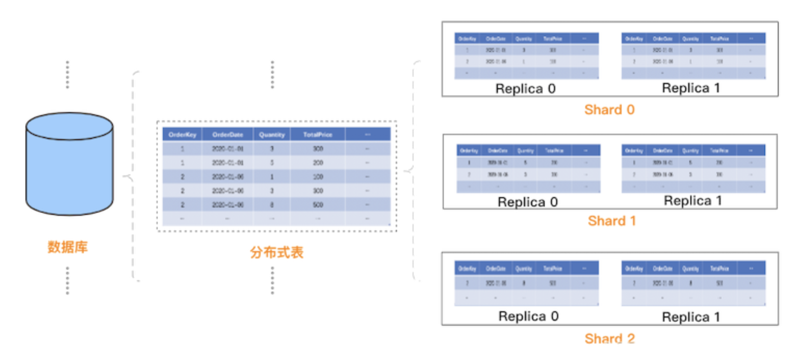
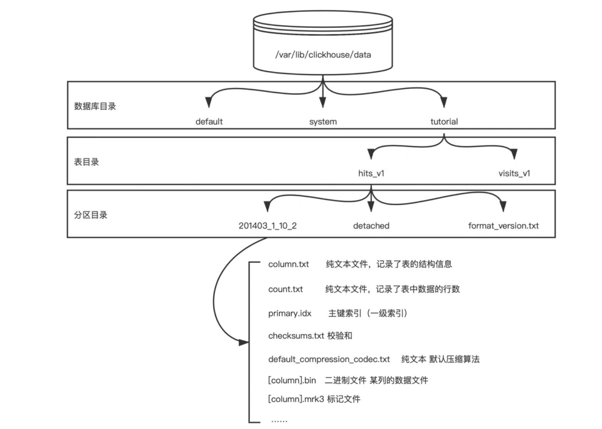
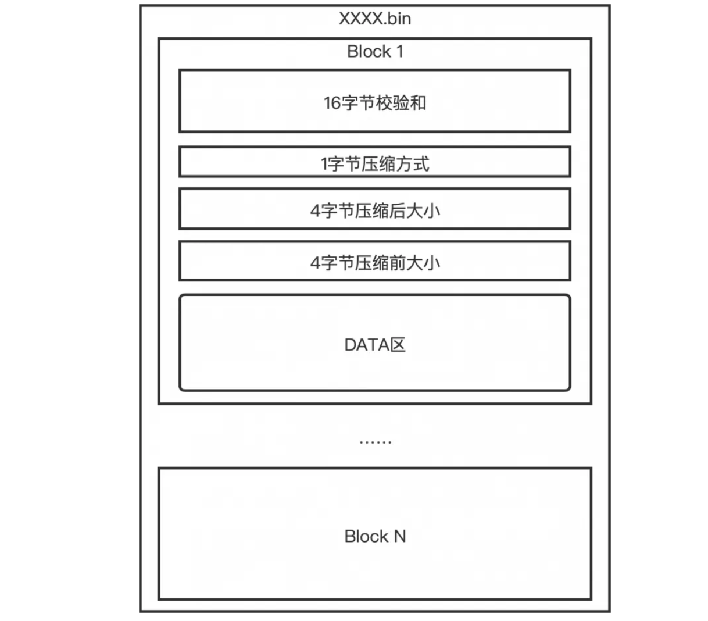

# 简介

ClickHouse是一个快速、可扩展的用于联机分析(OLAP)的列式数据库管理系统(DBMS)，专门用于在线分析处理（OLAP）工作负载。它是一个开源项目，由Yandex团队开发和维护。ClickHouse的设计目标是提供高性能的数据分析能力，是一个高性能、可扩展、实时数据分析的列式数据库系统，非常适合需要处理大量数据和高并发查询的场景。

## 特点

以下是ClickHouse的一些主要特点：

* 列式存储：ClickHouse采用列式存储结构，这意味着它将相同类型的数据存储在一起，以便更高效地压缩和查询。这使得它在需要扫描和聚合大量数据时非常快。
* 可扩展性：ClickHouse可以水平扩展，允许在多个节点上分布数据和负载。它可以处理PB级别的数据，并能够自动管理数据分片、复制和故障转移。
* 高性能：ClickHouse的查询速度非常快，尤其是在需要执行聚合操作时。它支持高并发查询和低延迟查询，并可以处理几百万行数据每秒的查询吞吐量。
* 支持SQL：ClickHouse支持SQL语言，包括各种聚合函数、子查询、JOIN操作和分组。它还支持分布式SQL查询。
* 实时数据分析：ClickHouse可以实时处理和分析数据，支持近实时查询和数据导入。它还支持流数据处理，可以与Kafka、Spark Streaming等实时数据处理系统集成。
## 应用场景

ClickHouse适用于需要处理大型数据集和高并发查询的场景，例如电商网站的用户行为分析、金融交易数据分析、游戏数据分析等。

# 核心特性

	MPP (Massively Parallel Processing)，即大规模并行处理，将任务并行的分散到多个服务器和节点上，在每个节点上计算完成后，将各自部分的结果汇总在一起得到最终的结果（与hadoop相似）。

* 多个节点通过网络进行连接协同工作，完成相同的任务（分布式计算+分布式存储）
* 每个节点只访问自己的本地资源（内存、存储等）
* 完全无共享（Share Nothing）结构，因而扩展能力非常好
ClickHouse是一款MPP架构的列式存储数据库，吸取了其他优秀技术的精髓，将每个细节做到极致，从而在性能上远远超过其他技术。

## DBMS功能

ClickHouse拥有DBMS完备的管理功能，但它不仅仅是一个数据库。作为DBMS，它具备以下基本功能。

1. DDL（数据定义语言）：可以动态地创建、修改删除数据库、表和视图，而无须重启服务。
2. DML（数据操作语言）：可以动态查询、插入、修改或者删除数据。
3. 权限控制：可以按照用户粒度设置数据库或者表的操作权限，保障数据的安全性。
4. 数据备份与恢复：提供了数据备份导出与导入恢复机制，满足生产环境的要求。
5. 分布式管理：提供集群模式，能够自动管理多个数据库节点。
## 支持SQL

	ClickHouse使用关系型模型描述数据，并提供了传统数据库的概念，如数据库、表、视图和函数等。ClickHouse可以使用SQL作为查询语言。

* Hive  
    * Impala是Cloudera公司主导开发的新型查询系统，它提供SQL语义，能查询存储在Hadoop的HDFS和HBase中的PB级大数据。
* Spark SQL
    * Druid 是一个分布式的数据分析平台，预聚合算是 Druid 的一个非常大的亮点，通过预聚合可以减少数据的存储以及避免查询时很多不必要的计算。
    * Apache Kylin™是一个开源的、分布式的分析型数据仓库，提供Hadoop/Spark 之上的 SQL 查询接口及多维分析（OLAP）能力以支持超大规模数据，最初由 eBay 开发并贡献至开源社区。它能在亚秒内查询巨大的表。
## 表引擎

与MySQL类似ClickHouse将存储部分进行了抽象，把存储引擎作为一层独立的接口。ClickHouse目前拥有合并树、内存、文件、接口和其他6大类等20多种表引擎，用户可以根据实际应用场景，选择合适的表引擎使用。

通用的表引擎可以有更广泛的适用性，能适应更多的应用场景，但这种通用性可能造成它无法在所有应用场景内性能做到极致，也是一种平庸的表现。

将表引擎独立设计，可以通过特定的表引擎支撑特定的场景，用法十分灵活。对于简单的应用场景，可以直接使用简单的引擎降低成本，而复杂的应用场景也有合适的表引擎。

## 列式存储

	行式存储和列式存储，数据在磁盘上的组织结构有着根本不同，数据分析计算时，行式存储需要遍历整表，列式存储只需要遍历单个列，所以列式库更适合做大宽表，用来做数据分析计算。

列式存储和数据压缩，是高性能数据库必不可少的重要特性。如果想让查询变得更快，最简单且最有效的方法就是减少数据扫描范围和数据传输时的大小。

## 向量化执行

	向量化执行，就是利用寄存器硬件层面的特性，为上层应用程序的性能带来了指数级的提升。

为了实现向量化执行，需要利用CPU的SIMD（Single Instruction Multiple Data，即用单条指令操作多条数据）命令，通过数据并行来提高性能。即在CPU寄存器层面实现数据的并行操作。

## 并行计算

	向量化执行是通过数据级并行的方式提升了性能，多线程处理是通过线程级并行的方式实现了性能的提升。

ClickHouse在数据存取方面，既支持分区（纵向扩展，利用多线程技术），也支持分片（横向扩展，利用分布式技术）。ClickHouse将多线程和分布式的技术应用到了极致。

## 实时查询

ClickHouse支持实时查询，即便是在复杂查询的场景下，也能够做到极快响应，且无需对数据进行任何预处理加工。

与其他类似产品对比优势：

* SparkSQL和Hive无法保障90%的查询在1秒内容返回，在海量数据的复杂查询可能需要分钟级别的响应时间
* ElasticSearch在处理亿级数据聚合查询的时候，会显得力不从心
## 多主架构

ClickHouse则采用Multi-Master多主架构，集群中每个节点角色对等，客户端访问任意一个节点都能得到相同的效果。	规避了单点故障的问题，非常适合用于多数据中心、异地多活的场景。（对比Hadoop生态系统技术都采用了Master-Slave主从架构）

## 数据分片

ClickHouse支持分片，采用分治思想，将数据进行横向切分，解决存储和查询的瓶颈。ClickHouse分片依赖集群，每个集群由1个到多个分片组成，而每个分片则对应ClickHouse的1台服务器节点，分片的数量取决于节点数量（一个分片只能对应一台服务器节点）。

ClickHouse的分片功能没有那么自动化，它提供了一个本地表（Local Table）和分布式表（Distribute Table）的概念。

* 一张本地表等同于一份数据分片。
* 分布式表本身不存储任何数据，它是本地表的访问代理，作用类似分库中间件。借助分布式表，能够代理访问多个数据分片，从而实现分布式查询。
这种设计非常灵活，业务上线初期数据量不大，采用单节点的本地表即可，随着数据量增大，	新增分片的方式分流数据，通过分布式表实现分布式查询。

# 架构

ClickHouse的架构包括多个节点，每个节点可以担任多个角色，例如数据存储、数据计算、查询处理等。ClickHouse支持多种数据分片和副本策略，可以在多个节点上分布数据和负载。


## Column和Field

Column和Field是ClickHouse数据最基础的映射单元。内存中的一列数据由一个Column对象表示。如果需要操作单个具体的数值（也就是单列中的一行数据），则需要使用Field对象，Field对象代表一个单值。IColumn接口对象中，定义了对数据进行各种关系运算的方法。

## DataType

数据的序列化和反序列化工作由DataType负责。但并不直接负责数据的读取，而是转由从Column或Field对象获取。IDataType接口定义了许多正反序列化的方法，成对出现。

## Block与Block流

ClickHouse内部的数据操作是面向Block对象进行的，并且采用了流的形式。Block对象可以看作数据表的子集，包含了数据的类型及列的名称。

Block并没有直接聚合Column和DataType对象，而是通过ColumnWithTypeAndName对象进行间接引用。

Block流操作有两组顶层接口：IBlockInputStream负责数据的读取和关系运算，IBlockOutputStream负责将数据输出到下一环节。

## Table

数据表的底层设计中并没有所谓的Table对象，直接使用IStorage接口指代数据表。

## Parser和Interpreter

Parser分析器负责创建AST对象；Interpreter解释器则负责解释AST，并进一步创建查询的执行管道。它们与IStorage一起，串联起了整个数据查询的过程。

## Function

ClickHouse主要提供两类函数——普通函数和聚合函数。普通函数由IFunction接口定义。

聚合函数由IAggregateFunction接口定义，相比无状态的普通函数，聚合函数是有状态的。

## Cluster与Replication

ClickHouse的集群由分片（Shard）组成，而每个分片又通过副本（Replica）组成。

ClickHouse的分片与其他系统有所区别：

* ClickHouse的1个节点只能拥有1个分片
* 分片只是一个逻辑概念，其物理承载还是由副本承担的
# 数据模型

ClickHouse支持多种数据类型和表引擎，可以存储结构化和非结构化数据。它支持多种聚合函数、子查询、JOIN操作和分组，还支持分布式SQL查询。

## 逻辑数据模型

一个数据库有若干个分布式表组成，每张表会有多个分片，每个分片会有多个副本。




## 物理数据模型


数据分区：每个分片副本的内部，数据按照 PARTITION BY 列进行分区，分区以目录的方式管理，本文样例中表按照时间进行分区。

列式存储：每个数据分区内部，采用列式存储，每个列涉及两个文件，分别是存储数据的 .bin 文件和存储偏移等索引信息的 .mrk2 文件。

数据排序：每个数据分区内部，所有列的数据是按照 ORDER BY 列进行排序的。可以理解为：对于生成这个分区的原始记录行，先按 ORDER BY 列进行排序，然后再按列拆分存储。

数据分块：每个列的数据文件中，实际是分块存储的，方便数据压缩及查询裁剪，每个块中的记录数不超过 index_granularity，默认 8192。

主键索引：主键默认与 ORDER BY 列一致，或为 ORDER BY 列的前缀。由于整个分区内部是有序的，且切割为数据块存储，ClickHouse 抽取每个数据块第一行的主键，生成一份稀疏的排序索引，可在查询时结合过滤条件快速裁剪数据块。

# 索引

索引结构是用于加速数据查询的关键组件之一。ClickHouse的索引结构通常是用于辅助查询的，而不是强制性的。ClickHouse支持全表扫描，因此即使没有索引也可以快速查询大量数据。但是，对于大型数据集和复杂的查询，索引结构可以显著提高查询性能并减少查询时间。

## 索引结构

ClickHouse支持多种不同的索引结构，包括以下几种：

### 哈希索引

哈希索引（Hash Index）将数据列中的每个唯一值映射到一个桶中，从而加快查找特定值的速度。哈希索引适用于等值查询，但不适用于范围查询或排序操作。

### B+树索引

B+树索引（B+Tree Index）是一种常见的树状结构，可以支持范围查询和排序操作。在ClickHouse中，B+树索引被广泛用于处理时间序列数据等常见场景。

### 倒排索引

倒排索引（Inverted Index）将每个值映射到包含该值的行号列表中。倒排索引适用于文本搜索等场景，但在处理大量数据时可能会消耗大量内存。

### Bloom过滤器

Bloom过滤器（Bloom Filter）是一种用于快速确定元素是否在集合中的概率型数据结构。Bloom过滤器可以用于加速查询过滤，但可能会导致一定的误判率。

### 空间索引

空间索引（Spatial Index）是一种用于处理空间数据（例如地理坐标）的索引结构。ClickHouse支持多种空间索引结构，包括KD树、R树和Hilbert曲线等。

## 索引查询流程

在 ClickHouse 中，索引结构是用于加速数据查询的关键组件。当执行查询时，ClickHouse会使用索引结构来定位数据并返回查询结果。下面是 ClickHouse 索引如何找到对应的数据的简要过程：

1. 首先，ClickHouse会根据查询条件选择合适的索引结构，例如哈希索引、B+树索引等等。
2. 接着，ClickHouse会使用查询条件中的值在索引结构中进行查找。例如，如果是哈希索引，ClickHouse会将查询条件中的值通过哈希函数计算得到一个桶号，然后在对应的桶中查找是否存在对应的值。
3. 如果在索引结构中找到了匹配的数据，ClickHouse会返回对应的行号（在数据文件中的位置），然后通过行号在数据文件中读取对应的数据。
4. 如果索引结构无法找到匹配的数据，ClickHouse会返回空结果。
在某些情况下，ClickHouse可能会选择不使用索引结构而是直接进行全表扫描来查找数据。这通常发生在索引结构不适用于查询条件的情况下（例如，如果查询条件使用了某个列的范围查询，而哈希索引只适用于等值查询）或者数据集较小时。

# 工作流程

## 查询流程

查询的处理过程可以分为以下几个步骤：

1. 语法解析和查询构建：当用户发出一个查询请求时，ClickHouse首先会解析查询语句并构建一个查询执行计划。这个计划将指定查询的所有步骤，包括要使用的表、列、索引和函数，以及查询如何被处理和优化。
2. 查询优化：在查询执行计划构建完成后，ClickHouse会对它进行一系列优化操作，以使查询尽可能高效。这些优化操作包括推迟计算、重写查询、选择索引和预取等。
3. 查询执行：一旦查询执行计划和优化都完成，ClickHouse将开始执行查询。查询执行过程包括在所有分片和节点上扫描数据、聚合和过滤数据、使用索引来优化查询等。
4. 数据合并和排序：当查询执行完成后，ClickHouse会将分布式的查询结果合并成一个单一的结果集。如果查询包括排序操作，ClickHouse还将进行排序操作以获得最终的结果集。
5. 结果返回：最后，ClickHouse将查询结果返回给客户端，客户端将获得一个包含查询结果的响应。
需要注意的是，ClickHouse是一个分布式的数据库系统，因此上述查询流程将在多个节点和分片上并行执行。在查询执行过程中，ClickHouse会自动将查询分发到多个节点上，并对结果进行合并和排序。这使得ClickHouse能够高效地处理大量的数据，并在秒级甚至亚秒级别提供响应。

## 写入流程

 ClickHouse 数据写入的基本流程：

1. 客户端向 ClickHouse 发送一个 INSERT 查询，包含要写入的数据。
2. ClickHouse 的负责接收数据的进程（通常称为“数据节点”）接收到这个查询，并检查表结构和数据类型是否匹配。
3. 如果数据类型不匹配，ClickHouse 会将数据转换为正确的类型，或者拒绝写入数据。
4. 数据节点将接收到的数据暂时存储在一个名为“内存表”的数据结构中。内存表是一个类似于缓存的数据结构，可以快速地接收、处理和存储数据。
5. 当内存表的数据量达到一个预定义的阈值（通常是几百万或几千万行），ClickHouse 将内存表中的数据写入到磁盘上的数据文件中。这个过程被称为“刷盘(flushing)”。
6. 写入数据的过程是异步的，这意味着数据可以在后台写入，而不会阻塞正在进行的查询。当写入完成后，ClickHouse 将会通知客户端写入成功。
7. 一旦数据被写入到数据文件中，它就可以被查询和聚合。为了提高查询性能，ClickHouse 将数据文件划分成多个小的数据块，每个数据块称为一个“分区(partition)”。每个分区包含一个或多个**桶(bucket)**，可以根据需要进行读取和处理。
ClickHouse 的数据写入流程是一个非常高效和灵活的过程，可以快速地接收、处理和存储大量的数据。通过将数据存储在内存表中，并使用异步写入和分区等技术，ClickHouse 可以在处理大规模数据时实现卓越的性能和效率。

## 更新流程

 ClickHouse 更新数据的流程与传统的关系型数据库有所不同。由于 ClickHouse 的设计目标是高效地处理大规模数据，因此并不支持像传统数据库中那样的“原地更新”(in-place update)操作。更新操作被视为删除旧数据并插入新数据的组合操作。以下是 ClickHouse 中更新数据的基本流程：

1. 客户端向 ClickHouse 发送一个 UPDATE 查询，包含要更新的数据。
2. ClickHouse 的数据节点接收到这个查询，并检查表结构和数据类型是否匹配。
3. 如果数据类型不匹配，ClickHouse 会将数据转换为正确的类型，或者拒绝更新数据。
4. ClickHouse 执行一个 DELETE 查询来删除符合更新条件的旧数据。删除操作的效率非常高，因为 ClickHouse 可以将需要删除的数据的位置记录在特殊的“删除列表”(delete list)中，而不是实际删除数据。
5. ClickHouse 接着执行一个 INSERT 查询，将更新后的数据插入到表中。插入操作的效率也非常高，因为 ClickHouse 可以将插入的数据暂时存储在内存表中，并在内存表中有足够的数据时一次性写入到磁盘上的数据文件中。
6. 更新操作的效率受多个因素影响，包括更新条件的复杂度、数据文件大小、磁盘读写速度等等。
ClickHouse 中的数据更新操作是一种删除旧数据并插入新数据的组合操作。这种设计可以帮助 ClickHouse 在高效处理大规模数据时保持高性能和效率。由于更新操作的效率受多个因素影响，因此在实际使用中需要仔细考虑更新数据的策略。

# 性能优化

ClickHouse使用多种性能优化技术来提高查询效率和扩展性，例如使用多种压缩算法和编码技术来减少存储空间，使用数据预取和批量读取技术来提高查询效率，使用多种查询优化技术来加速查询等。

其性能优化主要包括以下几个方面：

1. 列式存储：ClickHouse 采用列式存储，将同一列的数据存储在一起，避免了传统行式存储的随机读写，大大提高了数据的读取效率。此外，列式存储还可以压缩相同列中重复的数据，从而减少了磁盘存储和传输数据的大小。
2. **多级索引**：ClickHouse 采用多级索引，可以在不完全扫描所有数据的情况下进行快速的过滤和聚合操作，从而提高了查询效率。
3. 数据分区：ClickHouse 可以将数据分为多个分区，每个分区包含一组连续的数据，可以加快查询和聚合操作的速度。
4. **向量化计算**：ClickHouse 在进行聚合计算时使用向量化计算，将多个计算任务组合成一个单一的指令，减少了CPU指令执行的次数，从而提高了计算效率。
5. **异步写入**：ClickHouse 将数据写入到磁盘上的数据文件时采用异步写入的方式，可以将写入操作放入后台执行，避免了写入操作对查询性能的影响。
6. 数据压缩：ClickHouse 支持多种数据压缩算法，可以将数据文件的大小压缩到原来的几分之一或几十分之一，从而减少了磁盘存储和传输数据的大小。
这些技术的应用使得 ClickHouse 可以高效地处理大规模的数据，并在查询和聚合等操作中保持卓越的性能和效率。

# 文件组织

大部分的DBMS中，数据库本质上就是一个由各种子目录和文件组成的文件目录，clickhouse也不例外。下图展示了clickhouse对数据文件的组织。




## 数据库目录

clickhouse默认数据目录在 `/var/lib/clickhouse/data` 目录中。所有的数据库都会在该目录中创建一个子文件夹。

每一个数据库都会在clickhouse的data目录中创建一个子目录，clickhouse默认携带default和system两个数据库。default顾名思义就是默认数据库，system是存储clickhouse服务器相关信息的数据库，例如连接数、资源占用等。

## 表目录

每个表都有一个对应的表目录，用于存储该表的所有数据块。表目录的默认路径为  `/var/lib/clickhouse/data/<database_name>/<table_name>/` 

## 分区目录

ClickHouse支持按照分区进行数据存储和查询，数据表的分区数据存储在该目录下。分区（Partition）是指将表按照某个列或表达式进行划分，将同一分区中的数据存储在相同的数据块中，以便更高效地查询和管理数据。

每个分区目录包含一些文件，其中包括数据文件、索引文件等。分区目录的名称可以是任何字符串，但是建议使用可以表示时间的字符串，这样可以方便地按时间范围查询数据。

## 数据文件和索引文件

分区目录下就能看到真实存储的数据文件和索引文件：

* columns.txt：存储表结构信息。
* count.txt：存储该分区下的行数。执行select count(*) from table即返回该内容，而不是遍历数据。
* primary.idx：主键索引。
* checksums.txt：二进制文件，校验和。用于快速校验数据是否被篡改。
* default_compression_codec.txt：（新版本增加的文件）存储数据文件中使用的压缩编码器。默认使用LZ4。
* [column].mrk3：列的标记文件。
* [column].bin：真正存储数据的数据文件。每一列都会生成一个单独的bin文件。
* skp_idx_[column].idx：跳数索引，使用二级索引时会生成。
* skp_idx_[column].mrk：条数索引标记文件，使用二级索引时会生成。
# 数据组织

bin文件是二进制文件，在读取时需要借助工具，无法使用文本文件进行读取。在windows操作系统下建议使用winhex，mac系统推荐hex friend。

## 数据文件结构




bin文件使用小端字节序存储。bin文件中按block为单位排列数据，每个block文件有16字节校验和，1字节压缩方式，4字节压缩后大小和4字节的压缩前大小组成。每个block起始地址由如下公式确定：

```plain
offset(n)=offset(n-1)+25+压缩后大小 （n>=2)
offset(1)=0
```
## 校验和

前16为检验和区域用于快速验证数据是否完整。

## 压缩方式

默认为0x82。clickhouse共支持4种压缩方式，分别为LZ4(0x82)、ZSTD(0x90)、Multiple(0x91)、Delta(0x92)。

## 压缩后大小

存储在data区域的数据的大小。需要依据此大小计算下一个BLOCK的偏移量。

## 压缩前大小

data区域存储的数据在压缩前的大小。可以依据此计算压缩比。

## data区

data区存储数据，大小为头信息第18～21字节表示的大小。拿到data区数据后，由于是压缩后的，因此无法直接识别，需要按照压缩方式进行解压缩后，才能识别。

# Reference

[https://clickhouse.com/docs/zh/](https://clickhouse.com/docs/zh/)

[https://clickhouse.com/docs/zh/development/architecture](https://clickhouse.com/docs/zh/development/architecture)

[字节跳动广告场景使用的“ClickHouse”介绍](https://juejin.cn/post/7035791936145326111)

[ClickHouse作用及应用场景](https://zhuanlan.zhihu.com/p/358821358)

[https://www.modb.pro/db/467020](https://www.modb.pro/db/467020)

[https://developer.aliyun.com/article/1133873](https://developer.aliyun.com/article/1133873)

[https://zhuanlan.zhihu.com/p/398187357](https://zhuanlan.zhihu.com/p/398187357)

