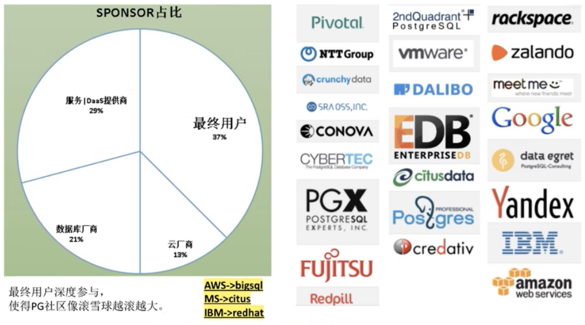

# 简介

PostgreSQL是一个功能非常强大的、源代码开放的客户/服务器关系型数据库管理系统（RDBMS），在BSD许可证下发型。PostgreSQL简称PG。

Slogan 是“世界上最先进的开源关系型数据库”。“开源界的Oracle”。

PostgreSQL 官网：[https://www.postgresql.org/](https://www.postgresql.org/)

PostgreSQL 中文社区：[http://www.postgres.cn/v2/home](http://www.postgres.cn/v2/home)

另外再数据库排行榜中也可以看到 PG 的受欢迎程度。

全球数据库排行：[https://db-engines.com/en/ranking](https://db-engines.com/en/ranking)

国产数据库排行：[https://www.modb.pro/dbrank](https://www.modb.pro/dbrank)

## 历史

PostgreSQL 最初设想于1986年，当时被叫做Berkley Postgres Project。该项目一直到1994年都处于演进和修改中，直到开发人员Andrew Yu和Jolly Chen在Postgres中添加了一个SQL（Structured Query Language，结构化查询语言）翻译程序，该版本叫做Postgres95，在开放源代码社区发放。

1996年，再次对Postgres95做了较大的改动，并将其作为PostgresSQL6.0版发布。该版本的Postgres提高了后端的速度，包括增强型SQL92标准以及重要的后端特性（包括子选择、默认值、约束和触发器）。

2005年，发布8.0版本，开始支持Windows系统环境。

2010年9月20日发布了PostgreSQL 9.0，大大增强了复制的功能(replication)，比如增加了流复制功能(stream replicaction)和HOT standby功能。

PostgreSQL 9.0：支持64位Windows系统，异步流数据复制、Hot Standby。

PostgreSQL 9.1：支持数据同步复制，unlogged tables、serializable snapshot isolation、FDW外部表等。此版本后，开始得到中国多个行业用户的关注，开始应用于电信、保险、制造业等边缘系统。

2019年，PostgreSQL 12 版本发布，这也是目前生产环境主流的版本。2021年，PostgreSQL 14 版本发布。

## 社区

### 纯社区

纯社区，没有被商业公司控制




最终用户都希望社区长久，期望可以享受免费的、可持续发展、开源的、不被任何商业公司或国家控制的企业级数据库，不靠数据库赚钱。

云厂商基于PG的好处：

* 免去自己培养生态
* 避免重复造轮子
* PG代码基础非常不错
* 防止其他厂商控制PG失去市场主导能力（赞助商：AWS/google/IBM/微软）
### 开源许可独特性

PostgreSQL遵守BSD许可证发型，使得开发者们得以获取源代码进一步开发系统。

BSD许可协议（Berkeley Software Distribution license）是自由软件中使用最广泛的许可协议之一。BSD遵照该许可证来发布，BSD许可证比较宽松，甚至跟共有领域更为接近。BSD的后续版本可以选择要继续是BSD或其他自由软件条款或封闭软件等。

众所周知，MySQL倍Oracle所控制，MySQL同时使用了GPL和一种商业许可（称为双重许可）。

GPL(General Public License)是公共许可，遵循了GPL的软件是公共的。如果某软件使用GPL软件，那么该软件也需要开源，如果不开源就不能使用GPL软件，这和是否把该软件商用与否没有关系。

如果无法满足GPL，就需要获得商业许可，通过与Oracle公司联系，指定解决方案，受Oracle公司约束。

同为开源软件，PostgreSQL源码使用自由友好，商业应用不受任何公司实体所控制，而MySQL在一定程度上有所限制。

## 与MySQL比较

PostgreSQL的优势：

* 在SQL的标准实现上要比MySQL完善，而且功能实现比较严谨
* 对表链接支持较完整，优化器功能较完整，支持的索引类很多，复杂查询能力较强
* PG主表采用堆表存放，MySQL采用索引组织表，能够支持MySQL更大的数据量
* PG主备复制属于物理复制，相对MySQL基于binlog的逻辑复制，数据的一致性更加可靠，复制性能更高，对主机性能影响更小
* PostgreSQL支持JSON和其他NoSQL功能，如本机XML支持和使用HSTORE的键值对。还支持索引JSON数据以加快访问速度，特别是10版本JSONB更强大
* PostgreSQL基于BSD协议完全免费，在其基础上修改然后商用也是可以的，使得PG不会被其它公司控制。而MySQL主要被Oracle公司控制
PostgreSQL的劣势：

* innodb 基于回滚段实现的 MVCC 机制，相对 PG 新老数据一起存放的基于 XID 的 MVCC 机制是更好的。新老数据一起存放需要定时触发 VACUUM，会带来多余的IO和数据库对象加锁开销，引起整体并发能力下降。且 VACUUM 清理不及时回引发数据膨胀。
* MySQL采用索引组织表，这种存储方式适合基于主键匹配的查询、删改操作，但对表结构设计存在约束。
* MySQL优化器较简单，系统表、运算符、数据类型的实现都很精简，非常适合简单的查询操作。
* MySQL相比PG在国内的流行度更高。
* MySQL存储引擎插件化机制，使得应用场景更加广泛，如innodb适合事务处理场景外，myisam适合静态数据的查询场景。
从应用场景来说，PG更加适合严格的企业应用场景（比如金融、电信、ERP、CRM），且其 json、jsonb、hstore 等数据格式，特别适用于一些大数据格式的分析。而 MySQL 更加适合业务逻辑相对简单、数据可靠性要求较低的互联网场景（如google、alibaba等），当然MySQL在innodb引擎的大力发展下功能表现良好。

## 特性

PG拥有众多开放特性：

* 开放的数据类型接口：除了传统数据库支持的类型，还支持GIS，JSON，RANGE，IP，ISBN，图像特征值，化学，DNA等等扩展的类型，还可以根据实际业务扩展更多的类型。
* 开放的操作符接口：不仅支持常见的类型操作符，还支持扩展的操作符，例如距离符，逻辑并、交、差符号，图像相似符号，几何计算符号等等扩展的符号，用户还可以根据实际业务扩展更多的操作符。
* 开放的外部数据源接口：PG支持丰富的外部数据源，例如可以通过FDW读写mysql, redis, mongo, oracle, sqlserver, hive, www, hbase, ldap等等，只要你能想到的数据源都可以通过FDW接口读写。
* 开放的语言接口：使得PG支持几乎地球上所有的编程语言作为数据库的函数、存储过程语言，例如plpython , plperl , pljava , plR , plCUDA , plshell等等。用户可以通过language handler扩展PG的语言支持。
* 开放的索引接口：使得PG支持非常丰富的索引方法，例如btree , hash , gin , gist , sp-gist , brin , bloom , rum , zombodb , bitmap (greenplum extend)，用户可以根据不同的数据类型，以及查询的场景，选择不同的索引。
* PG内部还支持BitmapAnd, BitmapOr的优化方法，可以合并多个索引的扫描操作，从而提升多个索引数据访问的效率。

# 安装

## 下载

官网下载地址：[https://www.postgresql.org/download/](https://www.postgresql.org/download/)

## 安装

### Windows

直接下载安装，安装过程中设置密码，用户名默认为 postgres。

### Linux

参考官方文档安装，添加源、执行脚本等等，不同发型版本有些许差别。

如 Debian 系统安装：[https://www.postgresql.org/download/linux/debian/](https://www.postgresql.org/download/linux/debian/)

```shell
sudo sh -c 'echo "deb http://apt.postgresql.org/pub/repos/apt $(lsb_release -cs)-pgdg main" > /etc/apt/sources.list.d/pgdg.list'
wget --quiet -O - https://www.postgresql.org/media/keys/ACCC4CF8.asc | sudo apt-key add -
sudo apt-get update
sudo apt-get -y install postgresql
# sudo apt-get -y install postgresql-14  # 指定版本
```
如 CentOS 系统安装：[https://www.postgresql.org/download/linux/redhat/](https://www.postgresql.org/download/linux/redhat/)
```shell
sudo yum install -y https://download.postgresql.org/pub/repos/yum/reporpms/EL-6-x86_64/pgdg-redhat-repo-latest.noarch.rpm
sudo yum install -y postgresql14-server
sudo service postgresql-14 initdb
sudo chkconfig postgresql-14 on
sudo service postgresql-14 start
```

## 使用

### Windows

界面工具：

官方自带的 pgAdmin 工具。

命令行工具：

官方自带的 SQL Shell (psql) 终端工具。

三方界面工具：

如Navicat，PG默认端口为 5432。

注意：PG默认不允许远程连接，需要修改安装目录下 data/pg_hba 文件配置：

```plain
# IPv4 local connections:
host all  all 127.0.0.1/32  scram-sha-256
host all  all 0.0.0.0/32  scram-sha-256 # 增加一行
```
然后重启服务。
>windows打开服务管理界面（可通过services.msc），重启 postgresql-x64-xx。
>注意防火墙也需要关闭。

### Linux

初始化数据库：

```shell
sudo yum install -y postgresql14-server
```
启动服务：
```shell
# 设置开机启动
sudo systemctl enable postgresql-14
# 启动服务
sudo systemctl start postgresql-14
```

修改密码：

安装成功后会默认创建一个名为 postgres 的 Linux 用户，初始化数据库后会有名为 postgres 的数据库（相当于MySQL中的名为mysql的数据库）。

进入PG命令行：

```shell
su postgres
# 启动 SQL Shell
psql
# 修改密码
ALTER USER postgres WITH PASSWORD 'NewPassword'
\q # 退出
# 重新进入 SQL Shell
psql

```


配置远程访问：

1、开放端口

```shell
sudo firewall-cmd --add-port=5432/tcp --permanent
sudo firewall-cmd --reload
```
2、修改IP绑定
```shell
# 修改配置文件
vi /var/lib/pgsql/14/data/postgresql.conf
# 修改监听地址
# 默认 listen_addresses 配置是注释掉的，可以直接在配置文件开头加入该行
listen_addresses='*'
```
3、允许所有IP访问
```shell
# 修改配置文件
vi /var/lib/pgsql/14/data/pg_hba.conf
# 在文件尾部加入
host  all  all 0.0.0.0/0 md5
```
4、重启服务
```shell
sudo systemctl restart postgresql-14
```

# 数据类型

创建表时必须使用数据类型，PG主要有以下几类数据类型：

* 数值数据类型
    * smallint：2字节
    * integer：4字节
    * bigint：8字节
    * decimal：可变长
    * numeric：可变长
    * real：4字节
    * double：8字节
* 字符串数据类型
    * char
    * varchar
    * text
* 日期/时间数据类型
    * timestamp：日期和时间
    * date：日期
    * time：时间
* 数组类型
    * int[]
    * text[]
    * int[][]
* json/jsonb类型
    * json
    * jsonb
* xml类型
* 货币类型
    * money
* 布尔
    * boolean
* 空间几何类型
    * point
    * line
    * box
    * path
    * circle
* 网络地址类型
    * inet
    * macaddr
* 位串
    * bit
* uuid类型
* 复合类型
    * CREATE TYPE complex AS(a int, b int)
* 范围类型
    * int4range
    * numrange
    * daterange
# 基本使用

## 控制台常用命令

```shell
\password命令（设置密码）
\q命令（退出）
\h：查看SQL命令的解释，比如\h select
\?：查看psql命令列表
\l：列出所有数据库
\c [database_name]：连接其他数据库
\d：列出当前数据库的所有表格
\d [table_name]：列出某一张表格的结构
\du：列出所有用户
```

## 登录

```sql
# psql -h 服务器 -U 用户名 -d 数据库 -p 端口地址 # -U 大写
$ psql -U dbuser -d example -h 127.0.01 -p 5432

# (连接数据库，默认用户名和数据库都是 postgres)
# 相当于系统用户postgres以同名数据库用户的身份登录数据库，不用输入密码，
# 提示符变为 postgres=# 表示成功进入
$ psql 
```
## 数据库操作

```shell
# 创建数据库
CREATE DATABASE mydb;

# 查看所有数据库
\l

# 切换当前数据库
\c mydb

# 删除数据库
drop database <dbname>
```

## 数据库表操作

初级用法：

```shell
#创建表
CREATE TABLE test(id int,body varchar(100));

#在表中插入数据
insert into test(id,body) values(1,'hello,postgresql');

#查看当前数据库下所有表
\d

#查看表结构，相当于desc
\d test
```
增加属性：
```shell
#创建表
CREATE TABLE COMPANY(
   ID  SERIAL PRIMARY KEY,
   NAME           TEXT      NOT NULL,
   AGE            INT       NOT NULL,
   ADDRESS        CHAR(50),
   SALARY         REAL
);

#插入数据
INSERT INTO COMPANY (NAME,AGE,ADDRESS,SALARY)
VALUES ( 'Paul', 32, 'California', 20000.00 );

INSERT INTO COMPANY (NAME,AGE,ADDRESS,SALARY)
VALUES ('Allen', 25, 'Texas', 15000.00 );
```

## Schema

PG模式（SCHEMA）可以看着是一个表的集合。

一个模式可以包含视图、索引、数据类型、函数和操作符等。

相同的对象名称可以被用于不同的模式中不会出现冲突，例如 schema1 和 schema2 都可以包含名为 table1 的表。

使用模式的优势：

* 允许多个用户使用一个数据库且互相不干扰
* 将数据库对象组织成逻辑组以便更容易管理
* 第三方应用的对象可以放在独立的模式中，不会与其他对象的名称发生冲突
模式类似于操作系统层的目录，但是模式不能嵌套。

```shell
#创建schema： 
create schema schema1;

create table schema1.company(
   ID   INT              NOT NULL,
   NAME VARCHAR (20)     NOT NULL,
   AGE  INT              NOT NULL,
   ADDRESS  CHAR (25),
   SALARY   DECIMAL (18, 2),
   PRIMARY KEY (ID)
);

#删除schema： 
drop schema schema1；

#删除一个模式以及其中包含的所有对象：
DROP SCHEMA schema1 CASCADE;
```

## 备份数据库

### 单数据库

PG提供了 pg_dump 来简化备份单个数据库的过程。前提：用户必须有数据库的读取权限：

```shell
# 以 postgres 用户登录
sudo su - postgres
# 备份到文件
pg_dump mydbname > mydbname.bak
# 可以使用 scp 等命令将文件拷贝到其它机器，
然后使用 psql 恢复数据库
psql test < mydbname.bak
```
备份格式：
* .bak：压缩二进制格式
* .sql：明文转储
* .tar：
### 多数据库

pg_dump 一次只创建一个数据库的备份，不会存储有关数据库角色或其他群集范围配置的信息。 要存储此信息并同时备份所有数据库，可以使用 pg_dumpall。

```shell
pg_dumpall > pg_backup.bak
# 从备份还原数据库
psql -f pg_backup.bak postgres
```
 Demo：
```shell
#备份数据库
$ pg_dump -U postgres -f /tmp/postgres.sql postgres (导出postgres数据库保存为postgres.sql)
$ pg_dump -U postgres -f /tmp/postgres.sql -t test postgres (导出postgres数据库中表test的数据)
$ pg_dump -U postgres -F t -f /tmp/postgres.tar postgres (导出postgres数据库以tar形式压缩保存为postgres.tar)

#恢复数据库
$ psql -U postgres -f /tmp/postgres.sql bk01 (恢复postgres.sql数据到bk01数据库)
#pg_restore --  从pg_dump创建的备份文件中恢复PostgreSQL数据库,用于恢复由pg_dump 转储的任何非纯文本格式中的PostgreSQL数据库。
$ pg_restore -U postgres -d bk01 /tmp/postgres.tar  (恢复postgres.tar数据到bk01数据库)
```

## 用户操作

```shell
#创建用户并设置密码
CREATE USER 'username' WITH PASSWORD 'password';
CREATE USER test WITH PASSWORD 'test';

#修改用户密码
$ ALTER USER 'username' WITH PASSWORD 'password';

#数据库授权,赋予指定账户指定数据库所有权限
$ GRANT ALL PRIVILEGES ON DATABASE 'dbname' TO 'username';

#将数据库 mydb 权限授权于 test
GRANT ALL PRIVILEGES ON DATABASE mydb TO test;

#但此时用户还是没有读写权限，需要继续授权表
GRANT ALL PRIVILEGES ON ALL TABLES IN SCHEMA public TO xxx;

#注意，该sql语句必须在所要操作的数据库里执行
#移除指定账户指定数据库所有权限
REVOKE ALL PRIVILEGES ON DATABASE mydb from test

#删除用户
drop user test
# 查看用户
\du
```
pg_hba.conf配置中的第一项设置表示：本地用户通过unix socket登陆时，使用peer方式认证。
```plain
# "local" is for Unix domain socket connections only
local   all             all                                     peer
```
在peer方式中，client必须和PG在同一台机器上。peer使用PostgreSQL所在的操作系统上的用户登陆，只要当前系统用户和登录PG的用户名相同就可以正常登录。
>部署PG后，切换到系统的postgres用户，直接执行psql就能进入PG就是这个原因。

```shell
# 创建没有密码的用户
create user user1;
# 创建同名用户
useradd user1;
# 切换用户
su - user1
# 登录
psql postgres # 指定用户名，否则默认使用与用户同名的数据库
```
注意：peer不是常用的方式，最常用的方式是通过密码远程登陆。
## 角色管理

PG中没有区分用户和角色， `CREATE USER` 为 `CREATE ROLE` 的别名，两个命令几乎相同。唯一的区别是前者创建的用户默认带有 login 属性，而后者创建的默认不带。

### 创建用户/角色

```shell
postgres=# CREATE ROLE zhangsan;　　//默认不带LOGIN属性
CREATE ROLE
postgres=# CREATE USER lisi;　　//默认具有LOGIN属性
CREATE ROLE
postgres=# \du
                             List of roles
 Role name |                   Attributes                   | Member of 
-----------+------------------------------------------------+-----------
 zhangsan  | Cannot login                                   | {}
 postgres  | Superuser, Create role, Create DB, Replication | {}
 lisi      |                                                | {}

postgres=# 
postgres=# SELECT rolname from pg_roles ;
 rolname  
----------
 postgres
 zhangsan
 lisi
(3 rows)

postgres=# SELECT usename from pg_user;         //角色 zhangsan 创建时没有分配login权限，所以没有创建用户
 usename  
----------
 postgres
 lisi
(2 rows)

postgres=#
```
### 角色属性

|属性| 说明|
|:----|:----|
|login|只有具有 LOGIN 属性的角色可以用做数据库连接的初始角色名。|
|superuser|数据库超级用户|
|createdb|创建数据库权限|
|createrole|允许其创建或删除其他普通的用户角色(超级用户除外)|
|replication	|做流复制的时候用到的一个用户属性，一般单独设定。|
|password|在登录时要求指定密码时才会起作用，比如md5或者password模式，跟客户端的连接认证方式有关|
|inherit|用户组对组员的一个继承标志，成员可以继承用户组的权限特性|

### 创建用户赋予角色属性

创建角色 wangwu 并赋予其 CREATEDB 的权限：

```shell
# 首先切到postgres
postgres=# CREATE ROLE wangwu CREATEDB ;
CREATE ROLE
postgres=# \du
                             List of roles
 Role name |                   Attributes                   | Member of 
-----------+------------------------------------------------+-----------
 wangwu    | Create DB, Cannot login                        | {}
 zhangsan  |                                                | {}
 postgres  | Superuser, Create role, Create DB, Replication | {}
 lisi      |                                                | {}

postgres=#
```
创建角色 zhaoliu 并赋予其创建数据库及带有密码登录的属性：
```shell
postgres=# CREATE ROLE zhaoliu CREATEDB PASSWORD 'zhaoliu123' LOGIN;
CREATE ROLE
postgres=# \du
                             List of roles
 Role name |                   Attributes                   | Member of 
-----------+------------------------------------------------+-----------
 wangwu    | Create DB, Cannot login                        | {}
 zhangsan  |                                                | {}
 postgres  | Superuser, Create role, Create DB, Replication | {}
 zhaoliu   | Create DB                                      | {}
 lisi      |                                                | {}

postgres=#
```
测试 zhaoliu 角色：
```shell
psql -U zhaoliu -d postgres
```

### 为用户赋予权限

给存在的用户赋予各种权限。

赋予 wangwu 登录权限：

```shell
postgres=# ALTER ROLE wangwu WITH LOGIN;
ALTER ROLE
postgres=# \du
                             List of roles
 Role name |                   Attributes                   | Member of 
-----------+------------------------------------------------+-----------
 wangwu    | Create DB                                      | {}
 zhangsan  |                                                | {}
 postgres  | Superuser, Create role, Create DB, Replication | {}
 zhaoliu   | Create DB                                      | {}
 lisi      |                                                | {}

postgres=#
```
赋予 zhaoliu 创建角色的权限：
```shell
postgres=# ALTER ROLE zhaoliu WITH CREATEROLE;
ALTER ROLE
postgres=# \du
                             List of roles
 Role name |                   Attributes                   | Member of 
-----------+------------------------------------------------+-----------
 wangwu    | Create DB                                      | {}
 zhangsan  |                                                | {}
 postgres  | Superuser, Create role, Create DB, Replication | {}
 zhaoliu   | Create role, Create DB                         | {}
 lisi      |                                                | {}

postgres=#
```

# Reference

[PostgreSQL 是中国第一的开源数据库？](https://cloud.tencent.com/developer/article/1847734)


