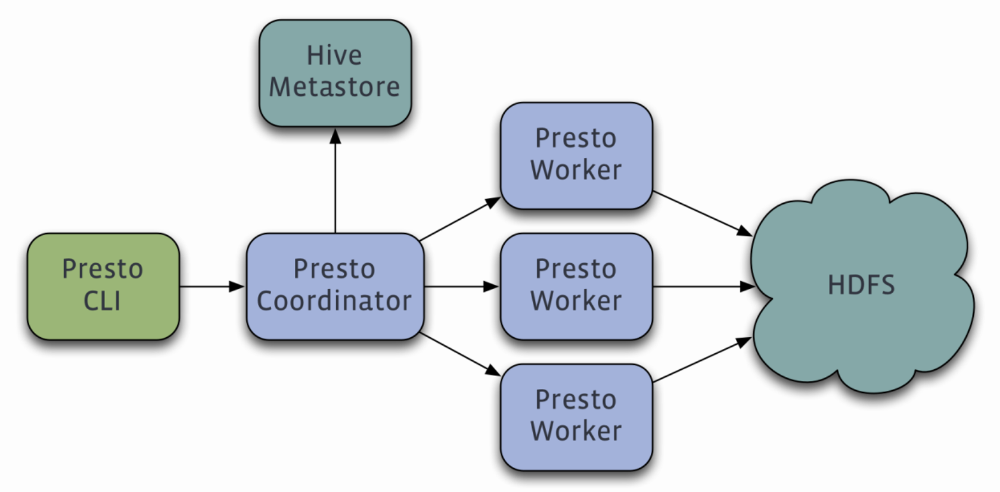
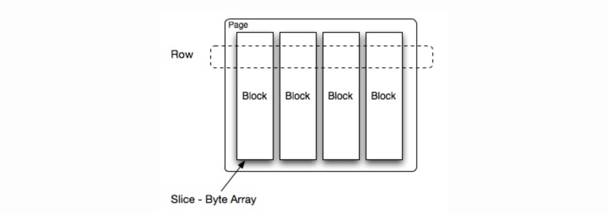

# 背景

Facebook的数据仓库存储在少量大型Hadoop/HDFS集群，之前Facebook的科学家和分析师一直依靠Hive来做数据分析。但Hive使用MapReduce作为底层计算框架，是专为批处理设计的。随着数据越来越多，使用Hive进行一个简单的数据查询可能要花费几分到几小时，显然不能满足交互式查询的需求。Facebook也调研了其他比Hive更快的工具，但它们要么在功能有所限制要么就太简单，以至于无法操作Facebook庞大的数据仓库。

2012年开始试用的一些外部项目都不合适，Facebook决定自己开发，即Presto。目前该项目已经在超过1000名Facebook雇员中使用，运行超过30000个查询，每日数据在1PB级别。Facebook称Presto的性能比Hive要好10倍以上。2013年Facebook正式宣布开源Presto。

# 简介

Presto是由facebook 开源的分布式的MPP(Massive Parallel Processing)架构的SQL查询引擎。基于全内存计算(部分算子数据也可通过session 配置spill到本地磁盘)，并且采用流式pipeline的方式处理数据使其能够节省内存的同时，更快的响应查询。

## 特点

* 多数据源
Presto可以支持MySQL、PostgreSQL、cassandra、Hive、Kafka等多种数据源查询。也可以帮助从其驻留位置查询数据，例如Hive，Cassandra，专有数据存储或关系数据库。

* 支持SQL
Presto支持部分标准SQL对数据进行查询，并提供SQL shell进行SQL查询。但不支持存储过程，不适合大表Join操作，因为Presto是基于内存的，多张大表关联可能给内存带来压力。

* 扩展性
Presto有很好的扩展向，可以自定义开发特定数据源的Connector，使用SQL分析指定Connector中的数据。

* 混合计算
在Presto中可以根据业务需要使用特定类型的Connector来读取不同数据源的数据，进行join关联计算、合并查询。

* 基于内存计算，高性能
基于内存计算的，减少磁盘IO，计算更快。性能是Hive的10倍以上，能够处理PB级别的数据，但并不是把PB级别的数据一次性加载到内存中计算，而是根据处理方式，例如聚合场景，边读取数据、聚合、再清空内存，循环往复。如果使用Join查询，那么就会产生大量的中间数据，速度会变慢。

* 流水线
由于Presto是基于PipeLine进行设计的，因此在进行海量数据处理过程中，终端用户不用等到所有的数据都处理完成才能看到结果，而是可以向自来水管一样，一旦计算开始，就可以产生一部分结果数据，并且结果数据会一部分接一部分的返回到客户端。

* 架构简单
包括一个coordinator和多个worker。

## Presto与Hive比较

|    |Presto|Hive|
|:----|:----|:----|
|**查询语言**|ANSI SQL|HiveQL|
|**速度**|比Hive的速度快5-10倍|比Presto慢|
|**自定义代码插件**|没有|允许用户插入自定义代码|
|**语法差异**|有|有|
|**数据限制**|可以处理有限的数据量|可以处理大批量数据|
|**长时间运行的查询**|超过48小时就会终止|可以查询长期运行的查询|

## Presto与Spark SQL比较

|    |Presto|HiveSpark SQL|
|:----|:----|:----|
|**重点**|强调查询，支持BI报表|强调计算，数据的ETL加工|
|**架构**|MMP主从架构，简单，一个协调器多个Worker|MMP主从架构，复杂，很多层，RDD的弹性构建，为作业进行资源管理和协商等|
|**内存存储**|基于内存，不够就OOM|内存+落磁盘|
|**资源申请**|预先申请CPU/内存，coordinator和worker一直运行|实时申请资源，需要多少资源申请多少|
|**数据处理**|批处理管道处理模式，完成就可以将其发送到下一个任务，大大减少各种查询的端到端响应时间|数据需要在进入下一阶段之前完全处理|
|**优化措施**|基于成本的优化器(CBO)，速度更快|基于规则的优化(RBO)，复杂查询上执行更好的操作，速度更慢|
|**运行时间**|作为服务一直运行，更容易利用缓存|一个任务，作业分发和启动都需要时间|

# 架构

Presto查询引擎是一个Master-Slave的架构，组成部分：

* 一个Coordinator节点
* 一个Discovery Server节点（通常内嵌于Coordinator节点中）
* 多个Worker节点组成
Coordinator负责解析SQL语句、生成执行计划、分发执行任务给Worker节点执行。

Worker节点负责实际执行查询任务。Worker节点启动后向Discovery Server服务注册，Coordinator从Discovery Server获得可以正常工作的Worker节点。如果配置了Hive Connector，需要配置一个Hive MetaStore服务为Presto提供Hive元信息，Worker节点与HDFS交互读取数据。

## Coordinator

协调器（Coordinator）是整个系统的中心节点，负责接收客户端请求、解析查询语句、编译执行计划、并发控制、任务调度、结果合并等。具体来说，协调器的职责包括以下几个方面：

1. 接收并解析查询请求：协调器负责接收客户端发送的SQL查询请求，并对请求进行解析，获取查询的元数据、查询语句等信息。
2. 编译执行计划：协调器根据查询语句、元数据等信息生成查询的执行计划，包括任务划分、任务依赖关系等。
3. 并发控制和任务调度：协调器负责控制查询的并发度和任务调度，根据查询的执行计划将任务分配给不同的工作节点执行。在任务分配时，协调器会考虑数据本地性、节点负载均衡等因素，尽可能地提高查询效率。
4. 监控和管理任务执行：协调器负责监控任务的执行情况，并根据任务执行情况进行调度和管理。如果某个任务失败或超时，协调器会重新分配任务或者取消查询。
5. 结果合并和返回：协调器负责将各个任务的执行结果进行合并，并将结果返回给客户端。
## Worker

Worker是Presto集群中的工作节点，它们负责执行协调器分配的任务，处理查询请求并生成结果。Worker的主要职责包括以下几个方面：

1. 接收并处理任务：Worker从协调器接收任务，根据任务的要求从存储系统中获取数据并执行计算操作。
2. 执行计算任务：Worker将接收到的任务分解为小任务，并利用多个CPU核心和内存执行计算任务。在执行任务时，Worker会将数据读取到内存中，并使用Presto定义的内存数据结构进行计算。
3. 返回结果：Worker完成任务后，将结果返回给协调器，协调器会对结果进行汇总，最终生成查询结果并返回给客户端。
4. 资源管理：Worker需要负责管理自己的资源，包括CPU、内存和磁盘等。Worker需要监控自己的资源使用情况，以确保任务能够正确执行并不会消耗过多的资源。
5. 处理异常：如果任务执行过程中出现异常，Worker需要能够及时捕获并上报给协调器，同时清理异常的状态。
Worker是Presto集群中的核心节点，它们负责处理查询请求、执行计算任务并返回结果。Worker需要高效地利用资源并保证任务执行的正确性，从而提高Presto集群的性能和可靠性。

# 模型

## Connector

Connector是一种抽象的数据源接口，用于连接不同的数据源，例如Hive、MySQL、PostgreSQL、Cassandra等。每个Connector实现了一组标准的接口，包括Metadata、Split、PageSource和RecordSet等，以便与Presto核心系统进行交互和协作。

每种Connector都实现了Presto中标准的SPI接口，只要实现了Presto中标准的SPI接口，就可以轻易实现适合自己需求的Connector。

1. Metadata接口：用于提供数据源的元数据信息，例如表和列的结构、数据类型、分区信息等。Metadata接口还提供了一些用于查询和筛选数据的方法，例如getTables、getColumns、getPartitionKeys、getPartitions等。
2. Split接口：用于将数据源划分成多个数据块（Split），每个Split包含一部分数据和相关的元数据信息。Split接口提供了一些用于生成和管理Split的方法，例如getSplits、getSplit、isRemotelyAccessible等。
3. PageSource接口：用于读取Split中的数据，并返回一个或多个数据页（Page）。PageSource接口提供了一些用于读取数据和处理异常的方法，例如getReader、getPosition、isFinished等。
4. RecordSet接口：用于将数据页（Page）转换为行记录（Record），并提供一些用于访问和处理记录的方法，例如getColumnTypes、nextBatch、getRowCount等。
通过Connector接口，Presto可以访问和处理不同的数据源，支持跨数据源的查询和联合查询。Connector还提供了一些可插拔的机制，例如分区发现、列注释、列别名等，以提高查询性能和效率。

## Catalog

Catalog是一个抽象的概念，表示数据源的集合，可以是一个数据库、一个Hive实例、一个S3存储桶等等。Catalog包含了一组Schema（模式），每个Schema表示一个数据库或者命名空间，包含了一组Table（表），每个Table表示一个数据表。Catalog不存储数据，它仅仅是数据源的描述信息，例如表的结构、分区信息等。Presto的Catalog提供了一些用于管理和查询数据源的方法，例如创建和删除Catalog、列出Catalog、切换Catalog、列出Schema、切换Schema、列出Table、描述Table等。

Presto中的Catalog，相当于数据库的一个实例。在Presto的配置文件中，以.properties结尾，每个properties就对应了Presto中的一个Catalog。

## Schema

Schema是一个抽象的概念，表示数据库或者命名空间，用于组织和管理表。每个Schema包含了一组Table（表），每个Table表示一个数据表。Schema的作用类似于关系型数据库中的数据库，可以帮助用户组织和管理表，并提供更好的隔离和权限控制。一个Catalog中可以有多个Schema。

## Table

Table表示一个数据表，包含了表的结构和数据。每个Table属于一个特定的Schema（数据库或命名空间），可以由Catalog（数据源）中的Schema映射而来，也可以由用户在Presto中创建。

Presto支持的Table类型包括：

1. Native Table：在Presto中创建的Table，通常是一些基于文件、Hive、关系型数据库等数据源的虚拟表。
2. External Table：在Presto中定义的对外部数据源的引用，例如S3存储桶、HDFS文件系统等。
3. System Table：Presto内置的一些元数据表，用于获取关于集群、任务、查询等运行时信息。
Presto的Table可以使用SQL语句进行查询、过滤、聚合等操作，支持标准的SQL查询语法，例如SELECT、FROM、WHERE、GROUP BY、HAVING、JOIN等关键字。Presto还支持复杂的查询操作，例如嵌套查询、子查询、多级连接、窗口函数等。

Presto的Table可以使用各种文件格式存储数据，包括文本文件（CSV、JSON、XML等）、列式存储（Parquet、ORC等）、序列化存储（Avro、Thrift等）等。Presto还支持对Table进行分区和桶（bucket）操作，以便于提高查询性能和优化数据访问。

# 执行过程

## 主要概念

### Page

Presto中最小数据处理单元是一个Page对象，Page通常是列存储格式的，包含若干行数据。通过Page将数据从一个节点传递到另一个节点。

Page对象的数据结构如下图所示。一个Page对象包含多个Block对象，每个Block对象是一个字节数组，存储一个字段的若干行。多个Block横切的一行是真实的一行数据。一个Page最大1MB，最多16*1024行数据。

### Stage

Stage是Presto查询计划中的一个执行阶段，可以看作是一个有向无环图(DAG)中的一个节点。每个Stage都是由一个或多个Task组成，每个Task处理一个或多个Split。Stage的主要职责是将查询计划划分为多个阶段并协调Task之间的数据传输和计算。

### Task

Task是Stage的子节点，是Presto中的计算任务单元。每个Task都处理一个或多个Split，它们可以在不同的Worker上运行，以利用并行计算来加速查询。Task通过Page进行数据交换，将输入数据处理为输出数据，并将输出传递给下一个Task或Stage。

### RemoteTask

表示在分布式计算中的一个计算任务。与Task的功能类似，但它在集群中的另一个节点上执行计算。Presto通过协调器将数据分发到所有的节点，然后在每个节点上运行RemoteTask，最后将计算结果聚合到协调器上。

### Split

Split是数据的最小单元，表示数据在存储系统中的一个分片。Presto将查询分解成多个Split，并将它们分配给不同的Task来处理。Split可以是文件、表、分区或其他数据集合。

### SqlStageExecution

表示查询执行的阶段的对象，它负责将查询拆分为多个Task，并跟踪这些Task的状态和结果。当SqlStageExecution对象创建时，它会通过ConnectorManager获取查询数据源的元数据信息，然后将查询分解为多个Stage。

### Operator

每个Operator表示查询计算的一个操作，它执行特定的计算逻辑。在一个Task中，可能包含多个Operator，这些Operator可以共享输入数据，从而减少数据传输和复制的开销。当一个Operator完成计算时，它将结果写入输出Page。

## 查询计划

查询计划是指将查询语句转换为一系列查询操作和数据流的执行计划。查询计划由Presto的优化器生成，根据查询的语义和查询数据的结构选择最优的执行计划。

Presto查询计划的主要组成部分如下：

1. Source：Source表示查询数据的来源，可以是表、视图、函数等。在查询计划中，每个Source都对应一个SourceNode。
2. Filter：Filter表示查询条件，它通常用于过滤出符合查询条件的数据。在查询计划中，Filter通常表示为一个FilterNode。
3. Project：Project表示查询的投影操作，它用于选择查询中需要的列。在查询计划中，Project通常表示为一个ProjectNode。
4. Join：Join表示查询中的连接操作，它将两个或多个数据源合并在一起。在查询计划中，Join通常表示为一个JoinNode。
5. Group By：Group By表示查询中的聚合操作，它将数据按照指定的列进行分组，并计算每个组的聚合值。在查询计划中，Group By通常表示为一个AggregationNode。
6. Order By：OrderBy表示查询中的排序操作，它将查询结果按照指定的列进行排序。在查询计划中，OrderBy通常表示为一个SortNode。
在Presto中，查询计划是一个有向无环图（DAG），每个节点表示一个查询操作，每个边表示数据流的传递。在执行查询时，Presto将查询计划转换为一组Task，每个Task对应查询计划中的一个节点。Task可以在多个节点之间并行执行，以利用分布式系统中的多核和多节点资源，提高查询性能。

## 执行流程

1. 解析和编译查询语句：Presto接收到一个查询请求后，首先会对查询语句进行语法分析和语义分析，并生成执行计划。
2. 执行查询计划：Presto的执行计划是一个有向无环图（DAG），其中包含了各个任务（Task）和它们之间的依赖关系。Presto会根据执行计划中的任务划分为不同的阶段（Stage），并按照阶段依赖关系的拓扑顺序执行任务。
3. 并行执行任务：Presto支持多节点、多线程的并行执行任务。在每个节点上，Presto会启动一个或多个Executor线程，每个Executor线程负责执行一个或多个任务。Presto还支持数据本地化（Data Locality）优化，尽可能地将任务分配给与数据在同一节点或同一机架的Executor线程。
4. 合并结果：当所有任务执行完毕后，Presto会将各个任务的结果进行合并，并返回给客户端。在合并结果时，Presto会进行优化，例如对于聚合查询（例如SUM、AVG、MAX等），Presto会在每个节点上进行局部聚合（Partial Aggregation），并在最后一个任务上进行全局聚合（Final Aggregation）。
5. 清理资源：Presto在执行查询后会释放占用的资源，包括内存、CPU、网络等。Presto还支持查询取消（Cancellation）和查询超时（Timeout）机制，以保证查询不会长时间占用集群资源。
在Presto中，数据是以Page的形式在节点之间传输。Page是Presto中的数据块，它是由一系列的行（Row）组成的，行中的每个字段都被序列化为一个字节数组。在任务执行过程中，Presto会将Page从一个节点传输到另一个节点，以便在不同节点之间共享数据。因为Page是Presto中最基本的数据单位，所以Presto的很多内部实现都是以Page为基础的。

Presto内存并行计算的过程可以概括为将查询分解为多个Stage，每个Stage包含多个Task，每个Task包含一个或多个Operator。Task会被分配给多个Worker并行执行，Worker之间通过网络传输数据和交换结果，最终返回给协调器的结果会被整合成最终的查询结果。在计算过程中，Presto使用内存中的Page传递数据，这种分布式计算模型可以有效提高计算性能和并发能力。

# 优化器

## 优化策略

优化器主要负责将查询计划转换为一组高效的执行计划，以便在分布式系统中高效地执行查询。Presto优化器的主要优化策略如下：

1. 查询重写：Presto优化器会对查询进行重写，以利用索引、分区和其他优化手段来加速查询。重写后的查询可以更好地利用存储系统和网络带宽资源，从而提高查询性能。
2. 消除冗余计算：Presto会分析查询计划，消除冗余计算，避免在计算过程中重复处理相同的数据。这样可以减少计算量和数据传输量，提高查询效率。
3. 选择合适的Join算法：Presto优化器会根据查询计划中Join的大小、数据分布和数据类型等因素，选择合适的Join算法，包括Broadcast Join、Hash Join和Sort Merge Join等。
4. 分区裁剪：对于分区表，Presto优化器会分析查询条件，并根据条件过滤掉不需要的分区，避免在查询过程中扫描所有分区，从而提高查询性能。
5. 并行查询：Presto优化器会将查询计划分解成多个Stage和Task，以利用分布式系统中的多核和多节点资源，并行执行查询，提高查询效率。
6. 动态编译：Presto优化器支持动态编译，即将查询计划转换为可执行的机器代码，并将其缓存起来，以便下次查询时可以直接使用，避免重复编译和优化，从而提高查询性能。
通过这些优化策略的应用，Presto可以实现高效、可扩展的分布式查询处理，适用于大规模数据集的查询分析场景。

## 主要优化点

Presto作为一个交互式的查询引擎，如何实现低延时查询，一些传统的SQL优化原理，主要是下面几个方面：

1. 分布式查询：Presto使用分布式架构进行查询，可以将查询任务分配到集群中的多个节点上并行执行，从而提高查询的并发性和速度。
2. 内存计算：Presto使用内存计算来处理数据，可以避免I/O瓶颈，提高计算速度。
3. 压缩和编码：Presto使用高效的压缩和编码算法，可以减少数据传输的开销，提高查询的速度。
4. 灵活的优化器：Presto具有灵活的查询优化器，可以自动优化查询计划以最大化查询性能。
5. 支持多种数据源：Presto可以查询多种数据源，包括Hadoop、Cassandra、MySQL等，可以无缝访问不同数据源的数据，提高查询效率。
具体有以下几个点：

1. 完全基于内存的并行计算
2. 流水线执行
3. 本地化计算
4. 动态编译执行计划
5. 优化使用内存和数据结构
6. 近似查询
7. GC控制
## 流水线

### 节点内部流水线计算

Presto的查询处理流程是通过一系列的节点内部流水线计算来实现的，以下是Presto节点内部流水线计算的基本过程：

1. 分割数据：Presto通过切分查询任务，将数据分割成多个小块，每个小块包含了一个或多个数据分片。这些小块可以在不同的节点上并行处理。
2. 执行扫描：每个节点都会读取一些数据分片，并执行扫描操作，例如过滤、排序和聚合等。这些操作通常使用流水线计算模型，每个操作的结果会被传递到下一个操作中进行处理。
3. 执行计算：扫描操作的结果会被传递到计算操作中，例如计算表达式、聚合函数和连接操作等。这些操作也通常使用流水线计算模型，每个操作的结果会被传递到下一个操作中进行处理。
4. 执行输出：最后，节点会将计算操作的结果输出到客户端或下一个节点中进行处理。输出操作通常包括将数据序列化、压缩和发送等。
Presto节点内部流水线计算是高效的，利用了现代计算机硬件的并行性和内存计算能力，可以有效地处理大规模数据集，提高查询性能。

### 节点间流水线计算

Presto是一个分布式查询引擎，可以将查询任务分配到集群中的多个节点上并行执行，节点之间的流水线计算是Presto实现分布式查询的核心。

Presto的节点之间流水线计算的基本过程如下：

1. 数据分片：查询任务的数据会被分割成多个小块，并分配给集群中的不同节点。每个节点会处理自己负责的数据分片，然后将结果传递给下一个节点。
2. 执行扫描：每个节点会读取自己负责的数据分片，并执行扫描操作，例如过滤、排序和聚合等。这些操作通常使用流水线计算模型，每个操作的结果会被传递到下一个节点中进行处理。
3. 数据重分片：为了确保节点之间的负载均衡，Presto会对数据进行重新分片，以便将数据均匀地分配给集群中的不同节点。
4. 执行计算：重分片后，每个节点会执行计算操作，例如计算表达式、聚合函数和连接操作等。这些操作也通常使用流水线计算模型，每个操作的结果会被传递到下一个节点中进行处理。
5. 执行输出：最后，节点会将计算操作的结果输出到客户端或下一个节点中进行处理。输出操作通常包括将数据序列化、压缩和发送等。
Presto的节点之间流水线计算是分布式的，需要高效地处理节点之间的数据传输和通信，以实现高性能的查询。Presto使用了一系列高效的网络传输协议和数据格式，以最小化数据传输的开销，并通过智能的节点调度算法动态调整节点的负载，以确保查询的性能和可靠性。

## 本地化计算

Presto的本地化计算指的是在一个节点上执行查询任务，而不需要将数据发送到其他节点进行处理。这种本地化计算可以有效地减少数据传输和通信的开销，提高查询的性能和效率。

Presto的本地化计算主要有以下两种方式：

1. 全部本地化：当查询的数据全部位于一个节点上时，Presto会将查询任务分配到该节点进行处理，这种方式可以最大程度地减少数据传输和通信的开销，提高查询性能。
2. 部分本地化：当查询的数据分布在多个节点上时，Presto会将查询任务分成多个子任务，其中一部分子任务会分配到本地节点进行处理，另一部分子任务会发送到其他节点进行处理。这种方式可以在尽可能减少数据传输和通信开销的同时，充分利用集群中所有节点的计算资源，提高查询效率。
Presto的本地化计算需要具备一定的硬件和软件支持，例如高速网络和内存计算等。此外，Presto还提供了一系列高级优化功能，例如动态过滤、预读取和预聚合等，可以进一步提高本地化计算的性能和效率。

Presto在选择Source任务计算节点时，对于每一个Split，会按照以下策略选择一些minCandidates：

1. 优先选择与Split同一个Host的Worker节点
2. 如果节点不够优先选择与Split同一个Rack的Worker节点
3. 如果节点还不够随机选择其他Rack的节点
对于所有Candidate节点，选择assignedSplits最少的节点。除此之外，会按照以下策略优先选择选择节点：

1. 负载均衡：调度器会根据每个节点的负载情况来选择计算节点。负载越低的节点，越有可能被选为计算节点。
2. 资源利用率：调度器会计算每个节点的资源利用率，包括CPU、内存和磁盘等资源的使用情况。资源利用率越高的节点，越不可能被选为计算节点。
3. 数据位置：如果Split的数据位于某个节点上，那么该节点很可能会被选为计算节点，以避免不必要的数据传输。
4. 处理时间：调度器会根据Split的大小和节点的处理能力，计算每个节点处理该Split所需的时间。处理时间越短的节点，越有可能被选为计算节点。
5. 网络延迟和带宽：调度器会考虑网络延迟和数据传输带宽等因素，以确保数据传输和通信的效率和稳定性。
6. 容错能力：调度器还会考虑节点之间的负载均衡和容错能力等因素，以确保整个查询任务的性能和可靠性。例如，调度器可能会选择多个计算节点来处理同一个Split，以提高计算性能和容错能力。
Presto的调度器是动态的，会根据集群的负载和资源情况等因素实时调整计算节点的选择策略，以最大程度地提高查询的性能和效率。

## 动态编译执行计划

Presto会将执行计划中的ScanFilterAndProjectOperator和FilterAndProjectOperator动态编译为字节码（Bytecode），并交给JIT去编译为本地机器码（Native Code）。Presto也使用了Google Guava提供的LoadingCache缓存生成的Byte Code。Presto将生成的本地机器码加载到内存中，并使用它来执行操作符。

Presto采用了延迟编译的策略，即只有在需要执行操作符时才会进行编译。这种策略可以减少不必要的编译开销，并提高查询的性能。

## 优化内存数据结构

使用 Slice 进行内存操作，Slice使用Unsafe#copyMemory实现了高效的内存拷贝。Slice仓库：[https://github.com/airlift/slice](https://github.com/airlift/slice)。写性能提高20%-30%。（[https://engineering.fb.com/2014/04/10/core-data/scaling-the-facebook-data-warehouse-to-300-pb/](https://engineering.fb.com/2014/04/10/core-data/scaling-the-facebook-data-warehouse-to-300-pb/)）

## 近似查询算法

为了加快avg、count distinct、percentile等聚合函数的查询速度，与BlinkDB合作引入了一些近似查询函数approx_avg、approx_distinct、approx_percentile。approx_distinct使用HyperLogLog Counting算法实现。

## GC控制

Presto团队在使用hotspot java7时发现了一个JIT的BUG，当代码缓存快要达到上限时，JIT可能会停止工作，从而无法将使用频率高的代码动态编译为native代码。

Presto团队使用了一个比较Hack的方法去解决这个问题，增加一个线程在代码缓存达到70%以上时进行显式GC，使得已经加载的Class从perm中移除，避免JIT无法正常工作的BUG。

# Reference

[https://github.com/airlift/slice](https://github.com/airlift/slice)

[https://engineering.fb.com/2014/04/10/core-data/scaling-the-facebook-data-warehouse-to-300-pb/](https://engineering.fb.com/2014/04/10/core-data/scaling-the-facebook-data-warehouse-to-300-pb/)

[Presto实现原理和美团的使用实践](https://tech.meituan.com/2014/06/16/presto.html)

